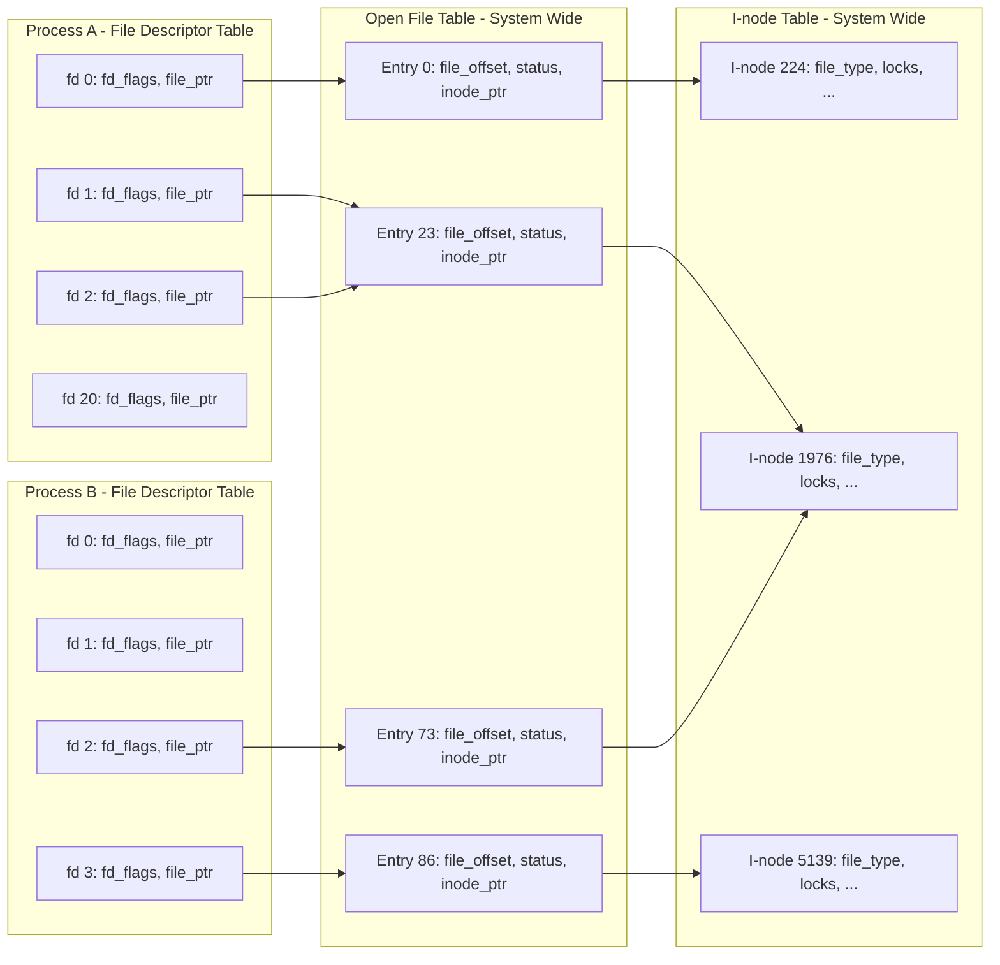
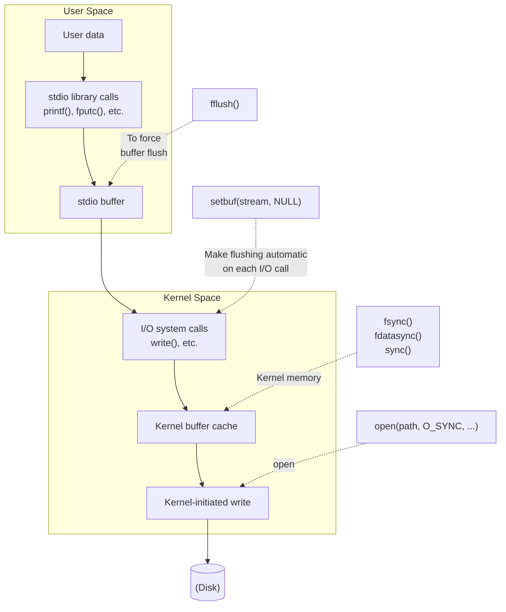
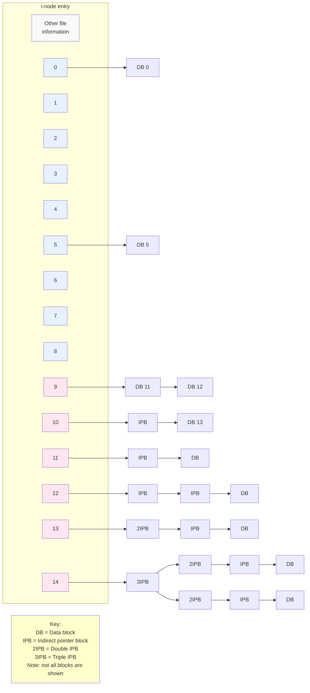
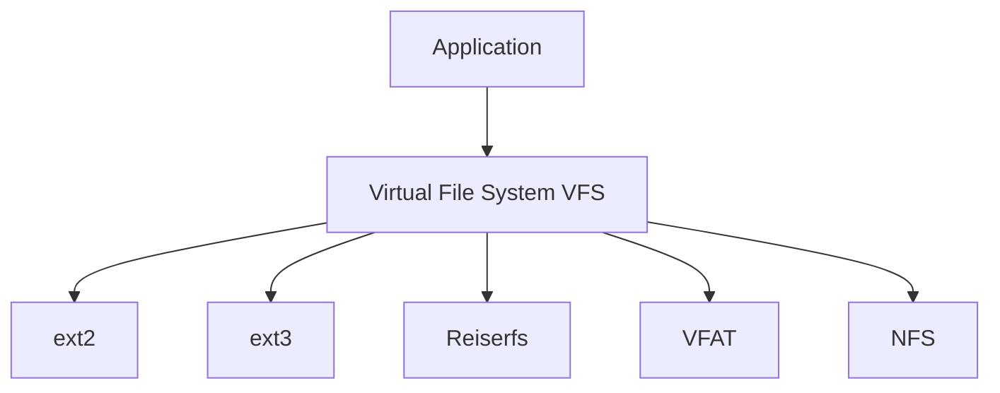
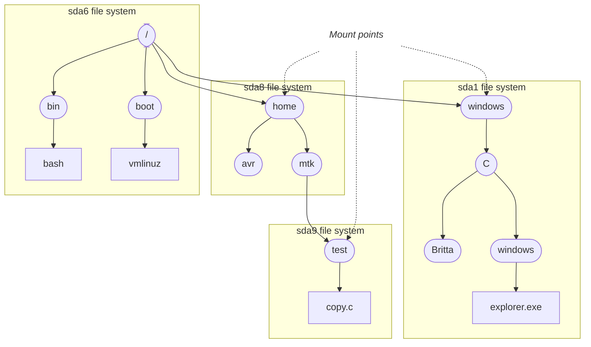
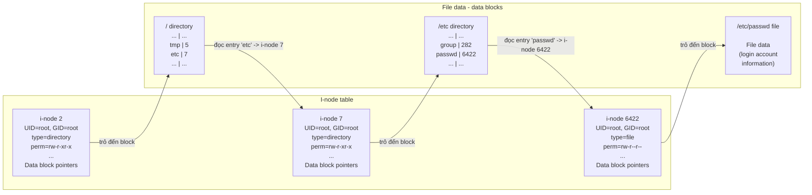
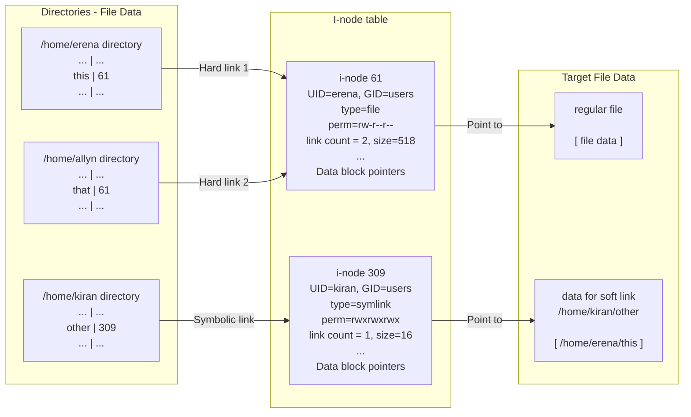

# **FILE I/O: THE UNIVERSAL I/O MODEL**

We now start to look in earnest at the system call API. Files are a good place to start, since they are central to the UNIX philosophy. The focus of this chapter is the system calls used for performing file input and output.

We introduce the concept of a file descriptor, and then look at the system calls that constitute the so-called universal I/O model. These are the system calls that open and close a file, and read and write data.

We focus on I/O on disk files. However, much of the material covered here is relevant for later chapters, since the same system calls are used for performing I/O on all types of files, such as pipes and terminals.

Chapter [5](#page-68-0) extends the discussion in this chapter with further details on file I/O. One other aspect of file I/O, buffering, is complex enough to deserve its own chapter. Chapter 13 covers I/O buffering in the kernel and in the stdio library.

## **4.1 Overview**

All system calls for performing I/O refer to open files using a file descriptor, a (usually small) nonnegative integer. File descriptors are used to refer to all types of open files, including pipes, FIFOs, sockets, terminals, devices, and regular files. Each process has its own set of file descriptors.

By convention, most programs expect to be able to use the three standard file descriptors listed in [Table 4-1](#page-49-0). These three descriptors are opened on the program's behalf by the shell, before the program is started. Or, more precisely, the program inherits copies of the shell's file descriptors, and the shell normally operates with these three file descriptors always open. (In an interactive shell, these three file descriptors normally refer to the terminal under which the shell is running.) If I/O redirections are specified on a command line, then the shell ensures that the file descriptors are suitably modified before starting the program.

<span id="page-49-0"></span>**Table 4-1:** Standard file descriptors

| File descriptor | Purpose         | POSIX name    | stdio stream |
|-----------------|-----------------|---------------|--------------|
| 0               | standard input  | STDIN_FILENO  | stdin        |
| 1               | standard output | STDOUT_FILENO | stdout       |
| 2               | standard error  | STDERR_FILENO | stderr       |

When referring to these file descriptors in a program, we can use either the numbers (0, 1, or 2) or, preferably, the POSIX standard names defined in <unistd.h>.

> Although the variables stdin, stdout, and stderr initially refer to the process's standard input, output, and error, they can be changed to refer to any file by using the freopen() library function. As part of its operation, freopen() may change the file descriptor underlying the reopened stream. In other words, after an freopen() on stdout, for example, it is no longer safe to assume that the underlying file descriptor is still 1.

The following are the four key system calls for performing file I/O (programming languages and software packages typically employ these calls only indirectly, via I/O libraries):

-  fd = open(pathname, flags, mode) opens the file identified by pathname, returning a file descriptor used to refer to the open file in subsequent calls. If the file doesn't exist, open() may create it, depending on the settings of the flags bitmask argument. The flags argument also specifies whether the file is to be opened for reading, writing, or both. The mode argument specifies the permissions to be placed on the file if it is created by this call. If the open() call is not being used to create a file, this argument is ignored and can be omitted.
-  numread = read(fd, buffer, count) reads at most count bytes from the open file referred to by fd and stores them in buffer. The read() call returns the number of bytes actually read. If no further bytes could be read (i.e., end-of-file was encountered), read() returns 0.
-  numwritten = write(fd, buffer, count) writes up to count bytes from buffer to the open file referred to by fd. The write() call returns the number of bytes actually written, which may be less than count.
-  status = close(fd) is called after all I/O has been completed, in order to release the file descriptor fd and its associated kernel resources.

Before we launch into the details of these system calls, we provide a short demonstration of their use in [Listing 4-1.](#page-50-0) This program is a simple version of the cp(1) command. It copies the contents of the existing file named in its first commandline argument to the new file named in its second command-line argument.

We can use the program in [Listing 4-1](#page-50-0) as follows:

#### \$ **./copy oldfile newfile**

#### <span id="page-50-0"></span>**Listing 4-1:** Using I/O system calls

```
–––––––––––––––––––––––––––––––––––––––––––––––––––––––––––– fileio/copy.c
#include <sys/stat.h>
#include <fcntl.h>
#include "tlpi_hdr.h"
#ifndef BUF_SIZE /* Allow "cc -D" to override definition */
#define BUF_SIZE 1024
#endif
int
main(int argc, char *argv[])
{
 int inputFd, outputFd, openFlags;
 mode_t filePerms;
 ssize_t numRead;
 char buf[BUF_SIZE];
 if (argc != 3 || strcmp(argv[1], "--help") == 0)
 usageErr("%s old-file new-file\n", argv[0]);
 /* Open input and output files */
 inputFd = open(argv[1], O_RDONLY);
 if (inputFd == -1)
 errExit("opening file %s", argv[1]);
 openFlags = O_CREAT | O_WRONLY | O_TRUNC;
 filePerms = S_IRUSR | S_IWUSR | S_IRGRP | S_IWGRP |
 S_IROTH | S_IWOTH; /* rw-rw-rw- */
 outputFd = open(argv[2], openFlags, filePerms);
 if (outputFd == -1)
 errExit("opening file %s", argv[2]);
 /* Transfer data until we encounter end of input or an error */
 while ((numRead = read(inputFd, buf, BUF_SIZE)) > 0)
 if (write(outputFd, buf, numRead) != numRead)
 fatal("couldn't write whole buffer");
 if (numRead == -1)
 errExit("read");
 if (close(inputFd) == -1)
 errExit("close input");
 if (close(outputFd) == -1)
 errExit("close output");
 exit(EXIT_SUCCESS);
}
–––––––––––––––––––––––––––––––––––––––––––––––––––––––––––– fileio/copy.c
```

## **4.2 Universality of I/O**

One of the distinguishing features of the UNIX I/O model is the concept of universality of I/O. This means that the same four system calls—open(), read(), write(), and close()—are used to perform I/O on all types of files, including devices such as terminals. Consequently, if we write a program using only these system calls, that program will work on any type of file. For example, the following are all valid uses of the program in [Listing 4-1](#page-50-0):

```
$ ./copy test test.old Copy a regular file
$ ./copy a.txt /dev/tty Copy a regular file to this terminal
$ ./copy /dev/tty b.txt Copy input from this terminal to a regular file
$ ./copy /dev/pts/16 /dev/tty Copy input from another terminal
```

Universality of I/O is achieved by ensuring that each file system and device driver implements the same set of I/O system calls. Because details specific to the file system or device are handled within the kernel, we can generally ignore device-specific factors when writing application programs. When access to specific features of a file system or device is required, a program can use the catchall ioctl() system call [\(Section 4.8\)](#page-65-0), which provides an interface to features that fall outside the universal I/O model.

# **4.3 Opening a File: open()**

The open() system call either opens an existing file or creates and opens a new file.

```
#include <sys/stat.h>
#include <fcntl.h>
int open(const char *pathname, int flags, ... /* mode_t mode */);
                               Returns file descriptor on success, or –1 on error
```

The file to be opened is identified by the pathname argument. If pathname is a symbolic link, it is dereferenced. On success, open() returns a file descriptor that is used to refer to the file in subsequent system calls. If an error occurs, open() returns –1 and errno is set accordingly.

The flags argument is a bit mask that specifies the access mode for the file, using one of the constants shown in [Table 4-2.](#page-52-0)

> Early UNIX implementations used the numbers 0, 1, and 2 instead of the names shown in Table [4-2](#page-52-0). Most modern UNIX implementations define these constants to have those values. Thus, we can see that O\_RDWR is not equivalent to O\_RDONLY | O\_WRONLY; the latter combination is a logical error.

When open() is used to create a new file, the mode bit-mask argument specifies the permissions to be placed on the file. (The mode\_t data type used to type mode is an integer type specified in SUSv3.) If the open() call doesn't specify O\_CREAT, mode can be omitted.

<span id="page-52-0"></span>**Table 4-2:** File access modes

| Access mode | Description                                |
|-------------|--------------------------------------------|
| O_RDONLY    | Open the file for reading only             |
| O_WRONLY    | Open the file for writing only             |
| O_RDWR      | Open the file for both reading and writing |

We describe file permissions in detail in Section 15.4. Later, we'll see that the permissions actually placed on a new file depend not just on the mode argument, but also on the process umask (Section 15.4.6) and the (optionally present) default access control list (Section 17.6) of the parent directory. In the meantime, we'll just note that the mode argument can be specified as a number (typically in octal) or, preferably, by ORing (|) together zero or more of the bit-mask constants listed in Table 15-4, on page 295.

[Listing 4-2](#page-52-1) shows examples of the use of open(), some of which employ additional flags bits that we describe shortly.

<span id="page-52-1"></span>**Listing 4-2:** Examples of the use of open()

```
 /* Open existing file for reading */
 fd = open("startup", O_RDONLY);
 if (fd == -1)
 errExit("open");
   /* Open new or existing file for reading and writing, truncating to zero 
      bytes; file permissions read+write for owner, nothing for all others */
 fd = open("myfile", O_RDWR | O_CREAT | O_TRUNC, S_IRUSR | S_IWUSR);
 if (fd == -1)
 errExit("open");
 /* Open new or existing file for writing; writes should always
 append to end of file */
 fd = open("w.log", O_WRONLY | O_CREAT | O_TRUNC | O_APPEND,
 S_IRUSR | S_IWUSR);
 if (fd == -1)
 errExit("open");
```

#### **File descriptor number returned by open()**

SUSv3 specifies that if open() succeeds, it is guaranteed to use the lowest-numbered unused file descriptor for the process. We can use this feature to ensure that a file is opened using a particular file descriptor. For example, the following sequence ensures that a file is opened using standard input (file descriptor 0).

```
if (close(STDIN_FILENO) == -1) /* Close file descriptor 0 */
 errExit("close");
fd = open(pathname, O_RDONLY);
if (fd == -1)
 errExit("open");
```

Since file descriptor 0 is unused, open() is guaranteed to open the file using that descriptor. In [Section 5.5](#page-75-0), we look at the use of dup2() and fcntl() to achieve a similar result, but with more flexible control over the file descriptor used. In that section, we also show an example of why it can be useful to control the file descriptor on which a file is opened.

## **4.3.1 The open() flags Argument**

<span id="page-53-0"></span>In some of the example open() calls shown in [Listing 4-2,](#page-52-1) we included other bits (O\_CREAT, O\_TRUNC, and O\_APPEND) in flags in addition to the file access mode. We now consider the flags argument in more detail. Table 4-3 summarizes the full set of constants that can be bit-wise ORed (|) in flags. The final column indicates which of these constants are standardized in SUSv3 or SUSv4.

**Table 4-3:** Values for the flags argument of open()

| Flag        | Purpose                                                          | SUS? |
|-------------|------------------------------------------------------------------|------|
| O_RDONLY    | Open for reading only                                            | v3   |
| O_WRONLY    | Open for writing only                                            | v3   |
| O_RDWR      | Open for reading and writing                                     | v3   |
| O_CLOEXEC   | Set the close-on-exec flag (since Linux 2.6.23)                  | v4   |
| O_CREAT     | Create file if it doesn't already exist                          | v3   |
| O_DIRECT    | File I/O bypasses buffer cache                                   |      |
| O_DIRECTORY | Fail if pathname is not a directory                              | v4   |
| O_EXCL      | With O_CREAT: create file exclusively                            | v3   |
| O_LARGEFILE | Used on 32-bit systems to open large files                       |      |
| O_NOATIME   | Don't update file last access time on read() (since Linux 2.6.8) |      |
| O_NOCTTY    | Don't let pathname become the controlling terminal               | v3   |
| O_NOFOLLOW  | Don't dereference symbolic links                                 | v4   |
| O_TRUNC     | Truncate existing file to zero length                            | v3   |
| O_APPEND    | Writes are always appended to end of file                        | v3   |
| O_ASYNC     | Generate a signal when I/O is possible                           |      |
| O_DSYNC     | Provide synchronized I/O data integrity (since Linux 2.6.33)     | v3   |
| O_NONBLOCK  | Open in nonblocking mode                                         | v3   |
| O_SYNC      | Make file writes synchronous                                     | v3   |

The constants in Table 4-3 are divided into the following groups:

-  File access mode flags: These are the O\_RDONLY, O\_WRONLY, and O\_RDWR flags described earlier. They can be retrieved using the fcntl() F\_GETFL operation [\(Section 5.3](#page-72-0)).
-  File creation flags: These are the flags shown in the second part of Table 4-3. They control various aspects of the behavior of the open() call, as well as options for subsequent I/O operations. These flags can't be retrieved or changed.
-  Open file status flags: These are the remaining flags in Table 4-3. They can be retrieved and modified using the fcntl() F\_GETFL and F\_SETFL operations ([Sec](#page-72-0)[tion 5.3](#page-72-0)). These flags are sometimes simply called the file status flags.

Since kernel 2.6.22, the Linux-specific files in the directory /proc/PID/fdinfo can be read to obtain information about the file descriptors of any process on the system. There is one file in this directory for each of the process's open file descriptors, with a name that matches the number of the descriptor. The pos field in this file shows the current file offset ([Section 4.7](#page-60-1)). The flags field is an octal number that shows the file access mode flags and open file status flags. (To decode this number, we need to look at the numeric values of these flags in the C library header files.)

Details for the flags constants are as follows:

#### O\_APPEND

Writes are always appended to the end of the file. We discuss the significance of this flag in [Section 5.1.](#page-69-0)

#### O\_ASYNC

Generate a signal when I/O becomes possible on the file descriptor returned by open(). This feature, termed signal-driven I/O, is available only for certain file types, such as terminals, FIFOs, and sockets. (The O\_ASYNC flag is not specified in SUSv3; however, it, or the older synonym, FASYNC, is found on most UNIX implementations.) On Linux, specifying the O\_ASYNC flag when calling open() has no effect. To enable signal-driven I/O, we must instead set this flag using the fcntl() F\_SETFL operation [\(Section 5.3](#page-72-0)). (Several other UNIX implementations behave similarly.) Refer to Section 63.3 for more information about the O\_ASYNC flag.

#### O\_CLOEXEC (since Linux 2.6.23)

Enable the close-on-exec flag (FD\_CLOEXEC) for the new file descriptor. We describe the FD\_CLOEXEC flag in Section 27.4. Using the O\_CLOEXEC flag allows a program to avoid additional fcntl() F\_SETFD and F\_SETFD operations to set the close-on-exec flag. It is also necessary in multithreaded programs to avoid the race conditions that could occur using the latter technique. These races can occur when one thread opens a file descriptor and then tries to mark it close-on-exec at the same time as another thread does a fork() and then an exec() of an arbitrary program. (Suppose that the second thread manages to both fork() and exec() between the time the first thread opens the file descriptor and uses fcntl() to set the close-on-exec flag.) Such races could result in open file descriptors being unintentionally passed to unsafe programs. (We say more about race conditions in [Section 5.1](#page-69-0).)

#### O\_CREAT

If the file doesn't already exist, it is created as a new, empty file. This flag is effective even if the file is being opened only for reading. If we specify O\_CREAT, then we must supply a mode argument in the open() call; otherwise, the permissions of the new file will be set to some random value from the stack.

#### O\_DIRECT

Allow file I/O to bypass the buffer cache. This feature is described in Section 13.6. The \_GNU\_SOURCE feature test macro must be defined in order to make this constant definition available from <fcntl.h>.

#### O\_DIRECTORY

Return an error (errno equals ENOTDIR) if pathname is not a directory. This flag is an extension designed specifically for implementing opendir() (Section 18.8). The \_GNU\_SOURCE feature test macro must be defined in order to make this constant definition available from <fcntl.h>.

#### O\_DSYNC (since Linux 2.6.33)

Perform file writes according to the requirements of synchronized I/O data integrity completion. See the discussion of kernel I/O buffering in Section 13.3.

#### O\_EXCL

This flag is used in conjunction with O\_CREAT to indicate that if the file already exists, it should not be opened; instead, open() should fail, with errno set to EEXIST. In other words, this flag allows the caller to ensure that it is the process creating the file. The check for existence and the creation of the file are performed atomically. We discuss the concept of atomicity in [Section 5.1](#page-69-0). When both O\_CREAT and O\_EXCL are specified in flags, open() fails (with the error EEXIST) if pathname is a symbolic link. SUSv3 requires this behavior so that a privileged application can create a file in a known location without there being a possibility that a symbolic link would cause the file to be created in a different location (e.g., a system directory), which would have security implications.

#### O\_LARGEFILE

Open the file with large file support. This flag is used on 32-bit systems in order to work with large files. Although it is not specified in SUSv3, the O\_LARGEFILE flag is found on several other UNIX implementations. On 64 bit Linux implementations such as Alpha and IA-64, this flag has no effect. See [Section 5.10](#page-83-0) for more information.

#### O\_NOATIME (since Linux 2.6.8)

Don't update the file last access time (the st\_atime field described in Section 15.1) when reading from this file. To use this flag, the effective user ID of the calling process must match the owner of the file, or the process must be privileged (CAP\_FOWNER); otherwise, open() fails with the error EPERM. (In reality, for an unprivileged process, it is the process's file-system user ID, rather than its effective user ID, that must match the user ID of the file when opening a file with the O\_NOATIME flag, as described in Section 9.5.) This flag is a nonstandard Linux extension. To expose its definition from <fcntl.h>, we must define the \_GNU\_SOURCE feature test macro. The O\_NOATIME flag is intended for use by indexing and backup programs. Its use can significantly reduce the amount of disk activity, because repeated disk seeks back and forth across the disk are not required to read the contents of a file and to update the last access time in the file's i-node (Section 14.4). Functionality similar to O\_NOATIME is available using the MS\_NOATIME mount() flag (Section 14.8.1) and the FS\_NOATIME\_FL flag (Section 15.5).

#### O\_NOCTTY

If the file being opened is a terminal device, prevent it from becoming the controlling terminal. Controlling terminals are discussed in Section 34.4. If the file being opened is not a terminal, this flag has no effect.

#### O\_NOFOLLOW

Normally, open() dereferences pathname if it is a symbolic link. However, if the O\_NOFOLLOW flag is specified, then open() fails (with errno set to ELOOP) if pathname is a symbolic link. This flag is useful, especially in privileged programs, for ensuring that open() doesn't dereference a symbolic link. To expose the definition of this flag from <fcntl.h>, we must define the \_GNU\_SOURCE feature test macro.

#### O\_NONBLOCK

Open the file in nonblocking mode. See [Section 5.9](#page-82-0).

#### O\_SYNC

Open the file for synchronous I/O. See the discussion of kernel I/O buffering in Section 13.3.

#### O\_TRUNC

If the file already exists and is a regular file, then truncate it to zero length, destroying any existing data. On Linux, truncation occurs whether the file is being opened for reading or writing (in both cases, we must have write permission on the file). SUSv3 leaves the combination of O\_RDONLY and O\_TRUNC unspecified, but most other UNIX implementations behave in the same way as Linux.

## **4.3.2 Errors from open()**

If an error occurs while trying to open the file, open() returns –1, and errno identifies the cause of the error. The following are some possible errors that can occur (in addition to those already noted when describing the flags argument above):

#### EACCES

The file permissions don't allow the calling process to open the file in the mode specified by flags. Alternatively, because of directory permissions, the file could not be accessed, or the file did not exist and could not be created.

EISDIR

The specified file is a directory, and the caller attempted to open it for writing. This isn't allowed. (On the other hand, there are occasions when it can be useful to open a directory for reading. We consider an example in Section 18.11.)

EMFILE

The process resource limit on the number of open file descriptors has been reached (RLIMIT\_NOFILE, described in Section 36.3).

ENFILE

The system-wide limit on the number of open files has been reached.

ENOENT

The specified file doesn't exist, and O\_CREAT was not specified, or O\_CREAT was specified, and one of the directories in pathname doesn't exist or is a symbolic link pointing to a nonexistent pathname (a dangling link).

EROFS

The specified file is on a read-only file system and the caller tried to open it for writing.

ETXTBSY

The specified file is an executable file (a program) that is currently executing. It is not permitted to modify (i.e., open for writing) the executable file associated with a running program. (We must first terminate the program in order to be able to modify the executable file.)

When we later describe other system calls or library functions, we generally won't list the range of possible errors that may occur in the above fashion. (Such a list can be found in the corresponding manual page for each system call or library function.) We do so here for two reasons. One of these is that open() is the first system call that we describe in detail, and the above list illustrates that a system call or library function may fail for any of a number of reasons. Second, the specific reasons why open() may fail make an interesting list in themselves, illustrating a number of factors and checks that come into play when a file is accessed. (The above list is incomplete: see the open(2) manual page for more reasons why open() may fail.)

# **4.3.3 The creat() System Call**

In early UNIX implementations, open() had only two arguments and could not be used to create a new file. Instead, the creat() system call was used to create and open a new file.

```
#include <fcntl.h>
int creat(const char *pathname, mode_t mode);
                                          Returns file descriptor, or –1 on error
```

The creat() system call creates and opens a new file with the given pathname, or if the file already exists, opens the file and truncates it to zero length. As its function result, creat() returns a file descriptor that can be used in subsequent system calls. Calling creat() is equivalent to the following open() call:

```
fd = open(pathname, O_WRONLY | O_CREAT | O_TRUNC, mode);
```

Because the open() flags argument provides greater control over how the file is opened (e.g., we can specify O\_RDWR instead of O\_WRONLY), creat() is now obsolete, although it may still be seen in older programs.

# **4.4 Reading from a File: read()**

The read() system call reads data from the open file referred to by the descriptor fd.

```
#include <unistd.h>
ssize_t read(int fd, void *buffer, size_t count);
                        Returns number of bytes read, 0 on EOF, or –1 on error
```

The count argument specifies the maximum number of bytes to read. (The size\_t data type is an unsigned integer type.) The buffer argument supplies the address of the memory buffer into which the input data is to be placed. This buffer must be at least count bytes long.

> System calls don't allocate memory for buffers that are used to return information to the caller. Instead, we must pass a pointer to a previously allocated memory buffer of the correct size. This contrasts with several library functions that do allocate memory buffers in order to return information to the caller.

A successful call to read() returns the number of bytes actually read, or 0 if end-offile is encountered. On error, the usual –1 is returned. The ssize\_t data type is a signed integer type used to hold a byte count or a –1 error indication.

A call to read() may read less than the requested number of bytes. For a regular file, the probable reason for this is that we were close to the end of the file.

When read() is applied to other types of files—such as pipes, FIFOs, sockets, or terminals—there are also various circumstances where it may read fewer bytes than requested. For example, by default, a read() from a terminal reads characters only up to the next newline (\n) character. We consider these cases when we cover other file types in subsequent chapters.

Using read() to input a series of characters from, say, a terminal, we might expect the following code to work:

```
#define MAX_READ 20
char buffer[MAX_READ];
if (read(STDIN_FILENO, buffer, MAX_READ) == -1)
 errExit("read");
printf("The input data was: %s\n", buffer);
```

The output from this piece of code is likely to be strange, since it will probably include characters in addition to the string actually entered. This is because read() doesn't place a terminating null byte at the end of the string that printf() is being asked to print. A moment's reflection leads us to realize that this must be so, since read() can be used to read any sequence of bytes from a file. In some cases, this input might be text, but in other cases, the input might be binary integers or C structures in binary form. There is no way for read() to tell the difference, and so it can't attend to the C convention of null terminating character strings. If a terminating null byte is required at the end of the input buffer, we must put it there explicitly:

```
char buffer[MAX_READ + 1];
ssize_t numRead;
numRead = read(STDIN_FILENO, buffer, MAX_READ);
if (numRead == -1)
 errExit("read");
buffer[numRead] = '\0';
printf("The input data was: %s\n", buffer);
```

Because the terminating null byte requires a byte of memory, the size of buffer must be at least one greater than the largest string we expect to read.

# **4.5 Writing to a File: write()**

The write() system call writes data to an open file.

```
#include <unistd.h>
ssize_t write(int fd, void *buffer, size_t count);
                                Returns number of bytes written, or –1 on error
```

The arguments to write() are similar to those for read(): buffer is the address of the data to be written; count is the number of bytes to write from buffer; and fd is a file descriptor referring to the file to which data is to be written.

On success, write() returns the number of bytes actually written; this may be less than count. For a disk file, possible reasons for such a partial write are that the disk was filled or that the process resource limit on file sizes was reached. (The relevant limit is RLIMIT\_FSIZE, described in Section 36.3.)

When performing I/O on a disk file, a successful return from write() doesn't guarantee that the data has been transferred to disk, because the kernel performs buffering of disk I/O in order to reduce disk activity and expedite write() calls. We consider the details in Chapter 13.

# **4.6 Closing a File: close()**

The close() system call closes an open file descriptor, freeing it for subsequent reuse by the process. When a process terminates, all of its open file descriptors are automatically closed.

```
#include <unistd.h>
int close(int fd);
                                              Returns 0 on success, or –1 on error
```

It is usually good practice to close unneeded file descriptors explicitly, since this makes our code more readable and reliable in the face of subsequent modifications. Furthermore, file descriptors are a consumable resource, so failure to close a file descriptor could result in a process running out of descriptors. This is a particularly important issue when writing long-lived programs that deal with multiple files, such as shells or network servers.

Just like every other system call, a call to close() should be bracketed with errorchecking code, such as the following:

```
if (close(fd) == -1)
 errExit("close");
```

This catches errors such as attempting to close an unopened file descriptor or close the same file descriptor twice, and catches error conditions that a specific file system may diagnose during a close operation.

> NFS (Network File System) provides an example of an error that is specific to a file system. If an NFS commit failure occurs, meaning that the data did not reach the remote disk, then this error is propagated to the application as a failure in the close() call.

## <span id="page-60-1"></span>**4.7 Changing the File Offset: lseek()**

<span id="page-60-0"></span>For each open file, the kernel records a file offset, sometimes also called the readwrite offset or pointer. This is the location in the file at which the next read() or write() will commence. The file offset is expressed as an ordinal byte position relative to the start of the file. The first byte of the file is at offset 0.

The file offset is set to point to the start of the file when the file is opened and is automatically adjusted by each subsequent call to read() or write() so that it points to the next byte of the file after the byte(s) just read or written. Thus, successive read() and write() calls progress sequentially through a file.

The lseek() system call adjusts the file offset of the open file referred to by the file descriptor fd, according to the values specified in offset and whence.

```
#include <unistd.h>
off_t lseek(int fd, off_t offset, int whence);
                               Returns new file offset if successful, or –1 on error
```

The offset argument specifies a value in bytes. (The off\_t data type is a signed integer type specified by SUSv3.) The whence argument indicates the base point from which offset is to be interpreted, and is one of the following values:

SEEK\_SET

The file offset is set offset bytes from the beginning of the file.

SEEK\_CUR

The file offset is adjusted by offset bytes relative to the current file offset.

SEEK\_END

The file offset is set to the size of the file plus offset. In other words, offset is interpreted with respect to the next byte after the last byte of the file.

Figure 4-1 shows how the whence argument is interpreted.

In earlier UNIX implementations, the integers 0, 1, and 2 were used, rather than the SEEK\_\* constants shown in the main text. Older versions of BSD used different names for these values: L\_SET, L\_INCR, and L\_XTND.

```txt
                      File containing N bytes of data
        <-------------------------------------------------------->

byte
number      0     1     ...     ...     N-2     N-1     N     N+1
           +-----+-----+-----+-----+-----+-----+-----+-----+-----+
           |  0  |  1  | ... | ... | N-2 | N-1 |     |     |     |
           +-----+-----+-----+-----+-----+-----+-----+-----+-----+
                                                  ^     ^
                                                  |     |
                                           Unwritten bytes
                                               past EOF

                              ^
                              |
                       Current file offset
```

**Figure 4-1:** Interpreting the whence argument of lseek()

If whence is SEEK\_CUR or SEEK\_END, offset may be negative or positive; for SEEK\_SET, offset must be nonnegative.

The return value from a successful lseek() is the new file offset. The following call retrieves the current location of the file offset without changing it:

```
curr = lseek(fd, 0, SEEK_CUR);
```

Some UNIX implementations (but not Linux) have the nonstandard tell(fd) function, which serves the same purpose as the above lseek() call.

Here are some other examples of lseek() calls, along with comments indicating where the file offset is moved to:

```
lseek(fd, 0, SEEK_SET); /* Start of file */
lseek(fd, 0, SEEK_END); /* Next byte after the end of the file */
lseek(fd, -1, SEEK_END); /* Last byte of file */
lseek(fd, -10, SEEK_CUR); /* Ten bytes prior to current location */
lseek(fd, 10000, SEEK_END); /* 10001 bytes past last byte of file */
```

Calling lseek() simply adjusts the kernel's record of the file offset associated with a file descriptor. It does not cause any physical device access.

We describe some further details of the relationship between file offsets, file descriptors, and open files in Section [5.4](#page-73-0).

We can't apply lseek() to all types of files. Applying lseek() to a pipe, FIFO, socket, or terminal is not permitted; lseek() fails, with errno set to ESPIPE. On the other hand, it is possible to apply lseek() to devices where it is sensible to do so. For example, it is possible to seek to a specified location on a disk or tape device.

> The l in the name lseek() derives from the fact that the offset argument and the return value were both originally typed as long. Early UNIX implementations provided a seek() system call, which typed these values as int.

#### **File holes**

What happens if a program seeks past the end of a file, and then performs I/O? A call to read() will return 0, indicating end-of-file. Somewhat surprisingly, it is possible to write bytes at an arbitrary point past the end of the file.

The space in between the previous end of the file and the newly written bytes is referred to as a file hole. From a programming point of view, the bytes in a hole exist, and reading from the hole returns a buffer of bytes containing 0 (null bytes).

File holes don't, however, take up any disk space. The file system doesn't allocate any disk blocks for a hole until, at some later point, data is written into it. The main advantage of file holes is that a sparsely populated file consumes less disk space than would otherwise be required if the null bytes actually needed to be allocated in disk blocks. Core dump files (Section 22.1) are common examples of files that contain large holes.

> The statement that file holes don't consume disk space needs to be qualified slightly. On most file systems, file space is allocated in units of blocks (Section 14.3). The size of a block depends on the file system, but is typically something like 1024, 2048, or 4096 bytes. If the edge of a hole falls within a block, rather than on a block boundary, then a complete block is allocated to store the data in the other part of the block, and the part corresponding to the hole is filled with null bytes.

Most native UNIX file systems support the concept of file holes, but many nonnative file systems (e.g., Microsoft's VFAT) do not. On a file system that doesn't support holes, explicit null bytes are written to the file.

The existence of holes means that a file's nominal size may be larger than the amount of disk storage it utilizes (in some cases, considerably larger). Writing bytes into the middle of the file hole will decrease the amount of free disk space as the kernel allocates blocks to fill the hole, even though the file's size doesn't change. Such a scenario is uncommon, but nevertheless one to be aware of.

> SUSv3 specifies a function, posix\_fallocate(fd, offset, len), that ensures that space is allocated on disk for the byte range specified by offset and len for the disk file referred to by the descriptor fd. This allows an application to be sure that a later write() to the file won't fail because disk space is exhausted (which could otherwise occur if a hole in the file was filled in, or some other application consumed space on the disk). Historically, the glibc implementation of this function achieved the desired result by writing a 0 byte into each block in the specified range. Since version 2.6.23, Linux provides an fallocate() system call, which provides a more efficient way of ensuring that the necessary space is allocated, and the glibc posix\_fallocate() implementation makes use of this system call when it is available.

Section 14.4 describes how holes are represented in a file, and Section 15.1 describes the stat() system call, which can tell us the current size of a file, as well as the number of blocks actually allocated to the file.

#### **Example program**

[Listing 4-3](#page-63-0) demonstrates the use of lseek() in conjunction with read() and write(). The first command-line argument to this program is the name of a file to be opened. The remaining arguments specify I/O operations to be performed on the file. Each of these operations consists of a letter followed by an associated value (with no separating space):

-  soffset: Seek to byte offset from the start of the file.
-  rlength: Read length bytes from the file, starting at the current file offset, and display them in text form.
-  Rlength: Read length bytes from the file, starting at the current file offset, and display them in hexadecimal.
-  wstr: Write the string of characters specified in str at the current file offset.

<span id="page-63-0"></span>**Listing 4-3:** Demonstration of read(), write(), and lseek()

```
––––––––––––––––––––––––––––––––––––––––––––––––––––––––– fileio/seek_io.c
#include <sys/stat.h>
#include <fcntl.h>
#include <ctype.h>
#include "tlpi_hdr.h"
int
main(int argc, char *argv[])
{
 size_t len;
 off_t offset;
 int fd, ap, j;
 char *buf;
 ssize_t numRead, numWritten;
 if (argc < 3 || strcmp(argv[1], "--help") == 0)
 usageErr("%s file {r<length>|R<length>|w<string>|s<offset>}...\n",
 argv[0]);
 fd = open(argv[1], O_RDWR | O_CREAT,
 S_IRUSR | S_IWUSR | S_IRGRP | S_IWGRP |
 S_IROTH | S_IWOTH); /* rw-rw-rw- */
 if (fd == -1)
 errExit("open");
 for (ap = 2; ap < argc; ap++) {
 switch (argv[ap][0]) {
 case 'r': /* Display bytes at current offset, as text */
 case 'R': /* Display bytes at current offset, in hex */
 len = getLong(&argv[ap][1], GN_ANY_BASE, argv[ap]);
```

```
 buf = malloc(len);
 if (buf == NULL)
 errExit("malloc");
 numRead = read(fd, buf, len);
 if (numRead == -1)
 errExit("read");
 if (numRead == 0) {
 printf("%s: end-of-file\n", argv[ap]);
 } else {
 printf("%s: ", argv[ap]);
 for (j = 0; j < numRead; j++) {
 if (argv[ap][0] == 'r')
 printf("%c", isprint((unsigned char) buf[j]) ?
 buf[j] : '?');
 else
 printf("%02x ", (unsigned int) buf[j]);
 }
 printf("\n");
 }
 free(buf);
 break;
 case 'w': /* Write string at current offset */
 numWritten = write(fd, &argv[ap][1], strlen(&argv[ap][1]));
 if (numWritten == -1)
 errExit("write");
 printf("%s: wrote %ld bytes\n", argv[ap], (long) numWritten);
 break;
 case 's': /* Change file offset */
 offset = getLong(&argv[ap][1], GN_ANY_BASE, argv[ap]);
 if (lseek(fd, offset, SEEK_SET) == -1)
 errExit("lseek");
 printf("%s: seek succeeded\n", argv[ap]);
 break;
 default:
 cmdLineErr("Argument must start with [rRws]: %s\n", argv[ap]);
 }
 }
 exit(EXIT_SUCCESS);
}
––––––––––––––––––––––––––––––––––––––––––––––––––––––––– fileio/seek_io.c
```

The following shell session log demonstrates the use of the program in Listing [4-3,](#page-63-0) showing what happens when we attempt to read bytes from a file hole:

```
$ touch tfile Create new, empty file
$ ./seek_io tfile s100000 wabc Seek to offset 100,000, write "abc"
s100000: seek succeeded
wabc: wrote 3 bytes
```

\$ **ls -l tfile** Check size of file -rw-r--r-- 1 mtk users 100003 Feb 10 10:35 tfile s10000: seek succeeded

\$ **./seek\_io tfile s10000 R5** Seek to offset 10,000, read 5 bytes from hole

R5: 00 00 00 00 00 Bytes in the hole contain 0

# <span id="page-65-0"></span>**4.8 Operations Outside the Universal I/O Model: ioctl()**

The ioctl() system call is a general-purpose mechanism for performing file and device operations that fall outside the universal I/O model described earlier in this chapter.

```
#include <sys/ioctl.h>
int ioctl(int fd, int request, ... /* argp */);
                   Value returned on success depends on request, or –1 on error
```

The fd argument is an open file descriptor for the device or file upon which the control operation specified by request is to be performed. Device-specific header files define constants that can be passed in the request argument.

As indicated by the standard C ellipsis (...) notation, the third argument to ioctl(), which we label argp, can be of any type. The value of the request argument enables ioctl() to determine what type of value to expect in argp. Typically, argp is a pointer to either an integer or a structure; in some cases, it is unused.

We'll see a number of uses for ioctl() in later chapters (see, for example, Section 15.5).

> The only specification that SUSv3 makes for ioctl() is for operations to control STREAMS devices. (The STREAMS facility is a System V feature that is not supported by the mainline Linux kernel, although a few add-on implementations have been developed.) None of the other ioctl() operations described in this book is specified in SUSv3. However, the ioctl() call has been part of the UNIX system since early versions, and consequently several of the ioctl() operations that we describe are provided on many other UNIX implementations. As we describe each ioctl() operation, we note portability issues.

# **4.9 Summary**

In order to perform I/O on a regular file, we must first obtain a file descriptor using open(). I/O is then performed using read() and write(). After performing all I/O, we should free the file descriptor and its associated resources using close(). These system calls can be used to perform I/O on all types of files.

The fact that all file types and device drivers implement the same I/O interface allows for universality of I/O, meaning that a program can typically be used with any type of file without requiring code that is specific to the file type.

For each open file, the kernel maintains a file offset, which determines the location at which the next read or write will occur. The file offset is implicitly updated by reads and writes. Using lseek(), we can explicitly reposition the file offset to any location within the file or past the end of the file. Writing data at a position beyond the previous end of the file creates a hole in the file. Reads from a file hole return bytes containing zeros.

The ioctl() system call is a catchall for device and file operations that don't fit into the standard file I/O model.

## **4.10 Exercises**

- **4-1.** The tee command reads its standard input until end-of-file, writing a copy of the input to standard output and to the file named in its command-line argument. (We show an example of the use of this command when we discuss FIFOs in Section 44.7.) Implement tee using I/O system calls. By default, tee overwrites any existing file with the given name. Implement the –a command-line option (tee –a file), which causes tee to append text to the end of a file if it already exists. (Refer to Appendix B for a description of the getopt() function, which can be used to parse command-line options.)
- **4-2.** Write a program like cp that, when used to copy a regular file that contains holes (sequences of null bytes), also creates corresponding holes in the target file.

# <span id="page-68-0"></span>**FILE I/O: FURTHER DETAILS**

In this chapter, we extend the discussion of file I/O that we started in the previous chapter.

In continuing the discussion of the open() system call, we explain the concept of atomicity—the notion that the actions performed by a system call are executed as a single uninterruptible step. This is a necessary requirement for the correct operation of many system calls.

We introduce another file-related system call, the multipurpose fcntl(), and show one of its uses: fetching and setting open file status flags.

Next, we look at the kernel data structures used to represent file descriptors and open files. Understanding the relationship between these structures clarifies some of the subtleties of file I/O discussed in subsequent chapters. Building on this model, we then explain how to duplicate file descriptors.

We then consider some system calls that provide extended read and write functionality. These system calls allow us to perform I/O at a specific location in a file without changing the file offset, and to transfer data to and from multiple buffers in a program.

We briefly introduce the concept of nonblocking I/O, and describe some extensions provided to support I/O on very large files.

Since temporary files are used by many system programs, we'll also look at some library functions that allow us to create and use temporary files with randomly generated unique names.

## <span id="page-69-2"></span>**5.1 Atomicity and Race Conditions**

<span id="page-69-0"></span>Atomicity is a concept that we'll encounter repeatedly when discussing the operation of system calls. All system calls are executed atomically. By this, we mean that the kernel guarantees that all of the steps in a system call are completed as a single operation, without being interrupted by another process or thread.

Atomicity is essential to the successful completion of some operations. In particular, it allows us to avoid race conditions (sometimes known as race hazards). A race condition is a situation where the result produced by two processes (or threads) operating on shared resources depends in an unexpected way on the relative order in which the processes gain access to the CPU(s).

In the next few pages, we look at two situations involving file I/O where race conditions occur, and show how these conditions are eliminated through the use of open() flags that guarantee the atomicity of the relevant file operations.

We revisit the topic of race conditions when we describe sigsuspend() in Section 22.9 and fork() in Section 24.4.

## **Creating a file exclusively**

In Section [4.3.1,](#page-53-0) we noted that specifying O\_EXCL in conjunction with O\_CREAT causes open() to return an error if the file already exists. This provides a way for a process to ensure that it is the creator of a file. The check on the prior existence of the file and the creation of the file are performed atomically. To see why this is important, consider the code shown in [Listing 5-1](#page-69-1), which we might resort to in the absence of the O\_EXCL flag. (In this code, we display the process ID returned by the getpid() system call, which enables us to distinguish the output of two different runs of this program.)

<span id="page-69-1"></span>**Listing 5-1:** Incorrect code to exclusively open a file

```
–––––––––––––––––––––––––––––––––––––––––––– from fileio/bad_exclusive_open.c
fd = open(argv[1], O_WRONLY); /* Open 1: check if file exists */
 if (fd != -1) { /* Open succeeded */
 printf("[PID %ld] File \"%s\" already exists\n",
 (long) getpid(), argv[1]);
 close(fd);
 } else {
 if (errno != ENOENT) { /* Failed for unexpected reason */
 errExit("open");
 } else {
 /* WINDOW FOR FAILURE */
 fd = open(argv[1], O_WRONLY | O_CREAT, S_IRUSR | S_IWUSR);
 if (fd == -1)
 errExit("open");
 printf("[PID %ld] Created file \"%s\" exclusively\n",
 (long) getpid(), argv[1]); /* MAY NOT BE TRUE! */
 }
 }
–––––––––––––––––––––––––––––––––––––––––––– from fileio/bad_exclusive_open.c
```

Aside from the long-winded use of two calls to open(), the code in [Listing 5-1](#page-69-1) also contains a bug. Suppose that when our process first called open(), the file did not exist, but by the time of the second open(), some other process had created the file. This could happen if the kernel scheduler decided that the process's time slice had expired and gave control to another process, as shown in [Figure 5-1,](#page-70-0) or if the two processes were running at the same time on a multiprocessor system. [Figure 5-1](#page-70-0) portrays the case where two processes are both executing the code shown in [List](#page-69-1)[ing 5-1.](#page-69-1) In this scenario, process A would wrongly conclude that it had created the file, since the second open() succeeds whether or not the file exists.

While the chance of the process wrongly believing it was the creator of the file is relatively small, the possibility that it may occur nevertheless renders this code unreliable. The fact that the outcome of these operations depends on the order of scheduling of the two processes means that this is a race condition.

```txt
Process A                                    Process B
    |                                            |
    |                                            |
    v                                            |
┌─────────────────────┐                         |
│ open(..., O_WRONLY) │                         |
└─────────────────────┘                         |
    |                                            |
    | open() fails                               |
    |                                            |
    |  time slice            ||    time slice    |
    |  expires               ||    begins        |
    |                        ||                  |
    ├────────────────────────||──────────────────┤
    :                                            v
    :                                    ┌─────────────────────┐
    :                                    │ open(..., O_WRONLY) │
    :                                    └─────────────────────┘
    :                                            |
    :                                            | open() fails
    :                                            |
    :                                            v
    :                                    ┌──────────────────────┐
    :                                    │ open(..., O_WRONLY   │
    :                                    │      | O_CREAT, ...) │
    :                                    └──────────────────────┘
    :                                            |
    :                                            | open() succeeds,
    :                                            | file created
    :                                            |
    :  time slice            ||    time slice    |
    :  begins                ||    ends          |
    :                        ||                  |
    ├────────────────────────||──────────────────┤
    v                                            :
┌──────────────────────┐                        :
│ open(..., O_WRONLY   │                        :
│      | O_CREAT, ...) │                        :
└──────────────────────┘                        :
    |                                            :
    | open() succeeds                            :
    v                                            :


Key:
───►  Executing on CPU
- - ►  Waiting for CPU
```

<span id="page-70-0"></span>**Figure 5-1:** Failing to exclusively create a file

To demonstrate that there is indeed a problem with this code, we could replace the commented line WINDOW FOR FAILURE in [Listing 5-1](#page-69-1) with a piece of code that creates an artificially long delay between the check for file existence and the creation of the file:

```
printf("[PID %ld] File \"%s\" doesn't exist yet\n", (long) getpid(), argv[1]);
if (argc > 2) { /* Delay between check and create */
 sleep(5); /* Suspend execution for 5 seconds */
 printf("[PID %ld] Done sleeping\n", (long) getpid());
}
```

The sleep() library function suspends the execution of a process for a specified number of seconds. We discuss this function in Section 23.4.

If we run two simultaneous instances of the program in [Listing 5-1](#page-69-1), we see that they both claim to have exclusively created the file:

```
$ ./bad_exclusive_open tfile sleep &
[PID 3317] File "tfile" doesn't exist yet
[1] 3317
$ ./bad_exclusive_open tfile
[PID 3318] File "tfile" doesn't exist yet
[PID 3318] Created file "tfile" exclusively
$ [PID 3317] Done sleeping
[PID 3317] Created file "tfile" exclusively Not true
```

In the penultimate line of the above output, we see the shell prompt mixed with output from the first instance of the test program.

Both processes claim to have created the file because the code of the first process was interrupted between the existence check and the creation of the file. Using a single open() call that specifies the O\_CREAT and O\_EXCL flags prevents this possibility by guaranteeing that the check and creation steps are carried out as a single atomic (i.e., uninterruptible) operation.

### **Appending data to a file**

A second example of the need for atomicity is when we have multiple processes appending data to the same file (e.g., a global log file). For this purpose, we might consider using a piece of code such as the following in each of our writers:

```
if (lseek(fd, 0, SEEK_END) == -1)
 errExit("lseek");
if (write(fd, buf, len) != len)
 fatal("Partial/failed write");
```

However, this code suffers the same defect as the previous example. If the first process executing the code is interrupted between the lseek() and write() calls by a second process doing the same thing, then both processes will set their file offset to the same location before writing, and when the first process is rescheduled, it will overwrite the data already written by the second process. Again, this is a race condition because the results depend on the order of scheduling of the two processes.

Avoiding this problem requires that the seek to the next byte past the end of the file and the write operation happen atomically. This is what opening a file with the O\_APPEND flag guarantees.

> Some file systems (e.g., NFS) don't support O\_APPEND. In this case, the kernel reverts to the nonatomic sequence of calls shown above, with the consequent possibility of file corruption as just described.

# **5.2 File Control Operations: fcntl()**

The fcntl() system call performs a range of control operations on an open file descriptor.

```
#include <fcntl.h>
int fcntl(int fd, int cmd, ...);
                             Return on success depends on cmd, or –1 on error
```

The cmd argument can specify a wide range of operations. We examine some of them in the following sections, and delay examination of others until later chapters.

As indicated by the ellipsis, the third argument to fcntl() can be of different types, or it can be omitted. The kernel uses the value of the cmd argument to determine the data type (if any) to expect for this argument.

# <span id="page-72-1"></span>**5.3 Open File Status Flags**

<span id="page-72-0"></span>One use of fcntl() is to retrieve or modify the access mode and open file status flags of an open file. (These are the values set by the flags argument specified in the call to open().) To retrieve these settings, we specify cmd as F\_GETFL:

```
int flags, accessMode;
flags = fcntl(fd, F_GETFL); /* Third argument is not required */
if (flags == -1)
 errExit("fcntl");
```

After the above piece of code, we could test if the file was opened for synchronized writes as follows:

```
if (flags & O_SYNC)
 printf("writes are synchronized\n");
```

SUSv3 requires that only status flags that were specified during an open() or a later fcntl() F\_SETFL should be set on an open file. However, Linux deviates from this in one respect: if an application was compiled using one of the techniques described in [Section 5.10](#page-83-1) for opening large files, then O\_LARGEFILE will always be set in the flags retrieved by F\_GETFL.

Checking the access mode of the file is slightly more complex, since the O\_RDONLY (0), O\_WRONLY (1), and O\_RDWR (2) constants don't correspond to single bits in the open file status flags. Therefore, to make this check, we mask the flags value with the constant O\_ACCMODE, and then test for equality with one of the constants:

```
accessMode = flags & O_ACCMODE;
if (accessMode == O_WRONLY || accessMode == O_RDWR)
 printf("file is writable\n");
```

We can use the fcntl() F\_SETFL command to modify some of the open file status flags. The flags that can be modified are O\_APPEND, O\_NONBLOCK, O\_NOATIME, O\_ASYNC, and O\_DIRECT. Attempts to modify other flags are ignored. (Some other UNIX implementations allow fcntl() to modify other flags, such as O\_SYNC.)

Using fcntl() to modify open file status flags is particularly useful in the following cases:

-  The file was not opened by the calling program, so that it had no control over the flags used in the open() call (e.g., the file may be one of the three standard descriptors that are opened before the program is started).
-  The file descriptor was obtained from a system call other than open(). Examples of such system calls are pipe(), which creates a pipe and returns two file descriptors referring to either end of the pipe, and socket(), which creates a socket and returns a file descriptor referring to the socket.

To modify the open file status flags, we use fcntl() to retrieve a copy of the existing flags, then modify the bits we wish to change, and finally make a further call to fcntl() to update the flags. Thus, to enable the O\_APPEND flag, we would write the following:

```
int flags;
flags = fcntl(fd, F_GETFL);
if (flags == -1)
 errExit("fcntl");
flags |= O_APPEND;
if (fcntl(fd, F_SETFL, flags) == -1)
 errExit("fcntl");
```

# **5.4 Relationship Between File Descriptors and Open Files**

<span id="page-73-0"></span>Up until now, it may have appeared that there is a one-to-one correspondence between a file descriptor and an open file. However, this is not the case. It is possible and useful—to have multiple descriptors referring to the same open file. These file descriptors may be open in the same process or in different processes.

To understand what is going on, we need to examine three data structures maintained by the kernel:

-  the per-process file descriptor table;
-  the system-wide table of open file descriptions; and
-  the file system i-node table.

For each process, the kernel maintains a table of open file descriptors. Each entry in this table records information about a single file descriptor, including:

-  a set of flags controlling the operation of the file descriptor (there is just one such flag, the close-on-exec flag, which we describe in Section 27.4); and
-  a reference to the open file description.

The kernel maintains a system-wide table of all open file descriptions. (This table is sometimes referred to as the open file table, and its entries are sometimes called open file handles.) An open file description stores all information relating to an open file, including:

 the current file offset (as updated by read() and write(), or explicitly modified using lseek());

-  status flags specified when opening the file (i.e., the flags argument to open());
-  the file access mode (read-only, write-only, or read-write, as specified in open());
-  settings relating to signal-driven I/O (Section 63.3); and
-  a reference to the i-node object for this file.

Each file system has a table of i-nodes for all files residing in the file system. The i-node structure, and file systems in general, are discussed in more detail in Chapter 14. For now, we note that the i-node for each file includes the following information:

-  file type (e.g., regular file, socket, or FIFO) and permissions;
-  a pointer to a list of locks held on this file; and
-  various properties of the file, including its size and timestamps relating to different types of file operations.

Here, we are overlooking the distinction between on-disk and in-memory representations of an i-node. The on-disk i-node records the persistent attributes of a file, such as its type, permissions, and timestamps. When a file is accessed, an in-memory copy of the i-node is created, and this version of the i-node records a count of the open file descriptions referring to the i-node and the major and minor IDs of the device from which the i-node was copied. The inmemory i-node also records various ephemeral attributes that are associated with a file while it is open, such as file locks.

[Figure 5-2](#page-74-0) illustrates the relationship between file descriptors, open file descriptions, and i-nodes. In this diagram, two processes have a number of open file descriptors.



<span id="page-74-0"></span>**Figure 5-2:** Relationship between file descriptors, open file descriptions, and i-nodes

In process A, descriptors 1 and 20 both refer to the same open file description (labeled 23). This situation may arise as a result of a call to dup(), dup2(), or fcntl() (see [Section 5.5\)](#page-75-1).

Descriptor 2 of process A and descriptor 2 of process B refer to a single open file description (73). This scenario could occur after a call to fork() (i.e., process A is the parent of process B, or vice versa), or if one process passed an open descriptor to another process using a UNIX domain socket (Section 61.13.3).

Finally, we see that descriptor 0 of process A and descriptor 3 of process B refer to different open file descriptions, but that these descriptions refer to the same i-node table entry (1976)—in other words, to the same file. This occurs because each process independently called open() for the same file. A similar situation could occur if a single process opened the same file twice.

We can draw a number of implications from the preceding discussion:

-  Two different file descriptors that refer to the same open file description share a file offset value. Therefore, if the file offset is changed via one file descriptor (as a consequence of calls to read(), write(), or lseek()), this change is visible through the other file descriptor. This applies both when the two file descriptors belong to the same process and when they belong to different processes.
-  Similar scope rules apply when retrieving and changing the open file status flags (e.g., O\_APPEND, O\_NONBLOCK, and O\_ASYNC) using the fcntl() F\_GETFL and F\_SETFL operations.
-  By contrast, the file descriptor flags (i.e., the close-on-exec flag) are private to the process and file descriptor. Modifying these flags does not affect other file descriptors in the same process or a different process.

## <span id="page-75-1"></span>**5.5 Duplicating File Descriptors**

<span id="page-75-0"></span>Using the (Bourne shell) I/O redirection syntax 2>&1 informs the shell that we wish to have standard error (file descriptor 2) redirected to the same place to which standard output (file descriptor 1) is being sent. Thus, the following command would (since the shell evaluates I/O directions from left to right) send both standard output and standard error to the file results.log:

#### \$ **./myscript > results.log 2>&1**

The shell achieves the redirection of standard error by duplicating file descriptor 2 so that it refers to the same open file description as file descriptor 1 (in the same way that descriptors 1 and 20 of process A refer to the same open file description in [Figure 5-2\)](#page-74-0). This effect can be achieved using the dup() and dup2() system calls.

Note that it is not sufficient for the shell simply to open the results.log file twice: once on descriptor 1 and once on descriptor 2. One reason for this is that the two file descriptors would not share a file offset pointer, and hence could end up overwriting each other's output. Another reason is that the file may not be a disk file. Consider the following command, which sends standard error down the same pipe as standard output:

#### \$ **./myscript 2>&1 | less**

The dup() call takes oldfd, an open file descriptor, and returns a new descriptor that refers to the same open file description. The new descriptor is guaranteed to be the lowest unused file descriptor.

```
#include <unistd.h>
int dup(int oldfd);
                          Returns (new) file descriptor on success, or –1 on error
```

Suppose we make the following call:

```
newfd = dup(1);
```

Assuming the normal situation where the shell has opened file descriptors 0, 1, and 2 on the program's behalf, and no other descriptors are in use, dup() will create the duplicate of descriptor 1 using file 3.

If we wanted the duplicate to be descriptor 2, we could use the following technique:

```
close(2); /* Frees file descriptor 2 */
newfd = dup(1); /* Should reuse file descriptor 2 */
```

This code works only if descriptor 0 was open. To make the above code simpler, and to ensure we always get the file descriptor we want, we can use dup2().

```
#include <unistd.h>
int dup2(int oldfd, int newfd);
                         Returns (new) file descriptor on success, or –1 on error
```

The dup2() system call makes a duplicate of the file descriptor given in oldfd using the descriptor number supplied in newfd. If the file descriptor specified in newfd is already open, dup2() closes it first. (Any error that occurs during this close is silently ignored; safer programming practice is to explicitly close() newfd if it is open before the call to dup2().)

We could simplify the preceding calls to close() and dup() to the following:

```
dup2(1, 2);
```

A successful dup2() call returns the number of the duplicate descriptor (i.e., the value passed in newfd).

If oldfd is not a valid file descriptor, then dup2() fails with the error EBADF and newfd is not closed. If oldfd is a valid file descriptor, and oldfd and newfd have the same value, then dup2() does nothing—newfd is not closed, and dup2() returns the newfd as its function result.

A further interface that provides some extra flexibility for duplicating file descriptors is the fcntl() F\_DUPFD operation:

```
newfd = fcntl(oldfd, F_DUPFD, startfd);
```

This call makes a duplicate of oldfd by using the lowest unused file descriptor greater than or equal to startfd. This is useful if we want a guarantee that the new descriptor (newfd) falls in a certain range of values. Calls to dup() and dup2() can always be recoded as calls to close() and fcntl(), although the former calls are more concise. (Note also that some of the errno error codes returned by dup2() and fcntl() differ, as described in the manual pages.)

From [Figure 5-2](#page-74-0), we can see that duplicate file descriptors share the same file offset value and status flags in their shared open file description. However, the new file descriptor has its own set of file descriptor flags, and its close-on-exec flag (FD\_CLOEXEC) is always turned off. The interfaces that we describe next allow explicit control of the new file descriptor's close-on-exec flag.

The dup3() system call performs the same task as dup2(), but adds an additional argument, flags, that is a bit mask that modifies the behavior of the system call.

```
#define _GNU_SOURCE
#include <unistd.h>
int dup3(int oldfd, int newfd, int flags);
                          Returns (new) file descriptor on success, or –1 on error
```

Currently, dup3() supports one flag, O\_CLOEXEC, which causes the kernel to enable the close-on-exec flag (FD\_CLOEXEC) for the new file descriptor. This flag is useful for the same reasons as the open() O\_CLOEXEC flag described in [Section 4.3.1.](#page-53-0)

The dup3() system call is new in Linux 2.6.27, and is Linux-specific.

Since Linux 2.6.24, Linux also supports an additional fcntl() operation for duplicating file descriptors: F\_DUPFD\_CLOEXEC. This flag does the same thing as F\_DUPFD, but additionally sets the close-on-exec flag (FD\_CLOEXEC) for the new file descriptor. Again, this operation is useful for the same reasons as the open() O\_CLOEXEC flag. F\_DUPFD\_CLOEXEC is not specified in SUSv3, but is specified in SUSv4.

# **5.6 File I/O at a Specified Offset: pread() and pwrite()**

The pread() and pwrite() system calls operate just like read() and write(), except that the file I/O is performed at the location specified by offset, rather than at the current file offset. The file offset is left unchanged by these calls.

```
#include <unistd.h>
ssize_t pread(int fd, void *buf, size_t count, off_t offset);
                        Returns number of bytes read, 0 on EOF, or –1 on error
ssize_t pwrite(int fd, const void *buf, size_t count, off_t offset);
                                Returns number of bytes written, or –1 on error
```

Calling pread() is equivalent to atomically performing the following calls:

```
off_t orig;
orig = lseek(fd, 0, SEEK_CUR); /* Save current offset */
lseek(fd, offset, SEEK_SET);
s = read(fd, buf, len);
lseek(fd, orig, SEEK_SET); /* Restore original file offset */
```

For both pread() and pwrite(), the file referred to by fd must be seekable (i.e., a file descriptor on which it is permissible to call lseek()).

These system calls can be particularly useful in multithreaded applications. As we'll see in Chapter 29, all of the threads in a process share the same file descriptor table. This means that the file offset for each open file is global to all threads. Using pread() or pwrite(), multiple threads can simultaneously perform I/O on the same file descriptor without being affected by changes made to the file offset by other threads. If we attempted to use lseek() plus read() (or write()) instead, then we would create a race condition similar to the one that we described when discussing the O\_APPEND flag in [Section 5.1](#page-69-2). (The pread() and pwrite() system calls can similarly be useful for avoiding race conditions in applications where multiple processes have file descriptors referring to the same open file description.)

> If we are repeatedly performing lseek() calls followed by file I/O, then the pread() and pwrite() system calls can also offer a performance advantage in some cases. This is because the cost of a single pread() (or pwrite()) system call is less than the cost of two system calls: lseek() and read() (or write()). However, the cost of system calls is usually dwarfed by the time required to actually perform I/O.

# **5.7 Scatter-Gather I/O: readv() and writev()**

The readv() and writev() system calls perform scatter-gather I/O.

```
#include <sys/uio.h>
ssize_t readv(int fd, const struct iovec *iov, int iovcnt);
                        Returns number of bytes read, 0 on EOF, or –1 on error
ssize_t writev(int fd, const struct iovec *iov, int iovcnt);
                                Returns number of bytes written, or –1 on error
```

Instead of accepting a single buffer of data to be read or written, these functions transfer multiple buffers of data in a single system call. The set of buffers to be transferred is defined by the array iov. The integer count specifies the number of elements in iov. Each element of iov is a structure of the following form:

```
struct iovec {
 void *iov_base; /* Start address of buffer */
 size_t iov_len; /* Number of bytes to transfer to/from buffer */
};
```

SUSv3 allows an implementation to place a limit on the number of elements in iov. An implementation can advertise its limit by defining IOV\_MAX in <limits.h> or at run time via the return from the call sysconf(\_SC\_IOV\_MAX). (We describe sysconf() in Section 11.2.) SUSv3 requires that this limit be at least 16. On Linux, IOV\_MAX is defined as 1024, which corresponds to the kernel's limit on the size of this vector (defined by the kernel constant UIO\_MAXIOV).

However, the glibc wrapper functions for readv() and writev() silently do some extra work. If the system call fails because iovcnt is too large, then the wrapper function temporarily allocates a single buffer large enough to hold all of the items described by iov and performs a read() or write() call (see the discussion below of how writev() could be implemented in terms of write()).

Figure 5-3 shows an example of the relationship between the iov and iovcnt arguments, and the buffers to which they refer.

```text 
iowcnt          iov
  ┌───┐    ┌────────────────────┐              ┌──────────┐
  │ 3 │    │ iov_base           │─────────────>│  buffer0 │
  └───┘    │ iov_len = len0     │<─────len0────┤          │
       [0] └────────────────────┘              └──────────┘
           ┌────────────────────┐              ┌──────────┐
           │ iov_base           │─────────────>│  buffer1 │
           │ iov_len = len1     │<─────len1────┤          │
       [1] └────────────────────┘              └──────────┘
           ┌────────────────────┐              ┌──────────────────┐
           │ iov_base           │─────────────>│     buffer2      │
           │ iov_len = len2     │<─────len2────┤                  │
       [2] └────────────────────┘              └──────────────────┘
```

**Figure 5-3:** Example of an iovec array and associated buffers

#### **Scatter input**

The readv() system call performs scatter input: it reads a contiguous sequence of bytes from the file referred to by the file descriptor fd and places ("scatters") these bytes into the buffers specified by iov. Each of the buffers, starting with the one defined by iov[0], is completely filled before readv() proceeds to the next buffer.

An important property of readv() is that it completes atomically; that is, from the point of view of the calling process, the kernel performs a single data transfer between the file referred to by fd and user memory. This means, for example, that when reading from a file, we can be sure that the range of bytes read is contiguous, even if another process (or thread) sharing the same file offset attempts to manipulate the offset at the same time as the readv() call.

On successful completion, readv() returns the number of bytes read, or 0 if end-of-file was encountered. The caller must examine this count to verify whether all requested bytes were read. If insufficient data was available, then only some of the buffers may have been filled, and the last of these may be only partially filled.

[Listing 5-2](#page-80-0) demonstrates the use of readv().

Using the prefix t\_ followed by a function name as the name of an example program (e.g., t\_readv.c in Listing [5-2\)](#page-80-0) is our way of indicating that the program primarily demonstrates the use of a single system call or library function.

```
–––––––––––––––––––––––––––––––––––––––––––––––––––––––––– fileio/t_readv.c
#include <sys/stat.h>
#include <sys/uio.h>
#include <fcntl.h>
#include "tlpi_hdr.h"
int
main(int argc, char *argv[])
{
 int fd;
 struct iovec iov[3];
 struct stat myStruct; /* First buffer */
 int x; /* Second buffer */
#define STR_SIZE 100
 char str[STR_SIZE]; /* Third buffer */
 ssize_t numRead, totRequired;
 if (argc != 2 || strcmp(argv[1], "--help") == 0)
 usageErr("%s file\n", argv[0]);
 fd = open(argv[1], O_RDONLY);
 if (fd == -1)
 errExit("open");
 totRequired = 0;
 iov[0].iov_base = &myStruct;
 iov[0].iov_len = sizeof(struct stat);
 totRequired += iov[0].iov_len;
 iov[1].iov_base = &x;
 iov[1].iov_len = sizeof(x);
 totRequired += iov[1].iov_len;
 iov[2].iov_base = str;
 iov[2].iov_len = STR_SIZE;
 totRequired += iov[2].iov_len;
 numRead = readv(fd, iov, 3);
 if (numRead == -1)
 errExit("readv");
 if (numRead < totRequired)
 printf("Read fewer bytes than requested\n");
 printf("total bytes requested: %ld; bytes read: %ld\n",
 (long) totRequired, (long) numRead);
 exit(EXIT_SUCCESS);
}
–––––––––––––––––––––––––––––––––––––––––––––––––––––––––– fileio/t_readv.c
```

#### **Gather output**

The writev() system call performs gather output. It concatenates ("gathers") data from all of the buffers specified by iov and writes them as a sequence of contiguous bytes to the file referred to by the file descriptor fd. The buffers are gathered in array order, starting with the buffer defined by iov[0].

Like readv(), writev() completes atomically, with all data being transferred in a single operation from user memory to the file referred to by fd. Thus, when writing to a regular file, we can be sure that all of the requested data is written contiguously to the file, rather than being interspersed with writes by other processes (or threads).

As with write(), a partial write is possible. Therefore, we must check the return value from writev() to see if all requested bytes were written.

The primary advantages of readv() and writev() are convenience and speed. For example, we could replace a call to writev() by either:

-  code that allocates a single large buffer, copies the data to be written from other locations in the process's address space into that buffer, and then calls write() to output the buffer; or
-  a series of write() calls that output the buffers individually.

The first of these options, while semantically equivalent to using writev(), leaves us with the inconvenience (and inefficiency) of allocating buffers and copying data in user space.

The second option is not semantically equivalent to a single call to writev(), since the write() calls are not performed atomically. Furthermore, performing a single writev() system call is cheaper than performing multiple write() calls (refer to the discussion of system calls in [Section 3.1\)](#page-22-0).

## **Performing scatter-gather I/O at a specified offset**

Linux 2.6.30 adds two new system calls that combine scatter-gather I/O functionality with the ability to perform the I/O at a specified offset: preadv() and pwritev(). These system calls are nonstandard, but are also available on the modern BSDs.

```
#define _BSD_SOURCE
#include <sys/uio.h>
ssize_t preadv(int fd, const struct iovec *iov, int iovcnt, off_t offset);
                        Returns number of bytes read, 0 on EOF, or –1 on error
ssize_t pwritev(int fd, const struct iovec *iov, int iovcnt, off_t offset);
                                Returns number of bytes written, or –1 on error
```

The preadv() and pwritev() system calls perform the same task as readv() and writev(), but perform the I/O at the file location specified by offset (like pread() and pwrite()).

These system calls are useful for applications (e.g., multithreaded applications) that want to combine the benefits of scatter-gather I/O with the ability to perform I/O at a location that is independent of the current file offset.

# **5.8 Truncating a File: truncate() and ftruncate()**

The truncate() and ftruncate() system calls set the size of a file to the value specified by length.

```
#include <unistd.h>
int truncate(const char *pathname, off_t length);
int ftruncate(int fd, off_t length);
                                         Both return 0 on success, or –1 on error
```

If the file is longer than length, the excess data is lost. If the file is currently shorter than length, it is extended by padding with a sequence of null bytes or a hole.

The difference between the two system calls lies in how the file is specified. With truncate(), the file, which must be accessible and writable, is specified as a pathname string. If pathname is a symbolic link, it is dereferenced. The ftruncate() system call takes a descriptor for a file that has been opened for writing. It doesn't change the file offset for the file.

If the length argument to ftruncate() exceeds the current file size, SUSv3 allows two possible behaviors: either the file is extended (as on Linux) or the system call returns an error. XSI-conformant systems must adopt the former behavior. SUSv3 requires that truncate() always extend the file if length is greater than the current file size.

> The truncate() system call is unique in being the only system call that can change the contents of a file without first obtaining a descriptor for the file via open() (or by some other means).

# **5.9 Nonblocking I/O**

<span id="page-82-0"></span>Specifying the O\_NONBLOCK flag when opening a file serves two purposes:

-  If the file can't be opened immediately, then open() returns an error instead of blocking. One case where open() can block is with FIFOs (Section 44.7).
-  After a successful open(), subsequent I/O operations are also nonblocking. If an I/O system call can't complete immediately, then either a partial data transfer is performed or the system call fails with one of the errors EAGAIN or EWOULDBLOCK. Which error is returned depends on the system call. On Linux, as on many UNIX implementations, these two error constants are synonymous.

Nonblocking mode can be used with devices (e.g., terminals and pseudoterminals), pipes, FIFOs, and sockets. (Because file descriptors for pipes and sockets are not obtained using open(), we must enable this flag using the fcntl() F\_SETFL operation described in [Section 5.3](#page-72-1).)

O\_NONBLOCK is generally ignored for regular files, because the kernel buffer cache ensures that I/O on regular files does not block, as described in Section 13.1. However, O\_NONBLOCK does have an effect for regular files when mandatory file locking is employed (Section 55.4).

We say more about nonblocking I/O in Section 44.9 and in Chapter 63.

Historically, System V–derived implementations provided the O\_NDELAY flag, with similar semantics to O\_NONBLOCK. The main difference was that a nonblocking write() on System V returned 0 if a write() could not be completed or if no input was available to satisfy a read(). This behavior was problematic for read() because it was indistinguishable from an end-of-file condition, and so the first POSIX.1 standard introduced O\_NONBLOCK. Some UNIX implementations continue to provide the O\_NDELAY flag with the old semantics. On Linux, the O\_NDELAY constant is defined, but it is synonymous with O\_NONBLOCK.

## <span id="page-83-1"></span>**5.10 I/O on Large Files**

<span id="page-83-0"></span>The off\_t data type used to hold a file offset is typically implemented as a signed long integer. (A signed data type is required because the value –1 is used for representing error conditions.) On 32-bit architectures (such as x86-32) this would limit the size of files to 231–1 bytes (i.e., 2 GB).

However, the capacity of disk drives long ago exceeded this limit, and thus the need arose for 32-bit UNIX implementations to handle files larger than this size. Since this is a problem common to many implementations, a consortium of UNIX vendors cooperated on the Large File Summit (LFS), to enhance the SUSv2 specification with the extra functionality required to access large files. We outline the LFS enhancements in this section. (The complete LFS specification, finalized in 1996, can be found at http://opengroup.org/platform/lfs.html.)

Linux has provided LFS support on 32-bit systems since kernel 2.4 (glibc 2.2 or later is also required). In addition, the corresponding file system must also support large files. Most native Linux file systems provide this support, but some nonnative file systems do not (notable examples are Microsoft's VFAT and NFSv2, both of which impose hard limits of 2 GB, regardless of whether the LFS extensions are employed).

> Because long integers use 64 bits on 64-bit architectures (e.g., Alpha, IA-64), these architectures generally don't suffer the limitations that the LFS enhancements were designed to address. Nevertheless, the implementation details of some native Linux file systems mean that the theoretical maximum size of a file may be less than 263–1, even on 64-bit systems. In most cases, these limits are much higher than current disk sizes, so they don't impose a practical limitation on file sizes.

We can write applications requiring LFS functionality in one of two ways:

-  Use an alternative API that supports large files. This API was designed by the LFS as a "transitional extension" to the Single UNIX Specification. Thus, this API is not required to be present on systems conforming to SUSv2 or SUSv3, but many conforming systems do provide it. This approach is now obsolete.
-  Define the \_FILE\_OFFSET\_BITS macro with the value 64 when compiling our programs. This is the preferred approach, because it allows conforming applications to obtain LFS functionality without making any source code changes.

## **The transitional LFS API**

To use the transitional LFS API, we must define the \_LARGEFILE64\_SOURCE feature test macro when compiling our program, either on the command line, or within the source file before including any header files. This API provides functions capable of handling 64-bit file sizes and offsets. These functions have the same names as their 32-bit counterparts, but have the suffix 64 appended to the function name. Among these functions are fopen64(), open64(), lseek64(), truncate64(), stat64(), mmap64(), and setrlimit64(). (We've already described some of the 32-bit counterparts of these functions; others are described in later chapters.)

In order to access a large file, we simply use the 64-bit version of the function. For example, to open a large file, we could write the following:

```
fd = open64(name, O_CREAT | O_RDWR, mode);
if (fd == -1)
 errExit("open");
```

Calling open64() is equivalent to specifying the O\_LARGEFILE flag when calling open(). Attempts to open a file larger than 2 GB by calling open() without this flag return an error.

In addition to the aforementioned functions, the transitional LFS API adds some new data types, including:

-  struct stat64: an analog of the stat structure (Section 15.1) allowing for large file sizes.
-  off64\_t: a 64-bit type for representing file offsets.

The off64\_t data type is used with (among others) the lseek64() function, as shown in Listing 5-3. This program takes two command-line arguments: the name of a file to be opened and an integer value specifying a file offset. The program opens the specified file, seeks to the given file offset, and then writes a string. The following shell session demonstrates the use of the program to seek to a very large offset in the file (greater than 10 GB) and then write some bytes:

```
$ ./large_file x 10111222333
$ ls -l x Check size of resulting file
-rw------- 1 mtk users 10111222337 Mar 4 13:34 x
```

**Listing 5-3:** Accessing large files

––––––––––––––––––––––––––––––––––––––––––––––––––––––– **fileio/large\_file.c**

```
#define _LARGEFILE64_SOURCE
#include <sys/stat.h>
#include <fcntl.h>
#include "tlpi_hdr.h"
int
main(int argc, char *argv[])
{
 int fd;
 off64_t off;
```

```
 if (argc != 3 || strcmp(argv[1], "--help") == 0)
 usageErr("%s pathname offset\n", argv[0]);
 fd = open64(argv[1], O_RDWR | O_CREAT, S_IRUSR | S_IWUSR);
 if (fd == -1)
 errExit("open64");
 off = atoll(argv[2]);
 if (lseek64(fd, off, SEEK_SET) == -1)
 errExit("lseek64");
 if (write(fd, "test", 4) == -1)
 errExit("write");
 exit(EXIT_SUCCESS);
}
––––––––––––––––––––––––––––––––––––––––––––––––––––––– fileio/large_file.c
```

#### **The \_FILE\_OFFSET\_BITS macro**

The recommended method of obtaining LFS functionality is to define the macro \_FILE\_OFFSET\_BITS with the value 64 when compiling a program. One way to do this is via a command-line option to the C compiler:

```
$ cc -D_FILE_OFFSET_BITS=64 prog.c
```

Alternatively, we can define this macro in the C source before including any header files:

```
#define _FILE_OFFSET_BITS 64
```

This automatically converts all of the relevant 32-bit functions and data types into their 64-bit counterparts. Thus, for example, calls to open() are actually converted into calls to open64(), and the off\_t data type is defined to be 64 bits long. In other words, we can recompile an existing program to handle large files without needing to make any changes to the source code.

Using \_FILE\_OFFSET\_BITS is clearly simpler than using the transitional LFS API, but this approach relies on applications being cleanly written (e.g., correctly using off\_t to declare variables holding file offsets, rather than using a native C integer type).

The \_FILE\_OFFSET\_BITS macro is not required by the LFS specification, which merely mentions this macro as an optional method of specifying the size of the off\_t data type. Some UNIX implementations use a different feature test macro to obtain this functionality.

> If we attempt to access a large file using 32-bit functions (i.e., from a program compiled without setting \_FILE\_OFFSET\_BITS to 64), then we may encounter the error EOVERFLOW. For example, this error can occur if we attempt to use the 32-bit version of stat() (Section 15.1) to retrieve information about a file whose size exceeds 2 GB.

## **Passing off\_t values to printf()**

One problem that the LFS extensions don't solve for us is how to pass off\_t values to printf() calls. In [Section 3.6.2](#page-42-0), we noted that the portable method of displaying values of one of the predefined system data types (e.g., pid\_t or uid\_t) was to cast that value to long, and use the %ld printf() specifier. However, if we are employing the LFS extensions, then this is often not sufficient for the off\_t data type, because it may be defined as a type larger than long, typically long long. Therefore, to display a value of type off\_t, we cast it to long long and use the %lld printf() specifier, as in the following:

```
#define _FILE_OFFSET_BITS 64
off_t offset; /* Will be 64 bits, the size of 'long long' */
/* Other code assigning a value to 'offset' */
printf("offset=%lld\n", (long long) offset);
```

Similar remarks also apply for the related blkcnt\_t data type, which is employed in the stat structure (described in Section 15.1).

> If we are passing function arguments of the types off\_t or stat between separately compiled modules, then we need to ensure that both modules use the same sizes for these types (i.e., either both were compiled with \_FILE\_OFFSET\_BITS set to 64 or both were compiled without this setting).

# **5.11 The /dev/fd Directory**

For each process, the kernel provides the special virtual directory /dev/fd. This directory contains filenames of the form /dev/fd/n, where n is a number corresponding to one of the open file descriptors for the process. Thus, for example, /dev/fd/0 is standard input for the process. (The /dev/fd feature is not specified by SUSv3, but several other UNIX implementations provide this feature.)

Opening one of the files in the /dev/fd directory is equivalent to duplicating the corresponding file descriptor. Thus, the following statements are equivalent:

```
fd = open("/dev/fd/1", O_WRONLY);
fd = dup(1); /* Duplicate standard output */
```

The flags argument of the open() call is interpreted, so that we should take care to specify the same access mode as was used by the original descriptor. Specifying other flags, such as O\_CREAT, is meaningless (and ignored) in this context.

> /dev/fd is actually a symbolic link to the Linux-specific /proc/self/fd directory. The latter directory is a special case of the Linux-specific /proc/PID/fd directories, each of which contains symbolic links corresponding to all of the files held open by a process.

The files in the /dev/fd directory are rarely used within programs. Their most common use is in the shell. Many user-level commands take filename arguments, and sometimes we would like to put them in a pipeline and have one of the arguments be standard input or output instead. For this purpose, some programs (e.g., diff, ed, tar, and comm) have evolved the hack of using an argument consisting of a single hyphen (-) to mean "use standard input or output (as appropriate) for this filename argument." Thus, to compare a file list from ls against a previously built file list, we might write the following:

#### \$ **ls | diff - oldfilelist**

This approach has various problems. First, it requires specific interpretation of the hyphen character on the part of each program, and many programs don't perform such interpretation; they are written to work only with filename arguments, and they have no means of specifying standard input or output as the files with which they are to work. Second, some programs instead interpret a single hyphen as a delimiter marking the end of command-line options.

Using /dev/fd eliminates these difficulties, allowing the specification of standard input, output, and error as filename arguments to any program requiring them. Thus, we can write the previous shell command as follows:

#### \$ **ls | diff /dev/fd/0 oldfilelist**

As a convenience, the names /dev/stdin, /dev/stdout, and /dev/stderr are provided as symbolic links to, respectively, /dev/fd/0, /dev/fd/1, and /dev/fd/2.

## **5.12 Creating Temporary Files**

Some programs need to create temporary files that are used only while the program is running, and these files should be removed when the program terminates. For example, many compilers create temporary files during the compilation process. The GNU C library provides a range of library functions for this purpose. (The variety is, in part, a consequence of inheritance from various other UNIX implementations.) Here, we describe two of these functions: mkstemp() and tmpfile().

The mkstemp() function generates a unique filename based on a template supplied by the caller and opens the file, returning a file descriptor that can be used with I/O system calls.

```
#include <stdlib.h>
int mkstemp(char *template);
                                Returns file descriptor on success, or –1 on error
```

The template argument takes the form of a pathname in which the last 6 characters must be XXXXXX. These 6 characters are replaced with a string that makes the filename unique, and this modified string is returned via the template argument. Because template is modified, it must be specified as a character array, rather than as a string constant.

The mkstemp() function creates the file with read and write permissions for the file owner (and no permissions for other users), and opens it with the O\_EXCL flag, guaranteeing that the caller has exclusive access to the file.

Typically, a temporary file is unlinked (deleted) soon after it is opened, using the unlink() system call (Section 18.3). Thus, we could employ mkstemp() as follows:

```
int fd;
char template[] = "/tmp/somestringXXXXXX";
fd = mkstemp(template);
if (fd == -1)
 errExit("mkstemp");
printf("Generated filename was: %s\n", template);
unlink(template); /* Name disappears immediately, but the file
 is removed only after close() */
/* Use file I/O system calls - read(), write(), and so on */
if (close(fd) == -1)
 errExit("close");
```

The tmpnam(), tempnam(), and mktemp() functions can also be used to generate unique filenames. However, these functions should be avoided because they can create security holes in an application. See the manual pages for further details on these functions.

The tmpfile() function creates a uniquely named temporary file that is opened for reading and writing. (The file is opened with the O\_EXCL flag to guard against the unlikely possibility that another process has already created a file with the same name.)

```
#include <stdio.h>
FILE *tmpfile(void);
                                 Returns file pointer on success, or NULL on error
```

On success, tmpfile() returns a file stream that can be used with the stdio library functions. The temporary file is automatically deleted when it is closed. To do this, tmpfile() makes an internal call to unlink() to remove the filename immediately after opening the file.

# **5.13 Summary**

In the course of this chapter, we introduced the concept of atomicity, which is crucial to the correct operation of some system calls. In particular, the open() O\_EXCL flag allows the caller to ensure that it is the creator of a file, and the open() O\_APPEND flag ensures that multiple processes appending data to the same file don't overwrite each other's output.

The fcntl() system call performs a variety of file control operations, including changing open file status flags and duplicating file descriptors. Duplicating file descriptors is also possible using dup() and dup2().

We looked at the relationship between file descriptors, open file descriptions, and file i-nodes, and noted that different information is associated with each of these three objects. Duplicate file descriptors refer to the same open file description, and thus share open file status flags and the file offset.

We described a number of system calls that extend the functionality of the conventional read() and write() system calls. The pread() and pwrite() system calls perform I/O at a specified file location without changing the file offset. The readv() and writev() calls perform scatter-gather I/O. The preadv() and pwritev() calls combine scatter-gather I/O functionality with the ability to perform I/O at a specified file location.

The truncate() and ftruncate() system calls can be used to decrease the size of a file, discarding the excess bytes, or to increase the size, padding with a zero-filled file hole.

We briefly introduced the concept of nonblocking I/O, and we'll return to it in later chapters.

The LFS specification defines a set of extensions that allow processes running on 32-bit systems to perform operations on files whose size is too large to be represented in 32 bits.

The numbered files in the /dev/fd virtual directory allow a process to access its own open files via file descriptor numbers, which can be particularly useful in shell commands.

The mkstemp() and tmpfile() functions allow an application to create temporary files.

# **5.14 Exercises**

- **5-1.** Modify the program in Listing 5-3 to use standard file I/O system calls (open() and lseek()) and the off\_t data type. Compile the program with the \_FILE\_OFFSET\_BITS macro set to 64, and test it to show that a large file can be successfully created.
- **5-2.** Write a program that opens an existing file for writing with the O\_APPEND flag, and then seeks to the beginning of the file before writing some data. Where does the data appear in the file? Why?
- **5-3.** This exercise is designed to demonstrate why the atomicity guaranteed by opening a file with the O\_APPEND flag is necessary. Write a program that takes up to three command-line arguments:

#### \$ **atomic\_append** *filename num-bytes* [*x*]

This file should open the specified filename (creating it if necessary) and append num-bytes bytes to the file by using write() to write a byte at a time. By default, the program should open the file with the O\_APPEND flag, but if a third command-line argument (x) is supplied, then the O\_APPEND flag should be omitted, and instead the program should perform an lseek(fd, 0, SEEK\_END) call before each write(). Run two instances of this program at the same time without the x argument to write 1 million bytes to the same file:

```
$ atomic_append f1 1000000 & atomic_append f1 1000000
```

Repeat the same steps, writing to a different file, but this time specifying the x argument:

```
$ atomic_append f2 1000000 x & atomic_append f2 1000000 x
```

List the sizes of the files f1 and f2 using ls –l and explain the difference.

- **5-4.** Implement dup() and dup2() using fcntl() and, where necessary, close(). (You may ignore the fact that dup2() and fcntl() return different errno values for some error cases.) For dup2(), remember to handle the special case where oldfd equals newfd. In this case, you should check whether oldfd is valid, which can be done by, for example, checking if fcntl(oldfd, F\_GETFL) succeeds. If oldfd is not valid, then the function should return –1 with errno set to EBADF.
- **5-5.** Write a program to verify that duplicated file descriptors share a file offset value and open file status flags.
- **5-6.** After each of the calls to write() in the following code, explain what the content of the output file would be, and why:

```
fd1 = open(file, O_RDWR | O_CREAT | O_TRUNC, S_IRUSR | S_IWUSR);
fd2 = dup(fd1);
fd3 = open(file, O_RDWR);
write(fd1, "Hello,", 6);
write(fd2, "world", 6);
lseek(fd2, 0, SEEK_SET);
write(fd1, "HELLO,", 6);
write(fd3, "Gidday", 6);
```

**5-7.** Implement readv() and writev() using read(), write(), and suitable functions from the malloc package (Section 7.1.2).

# <span id="page-0-0"></span>**FILE I/O BUFFERING**

In the interests of speed and efficiency, I/O system calls (i.e., the kernel) and the I/O functions of the standard C library (i.e., the stdio functions) buffer data when operating on disk files. In this chapter, we describe both types of buffering and consider how they affect application performance. We also look at various techniques for influencing and disabling both types of buffering, and look at a technique called direct I/O, which is useful for bypassing kernel buffering in certain circumstances.

# **13.1 Kernel Buffering of File I/O: The Buffer Cache**

<span id="page-0-1"></span>When working with disk files, the read() and write() system calls don't directly initiate disk access. Instead, they simply copy data between a user-space buffer and a buffer in the kernel buffer cache. For example, the following call transfers 3 bytes of data from a buffer in user-space memory to a buffer in kernel space:

```
write(fd, "abc", 3);
```

At this point, write() returns. At some later point, the kernel writes (flushes) its buffer to the disk. (Hence, we say that the system call is not synchronized with the disk operation.) If, in the interim, another process attempts to read these bytes of the file, then the kernel automatically supplies the data from the buffer cache, rather than from (the outdated contents of) the file.

Correspondingly, for input, the kernel reads data from the disk and stores it in a kernel buffer. Calls to read() fetch data from this buffer until it is exhausted, at which point the kernel reads the next segment of the file into the buffer cache. (This is a simplification; for sequential file access, the kernel typically performs read-ahead to try to ensure that the next blocks of a file are read into the buffer cache before the reading process requires them. We say a bit more about readahead in Section [13.5](#page-11-0).)

The aim of this design is to allow read() and write() to be fast, since they don't need to wait on a (slow) disk operation. This design is also efficient, since it reduces the number of disk transfers that the kernel must perform.

The Linux kernel imposes no fixed upper limit on the size of the buffer cache. The kernel will allocate as many buffer cache pages as are required, limited only by the amount of available physical memory and the demands for physical memory for other purposes (e.g., holding the text and data pages required by running processes). If available memory is scarce, then the kernel flushes some modified buffer cache pages to disk, in order to free those pages for reuse.

> Speaking more precisely, from kernel 2.4 onward, Linux no longer maintains a separate buffer cache. Instead, file I/O buffers are included in the page cache, which, for example, also contains pages from memory-mapped files. Nevertheless, in the discussion in the main text, we use the term buffer cache, since that term is historically common on UNIX implementations.

### **Effect of buffer size on I/O system call performance**

The kernel performs the same number of disk accesses, regardless of whether we perform 1000 writes of a single byte or a single write of a 1000 bytes. However, the latter is preferable, since it requires a single system call, while the former requires 1000. Although much faster than disk operations, system calls nevertheless take an appreciable amount of time, since the kernel must trap the call, check the validity of the system call arguments, and transfer data between user space and kernel space (refer to Section 3.1 for further details).

The impact of performing file I/O using different buffer sizes can be seen by running the program in Listing 4-1 (on page 71) with different BUF\_SIZE values. (The BUF\_SIZE constant specifies how many bytes are transferred by each call to read() and write().) Table 13-1 shows the time that this program requires to copy a file of 100 million bytes on a Linux ext2 file system using different BUF\_SIZE values. Note the following points concerning the information in this table:

-  The Elapsed and Total CPU time columns have the obvious meanings. The User CPU and System CPU columns show a breakdown of the Total CPU time into, respectively, the time spent executing code in user mode and the time spent executing kernel code (i.e., system calls).
-  The tests shown in the table were performed using a vanilla 2.6.30 kernel on an ext2 file system with a block size of 4096 bytes.

When we talk about a vanilla kernel, we mean an unpatched mainline kernel. This is in contrast to kernels that are supplied by most distributors, which often include various patches to fix bugs or add features.

 Each row shows the average of 20 runs for the given buffer size. In these tests, as in other tests shown later in this chapter, the file system was unmounted and remounted between each execution of the program to ensure that the buffer cache for the file system was empty. Timing was done using the shell time command.

**Table 13-1:** Time required to duplicate a file of 100 million bytes

|          | Time (seconds) |           |          |            |  |  |
|----------|----------------|-----------|----------|------------|--|--|
| BUF_SIZE | Elapsed        | Total CPU | User CPU | System CPU |  |  |
| 1        | 107.43         | 107.32    | 8.20     | 99.12      |  |  |
| 2        | 54.16          | 53.89     | 4.13     | 49.76      |  |  |
| 4        | 31.72          | 30.96     | 2.30     | 28.66      |  |  |
| 8        | 15.59          | 14.34     | 1.08     | 13.26      |  |  |
| 16       | 7.50           | 7.14      | 0.51     | 6.63       |  |  |
| 32       | 3.76           | 3.68      | 0.26     | 3.41       |  |  |
| 64       | 2.19           | 2.04      | 0.13     | 1.91       |  |  |
| 128      | 2.16           | 1.59      | 0.11     | 1.48       |  |  |
| 256      | 2.06           | 1.75      | 0.10     | 1.65       |  |  |
| 512      | 2.06           | 1.03      | 0.05     | 0.98       |  |  |
| 1024     | 2.05           | 0.65      | 0.02     | 0.63       |  |  |
| 4096     | 2.05           | 0.38      | 0.01     | 0.38       |  |  |
| 16384    | 2.05           | 0.34      | 0.00     | 0.33       |  |  |
| 65536    | 2.06           | 0.32      | 0.00     | 0.32       |  |  |

Since the total amount of data transferred (and hence the number of disk operations) is the same for the various buffer sizes, what Table 13-1 illustrates is the overhead of making read() and write() calls. With a buffer size of 1 byte, 100 million calls are made to read() and write(). With a buffer size of 4096 bytes, the number of invocations of each system call falls to around 24,000, and near optimal performance is reached. Beyond this point, there is no significant performance improvement, because the cost of making read() and write() system calls becomes negligible compared to the time required to copy data between user space and kernel space, and to perform actual disk I/O.

> The final rows of Table 13-1 allow us to make rough estimates of the times required for data transfer between user space and kernel space, and for file I/O. Since the number of system calls in these cases is relatively small, their contribution to the elapsed and CPU times is negligible. Thus, we can say that the System CPU time is essentially measuring the time for data transfers between user space and kernel space. The Elapsed time value gives us an estimate of the time required for data transfer to and from the disk. (As we'll see in a moment, this is mainly the time required for disk reads.)

In summary, if we are transferring a large amount of data to or from a file, then by buffering data in large blocks, and thus performing fewer system calls, we can greatly improve I/O performance.

The data in Table 13-1 measures a range of factors: the time to perform read() and write() system calls, the time to transfer data between buffers in kernel space and user space, and the time to transfer data between kernel buffers and the disk. Let's consider the last factor further. Obviously, transferring the contents of the input file into the buffer cache is unavoidable. However, we already saw that write() returns immediately after transferring data from user space to the kernel buffer cache. Since the RAM size on the test system (4 GB) far exceeds the size of the file being copied (100 MB), we can assume that by the time the program completes, the output file has not actually been written to disk. Therefore, as a further experiment, we ran a program that simply wrote arbitrary data to a file using different write() buffer sizes. The results are shown in Table 13-2.

Again, the data shown in Table 13-2 was obtained from kernel 2.6.30, on an ext2 file system with a 4096-byte block size, and each row shows the average of 20 runs. We don't show the test program (filebuff/write\_bytes.c), but it is available in the source code distribution for this book.

|  | Table 13-2: Time required to write a file of 100 million bytes |  |  |
|--|----------------------------------------------------------------|--|--|
|--|----------------------------------------------------------------|--|--|

|          | Time (seconds) |           |          |            |  |  |
|----------|----------------|-----------|----------|------------|--|--|
| BUF_SIZE | Elapsed        | Total CPU | User CPU | System CPU |  |  |
| 1        | 72.13          | 72.11     | 5.00     | 67.11      |  |  |
| 2        | 36.19          | 36.17     | 2.47     | 33.70      |  |  |
| 4        | 20.01          | 19.99     | 1.26     | 18.73      |  |  |
| 8        | 9.35           | 9.32      | 0.62     | 8.70       |  |  |
| 16       | 4.70           | 4.68      | 0.31     | 4.37       |  |  |
| 32       | 2.39           | 2.39      | 0.16     | 2.23       |  |  |
| 64       | 1.24           | 1.24      | 0.07     | 1.16       |  |  |
| 128      | 0.67           | 0.67      | 0.04     | 0.63       |  |  |
| 256      | 0.38           | 0.38      | 0.02     | 0.36       |  |  |
| 512      | 0.24           | 0.24      | 0.01     | 0.23       |  |  |
| 1024     | 0.17           | 0.17      | 0.01     | 0.16       |  |  |
| 4096     | 0.11           | 0.11      | 0.00     | 0.11       |  |  |
| 16384    | 0.10           | 0.10      | 0.00     | 0.10       |  |  |
| 65536    | 0.09           | 0.09      | 0.00     | 0.09       |  |  |

Table 13-2 shows the costs just for making write() system calls and transferring data from user space to the kernel buffer cache using different write() buffer sizes. For larger buffer sizes, we see significant differences from the data shown in Table 13-1. For example, for a 65,536-byte buffer size, the elapsed time in Table 13-1 is 2.06 seconds, while for Table 13-2 it is 0.09 seconds. This is because no actual disk I/O is being performed in the latter case. In other words, the majority of the time required for the large buffer cases in Table 13-1 is due to the disk reads.

As we'll see in Section [13.3,](#page-6-0) when we force output operations to block until data is transferred to the disk, the times for write() calls rise significantly.

Finally, it is worth noting that the information in Table 13-2 (and later, in [Table 13-3](#page-9-0)) represents just one form of (naive) benchmark for a file system. Furthermore, the results will probably show some variation across file systems. File systems can be measured by various other criteria, such as performance under heavy multiuser load, speed of file creation and deletion, time required to search for a file in a large directory, space required to store small files, or maintenance of file integrity in the event of a system crash. Where the performance of I/O or other file-system operations is critical, there is no substitute for application-specific benchmarks on the target platform.

# **13.2 Buffering in the stdio Library**

Buffering of data into large blocks to reduce system calls is exactly what is done by the C library I/O functions (e.g., fprintf(), fscanf(), fgets(), fputs(), fputc(), fgetc()) when operating on disk files. Thus, using the stdio library relieves us of the task of buffering data for output with write() or input via read().

### **Setting the buffering mode of a stdio stream**

The setvbuf() function controls the form of buffering employed by the stdio library.

```
#include <stdio.h>
int setvbuf(FILE *stream, char *buf, int mode, size_t size);
                                      Returns 0 on success, or nonzero on error
```

The stream argument identifies the file stream whose buffering is to be modified. After the stream has been opened, the setvbuf() call must be made before calling any other stdio function on the stream. The setvbuf() call affects the behavior of all subsequent stdio operations on the specified stream.

> The streams used by the stdio library should not be confused with the STREAMS facility of System V. The System V STREAMS facility is not implemented in the mainline Linux kernel.

The buf and size arguments specify the buffer to be used for stream. These arguments may be specified in two ways:

-  If buf is non-NULL, then it points to a block of memory of size bytes that is to be used as the buffer for stream. Since the buffer pointed to by buf is then used by the stdio library, it should be either statically allocated or dynamically allocated on the heap (using malloc() or similar). It should not be allocated as a local function variable on the stack, since chaos will result when that function returns and its stack frame is deallocated.
-  If buf is NULL, then the stdio library automatically allocates a buffer for use with stream (unless we select unbuffered I/O, as described below). SUSv3 permits, but does not require, an implementation to use size to determine the size for this buffer. In the glibc implementation, size is ignored in this case.

The mode argument specifies the type of buffering and has one of the following values: \_IONBF

Don't buffer I/O. Each stdio library call results in an immediate write() or read() system call. The buf and size arguments are ignored, and can be specified as NULL and 0, respectively. This is the default for stderr, so that error output is guaranteed to appear immediately.

\_IOLBF

Employ line-buffered I/O. This flag is the default for streams referring to terminal devices. For output streams, data is buffered until a newline character is output (unless the buffer fills first). For input streams, data is read a line at a time.

\_IOFBF

Employ fully buffered I/O. Data is read or written (via calls to read() or write()) in units equal to the size of the buffer. This mode is the default for streams referring to disk files.

The following code demonstrates the use of setvbuf():

```
#define BUF_SIZE 1024
static char buf[BUF_SIZE];
if (setvbuf(stdout, buf, _IOFBF, BUF_SIZE) != 0)
 errExit("setvbuf");
```

Note that setvbuf() returns a nonzero value (not necessarily –1) on error.

The setbuf() function is layered on top of setvbuf(), and performs a similar task.

```
#include <stdio.h>
void setbuf(FILE *stream, char *buf);
```

Other than the fact that it doesn't return a function result, the call setbuf(fp, buf) is equivalent to:

```
setvbuf(fp, buf, (buf != NULL) ? _IOFBF: _IONBF, BUFSIZ);
```

The buf argument is specified either as NULL, for no buffering, or as a pointer to a caller-allocated buffer of BUFSIZ bytes. (BUFSIZ is defined in <stdio.h>. In the glibc implementation, this constant has the value 8192, which is typical.)

The setbuffer() function is similar to setbuf(), but allows the caller to specify the size of buf.

```
#define _BSD_SOURCE
#include <stdio.h>
void setbuffer(FILE *stream, char *buf, size_t size);
```

The call setbuffer(fp, buf, size) is equivalent to the following:

```
setvbuf(fp, buf, (buf != NULL) ? _IOFBF : _IONBF, size);
```

The setbuffer() function is not specified in SUSv3, but is available on most UNIX implementations.

### **Flushing a stdio buffer**

Regardless of the current buffering mode, at any time, we can force the data in a stdio output stream to be written (i.e., flushed to a kernel buffer via write()) using the fflush() library function. This function flushes the output buffer for the specified stream.

```
#include <stdio.h>
int fflush(FILE *stream);
                                               Returns 0 on success, EOF on error
```

If stream is NULL, fflush() flushes all stdio buffers.

The fflush() function can also be applied to an input stream. This causes any buffered input to be discarded. (The buffer will be refilled when the program next tries to read from the stream.)

A stdio buffer is automatically flushed when the corresponding stream is closed.

In many C library implementations, including glibc, if stdin and stdout refer to a terminal, then an implicit fflush(stdout) is performed whenever input is read from stdin. This has the effect of flushing any prompts written to stdout that don't include a terminating newline character (e.g., printf("Date: ")). However, this behavior is not specified in SUSv3 or C99 and is not implemented in all C libraries. Portable programs should use explicit fflush(stdout) calls to ensure that such prompts are displayed.

> The C99 standard makes two requirements if a stream is opened for both input and output. First, an output operation can't be directly followed by an input operation without an intervening call to fflush() or one of the file-positioning functions (fseek(), fsetpos(), or rewind()). Second, an input operation can't be directly followed by an output operation without an intervening call to one of the file-positioning functions, unless the input operation encountered endof-file.

# <span id="page-6-0"></span>**13.3 Controlling Kernel Buffering of File I/O**

<span id="page-6-1"></span>It is possible to force flushing of kernel buffers for output files. Sometimes, this is necessary if an application (e.g., a database journaling process) must ensure that output really has been written to the disk (or at least to the disk's hardware cache) before continuing.

Before we describe the system calls used to control kernel buffering, it is useful to consider a few relevant definitions from SUSv3.

### **Synchronized I/O data integrity and synchronized I/O file integrity**

SUSv3 defines the term synchronized I/O completion to mean "an I/O operation that has either been successfully transferred [to the disk] or diagnosed as unsuccessful."

SUSv3 defines two different types of synchronized I/O completion. The difference between the types involves the metadata ("data about data") describing the file, which the kernel stores along with the data for a file. We consider file metadata in detail when we look at file i-nodes in Section [14.4,](#page-23-0) but for now, it is sufficient to note that the file metadata includes information such as the file owner and group; file permissions; file size; number of (hard) links to the file; timestamps indicating the time of the last file access, last file modification, and last metadata change; and file data block pointers.

The first type of synchronized I/O completion defined by SUSv3 is synchronized I/O data integrity completion. This is concerned with ensuring that a file data update transfers sufficient information to allow a later retrieval of that data to proceed.

-  For a read operation, this means that the requested file data has been transferred (from the disk) to the process. If there were any pending write operations affecting the requested data, these are transferred to the disk before performing the read.
-  For a write operation, this means that the data specified in the write request has been transferred (to the disk) and all file metadata required to retrieve that data has also been transferred. The key point to note here is that not all modified file metadata attributes need to be transferred to allow the file data to be retrieved. An example of a modified file metadata attribute that would need to be transferred is the file size (if the write operation extended the file). By contrast, modified file timestamps would not need to be transferred to disk before a subsequent data retrieval could proceed.

The other type of synchronized I/O completion defined by SUSv3 is synchronized I/O file integrity completion, which is a superset of synchronized I/O data integrity completion. The difference with this mode of I/O completion is that during a file update, all updated file metadata is transferred to disk, even if it is not necessary for the operation of a subsequent read of the file data.

### **System calls for controlling kernel buffering of file I/O**

The fsync() system call causes the buffered data and all metadata associated with the open file descriptor fd to be flushed to disk. Calling fsync() forces the file to the synchronized I/O file integrity completion state.

```
#include <unistd.h>
int fsync(int fd);
                                              Returns 0 on success, or –1 on error
```

An fsync() call returns only after the transfer to the disk device (or at least its cache) has completed.

The fdatasync() system call operates similarly to fsync(), but only forces the file to the synchronized I/O data integrity completion state.

```
#include <unistd.h>
int fdatasync(int fd);
                                             Returns 0 on success, or –1 on error
```

Using fdatasync() potentially reduces the number of disk operations from the two required by fsync() to one. For example, if the file data has changed, but the file size has not, then calling fdatasync() only forces the data to be updated. (We noted above that changes to file metadata attributes such as the last modification timestamp don't need to be transferred for synchronized I/O data completion.) By contrast, calling fsync() would also force the metadata to be transferred to disk.

Reducing the number of disk I/O operations in this manner is useful for certain applications in which performance is crucial and the accurate maintenance of certain metadata (such as timestamps) is not essential. This can make a considerable performance difference for applications that are making multiple file updates: because the file data and metadata normally reside on different parts of the disk, updating them both would require repeated seek operations backward and forward across the disk.

In Linux 2.2 and earlier, fdatasync() is implemented as a call to fsync(), and thus carries no performance gain.

> Starting with kernel 2.6.17, Linux provides the nonstandard sync\_file\_range() system call, which allows more precise control than fdatasync() when flushing file data. The caller can specify the file region to be flushed, and specify flags controlling whether the system call blocks on disk writes. See the sync\_file\_range(2) manual page for further details.

The sync() system call causes all kernel buffers containing updated file information (i.e., data blocks, pointer blocks, metadata, and so on) to be flushed to disk.

```
#include <unistd.h>
void sync(void);
```

In the Linux implementation, sync() returns only after all data has been transferred to the disk device (or at least to its cache). However, SUSv3 permits an implementation of sync() to simply schedule the I/O transfer and return before it has completed.

> A permanently running kernel thread ensures that modified kernel buffers are flushed to disk if they are not explicitly synchronized within 30 seconds. This is done to ensure that buffers don't remain unsynchronized with the corresponding disk file (and thus vulnerable to loss in the event of a system crash) for long periods. In Linux 2.6, this task is performed by the pdflush kernel thread. (In Linux 2.4, it is performed by the kupdated kernel thread.)

> The file /proc/sys/vm/dirty\_expire\_centisecs specifies the age (in hundredths of a second) that a dirty buffer must reach before it is flushed by pdflush. Additional files in the same directory control other aspects of the operation of pdflush.

### **Making all writes synchronous: O\_SYNC**

Specifying the O\_SYNC flag when calling open() makes all subsequent output synchronous:

```
fd = open(pathname, O_WRONLY | O_SYNC);
```

After this open() call, every write() to the file automatically flushes the file data and metadata to the disk (i.e., writes are performed according to synchronized I/O file integrity completion).

> Older BSD systems used the O\_FSYNC flag to provide O\_SYNC functionality. In glibc, O\_FSYNC is defined as a synonym for O\_SYNC.

### **Performance impact of O\_SYNC**

Using the O\_SYNC flag (or making frequent calls to fsync(), fdatasync(), or sync()) can strongly affect performance. [Table 13-3](#page-9-0) shows the time required to write 1 million bytes to a newly created file (on an ext2 file system) for a range of buffer sizes with and without O\_SYNC. The results were obtained (using the filebuff/write\_bytes.c program provided in the source code distribution for this book) using a vanilla 2.6.30 kernel and an ext2 file system with a block size of 4096 bytes. Each row shows the average of 20 runs for the given buffer size.

As can be seen from the table, O\_SYNC increases elapsed times enormously—in the 1-byte buffer case, by a factor of more than 1000. Note also the large differences between the elapsed and CPU times for writes with O\_SYNC. This is a consequence of the program being blocked while each buffer is actually transferred to disk.

The results shown in [Table 13-3](#page-9-0) omit a further factor that affects performance when using O\_SYNC. Modern disk drives have large internal caches, and by default, O\_SYNC merely causes data to be transferred to the cache. If we disable caching on the disk (using the command hdparm –W0), then the performance impact of O\_SYNC becomes even more extreme. In the 1-byte case, the elapsed time rises from 1030 seconds to around 16,000 seconds. In the 4096-byte case, the elapsed time rises from 0.34 seconds to 4 seconds.

In summary, if we need to force flushing of kernel buffers, we should consider whether we can design our application to use large write() buffer sizes or make judicious use of occasional calls to fsync() or fdatasync(), instead of using the O\_SYNC flag when opening the file.

|          |                |           | Time required (seconds) |             |
|----------|----------------|-----------|-------------------------|-------------|
| BUF_SIZE | Without O_SYNC |           |                         | With O_SYNC |
|          | Elapsed        | Total CPU | Elapsed                 | Total CPU   |
| 1        | 0.73           | 0.73      | 1030                    | 98.8        |
| 16       | 0.05           | 0.05      | 65.0                    | 0.40        |
| 256      | 0.02           | 0.02      | 4.07                    | 0.03        |

4096 0.01 0.01 0.34 0.03

<span id="page-9-0"></span>**Table 13-3:** Impact of the O\_SYNC flag on the speed of writing 1 million bytes

### **The O\_DSYNC and O\_RSYNC flags**

SUSv3 specifies two further open file status flags related to synchronized I/O: O\_DSYNC and O\_RSYNC.

The O\_DSYNC flag causes writes to be performed according to the requirements of synchronized I/O data integrity completion (like fdatasync()). This contrasts with O\_SYNC, which causes writes to be performed according to the requirements of synchronized I/O file integrity completion (like fsync()).

The O\_RSYNC flag is specified in conjunction with either O\_SYNC or O\_DSYNC, and extends the write behaviors of these flags to read operations. Specifying both O\_RSYNC and O\_DSYNC when opening a file means that all subsequent reads are completed according to the requirements of synchronized I/O data integrity (i.e., prior to performing the read, all pending file writes are completed as though carried out with O\_DSYNC). Specifying both O\_RSYNC and O\_SYNC when opening a file means that all subsequent reads are completed according to the requirements of synchronized I/O file integrity (i.e., prior to performing the read, all pending file writes are completed as though carried out with O\_SYNC).

Before kernel 2.6.33, the O\_DSYNC and O\_RSYNC flags were not implemented on Linux, and the glibc headers defined these constants to be the same as O\_SYNC. (This isn't actually correct in the case of O\_RSYNC, since O\_SYNC doesn't provide any functionality for read operations.)

Starting with kernel 2.6.33, Linux implements O\_DSYNC, and an implementation of O\_RSYNC is likely to be added in a future kernel release.

> Before kernel 2.6.33, Linux didn't fully implement O\_SYNC semantics. Instead, O\_SYNC was implemented as O\_DSYNC. To maintain consistent behavior for applications that were built for older kernels, applications that were linked against older versions of the GNU C library continue to provide O\_DSYNC semantics for O\_SYNC, even on Linux 2.6.33 and later.

# **13.4 Summary of I/O Buffering**

Figure 13-1 provides an overview of the buffering employed (for output files) by the stdio library and the kernel, along with the mechanisms for controlling each type of buffering. Traveling downward through the middle of this diagram, we see the transfer of user data by the stdio library functions to the stdio buffer, which is maintained in user memory space. When this buffer is filled, the stdio library invokes the write() system call, which transfers the data into the kernel buffer cache (maintained in kernel memory). Eventually, the kernel initiates a disk operation to transfer the data to the disk.

The left side of Figure 13-1 shows the calls that can be used at any time to explicitly force a flush of either of the buffers. The right side shows the calls that can be used to make flushing automatic, either by disabling buffering in the stdio library or by making file output system calls synchronous, so that each write() is immediately flushed to the disk.



Figure 13-1: Summary of I/O buffering

# <span id="page-11-0"></span>13.5 Advising the Kernel About I/O Patterns

The *posix\_fadvise()* system call allows a process to inform the kernel about its likely pattern for accessing file data.

```
#define _XOPEN_SOURCE 600
#include <fcntl.h>
\nint posix_fadvise(int fd, off_t offset, off_t len, int advice);
```

The kernel may (but is not obliged to) use the information provided by *posix\_fadvise()* to optimize its use of the buffer cache, thereby improving I/O performance for the process and for the system as a whole. Calling *posix\_fadvise()* has no effect on the semantics of a program.

The *fd* argument is a file descriptor identifying the file about whose access patterns we wish to inform the kernel. The *offset* and *len* arguments identify the region of the file about which advice is being given: *offset* specifies the starting offset of the region, and *len* specifies the size of the region in bytes. A *len* value of 0 means all

bytes from offset through to the end of the file. (In kernels before 2.6.6, a len of 0 was interpreted literally as zero bytes.)

The advice argument indicates the process's expected pattern of access for the file. It is specified as one of the following:

#### POSIX\_FADV\_NORMAL

The process has no special advice to give about access patterns. This is the default behavior if no advice is given for the file. On Linux, this operation sets the file read-ahead window to the default size (128 kB).

#### POSIX\_FADV\_SEQUENTIAL

The process expects to read data sequentially from lower offsets to higher offsets. On Linux, this operation sets the file read-ahead window to the twice the default size.

#### POSIX\_FADV\_RANDOM

The process expects to access the data in random order. On Linux, this option disables file read-ahead.

#### POSIX\_FADV\_WILLNEED

The process expects to access the specified file region in the near future. The kernel performs read-ahead to populate the buffer cache with file data in the range specified by offset and len. Subsequent read() calls on the file don't block on disk I/O; instead, they simply fetch data from the buffer cache. The kernel provides no guarantees about how long the data fetched from the file will remain resident in the buffer cache. If other processes or kernel activities place a sufficiently strong demand on memory, then the pages will eventually be reused. In other words, if memory pressure is high, then we should ensure that the elapsed time between the posix\_fadvise() call and the subsequent read() call(s) is short. (The Linux-specific readahead() system call provides functionality equivalent to the POSIX\_FADV\_WILLNEED operation.)

#### POSIX\_FADV\_DONTNEED

The process expects not to access the specified file region in the near future. This advises the kernel that it can free the corresponding cache pages (if there are any). On Linux, this operation is performed in two steps. First, if the underlying device is not currently congested with a series of queued write operations, the kernel flushes any modified pages in the specified region. Second, the kernel attempts to free any cache pages for the region. For modified pages in the region, this second step will succeed only if the pages have been written to the underlying device in the first step—that is, if the device's write queue was not congested. Since congestion on the device can't be controlled by the application, an alternate way of ensuring that the cache pages can be freed is to precede the POSIX\_FADV\_DONTNEED operation with a sync() or fdatasync() call that specifies fd.

#### POSIX\_FADV\_NOREUSE

The process expects to access data in the specified file region once, and then not to reuse it. This hint tells the kernel that it can free the pages after they have been accessed once. On Linux, this operation currently has no effect.

<span id="page-13-0"></span>The specification of posix\_fadvise() is new in SUSv3, and not all UNIX implementations support this interface. Linux provides posix\_fadvise() since kernel 2.6.

# **13.6 Bypassing the Buffer Cache: Direct I/O**

Starting with kernel 2.4, Linux allows an application to bypass the buffer cache when performing disk I/O, thus transferring data directly from user space to a file or disk device. This is sometimes termed direct I/O or raw I/O.

> The details described here are Linux-specific and are not standardized by SUSv3. Nevertheless, most UNIX implementations provide some form of direct I/O access to devices and files.

Direct I/O is sometimes misunderstood as being a means of obtaining fast I/O performance. However, for most applications, using direct I/O can considerably degrade performance. This is because the kernel applies a number of optimizations to improve the performance of I/O done via the buffer cache, including performing sequential read-ahead, performing I/O in clusters of disk blocks, and allowing processes accessing the same file to share buffers in the cache. All of these optimizations are lost when we use direct I/O. Direct I/O is intended only for applications with specialized I/O requirements. For example, database systems that perform their own caching and I/O optimizations don't need the kernel to consume CPU time and memory performing the same tasks.

We can perform direct I/O either on an individual file or on a block device (e.g., a disk). To do this, we specify the O\_DIRECT flag when opening the file or device with open().

The O\_DIRECT flag is effective since kernel 2.4.10. Not all Linux file systems and kernel versions support the use of this flag. Most native file systems support O\_DIRECT, but many non-UNIX file systems (e.g., VFAT) do not. It may be necessary to test the file system concerned (if a file system doesn't support O\_DIRECT, then open() fails with the error EINVAL) or read the kernel source code to check for this support.

> If a file is opened with O\_DIRECT by one process, and opened normally (i.e., so that the buffer cache is used) by another process, then there is no coherency between the contents of the buffer cache and the data read or written via direct I/O. Such scenarios should be avoided.

> The raw(8) manual page describes an older (now deprecated) technique for obtaining raw access to a disk device.

### **Alignment restrictions for direct I/O**

Because direct I/O (on both disk devices and files) involves direct access to the disk, we must observe a number of restrictions when performing I/O:

-  The data buffer being transferred must be aligned on a memory boundary that is a multiple of the block size.
-  The file or device offset at which data transfer commences must be a multiple of the block size.
-  The length of the data to be transferred must be a multiple of the block size.

Failure to observe any of these restrictions results in the error EINVAL. In the above list, block size means the physical block size of the device (typically 512 bytes).

> When performing direct I/O, Linux 2.4 is more restrictive than Linux 2.6: the alignment, length, and offset must be multiples of the logical block size of the underlying file system. (Typical file system logical block sizes are 1024, 2048, or 4096 bytes.)

### **Example program**

Listing 13-1 provides a simple example of the use of O\_DIRECT while opening a file for reading. This program takes up to four command-line arguments specifying, in order, the file to be read, the number of bytes to be read from the file, the offset to which the program should seek before reading from the file, and the alignment of the data buffer passed to read(). The last two arguments are optional, and default to offset 0 and 4096 bytes, respectively. Here are some examples of what we see when we run this program:

```
$ ./direct_read /test/x 512 Read 512 bytes at offset 0
Read 512 bytes Succeeds
$ ./direct_read /test/x 256
ERROR [EINVAL Invalid argument] read Length is not a multiple of 512
$ ./direct_read /test/x 512 1
ERROR [EINVAL Invalid argument] read Offset is not a multiple of 512
$ ./direct_read /test/x 4096 8192 512
Read 4096 bytes Succeeds
$ ./direct_read /test/x 4096 512 256
ERROR [EINVAL Invalid argument] read Alignment is not a multiple of 512
```

The program in Listing 13-1 uses the memalign() function to allocate a block of memory aligned on a multiple of its first argument. We describe memalign() in Section 7.1.4.

**Listing 13-1:** Using O\_DIRECT to bypass the buffer cache

```
–––––––––––––––––––––––––––––––––––––––––––––––––––– filebuff/direct_read.c
#define _GNU_SOURCE /* Obtain O_DIRECT definition from <fcntl.h> */
#include <fcntl.h>
#include <malloc.h>
#include "tlpi_hdr.h"
int
main(int argc, char *argv[])
{
 int fd;
 ssize_t numRead;
 size_t length, alignment;
 off_t offset;
 void *buf;
 if (argc < 3 || strcmp(argv[1], "--help") == 0)
 usageErr("%s file length [offset [alignment]]\n", argv[0]);
```

```
 length = getLong(argv[2], GN_ANY_BASE, "length");
 offset = (argc > 3) ? getLong(argv[3], GN_ANY_BASE, "offset") : 0;
 alignment = (argc > 4) ? getLong(argv[4], GN_ANY_BASE, "alignment") : 4096;
 fd = open(argv[1], O_RDONLY | O_DIRECT);
 if (fd == -1)
 errExit("open");
 /* memalign() allocates a block of memory aligned on an address that
 is a multiple of its first argument. The following expression
 ensures that 'buf' is aligned on a non-power-of-two multiple of
 'alignment'. We do this to ensure that if, for example, we ask
 for a 256-byte aligned buffer, then we don't accidentally get
 a buffer that is also aligned on a 512-byte boundary.
 The '(char *)' cast is needed to allow pointer arithmetic (which
 is not possible on the 'void *' returned by memalign()). */
 buf = (char *) memalign(alignment * 2, length + alignment) + alignment;
 if (buf == NULL)
 errExit("memalign");
 if (lseek(fd, offset, SEEK_SET) == -1)
 errExit("lseek");
 numRead = read(fd, buf, length);
 if (numRead == -1)
 errExit("read");
 printf("Read %ld bytes\n", (long) numRead);
 exit(EXIT_SUCCESS);
}
–––––––––––––––––––––––––––––––––––––––––––––––––––– filebuff/direct_read.c
```

# **13.7 Mixing Library Functions and System Calls for File I/O**

It is possible to mix the use of system calls and the standard C library functions to perform I/O on the same file. The fileno() and fdopen() functions assist us with this task.

```
#include <stdio.h>
int fileno(FILE *stream);
                                Returns file descriptor on success, or –1 on error
FILE *fdopen(int fd, const char *mode);
                           Returns (new) file pointer on success, or NULL on error
```

Given a stream, fileno() returns the corresponding file descriptor (i.e., the one that the stdio library has opened for this stream). This file descriptor can then be used in the usual way with I/O system calls such as read(), write(), dup(), and fcntl().

The fdopen() function is the converse of fileno(). Given a file descriptor, it creates a corresponding stream that uses this descriptor for its I/O. The mode argument is the same as for fopen(); for example, r for read, w for write, or a for append. If this argument is not consistent with the access mode of the file descriptor fd, then fdopen() fails.

The fdopen() function is especially useful for descriptors referring to files other than regular files. As we'll see in later chapters, the system calls for creating sockets and pipes always return file descriptors. To use the stdio library with these file types, we must use fdopen() to create a corresponding file stream.

When using the stdio library functions in conjunction with I/O system calls to perform I/O on disk files, we must keep buffering issues in mind. I/O system calls transfer data directly to the kernel buffer cache, while the stdio library waits until the stream's user-space buffer is full before calling write() to transfer that buffer to the kernel buffer cache. Consider the following code used to write to standard output:

```
printf("To man the world is twofold, ");
write(STDOUT_FILENO, "in accordance with his twofold attitude.\n", 41);
```

In the usual case, the output of the printf() will typically appear after the output of the write(), so that this code yields the following output:

```
in accordance with his twofold attitude.
To man the world is twofold,
```

When intermingling I/O system calls and stdio functions, judicious use of fflush() may be required to avoid this problem. We could also use setvbuf() or setbuf() to disable buffering, but doing so might impact I/O performance for the application, since each output operation would then result in the execution of a write() system call.

> SUSv3 goes to some length specifying the requirements for an application to be able to mix the use of I/O system calls and stdio functions. See the section headed Interaction of File Descriptors and Standard I/O Streams under the chapter General Information in the System Interfaces (XSH) volume for details.

# **13.8 Summary**

Buffering of input and output data is performed by the kernel, and also by the stdio library. In some cases, we may wish to prevent buffering, but we need to be aware of the impact this has on application performance. Various system calls and library functions can be used to control kernel and stdio buffering and to perform one-off buffer flushes.

A process can use posix\_fadvise() to advise the kernel of its likely pattern for accessing data from a specified file. The kernel may use this information to optimize the use of the buffer cache, thus improving I/O performance.

The Linux-specific open() O\_DIRECT flag allows specialized applications to bypass the buffer cache.

The fileno() and fdopen() functions assist us with the task of mixing system calls and standard C library functions to perform I/O on the same file. Given a stream, fileno() returns the corresponding file descriptor; fdopen() performs the converse operation, creating a new stream that employs a specified open file descriptor.

### **Further information**

[Bach, 1986] describes the implementation and advantages of the buffer cache on System V. [Goodheart & Cox, 1994] and [Vahalia, 1996] also describe the rationale and implementation of the System V buffer cache. Further relevant information specific to Linux can be found in [Bovet & Cesati, 2005] and [Love, 2010].

# **13.9 Exercises**

- **13-1.** Using the time built-in command of the shell, try timing the operation of the program in Listing 4-1 (copy.c) on your system.
  - a) Experiment with different file and buffer sizes. You can set the buffer size using the –DBUF\_SIZE=nbytes option when compiling the program.
  - b) Modify the open() system call to include the O\_SYNC flag. How much difference does this make to the speed for various buffer sizes?
  - c) Try performing these timing tests on a range of file systems (e.g., ext3, XFS, Btrfs, and JFS). Are the results similar? Are the trends the same when going from small to large buffer sizes?
- **13-2.** Time the operation of the filebuff/write\_bytes.c program (provided in the source code distribution for this book) for various buffer sizes and file systems.
- **13-3.** What is the effect of the following statements?

```
fflush(fp);
fsync(fileno(fp));
```

**13-4.** Explain why the output of the following code differs depending on whether standard output is redirected to a terminal or to a disk file.

```
printf("If I had more time, \n");
write(STDOUT_FILENO, "I would have written you a shorter letter.\n", 43);
```

**13-5.** The command tail [ –n num ] file prints the last num lines (ten by default) of the named file. Implement this command using I/O system calls (lseek(), read(), write(), and so on). Keep in mind the buffering issues described in this chapter, in order to make the implementation efficient.

# **FILE SYSTEMS**

In Chapters 4, 5, and [13](#page-0-0), we looked at file I/O, with a particular focus on regular (i.e., disk) files. In this and the following chapters, we go into detail on a range of file-related topics:

-  This chapter looks at file systems.
-  Chapter [15](#page-46-0) describes various attributes associated with a file, including the timestamps, ownership, and permissions.
-  Chapters 16 and 17 consider two new features of Linux 2.6: extended attributes and access control lists (ACLs). Extended attributes are a method of associating arbitrary metadata with a file. ACLs are an extension of the traditional UNIX file permission model.
-  Chapter 18 looks at directories and links.

The majority of this chapter is concerned with file systems, which are organized collections of files and directories. We explain a range of file-system concepts, sometimes using the traditional Linux ext2 file system as a specific example. We also briefly describe some of the journaling file systems available on Linux.

We conclude the chapter with a discussion of the system calls used to mount and unmount a file system, and the library functions used to obtain information about mounted file systems.

# **14.1 Device Special Files (Devices)**

<span id="page-19-0"></span>This chapter frequently mentions disk devices, so we start with a brief overview of the concept of a device file.

A device special file corresponds to a device on the system. Within the kernel, each device type has a corresponding device driver, which handles all I/O requests for the device. A device driver is a unit of kernel code that implements a set of operations that (normally) correspond to input and output actions on an associated piece of hardware. The API provided by device drivers is fixed, and includes operations corresponding to the system calls open(), close(), read(), write(), mmap(), and ioctl(). The fact that each device driver provides a consistent interface, hiding the differences in operation of individual devices, allows for universality of I/O (Section 4.2).

Some devices are real, such as mice, disks, and tape drives. Others are virtual, meaning that there is no corresponding hardware; rather, the kernel provides (via a device driver) an abstract device with an API that is the same as a real device.

Devices can be divided into two types:

-  Character devices handle data on a character-by-character basis. Terminals and keyboards are examples of character devices.
-  Block devices handle data a block at a time. The size of a block depends on the type of device, but is typically some multiple of 512 bytes. Examples of block devices include disks and tape drives.

Device files appear within the file system, just like other files, usually under the /dev directory. The superuser can create a device file using the mknod command, and the same task can be performed in a privileged (CAP\_MKNOD) program using the mknod() system call.

> We don't describe the mknod() ("make file-system i-node") system call in detail since its use is straightforward, and the only purpose for which it is required nowadays is to create device files, which is not a common application requirement. We can also use mknod() to create FIFOs (Section 44.7), but the mkfifo() function is preferred for this task. Historically, some UNIX implementations also used mknod() for creating directories, but this use has now been replaced by the mkdir() system call. Nevertheless, some UNIX implementations—but not Linux—preserve this capability in mknod() for backward compatibility. See the mknod(2) manual page for further details.

In earlier versions of Linux, /dev contained entries for all possible devices on the system, even if such devices weren't actually connected to the system. This meant that /dev could contain literally thousands of unused entries, slowing the task of programs that needed to scan the contents of that directory, and making it impossible to use the contents of the directory as a means of discovering which devices were actually present on the system. In Linux 2.6, these problems are solved by the udev program. The udev program relies on the sysfs file system, which exports information about devices and other kernel objects into user space via a pseudo-file system mounted under /sys.

[Kroah-Hartman, 2003] provides an overview of udev, and outlines the reasons it is considered superior to devfs, the Linux 2.4 solution to the same problems. Information about the sysfs file system can be found in the Linux 2.6 kernel source file Documentation/filesystems/sysfs.txt and in [Mochel, 2005].

### **Device IDs**

Each device file has a major ID number and a minor ID number. The major ID identifies the general class of device, and is used by the kernel to look up the appropriate driver for this type of device. The minor ID uniquely identifies a particular device within a general class. The major and minor IDs of a device file are displayed by the ls –l command.

A device's major and minor IDs are recorded in the i-node for the device file. (We describe i-nodes in Section [14.4](#page-23-1).) Each device driver registers its association with a specific major device ID, and this association provides the connection between the device special file and the device driver. The name of the device file has no relevance when the kernel looks for the device driver.

On Linux 2.4 and earlier, the total number of devices on the system is limited by the fact that device major and minor IDs are each represented using just 8 bits. The fact that major device IDs are fixed and centrally assigned (by the Linux Assigned Names and Numbers Authority; see http://www.lanana.org/) further exacerbates this limitation. Linux 2.6 eases this limitation by using more bits to hold the major and minor device IDs (respectively, 12 and 20 bits).

# **14.2 Disks and Partitions**

Regular files and directories typically reside on hard disk devices. (Files and directories may also exist on other devices, such as CD-ROMs, flash memory cards, and virtual disks, but for the present discussion, we are interested primarily in hard disk devices.) In the following sections, we look at how disks are organized and divided into partitions.

### **Disk drives**

A hard disk drive is a mechanical device consisting of one or more platters that rotate at high speed (of the order of thousands of revolutions per minute). Magnetically encoded information on the disk surface is retrieved or modified by read/ write heads that move radially across the disk. Physically, information on the disk surface is located on a set of concentric circles called tracks. Tracks themselves are divided into a number of sectors, each of which consists of a series of physical blocks. Physical blocks are typically 512 bytes (or some multiple thereof) in size, and represent the smallest unit of information that the drive can read or write.

Although modern disks are fast, reading and writing information on the disk still takes significant time. The disk head must first move to the appropriate track (seek time), then the drive must wait until the appropriate sector rotates under the head (rotational latency), and finally the required blocks must be transferred (transfer time). The total time required to carry out such an operation is typically of the order of milliseconds. By comparison, modern CPUs are capable of executing millions of instructions in this time.

### **Disk partitions**

Each disk is divided into one or more (nonoverlapping) partitions. Each partition is treated by the kernel as a separate device residing under the /dev directory.

> The system administrator determines the number, type, and size of partitions on a disk using the fdisk command. The command fdisk –l lists all partitions on a disk. The Linux-specific /proc/partitions file lists the major and minor device numbers, size, and name of each disk partition on the system.

A disk partition may hold any type of information, but usually contains one of the following:

-  a file system holding regular files and directories, as described in Section [14.3](#page-21-0);
-  a data area accessed as a raw-mode device, as described in Section [13.6](#page-13-0) (some database management systems use this technique); or
-  a swap area used by the kernel for memory management.

A swap area is created using the mkswap(8) command. A privileged (CAP\_SYS\_ADMIN) process can use the swapon() system call to notify the kernel that a disk partition is to be used as a swap area. The swapoff() system call performs the converse function, telling the kernel to cease using a disk partition as a swap area. These system calls are not standardized in SUSv3, but they exist on many UNIX implementations. See the swapon(2), and swapon(8) manual pages for additional information.

> The Linux-specific /proc/swaps file can be used to display information about the currently enabled swap areas on the system. This information includes the size of each swap area and the amount of the area that is in use.

# <span id="page-21-0"></span>**14.3 File Systems**

A file system is an organized collection of regular files and directories. A file system is created using the mkfs command.

One of the strengths of Linux is that it supports a wide variety of file systems, including the following:

-  the traditional ext2 file system;
-  various native UNIX file systems such as the Minix, System V, and BSD file systems;
-  Microsoft's FAT, FAT32, and NTFS file systems;
-  the ISO 9660 CD-ROM file system;
-  Apple Macintosh's HFS;
-  a range of network file systems, including Sun's widely used NFS (information about the Linux implementation of NFS is available at http://nfs.sourceforge.net/), IBM and Microsoft's SMB, Novell's NCP, and the Coda file system developed at Carnegie Mellon University; and
-  a range of journaling file systems, including ext3, ext4, Reiserfs, JFS, XFS, and Btrfs.

The file-system types currently known by the kernel can be viewed in the Linux-specific /proc/filesystems file.

> Linux 2.6.14 added the Filesystem in Userspace (FUSE) facility. This mechanism adds hooks to the kernel that allow a file system to be completely implemented via a user-space program, without needing to patch or recompile the kernel. For further details, see http://fuse.sourceforge.net/.

### **The ext2 file system**

For many years, the most widely used file system on Linux was ext2, the Second Extended File System, which is the successor to the original Linux file system, ext. In more recent times, the use of ext2 has declined in favor of various journaling file systems. Sometimes, it is useful to describe generic file-system concepts in terms of a specific file-system implementation, and for this purpose, we use ext2 as an example at various points later in this chapter.

> The ext2 file system was written by Remy Card. The source code for ext2 is small (around 5000 lines of C) and forms the model for several other file-system implementations. The ext2 home page is http://e2fsprogs.sourceforge.net/ext2.html. This web site includes a good overview paper describing the implementation of ext2. The Linux Kernel, an online book by David Rusling available at http:// www.tldp.org/, also describes ext2.

### **File-system structure**

The basic unit for allocating space in a file system is a logical block, which is some multiple of contiguous physical blocks on the disk device on which the file system resides. For example, the logical block size on ext2 is 1024, 2048, or 4096 bytes. (The logical block size is specified as an argument of the mkfs(8) command used to build the file system.)

> A privileged (CAP\_SYS\_RAWIO) program can use the FIBMAP ioctl() operation to determine the physical location of a specified block of a file. The third argument of the call is a value-result integer. Before the call, this argument should be set to a logical block number (the first logical block is number 0); after the call, it is set to the number of the starting physical block where that logical block is stored.

[Figure 14-1](#page-22-0) shows the relationship between disk partitions and file systems, and shows the parts of a (generic) file system.

```text
┌──────────┬──────────┬──────────┐
Disk   │partition │partition │partition │
       └────┬─────┴─────┬────┴─────┬────┘
            │           │          │
            └─ ─ ─ ─ ─ ─┼─ ─ ─ ─ ─ ┘
                        │
       ┌────────┬───────┴──┬────────┬────────────────────────┐
File   │  boot  │  super-  │ i-node │     data blocks        │
system │  block │  block   │ table  │                        │
       └────────┴──────────┴────────┴────────────────────────┘
```

<span id="page-22-0"></span>**Figure 14-1:** Layout of disk partitions and a file system

A file system contains the following parts:

-  Boot block: This is always the first block in a file system. The boot block is not used by the file system; rather, it contains information used to boot the operating system. Although only one boot block is needed by the operating system, all file systems have a boot block (most of which are unused).
-  Superblock: This is a single block, immediately following the boot block, which contains parameter information about the file system, including:
  - the size of the i-node table;
  - the size of logical blocks in this file system; and
  - the size of the file system in logical blocks.

Different file systems residing on the same physical device can be of different types and sizes, and have different parameter settings (e.g., block size). This is one of the reasons for splitting a disk into multiple partitions.

-  I-node table: Each file or directory in the file system has a unique entry in the i-node table. This entry records various information about the file. I-nodes are discussed in greater detail in the next section. The i-node table is sometimes also called the i-list.
-  Data blocks: The great majority of space in a file system is used for the blocks of data that form the files and directories residing in the file system.

In the specific case of the ext2 file system, the picture is somewhat more complex than described in the main text. After the initial boot block, the file system is broken into a set of equal-sized block groups. Each block group contains a copy of the superblock, parameter information about the block group, and then the i-node table and data blocks for this block group. By attempting to store all of the blocks of a file within the same block group, the ext2 file system aims to reduce seek time when sequentially accessing a file. For further information, see the Linux source code file Documentation/filesystems/ext2.txt, the source code of the dumpe2fs program that comes as part of the e2fsprogs package, and [Bovet & Cesati, 2005].

# <span id="page-23-1"></span>**14.4 I-nodes**

<span id="page-23-0"></span>A file system's i-node table contains one i-node (short for index node) for each file residing in the file system. I-nodes are identified numerically by their sequential location in the i-node table. The i-node number (or simply i-number) of a file is the first field displayed by the ls –li command. The information maintained in an i-node includes the following:

-  File type (e.g., regular file, directory, symbolic link, character device).
-  Owner (also referred to as the user ID or UID) for the file.
-  Group (also referred to as the group ID or GID) for the file.
-  Access permissions for three categories of user: owner (sometimes referred to as user), group, and other (the rest of the world). Section [15.4](#page-61-0) provides further details.

-  Three timestamps: time of last access to the file (shown by ls –lu), time of last modification of the file (the default time shown by ls –l), and time of last status change (last change to i-node information, shown by ls –lc). As on other UNIX implementations, it is notable that most Linux file systems don't record the creation time of a file.
-  Number of hard links to the file.
-  Size of the file in bytes.
-  Number of blocks actually allocated to the file, measured in units of 512-byte blocks. There may not be a simple correspondence between this number and the size of the file in bytes, since a file can contain holes (Section 4.7), and thus require fewer allocated blocks than would be expected according to its nominal size in bytes.
-  Pointers to the data blocks of the file.

### **I-nodes and data block pointers in ext2**

Like most UNIX file systems, the ext2 file system doesn't store the data blocks of a file contiguously or even in sequential order (though it does attempt to store them close to one another). To locate the file data blocks, the kernel maintains a set of pointers in the i-node. The system used for doing this on the ext2 file system is shown in Figure 14-2.

> Removing the need to store the blocks of a file contiguously allows the file system to use space in an efficient way. In particular, it reduces the incidence of fragmentation of free disk space—the wastage created by the existence of numerous pieces of noncontiguous free space, all of which are too small to use. Put conversely, we could say that the advantage of efficiently using the free disk space is paid for by fragmenting files in the filled disk space.

Under ext2, each i-node contains 15 pointers. The first 12 of these pointers (numbered 0 to 11 in Figure 14-2) point to the location in the file system of the first 12 blocks of the file. The next pointer is a pointer to a block of pointers that give the locations of the thirteenth and subsequent data blocks of the file. The number of pointers in this block depends on the block size of the file system. Each pointer requires 4 bytes, so there may be from 256 pointers (for a 1024-byte block size) to 1024 pointers (for a 4096-byte block size). This allows for quite large files. For even larger files, the fourteenth pointer (numbered 13 in the diagram) is a double indirect pointer—it points to blocks of pointers that in turn point to blocks of pointers that in turn point to data blocks of the file. And should the need for a truly enormous file arise, there is a further level of indirection: the last pointer in the i-node is a triple-indirect pointer.

This seemingly complex system is designed to satisfy a number of requirements. To begin with, it allows the i-node structure to be a fixed size, while at the same time allowing for files of an arbitrary size. Additionally, it allows the file system to store the blocks of a file noncontiguously, while also allowing the data to be accessed randomly via lseek(); the kernel just needs to calculate which pointer(s) to follow. Finally, for small files, which form the overwhelming majority of files on most systems, this scheme allows the file data blocks to be accessed rapidly via the direct pointers of the i-node.



**Figure 14-2:** Structure of file blocks for a file in an *ext2* file system

<span id="page-25-0"></span>As an example, the author measured one system containing somewhat more than 150,000 files. Just over 30% of the files were less than 1000 bytes in size, and 80% occupied 10,000 bytes or less. Assuming a 1024-byte block size, all of the latter files could be referenced using just the 12 direct pointers, which can refer to blocks containing a total of 12,288 bytes. Using a 4096-byte block size, this limit rises to 49,152 bytes (95% of the files on the system fell under that limit).

This design also allows for enormous file sizes; for a block size of 4096 bytes, the theoretical largest file size is slightly more than 1024\*1024\*4096, or approximately 4 terabytes (4096 GB). (We say *slightly more* because of the blocks pointed to by the direct, indirect, and double indirect pointers. These are insignificant compared to the range that can be pointed to by the triple indirect pointer.)

One other benefit conferred by this design is that files can have holes, as described in Section 4.7. Rather than allocate blocks of null bytes for the holes in a file, the file system can just mark (with the value 0) appropriate pointers in the i-node and in the indirect pointer blocks to indicate that they don't refer to actual disk blocks.

# **14.5 The Virtual File System (VFS)**

Each of the file systems available on Linux differs in the details of its implementation. Such differences include, for example, the way in which the blocks of a file are allocated and the manner in which directories are organized. If every program that worked with files needed to understand the specific details of each file system, the task of writing programs that worked with all of the different file systems would be nearly impossible. The virtual file system (VFS, sometimes also referred to as the virtual file switch) is a kernel feature that resolves this problem by creating an abstraction layer for file-system operations (see Figure 14-3). The ideas behind the VFS are straightforward:

-  The VFS defines a generic interface for file-system operations. All programs that work with files specify their operations in terms of this generic interface.
-  Each file system provides an implementation for the VFS interface.

Under this scheme, programs need to understand only the VFS interface and can ignore details of individual file-system implementations.

The VFS interface includes operations corresponding to all of the usual system calls for working with file systems and directories, such as open(), read(), write(), lseek(), close(), truncate(), stat(), mount(), umount(), mmap(), mkdir(), link(), unlink(), symlink(), and rename().

The VFS abstraction layer is closely modeled on the traditional UNIX file-system model. Naturally, some file systems—especially non-UNIX file systems—don't support all of the VFS operations (e.g., Microsoft's VFAT doesn't support the notion of symbolic links, created using symlink()). In such cases, the underlying file system passes an error code back to the VFS layer indicating the lack of support, and the VFS in turn passes this error code back to the application.



**Figure 14-3:** The virtual file system

# **14.6 Journaling File Systems**

The ext2 file system is a good example of a traditional UNIX file system, and suffers from a classic limitation of such file systems: after a system crash, a file-system consistency check ( fsck) must be performed on reboot in order to ensure the integrity of the file system. This is necessary because, at the time of the system crash, a file update may have been only partially completed, and the file-system metadata (directory entries, i-node information, and file data block pointers) may be in an inconsistent state, so that the file system might be further damaged if these inconsistencies are not repaired. A file-system consistency check ensures the consistency of the file-system metadata. Where possible, repairs are performed; otherwise, information that is not retrievable (possibly including file data) is discarded.

The problem is that a consistency check requires examining the entire file system. On a small file system, this may take anything from several seconds to a few minutes. On a large file system, this may require several hours, which is a serious problem for systems that must maintain high availability (e.g., network servers).

Journaling file systems eliminate the need for lengthy file-system consistency checks after a system crash. A journaling file system logs (journals) all metadata updates to a special on-disk journal file before they are actually carried out. The updates are logged in groups of related metadata updates (transactions). In the event of a system crash in the middle of a transaction, on system reboot, the log can be used to rapidly redo any incomplete updates and bring the file system back to a consistent state. (To borrow database parlance, we can say that a journaling file system ensures that file metadata transactions are always committed as a complete unit.) Even very large journaling file systems can typically be available within seconds after a system crash, making them very attractive for systems with highavailability requirements.

The most notable disadvantage of journaling is that it adds time to file updates, though good design can make this overhead low.

> Some journaling file systems ensure only the consistency of file metadata. Because they don't log file data, data may still be lost in the event of a crash. The ext3, ext4, and Reiserfs file systems provide options for logging data updates, but, depending on the workload, this may result in lower file I/O performance.

The journaling file systems available for Linux include the following:

-  Reiserfs was the first of the journaling file systems to be integrated into the kernel (in version 2.4.1). Reiserfs provides a feature called tail packing (or tail merging): small files (and the final fragment of larger files) are packed into the same disk blocks as the file metadata. Because many systems have (and some applications create) large numbers of small files, this can save a significant amount of disk space.
-  The ext3 file system was a result of a project to add journaling to ext2 with minimal impact. The migration path from ext2 to ext3 is very easy (no backup and restore are required), and it is possible to migrate in the reverse direction as well. The ext3 file system was integrated into the kernel in version 2.4.15.

-  JFS was developed at IBM. It was integrated into the 2.4.20 kernel.
-  XFS (http://oss.sgi.com/projects/xfs/) was originally developed by Silicon Graphics (SGI) in the early 1990s for Irix, its proprietary UNIX implementation. In 2001, XFS was ported to Linux and made available as a free software project. XFS was integrated into the 2.4.24 kernel.

Support for the various file systems is enabled using kernel options that are set under the File systems menu when configuring the kernel.

At the time of writing, work is in progress on two other file systems that provide journaling and a range of other advanced features:

-  The ext4 file system (http://ext4.wiki.kernel.org/) is the successor to ext3. The first pieces of the implementation were added in kernel 2.6.19, and various features were added in later kernel versions. Among the planned (or already implemented) features for ext4 are extents (reservation of contiguous blocks of storage) and other allocation features that aim to reduce file fragmentation, online file-system defragmentation, faster file-system checking, and support for nanosecond timestamps.
-  Btrfs (B-tree FS, usually pronounced "butter FS"; http://btrfs.wiki.kernel.org/) is a new file system designed from the ground up to provide a range of modern features, including extents, writable snapshots (which provide functionality equivalent to metadata and data journaling), checksums on data and metadata, online file-system checking, online file-system defragmentation, space-efficient packing of small files, and space-efficient indexed directories. It was integrated into the kernel in version 2.6.29.

# **14.7 Single Directory Hierarchy and Mount Points**

On Linux, as on other UNIX systems, all files from all file systems reside under a single directory tree. At the base of this tree is the root directory, / (slash). Other file systems are mounted under the root directory and appear as subtrees within the overall hierarchy. The superuser uses a command of the following form to mount a file system:

#### \$ **mount** *device directory*

This command attaches the file system on the named device into the directory hierarchy at the specified directory—the file system's mount point. It is possible to change the location at which a file system is mounted—the file system is unmounted using the umount command, and then mounted once more at a different point.

> With Linux 2.4.19 and later, things became more complicated. The kernel now supports per-process mount namespaces. This means that each process potentially has its own set of file-system mount points, and thus may see a different single directory hierarchy from other processes. We explain this point further when we describe the CLONE\_NEWNS flag in Section 28.2.1.

To list the currently mounted file systems, we can use the command *mount*, with no arguments, as in the following example (whose output has been somewhat abridged):

### \$ mount /dev/sda6 on / type ext4 (rw) proc on /proc type proc (rw) sysfs on /sys type sysfs (rw) devpts on /dev/pts type devpts (rw,mode=0620,gid=5) /dev/sda8 on /home type ext3 (rw,acl,user xattr) /dev/sda1 on /windows/C type vfat (rw,noexec,nosuid,nodev) /dev/sda9 on /home/mtk/test type reiserfs (rw)

Figure 14-4 shows a partial directory and file structure for the system on which the above mount command was performed. This diagram shows how the mount points map onto the directory hierarchy.



<span id="page-29-0"></span>Figure 14-4: Example directory hierarchy showing file-system mount points

#### 14.8 **Mounting and Unmounting File Systems**

The mount() and umount() system calls allow a privileged (CAP SYS ADMIN) process to mount and unmount file systems. Most UNIX implementations provide versions of these system calls. However, they are not standardized by SUSv3, and their operation varies both across UNIX implementations and across file systems.

Before looking at these system calls, it is useful to know about three files that contain information about the file systems that are currently mounted or can be mounted:

 A list of the currently mounted file systems can be read from the Linux-specific /proc/mounts virtual file. /proc/mounts is an interface to kernel data structures, so it always contains accurate information about mounted file systems.

> With the arrival of the per-process mount namespace feature mentioned earlier, each process now has a /proc/PID/mounts file that lists the mount points constituting its mount namespace, and /proc/mounts is just a symbolic link to /proc/self/mounts.

-  The mount(8) and umount(8) commands automatically maintain the file /etc/mtab, which contains information that is similar to that in /proc/mounts, but slightly more detailed. In particular, /etc/mtab includes file system–specific options given to mount(8), which are not shown in /proc/mounts. However, because the mount() and umount() system calls don't update /etc/mtab, this file may be inaccurate if some application that mounts or unmounts devices fails to update it.
-  The /etc/fstab file, maintained manually by the system administrator, contains descriptions of all of the available file systems on a system, and is used by the mount(8), umount(8), and fsck(8) commands.

The /proc/mounts, /etc/mtab, and /etc/fstab files share a common format, described in the fstab(5) manual page. Here is an example of a line from the /proc/mounts file:

/dev/sda9 /boot ext3 rw 0 0

This line contains six fields:

- 1. The name of the mounted device.
- 2. The mount point for the device.
- 3. The file-system type.
- 4. Mount flags. In the above example, rw indicates that the file system was mounted read-write.
- 5. A number used to control the operation of file-system backups by dump(8). This field and the next are used only in the /etc/fstab file; for /proc/mounts and /etc/mtab, these fields are always 0.
- 6. A number used to control the order in which fsck(8) checks file systems at system boot time.

The getfsent(3) and getmntent(3) manual pages document functions that can be used to read records from these files.

# <span id="page-31-0"></span>**14.8.1 Mounting a File System: mount()**

<span id="page-31-1"></span>The mount() system call mounts the file system contained on the device specified by source under the directory (the mount point) specified by target.

```
#include <sys/mount.h>
int mount(const char *source, const char *target, const char *fstype,
 unsigned long mountflags, const void *data);
                                           Returns 0 on success, or –1 on error
```

The names source and target are used for the first two arguments because mount() can perform other tasks than mounting a disk file system under a directory.

The fstype argument is a string identifying the type of file system contained on the device, such as ext4 or btrfs.

The mountflags argument is a bit mask constructed by ORing (|) zero or more of the flags shown in Table 14-1, which are described in more detail below.

The final mount() argument, data, is a pointer to a buffer of information whose interpretation depends on the file system. For most file-system types, this argument is a string consisting of comma-separated option settings. A full list of these options can be found in the mount(8) manual page (or the documentation for the file system concerned, if it is not described in mount(8)).

**Table 14-1:** mountflags values for mount()

| Flag           | Purpose                                                                   |
|----------------|---------------------------------------------------------------------------|
| MS_BIND        | Create a bind mount (since Linux 2.4)                                     |
| MS_DIRSYNC     | Make directory updates synchronous (since Linux 2.6)                      |
| MS_MANDLOCK    | Permit mandatory locking of files                                         |
| MS_MOVE        | Atomically move mount point to new location                               |
| MS_NOATIME     | Don't update last access time for files                                   |
| MS_NODEV       | Don't allow access to devices                                             |
| MS_NODIRATIME  | Don't update last access time for directories                             |
| MS_NOEXEC      | Don't allow programs to be executed                                       |
| MS_NOSUID      | Disable set-user-ID and set-group-ID programs                             |
| MS_RDONLY      | Read-only mount; files can't be created or modified                       |
| MS_REC         | Recursive mount (since Linux 2.6.20)                                      |
| MS_RELATIME    | Update last access time only if older than last modification time or last |
|                | status change time (since Linux 2.4.11)                                   |
| MS_REMOUNT     | Remount with new mountflags and data                                      |
| MS_STRICTATIME | Always update last access time (since Linux 2.6.30)                       |
| MS_SYNCHRONOUS | Make all file and directory updates synchronous                           |

The mountflags argument is a bit mask of flags that modify the operation of mount(). Zero or more of the following flags can be specified in mountflags:

### MS\_BIND (since Linux 2.4)

Create a bind mount. We describe this feature in Section [14.9.4.](#page-39-0) If this flag is specified, then the fstype, mountflags, and data arguments are ignored.

### MS\_DIRSYNC (since Linux 2.6)

Make directory updates synchronous. This is similar to the effect of the open() O\_SYNC flag (Section [13.3](#page-6-1)), but applies only to directory updates. The MS\_SYNCHRONOUS flag described below provides a superset of the functionality of MS\_DIRSYNC, ensuring that both file and directory updates are performed synchronously. The MS\_DIRSYNC flag allows an application to ensure that directory updates (e.g., open(pathname, O\_CREAT), rename(), link(), unlink(), symlink(), and mkdir()) are synchronized without incurring the expense of synchronizing all file updates. The FS\_DIRSYNC\_FL flag (Section [15.5\)](#page-71-0) serves a similar purpose to MS\_DIRSYNC, with the difference that FS\_DIRSYNC\_FL can be applied to individual directories. In addition, on Linux, calling fsync() on a file descriptor that refers to a directory provides a means of synchronizing directory updates on a per-directory basis. (This Linux-specific fsync() behavior is not specified in SUSv3.)

#### MS\_MANDLOCK

Permit mandatory record locking on files in this file system. We describe record locking in Chapter 55.

#### MS\_MOVE

Atomically move the existing mount point specified by source to the new location specified by target. This corresponds to the ––move option to mount(8). This is equivalent to unmounting the subtree and then remounting at a different location, except that there is no point in time when the subtree is unmounted. The source argument should be a string specified as a target in a previous mount() call. When this flag is specified, the fstype, mountflags, and data arguments are ignored.

#### MS\_NOATIME

Don't update the last access time for files in this file system. The purpose of this flag, as well as the MS\_NODIRATIME flag described below, is to eliminate the extra disk access required to update the file i-node each time a file is accessed. In some applications, maintaining this timestamp is not critical, and avoiding doing so can significantly improve performance. The MS\_NOATIME flag serves a similar purpose to the FS\_NOATIME\_FL flag (Section [15.5](#page-71-0)), with the difference that FS\_NOATIME\_FL can be applied to single files. Linux also provides similar functionality via the O\_NOATIME open() flag, which selects this behavior for individual open files (Section 4.3.1).

#### MS\_NODEV

Don't allow access to block and character devices on this file system. This is a security feature designed to prevent users from doing things such as inserting a removable disk containing device special files that would allow arbitrary access to the system.

#### MS\_NODIRATIME

Don't update the last access time for directories on this file system. (This flag provides a subset of the functionality of MS\_NOATIME, which prevents updates to the last access time for all file types.)

#### MS\_NOEXEC

Don't allow programs (or scripts) to be executed from this file system. This is useful if the file system contains non-Linux executables.

#### MS\_NOSUID

Disable set-user-ID and set-group-ID programs on this file system. This is a security feature to prevent users from running set-user-ID and set-group-ID programs from removable devices.

#### MS\_RDONLY

Mount the file system read-only, so that no new files can be created and no existing files can be modified.

### MS\_REC (since Linux 2.4.11)

This flag is used in conjunction with other flags (e.g., MS\_BIND) to recursively apply the mount action to all of the mounts in a subtree.

#### MS\_RELATIME (since Linux 2.6.20)

Update the last access timestamp for files on this file system only if the current setting of this timestamp is less than or equal to either the last modification or the last status change timestamp. This provides some of the performance benefits of MS\_NOATIME, but is useful for programs that need to know if a file has been read since it was last updated. Since Linux 2.6.30, the behavior provided by MS\_RELATIME is the default (unless the MS\_NOATIME flag is specified), and the MS\_STRICTATIME flag is required to obtain classical behavior. In addition, since Linux 2.6.30, the last access timestamp is always updated if its current value is more than 24 hours in the past, even if the current value is more recent than the last modification and last status change timestamps. (This is useful for certain system programs that monitor directories to see whether files have recently been accessed.)

#### MS\_REMOUNT

Alter the mountflags and data for a file system that is already mounted (e.g., to make a read-only file system writable). When using this flag, the source and target arguments should be the same as for the original mount() call, and the fstype argument is ignored. This flag avoids the need to unmount and remount the disk, which may not be possible in some cases. For example, we can't unmount a file system if any process has files open on, or its current working directory located within, the file system (this will always be true of the root file system). Another example of where we need to use MS\_REMOUNT is with tmpfs (memory-based) file systems (Section [14.10\)](#page-41-0), which can't be unmounted without losing their contents. Not all mountflags are modifiable; see the mount(2) manual page for details.

### MS\_STRICTATIME (since Linux 2.6.30)

Always update the last access timestamp when files on this file system are accessed. This was the default behavior before Linux 2.6.30. If MS\_STRICTATIME is specified, then MS\_NOATIME and MS\_RELATIME are ignored if they are also specified in mountflags.

#### MS\_SYNCHRONOUS

Make all file and directory updates on this file system synchronous. (In the case of files, this is as though files were always opened with the open() O\_SYNC flag.)

Starting with kernel 2.6.15, Linux provides four new mount flags to support the notion of shared subtrees. The new flags are MS\_PRIVATE, MS\_SHARED, MS\_SLAVE, and MS\_UNBINDABLE. (These flags can be used in conjunction with MS\_REC to propagate their effects to all of the submounts under a mount subtree.) Shared subtrees are designed for use with certain advanced file-system features, such as per-process mount namespaces (see the description of CLONE\_NEWNS in Section 28.2.1), and the Filesystem in Userspace (FUSE) facility. The shared subtree facility permits file-system mounts to be propagated between mount namespaces in a controlled fashion. Details on shared subtrees can be found in the kernel source code file Documentation/filesystems/sharedsubtree.txt and [Viro & Pai, 2006].

### **Example program**

The program in Listing 14-1 provides a command-level interface to the mount(2) system call. In effect, it is a crude version of the mount(8) command. The following shell session log demonstrates the use of this program. We begin by creating a directory to be used as a mount point and mounting a file system:

```
$ su Need privilege to mount a file system
Password:
# mkdir /testfs
# ./t_mount -t ext2 -o bsdgroups /dev/sda12 /testfs
# cat /proc/mounts | grep sda12 Verify the setup
/dev/sda12 /testfs ext3 rw 0 0 Doesn't show bsdgroups
# grep sda12 /etc/mtab
```

We find that the preceding grep command produces no output because our program doesn't update /etc/mtab. We continue, remounting the file system read-only:

```
# ./t_mount -f Rr /dev/sda12 /testfs
# cat /proc/mounts | grep sda12 Verify change
/dev/sda12 /testfs ext3 ro 0 0
```

The string ro in the line displayed from /proc/mounts indicates that this is a read-only mount.

Finally, we move the mount point to a new location within the directory hierarchy:

```
# mkdir /demo
   # ./t_mount -f m /testfs /demo
   # cat /proc/mounts | grep sda12 Verify change
   /dev/sda12 /demo ext3 ro 0
Listing 14-1: Using mount()
––––––––––––––––––––––––––––––––––––––––––––––––––––––––– filesys/t_mount.c
#include <sys/mount.h>
#include "tlpi_hdr.h"
static void
usageError(const char *progName, const char *msg)
{
 if (msg != NULL)
 fprintf(stderr, "%s", msg);
 fprintf(stderr, "Usage: %s [options] source target\n\n", progName);
 fprintf(stderr, "Available options:\n");
#define fpe(str) fprintf(stderr, " " str) /* Shorter! */
 fpe("-t fstype [e.g., 'ext2' or 'reiserfs']\n");
 fpe("-o data [file system-dependent options,\n");
 fpe(" e.g., 'bsdgroups' for ext2]\n");
 fpe("-f mountflags can include any of:\n");
#define fpe2(str) fprintf(stderr, " " str)
 fpe2("b - MS_BIND create a bind mount\n");
 fpe2("d - MS_DIRSYNC synchronous directory updates\n");
 fpe2("l - MS_MANDLOCK permit mandatory locking\n");
 fpe2("m - MS_MOVE atomically move subtree\n");
 fpe2("A - MS_NOATIME don't update atime (last access time)\n");
 fpe2("V - MS_NODEV don't permit device access\n");
 fpe2("D - MS_NODIRATIME don't update atime on directories\n");
 fpe2("E - MS_NOEXEC don't allow executables\n");
 fpe2("S - MS_NOSUID disable set-user/group-ID programs\n");
 fpe2("r - MS_RDONLY read-only mount\n");
 fpe2("c - MS_REC recursive mount\n");
 fpe2("R - MS_REMOUNT remount\n");
 fpe2("s - MS_SYNCHRONOUS make writes synchronous\n");
 exit(EXIT_FAILURE);
}
int
main(int argc, char *argv[])
{
 unsigned long flags;
 char *data, *fstype;
 int j, opt;
 flags = 0;
 data = NULL;
 fstype = NULL;
 while ((opt = getopt(argc, argv, "o:t:f:")) != -1) {
 switch (opt) {
```

```
 case 'o':
 data = optarg;
 break;
 case 't':
 fstype = optarg;
 break;
 case 'f':
 for (j = 0; j < strlen(optarg); j++) {
 switch (optarg[j]) {
 case 'b': flags |= MS_BIND; break;
 case 'd': flags |= MS_DIRSYNC; break;
 case 'l': flags |= MS_MANDLOCK; break;
 case 'm': flags |= MS_MOVE; break;
 case 'A': flags |= MS_NOATIME; break;
 case 'V': flags |= MS_NODEV; break;
 case 'D': flags |= MS_NODIRATIME; break;
 case 'E': flags |= MS_NOEXEC; break;
 case 'S': flags |= MS_NOSUID; break;
 case 'r': flags |= MS_RDONLY; break;
 case 'c': flags |= MS_REC; break;
 case 'R': flags |= MS_REMOUNT; break;
 case 's': flags |= MS_SYNCHRONOUS; break;
 default: usageError(argv[0], NULL);
 }
 }
 break;
 default:
 usageError(argv[0], NULL);
 }
 }
 if (argc != optind + 2)
 usageError(argv[0], "Wrong number of arguments\n");
 if (mount(argv[optind], argv[optind + 1], fstype, flags, data) == -1)
 errExit("mount");
 exit(EXIT_SUCCESS);
}
––––––––––––––––––––––––––––––––––––––––––––––––––––––––– filesys/t_mount.c
```

### **14.8.2 Unmounting a File System: umount() and umount2()**

The umount() system call unmounts a mounted file system.

```
#include <sys/mount.h>
int umount(const char *target);
                                             Returns 0 on success, or –1 on error
```

The target argument specifies the mount point of the file system to be unmounted.

On Linux 2.2 and earlier, the file system can be identified in two ways: by the mount point or by the name of the device containing the file system. Since kernel 2.4, Linux doesn't allow the latter possibility, because a single file system can now be mounted at multiple locations, so that specifying a file system for target would be ambiguous. We explain this point in further detail in Section [14.9.1.](#page-38-0)

It is not possible to unmount a file system that is busy; that is, if there are open files on the file system, or a process's current working directory is somewhere in the file system. Calling umount() on a busy file system yields the error EBUSY.

The umount2() system call is an extended version of umount(). It allows finer control over the unmount operation via the flags argument.

```
#include <sys/mount.h>
int umount2(const char *target, int flags);
                                             Returns 0 on success, or –1 on error
```

This flags bit-mask argument consists of zero or more of the following values ORed together:

```
MNT_DETACH (since Linux 2.4.11)
```

Perform a lazy unmount. The mount point is marked so that no process can make new accesses to it, but processes that are already using it can continue to do so. The file system is actually unmounted when all processes cease using the mount.

#### MNT\_EXPIRE (since Linux 2.6.8)

Mark the mount point as expired. If an initial umount2() call is made specifying this flag, and the mount point is not busy, then the call fails with the error EAGAIN, but the mount point is marked to expire. (If the mount point is busy, then the call fails with the error EBUSY, and the mount point is not marked to expire.) A mount point remains expired as long as no process subsequently makes use of it. A second umount2() call specifying MNT\_EXPIRE will unmount an expired mount point. This provides a mechanism to unmount a file system that hasn't been used for some period of time. This flag can't be specified with MNT\_DETACH or MNT\_FORCE.

### MNT\_FORCE

Force an unmount even if the device is busy (NFS mounts only). Employing this option can cause data loss.

#### UMOUNT\_NOFOLLOW (since Linux 2.6.34)

Don't dereference target if it is a symbolic link. This flag is designed for use in certain set-user-ID-root programs that allow unprivileged users to perform unmounts, in order to avoid the security problems that could occur if target is a symbolic link that is changed to point to a different location.

# **14.9 Advanced Mount Features**

We now look at a number of more advanced features that can be employed when mounting file systems. We demonstrate the use of most of these features using the mount(8) command. The same effects can also be accomplished from a program via calls to mount(2).

### <span id="page-38-0"></span>**14.9.1 Mounting a File System at Multiple Mount Points**

In kernel versions before 2.4, a file system could be mounted only on a single mount point. From kernel 2.4 onward, a file system can be mounted at multiple locations within the file system. Because each of the mount points shows the same subtree, changes made via one mount point are visible through the other(s), as demonstrated by the following shell session:

```
$ su Privilege is required to use mount(8)
Password:
# mkdir /testfs Create two directories for mount points
# mkdir /demo
# mount /dev/sda12 /testfs Mount file system at one mount point
# mount /dev/sda12 /demo Mount file system at second mount point
# mount | grep sda12 Verify the setup
/dev/sda12 on /testfs type ext3 (rw)
/dev/sda12 on /demo type ext3 (rw)
# touch /testfs/myfile Make a change via first mount point
# ls /demo View files at second mount point
lost+found myfile
```

The output of the ls command shows that the change made via the first mount point (/testfs) was visible via the second mount point (/demo).

We present one example of why it is useful to mount a file system at multiple points when we describe bind mounts in Section [14.9.4](#page-39-0).

> It is because a device can be mounted at multiple points that the umount() system call can't take a device as its argument in Linux 2.4 and later.

# **14.9.2 Stacking Multiple Mounts on the Same Mount Point**

In kernel versions before 2.4, a mount point could be used only once. Since kernel 2.4, Linux allows multiple mounts to be stacked on a single mount point. Each new mount hides the directory subtree previously visible at that mount point. When the mount at the top of the stack is unmounted, the previously hidden mount becomes visible once more, as demonstrated by the following shell session:

```
$ su Privilege is required to use mount(8)
Password:
# mount /dev/sda12 /testfs Create first mount on /testfs
# touch /testfs/myfile Make a file in this subtree
# mount /dev/sda13 /testfs Stack a second mount on /testfs
# mount | grep testfs Verify the setup
/dev/sda12 on /testfs type ext3 (rw)
/dev/sda13 on /testfs type reiserfs (rw)
```

```
# touch /testfs/newfile Create a file in this subtree
# ls /testfs View files in this subtree
newfile
# umount /testfs Pop a mount from the stack
# mount | grep testfs
/dev/sda12 on /testfs type ext3 (rw) Now only one mount on /testfs
# ls /testfs Previous mount is now visible
lost+found myfile
```

One use of mount stacking is to stack a new mount on an existing mount point that is busy. Processes that hold file descriptors open, that are chroot()-jailed, or that have current working directories within the old mount point continue to operate under that mount, but processes making new accesses to the mount point use the new mount. Combined with a MNT\_DETACH unmount, this can provide a smooth migration off a file system without needing to take the system into single-user mode. We'll see another example of how stacking mounts is useful when we discuss the tmpfs file system in Section [14.10](#page-41-0).

# **14.9.3 Mount Flags That Are Per-Mount Options**

In kernel versions before 2.4, there was a one-to-one correspondence between file systems and mount points. Because this no longer holds in Linux 2.4 and later, some of the mountflags values described in Section [14.8.1](#page-31-0) can be set on a per-mount basis. These flags are MS\_NOATIME (since Linux 2.6.16), MS\_NODEV, MS\_NODIRATIME (since Linux 2.6.16), MS\_NOEXEC, MS\_NOSUID, MS\_RDONLY (since Linux 2.6.26), and MS\_RELATIME. The following shell session demonstrates this effect for the MS\_NOEXEC flag:

```
$ su
Password:
# mount /dev/sda12 /testfs
# mount -o noexec /dev/sda12 /demo
# cat /proc/mounts | grep sda12
/dev/sda12 /testfs ext3 rw 0 0
/dev/sda12 /demo ext3 rw,noexec 0 0
# cp /bin/echo /testfs
# /testfs/echo "Art is something which is well done"
Art is something which is well done
# /demo/echo "Art is something which is well done"
bash: /demo/echo: Permission denied
```

### <span id="page-39-0"></span>**14.9.4 Bind Mounts**

Starting with kernel 2.4, Linux permits the creation of bind mounts. A bind mount (created using the mount() MS\_BIND flag) allows a directory or a file to be mounted at some other location in the file-system hierarchy. This results in the directory or file being visible in both locations. A bind mount is somewhat like a hard link, but differs in two respects:

-  A bind mount can cross file-system mount points (and even chroot jails).
-  It is possible to make a bind mount for a directory.

We can create a bind mount from the shell using the ––bind option to mount(8), as shown in the following examples.

In the first example, we bind mount a directory at another location and show that files created in one directory are visible at the other location:

```
$ su Privilege is required to use mount(8)
Password:
# pwd
/testfs
# mkdir d1 Create directory to be bound at another location
# touch d1/x Create file in the directory
# mkdir d2 Create mount point to which d1 will be bound
# mount --bind d1 d2 Create bind mount: d1 visible via d2
# ls d2 Verify that we can see contents of d1 via d2
x
# touch d2/y Create second file in directory d2
# ls d1 Verify that this change is visible via d1
x y
```

In the second example, we bind mount a file at another location and demonstrate that changes to the file via one mount are visible via the other mount:

```
# cat > f1 Create file to be bound to another location
Chance is always powerful. Let your hook be always cast.
Type Control-D
# touch f2 This is the new mount point
# mount --bind f1 f2 Bind f1 as f2
# mount | egrep '(d1|f1)' See how mount points look
/testfs/d1 on /testfs/d2 type none (rw,bind)
/testfs/f1 on /testfs/f2 type none (rw,bind)
# cat >> f2 Change f2
In the pool where you least expect it, will be a fish.
# cat f1 The change is visible via original file f1
Chance is always powerful. Let your hook be always cast.
In the pool where you least expect it, will be a fish.
# rm f2 Can't do this because it is a mount point
rm: cannot unlink `f2': Device or resource busy
# umount f2 So unmount
# rm f2 Now we can remove f2
```

One example of when we might use a bind mount is in the creation of a chroot jail (Section 18.12). Rather than replicating various standard directories (such as /lib) in the jail, we can simply create bind mounts for these directories (possibly mounted read-only) within the jail.

### **14.9.5 Recursive Bind Mounts**

By default, if we create a bind mount for a directory using MS\_BIND, then only that directory is mounted at the new location; if there are any submounts under the source directory, they are not replicated under the mount target. Linux 2.4.11 added the MS\_REC flag, which can be ORed with MS\_BIND as part of the flags argument to mount() so that submounts are replicated under the mount target. This is referred to as a recursive bind mount. The mount(8) command provides the ––rbind option to achieve the same effect from the shell, as shown in the following shell session.

We begin by creating a directory tree (src1) mounted under top. This tree includes a submount (src2) at top/sub.

```
$ su
Password:
# mkdir top This is our top-level mount point
# mkdir src1 We'll mount this under top
# touch src1/aaa
# mount --bind src1 top Create a normal bind mount
# mkdir top/sub Create directory for a submount under top
# mkdir src2 We'll mount this under top/sub
# touch src2/bbb
# mount --bind src2 top/sub Create a normal bind mount
# find top Verify contents under top mount tree
top
top/aaa
top/sub This is the submount
top/sub/bbb
```

Now we create another bind mount (dir1) using top as the source. Since this new mount is nonrecursive, the submount is not replicated.

```
# mkdir dir1
# mount --bind top dir1 Here we use a normal bind mount
# find dir1
dir1
dir1/aaa
dir1/sub
```

The absence of dir1/sub/bbb in the output of find shows that the submount top/sub was not replicated.

Now we create a recursive bind mount (dir2) using top as the source.

```
# mkdir dir2
# mount --rbind top dir2
# find dir2
dir2
dir2/aaa
dir2/sub
dir2/sub/bbb
```

The presence of dir2/sub/bbb in the output of find shows that the submount top/sub was replicated.

# <span id="page-41-0"></span>**14.10 A Virtual Memory File System: tmpfs**

All of the file systems we have described so far in this chapter reside on disks. However, Linux also supports the notion of virtual file systems that reside in memory. To applications, these look just like any other file system—the same operations (open(), read(), write(), link(), mkdir(), and so on) can be applied to files and directories in such file systems. There is, however, one important difference: file operations are much faster, since no disk access is involved.

Various memory-based file systems have been developed for Linux. The most sophisticated of these to date is the tmpfs file system, which first appeared in Linux 2.4. The tmpfs file system differs from other memory-based file systems in that it is a virtual memory file system. This means that tmpfs uses not only RAM, but also the swap space, if RAM is exhausted. (Although the tmpfs file system described here is Linux-specific, most UNIX implementations provide some form of memorybased file system.)

> The tmpfs file system is an optional Linux kernel component that is configured via the CONFIG\_TMPFS option.

To create a tmpfs file system, we use a command of the following form:

```
# mount -t tmpfs source target
```

The source can be any name; its only significance is that it appears in /proc/mounts and is displayed by the mount and df commands. As usual, target is the mount point for the file system. Note that it is not necessary to use mkfs to create a file system first, because the kernel automatically builds a file system as part of the mount() system call.

As an example of the use of tmpfs, we could employ mount stacking (so that we don't need to care if /tmp is already in use) and create a tmpfs file system mounted on /tmp as follows:

```
# mount -t tmpfs newtmp /tmp
# cat /proc/mounts | grep tmp
newtmp /tmp tmpfs rw 0 0
```

A command such as the above (or an equivalent entry in /etc/fstab) is sometimes used to improve the performance of applications (e.g., compilers) that make heavy use of the /tmp directory for creating temporary files.

By default, a tmpfs file system is permitted to grow to half the size of RAM, but the size=nbytes mount option can be used to set a different ceiling for the file-system size, either when the file system is created or during a later remount. (A tmpfs file system consumes only as much memory and swap space as is currently required for the files it holds.)

If we unmount a tmpfs file system, or the system crashes, then all data in the file system is lost; hence the name tmpfs.

Aside from use by user applications, tmpfs file systems also serve two special purposes:

-  An invisible tmpfs file system, mounted internally by the kernel, is used for implementing System V shared memory (Chapter 48) and shared anonymous memory mappings (Chapter 49).
-  A tmpfs file system mounted at /dev/shm is used for the glibc implementation of POSIX shared memory and POSIX semaphores.

# **14.11 Obtaining Information About a File System: statvfs()**

The statvfs() and fstatvfs() library functions obtain information about a mounted file system.

```
#include <sys/statvfs.h>
int statvfs(const char *pathname, struct statvfs *statvfsbuf);
int fstatvfs(int fd, struct statvfs *statvfsbuf);
                                         Both return 0 on success, or –1 on error
```

The only difference between these two functions is in how the file system is identified. For statvfs(), we use pathname to specify the name of any file in the file system. For fstatvfs(), we specify an open file descriptor, fd, referring to any file in the file system. Both functions return a statvfs structure containing information about the file system in the buffer pointed to by statvfsbuf. This structure has the following form:

```
struct statvfs {
 unsigned long f_bsize; /* File-system block size (in bytes) */
 unsigned long f_frsize; /* Fundamental file-system block size
                               (in bytes) */
 fsblkcnt_t f_blocks; /* Total number of blocks in file
                               system (in units of 'f_frsize') */
 fsblkcnt_t f_bfree; /* Total number of free blocks */
 fsblkcnt_t f_bavail; /* Number of free blocks available to
                               unprivileged process */
 fsfilcnt_t f_files; /* Total number of i-nodes */
 fsfilcnt_t f_ffree; /* Total number of free i-nodes */
 fsfilcnt_t f_favail; /* Number of i-nodes available to unprivileged
                               process (set to 'f_ffree' on Linux) */
 unsigned long f_fsid; /* File-system ID */
 unsigned long f_flag; /* Mount flags */
 unsigned long f_namemax; /* Maximum length of filenames on
                               this file system */
};
```

The purpose of most of the fields in the statvfs structure is made clear in the comments above. We note a few further points regarding some fields:

-  The fsblkcnt\_t and fsfilcnt\_t data types are integer types specified by SUSv3.
-  For most file Linux systems, the values of f\_bsize and f\_frsize are the same. However, some file systems support the notion of block fragments, which can be used to allocate a smaller unit of storage at the end of the file if a full block is not required. This avoids the waste of space that would otherwise occur if a full block was allocated. On such file systems, f\_frsize is the size of a fragment, and f\_bsize is the size of a whole block. (The notion of fragments in UNIX file systems first appeared in the early 1980s with the 4.2BSD Fast File System, described in [McKusick et al., 1984].)

-  Many native UNIX and Linux file systems support the notion of reserving a certain portion of the blocks of a file system for the superuser, so that if the file system fills up, the superuser can still log in to the system and do some work to resolve the problem. If there are reserved blocks in the file system, then the difference in values of the f\_bfree and f\_bavail fields in the statvfs structure tells us how many blocks are reserved.
-  The f\_flag field is a bit mask of the flags used to mount the file system; that is, it contains information similar to the mountflags argument given to mount(2). However, the constants used for the bits in this field have names starting with ST\_ instead of the MS\_ used for mountflags. SUSv3 requires only the ST\_RDONLY and ST\_NOSUID constants, but the glibc implementation supports a full range of constants with names corresponding to the MS\_\* constants described for the mount() mountflags argument.
-  The f\_fsid field is used on some UNIX implementations to return a unique identifier for the file system—for example, a value based on the identifier of the device on which the file system resides. For most Linux file systems, this field contains 0.

SUSv3 specifies both statvfs() and fstatvfs(). On Linux (as on several other UNIX implementations), these functions are layered on top of the quite similar statfs() and fstatfs() system calls. (Some UNIX implementations provide a statfs() system call, but don't provide statvfs().) The principal differences (aside from some differently named fields) are as follows

-  The statvfs() and fstatvfs() functions return the f\_flag field, giving information about the file-system mount flags. (The glibc implementation obtains this information by scanning /proc/mounts or /etc/mtab.)
-  The statfs() and fstatfs() system calls return the field f\_type, giving the type of the file system (e.g., the value 0xef53 indicates that this is an ext2 file system).

The filesys subdirectory in the source code distribution for this book contains two files, t\_statvfs.c and t\_statfs.c, demonstrating the use of statvfs() and statfs().

# **14.12 Summary**

Devices are represented by entries in the /dev directory. Each device has a corresponding device driver, which implements a standard set of operations, including those corresponding to the open(), read(), write(), and close() system calls. A device may be real, meaning that there is a corresponding hardware device, or virtual, meaning that no hardware device exists, but the kernel nevertheless provides a device driver that implements an API that is the same as a real device.

A hard disk is divided into one or more partitions, each of which may contain a file system. A file system is an organized collection of regular files and directories. Linux implements a wide variety of file systems, including the traditional ext2 file system. The ext2 file system is conceptually similar to early UNIX file systems, consisting of a boot block, a superblock, an i-node table, and a data area containing file data blocks. Each file has an entry in the file system's i-node table. This entry contains various information about the file, including its type, size, link count, ownership, permissions, timestamps, and pointers to the file's data blocks.

Linux provides a range of journaling file systems, including Reiserfs, ext3, ext4, XFS, JFS, and Btrfs. A journaling file system records metadata updates (and optionally on some file systems, data updates) to a log file before the actual file updates are performed. This means that in the event of a system crash, the log file can be replayed to quickly restore the file system to a consistent state. The key benefit of journaling file systems is that they avoid the lengthy file-system consistency checks required by conventional UNIX file systems after a system crash.

All file systems on a Linux system are mounted under a single directory tree, with the directory / at its root. The location at which a file system is mounted in the directory tree is called its mount point.

A privileged process can mount and unmount a file system using the mount() and umount() system calls. Information about a mounted file system can be retrieved using statvfs().

### **Further information**

For detailed information about devices and device drivers, see [Bovet & Cesati, 2005] and especially [Corbet et al., 2005]. Some useful information about devices can be found in the kernel source file Documentation/devices.txt.

Several books provide further information about file systems. [Tanenbaum, 2007] is a general introduction to file-system structures and implementation. [Bach, 1986] provides an introduction to the implementation of UNIX file systems, oriented primarily toward System V. [Vahalia, 1996] and [Goodheart & Cox, 1994] also describe the System V file-system implementation. [Love, 2010] and [Bovet & Cesati, 2005] describe the Linux VFS implementation.

Documentation on various file systems can be found in the kernel source subdirectory Documentation/filesystems. Individual web sites can be found describing most of the file-system implementations available on Linux.

# **14.13 Exercise**

**14-1.** Write a program that measures the time required to create and then remove a large number of 1-byte files from a single directory. The program should create files with names of the form xNNNNNN, where NNNNNN is replaced by a random six-digit number. The files should be created in the random order in which their names are generated, and then deleted in increasing numerical order (i.e., an order that is different from that in which they were created). The number of files (NF) and the directory in which they are to be created should be specifiable on the command line. Measure the times required for different values of NF (e.g., in the range from 1000 to 20,000) and for different file systems (e.g., ext2, ext3, and XFS). What patterns do you observe on each file system as NF increases? How do the various file systems compare? Do the results change if the files are created in increasing numerical order (x000001, x000001, x0000002, and so on) and then deleted in the same order? If so, what do you think the reason(s) might be? Again, do the results vary across file-system types?

# <span id="page-46-0"></span>**FILE ATTRIBUTES**

In this chapter, we investigate various attributes of files (file metadata). We begin with a description of the stat() system call, which returns a structure containing many of these attributes, including file timestamps, file ownership, and file permissions. We then go on to look at various system calls used to change these attributes. (The discussion of file permissions continues in Chapter 17, where we look at access control lists.) We conclude the chapter with a discussion of i-node flags (also known as ext2 extended file attributes), which control various aspects of the treatment of files by the kernel.

# <span id="page-46-1"></span>**15.1 Retrieving File Information: stat()**

The stat(), lstat(), and fstat() system calls retrieve information about a file, mostly drawn from the file i-node.

```
#include <sys/stat.h>
int stat(const char *pathname, struct stat *statbuf);
int lstat(const char *pathname, struct stat *statbuf);
int fstat(int fd, struct stat *statbuf);
                                           All return 0 on success, or –1 on error
```

These three system calls differ only in the way that the file is specified:

-  stat() returns information about a named file;
-  lstat() is similar to stat(), except that if the named file is a symbolic link, information about the link itself is returned, rather than the file to which the link points; and
-  fstat() returns information about a file referred to by an open file descriptor.

The stat() and lstat() system calls don't require permissions on the file itself. However, execute (search) permission is required on all of the parent directories specified in pathname. The fstat() system call always succeeds, if provided with a valid file descriptor.

All of these system calls return a stat structure in the buffer pointed to by statbuf. This structure has the following form:

```
struct stat {
 dev_t st_dev; /* IDs of device on which file resides */
 ino_t st_ino; /* I-node number of file */
 mode_t st_mode; /* File type and permissions */
 nlink_t st_nlink; /* Number of (hard) links to file */
 uid_t st_uid; /* User ID of file owner */
 gid_t st_gid; /* Group ID of file owner */
 dev_t st_rdev; /* IDs for device special files */
 off_t st_size; /* Total file size (bytes) */
 blksize_t st_blksize; /* Optimal block size for I/O (bytes) */
 blkcnt_t st_blocks; /* Number of (512B) blocks allocated */
 time_t st_atime; /* Time of last file access */
 time_t st_mtime; /* Time of last file modification */
 time_t st_ctime; /* Time of last status change */
};
```

The various data types used to type the fields in the stat structure are all specified in SUSv3. See Section 3.6.2 for further information about these types.

> According to SUSv3, when lstat() is applied to a symbolic link, it needs to return valid information only in the st\_size field and in the file type component (described shortly) of the st\_mode field. None of other fields (e.g., the time fields) need contain valid information. This gives an implementation the freedom to not maintain these fields, which may be done for efficiency reasons. In particular, the intent of earlier UNIX standards was to allow a symbolic link to be implemented either as an i-node or as an entry in a directory. Under the latter implementation, it is not possible to implement all of the fields required by the stat structure. (On all major contemporary UNIX implementations, symbolic links are implemented as i-nodes.) On Linux, lstat() returns information in all of the stat fields when applied to a symbolic link.

In the following pages, we look at some of the stat structure fields in more detail, and finish with an example program that displays the entire stat structure.

### **Device IDs and i-node number**

The st\_dev field identifies the device on which the file resides. The st\_ino field contains the i-node number of the file. The combination of st\_dev and st\_ino uniquely identifies a file across all file systems. The dev\_t type records the major and minor IDs of a device (Section [14.1](#page-19-0)).

If this is the i-node for a device, then the st\_rdev field contains the major and minor IDs of the device.

The major and minor IDs of a dev\_t value can be extracted using two macros: major() and minor(). The header file required to obtain the declarations of these two macros varies across UNIX implementations. On Linux, they are exposed by <sys/types.h> if the \_BSD\_SOURCE macro is defined.

The size of the integer values returned by major() and minor() varies across UNIX implementations. For portability, we always cast the returned values to long when printing them (see Section 3.6.2).

### **File ownership**

The st\_uid and st\_gid fields identify, respectively, the owner (user ID) and group (group ID) to which the file belongs.

### **Link count**

The st\_nlink field is the number of (hard) links to the file. We describe links in detail in Chapter 18.

### **File type and permissions**

The st\_mode field is a bit mask serving the dual purpose of identifying the file type and specifying the file permissions. The bits of this field are laid out as shown in [Figure 15-1.](#page-48-0)

```text
←─ File type ─→ ←──────────── Permissions ─────────────→
┌───┬───┬───┬───┬───┬───┬───┬───┬───┬───┬───┬───┬───┬───┬───┬───┐
│   │   │   │   │ U │ G │ T │ R │ W │ X │ R │ W │ X │ R │ W │ X │
└───┴───┴───┴───┴───┴───┴───┴───┴───┴───┴───┴───┴───┴───┴───┴───┘
                                └───────┘ └───────┘ └───────┘
                                  User      Group      Other
```

<span id="page-48-0"></span>**Figure 15-1:** Layout of st\_mode bit mask

The file type can be extracted from this field by ANDing (&) with the constant S\_IFMT. (On Linux, 4 bits are used for the file-type component of the st\_mode field. However, because SUSv3 makes no specification about how the file type is represented, this detail may vary across implementations.) The resulting value can then be compared with a range of constants to determine the file type, like so:

```
if ((statbuf.st_mode & S_IFMT) == S_IFREG)
 printf("regular file\n");
```

Because this is a common operation, standard macros are provided to simplify the above to the following:

```
if (S_ISREG(statbuf.st_mode))
 printf("regular file\n");
```

The full set of file-type macros (defined in <sys/stat.h>) is shown in Table 15-1. All of the file-type macros in Table 15-1 are specified in SUSv3 and appear on Linux. Some other UNIX implementations define additional file types (e.g., S\_IFDOOR, for door files on Solaris). The type S\_IFLNK is returned only by calls to lstat(), since calls to stat() always follow symbolic links.

The original POSIX.1 standard did not specify the constants shown in the first column of Table 15-1, although most of them appeared on most UNIX implementations. SUSv3 requires these constants.

> In order to obtain the definitions of S\_IFSOCK and S\_ISSOCK() from <sys/stat.h>, we must either define the \_BSD\_SOURCE feature test macro or define \_XOPEN\_SOURCE with a value greater than or equal to 500. (The rules have varied somewhat across glibc versions: in some cases, \_XOPEN\_SOURCE must be defined with a value of 600 or greater.)

| Table 15-1: Macros for checking file types in the st_mode field of the stat structure |  |
|---------------------------------------------------------------------------------------|--|
|                                                                                       |  |

| Constant | Test macro | File type        |
|----------|------------|------------------|
| S_IFREG  | S_ISREG()  | Regular file     |
| S_IFDIR  | S_ISDIR()  | Directory        |
| S_IFCHR  | S_ISCHR()  | Character device |
| S_IFBLK  | S_ISBLK()  | Block device     |
| S_IFIFO  | S_ISFIFO() | FIFO or pipe     |
| S_IFSOCK | S_ISSOCK() | Socket           |
| S_IFLNK  | S_ISLNK()  | Symbolic link    |

The bottom 12 bits of the st\_mode field define the permissions for the file. We describe the file permission bits in Section [15.4](#page-61-1). For now, we simply note that the 9 least significant of the permission bits are the read, write, and execute permissions for each of the categories owner, group, and other.

### **File size, blocks allocated, and optimal I/O block size**

For regular files, the st\_size field is the total size of the file in bytes. For a symbolic link, this field contains the length (in bytes) of the pathname pointed to by the link. For a shared memory object (Chapter 54), this field contains the size of the object.

The st\_blocks field indicates the total number of blocks allocated to the file, in 512-byte block units. This total includes space allocated for pointer blocks (see [Fig](#page-25-0)[ure 14-2,](#page-25-0) on page [258\)](#page-25-0). The choice of the 512-byte unit of measurement is historical—this is the smallest block size on any of the file systems that have been implemented under UNIX. More modern file systems use larger logical block sizes. For example, under ext2, the value in st\_blocks is always a multiple of 2, 4, or 8, depending on whether the ext2 logical block size is 1024, 2048, or 4096 bytes.

> SUSv3 doesn't define the units in which st\_blocks is measured, allowing the possibility that an implementation uses a unit other than 512 bytes. Most UNIX implementations do use 512-byte units, but HP-UX 11 uses file system–specific units (e.g., 1024 bytes in some cases).

The st\_blocks field records the number of disk blocks actually allocated. If the file contains holes (Section 4.7), this will be smaller than might be expected from the corresponding number of bytes (st\_size) in the file. (The disk usage command, du –k file, displays the actual space allocated for a file, in kilobytes; that is, a figure calculated from the st\_blocks value for the file, rather than the st\_size value.)

The st\_blksize field is somewhat misleadingly named. It is not the block size of the underlying file system, but rather the optimal block size (in bytes) for I/O on files on this file system. I/O in blocks smaller than this size is less efficient (refer to Section [13.1](#page-0-1)). A typical value returned in st\_blksize is 4096.

### **File timestamps**

The st\_atime, st\_mtime, and st\_ctime fields contain, respectively, the times of last file access, last file modification, and last status change. These fields are of type time\_t, the standard UNIX time format of seconds since the Epoch. We say more about these fields in Section [15.2.](#page-52-0)

### **Example program**

The program in [Listing 15-1](#page-51-0) uses stat() to retrieve information about the file named on its command line. If the –l command-line option is specified, then the program instead uses lstat() so that we can retrieve information about a symbolic link instead of the file to which it refers. The program prints all fields of the returned stat structure. (For an explanation of why we cast the st\_size and st\_blocks fields to long long, see Section 5.10.) The filePermStr() function used by this program is shown in [List](#page-63-0)[ing 15-4,](#page-63-0) on page [296.](#page-63-0)

Here is an example of the use of the program:

```
$ echo 'All operating systems provide services for programs they run' > apue
$ chmod g+s apue Turn on set-group-ID bit; affects last status change time
$ cat apue Affects last file access time
All operating systems provide services for programs they run
$ ./t_stat apue
File type: regular file
Device containing i-node: major=3 minor=11
I-node number: 234363
Mode: 102644 (rw-r--r--)
 special bits set: set-GID
Number of (hard) links: 1
Ownership: UID=1000 GID=100
File size: 61 bytes
Optimal I/O block size: 4096 bytes
512B blocks allocated: 8
Last file access: Mon Jun 8 09:40:07 2011
Last file modification: Mon Jun 8 09:39:25 2011
Last status change: Mon Jun 8 09:39:51 2011
```

<span id="page-51-0"></span>**Listing 15-1:** Retrieving and interpreting file stat information

```
––––––––––––––––––––––––––––––––––––––––––––––––––––––––––– files/t_stat.c
#define _BSD_SOURCE /* Get major() and minor() from <sys/types.h> */
#include <sys/types.h>
#include <sys/stat.h>
#include <time.h>
#include "file_perms.h"
#include "tlpi_hdr.h"
static void
displayStatInfo(const struct stat *sb)
{
 printf("File type: ");
   switch (sb->st_mode & S_IFMT) {
 case S_IFREG: printf("regular file\n"); break;
 case S_IFDIR: printf("directory\n"); break;
 case S_IFCHR: printf("character device\n"); break;
 case S_IFBLK: printf("block device\n"); break;
 case S_IFLNK: printf("symbolic (soft) link\n"); break;
 case S_IFIFO: printf("FIFO or pipe\n"); break;
 case S_IFSOCK: printf("socket\n"); break;
 default: printf("unknown file type?\n"); break;
 }
 printf("Device containing i-node: major=%ld minor=%ld\n",
 (long) major(sb->st_dev), (long) minor(sb->st_dev));
   printf("I-node number: %ld\n", (long) sb->st_ino);
 printf("Mode: %lo (%s)\n",
 (unsigned long) sb->st_mode, filePermStr(sb->st_mode, 0));
   if (sb->st_mode & (S_ISUID | S_ISGID | S_ISVTX))
 printf(" special bits set: %s%s%s\n",
 (sb->st_mode & S_ISUID) ? "set-UID " : "",
 (sb->st_mode & S_ISGID) ? "set-GID " : "",
 (sb->st_mode & S_ISVTX) ? "sticky " : "");
 printf("Number of (hard) links: %ld\n", (long) sb->st_nlink);
   printf("Ownership: UID=%ld GID=%ld\n",
 (long) sb->st_uid, (long) sb->st_gid);
 if (S_ISCHR(sb->st_mode) || S_ISBLK(sb->st_mode))
 printf("Device number (st_rdev): major=%ld; minor=%ld\n",
 (long) major(sb->st_rdev), (long) minor(sb->st_rdev));
 printf("File size: %lld bytes\n", (long long) sb->st_size);
 printf("Optimal I/O block size: %ld bytes\n", (long) sb->st_blksize);
 printf("512B blocks allocated: %lld\n", (long long) sb->st_blocks);
```

```
 printf("Last file access: %s", ctime(&sb->st_atime));
 printf("Last file modification: %s", ctime(&sb->st_mtime));
 printf("Last status change: %s", ctime(&sb->st_ctime));
}
int
main(int argc, char *argv[])
{
 struct stat sb;
 Boolean statLink; /* True if "-l" specified (i.e., use lstat) */
 int fname; /* Location of filename argument in argv[] */
 statLink = (argc > 1) && strcmp(argv[1], "-l") == 0;
 /* Simple parsing for "-l" */
 fname = statLink ? 2 : 1;
 if (fname >= argc || (argc > 1 && strcmp(argv[1], "--help") == 0))
 usageErr("%s [-l] file\n"
 " -l = use lstat() instead of stat()\n", argv[0]);
 if (statLink) {
 if (lstat(argv[fname], &sb) == -1)
 errExit("lstat");
 } else {
 if (stat(argv[fname], &sb) == -1)
 errExit("stat");
 }
 displayStatInfo(&sb);
 exit(EXIT_SUCCESS);
}
––––––––––––––––––––––––––––––––––––––––––––––––––––––––––– files/t_stat.c
```

# <span id="page-52-0"></span>**15.2 File Timestamps**

The st\_atime, st\_mtime, and st\_ctime fields of the stat structure contain file timestamps. These fields record, respectively, the times of last file access, last file modification, and last file status change (i.e., last change to the file's i-node information). Timestamps are recorded in seconds since the Epoch (1 January 1970; see Section 10.1).

Most native Linux and UNIX file systems support all of the timestamp fields, but some non-UNIX file systems may not.

Table 15-2 summarizes which of the timestamp fields (and in some cases, the analogous fields in the parent directory) are changed by various system calls and library functions described in this book. In the headings of this table, a, m, and c represent the st\_atime, st\_mtime, and st\_ctime fields, respectively. In most cases, the relevant timestamp is set to the current time by the system call. The exceptions are utime() and similar calls (discussed in Sections [15.2.1](#page-54-0) and [15.2.2\)](#page-56-0), which can be used to explicitly set the last file access and modification times to arbitrary values.

**Table 15-2:** Effect of various functions on file timestamps

| Function        |   | File or<br>directory |   |   | Parent<br>directory |   | Notes                                                                                                                                        |
|-----------------|---|----------------------|---|---|---------------------|---|----------------------------------------------------------------------------------------------------------------------------------------------|
|                 | a | m                    | c | a | m                   | c |                                                                                                                                              |
| chmod()         |   |                      | • |   |                     |   | Same for fchmod()                                                                                                                            |
| chown()         |   |                      | • |   |                     |   | Same for lchown() and fchown()                                                                                                               |
| exec()          | • |                      |   |   |                     |   |                                                                                                                                              |
| link()          |   |                      | • |   | •                   | • | Affects parent directory of second argument                                                                                                  |
| mkdir()         | • | •                    | • |   | •                   | • |                                                                                                                                              |
| mkfifo()        | • | •                    | • |   | •                   | • |                                                                                                                                              |
| mknod()         | • | •                    | • |   | •                   | • |                                                                                                                                              |
| mmap()          | • | •                    | • |   |                     |   | st_mtime and st_ctime are changed only on updates<br>to MAP_SHARED mapping                                                                   |
| msync()         |   | •                    | • |   |                     |   | Changed only if file is modified                                                                                                             |
| open(), creat() | • | •                    | • |   | •                   | • | When creating new file                                                                                                                       |
| open(), creat() |   | •                    | • |   |                     |   | When truncating existing file                                                                                                                |
| pipe()          | • | •                    | • |   |                     |   |                                                                                                                                              |
| read()          | • |                      |   |   |                     |   | Same for readv(), pread(), and preadv()                                                                                                      |
| readdir()       | • |                      |   |   |                     |   | readdir() may buffer directory entries; timestamps<br>updated only if directory is read                                                      |
| removexattr()   |   |                      | • |   |                     |   | Same for fremovexattr() and lremovexattr()                                                                                                   |
| rename()        |   |                      | • |   | •                   | • | Affects timestamps in both parent directories;<br>SUSv3 doesn't specify file st_ctime change, but<br>notes that some implementations do this |
| rmdir()         |   |                      |   |   | •                   | • | Same for remove(directory)                                                                                                                   |
| sendfile()      | • |                      |   |   |                     |   | Timestamp changed for input file                                                                                                             |
| setxattr()      |   |                      | • |   |                     |   | Same for fsetxattr() and lsetxattr()                                                                                                         |
| symlink()       | • | •                    | • |   | •                   | • | Sets timestamps of link (not target file)                                                                                                    |
| truncate()      |   | •                    | • |   |                     |   | Same for ftruncate(); timestamps change only if<br>file size changes                                                                         |
| unlink()        |   |                      | • |   | •                   | • | Same for remove(file); file st_ctime changes if<br>previous link count was > 1                                                               |
| utime()         | • | •                    | • |   |                     |   | Same for utimes(), futimes(), futimens(), lutimes(),<br>and utimensat()                                                                      |
| write()         |   | •                    | • |   |                     |   | Same for writev(), pwrite(), and pwritev()                                                                                                   |

In Sections [14.8.1](#page-31-1) and [15.5](#page-71-1), we describe mount(2) options and per-file flags that prevent updates to the last access time of a file. The open() O\_NOATIME flag described in Section 4.3.1 also serves a similar purpose. In some applications, this can be useful for performance reasons, since it reduces the number of disk operations that are required when a file is accessed.

> Although most UNIX systems don't record the creation time of a file, on recent BSD systems, this time is recorded in a stat field named st\_birthtime.

### **Nanosecond timestamps**

With version 2.6, Linux supports nanosecond resolution for the three timestamp fields of the stat structure. Nanosecond resolution improves the accuracy of programs that need to make decisions based on the relative order of file timestamps (e.g., make(1)).

SUSv3 doesn't specify nanosecond timestamps for the stat structure, but SUSv4 adds this specification.

Not all file systems support nanosecond timestamps. JFS, XFS, ext4, and Btrfs do, but ext2, ext3, and Reiserfs do not.

Under the glibc API (since version 2.3), the timestamp fields are each defined as a timespec structure (we describe this structure when we discuss utimensat() later in this section), which represents a time in seconds and nanoseconds components. Suitable macro definitions make the seconds component of these structures visible using the traditional field names (st\_atime, st\_mtime, and st\_ctime). The nanosecond components can be accessed using field names such st\_atim.tv\_nsec, for the nanosecond component of the last file access time.

### <span id="page-54-0"></span>**15.2.1 Changing File Timestamps with utime() and utimes()**

The last file access and modification timestamps stored in a file i-node can be explicitly changed using utime() or one of a related set of system calls. Programs such as tar(1) and unzip(1) use these system calls to reset file timestamps when unpacking an archive.

```
#include <utime.h>
int utime(const char *pathname, const struct utimbuf *buf);
                                            Returns 0 on success, or –1 on error
```

The pathname argument identifies the file whose times we wish to modify. If pathname is a symbolic link, it is dereferenced. The buf argument can be either NULL or a pointer to a utimbuf structure:

```
struct utimbuf {
 time_t actime; /* Access time */
 time_t modtime; /* Modification time */
};
```

The fields in this structure measure time in seconds since the Epoch (Section 10.1). Two different cases determine how utime() works:

 If buf is specified as NULL, then both the last access and the last modification times are set to the current time. In this case, either the effective user ID of the process must match the file's user ID (owner), the process must have write permission on the file (logical, since a process with write permission on a file could employ other system calls that would have the side effect of changing these file timestamps), or the process must be privileged (CAP\_FOWNER or CAP\_DAC\_OVERRIDE). (To be accurate, on Linux, it is the process's file-system user ID, rather than its effective user ID, that is checked against the file's user ID, as described in Section 9.5.)

 If buf is specified as pointer to a utimbuf structure, then the last file access and modification times are updated using the corresponding fields of this structure. In this case, the effective user ID of the process must match the file's user ID (having write permission on the file is not sufficient) or the caller must be privileged (CAP\_FOWNER).

To change just one of the file timestamps, we first use stat() to retrieve both times, use one of these times to initialize the utimbuf structure, and then set the other as desired. This is demonstrated in the following code, which makes the last modification time of a file the same as the last access time:

```
struct stat sb;
struct utimbuf utb;
if (stat(pathname, &sb) == -1)
 errExit("stat");
utb.actime = sb.st_atime; /* Leave access time unchanged */
utb.modtime = sb.st_atime;
if (utime(pathname, &utb) == -1)
 errExit("utime");
```

A successful call to utime() always sets the last status change time to the current time.

Linux also provides the BSD-derived utimes() system call, which performs a similar task to utime().

```
#include <sys/time.h>
int utimes(const char *pathname, const struct timeval tv[2]);
                                            Returns 0 on success, or –1 on error
```

The most notable difference between utime() and utimes() is that utimes() allows time values to be specified with microsecond accuracy (the timeval structure is described in Section 10.1). This provides (partial) access to the nanosecond accuracy with which file timestamps are provided in Linux 2.6. The new file access time is specified in tv[0], and the new modification time is specified in tv[1].

> An example of the use of utimes() is provided in the file files/t\_utimes.c in the source code distribution for this book.

The futimes() and lutimes() library functions perform a similar task to utimes(). They differ from utimes() in the argument used to specify the file whose timestamps are to be changed.

```
#include <sys/time.h>
int futimes(int fd, const struct timeval tv[2]);
int lutimes(const char *pathname, const struct timeval tv[2]);
                                         Both return 0 on success, or –1 on error
```

With futimes(), the file is specified via an open file descriptor, fd.

With lutimes(), the file is specified via a pathname, with the difference from utimes() that if the pathname refers to a symbolic link, then the link is not dereferenced; instead, the timestamps of the link itself are changed.

The futimes() function is supported since glibc 2.3. The lutimes() function is supported since glibc 2.6.

# <span id="page-56-0"></span>**15.2.2 Changing File Timestamps with utimensat() and futimens()**

The utimensat() system call (supported since kernel 2.6.22) and the futimens() library function (supported since glibc 2.6) provide extended functionality for setting a file's last access and last modification timestamps. Among the advantages of these interfaces are the following:

-  We can set timestamps with nanosecond precision. This improves on the microsecond precision provided by utimes().
-  It is possible to set the timestamps independently (i.e., one at a time). As shown earlier, to change just one of the timestamps using the older interfaces, we must first call stat() to retrieve the value of the other timestamp, and then specify the retrieved value along with the timestamp whose value we want to change. (This could lead to a race condition if another process performed an operation that updated the timestamp between these two steps.)
-  We can independently set either of the timestamps to the current time. To change just one timestamp to the current time with the older interfaces, we need to employ a call to stat() to retrieve the setting of the timestamp whose value we wish to leave unchanged, and a call to gettimeofday() to obtain the current time.

These interfaces are not specified in SUSv3, but are included in SUSv4.

The utimensat() system call updates the timestamps of the file specified by pathname to the values specified in the array times.

```
#define _XOPEN_SOURCE 700 /* Or define _POSIX_C_SOURCE >= 200809 */
#include <sys/stat.h>
int utimensat(int dirfd, const char *pathname,
 const struct timespec times[2], int flags);
                                          Returns 0 on success, or –1 on error
```

If times is specified as NULL, then both file timestamps are updated to the current time. If times is not NULL, then the new last access timestamp is specified in times[0] and the new last modification timestamp is specified in times[1]. Each of the elements of the array times is a structure of the following form:

```
struct timespec {
 time_t tv_sec; /* Seconds ('time_t' is an integer type) */
 long tv_nsec; /* Nanoseconds */
};
```

The fields in this structure specify a time in seconds and nanoseconds since the Epoch (Section 10.1).

To set one of the timestamps to the current time, we specify the special value UTIME\_NOW in the corresponding tv\_nsec field. To leave one of the timestamps unchanged, we specify the special value UTIME\_OMIT in the corresponding tv\_nsec field. In both cases, the value in the corresponding tv\_sec field is ignored.

The dirfd argument can either specify AT\_FDCWD, in which case the pathname argument is interpreted as for utimes(), or it can specify a file descriptor referring to a directory. The purpose of the latter choice is described in Section 18.11.

The flags argument can be either 0, or AT\_SYMLINK\_NOFOLLOW, meaning that pathname should not be dereferenced if it is a symbolic link (i.e., the timestamps of the symbolic link itself should be changed). By contrast, utimes() always dereferences symbolic links.

The following code segment sets the last access time to the current time and leaves the last modification time unchanged:

```
struct timespec times[2];
times[0].tv_sec = 0;
times[0].tv_nsec = UTIME_NOW;
times[1].tv_sec = 0;
times[1].tv_nsec = UTIME_OMIT;
if (utimensat(AT_FDCWD, "myfile", times, 0) == -1)
 errExit("utimensat");
```

The permission rules for changing timestamps with utimensat() (and futimens()) are similar to those for the older APIs, and are detailed in the utimensat(2) manual page.

The futimens() library function updates the timestamps of the file referred to by the open file descriptor fd.

```
#include _GNU_SOURCE
#include <sys/stat.h>
int futimens(int fd, const struct timespec times[2]);
                                             Returns 0 on success, or –1 on error
```

The times argument of futimens() is used in the same way as for utimensat().

# **15.3 File Ownership**

Each file has an associated user ID (UID) and group ID (GID). These IDs determine which user and group the file belongs to. We now look at the rules that determine the ownership of new files and describe the system calls used to change a file's ownership.

### <span id="page-58-0"></span>**15.3.1 Ownership of New Files**

When a new file is created, its user ID is taken from the effective user ID of the process. The group ID of the new file may be taken from either the effective group ID of the process (equivalent to the System V default behavior) or the group ID of the parent directory (the BSD behavior). The latter possibility is useful for creating project directories in which all files belong to a particular group and are accessible to the members of that group. Which of the two values is used as the new file's group ID is determined by various factors, including the type of file system on which the new file is created. We begin by describing the rules followed by ext2 and a few other file systems.

> To be accurate, on Linux, all uses of the terms effective user or group ID in this section should really be file-system user or group ID (Section 9.5).

When an ext2 file system is mounted, either the –o grpid (or the synonymous –o bsdgroups) option or the –o nogrpid (or the synonymous –o sysvgroups) option may be specified to the mount command. (If neither option is specified, the default is –o nogrpid.) If –o grpid is specified, then a new file always inherits its group ID from the parent directory. If –o nogrpid is specified, then, by default, a new file takes its group ID from the process's effective group ID. However, if the set-group-ID bit is enabled for the directory (via chmod g+s), then the group ID of the file is inherited from the parent directory. These rules are summarized in Table 15-3.

> In Section 18.6, we'll see that when the set-group-ID bit is set on a directory, then it is also set on new subdirectories created within that directory. In this manner, the set-group-ID behavior described in the main text is propagated down through an entire directory tree.

| File system<br>mount option | Set-group-ID bit enabled<br>on parent directory? | Group ownership of<br>new file taken from |  |
|-----------------------------|--------------------------------------------------|-------------------------------------------|--|
| –o grpid, –o bsdgroups      | (ignored)                                        | parent directory group ID                 |  |
| –o nogrpid, –o sysvgroups   | no                                               | process effective group ID                |  |
| (default)                   | yes                                              | parent directory group ID                 |  |

**Table 15-3:** Rules determining the group ownership of a newly created file

At the time of writing, the only file systems that support the grpid and nogrpid mount options are ext2, ext3, ext4, and (since Linux 2.6.14) XFS. Other file systems follow the nogrpid rules.

# **15.3.2 Changing File Ownership: chown(), fchown(), and lchown()**

The chown(), lchown(), and fchown() system calls change the owner (user ID) and group (group ID) of a file.

```
#include <unistd.h>
int chown(const char *pathname, uid_t owner, gid_t group);
#define _XOPEN_SOURCE 500 /* Or: #define _BSD_SOURCE */
#include <unistd.h>
int lchown(const char *pathname, uid_t owner, gid_t group);
int fchown(int fd, uid_t owner, gid_t group);
                                          All return 0 on success, or –1 on error
```

The distinction between these three system calls is similar to the stat() family of system calls:

-  chown() changes the ownership of the file named in the pathname argument;
-  lchown() does the same, except that if pathname is a symbolic link, ownership of the link file is changed, rather than the file to which it refers; and
-  fchown() changes the ownership of a file referred to by the open file descriptor, fd.

The owner argument specifies the new user ID for the file, and the group argument specifies the new group ID for the file. To change just one of the IDs, we can specify –1 for the other argument to leave that ID unchanged.

> Prior to Linux 2.2, chown() did not dereference symbolic links. The semantics of chown() were changed with Linux 2.2, and the new lchown() system call was added to provide the behavior of the old chown() system call.

Only a privileged (CAP\_CHOWN) process may use chown() to change the user ID of a file. An unprivileged process can use chown() to change the group ID of a file that it owns (i.e., the process's effective user ID matches the user ID of the file) to any of the groups of which they are a member. A privileged process can change the group ID of a file to any value.

If the owner or group of a file is changed, then the set-user-ID and set-group-ID permission bits are both turned off. This is a security precaution to ensure that a normal user could not enable the set-user-ID (or set-group-ID) bit on an executable file and then somehow make it owned by some privileged user (or group), thereby gaining that privileged identity when executing the file.

> SUSv3 leaves it unspecified whether the set-user-ID and set-group-ID bits should be turned off when the superuser changes the owner or group of an executable file. Linux 2.0 did turn these bits off in this case, while some of the early 2.2 kernels (up to 2.2.12) did not. Later 2.2 kernels returned to the 2.0 behavior, where changes by the superuser are treated the same as everyone else, and this behavior is maintained in subsequent kernel versions. (However, if we use the chown(1) command under a root login to change the ownership of a file, then, after calling chown(2), the chown command uses the chmod() system call to reenable the set-user-ID and set-group-ID bits.)

When changing the owner or group of a file, the set-group-ID permission bit is not turned off if the group-execute permission bit is already off or if we are changing the ownership of a directory. In both of these cases, the set-group-ID bit is being used for a purpose other than the creation of a set-group-ID program, and therefore it is undesirable to turn the bit off. These other uses of the set-group-ID bit are as follows:

-  If the group-execute permission bit is off, then the set-group-ID permission bit is being used to enable mandatory file locking (discussed in Section 55.4).
-  In the case of a directory, the set-group-ID bit is being used to control the ownership of new files created in the directory (Section [15.3.1](#page-58-0)).

The use of chown() is demonstrated in [Listing 15-2](#page-60-0), a program that allows the user to change the owner and group of an arbitrary number of files, specified as commandline arguments. (This program uses the userIdFromName() and groupIdFromName() functions from Listing 8-1, on page 159, to convert user and group names into corresponding numeric IDs.)

<span id="page-60-0"></span>**Listing 15-2:** Changing the owner and group of a file

```
–––––––––––––––––––––––––––––––––––––––––––––––––––––––––– files/t_chown.c
#include <pwd.h>
#include <grp.h>
#include "ugid_functions.h" /* Declarations of userIdFromName()
 and groupIdFromName() */
#include "tlpi_hdr.h"
int
main(int argc, char *argv[])
{
 uid_t uid;
 gid_t gid;
 int j;
 Boolean errFnd;
 if (argc < 3 || strcmp(argv[1], "--help") == 0)
 usageErr("%s owner group [file...]\n"
 " owner or group can be '-', "
 "meaning leave unchanged\n", argv[0]);
 if (strcmp(argv[1], "-") == 0) { /* "-" ==> don't change owner */
 uid = -1;
 } else { /* Turn user name into UID */
 uid = userIdFromName(argv[1]);
 if (uid == -1)
 fatal("No such user (%s)", argv[1]);
 }
 if (strcmp(argv[2], "-") == 0) { /* "-" ==> don't change group */
 gid = -1;
```

```
 } else { /* Turn group name into GID */
 gid = groupIdFromName(argv[2]);
 if (gid == -1)
 fatal("No group user (%s)", argv[1]);
 }
 /* Change ownership of all files named in remaining arguments */
 errFnd = FALSE;
 for (j = 3; j < argc; j++) {
 if (chown(argv[j], uid, gid) == -1) {
 errMsg("chown: %s", argv[j]);
 errFnd = TRUE;
 }
 }
 exit(errFnd ? EXIT_FAILURE : EXIT_SUCCESS);
}
–––––––––––––––––––––––––––––––––––––––––––––––––––––––––– files/t_chown.c
```

# <span id="page-61-1"></span>**15.4 File Permissions**

<span id="page-61-0"></span>In this section, we describe the permission scheme applied to files and directories. Although we talk about permissions here mainly as they apply to regular files and directories, the rules that we describe apply to all types of files, including devices, FIFOs, and UNIX domain sockets. Furthermore, the System V and POSIX interprocess communication objects (shared memory, semaphores, and message queues) also have permission masks, and the rules that apply for these objects are similar to those for files.

# **15.4.1 Permissions on Regular Files**

As noted in Section [15.1,](#page-46-1) the bottom 12 bits of the st\_mode field of the stat structure define the permissions for a file. The first 3 of these bits are special bits known as the set-user-ID, set-group-ID, and sticky bits (labeled U, G, and T, respectively, in [Figure 15-1](#page-48-0)). We say more about these bits in Section [15.4.5](#page-67-0). The remaining 9 bits form the mask defining the permissions that are granted to various categories of users accessing the file. The file permissions mask divides the world into three categories:

 Owner (also known as user): The permissions granted to the owner of the file.

The term user is used by commands such as chmod(1), which uses the abbreviation u to refer to this permission category.

-  Group: The permissions granted to users who are members of the file's group.
-  Other: The permissions granted to everyone else.

Three permissions may be granted to each user category:

-  Read: The contents of the file may be read.
-  Write: The contents of the file may be changed.

 Execute: The file may be executed (i.e., it is a program or a script). In order to execute a script file (e.g., a bash script), both read and execute permissions are required.

The permissions and ownership of a file can be viewed using the command ls –l, as in the following example:

```
$ ls -l myscript.sh
-rwxr-x--- 1 mtk users 1667 Jan 15 09:22 myscript.sh
```

In the above example, the file permissions are displayed as rwxr-x--- (the initial hyphen preceding this string indicates the type of this file: a regular file). To interpret this string, we break these 9 characters into sets of 3 characters, which respectively indicate whether read, write, and execute permission are enabled. The first set indicates the permissions for owner, which has read, write, and execute permissions enabled. The next set indicates the permissions for group, which has read and execute enabled, but not write. The final set are the permissions for other, which doesn't have any permissions enabled.

The <sys/stat.h> header file defines constants that can be ANDed (&) with st\_mode of the stat structure, in order to check whether particular permission bits are set. (These constants are also defined via the inclusion of <fcntl.h>, which prototypes the open() system call.) These constants are shown in Table 15-4.

| Constant | Octal value | Permission bit |
|----------|-------------|----------------|
| S_ISUID  | 04000       | Set-user-ID    |
| S_ISGID  | 02000       | Set-group-ID   |
| S_ISVTX  | 01000       | Sticky         |
| S_IRUSR  | 0400        | User-read      |
| S_IWUSR  | 0200        | User-write     |
| S_IXUSR  | 0100        | User-execute   |
| S_IRGRP  | 040         | Group-read     |
| S_IWGRP  | 020         | Group-write    |
| S_IXGRP  | 010         | Group-execute  |
| S_IROTH  | 04          | Other-read     |
| S_IWOTH  | 02          | Other-write    |

S\_IXOTH 01 Other-execute

**Table 15-4:** Constants for file permission bits

In addition to the constants shown in Table 15-4, three constants are defined to equate to masks for all three permissions for each of the categories owner, group, and other: S\_IRWXU (0700), S\_IRWXG (070), and S\_IRWXO (07).

The header file in [Listing 15-3](#page-63-1) declares a function, filePermStr(), which, given a file permissions mask, returns a statically allocated string representation of that mask in the same style as is used by ls(1).

```
–––––––––––––––––––––––––––––––––––––––––––––––––––––––– files/file_perms.h
#ifndef FILE_PERMS_H
#define FILE_PERMS_H
#include <sys/types.h>
#define FP_SPECIAL 1 /* Include set-user-ID, set-group-ID, and sticky
 bit information in returned string */
char *filePermStr(mode_t perm, int flags);
#endif
–––––––––––––––––––––––––––––––––––––––––––––––––––––––– files/file_perms.h
```

If the FP\_SPECIAL flag is set in the filePermStr() flags argument, then the returned string includes the settings of the set-user-ID, set-group-ID, and sticky bits, again in the style of ls(1).

The implementation of the filePermStr() function is shown in [Listing 15-4](#page-63-0). We employ this function in the program in [Listing 15-1](#page-51-0).

<span id="page-63-0"></span>**Listing 15-4:** Convert file permissions mask to string

```
–––––––––––––––––––––––––––––––––––––––––––––––––––––––– files/file_perms.c
#include <sys/stat.h>
#include <stdio.h>
#include "file_perms.h" /* Interface for this implementation */
#define STR_SIZE sizeof("rwxrwxrwx")
char * /* Return ls(1)-style string for file permissions mask */
filePermStr(mode_t perm, int flags)
{
 static char str[STR_SIZE];
 snprintf(str, STR_SIZE, "%c%c%c%c%c%c%c%c%c",
 (perm & S_IRUSR) ? 'r' : '-', (perm & S_IWUSR) ? 'w' : '-',
 (perm & S_IXUSR) ?
 (((perm & S_ISUID) && (flags & FP_SPECIAL)) ? 's' : 'x') :
 (((perm & S_ISUID) && (flags & FP_SPECIAL)) ? 'S' : '-'),
 (perm & S_IRGRP) ? 'r' : '-', (perm & S_IWGRP) ? 'w' : '-',
 (perm & S_IXGRP) ?
 (((perm & S_ISGID) && (flags & FP_SPECIAL)) ? 's' : 'x') :
 (((perm & S_ISGID) && (flags & FP_SPECIAL)) ? 'S' : '-'),
 (perm & S_IROTH) ? 'r' : '-', (perm & S_IWOTH) ? 'w' : '-',
 (perm & S_IXOTH) ?
 (((perm & S_ISVTX) && (flags & FP_SPECIAL)) ? 't' : 'x') :
 (((perm & S_ISVTX) && (flags & FP_SPECIAL)) ? 'T' : '-'));
 return str;
}
–––––––––––––––––––––––––––––––––––––––––––––––––––––––– files/file_perms.c
```

# **15.4.2 Permissions on Directories**

Directories have the same permission scheme as files. However, the three permissions are interpreted differently:

 Read: The contents (i.e., the list of filenames) of the directory may be listed (e.g., by ls).

> If experimenting to verify the operation of the directory read permission bit, be aware that some Linux distributions alias the ls command to include flags (e.g., –F) that require access to i-node information for files in the directory, and this requires execute permission on the directory. To ensure that we are using an unadulterated ls, we can specify the full pathname of the command (/bin/ls).

-  Write: Files may be created in and removed from the directory. Note that it is not necessary to have any permission on a file itself in order to be able to delete it.
-  Execute: Files within the directory may be accessed. Execute permission on a directory is sometimes called search permission.

When accessing a file, execute permission is required on all of the directories listed in the pathname. For example, reading the file /home/mtk/x would require execute permission on /, /home, and /home/mtk (as well as read permission on the file x itself). If the current working directory is /home/mtk/sub1 and we access the relative pathname ../sub2/x, then we need execute permission on /home/mtk and /home/mtk/sub2 (but not on / or /home).

Read permission on a directory only lets us view the list of filenames in the directory. We must have execute permission on the directory in order to access the contents or the i-node information of files in the directory.

Conversely, if we have execute permission on a directory, but not read permission, then we can access a file in the directory if we know its name, but we can't list the contents of (i.e., the other filenames in) the directory. This is a simple and frequently used technique to control access to the contents of a public directory.

To add or remove files in a directory, we need both execute and write permissions on the directory.

# <span id="page-64-0"></span>**15.4.3 Permission-Checking Algorithm**

The kernel checks file permissions whenever we specify a pathname in a system call that accesses a file or directory. When the pathname given to the system call includes a directory prefix, then, in addition to checking for the required permissions on the file itself, the kernel also checks for execute permission on each of the directories in this prefix. Permission checks are made using the process's effective user ID, effective group ID, and supplementary group IDs. (To be strictly accurate, for file permission checks on Linux, the file-system user and group IDs are used instead of the corresponding effective IDs, as described in Section 9.5.)

> Once a file has been opened with open(), no permission checking is performed by subsequent system calls that work with the returned file descriptor (such as read(), write(), fstat(), fcntl(), and mmap()).

The rules applied by the kernel when checking permissions are as follows:

- 1. If the process is privileged, all access is granted.
- 2. If the effective user ID of the process is the same as the user ID (owner) of the file, then access is granted according to the owner permissions on the file. For example, read access is granted if the owner-read permission bit is turned on in the file permissions mask; otherwise, read access is denied.
- 3. If the effective group ID of the process or any of the process supplementary group IDs matches the group ID (group owner) of the file, then access is granted according to the group permissions on the file.
- 4. Otherwise, access is granted according to the other permissions on the file.

In the kernel code, the above tests are actually constructed so that the test to see whether a process is privileged is performed only if the process is not granted the permissions it needs via one of the other tests. This is done to avoid unnecessarily setting the ASU process accounting flag, which indicates that the process made use of superuser privileges (Section 28.1).

The checks against owner, group, and other permissions are done in order, and checking stops as soon as the applicable rule is found. This can have an unexpected consequence: if, for example, the permissions for group exceed those of owner, then the owner will actually have fewer permissions on the file than members of the file's group, as illustrated by the following example:

```
$ echo 'Hello world' > a.txt
$ ls -l a.txt
-rw-r--r-- 1 mtk users 12 Jun 18 12:26 a.txt
$ chmod u-rw a.txt Remove read and write permission from owner
$ ls -l a.txt
----r--r-- 1 mtk users 12 Jun 18 12:26 a.txt
$ cat a.txt
cat: a.txt: Permission denied Owner can no longer read file
$ su avr Become someone else…
Password:
$ groups who is in the group owning the file…
users staff teach cs
$ cat a.txt and thus can read the file
Hello world
```

Similar remarks apply if other grants more permissions than owner or group.

Since file permissions and ownership information are maintained within a file i-node, all filenames (links) that refer to the same i-node share this information.

Linux 2.6 provides access control lists (ACLs), which make it possible to define file permissions on a per-user and per-group basis. If a file has an ACL, then a modified version of the above algorithm is used. We describe ACLs in Chapter 17.

### **Permission checking for privileged processes**

Above, we said that if a process is privileged, all access is granted when checking permissions. We need to add one proviso to this statement. For a file that is not a directory, Linux grants execute permission to a privileged process only if that permission is granted to at least one of the permission categories for the file. On some other UNIX implementations, a privileged process can execute a file even when no permission category grants execute permission. When accessing a directory, a privileged process is always granted execute (search) permission.

> We can rephrase our description of a privileged process in terms of two Linux process capabilities: CAP\_DAC\_READ\_SEARCH and CAP\_DAC\_OVERRIDE (Section 39.2). A process with the CAP\_DAC\_READ\_SEARCH capability always has read permission for any type of file, and always has read and execute permissions for a directory (i.e., can always access files in a directory and read the list of files in a directory). A process with the CAP\_DAC\_OVERRIDE capability always has read and write permissions for any type of file, and also has execute permission if the file is a directory or if execute permission is granted to at least one of the permission categories for the file.

### **15.4.4 Checking File Accessibility: access()**

As noted in Section [15.4.3,](#page-64-0) the effective user and group IDs, as well as supplementary group IDs, are used to determine the permissions a process has when accessing a file. It is also possible for a program (e.g., a set-user-ID or set-group-ID program) to check file accessibility based on the real user and group IDs of the process.

The access() system call checks the accessibility of the file specified in pathname based on a process's real user and group IDs (and supplementary group IDs).

```
#include <unistd.h>
int access(const char *pathname, int mode);
                           Returns 0 if all permissions are granted, otherwise –1
```

If pathname is a symbolic link, access() dereferences it.

The mode argument is a bit mask consisting of one or more of the constants shown in [Table 15-5](#page-66-0), ORed (|) together. If all of the permissions specified in mode are granted on pathname, then access() returns 0; if at least one of the requested permissions is not available (or an error occurred), then access() returns –1.

<span id="page-66-0"></span>

|  |  |  | Table 15-5: mode constants for access() |  |  |
|--|--|--|-----------------------------------------|--|--|
|--|--|--|-----------------------------------------|--|--|

| Constant | Description               |
|----------|---------------------------|
| F_OK     | Does the file exist?      |
| R_OK     | Can the file be read?     |
| W_OK     | Can the file be written?  |
| X_OK     | Can the file be executed? |

The time gap between a call to access() and a subsequent operation on a file means that there is no guarantee that the information returned by access() will still be true at the time of the later operation (no matter how brief the interval). This situation could lead to security holes in some application designs.

Suppose, for example, that we have a set-user-ID-root program that uses access() to check that a file is accessible to the real user ID of the program, and, if so, performs an operation on the file (e.g., open() or exec()).

The problem is that if the pathname given to access() is a symbolic link, and a malicious user manages to change the link so that it refers to a different file before the second step, then the set-user-ID-root may end up operating on a file for which the real user ID does not have permission. (This is an example of the type of time-ofcheck, time-of-use race condition described in Section 38.6.) For this reason, recommended practice is to avoid the use of access() altogether (see, for example, [Borisov, 2005]). In the example just given, we can achieve this by temporarily changing the effective (or file system) user ID of the set-user-ID process, attempting the desired operation (e.g., open() or exec()), and then checking the return value and errno to determine whether the operation failed because of a permissions problem.

> The GNU C library provides an analogous, nonstandard function, euidaccess() (or synonymously, eaccess()), that checks file access permissions using the effective user ID of the process.

# <span id="page-67-0"></span>**15.4.5 Set-User-ID, Set-Group-ID, and Sticky Bits**

As well as the 9 bits used for owner, group, and other permissions, the file permissions mask contains 3 additional bits, known as the set-user-ID (bit 04000), set-group-ID (bit 02000), and sticky (bit 01000) bits. We have already discussed the use of the set-user-ID and set-group-ID permission bits for creating privileged programs in Section 9.3. The set-group-ID bit also serves two other purposes that we describe elsewhere: controlling the group ownership of new files created in a directory mounted with the nogrpid option (Section [15.3.1\)](#page-58-0), and enabling mandatory locking on a file (Section 55.4). In the remainder of this section, we limit our discussion to the use of the sticky bit.

On older UNIX implementations, the sticky bit was provided as a way of making commonly used programs run faster. If the sticky bit was set on a program file, then the first time the program was executed, a copy of the program text was saved in the swap area—thus it sticks in swap, and loads faster on subsequent executions. Modern UNIX implementations have more sophisticated memory-management systems, which have rendered this use of the sticky permission bit obsolete.

> The name of the constant for the sticky permission bit shown in Table 15-4, S\_ISVTX, derives from an alternative name for the sticky bit: the saved-text bit.

In modern UNIX implementations (including Linux), the sticky permission bit serves another, quite different purpose. For directories, the sticky bit acts as the restricted deletion flag. Setting this bit on a directory means that an unprivileged process can unlink (unlink(), rmdir()) and rename (rename()) files in the directory only if it has write permission on the directory and owns either the file or the directory. (A process with the CAP\_FOWNER capability can bypass the latter ownership check.) This makes it possible to create a directory that is shared by many users, who can each create and delete their own files in the directory but can't delete files owned by other users. The sticky permission bit is commonly set on the /tmp directory for this reason.

A file's sticky permission bit is set via the chmod command (chmod +t file) or via the chmod() system call. If the sticky bit for a file is set, ls –l shows a lowercase or uppercase letter T in the other-execute permission field, depending on whether the other-execute permission bit is on or off, as in the following:

```
$ touch tfile
$ ls -l tfile
-rw-r--r-- 1 mtk users 0 Jun 23 14:44 tfile
$ chmod +t tfile
$ ls -l tfile
-rw-r--r-T 1 mtk users 0 Jun 23 14:44 tfile
$ chmod o+x tfile
$ ls -l tfile
-rw-r--r-t 1 mtk users 0 Jun 23 14:44 tfile
```

## <span id="page-68-0"></span>**15.4.6 The Process File Mode Creation Mask: umask()**

We now consider in more detail the permissions that are placed on a newly created file or directory. For new files, the kernel uses the permissions specified in the mode argument to open() or creat(). For new directories, permissions are set according to the mode argument to mkdir(). However, these settings are modified by the file mode creation mask, also known simply as the umask. The umask is a process attribute that specifies which permission bits should always be turned off when new files or directories are created by the process.

Often, a process just uses the umask it inherits from its parent shell, with the (usually desirable) consequence that the user can control the umask of programs executed from the shell using the shell built-in command umask, which changes the umask of the shell process.

The initialization files for most shells set the default umask to the octal value 022 (----w--w-). This value specifies that write permission should always be turned off for group and other. Thus, assuming the mode argument in a call to open() is 0666 (i.e., read and write permitted for all users, which is typical), then new files are created with read and write permissions for owner, and only read permission for everyone else (displayed by ls –l as rw-r--r--). Correspondingly, assuming that the mode argument to mkdir() is specified as 0777 (i.e., all permissions granted to all users), new directories are created with all permissions granted for owner, and just read and execute permissions for group and other (i.e., rwxr-xr-x).

The umask() system call changes a process's umask to the value specified in mask.

```
#include <sys/stat.h>
mode_t umask(mode_t mask);
                         Always successfully returns the previous process umask
```

The mask argument can be specified either as an octal number or by ORing (|) together the constants listed in Table 15-4.

A call to umask() is always successful, and returns the previous umask.

[Listing 15-5](#page-69-0) illustrates the use of umask() in conjunction with open() and mkdir(). When we run this program, we see the following:

#### \$ **./t\_umask**

```
Requested file perms: rw-rw---- This is what we asked for
Process umask: ----wx-wx This is what we are denied
Actual file perms: rw-r----- So this is what we end up with
Requested dir. perms: rwxrwxrwx
Process umask: ----wx-wx
Actual dir. perms: rwxr--r--
```

In [Listing 15-5](#page-69-0), we employ the mkdir() and rmdir() system calls to create and remove a directory, and the unlink() system call to remove a file. We describe these system calls in Chapter 18.

### <span id="page-69-0"></span>**Listing 15-5:** Using umask()

```
–––––––––––––––––––––––––––––––––––––––––––––––––––––––––– files/t_umask.c
#include <sys/stat.h>
#include <fcntl.h>
#include "file_perms.h"
#include "tlpi_hdr.h"
#define MYFILE "myfile"
#define MYDIR "mydir"
#define FILE_PERMS (S_IRUSR | S_IWUSR | S_IRGRP | S_IWGRP)
#define DIR_PERMS (S_IRWXU | S_IRWXG | S_IRWXO)
#define UMASK_SETTING (S_IWGRP | S_IXGRP | S_IWOTH | S_IXOTH)
int
main(int argc, char *argv[])
{
 int fd;
 struct stat sb;
 mode_t u;
 umask(UMASK_SETTING);
 fd = open(MYFILE, O_RDWR | O_CREAT | O_EXCL, FILE_PERMS);
 if (fd == -1)
 errExit("open-%s", MYFILE);
 if (mkdir(MYDIR, DIR_PERMS) == -1)
 errExit("mkdir-%s", MYDIR);
 u = umask(0); /* Retrieves (and clears) umask value */
 if (stat(MYFILE, &sb) == -1)
 errExit("stat-%s", MYFILE);
 printf("Requested file perms: %s\n", filePermStr(FILE_PERMS, 0));
 printf("Process umask: %s\n", filePermStr(u, 0));
 printf("Actual file perms: %s\n\n", filePermStr(sb.st_mode, 0));
```

```
 if (stat(MYDIR, &sb) == -1)
 errExit("stat-%s", MYDIR);
 printf("Requested dir. perms: %s\n", filePermStr(DIR_PERMS, 0));
 printf("Process umask: %s\n", filePermStr(u, 0));
 printf("Actual dir. perms: %s\n", filePermStr(sb.st_mode, 0));
 if (unlink(MYFILE) == -1)
 errMsg("unlink-%s", MYFILE);
 if (rmdir(MYDIR) == -1)
 errMsg("rmdir-%s", MYDIR);
 exit(EXIT_SUCCESS);
}
–––––––––––––––––––––––––––––––––––––––––––––––––––––––––– files/t_umask.c
```

### **15.4.7 Changing File Permissions: chmod() and fchmod()**

The chmod() and fchmod() system calls change the permissions of a file.

```
#include <sys/stat.h>
int chmod(const char *pathname, mode_t mode);
#define _XOPEN_SOURCE 500 /* Or: #define _BSD_SOURCE */
#include <sys/stat.h>
int fchmod(int fd, mode_t mode);
                                        Both return 0 on success, or –1 on error
```

The chmod() system call changes the permissions of the file named in pathname. If this argument is a symbolic link, chmod() changes the permissions of the file to which it refers, rather than the permissions of the link itself. (A symbolic link is always created with read, write, and execute permissions enabled for all users, and these permission can't be changed. These permissions are ignored when dereferencing the link.)

The fchmod() system call changes the permissions on the file referred to by the open file descriptor fd.

The mode argument specifies the new permissions of the file, either numerically (octal) or as a mask formed by ORing (|) the permission bits listed in Table 15-4. In order to change the permissions on a file, either the process must be privileged (CAP\_FOWNER) or its effective user ID must match the owner (user ID) of the file. (To be strictly accurate, on Linux, for an unprivileged process, it is the process's filesystem user ID, rather than its effective user ID, that must match the user ID of the file, as described in Section 9.5.)

To set the permissions on a file so that only read permission is granted to all users, we could use the following call:

```
if (chmod("myfile", S_IRUSR | S_IRGRP | S_IROTH) == -1)
 errExit("chmod");
/* Or equivalently: chmod("myfile", 0444); */
```

In order to modify selected bits of the file permissions, we first retrieve the existing permissions using stat(), tweak the bits we want to change, and then use chmod() to update the permissions:

```
struct stat sb;
mode_t mode;
if (stat("myfile", &sb) == -1)
 errExit("stat");
mode = (sb.st_mode | S_IWUSR) & ~S_IROTH;
 /* owner-write on, other-read off, remaining bits unchanged */
if (chmod("myfile", mode) == -1)
 errExit("chmod");
```

The above is equivalent to the following shell command:

```
$ chmod u+w,o-r myfile
```

In Section [15.3.1,](#page-58-0) we noted that if a directory resides on an ext2 system mounted with the –o bsdgroups option, or on one mounted with the –o sysvgroups option and the set-group-ID permission bit is turned on for the directory, then a newly created file in the directory takes its ownership from the parent directory, not the effective group ID of the creating process. It may be the case that the group ID of such a file doesn't match any of the group IDs of the creating process. For this reason, when an unprivileged process (one that doesn't have the CAP\_FSETID capability) calls chmod() (or fchmod()) on a file whose group ID is not equal to the effective group ID or any of the supplementary group IDs of the process, the kernel always clears the set-group-ID permission bit. This is a security measure designed to prevent a user from creating a set-group-ID program for a group of which they are not a member. The following shell commands show the attempted exploit that this measure prevents:

```
$ mount | grep test Hmmm, /test is mounted with –o bsdgroups
/dev/sda9 on /test type ext3 (rw,bsdgroups)
$ ls -ld /test Directory has GID root, writable by anyone
drwxrwxrwx 3 root root 4096 Jun 30 20:11 /test
$ id I'm an ordinary user, not part of root group
uid=1000(mtk) gid=100(users) groups=100(users),101(staff),104(teach)
$ cd /test
$ cp ~/myprog . Copy some mischievous program here
$ ls -l myprog Hey! It's in the root group!
-rwxr-xr-x 1 mtk root 19684 Jun 30 20:43 myprog
$ chmod g+s myprog Can I make it set-group-ID to root?
$ ls -l myprog Hmm, no…
-rwxr-xr-x 1 mtk root 19684 Jun 30 20:43 myprog
```

# <span id="page-71-1"></span>**15.5 I-node Flags (ext2 Extended File Attributes)**

<span id="page-71-0"></span>Some Linux file systems allow various i-node flags to be set on files and directories. This feature is a nonstandard Linux extension.

> The modern BSDs provide a similar feature to i-node flags in the form of file flags set using chflags(1) and chflags(2).

The first Linux file system to support i-node flags was ext2, and these flags are sometimes referred to as ext2 extended file attributes. Subsequently, support for i-node flags has been added on other file systems, including Btrfs, ext3, ext4, Reiserfs (since Linux 2.4.19), XFS (since Linux 2.4.25 and 2.6), and JFS (since Linux 2.6.17).

> The range of i-node flags supported varies somewhat across file systems. In order to use i-node flags on a Reiserfs file system, we must use the mount –o attrs option when mounting the file system.

From the shell, i-node flags can be set and viewed using the chattr and lsattr commands, as shown in the following example:

```
$ lsattr myfile
-------- myfile
$ chattr +ai myfile Turn on Append Only and Immutable flags
$ lsattr myfile
----ia-- myfile
```

Within a program, i-node flags can be retrieved and modified using the ioctl() system call, as detailed shortly.

I-node flags can be set on both regular files and directories. Most i-node flags are intended for use with regular files, although some of them also (or only) have meaning for directories. [Table 15-6](#page-72-0) summarizes the range of available i-node flags, showing the corresponding flag name (defined in <linux/fs.h>) that is used from programs in ioctl() calls, and the option letter that is used with the chattr command.

> Before Linux 2.6.19, the FS\_\* constants shown in [Table 15-6](#page-72-0) were not defined in <linux/fs.h>. Instead, there was a set of file system–specific header files that defined file system–specific constant names, all with the same value. Thus, ext2 had EXT2\_APPEND\_FL, defined in <linux/ext2\_fs.h>; Reiserfs had REISERFS\_APPEND\_FL, defined with the same value in <linux/reiser\_fs.h>; and so on. Since each of the header files defines the corresponding constants with the same value, on older systems that don't provide the definitions in <linux/fs.h>, it is possible to include any of the header files and use the file system–specific names.

<span id="page-72-0"></span>**Table 15-6:** I-node flags

| Constant           | chattr<br>option | Purpose                                                  |
|--------------------|------------------|----------------------------------------------------------|
| FS_APPEND_FL       | a                | Append only (privilege required)                         |
| FS_COMPR_FL        | c                | Enable file compression (not implemented)                |
| FS_DIRSYNC_FL      | D                | Synchronous directory updates (since Linux 2.6)          |
| FS_IMMUTABLE_FL    | i                | Immutable (privilege required)                           |
| FS_JOURNAL_DATA_FL | j                | Enable data journaling (privilege required)              |
| FS_NOATIME_FL      | A                | Don't update file last access time                       |
| FS_NODUMP_FL       | d                | No dump                                                  |
| FS_NOTAIL_FL       | t                | No tail packing                                          |
| FS_SECRM_FL        | s                | Secure deletion (not implemented)                        |
| FS_SYNC_FL         | S                | Synchronous file (and directory) updates                 |
| FS_TOPDIR_FL       | T                | Treat as top-level directory for Orlov (since Linux 2.6) |
| FS_UNRM_FL         | u                | File can be undeleted (not implemented)                  |

The various FL\_\* flags and their meanings are as follows:

#### FS\_APPEND\_FL

The file can be opened for writing only if the O\_APPEND flag is specified (thus forcing all file updates to append to the end of the file). This flag could be used for a log file, for example. Only privileged (CAP\_LINUX\_IMMUTABLE) processes can set this flag.

#### FS\_COMPR\_FL

Store the file on disk in a compressed format. This feature is not implemented as a standard part of any of the major native Linux file systems. (There are packages that implement this feature for ext2 and ext3.) Given the low cost of disk storage, the CPU overhead involved in compression and decompression, and the fact that compressing a file means that it is no longer a simple matter to randomly access the file's contents (via lseek()), file compression is undesirable for many applications.

### FS\_DIRSYNC\_FL (since Linux 2.6)

Make directory updates (e.g., open(pathname, O\_CREAT), link(), unlink(), and mkdir()) synchronous. This is analogous to the synchronous file update mechanism described in Section [13.3.](#page-6-1) As with synchronous file updates, there is a performance impact associated with synchronous directory updates. This setting can be applied only to directories. (The MS\_DIRSYNC mount flag described in Section [14.8.1](#page-31-1) provides similar functionality, but on a per-mount basis.)

#### FS\_IMMUTABLE\_FL

Make the file immutable. File data can't be updated (write() and truncate()) and metadata changes are prevented (e.g., chmod(), chown(), unlink(), link(), rename(), rmdir(), utime(), setxattr(), and removexattr()). Only privileged (CAP\_LINUX\_IMMUTABLE) processes can set this flag for a file. When this flag is set, even a privileged process can't change the file contents or metadata.

#### FS\_JOURNAL\_DATA\_FL

Enable journaling of data. This flag is supported only on the ext3 and ext4 file systems. These file systems provide three levels of journaling: journal, ordered, and writeback. All modes journal updates to file metadata, but the journal mode additionally journals updates to file data. On a file system that is journaling in ordered or writeback mode, a privileged (CAP\_SYS\_RESOURCE) process can enable journaling of data updates on a per-file basis by setting this flag. (The mount(8) manual page describes the difference between the ordered and writeback modes.)

#### FS\_NOATIME\_FL

Don't update the file last access time when the file is accessed. This eliminates the need to update the file's i-node each time the file is accessed, thus improving I/O performance (see the description of the MS\_NOATIME flag in Section [14.8.1](#page-31-1)).

#### FS\_NODUMP\_FL

Don't include this file in backups made using dump(8). The effect of this flag is dependent on the –h option described in the dump(8) manual page.

#### FS\_NOTAIL\_FL

Disable tail packing. This flag is supported only on the Reiserfs file system. It disables the Reiserfs tail-packing feature, which tries to pack small files (and the final fragment of larger files) into the same disk block as the file metadata. Tail packing can also be disabled for an entire Reiserfs file system by mounting it with the mount –notail option.

#### FS\_SECRM\_FL

Delete the file securely. The intended purpose of this unimplemented feature is that, when removed, a file is securely deleted, meaning that it is first overwritten to prevent a disk-scanning program from reading or re-creating it. (The issue of truly secure deletion is rather complex: it can actually require multiple writes on magnetic media to securely erase previously recorded data; see [Gutmann, 1996].)

#### FS\_SYNC\_FL

Make file updates synchronous. When applied to files, this flag causes writes to the file to be synchronous (as though the O\_SYNC flag was specified on all opens of this file). When applied to a directory, this flag has the same effect as the synchronous directory updates flag described above.

### FS\_TOPDIR\_FL (since Linux 2.6)

This marks a directory for special treatment under the Orlov blockallocation strategy. The Orlov strategy is a BSD-inspired modification of the ext2 block-allocation strategy that tries to improve the chances that related files (e.g., the files within a single directory) are placed close to each other on disk, which can improve disk seek times. For details, see [Corbet, 2002] and [Kumar, et al. 2008]. FS\_TOPDIR\_FL has an effect only for ext2 and its descendants, ext3 and ext4.

#### FS\_UNRM\_FL

Allow this file to be recovered (undeleted) if it is deleted. This feature is not implemented, since it is possible to implement file-recovery mechanisms outside the kernel.

Generally, when i-node flags are set on a directory, they are automatically inherited by new files and subdirectories created in that directory. There are exceptions to this rule:

-  The FS\_DIRSYNC\_FL (chattr +D) flag, which can be applied only to a directory, is inherited only by subdirectories created in that directory.
-  When the FS\_IMMUTABLE\_FL (chattr +i) flag is applied to a directory, it is not inherited by files and subdirectories created within that directory, since this flag prevents new entries being added to the directory.

Within a program, i-node flags can be retrieved and modified using the ioctl() FS\_IOC\_GETFLAGS and FS\_IOC\_SETFLAGS operations. (These constants are defined in <linux/fs.h>.) The following code shows how to enable the FS\_NOATIME\_FL flag on the file referred to by the open file descriptor fd:

```
int attr;
if (ioctl(fd, FS_IOC_GETFLAGS, &attr) == -1) /* Fetch current flags */
 errExit("ioctl");
attr |= FS_NOATIME_FL;
if (ioctl(fd, FS_IOC_SETFLAGS, &attr) == -1) /* Update flags */
 errExit("ioctl");
```

In order to change the i-node flags of a file, either the effective user ID of the process must match the user ID (owner) of the file, or the process must be privileged (CAP\_FOWNER). (To be strictly accurate, on Linux, for an unprivileged process it is the process's file-system user ID, rather than its effective user ID, that must match the user ID of the file, as described in Section 9.5.)

# **15.6 Summary**

The stat() system call retrieves information about a file (metadata), most of which is drawn from the file i-node. This information includes file ownership, file permissions, and file timestamps.

A program can update a file's last access time and last modification time using utime(), utimes(), and various similar interfaces.

Each file has an associated user ID (owner) and group ID, as well as a set of permission bits. For permissions purposes, file users are divided into three categories: owner (also known as user), group, and other. Three permissions may be granted to each category of user: read, write, and execute. The same scheme is used with directories, although the permission bits have slightly different meanings. The chown() and chmod() system calls change the ownership and permissions of a file. The umask() system call sets a mask of permission bits that are always turned off when the calling process creates a file.

Three additional permission bits are used for files and directories. The setuser-ID and set-group-ID permission bits can be applied to program files to create programs that cause the executing process to gain privilege by assuming a different effective user or group identity (that of the program file). For directories residing on file systems mounted using the nogrpid (sysvgroups) option, the set-group-ID permission bit can be used to control whether new files created in the directory inherit their group ID from the process's effective group ID or from the parent directory's group ID. When applied to directories, the sticky permission bit acts as the restricted deletion flag.

I-node flags control the various behaviors of files and directories. Although originally defined for ext2, these flags are now supported on several other file systems.

## **15.7 Exercises**

- **15-1.** Section [15.4](#page-61-1) contained several statements about the permissions required for various file-system operations. Use shell commands or write programs to verify or answer the following:
  - a) Removing all owner permissions from a file denies the file owner access, even though group and other do have access.
  - b) On a directory with read permission but not execute permission, the names of files in the directory can be listed, but the files themselves can't be accessed, regardless of the permissions on them.
  - c) What permissions are required on the parent directory and the file itself in order to create a new file, open a file for reading, open a file for writing, and delete a file? What permissions are required on the source and target directory to rename a file? If the target file of a rename operation already exists, what permissions are required on that file? How does setting the sticky permission bit (chmod +t) of a directory affect renaming and deletion operations?
- **15-2.** Do you expect any of a file's three timestamps to be changed by the stat() system call? If not, explain why.
- **15-3.** On a system running Linux 2.6, modify the program in [Listing 15-1](#page-51-0) (t\_stat.c) so that the file timestamps are displayed with nanosecond accuracy.
- **15-4.** The access() system call checks permissions using the process's real user and group IDs. Write a corresponding function that performs the checks according to the process's effective user and group IDs.
- **15-5.** As noted in Section [15.4.6](#page-68-0), umask() always sets the process umask and, at the same time, returns a copy of the old umask. How can we obtain a copy of the current process umask while leaving it unchanged?
- **15-6.** The chmod a+rX file command enables read permission for all categories of user, and likewise enables execute permission for all categories of user if file is a directory or execute permission is enabled for any of the user categories for file, as demonstrated in the following example:

```
$ ls -ld dir file prog
dr-------- 2 mtk users 48 May 4 12:28 dir
-r-------- 1 mtk users 19794 May 4 12:22 file
-r-x------ 1 mtk users 19336 May 4 12:21 prog
$ chmod a+rX dir file prog
$ ls -ld dir file prog
dr-xr-xr-x 2 mtk users 48 May 4 12:28 dir
-r--r--r-- 1 mtk users 19794 May 4 12:22 file
-r-xr-xr-x 1 mtk users 19336 May 4 12:21 prog
```

Write a program that uses stat() and chmod() to perform the equivalent of chmod a+rX.

**15-7.** Write a simple version of the chattr(1) command, which modifies file i-node flags. See the chattr(1) man page for details of the chattr command-line interface. (You don't need to implement the –R, –V, and –v options.)

# **DIRECTORIES AND LINKS**

In this chapter, we conclude our discussion of file-related topics by looking at directories and links. After an overview of their implementation, we describe the system calls used to create and remove directories and links. We then look at library functions that allow a program to scan the contents of a single directory and to walk through (i.e., examine each file in) a directory tree.

Each process has two directory-related attributes: a root directory, which determines the point from which absolute pathnames are interpreted, and a current working directory, which determines the point from which relative pathnames are interpreted. We look at the system calls that allow a process to change both of these attributes.

We finish the chapter with a discussion of library functions that are used to resolve pathnames and to parse them into directory and filename components.

### **18.1 Directories and (Hard) Links**

A directory is stored in the file system in a similar way to a regular file. Two things distinguish a directory from a regular file:

-  A directory is marked with a different file type in its i-node entry (Section 14.4).
-  A directory is a file with a special organization. Essentially, it is a table consisting of filenames and i-node numbers.

On most native Linux file systems, filenames can be up to 255 characters long. The relationship between directories and i-nodes is illustrated in [Figure 18-1,](#page-1-0) which shows the partial contents of the file system i-node table and relevant directory files that are maintained for an example file (/etc/passwd).

> Although a process can open a directory, it can't use read() to read the contents of a directory. To retrieve the contents of a directory, a process must instead use the system calls and library functions discussed later in this chapter. (On some UNIX implementations, it is possible to perform a read() on a directory, but this is not portable.) Nor can a process directly change a directory's contents with write(); it can only indirectly (i.e., request the kernel to) change the contents using system calls such as open() (to create a new file), link(), mkdir(), symlink(), unlink(), and rmdir(). (All of these system calls are described later in this chapter, except open(), which was described in Section 4.3.)

> The i-node table is numbered starting at 1, rather than 0, because 0 in the i-node field of a directory entry indicates that the entry is unused. I-node 1 is used to record bad blocks in the file system. The root directory (/) of a file system is always stored in i-node entry 2 (as shown in [Figure 18-1\)](#page-1-0), so that the kernel knows where to start when resolving a pathname.



<span id="page-1-0"></span>**Figure 18-1:** Relationship between i-node and directory structures for the file /etc/passwd

If we review the list of information stored in a file i-node (Section 14.4), we see that the i-node doesn't contain a filename; it is only the mapping within a directory list that defines the name of a file. This has a useful consequence: we can create multiple names—in the same or in different directories—each of which refers to the same i-node. These multiple names are known as links, or sometimes as hard links to distinguish them from symbolic links, which we discuss shortly.

> All native Linux and UNIX file systems support hard links. However, many non-UNIX file systems (e.g., Microsoft's VFAT) do not. (Microsoft's NTFS file system does support hard links.)

From the shell, we can create new hard links to an existing file using the ln command, as shown in the following shell session log:

```
$ echo -n 'It is good to collect things,' > abc
$ ls -li abc
 122232 -rw-r--r-- 1 mtk users 29 Jun 15 17:07 abc
$ ln abc xyz
$ echo ' but it is better to go on walks.' >> xyz
$ cat abc
It is good to collect things, but it is better to go on walks.
$ ls -li abc xyz
 122232 -rw-r--r-- 2 mtk users 63 Jun 15 17:07 abc
 122232 -rw-r--r-- 2 mtk users 63 Jun 15 17:07 xyz
```

The i-node numbers displayed (as the first column) by ls –li confirm what was already clear from the output of the cat command: the names abc and xyz refer to the same i-node entry, and hence to the same file. In the third field displayed by ls –li, we can see the link count for the i-node. After the ln abc xyz command, the link count of the i-node referred to by abc has risen to 2, since there are now two names referring to the file. (The same link count is displayed for the file xyz, since it refers to the same i-node.)

If one of these filenames is removed, the other name, and the file itself, continue to exist:

```
$ rm abc
$ ls -li xyz
 122232 -rw-r--r-- 1 mtk users 63 Jun 15 17:07 xyz
```

The i-node entry and data blocks for the file are removed (deallocated) only when the i-node's link count falls to 0—that is, when all of the names for the file have been removed. To summarize: the rm command removes a filename from a directory list, decrements the link count of the corresponding i-node by 1, and, if the link count thereby falls to 0, deallocates the i-node and the data blocks to which it refers.

All of the names (links) for a file are equivalent—none of the names (e.g., the first) has priority over any of the others. As we saw in the above example, after the first name associated with the file was removed, the physical file continued to exist, but it was then accessible only by the other name.

A question often asked in online forums is "How can I find the filename associated with the file descriptor X in my program?" The short answer is that we can'tat least not portably and unambiguously—since a file descriptor refers to an i-node, and multiple filenames (or even, as described in Section [18.3,](#page-5-0) none at all) may refer to this i-node.

> On Linux, we can see which files a process currently has open by using readdir() (Section [18.8](#page-13-0)) to scan the contents of the Linux-specific /proc/PID/fd directory, which contains symbolic links for each of the file descriptors currently opened by the process. The lsof(1) and fuser(1) tools, which have been ported to many UNIX systems, can also be useful in this regard.

Hard links have two limitations, both of which can be circumvented by the use of symbolic links:

-  Because directory entries (hard links) refer to files using just an i-node number, and i-node numbers are unique only within a file system, a hard link must reside on the same file system as the file to which it refers.
-  A hard link can't be made to a directory. This prevents the creation of circular links, which would confuse many system programs.

Early UNIX implementations permitted the superuser to create hard links to directories. This was necessary because these implementations did not provide a mkdir() system call. Instead, a directory was created using mknod(), and then links for the . and .. entries were created ([Vahalia, 1996]). Although this feature is no longer needed, some modern UNIX implementations retain it for backward compatibility.

An effect similar to hard links on directories can be achieved using bind mounts (Section 14.9.4).

# **18.2 Symbolic (Soft) Links**

A symbolic link, also sometimes called a soft link, is a special file type whose data is the name of another file. [Figure 18-2](#page-4-0) illustrates the situation where two hard links, /home/erena/this and /home/allyn/that, refer to the same file, and a symbolic link, /home/ kiran/other, refers to the name /home/erena/this.

From the shell, symbolic links are created using the ln –s command. The ls –F command displays a trailing @ character at the end of symbolic links.

The pathname to which a symbolic link refers may be either absolute or relative. A relative symbolic link is interpreted relative to the location of the link itself.

Symbolic links don't have the same status as hard links. In particular, a symbolic link is not included in the link count of the file to which it refers. (Thus, the link count of i-node 61 in [Figure 18-2](#page-4-0) is 2, not 3.) Therefore, if the filename to which the symbolic link refers is removed, the symbolic link itself continues to exist, even though it can no longer be dereferenced (followed). We say that it has become a dangling link. It is even possible to create a symbolic link to a filename that doesn't exist at the time the link is created.

> Symbolic links were introduced by 4.2BSD. Although they were not included in POSIX.1-1990, they were subsequently incorporated into SUSv1, and thus are in SUSv3.



<span id="page-4-0"></span>**Figure 18-2:** Representation of hard and symbolic links

Since a symbolic link refers to a filename, rather than an i-node number, it can be used to link to a file in a different file system. Symbolic links also do not suffer the other limitation of hard links: we can create symbolic links to directories. Tools such as find and tar can tell the difference between hard and symbolic links, and either don't follow symbolic links by default, or avoid getting trapped in circular references created using symbolic links.

It is possible to chain symbolic links (e.g., a is a symbolic link to b, which is a symbolic link to c). When a symbolic link is specified in various file-related system calls, the kernel dereferences the series of links to arrive at the final file.

SUSv3 requires that an implementation allow at least \_POSIX\_SYMLOOP\_MAX dereferences of each symbolic link component of a pathname. The specified value for \_POSIX\_SYMLOOP\_MAX is 8. However, before kernel 2.6.18, Linux imposed a limit of 5 dereferences when following a chain of symbolic links. Starting with kernel 2.6.18, Linux implements the SUSv3-specified minimum of 8 dereferences. Linux also imposes a total of 40 dereferences for an entire pathname. These limits are required to prevent extremely long symbolic link chains, as well as symbolic link loops, from causing stack overflows in the kernel code that resolves symbolic links.

Some UNIX file systems perform an optimization not mentioned in the main text nor shown in [Figure 18-2.](#page-4-0) When the total length of the string forming the symbolic link's contents is small enough to fit in the part of the i-node that would normally be used for data pointers, the link string is instead stored there. This saves allocating a disk block and also speeds access to the symbolic link information, since it is retrieved along with the file i-node. For example, ext2, ext3, and ext4 employ this technique to fit short symbolic strings into the 60 bytes normally used for data block pointers. In practice, this can be a very effective optimization. Of the 20,700 symbolic links on one system checked by the author, 97% were 60 bytes or smaller.

### **Interpretation of symbolic links by system calls**

Many system calls dereference (follow) symbolic links and thus work on the file to which the link refers. Some system calls don't dereference symbolic links, but instead operate directly on the link file itself. As each system call is covered, we describe its behavior with respect to symbolic links. This behavior is also summarized in Table 18-1.

In a few cases where it is necessary to have similar functionality for both the file to which a symbolic link refers and for the symbolic link itself, alternative system calls are provided: one that dereferences the link and another that does not, with the latter prefixed by the letter l; for example, stat() and lstat().

One point generally applies: symbolic links in the directory part of a pathname (i.e., all of the components preceding the final slash) are always dereferenced. Thus, in the pathname /somedir/somesubdir/file, somedir and somesubdir will always be dereferenced if they are symbolic links, and file may be dereferenced, depending on the system call to which the pathname is passed.

> In Section [18.11](#page-26-0), we describe a set of system calls, added in Linux 2.6.16, that extend the functionality of some of the interfaces shown in Table 18-1. For some of these system calls, the behavior with respect to following symbolic links can be controlled by the flags argument to the call.

### **File permissions and ownership for symbolic links**

The ownership and permissions of a symbolic link are ignored for most operations (symbolic links are always created with all permissions enabled). Instead, the ownership and permissions of the file to which the link refers are used in determining whether an operation is permitted. The ownership of a symbolic link is relevant only when the link itself is being removed or renamed in a directory with the sticky permission bit set (Section 15.4.5).

## <span id="page-5-0"></span>**18.3 Creating and Removing (Hard) Links: link() and unlink()**

The link() and unlink() system calls create and remove hard links.

```
#include <unistd.h>
int link(const char *oldpath, const char *newpath);
                                            Returns 0 on success, or –1 on error
```

**Table 18-1:** Interpretation of symbolic links by various functions

| Function            | Follows links? | Notes                                              |
|---------------------|----------------|----------------------------------------------------|
| access()            | z              |                                                    |
| acct()              | z              |                                                    |
| bind()              | z              | UNIX domain sockets have pathnames                 |
| chdir()             | z              |                                                    |
| chmod()             | z              |                                                    |
| chown()             | z              |                                                    |
| chroot()            | z              |                                                    |
| creat()             | z              |                                                    |
| exec()              | z              |                                                    |
| getxattr()          | z              |                                                    |
| lchown()            |                |                                                    |
| lgetxattr()         |                |                                                    |
| link()              |                | See Section 18.3                                   |
| listxattr()         | z              |                                                    |
| llistxattr()        |                |                                                    |
| lremovexattr()      |                |                                                    |
| lsetxattr()         |                |                                                    |
| lstat()             |                |                                                    |
| lutimes()           |                |                                                    |
| open()              | z              | Unless O_NOFOLLOW or O_EXCL<br>  O_CREAT specified |
| opendir()           | z              |                                                    |
| pathconf()          | z              |                                                    |
| pivot_root()        | z              |                                                    |
| quotactl()          | z              |                                                    |
| readlink()          |                |                                                    |
| removexattr()       | z              |                                                    |
| rename()            |                | Links are not followed in either argument          |
| rmdir()             |                | Fails with ENOTDIR if argument is a symbolic link  |
| setxattr()          | z              |                                                    |
| stat()              | z              |                                                    |
| statfs(), statvfs() | z              |                                                    |
| swapon(), swapoff() | z              |                                                    |
| truncate()          | z              |                                                    |
| unlink()            |                |                                                    |
| uselib()            | z              |                                                    |
| utime(), utimes()   | z              |                                                    |

Given the pathname of an existing file in oldpath, the link() system call creates a new link, using the pathname specified in newpath. If newpath already exists, it is not overwritten; instead, an error (EEXIST) results.

On Linux, the link() system call doesn't dereference symbolic links. If oldpath is a symbolic link, then newpath is created as a new hard link to the same symbolic link file. (In other words, newpath is also a symbolic link to the same file to which oldpath refers.) This behavior doesn't conform to SUSv3, which says that all functions that perform pathname resolution should dereference symbolic links unless otherwise specified (and there is no exception specified for link()). Most other UNIX implementations behave in the manner specified by SUSv3. One notable exception is Solaris, which provides the same behavior as Linux by default, but provides SUSv3-conformant behavior if appropriate compiler options are used. The upshot of this inconsistency across implementations is that portable applications should avoid specifying a symbolic link for the oldpath argument.

> SUSv4 recognizes the inconsistency across existing implementations and specifies that the choice of whether or not link() dereferences symbolic links is implementation-defined. SUSv4 also adds the specification of linkat(), which performs the same task as link(), but has a flags argument that can be used to control whether the call dereferences symbolic links. See Section [18.11](#page-26-0) for further details.

```
#include <unistd.h>
int unlink(const char *pathname);
                                            Returns 0 on success, or –1 on error
```

The unlink() system call removes a link (deletes a filename) and, if that is the last link to the file, also removes the file itself. If the link specified in pathname doesn't exist, then unlink() fails with the error ENOENT.

We can't use unlink() to remove a directory; that task requires rmdir() or remove(), which we look at in Section [18.6](#page-11-0).

> SUSv3 says that if pathname specifies a directory, then unlink() should fail with the error EPERM. However, on Linux, unlink() fails with the error EISDIR in this case. (LSB explicitly permits this deviation from SUSv3.) A portable application should be prepared to handle either value if checking for this case.

The unlink() system call doesn't dereference symbolic links. If pathname is a symbolic link, the link itself is removed, rather than the name to which it points.

### **An open file is deleted only when all file descriptors are closed**

In addition to maintaining a link count for each i-node, the kernel also counts open file descriptions for the file (see Figure 5-2, on page 95). If the last link to a file is removed and any processes hold open descriptors referring to the file, the file won't actually be deleted until all of the descriptors are closed. This is a useful feature, because it permits us to unlink a file without needing to worry about whether some other process has it open. (However, we can't reattach a name to an open file whose link count has fallen to 0.) In addition, we can perform tricks such as creating and opening a temporary file, unlinking it immediately, and then continuing to use it within our program, relying on the fact that the file is destroyed only when we close the file descriptor—either explicitly, or implicitly when the program exits. (This is what the tmpfile() function described in Section 5.12 does.)

The program in [Listing 18-1](#page-8-0) demonstrates that even when the last link to a file is removed, the file is deleted only when all open file descriptors that refer to it are closed.

```
––––––––––––––––––––––––––––––––––––––––––––––––––––– dirs_links/t_unlink.c
#include <sys/stat.h>
#include <fcntl.h>
#include "tlpi_hdr.h"
#define CMD_SIZE 200
#define BUF_SIZE 1024
int
main(int argc, char *argv[])
{
 int fd, j, numBlocks;
 char shellCmd[CMD_SIZE]; /* Command to be passed to system() */
 char buf[BUF_SIZE]; /* Random bytes to write to file */
 if (argc < 2 || strcmp(argv[1], "--help") == 0)
 usageErr("%s temp-file [num-1kB-blocks] \n", argv[0]);
 numBlocks = (argc > 2) ? getInt(argv[2], GN_GT_0, "num-1kB-blocks")
 : 100000;
 fd = open(argv[1], O_WRONLY | O_CREAT | O_EXCL, S_IRUSR | S_IWUSR);
 if (fd == -1)
 errExit("open");
 if (unlink(argv[1]) == -1) /* Remove filename */
 errExit("unlink");
 for (j = 0; j < numBlocks; j++) /* Write lots of junk to file */
 if (write(fd, buf, BUF_SIZE) != BUF_SIZE)
 fatal("partial/failed write");
 snprintf(shellCmd, CMD_SIZE, "df -k `dirname %s`", argv[1]);
 system(shellCmd); /* View space used in file system */
 if (close(fd) == -1) /* File is now destroyed */
 errExit("close");
 printf("********** Closed file descriptor\n");
 system(shellCmd); /* Review space used in file system */
 exit(EXIT_SUCCESS);
}
––––––––––––––––––––––––––––––––––––––––––––––––––––– dirs_links/t_unlink.c
```

The program in Listing 18-1 accepts two command-line arguments. The first argument identifies the name of a file that the program should create. The program opens this file and then immediately unlinks the filename. Although the filename disappears, the file itself continues to exist. The program then writes random blocks of data to the file. The number of these blocks is specified in the optional second command-line argument of the program. At this point, the program employs the df(1) command to display the amount of space used on the file system. The program then closes the file descriptor, at which the point the file is removed, and uses df(1) once more to show that the amount of disk space in use has decreased. The following shell session demonstrates the use of the program in Listing 18-1:

### \$ **./t\_unlink /tmp/tfile 1000000**

```
Filesystem 1K-blocks Used Available Use% Mounted on
/dev/sda10 5245020 3204044 2040976 62% /
********** Closed file descriptor
Filesystem 1K-blocks Used Available Use% Mounted on
/dev/sda10 5245020 2201128 3043892 42% /
```

In [Listing 18-1,](#page-8-0) we use the system() function to execute a shell command. We describe system() in detail in Section 27.6.

# **18.4 Changing the Name of a File: rename()**

The rename() system call can be used both to rename a file and to move it into another directory on the same file system.

```
#include <stdio.h>
int rename(const char *oldpath, const char *newpath);
                                            Returns 0 on success, or –1 on error
```

The oldpath argument is an existing pathname, which is renamed to the pathname given in newpath.

The rename() call just manipulates directory entries; it doesn't move file data. Renaming a file doesn't affect other hard links to the file, nor does it affect any processes that hold open descriptors for the file, since these descriptors refer to open file descriptions, which (after the open() call) have no connection with filenames.

The following rules apply to the use of rename():

-  If newpath already exists, it is overwritten.
-  If newpath and oldpath refer to the same file, then no changes are made (and the call succeeds). This is rather counterintuitive. Following from the previous point, we normally expect that if two filenames x and y exist, then the call rename("x", "y") would remove the name x. This is not the case if x and y are links to the same file.

The rationale for this rule, which comes from the original BSD implementation, was probably to simplify the checks that the kernel must perform in order to guarantee that calls such as rename("x", "x"), rename("x", "./x"), and rename("x", "somedir/../x") don't remove the file.

 The rename() system call doesn't dereference symbolic links in either of its arguments. If oldpath is a symbolic link, then the symbolic link is renamed. If newpath is a symbolic link, then it is treated as a normal pathname to which oldpath is to be renamed (i.e., the existing newpath symbolic link is removed).

 If oldpath refers to a file other than a directory, then newpath can't specify the pathname of a directory (the error is EISDIR). To rename a file to a location inside a directory (i.e., move the file to another directory), newpath must include the new filename. The following call both moves a file into a different directory and changes its name:

```
rename("sub1/x", "sub2/y");
```

-  Specifying the name of a directory in oldpath allows us to rename that directory. In this case, newpath either must not exist or must be the name of an empty directory. If newpath is an existing file or an existing, nonempty directory, then an error results (respectively, ENOTDIR and ENOTEMPTY).
-  If oldpath is a directory, then newpath can't contain a directory prefix that is the same as oldpath. For example, we could not rename /home/mtk to /home/mtk/bin (the error is EINVAL).
-  The files referred to by oldpath and newpath must be on the same file system. This is required because a directory is a list of hard links that refer to i-nodes in the same file system as the directory. As stated earlier, rename() is merely manipulating the contents of directory lists. Attempting to rename a file into a different file system fails with the error EXDEV. (To achieve the desired result, we must instead copy the contents of the file from one file system to another and then delete the old file. This is what the mv command does in this case.)

# **18.5 Working with Symbolic Links: symlink() and readlink()**

We now look at the system calls used to create symbolic links and examine their contents.

The symlink() system call creates a new symbolic link, linkpath, to the pathname specified in filepath. (To remove a symbolic link, we use unlink().)

```
#include <unistd.h>
int symlink(const char *filepath, const char *linkpath);
                                             Returns 0 on success, or –1 on error
```

If the pathname given in linkpath already exists, then the call fails (with errno set to EEXIST). The pathname specified in filepath may be absolute or relative.

The file or directory named in filepath doesn't need to exist at the time of the call. Even if it exists at that time, there is nothing to prevent it from being removed later. In this case, linkpath becomes a dangling link, and attempts to dereference it in other system calls yield an error (usually ENOENT).

If we specify a symbolic link as the pathname argument to open(), it opens the file to which the link refers. Sometimes, we would rather retrieve the content of the link itself—that is, the pathname to which it refers. The readlink() system call performs this task, placing a copy of the symbolic link string in the character array pointed to by buffer.

```
#include <unistd.h>
ssize_t readlink(const char *pathname, char *buffer, size_t bufsiz);
             Returns number of bytes placed in buffer on success, or –1 on error
```

The bufsiz argument is an integer used to tell readlink() the number of bytes available in buffer.

If no errors occur, then readlink() returns the number of bytes actually placed in buffer. If the length of the link exceeds bufsiz, then a truncated string is placed in buffer (and readlink() returns the size of that string—that is, bufsiz).

Because a terminating null byte is not placed at the end of buffer, there is no way to distinguish the case where readlink() returns a truncated string from that where it returns a string that exactly fills buffer. One way of checking if the latter has occurred is to reallocate a larger buffer array and call readlink() again. Alternatively, we can size pathname using the PATH\_MAX constant (described in Section 11.1), which defines the length of the longest pathname that a program should have to accommodate.

We demonstrate the use of readlink() in Listing 18-4.

SUSv3 defined a new limit, SYMLINK\_MAX, that an implementation should define to indicate the maximum number of bytes that can be stored in a symbolic link. This limit is required to be at least 255 bytes. At the time of writing, Linux doesn't define this limit. In the main text, we suggest the use of PATH\_MAX because that limit should be at least as large as SYMLINK\_MAX.

In SUSv2, the return type of readlink() was specified as int, and many current implementations (as well as older glibc versions on Linux) follow that specification. SUSv3 changed the return type to ssize\_t.

# <span id="page-11-0"></span>**18.6 Creating and Removing Directories: mkdir() and rmdir()**

The mkdir() system call creates a new directory.

```
#include <sys/stat.h>
int mkdir(const char *pathname, mode_t mode);
                                            Returns 0 on success, or –1 on error
```

The pathname argument specifies the pathname of the new directory. This pathname may be relative or absolute. If a file with this pathname already exists, then the call fails with the error EEXIST.

The ownership of the new directory is set according to the rules described in Section 15.3.1.

The mode argument specifies the permissions for the new directory. (We describe the meanings of the permission bits for directories in Sections 15.3.1, 15.3.2, and 15.4.5.) This bit-mask value may be specified by ORing (|) together constants from Table 15-4, on page 295, but, as with open(), it may also be specified as an octal number. The value given in mode is ANDed against the process umask (Section 15.4.6). In addition, the set-user-ID bit (S\_ISUID) is always turned off, since it has no meaning for directories.

If the sticky bit (S\_ISVTX) is set in mode, then it will be set on the new directory.

The setting of the set-group-ID bit (S\_ISGID) in mode is ignored. Instead, if the set-group-ID bit is set on the parent directory, then it will also be set on the newly created directory. In Section 15.3.1, we noted that setting the set-group-ID permission bit on a directory causes new files created in the directory to take their group ID from the directory's group ID, rather than the process's effective group ID. The mkdir() system call propagates the set-group-ID permission bit in the manner described here so that all subdirectories under a directory will share the same behavior.

SUSv3 explicitly notes that the manner in which mkdir() treats the set-user-ID, set-group-ID, and sticky bits is implementation-defined. On some UNIX implementations, these 3 bits are always turned off on a new directory.

The newly created directory contains two entries: . (dot), which is a link to the directory itself, and .. (dot-dot), which is a link to the parent directory.

> SUSv3 doesn't require directories to contain . and .. entries. It requires only that an implementation correctly interpret . and .. when they appear in pathnames. A portable application should not rely on the existence of these entries in a directory.

The mkdir() system call creates only the last component of pathname. In other words, the call mkdir("aaa/bbb/ccc", mode) will succeed only if the directories aaa and aaa/bbb already exist. (This corresponds to the default operation of the mkdir(1) command, but mkdir(1) also provides the –p option to create all of the intervening directory names if they don't exist.)

> The GNU C library provides the mkdtemp(template) function, which is the directory analog of the mkstemp() function. It creates a uniquely named directory with read, write, and execute permissions enabled for the owner, and no permissions allowed for any other users. Instead of returning a file descriptor as its result, mkdtemp() returns a pointer to a modified string containing the actual directory name in template. SUSv3 doesn't specify this function, and it is not available on all UNIX implementations; it is specified in SUSv4.

The rmdir() system call removes the directory specified in pathname, which may be an absolute or a relative pathname.

```
#include <unistd.h>
int rmdir(const char *pathname);
                                            Returns 0 on success, or –1 on error
```

In order for rmdir() to succeed, the directory must be empty. If the final component of pathname is a symbolic link, it is not dereferenced; instead, the error ENOTDIR results.

# **18.7 Removing a File or Directory: remove()**

The remove() library function removes a file or an empty directory.

```
#include <stdio.h>
int remove(const char *pathname);
                                             Returns 0 on success, or –1 on error
```

If pathname is a file, remove() calls unlink(); if pathname is a directory, remove() calls rmdir().

Like unlink() and rmdir(), remove() doesn't dereference symbolic links. If pathname is a symbolic link, remove() removes the link itself, rather than the file to which it refers.

If we want to remove a file in preparation for creating a new file with the same name, then using remove() is simpler than code that checks whether a pathname refers to a file or directory and calls unlink() or rmdir().

> The remove() function was invented for the standard C library, which is implemented on both UNIX and non-UNIX systems. Most non-UNIX systems don't support hard links, so removing files with a function named unlink() would not make sense.

# <span id="page-13-0"></span>**18.8 Reading Directories: opendir() and readdir()**

The library functions described in this section can be used to open a directory and retrieve the names of the files it contains one by one.

> The library functions for reading directories are layered on top of the getdents() system call (which is not part of SUSv3), but provide an interface that is easier to use. Linux also provides a readdir(2) system call (as opposed to the readdir(3) library function described here), which performs a similar task to, but is made obsolete by, getdents().

The opendir() function opens a directory and returns a handle that can be used to refer to the directory in later calls.

```
#include <dirent.h>
DIR *opendir(const char *dirpath);
                               Returns directory stream handle, or NULL on error
```

The opendir() function opens the directory specified by dirpath and returns a pointer to a structure of type DIR. This structure is a so-called directory stream, which is a handle that the caller passes to the other functions described below. Upon return from opendir(), the directory stream is positioned at the first entry in the directory list.

The fdopendir() function is like opendir(), except that the directory for which a stream is to be created is specified via the open file descriptor fd.

```
#include <dirent.h>
DIR *fdopendir(int fd);
                               Returns directory stream handle, or NULL on error
```

The fdopendir() function is provided so that applications can avoid the kinds of race conditions described in Section [18.11.](#page-26-0)

After a successful call to fdopendir(), this file descriptor is under the control of the system, and the program should not access it in any way other than by using the functions described in the remainder of this section.

The fdopendir() function is specified in SUSv4 (but not in SUSv3).

The readdir() function reads successive entries from a directory stream.

```
#include <dirent.h>
struct dirent *readdir(DIR *dirp);
                     Returns pointer to a statically allocated structure describing
                        next directory entry, or NULL on end-of-directory or error
```

Each call to readdir() reads the next directory from the directory stream referred to by dirp and returns a pointer to a statically allocated structure of type dirent, containing the following information about the entry:

```
struct dirent {
 ino_t d_ino; /* File i-node number */
 char d_name[]; /* Null-terminated name of file */
};
```

This structure is overwritten on each call to readdir().

We have omitted various nonstandard fields in the Linux dirent structure from the above definition, since their use renders an application nonportable. The most interesting of these nonstandard fields is d\_type, which is also present on BSD derivatives, but not on other UNIX implementations. This field holds a value indicating the type of the file named in d\_name, such as DT\_REG (regular file), DT\_DIR (directory), DT\_LNK (symbolic link), or DT\_FIFO (FIFO). (These names are analogous to the macros in Table 15-1, on page 282.) Using the information in this field saves the cost of calling lstat() in order to discover the file type. Note, however, that, at the time of writing, this field is fully supported only on Btrfs, ext2, ext3, and ext4.

Further information about the file referred to by d\_name can be obtained by calling stat() on the pathname constructed using the dirpath argument that was specified to opendir() concatenated with (a slash and) the value returned in the d\_name field.

The filenames returned by readdir() are not in sorted order, but rather in the order in which they happen to occur in the directory (this depends on the order in which the file system adds files to the directory and how it fills gaps in the directory list after files are removed). (The command ls –f lists files in the same unsorted order that they would be retrieved by readdir().)

> We can use the function scandir(3) to retrieve a sorted list of files matching programmer-defined criteria; see the manual page for details. Although not specified in SUSv3, scandir() is provided on most UNIX implementations.

On end-of-directory or error, readdir() returns NULL, in the latter case setting errno to indicate the error. To distinguish these two cases, we can write the following:

```
errno = 0;
direntp = readdir(dirp);
if (direntp == NULL) {
 if (errno != 0) {
 /* Handle error */
 } else {
 /* We reached end-of-directory */
 }
}
```

If the contents of a directory change while a program is scanning it with readdir(), the program might not see the changes. SUSv3 explicitly notes that it is unspecified whether readdir() will return a filename that has been added to or removed from the directory since the last call to opendir() or rewinddir(). All filenames that have been neither added nor removed since the last such call are guaranteed to be returned.

The rewinddir() function moves the directory stream back to the beginning so that the next call to readdir() will begin again with the first file in the directory.

```
#include <dirent.h>
void rewinddir(DIR *dirp);
```

The closedir() function closes the open directory stream referred to by dirp, freeing the resources used by the stream.

```
#include <dirent.h>
int closedir(DIR *dirp);
                                             Returns 0 on success, or –1 on error
```

Two further functions, telldir() and seekdir(), which are also specified in SUSv3, allow random access within a directory stream. Refer to the manual pages for further information about these functions.

### **Directory streams and file descriptors**

A directory stream has an associated file descriptor. The dirfd() function returns the file descriptor associated with the directory stream referred to by dirp.

```
#include <dirent.h>
int dirfd(DIR *dirp);
                                Returns file descriptor on success, or –1 on error
```

We might, for example, pass the file descriptor returned by dirfd() to fchdir() (Section [18.10](#page-24-0)) in order to change the current working directory of the process to the corresponding directory. Alternatively, we might pass the file descriptor as the dirfd argument of one of the functions described in Section [18.11](#page-26-0).

The dirfd() function also appears on the BSDs, but is present on few other implementations. It is not specified in SUSv3, but is specified in SUSv4.

At this point, it is worth mentioning that opendir() automatically sets the close-on-exec flag (FD\_CLOEXEC) for the file descriptor associated with the directory stream. This ensures that the file descriptor is automatically closed when an exec() is performed. (SUSv3 requires this behavior.) We describe the close-on-exec flag in Section 27.4.

### **Example program**

[Listing 18-2](#page-17-0) uses opendir(), readdir(), and closedir() to list the contents of each of the directories specified in its command line (or in the current working directory if no arguments are supplied). Here is an example of the use of this program:

```
$ mkdir sub Create a test directory
$ touch sub/a sub/b Make some files in the test directory
$ ./list_files sub List contents of directory
sub/a
sub/b
```

```
––––––––––––––––––––––––––––––––––––––––––––––––––– dirs_links/list_files.c
#include <dirent.h>
#include "tlpi_hdr.h"
static void /* List all files in directory 'dirPath' */
listFiles(const char *dirpath)
{
 DIR *dirp;
 struct dirent *dp;
 Boolean isCurrent; /* True if 'dirpath' is "." */
 isCurrent = strcmp(dirpath, ".") == 0;
 dirp = opendir(dirpath);
 if (dirp == NULL) {
 errMsg("opendir failed on '%s'", dirpath);
 return;
 }
 /* For each entry in this directory, print directory + filename */
 for (;;) {
 errno = 0; /* To distinguish error from end-of-directory */
 dp = readdir(dirp);
 if (dp == NULL)
 break;
 if (strcmp(dp->d_name, ".") == 0 || strcmp(dp->d_name, "..") == 0)
 continue; /* Skip . and .. */
 if (!isCurrent)
 printf("%s/", dirpath);
 printf("%s\n", dp->d_name);
 }
 if (errno != 0)
 errExit("readdir");
 if (closedir(dirp) == -1)
 errMsg("closedir");
}
int
main(int argc, char *argv[])
{
 if (argc > 1 && strcmp(argv[1], "--help") == 0)
 usageErr("%s [dir...]\n", argv[0]);
 if (argc == 1) /* No arguments - use current directory */
 listFiles(".");
```

```
 else
 for (argv++; *argv; argv++)
 listFiles(*argv);
 exit(EXIT_SUCCESS);
}
––––––––––––––––––––––––––––––––––––––––––––––––––– dirs_links/list_files.c
```

### **The readdir\_r() function**

The readdir\_r() function is a variation on readdir(). The key semantic difference between readdir\_r() and readdir() is that the former is reentrant, while the latter is not. This is because readdir\_r() returns the file entry via the caller-allocated entry argument, while readdir() returns information via a pointer to a statically allocated structure. We discuss reentrancy in Sections 21.1.2 and 31.1.

```
#include <dirent.h>
int readdir_r(DIR *dirp, struct dirent *entry, struct dirent **result);
                      Returns 0 on success, or a positive error number on error
```

Given dirp, which is a directory stream previously opened via opendir(), readdir\_r() places information about the next directory entry into the dirent structure referred to by entry. In addition, a pointer to this structure is placed in result. If the end of the directory stream is reached, then NULL is placed in result instead (and readdir\_r() returns 0). On error, readdir\_r() doesn't return –1, but instead returns a positive integer corresponding to one of the errno values.

On Linux, the d\_name field of the dirent structure is sized as an array of 256 bytes, which is long enough to hold the largest possible filename. Although several other UNIX implementations define the same size for d\_name, SUSv3 leaves this point unspecified, and some UNIX implementations instead define the field as a 1-byte array, leaving the calling program with the task of allocating a structure of the correct size. When doing this, we should size the d\_name field as one greater (for the terminating null byte) than the value of the constant NAME\_MAX. Portable applications should thus allocate the dirent structure as follows:

```
struct dirent *entryp;
size_t len;
len = offsetof(struct dirent, d_name) + NAME_MAX + 1;
entryp = malloc(len);
if (entryp == NULL)
 errExit("malloc");
```

Using the offsetof() macro (defined in <stddef.h>) avoids any implementationspecific dependencies on the number and size of fields in the dirent structure preceding the d\_name field (which is always the last field in the structure).

The offsetof() macro takes two arguments—a structure type and the name of a field within that structure—and returns a value of type size\_t that is the offset in bytes of the field from the beginning of the structure. This macro is necessary because a compiler may insert padding bytes in a structure to satisfy alignment requirements for types such as int, with the result that a field's offset within a structure may be greater than the sum of the sizes of the fields that precede it.

# **18.9 File Tree Walking: nftw()**

The nftw() function allows a program to recursively walk through an entire directory subtree performing some operation (i.e., calling some programmer-defined function) for each file in the subtree.

> The nftw() function is an enhancement of the older ftw() function, which performs a similar task. New applications should use nftw() (new ftw) because it provides more functionality, and predictable handling of symbolic links (SUSv3 permits ftw() either to follow or not follow symbolic links). SUSv3 specifies both nftw() and ftw(), but the latter function is marked obsolete in SUSv4.

> The GNU C library also provides the BSD-derived fts API (fts\_open(), fts\_read(), fts\_children(), fts\_set(), and fts\_close()). These functions perform a similar task to ftw() and nftw(), but offer greater flexibility to an application walking the tree. However, this API is not standardized and is provided on few UNIX implementations other than BSD descendants, so we omit discussion of it here.

The nftw() function walks through the directory tree specified by dirpath and calls the programmer-defined function func once for each file in the directory tree.

```
#define _XOPEN_SOURCE 500
#include <ftw.h>
int nftw(const char *dirpath,
 int (*func) (const char *pathname, const struct stat *statbuf,
 int typeflag, struct FTW *ftwbuf),
 int nopenfd, int flags);
                  Returns 0 after successful walk of entire tree, or –1 on error,
                           or the first nonzero value returned by a call to func
```

By default, nftw() performs an unsorted, preorder traversal of the given tree, processing each directory before processing the files and subdirectories within that directory.

While traversing the directory tree, nftw() opens at most one file descriptor for each level of the tree. The nopenfd argument specifies the maximum number of file descriptors that nftw() may use. If the depth of the directory tree exceeds this maximum, nftw() does some bookkeeping, and closes and reopens descriptors in order to avoid holding open more than nopenfd descriptors simultaneously (and consequently runs more slowly). The need for this argument was greater under older UNIX implementations, some of which had a limit of 20 open file descriptors per process. Modern UNIX implementations allow a process to open a large number of file descriptors, and thus we can specify a generous number here (say 10 or more).

The flags argument to nftw() is created by ORing (|) zero or more of the following constants, which modify the operation of the function:

#### FTW\_CHDIR

Do a chdir() into each directory before processing its contents. This is useful if func is designed to do some work in the directory in which the file specified by its pathname argument resides.

#### FTW\_DEPTH

Do a postorder traversal of the directory tree. This means that nftw() calls func on all of the files (and subdirectories) within a directory before executing func on the directory itself. (The name of this flag is somewhat misleading—nftw() always does a depth-first, rather than a breadth-first, traversal of the directory tree. All that this flag does is convert the traversal from preorder to postorder.)

#### FTW\_MOUNT

Don't cross over into another file system. Thus, if one of the subdirectories of the tree is a mount point, it is not traversed.

#### FTW\_PHYS

By default, nftw() dereferences symbolic links. This flag tells it not to do so. Instead, a symbolic link is passed to func with a typeflag value of FTW\_SL, as described below.

For each file, nftw() passes four arguments when calling func. The first of these arguments, pathname, is the pathname of the file. This pathname may be absolute, if dirpath was specified as an absolute pathname, or relative to the current working directory of the calling process at the time of the call to ntfw(), if dirpath was expressed as a relative pathname. The second argument, statbuf, is a pointer to a stat structure (Section 15.1) containing information about this file. The third argument, typeflag, provides further information about the file, and has one of the following symbolic values:

FTW\_D

This is a directory.

FTW\_DNR

This is a directory that can't be read (and so nftw() doesn't traverse any of its descendants).

FTW\_DP

We are doing a postorder traversal (FTW\_DEPTH) of a directory, and the current item is a directory whose files and subdirectories have already been processed.

FTW\_F

This is a file of any type other than a directory or symbolic link.

FTW\_NS

Calling stat() on this file failed, probably because of permission restrictions. The value in statbuf is undefined.

FTW\_SL

This is a symbolic link. This value is returned only if nftw() is called with the FTW\_PHYS flag.

FTW\_SLN

This item is a dangling symbolic link. This value occurs only if FTW\_PHYS was not specified in the flags argument.

The fourth argument to func, ftwbuf, is pointer to a structure defined as follows:

```
struct FTW {
 int base; /* Offset to basename part of pathname */
 int level; /* Depth of file within tree traversal */
};
```

The base field of this structure is the integer offset of the filename part (the component after the last /) of the pathname argument of func. The level field is the depth of this item relative to the starting point of the traversal (which is level 0).

Each time it is called, func must return an integer value, and this value is interpreted by nftw(). Returning 0 tells nftw() to continue the tree walk, and if all calls to func return 0, nftw() itself returns 0 to its caller. Returning a nonzero value tells nftw() to immediately stop the tree walk, in which case nftw() returns the same nonzero value as its return value.

Because nftw() uses dynamically allocated data structures, the only way that a program should ever prematurely terminate a directory tree walk is by returning a nonzero value from func. Using longjmp() (Section 6.8) to exit from func may lead to unpredictable results—at the very least, memory leaks in a program.

### **Example program**

Listing 18-3 demonstrates the use of nftw().

**Listing 18-3:** Using nftw() to walk a directory tree

```
––––––––––––––––––––––––––––––––––––––––––––––––– dirs_links/nftw_dir_tree.c
#define _XOPEN_SOURCE 600 /* Get nftw() and S_IFSOCK declarations */
#include <ftw.h>
#include "tlpi_hdr.h"
static void
usageError(const char *progName, const char *msg)
{
 if (msg != NULL)
 fprintf(stderr, "%s\n", msg);
 fprintf(stderr, "Usage: %s [-d] [-m] [-p] [directory-path]\n", progName);
 fprintf(stderr, "\t-d Use FTW_DEPTH flag\n");
 fprintf(stderr, "\t-m Use FTW_MOUNT flag\n");
 fprintf(stderr, "\t-p Use FTW_PHYS flag\n");
 exit(EXIT_FAILURE);
}
static int /* Function called by nftw() */
dirTree(const char *pathname, const struct stat *sbuf, int type,
 struct FTW *ftwb)
```

```
{
 switch (sbuf->st_mode & S_IFMT) { /* Print file type */
 case S_IFREG: printf("-"); break;
 case S_IFDIR: printf("d"); break;
 case S_IFCHR: printf("c"); break;
 case S_IFBLK: printf("b"); break;
 case S_IFLNK: printf("l"); break;
 case S_IFIFO: printf("p"); break;
 case S_IFSOCK: printf("s"); break;
 default: printf("?"); break; /* Should never happen (on Linux) */
 }
 printf(" %s ",
 (type == FTW_D) ? "D " : (type == FTW_DNR) ? "DNR" :
 (type == FTW_DP) ? "DP " : (type == FTW_F) ? "F " :
 (type == FTW_SL) ? "SL " : (type == FTW_SLN) ? "SLN" :
 (type == FTW_NS) ? "NS " : " ");
 if (type != FTW_NS)
 printf("%7ld ", (long) sbuf->st_ino);
 else
 printf(" ");
 printf(" %*s", 4 * ftwb->level, ""); /* Indent suitably */
 printf("%s\n", &pathname[ftwb->base]); /* Print basename */
 return 0; /* Tell nftw() to continue */
}
int
main(int argc, char *argv[])
{
 int flags, opt;
 flags = 0;
 while ((opt = getopt(argc, argv, "dmp")) != -1) {
 switch (opt) {
 case 'd': flags |= FTW_DEPTH; break;
 case 'm': flags |= FTW_MOUNT; break;
 case 'p': flags |= FTW_PHYS; break;
 default: usageError(argv[0], NULL);
 }
 }
 if (argc > optind + 1)
 usageError(argv[0], NULL);
 if (nftw((argc > optind) ? argv[optind] : ".", dirTree, 10, flags) == -1) {
 perror("nftw");
 exit(EXIT_FAILURE);
 }
 exit(EXIT_SUCCESS);
}
––––––––––––––––––––––––––––––––––––––––––––––––– dirs_links/nftw_dir_tree.c
```

The program in Listing 18-3 displays an indented hierarchy of the filenames in a directory tree, one file per line, as well as the file type and i-node number. Command-line options can be used to specify settings for the flags argument used to call nftw(). The following shell session shows examples of what we see when we run this program. We first create a new empty subdirectory, which we populate with various types of files:

```
$ mkdir dir
$ touch dir/a dir/b Create some plain files
$ ln -s a dir/sl and a symbolic link
$ ln -s x dir/dsl and a dangling symbolic link
$ mkdir dir/sub and a subdirectory
$ touch dir/sub/x with a file of its own
$ mkdir dir/sub2 and another subdirectory
$ chmod 0 dir/sub2 that is not readable
```

We then use our program to invoke nftw() with a flags argument of 0:

```
$ ./nftw_dir_tree dir
d D 2327983 dir
- F 2327984 a
- F 2327985 b
- F 2327984 sl The symbolic link sl was resolved to a
l SLN 2327987 dsl
d D 2327988 sub
- F 2327989 x
d DNR 2327994 sub2
```

In the above output, we can see that the symbolic link s1 was resolved.

We then use our program to invoke nftw() with a flags argument containing FTW\_PHYS and FTW\_DEPTH:

```
$ ./nftw_dir_tree -p -d dir
- F 2327984 a
- F 2327985 b
l SL 2327986 sl The symbolic link sl was not resolved
l SL 2327987 dsl
- F 2327989 x
d DP 2327988 sub
d DNR 2327994 sub2
d DP 2327983 dir
```

From the above output, we can see that the symbolic link s1 was not resolved.

### **The nftw() FTW\_ACTIONRETVAL flag**

Starting with version 2.3.3, glibc permits an additional, nonstandard flag to be specified in flags. This flag, FTW\_ACTIONRETVAL, changes the way that nftw() interprets the return value from calls to func(). When this flag is specified, func() should return one of the following values:

#### FTW\_CONTINUE

Continue processing entries in the directory tree, as with the traditional 0 return from func().

#### FTW\_SKIP\_SIBLINGS

Don't process any further entries in the current directory; resume processing in the parent directory.

#### FTW\_SKIP\_SUBTREE

If pathname is a directory (i.e., typeflag is FTW\_D), then don't call func() for entries under that directory. Processing resumes with the next sibling of this directory.

FTW\_STOP

Don't process any further entries in the directory tree, as with the traditional nonzero return from func(). The value FTW\_STOP is returned to the caller of nftw().

The \_GNU\_SOURCE feature test macro must be defined in order to obtain the definition of FTW\_ACTIONRETVAL from <ftw.h>.

# <span id="page-24-0"></span>**18.10 The Current Working Directory of a Process**

A process's current working directory defines the starting point for the resolution of relative pathnames referred to by the process. A new process inherits its current working directory from its parent.

### **Retrieving the current working directory**

A process can retrieve its current working directory using getcwd().

```
#include <unistd.h>
char *getcwd(char *cwdbuf, size_t size);
                                      Returns cwdbuf on success, or NULL on error
```

The getcwd() function places a null-terminated string containing the absolute pathname of the current working directory into the allocated buffer pointed to by cwdbuf. The caller must allocate the cwdbuf buffer to be at least size bytes in length. (Normally, we would size cwdbuf using the PATH\_MAX constant.)

On success, getcwd() returns a pointer to cwdbuf as its function result. If the pathname for the current working directory exceeds size bytes, then getcwd() returns NULL, with errno set to ERANGE.

On Linux/x86-32, getcwd() returns a maximum of 4096 (PATH\_MAX) bytes. If the current working directory (and cwdbuf and size) exceeds this limit, then the pathname is silently truncated, removing complete directory prefixes from the beginning of the string (which is still null-terminated). In other words, we can't use getcwd() reliably when the length of the absolute pathname for the current working directory exceeds this limit.

> In fact, the Linux getcwd() system call internally allocates a virtual memory page for the returned pathname. On the x86-32 architecture, the page size is 4096 bytes, but on architectures with larger page sizes (e.g., Alpha with a page size of 8192 bytes), getcwd() can return larger pathnames.

If the cwdbuf argument is NULL and size is 0, then the glibc wrapper function for getcwd() allocates a buffer as large as required and returns a pointer to that buffer as its function result. To avoid memory leaks, the caller must later deallocate this buffer with free(). Reliance on this feature should be avoided in portable applications. Most other implementations provide a simpler extension of the SUSv3 specification: if cwdbuf is NULL, then getcwd() allocates size bytes and uses this buffer to return the result to the caller. The glibc getcwd() implementation also provides this feature.

> The GNU C library also provides two other functions for obtaining the current working directory. The BSD-derived getwd(path) function is vulnerable to buffer overruns, since it provides no method of specifying an upper limit for the size of the returned pathname. The get\_current\_dir\_name() function returns a string containing the current working directory name as its function result. This function is easy to use, but it is not portable. For security and portability, getcwd() is preferred over these two functions (as long as we avoid using the GNU extensions).

With suitable permissions (roughly, we own the process or have the CAP\_SYS\_PTRACE capability), we can determine the current working directory of any process by reading (readlink()) the contents of the Linux-specific /proc/PID/cwd symbolic link.

### **Changing the current working directory**

The chdir() system call changes the calling process's current working directory to the relative or absolute pathname specified in pathname (which is dereferenced if it is a symbolic link).

```
#include <unistd.h>
int chdir(const char *pathname);
                                             Returns 0 on success, or –1 on error
```

The fchdir() system call does the same as chdir(), except that the directory is specified via a file descriptor previously obtained by opening the directory with open().

```
#define _XOPEN_SOURCE 500 /* Or: #define _BSD_SOURCE */
#include <unistd.h>
int fchdir(int fd);
                                            Returns 0 on success, or –1 on error
```

We can use fchdir() to change the process's current working directory to another location, and then later return to the original location, as follows:

```
int fd;
fd = open(".", O_RDONLY); /* Remember where we are */
chdir(somepath); /* Go somewhere else */
fchdir(fd); /* Return to original directory */
close(fd);
```

The equivalent using chdir() is as follows:

```
char buf[PATH_MAX];
getcwd(buf, PATH_MAX); /* Remember where we are */
chdir(somepath); /* Go somewhere else */
chdir(buf); /* Return to original directory */
```

# <span id="page-26-0"></span>**18.11 Operating Relative to a Directory File Descriptor**

Starting with kernel 2.6.16, Linux provides a range of new system calls that perform similar tasks to various traditional system calls, but provide additional functionality that is useful to some applications. These system calls are summarized in [Table 18-2.](#page-26-1) We describe these system calls in this chapter because they provide variations on the traditional semantics of the process's current working directory.

<span id="page-26-1"></span>

| New<br>interface | Traditional<br>analog | Notes                                                |
|------------------|-----------------------|------------------------------------------------------|
| faccessat()      | access()              | Supports AT_EACCESS and AT_SYMLINK_NOFOLLOW flags    |
| fchmodat()       | chmod()               |                                                      |
| fchownat()       | chown()               | Supports AT_SYMLINK_NOFOLLOW flag                    |
| fstatat()        | stat()                | Supports AT_SYMLINK_NOFOLLOW flag                    |
| linkat()         | link()                | Supports (since Linux 2.6.18) AT_SYMLINK_FOLLOW flag |
| mkdirat()        | mkdir()               |                                                      |
| mkfifoat()       | mkfifo()              | Library function layered on top of mknodat()         |
| mknodat()        | mknod()               |                                                      |
| openat()         | open()                |                                                      |
| readlinkat()     | readlink()            |                                                      |
| renameat()       | rename()              |                                                      |
| symlinkat()      | symlink()             |                                                      |
| unlinkat()       | unlink()              | Supports AT_REMOVEDIR flag                           |
| utimensat()      | utimes()              | Supports AT_SYMLINK_NOFOLLOW flag                    |

In order to describe these system calls, we'll use a specific example: openat().

```
#define _XOPEN_SOURCE 700 /* Or define _POSIX_C_SOURCE >= 200809 */
#include <fcntl.h>
int openat(int dirfd, const char *pathname, int flags, ... /* mode_t mode */);
                               Returns file descriptor on success, or –1 on error
```

The openat() system call is similar to the traditional open() system call, but adds an argument, dirfd, that is used as follows:

-  If pathname specifies a relative pathname, then it is interpreted relative to the directory referred to by the open file descriptor dirfd, rather than relative to the process's current working directory.
-  If pathname specifies a relative pathname, and dirfd contains the special value AT\_FDCWD, then pathname is interpreted relative to the process's current working directory (i.e., the same behavior as open(2)).
-  If pathname specifies an absolute pathname, then dirfd is ignored.

The flags argument of openat() serves the same purpose as for open(). However, some of the system calls listed in [Table 18-2](#page-26-1) support a flags argument that is not provided by the corresponding traditional system call, and the purpose of this argument is to modify the semantics of the call. The most frequently provided flag is AT\_SYMLINK\_NOFOLLOW, which specifies that if pathname is a symbolic link, then the system call should operate on the link, rather than the file to which it refers. (The linkat() system call provides the AT\_SYMLINK\_FOLLOW flag, which performs the converse action, changing the default behavior of linkat() so that it dereferences oldpath if it is a symbolic link.) For details of the other flags, refer to the corresponding manual pages.

The system calls listed in [Table 18-2](#page-26-1) are supported for two reasons (again, we explain using the example of openat()):

-  Using openat() allows an application to avoid certain race conditions that can occur when open() is used to open files in locations other than the current working directory. These races can occur because some component of the directory prefix of pathname could be changed in parallel with the open() call. By opening a file descriptor for the target directory, and passing that descriptor to openat(), such races can be avoided.
-  In Chapter 29, we'll see that the working directory is a process attribute that is shared by all threads of the process. For some applications, it is useful for different threads to have different "virtual" working directories. An application can emulate this functionality using openat() in conjunction with directory file descriptors maintained by the application.

These system calls are not standardized in SUSv3, but are included in SUSv4. In order to expose the declaration of each of these system calls, the \_XOPEN\_SOURCE feature test macro must be defined with a value greater than or equal to 700 before including the appropriate header file (e.g., <fcntl.h> for open()). Alternatively, the \_POSIX\_C\_SOURCE macro can be defined with a value greater than or equal to 200809. (Before glibc 2.10, the \_ATFILE\_SOURCE macro needed to be defined to expose the declarations of these system calls.)

> Solaris 9 and later provide versions of some of the interfaces listed in [Table 18-2](#page-26-1), with slightly different semantics.

# **18.12 Changing the Root Directory of a Process: chroot()**

Every process has a root directory, which is the point from which absolute pathnames (i.e., those beginning with /) are interpreted. By default, this is the real root directory of the file system. (A new process inherits its parent's root directory.) On occasion, it is useful for a process to change its root directory, and a privileged (CAP\_SYS\_CHROOT) process can do this using the chroot() system call.

```
#define _BSD_SOURCE
#include <unistd.h>
int chroot(const char *pathname);
                                            Returns 0 on success, or –1 on error
```

The chroot() system call changes the process's root directory to the directory specified by pathname (which is dereferenced if it is a symbolic link). Thereafter, all absolute pathnames are interpreted as starting from that location in the file system. This is sometimes referred to as setting up a chroot jail, since the program is then confined to a particular area of the file system.

SUSv2 contained a specification for chroot() (marked LEGACY), but this was removed in SUSv3. Nevertheless, chroot() appears on most UNIX implementations.

> The chroot() system call is employed by the chroot command, which enables us to execute shell commands in a chroot jail.

> The root directory of any process can be found by reading (readlink()) the contents of the Linux-specific /proc/PID/root symbolic link.

The classic example of the use of chroot() is in the ftp program. As a security measure, when a user logs in anonymously under FTP, the ftp program uses chroot() to set the root directory for the new process to the directory specifically reserved for anonymous logins. After the chroot() call, the user is limited to the file-system subtree under their new root directory, so they can't roam around the entire file system. (This relies on the fact that the root directory is its own parent; that is, /.. is a link to /, so that changing directory to / and then attempting a cd .. leaves the user in the same directory.)

> Some UNIX implementations (but not Linux) allow multiple hard links to a directory, so that it is possible to create a hard link within a subdirectory to its parent (or a further removed ancestor). On implementations permitting this, the presence of a hard link that reaches outside the jail directory tree compromises the jail. Symbolic links to directories outside the jail don't pose a problem because they are interpreted within the framework of the process's new root directory, they can't reach outside the chroot jail.

Normally, we can't execute arbitrary programs within a chroot jail. This is because most programs are dynamically linked against shared libraries. Therefore, we must either limit ourselves to executing statically linked programs, or replicate a standard set of system directories containing shared libraries (including, for example, /lib and /usr/lib) within the jail (in this regard, the bind mount feature described in Section 14.9.4 can be useful).

The chroot() system call was not conceived as a completely secure jail mechanism. To begin with, there are various ways in which a privileged program can subsequently use a further chroot() call to break out of the jail. For example, a privileged (CAP\_MKNOD) program can use mknod() to create a memory device file (similar to /dev/mem) giving access to the contents of RAM, and, from that point, anything is possible. In general, it is advisable not to include set-user-ID-root programs within a chroot jail file system.

Even with unprivileged programs, we must take care to prevent the following possible routes for breaking out of a chroot jail:

-  Calling chroot() doesn't change the process's current working directory. Thus, a call to chroot() is typically preceded or followed by a call to chdir() (e.g., chdir("/") after the chroot() call). If this is not done, then a process can use relative pathnames to access files and directories outside the jail. (Some BSD derivatives prevent this possibility—if the current working directory lies outside the new root directory tree, then it is changed by the chroot() call to be the same as the root directory.)
-  If a process holds an open file descriptor for a directory outside the jail, then the combination of fchdir() plus chroot() can be used to break out of the jail, as shown in the following code sample:

```
int fd;
fd = open("/", O_RDONLY);
chroot("/home/mtk"); /* Jailed */
fchdir(fd);
chroot("."); /* Out of jail */
```

To prevent this possibility, we must close all open file descriptors referring to directories outside the jail. (Some other UNIX implementations provide the fchroot() system call, which can be used to achieve a similar result to the above code snippet.)

 Even preventing the preceding possibilities is insufficient to stop an arbitrary unprivileged program (i.e., one whose operation we don't have control over) from breaking out of the jail. The jailed process can still use a UNIX domain socket to receive a file descriptor (from another process) referring to a directory outside the jail. (We briefly explain the concept of passing file descriptors between processes via a socket in Section 61.13.3.) By specifying this file descriptor in a call to fchdir(), the program can set its current working directory outside the jail and then access arbitrary files and directories using relative pathnames.

> Some BSD derivatives provide a jail() system call, which addresses the points described above, as well as several others, to create a jail that is secure even for a privileged process.

### **18.13 Resolving a Pathname: realpath()**

The realpath() library function dereferences all symbolic links in pathname (a null-terminated string) and resolves all references to /. and /.. to produce a nullterminated string containing the corresponding absolute pathname.

```
#include <stdlib.h>
char *realpath(const char *pathname, char *resolved_path);
             Returns pointer to resolved pathname on success, or NULL on error
```

The resulting string is placed in the buffer pointed to by resolved\_path, which should be a character array of at least PATH\_MAX bytes. On success, realpath() also returns a pointer to this resolved string.

The glibc implementation of realpath() allows the caller to specify resolved\_path as NULL. In this case, realpath() allocates a buffer of up to PATH\_MAX bytes for the resolved pathname and returns a pointer to that buffer as the function result. (The caller must deallocate this buffer using free().) SUSv3 doesn't specify this extension, but it is specified in SUSv4.

The program in Listing 18-4 uses readlink() and realpath() to read the contents of a symbolic link and to resolve the link to an absolute pathname. Here is an example of the use of this program:

```
$ pwd Where are we?
/home/mtk
$ touch x Make a file
$ ln -s x y and a symbolic link to it
$ ./view_symlink y
readlink: y --> x
realpath: y --> /home/mtk/x
```

**Listing 18-4:** Read and resolve a symbolic link

–––––––––––––––––––––––––––––––––––––––––––––––––– **dirs\_links/view\_symlink.c**

```
#include <sys/stat.h>
#include <limits.h> /* For definition of PATH_MAX */
#include "tlpi_hdr.h"
#define BUF_SIZE PATH_MAX
int
main(int argc, char *argv[])
{
 struct stat statbuf;
 char buf[BUF_SIZE];
 ssize_t numBytes;
 if (argc != 2 || strcmp(argv[1], "--help") == 0)
 usageErr("%s pathname\n", argv[0]);
```

```
 if (lstat(argv[1], &statbuf) == -1)
 errExit("lstat");
 if (!S_ISLNK(statbuf.st_mode))
 fatal("%s is not a symbolic link", argv[1]);
 numBytes = readlink(argv[1], buf, BUF_SIZE - 1);
 if (numBytes == -1)
 errExit("readlink");
 buf[numBytes] = '\0'; /* Add terminating null byte */
 printf("readlink: %s --> %s\n", argv[1], buf);
 if (realpath(argv[1], buf) == NULL)
 errExit("realpath");
 printf("realpath: %s --> %s\n", argv[1], buf);
 exit(EXIT_SUCCESS);
}
–––––––––––––––––––––––––––––––––––––––––––––––––– dirs_links/view_symlink.c
```

### **18.14 Parsing Pathname Strings: dirname() and basename()**

The dirname() and basename() functions break a pathname string into directory and filename parts. (These functions perform a similar task to the dirname(1) and basename(1) commands.)

```
#include <libgen.h>
char *dirname(char *pathname);
char *basename(char *pathname);
                         Both return a pointer to a null-terminated (and possibly
                                                        statically allocated) string
```

For example, given the pathname /home/britta/prog.c, dirname() returns /home/britta and basename() returns prog.c. Concatenating the string returned by dirname(), a slash (/), and the string returned by basename() yields a complete pathname.

Note the following points regarding the operation of dirname() and basename():

-  Trailing slash characters in pathname are ignored.
-  If pathname doesn't contain a slash, then dirname() returns the string . (dot) and basename() returns pathname.
-  If pathname consists of just a slash, then both dirname() and basename() return the string /. Applying the concatenation rule above to create a pathname from these returned strings would yield the string ///. This is a valid pathname. Because multiple consecutive slashes are equivalent to a single slash, the pathname /// is equivalent to the pathname /.

 If pathname is a NULL pointer or an empty string, then both dirname() and basename() return the string . (dot). (Concatenating these strings yields the pathname ./., which is equivalent to ., the current directory.)

[Table 18-3](#page-32-0) shows the strings returned by dirname() and basename() for various example pathnames.

<span id="page-32-0"></span>**Table 18-3:** Examples of strings returned by dirname() and basename()

| Pathname string | dirname() | basename() |
|-----------------|-----------|------------|
| /               | /         | /          |
| /usr/bin/zip    | /usr/bin  | zip        |
| /etc/passwd//// | /etc      | passwd     |
| /etc////passwd  | /etc      | passwd     |
| etc/passwd      | etc       | passwd     |
| passwd          |           | passwd     |
| passwd/         |           | passwd     |
|                 |           |            |
| NULL            |           |            |

**Listing 18-5:** Using dirname() and basename()

```
––––––––––––––––––––––––––––––––––––––––––––––––– dirs_links/t_dirbasename.c
#include <libgen.h>
#include "tlpi_hdr.h"
int
main(int argc, char *argv[])
{
 char *t1, *t2;
 int j;
 for (j = 1; j < argc; j++) {
 t1 = strdup(argv[j]);
 if (t1 == NULL)
 errExit("strdup");
 t2 = strdup(argv[j]);
 if (t2 == NULL)
 errExit("strdup");
 printf("%s ==> %s + %s\n", argv[j], dirname(t1), basename(t2));
 free(t1);
 free(t2);
 }
 exit(EXIT_SUCCESS);
}
––––––––––––––––––––––––––––––––––––––––––––––––– dirs_links/t_dirbasename.c
```

Both dirname() and basename() may modify the string pointed to by pathname. Therefore, if we wish to preserve a pathname string, we must pass copies of it to dirname() and basename(), as shown in Listing 18-5 (page 371). This program uses strdup() (which calls malloc()) to make copies of the strings to be passed to dirname() and basename(), and then uses free() to deallocate the duplicate strings.

Finally, note that both dirname() and basename() can return pointers to statically allocated strings that may be modified by future calls to the same functions.

### **18.15 Summary**

An i-node doesn't contain a file's name. Instead, files are assigned names via entries in directories, which are tables listing filename and i-node number correspondences. These directory entries are called (hard) links. A file may have multiple links, all of which enjoy equal status. Links are created and removed using link() and unlink(). A file can be renamed using the rename() system call.

A symbolic (or soft) link is created using symlink(). Symbolic links are similar to hard links in some respects, with the differences that symbolic links can cross filesystem boundaries and can refer to directories. A symbolic link is just a file containing the name of another file; this name may be retrieved using readlink(). A symbolic link is not included in the (target) i-node's link count, and it may be left dangling if the filename to which it refers is removed. Some system calls automatically dereference (follow) symbolic links; others do not. In some cases, two versions of a system call are provided: one that dereferences symbolic links and another that does not. Examples are stat() and lstat().

Directories are created with mkdir() and removed using rmdir(). To scan the contents of a directory, we can use opendir(), readdir(), and related functions. The nftw() function allows a program to walk an entire directory tree, calling a programmerdefined function to operate on each file in the tree.

The remove() function can be used to remove a file (i.e., a link) or an empty directory.

Each process has a root directory, which determines the point from which absolute pathnames are interpreted, and a current working directory, which determines the point from which relative pathnames are interpreted. The chroot() and chdir() system calls are used to change these attributes. The getcwd() function returns a process's current working directory.

Linux provides a set of system calls (e.g., openat()) that behave like their traditional counterparts (e.g., open()), except that relative pathnames can be interpreted with respect to the directory specified by a file descriptor supplied to the call (instead of using the process's current working directory). This is useful for avoiding certain types of race conditions and for implementing per-thread virtual working directories.

The realpath() function resolves a pathname—dereferencing all symbolic links and resolving all references to . and .. to corresponding directories—to yield a corresponding absolute pathname. The dirname() and basename() functions can be used to parse a pathname into directory and filename components.

### **18.16 Exercises**

**18-1.** In Section 4.3.2, we noted that it is not possible to open a file for writing if it is currently being executed (open() returns –1, with errno set to ETXTBSY). Nevertheless, it is possible to do the following from the shell:

```
$ cc -o longrunner longrunner.c
$ ./longrunner & Leave running in background
$ vi longrunner.c Make some changes to the source code
$ cc -o longrunner longrunner.c
```

The last command overwrites the existing executable of the same name. How is this possible? (For a clue, use ls –li to look at the i-node number of the executable file after each compilation.)

**18-2.** Why does the call to chmod() in the following code fail?

```
mkdir("test", S_IRUSR | S_IWUSR | S_IXUSR);
chdir("test");
fd = open("myfile", O_RDWR | O_CREAT, S_IRUSR | S_IWUSR);
symlink("myfile", "../mylink");
chmod("../mylink", S_IRUSR);
```

- **18-3.** Implement realpath().
- **18-4.** Modify the program in [Listing 18-2](#page-17-0) (list\_files.c) to use readdir\_r() instead of readdir().
- **18-5.** Implement a function that performs the equivalent of getcwd(). A useful tip for solving this problem is that you can find the name of the current working directory by using opendir() and readdir() to walk through each of the entries in the parent directory (..) to find an entry with the same i-node and device number as the current working directory (i.e., respectively, the st\_ino and st\_dev fields in the stat structure returned by stat() and lstat()). Thus, it is possible to construct the directory path by walking up the directory tree (chdir("..")) one step at a time and performing such scans. The walk can be finished when the parent directory is the same as the current working directory (recall that /.. is the same as /). The caller should be left in the same directory in which it started, regardless of whether your getcwd() function succeeds or fails (open() plus fchdir() are handy for this purpose).
- **18-6.** Modify the program in Listing 18-3 (nftw\_dir\_tree.c) to use the FTW\_DEPTH flag. Note the difference in the order in which the directory tree is traversed.
- **18-7.** Write a program that uses nftw() to traverse a directory tree and finishes by printing out counts and percentages of the various types (regular, directory, symbolic link, and so on) of files in the tree.
- **18-8.** Implement nftw(). (This will require the use of the opendir(), readdir(), closedir(), and stat() system calls, among others.)
- **18-9.** In Section [18.10,](#page-24-0) we showed two different techniques (using fchdir() and chdir(), respectively) to return to the previous current working directory after changing the current working directory to another location. Suppose we are performing such an operation repeatedly. Which method do you expect to be more efficient? Why? Write a program to confirm your answer.