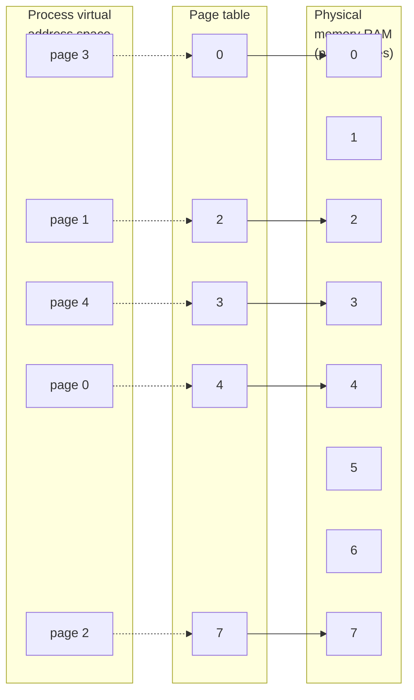
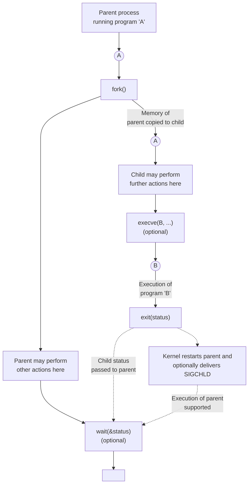
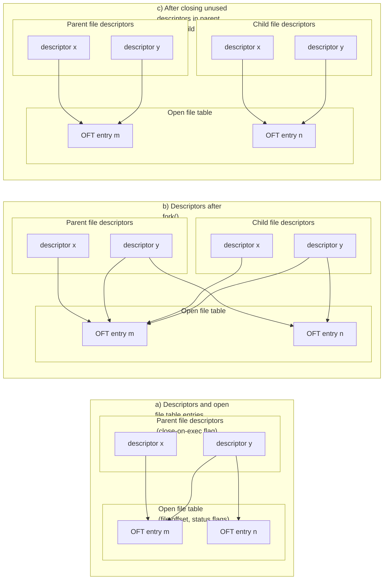
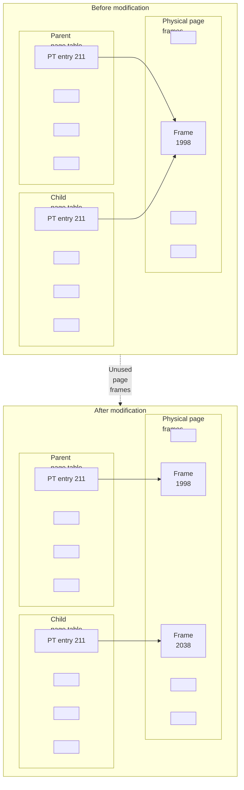

# **PROCESSES**

In this chapter, we look at the structure of a process, paying particular attention to the layout and contents of a process's virtual memory. We also examine some of the attributes of a process. In later chapters, we examine further process attributes (for example, process credentials in Chapter 9, and process priorities and scheduling in Chapter 35). In Chapters 24 to 27, we look at how processes are created, how they terminate, and how they can be made to execute new programs.

## **6.1 Processes and Programs**

A process is an instance of an executing program. In this section, we elaborate on this definition and clarify the distinction between a program and a process.

A program is a file containing a range of information that describes how to construct a process at run time. This information includes the following:

 Binary format identification: Each program file includes metainformation describing the format of the executable file. This enables the kernel to interpret the remaining information in the file. Historically, two widely used formats for UNIX executable files were the original a.out ("assembler output") format and the later, more sophisticated COFF (Common Object File Format). Nowadays, most UNIX implementations (including Linux) employ the Executable and Linking Format (ELF), which provides a number of advantages over the older formats.

-  Machine-language instructions: These encode the algorithm of the program.
-  Program entry-point address: This identifies the location of the instruction at which execution of the program should commence.
-  Data: The program file contains values used to initialize variables and also literal constants used by the program (e.g., strings).
-  Symbol and relocation tables: These describe the locations and names of functions and variables within the program. These tables are used for a variety of purposes, including debugging and run-time symbol resolution (dynamic linking).
-  Shared-library and dynamic-linking information: The program file includes fields listing the shared libraries that the program needs to use at run time and the pathname of the dynamic linker that should be used to load these libraries.
-  Other information: The program file contains various other information that describes how to construct a process.

One program may be used to construct many processes, or, put conversely, many processes may be running the same program.

We can recast the definition of a process given at the start of this section as follows: a process is an abstract entity, defined by the kernel, to which system resources are allocated in order to execute a program.

From the kernel's point of view, a process consists of user-space memory containing program code and variables used by that code, and a range of kernel data structures that maintain information about the state of the process. The information recorded in the kernel data structures includes various identifier numbers (IDs) associated with the process, virtual memory tables, the table of open file descriptors, information relating to signal delivery and handling, process resource usages and limits, the current working directory, and a host of other information.

# **6.2 Process ID and Parent Process ID**

Each process has a process ID (PID), a positive integer that uniquely identifies the process on the system. Process IDs are used and returned by a variety of system calls. For example, the kill() system call (Section 20.5) allows the caller to send a signal to a process with a specific process ID. The process ID is also useful if we need to build an identifier that is unique to a process. A common example of this is the use of the process ID as part of a process-unique filename.

The getpid() system call returns the process ID of the calling process.

```
#include <unistd.h>
pid_t getpid(void);
                                  Always successfully returns process ID of caller
```

The pid\_t data type used for the return value of getpid() is an integer type specified by SUSv3 for the purpose of storing process IDs.

With the exception of a few system processes such as init (process ID 1), there is no fixed relationship between a program and the process ID of the process that is created to run that program.

The Linux kernel limits process IDs to being less than or equal to 32,767. When a new process is created, it is assigned the next sequentially available process ID. Each time the limit of 32,767 is reached, the kernel resets its process ID counter so that process IDs are assigned starting from low integer values.

> Once it has reached 32,767, the process ID counter is reset to 300, rather than 1. This is done because many low-numbered process IDs are in permanent use by system processes and daemons, and thus time would be wasted searching for an unused process ID in this range.

> In Linux 2.4 and earlier, the process ID limit of 32,767 is defined by the kernel constant PID\_MAX. With Linux 2.6, things change. While the default upper limit for process IDs remains 32,767, this limit is adjustable via the value in the Linux-specific /proc/sys/kernel/pid\_max file (which is one greater than the maximum process ID). On 32-bit platforms, the maximum value for this file is 32,768, but on 64-bit platforms, it can be adjusted to any value up to 222 (approximately 4 million), making it possible to accommodate very large numbers of processes.

Each process has a parent—the process that created it. A process can find out the process ID of its parent using the getppid() system call.

```
#include <unistd.h>
pid_t getppid(void);
                        Always successfully returns process ID of parent of caller
```

In effect, the parent process ID attribute of each process represents the tree-like relationship of all processes on the system. The parent of each process has its own parent, and so on, going all the way back to process 1, init, the ancestor of all processes. (This "family tree" can be viewed using the pstree(1) command.)

If a child process becomes orphaned because its "birth" parent terminates, then the child is adopted by the init process, and subsequent calls to getppid() in the child return 1 (see Section 26.2).

The parent of any process can be found by looking at the Ppid field provided in the Linux-specific /proc/PID/status file.

## **6.3 Memory Layout of a Process**

The memory allocated to each process is composed of a number of parts, usually referred to as segments. These segments are as follows:

 The text segment contains the machine-language instructions of the program run by the process. The text segment is made read-only so that a process doesn't accidentally modify its own instructions via a bad pointer value. Since many processes may be running the same program, the text segment is made sharable so that a single copy of the program code can be mapped into the virtual address space of all of the processes.

-  The initialized data segment contains global and static variables that are explicitly initialized. The values of these variables are read from the executable file when the program is loaded into memory.
-  The uninitialized data segment contains global and static variables that are not explicitly initialized. Before starting the program, the system initializes all memory in this segment to 0. For historical reasons, this is often called the bss segment, a name derived from an old assembler mnemonic for "block started by symbol." The main reason for placing global and static variables that are initialized into a separate segment from those that are uninitialized is that, when a program is stored on disk, it is not necessary to allocate space for the uninitialized data. Instead, the executable merely needs to record the location and size required for the uninitialized data segment, and this space is allocated by the program loader at run time.
-  The stack is a dynamically growing and shrinking segment containing stack frames. One stack frame is allocated for each currently called function. A frame stores the function's local variables (so-called automatic variables), arguments, and return value. Stack frames are discussed in more detail in [Section 6.5](#page-8-0).
-  The heap is an area from which memory (for variables) can be dynamically allocated at run time. The top end of the heap is called the program break.

Less commonly used, but more descriptive labels for the initialized and uninitialized data segments are user-initialized data segment and zero-initialized data segment.

The size(1) command displays the size of the text, initialized data, and uninitialized data (bss) segments of a binary executable.

> The term segment as used in the main text should not be confused with the hardware segmentation used on some hardware architectures such as x86-32. Rather, segments are logical divisions of a process's virtual memory on UNIX systems. Sometimes, the term section is used instead of segment, since section is more consistent with the terminology used in the now ubiquitous ELF specification for executable file formats.

> In many places in this book, we note that a library function returns a pointer to statically allocated memory. By this, we mean that the memory is allocated in either the initialized or the uninitialized data segment. (In some cases, the library function may instead do a one-time dynamic allocation of the memory on the heap; however, this implementation detail is irrelevant to the semantic point we describe here.) It is important to be aware of cases where a library function returns information via statically allocated memory, since that memory has an existence that is independent of the function invocation, and the memory may be overwritten by subsequent calls to the same function (or in some cases, by subsequent calls to related functions). The effect of using statically allocated memory is to render a function nonreentrant. We say more about reentrancy in Sections 21.1.2 and 31.1.

Listing 6-1 shows various types of C variables along with comments indicating in which segment each variable is located. These comments assume a nonoptimizing compiler and an application binary interface in which all arguments are passed on the stack. In practice, an optimizing compiler may allocate frequently used variables in registers, or optimize a variable out of existence altogether. Furthermore, some ABIs require function arguments and the function result to be passed via registers, rather than on the stack. Nevertheless, this example serves to demonstrate the mapping between C variables and the segments of a process.

**Listing 6-1:** Locations of program variables in process memory segments

––––––––––––––––––––––––––––––––––––––––––––––––––––––– **proc/mem\_segments.c** #include <stdio.h> #include <stdlib.h> char globBuf[65536]; /\* Uninitialized data segment \*/ int primes[] = { 2, 3, 5, 7 }; /\* Initialized data segment \*/ static int square(int x) /\* Allocated in frame for square() \*/ { int result; /\* Allocated in frame for square() \*/ result = x \* x; return result; /\* Return value passed via register \*/ } static void doCalc(int val) /\* Allocated in frame for doCalc() \*/ { printf("The square of %d is %d\n", val, square(val)); if (val < 1000) { int t; /\* Allocated in frame for doCalc() \*/ t = val \* val \* val; printf("The cube of %d is %d\n", val, t); } } int main(int argc, char \*argv[]) /\* Allocated in frame for main() \*/ { static int key = 9973; /\* Initialized data segment \*/ static char mbuf[10240000]; /\* Uninitialized data segment \*/ char \*p; /\* Allocated in frame for main() \*/ p = malloc(1024); /\* Points to memory in heap segment \*/ doCalc(key); exit(EXIT\_SUCCESS); }

––––––––––––––––––––––––––––––––––––––––––––––––––––––– **proc/mem\_segments.c**

An application binary interface (ABI) is a set of rules specifying how a binary executable should exchange information with some service (e.g., the kernel or a library) at run time. Among other things, an ABI specifies which registers and stack locations are used to exchange this information, and what meaning is attached to the exchanged values. Once compiled for a particular ABI, a binary executable should be able to run on any system presenting the same ABI. This contrasts with a standardized API (such as SUSv3), which guarantees portability only for applications compiled from source code.

Although not specified in SUSv3, the C program environment on most UNIX implementations (including Linux) provides three global symbols: etext, edata, and end. These symbols can be used from within a program to obtain the addresses of the next byte past, respectively, the end of the program text, the end of the initialized data segment, and the end of the uninitialized data segment. To make use of these symbols, we must explicitly declare them, as follows:

```
extern char etext, edata, end;
 /* For example, &etext gives the address of the end
 of the program text / start of initialized data */
```

[Figure 6-1](#page-6-0) shows the arrangement of the various memory segments on the x86-32 architecture. The space labeled argv, environ at the top of this diagram holds the program command-line arguments (available in C via the argv argument of the main() function) and the process environment list (which we discuss shortly). The hexadecimal addresses shown in the diagram may vary, depending on kernel configuration and program linking options. The grayed-out areas represent invalid ranges in the process's virtual address space; that is, areas for which page tables have not been created (see the following discussion of virtual memory management).

We revisit the topic of process memory layout in a little more detail in Section 48.5, where we consider where shared memory and shared libraries are placed in a process's virtual memory.

## **6.4 Virtual Memory Management**

The previous discussion of the memory layout of a process glossed over the fact that we were talking about the layout in virtual memory. Since an understanding of virtual memory is useful later on when we look at topics such as the fork() system call, shared memory, and mapped files, we now consider some of the details.

Like most modern kernels, Linux employs a technique known as virtual memory management. The aim of this technique is to make efficient use of both the CPU and RAM (physical memory) by exploiting a property that is typical of most programs: locality of reference. Most programs demonstrate two kinds of locality:

-  Spatial locality is the tendency of a program to reference memory addresses that are near those that were recently accessed (because of sequential processing of instructions, and, sometimes, sequential processing of data structures).
-  Temporal locality is the tendency of a program to access the same memory addresses in the near future that it accessed in the recent past (because of loops).

```text
Virtual memory address
    (hexadecimal)
                        ┌─────────────────────────────────┐
                        │          Kernel                 │  /proc/kallsyms
                        │  (mapped into process           │  provides addresses of
                        │   virtual memory, but not       │◄─kernel symbols in this
                        │   accessible to program)        │  region (/proc/ksyms in
    0xC0000000          ├─────────────────────────────────┤  kernel 2.4 and earlier)
                        │       argc, environ             │
                        ├─────────────────────────────────┤
                        │          Stack                  │
                        │     (grows downwards)           │
    Top of      ───────>├ ─ ─ ─ ─ ─ ─ ─ ─ ─ ─ ─ ─ ─ ─ ─ --┤
    stack               │             │                   │
                        │             ▼                   │
                        │                                 │
                        │    (unallocated memory)         │
                        │                                 │
                        │             ▲                   │
                        │             │                   │
    Program     ───────>├ ─ ─ ─ ─ ─ ─ ─ ─ ─ ─ ─ ─ ─ ─ ─ --┤
    break               │          Heap                   │
        ▲               │     (grows upwards)             │
        │               ├─────────────────────────────────┤◄─── &end
        │               │  Uninitialized data (bss)       │
        │               ├─────────────────────────────────┤◄─── &edata
Increasing virtual      │     Initialized data            │
addresses               ├─────────────────────────────────┤◄─── &etext
        │               │    Text (program code)          │
        │               │                                 │
                        ├─────────────────────────────────┤
    0x08048000          │                                 │
                        │                                 │
    0x00000000          └─────────────────────────────────┘
```

<span id="page-6-0"></span>**Figure 6-1:** Typical memory layout of a process on Linux/x86-32

The upshot of locality of reference is that it is possible to execute a program while maintaining only part of its address space in RAM.

A virtual memory scheme splits the memory used by each program into small, fixed-size units called pages. Correspondingly, RAM is divided into a series of page frames of the same size. At any one time, only some of the pages of a program need to be resident in physical memory page frames; these pages form the so-called resident set. Copies of the unused pages of a program are maintained in the swap area—a reserved area of disk space used to supplement the computer's RAM—and loaded into physical memory only as required. When a process references a page that is not currently resident in physical memory, a page fault occurs, at which point the kernel suspends execution of the process while the page is loaded from disk into memory.

> On x86-32, pages are 4096 bytes in size. Some other Linux implementations use larger page sizes. For example, Alpha uses a page size of 8192 bytes, and IA-64 has a variable page size, with the usual default being 16,384 bytes. A program can determine the system virtual memory page size using the call sysconf(\_SC\_PAGESIZE), as described in Section 11.2.



<span id="page-7-0"></span>**Figure 6-2:** Overview of virtual memory

In order to support this organization, the kernel maintains a page table for each process (Figure [6-2\)](#page-7-0). The page table describes the location of each page in the process's virtual address space (the set of all virtual memory pages available to the process). Each entry in the page table either indicates the location of a virtual page in RAM or indicates that it currently resides on disk.

Not all address ranges in the process's virtual address space require page-table entries. Typically, large ranges of the potential virtual address space are unused, so that it isn't necessary to maintain corresponding page-table entries. If a process tries to access an address for which there is no corresponding page-table entry, it receives a SIGSEGV signal.

A process's range of valid virtual addresses can change over its lifetime, as the kernel allocates and deallocates pages (and page-table entries) for the process. This can happen in the following circumstances:

-  as the stack grows downward beyond limits previously reached;
-  when memory is allocated or deallocated on the heap, by raising the program break using brk(), sbrk(), or the malloc family of functions (Chapter 7);
-  when System V shared memory regions are attached using shmat() and detached using shmdt() (Chapter 48); and
-  when memory mappings are created using mmap() and unmapped using munmap() (Chapter 49).

The implementation of virtual memory requires hardware support in the form of a paged memory management unit (PMMU). The PMMU translates each virtual memory address reference into the corresponding physical memory address and advises the kernel of a page fault when a particular virtual memory address corresponds to a page that is not resident in RAM.

Virtual memory management separates the virtual address space of a process from the physical address space of RAM. This provides many advantages:

-  Processes are isolated from one another and from the kernel, so that one process can't read or modify the memory of another process or the kernel. This is accomplished by having the page-table entries for each process point to distinct sets of physical pages in RAM (or in the swap area).
-  Where appropriate, two or more processes can share memory. The kernel makes this possible by having page-table entries in different processes refer to the same pages of RAM. Memory sharing occurs in two common circumstances:
  - Multiple processes executing the same program can share a single (readonly) copy of the program code. This type of sharing is performed implicitly when multiple programs execute the same program file (or load the same shared library).
  - Processes can use the shmget() and mmap() system calls to explicitly request sharing of memory regions with other processes. This is done for the purpose of interprocess communication.
-  The implementation of memory protection schemes is facilitated; that is, pagetable entries can be marked to indicate that the contents of the corresponding page are readable, writable, executable, or some combination of these protections. Where multiple processes share pages of RAM, it is possible to specify that each process has different protections on the memory; for example, one process might have read-only access to a page, while another has read-write access.
-  Programmers, and tools such as the compiler and linker, don't need to be concerned with the physical layout of the program in RAM.
-  Because only a part of a program needs to reside in memory, the program loads and runs faster. Furthermore, the memory footprint (i.e., virtual size) of a process can exceed the capacity of RAM.

One final advantage of virtual memory management is that since each process uses less RAM, more processes can simultaneously be held in RAM. This typically leads to better CPU utilization, since it increases the likelihood that, at any moment in time, there is at least one process that the CPU can execute.

# <span id="page-8-0"></span>**6.5 The Stack and Stack Frames**

The stack grows and shrinks linearly as functions are called and return. For Linux on the x86-32 architecture (and on most other Linux and UNIX implementations), the stack resides at the high end of memory and grows downward (toward the heap). A special-purpose register, the stack pointer, tracks the current top of the stack. Each time a function is called, an additional frame is allocated on the stack, and this frame is removed when the function returns.

> Even though the stack grows downward, we still call the growing end of the stack the top, since, in abstract terms, that is what it is. The actual direction of stack growth is a (hardware) implementation detail. One Linux implementation, the HP PA-RISC, does use an upwardly growing stack.

In virtual memory terms, the stack segment increases in size as stack frames are allocated, but on most implementations, it won't decrease in size after these frames are deallocated (the memory is simply reused when new stack frames are allocated). When we talk about the stack segment growing and shrinking, we are considering things from the logical perspective of frames being added to and removed from the stack.

Sometimes, the term user stack is used to distinguish the stack we describe here from the kernel stack. The kernel stack is a per-process memory region maintained in kernel memory that is used as the stack for execution of the functions called internally during the execution of a system call. (The kernel can't employ the user stack for this purpose since it resides in unprotected user memory.)

Each (user) stack frame contains the following information:

-  Function arguments and local variables: In C these are referred to as automatic variables, since they are automatically created when a function is called. These variables also automatically disappear when the function returns (since the stack frame disappears), and this forms the primary semantic distinction between automatic and static (and global) variables: the latter have a permanent existence independent of the execution of functions.
-  Call linkage information: Each function uses certain CPU registers, such as the program counter, which points to the next machine-language instruction to be executed. Each time one function calls another, a copy of these registers is saved in the called function's stack frame so that when the function returns, the appropriate register values can be restored for the calling function.

Since functions can call one another, there may be multiple frames on the stack. (If a function calls itself recursively, there will be multiple frames on the stack for that function.) Referring to Listing 6-1, during the execution of the function square(), the stack will contain frames as shown in [Figure 6-3.](#page-9-0)

```text
    ┌ ─ ─ ─ ─ ─ ─ ─ ─ ─ ─ ─ ─ ─ ┐
    │ Frames for C run-time     │
    │   startup functions       │
    ├───────────────────────────┤
    │   Frame for main()        │
    ├───────────────────────────┤
    │   Frame for doCalc()      │
    ├───────────────────────────┤
    │   Frame for square()      │◄── stack pointer
    └───────────────────────────┘
                │
                │  Direction of
                │  stack growth
                ▼
```
<span id="page-9-0"></span>**Figure 6-3:** Example of a process stack

## **6.6 Command-Line Arguments (argc, argv)**

Every C program must have a function called main(), which is the point where execution of the program starts. When the program is executed, the commandline arguments (the separate words parsed by the shell) are made available via two arguments to the function main(). The first argument, int argc, indicates how many command-line arguments there are. The second argument, char \*argv[], is an array of pointers to the command-line arguments, each of which is a null-terminated character string. The first of these strings, in argv[0], is (conventionally) the name of the program itself. The list of pointers in argv is terminated by a NULL pointer (i.e., argv[argc] is NULL).

The fact that argv[0] contains the name used to invoke the program can be employed to perform a useful trick. We can create multiple links to (i.e., names for) the same program, and then have the program look at argv[0] and take different actions depending on the name used to invoke it. An example of this technique is provided by the gzip(1), gunzip(1), and zcat(1) commands, all of which are links to the same executable file. (If we employ this technique, we must be careful to handle the possibility that the user might invoke the program via a link with a name other than any of those that we expect.)

[Figure 6-4](#page-10-0) shows an example of the data structures associated with argc and argv when executing the program in [Listing 6-2.](#page-10-1) In this diagram, we show the terminating null bytes at the end of each string using the C notation \0.

```text
argc  ┌───┐
      │ 3 │
      └───┘

argv  ┌───┐
      │   │─────> 0  ┌───┬───┬───┬───┬───┬─────┬──────┐
      └───┘          │   │──>│ n │ e │ c │ h │ o │ \0 │
                     └───┴───┴───┴───┴───┴───┴────────┘
                  1  ┌───┬───┬───┬───┬───┬───────┬────┐
                     │   │──>│ h │ e │ l │ l │ o │ \0 │
                     └───┴───┴───┴───┴───┴───┴────────┘
                  2  ┌───┬───┬───┬───┬───┬────┬───────┐
                     │   │──>│ w │ o │ r │ l │ d │ \0 │
                     └───┴───┴───┴───┴───┴───┴────────┘
                  3  ┌──────┐
                     │ NULL │
                     └──────┘
```

<span id="page-10-0"></span>**Figure 6-4:** Values of argc and argv for the command necho hello world

The program in [Listing 6-2](#page-10-1) echoes its command-line arguments, one per line of output, preceded by a string showing which element of argv is being displayed.

<span id="page-10-1"></span>**Listing 6-2:** Echoing command-line arguments

```
––––––––––––––––––––––––––––––––––––––––––––––––––––––––––––– proc/necho.c
#include "tlpi_hdr.h"
int
main(int argc, char *argv[])
{
 int j;
 for (j = 0; j < argc; j++)
 printf("argv[%d] = %s\n", j, argv[j]);
 exit(EXIT_SUCCESS);
}
––––––––––––––––––––––––––––––––––––––––––––––––––––––––––––– proc/necho.c
```

Since the argv list is terminated by a NULL value, we could alternatively code the body of the program in [Listing 6-2](#page-10-1) as follows, to output just the command-line arguments one per line:

```
char **p;
for (p = argv; *p != NULL; p++)
 puts(*p);
```

One limitation of the argc/argv mechanism is that these variables are available only as arguments to main(). To portably make the command-line arguments available in other functions, we must either pass argv as an argument to those functions or set a global variable pointing to argv.

There are a couple of nonportable methods of accessing part or all of this information from anywhere in a program:

-  The command-line arguments of any process can be read via the Linux-specific /proc/PID/cmdline file, with each argument being terminated by a null byte. (A program can access its own command-line arguments via /proc/self/cmdline.)
-  The GNU C library provides two global variables that may be used anywhere in a program in order to obtain the name used to invoke the program (i.e., the first command-line argument). The first of these, program\_invocation\_name, provides the complete pathname used to invoke the program. The second, program\_invocation\_short\_name, provides a version of this name with any directory prefix stripped off (i.e., the basename component of the pathname). Declarations for these two variables can be obtained from <errno.h> by defining the macro \_GNU\_SOURCE.

As shown in [Figure 6-1,](#page-6-0) the argv and environ arrays, as well as the strings they initially point to, reside in a single contiguous area of memory just above the process stack. (We describe environ, which holds the program's environment list, in the next section.) There is an upper limit on the total number of bytes that can be stored in this area. SUSv3 prescribes the use of the ARG\_MAX constant (defined in <limits.h>) or the call sysconf(\_SC\_ARG\_MAX) to determine this limit. (We describe sysconf() in Section 11.2.) SUSv3 requires ARG\_MAX to be at least \_POSIX\_ARG\_MAX (4096) bytes. Most UNIX implementations allow a considerably higher limit than this. SUSv3 leaves it unspecified whether an implementation counts overhead bytes (for terminating null bytes, alignment bytes, and the argv and environ arrays of pointers) against the ARG\_MAX limit.

> On Linux, ARG\_MAX was historically fixed at 32 pages (i.e., 131,072 bytes on Linux/x86-32), and included the space for overhead bytes. Starting with kernel 2.6.23, the limit on the total space used for argv and environ can be controlled via the RLIMIT\_STACK resource limit, and a much larger limit is permitted for argv and environ. The limit is calculated as one-quarter of the soft RLIMIT\_STACK resource limit that was in force at the time of the execve() call. For further details, see the execve(2) man page.

Many programs (including several of the examples in this book) parse commandline options (i.e., arguments beginning with a hyphen) using the getopt() library function. We describe getopt() in Appendix B.

## **6.7 Environment List**

Each process has an associated array of strings called the environment list, or simply the environment. Each of these strings is a definition of the form name=value. Thus, the environment represents a set of name-value pairs that can be used to hold arbitrary information. The names in the list are referred to as environment variables.

When a new process is created, it inherits a copy of its parent's environment. This is a primitive but frequently used form of interprocess communication—the environment provides a way to transfer information from a parent process to its child(ren). Since the child gets a copy of its parent's environment at the time it is created, this transfer of information is one-way and once-only. After the child process has been created, either process may change its own environment, and these changes are not seen by the other process.

A common use of environment variables is in the shell. By placing values in its own environment, the shell can ensure that these values are passed to the processes that it creates to execute user commands. For example, the environment variable SHELL is set to be the pathname of the shell program itself. Many programs interpret this variable as the name of the shell that should be executed if the program needs to execute a shell.

Some library functions allow their behavior to be modified by setting environment variables. This allows the user to control the behavior of an application using the function without needing to change the code of the application or relink it against the corresponding library. An example of this technique is provided by the getopt() function (Appendix B), whose behavior can be modified by setting the POSIXLY\_CORRECT environment variable.

In most shells, a value can be added to the environment using the export command:

\$ **SHELL=/bin/bash** Create a shell variable

\$ **export SHELL** Put variable into shell process's environment

In bash and the Korn shell, this can be abbreviated to:

#### \$ **export SHELL=/bin/bash**

In the C shell, the setenv command is used instead:

#### % **setenv SHELL /bin/bash**

The above commands permanently add a value to the shell's environment, and this environment is then inherited by all child processes that the shell creates. At any point, an environment variable can be removed with the unset command (unsetenv in the C shell).

In the Bourne shell and its descendants (e.g., bash and the Korn shell), the following syntax can be used to add values to the environment used to execute a single program, without affecting the parent shell (and subsequent commands):

#### \$ *NAME=value program*

This adds a definition to the environment of just the child process executing the named program. If desired, multiple assignments (delimited by white space) can precede the program name.

The env command runs a program using a modified copy of the shell's environment list. The environment list can be modified to both add and remove definitions from the list copied from the shell. See the env(1) manual page for further details.

The printenv command displays the current environment list. Here is an example of its output:

```
$ printenv
LOGNAME=mtk
SHELL=/bin/bash
HOME=/home/mtk
PATH=/usr/local/bin:/usr/bin:/bin:.
TERM=xterm
```

We describe the purpose of most of the above environment variables at appropriate points in later chapters (see also the environ(7) manual page).

From the above output, we can see that the environment list is not sorted; the order of the strings in the list is simply the arrangement that is most convenient for the implementation. In general, this is not a problem, since we normally want to access individual variables in the environment, rather than some ordered sequence of them.

The environment list of any process can be examined via the Linux-specific /proc/ PID/environ file, with each NAME=value pair being terminated by a null byte.

## **Accessing the environment from a program**

Within a C program, the environment list can be accessed using the global variable char \*\*environ. (The C run-time startup code defines this variable and assigns the location of the environment list to it.) Like argv, environ points to a NULL-terminated list of pointers to null-terminated strings. [Figure 6-5](#page-13-0) shows the environment list data structures as they would appear for the environment displayed by the printenv command above.

```text
environ
┌───┐
│   │───> ┌───┬───> LOGNAME=mtk\0
└───┘     │   │
          │   ├───> SHELL=/bin/bash\0
          │   │
          │   ├───> HOME=/home/mtk\0
          │   │
          │   ├───> PATH=/usr/local/bin:/usr/bin:/bin:..\0
          │   │
          │   └───> TERM=xterm\0
          │
          └──────┐
                 │
              ┌──────┐
              │ NULL │
              └──────┘
```

<span id="page-13-0"></span>**Figure 6-5:** Example of process environment list data structures

The program in [Listing 6-3](#page-14-0) accesses environ in order to list all of the values in the process environment. This program yields the same output as the printenv command. The loop in this program relies on the use of pointers to walk through environ. While it would be possible to treat environ as an array (as we use argv in [Listing 6-2](#page-10-1)), this is less natural, since the items in the environment list are in no particular order and there is no variable (corresponding to argc) that specifies the size of the environment list. (For similar reasons, we don't number the elements of the environ array in [Figure 6-5.](#page-13-0))

<span id="page-14-0"></span>**Listing 6-3:** Displaying the process environment

```
–––––––––––––––––––––––––––––––––––––––––––––––––––––––– proc/display_env.c
#include "tlpi_hdr.h"
extern char **environ;
int
main(int argc, char *argv[])
{
 char **ep;
 for (ep = environ; *ep != NULL; ep++)
 puts(*ep);
 exit(EXIT_SUCCESS);
}
–––––––––––––––––––––––––––––––––––––––––––––––––––––––– proc/display_env.c
```

An alternative method of accessing the environment list is to declare a third argument to the main() function:

```
int main(int argc, char *argv[], char *envp[])
```

This argument can then be treated in the same way as environ, with the difference that its scope is local to main(). Although this feature is widely implemented on UNIX systems, its use should be avoided since, in addition to the scope limitation, it is not specified in SUSv3.

The getenv() function retrieves individual values from the process environment.

```
#include <stdlib.h>
char *getenv(const char *name);
                     Returns pointer to (value) string, or NULL if no such variable
```

Given the name of an environment variable, getenv() returns a pointer to the corresponding value string. Thus, in the case of our example environment shown earlier, /bin/bash would be returned if SHELL was specified as the name argument. If no environment variable with the specified name exists, then getenv() returns NULL.

Note the following portability considerations when using getenv():

 SUSv3 stipulates that an application should not modify the string returned by getenv(). This is because (in most implementations) this string is actually part of the environment (i.e., the value part of the name=value string). If we need to change the value of an environment variable, then we can use the setenv() or putenv() functions (described below).

 SUSv3 permits an implementation of getenv() to return its result using a statically allocated buffer that may be overwritten by subsequent calls to getenv(), setenv(), putenv(), or unsetenv(). Although the glibc implementation of getenv() doesn't use a static buffer in this way, a portable program that needs to preserve the string returned by a call to getenv() should copy it to a different location before making a subsequent call to one of these functions.

### **Modifying the environment**

Sometimes, it is useful for a process to modify its environment. One reason is to make a change that is visible in all child processes subsequently created by that process. Another possibility is that we want to set a variable that is visible to a new program to be loaded into the memory of this process ("execed"). In this sense, the environment is not just a form of interprocess communication, but also a method of interprogram communication. (This point will become clearer in Chapter 27, where we explain how the exec() functions permit a program to replace itself by a new program within the same process.)

The putenv() function adds a new variable to the calling process's environment or modifies the value of an existing variable.

```
#include <stdlib.h>
int putenv(char *string);
                                       Returns 0 on success, or nonzero on error
```

The string argument is a pointer to a string of the form name=value. After the putenv() call, this string is part of the environment. In other words, rather than duplicating the string pointed to by string, one of the elements of environ will be set to point to the same location as string. Therefore, if we subsequently modify the bytes pointed to by string, that change will affect the process environment. For this reason, string should not be an automatic variable (i.e., a character array allocated on the stack), since this memory area may be overwritten once the function in which the variable is defined returns.

Note that putenv() returns a nonzero value on error, rather than –1.

The glibc implementation of putenv() provides a nonstandard extension. If string doesn't contain an equal sign (=), then the environment variable identified by string is removed from the environment list.

The setenv() function is an alternative to putenv() for adding a variable to the environment.

```
#include <stdlib.h>
int setenv(const char *name, const char *value, int overwrite);
                                            Returns 0 on success, or –1 on error
```

The setenv() function creates a new environment variable by allocating a memory buffer for a string of the form name=value, and copying the strings pointed to by name and value into that buffer. Note that we don't need to (in fact, must not) supply an equal sign at the end of name or the start of value, because setenv() adds this character when it adds the new definition to the environment.

The setenv() function doesn't change the environment if the variable identified by name already exists and overwrite has the value 0. If overwrite is nonzero, the environment is always changed.

The fact that setenv() copies its arguments means that, unlike with putenv(), we can subsequently modify the contents of the strings pointed to by name and value without affecting the environment. It also means that using automatic variables as arguments to setenv() doesn't cause any problems.

The unsetenv() function removes the variable identified by name from the environment.

```
#include <stdlib.h>
int unsetenv(const char *name);
                                             Returns 0 on success, or –1 on error
```

As with setenv(), name should not include an equal sign.

Both setenv() and unsetenv() derive from BSD, and are less widespread than putenv(). Although not defined in the original POSIX.1 standard or in SUSv2, they are included in SUSv3.

> In versions of glibc before 2.2.2, unsetenv() was prototyped as returning void. This was how unsetenv() was prototyped in the original BSD implementation, and some UNIX implementations still follow the BSD prototype.

On occasion, it is useful to erase the entire environment, and then rebuild it with selected values. For example, we might do this in order to execute set-user-ID programs in a secure manner (Section 38.8). We can erase the environment by assigning NULL to environ:

```
environ = NULL;
```

This is exactly the step performed by the clearenv() library function.

```
#define _BSD_SOURCE /* Or: #define _SVID_SOURCE */
#include <stdlib.h>
int clearenv(void)
                                  Returns 0 on success, or a nonzero on error
```

In some circumstances, the use of setenv() and clearenv() can lead to memory leaks in a program. We noted above that setenv() allocates a memory buffer that is then made part of the environment. When we call clearenv(), it doesn't free this buffer (it can't, since it doesn't know of the buffer's existence). A program that repeatedly employed these two functions would steadily leak memory. In practice, this is unlikely to be a problem, because a program typically calls clearenv() just once on startup, in order to remove all entries from the environment that it inherited from its predecessor (i.e., the program that called exec() to start this program).

> Many UNIX implementations provide clearenv(), but it is not specified in SUSv3. SUSv3 specifies that if an application directly modifies environ, as is done by clearenv(), then the behavior of setenv(), unsetenv(), and getenv() is undefined. (The rationale behind this is that preventing a conforming application from directly modifying the environment allows the implementation full control over the data structures that it uses to implement environment variables.) The only way that SUSv3 permits an application to clear its environment is to obtain a list of all environment variables (by getting the names from environ), and then using unsetenv() to remove each of these names.

#### **Example program**

[Listing 6-4](#page-18-0) demonstrates the use of all of the functions discussed in this section. After first clearing the environment, this program adds any environment definitions provided as command-line arguments. It then: adds a definition for a variable called GREET, if one doesn't already exist in the environment; removes any definition for a variable named BYE; and, finally, prints the current environment list. Here is an example of the output produced when the program is run:

```
$ ./modify_env "GREET=Guten Tag" SHELL=/bin/bash BYE=Ciao
GREET=Guten Tag
SHELL=/bin/bash
$ ./modify_env SHELL=/bin/sh BYE=byebye
SHELL=/bin/sh
GREET=Hello world
```

If we assign NULL to environ (as is done by the call to clearenv() in [Listing 6-4\)](#page-18-0), then we would expect that a loop of the following form (as used in the program) would fail, since \*environ is invalid:

```
for (ep = environ; *ep != NULL; ep++)
 puts(*ep);
```

However, if setenv() and putenv() find that environ is NULL, they create a new environment list and set environ pointing to it, with the result that the above loop operates correctly.

```
––––––––––––––––––––––––––––––––––––––––––––––––––––––––– proc/modify_env.c
#define _GNU_SOURCE /* To get various declarations from <stdlib.h> */
#include <stdlib.h>
#include "tlpi_hdr.h"
extern char **environ;
int
main(int argc, char *argv[])
{
 int j;
 char **ep;
 clearenv(); /* Erase entire environment */
 for (j = 1; j < argc; j++)
 if (putenv(argv[j]) != 0)
 errExit("putenv: %s", argv[j]);
 if (setenv("GREET", "Hello world", 0) == -1)
 errExit("setenv");
 unsetenv("BYE");
 for (ep = environ; *ep != NULL; ep++)
 puts(*ep);
 exit(EXIT_SUCCESS);
}
––––––––––––––––––––––––––––––––––––––––––––––––––––––––– proc/modify_env.c
```

# **6.8 Performing a Nonlocal Goto: setjmp() and longjmp()**

The setjmp() and longjmp() library functions are used to perform a nonlocal goto. The term nonlocal refers to the fact that the target of the goto is a location somewhere outside the currently executing function.

Like many programming languages, C includes the goto statement, which is open to endless abuse in making programs difficult to read and maintain, and is occasionally useful to make a program simpler, faster, or both.

One restriction of C's goto is that it is not possible to jump out of the current function into another function. However, such functionality can occasionally be useful. Consider the following common scenario in error handling: during a deeply nested function call, we encounter an error that should be handled by abandoning the current task, returning through multiple function calls, and then continuing execution in some much higher function (perhaps even main()). To do this, we could have each function return a status value that is checked and appropriately handled by its caller. This is perfectly valid, and, in many cases, the desirable method for handling this kind of scenario. However, in some cases, coding would be simpler if we could jump from the middle of the nested function call back to one of the functions that called it (the immediate caller, or the caller of the caller, and so on). This is the functionality that setjmp() and longjmp() provide.

> The restriction that a goto can't be used to jump between functions in C exists because all C functions reside at the same scope level (i.e., there is no nesting of function declarations in standard C, although gcc does permit this as an extension). Thus, given two functions, X and Y, the compiler has no way of knowing whether a stack frame for function X might be on the stack at the time Y is invoked, and thus whether a goto from function Y to function X would be possible. In languages such as Pascal, where function declarations can be nested, and a goto from a nested function to a function that encloses it is permitted, the static scope of a function allows the compiler to determine some information about the dynamic scope of the function. Thus, if function Y is lexically nested within function X, then the compiler knows that a stack frame for X must already be on the stack at the time Y is invoked, and can generate code for a goto from function Y to somewhere within function X.

```
#include <setjmp.h>
int setjmp(jmp_buf env);
                         Returns 0 on initial call, nonzero on return via longjmp()
void longjmp(jmp_buf env, int val);
```

Calling setjmp() establishes a target for a later jump performed by longjmp(). This target is exactly the point in the program where the setjmp() call occurred. From a programming point of view, after the longjmp(), it looks exactly as though we have just returned from the setjmp() call for a second time. The way in which we distinguish the second "return" from the initial return is by the integer value returned by setjmp(). The initial setjmp() returns 0, while the later "faked" return supplies whatever value is specified in the val argument of the longjmp() call. By using different values for the val argument, we can distinguish jumps to the same target from different points in the program.

Specifying the val argument to longjmp() as 0 would, if unchecked, cause the faked return from setjmp() to look as though it were the initial return. For this reason, if val is specified as 0, longjmp() actually uses the value 1.

The env argument used by both functions supplies the glue enabling the jump to be accomplished. The setjmp() call saves various information about the current process environment into env. This allows the longjmp() call, which must specify the same env variable, to perform the fake return. Since the setjmp() and longjmp() calls are in different functions (otherwise, we could use a simple goto), env is declared globally or, less commonly, passed as a function argument.

Along with other information, env stores a copy of the program counter register (which points to the currently executing machine-language instruction) and the stack pointer register (which marks the top of the stack) at the time of the call to setjmp(). This information enables the subsequent longjmp() call to accomplish two key steps:

-  Strip off the stack frames for all of the intervening functions on the stack between the function calling longjmp() and the function that previously called setjmp(). This procedure is sometimes called "unwinding the stack," and is accomplished by resetting the stack pointer register to the value saved in the env argument.
-  Reset the program counter register so that the program continues execution from the location of the initial setjmp() call. Again, this is accomplished using the value saved in env.

#### **Example program**

[Listing 6-5](#page-21-0) demonstrates the use of setjmp() and longjmp(). This program sets up a jump target with an initial call to setjmp(). The subsequent switch (on the value returned by setjmp()) is the means of detecting whether we have just completed the initial return from setjmp() or whether we have arrived back after a longjmp(). In the case of a 0 return—meaning we have just done the initial setjmp()—we call f1(), which either immediately calls longjmp() or goes on to call f2(), depending on the value of argc (i.e., the number of command-line arguments). If f2() is reached, it does an immediate longjmp(). A longjmp() from either function takes us back to the point of the setjmp() call. We use different val arguments in the two longjmp() calls, so that the switch statement in main() can determine the function from which the jump occurred and print a suitable message.

When we run the program in [Listing 6-5](#page-21-0) without any command-line arguments, this is what we see:

```
$ ./longjmp
Calling f1() after initial setjmp()
We jumped back from f1()
```

Specifying a command-line argument causes the jump to occur from f2():

```
$ ./longjmp x
Calling f1() after initial setjmp()
We jumped back from f2()
```

```
–––––––––––––––––––––––––––––––––––––––––––––––––––––––––––– proc/longjmp.c
#include <setjmp.h>
#include "tlpi_hdr.h"
static jmp_buf env;
static void
f2(void)
{
 longjmp(env, 2);
}
static void
f1(int argc)
{
 if (argc == 1)
 longjmp(env, 1);
 f2();
}
int
main(int argc, char *argv[])
{
 switch (setjmp(env)) {
 case 0: /* This is the return after the initial setjmp() */
 printf("Calling f1() after initial setjmp()\n");
 f1(argc); /* Never returns... */
 break; /* ... but this is good form */
 case 1:
 printf("We jumped back from f1()\n");
 break;
 case 2:
 printf("We jumped back from f2()\n");
 break;
 }
 exit(EXIT_SUCCESS);
}
––––––––––––––––––––––––––––––––––––––––––––––––––––––––––– proc/longjmp.c
```

## **Restrictions on the use of setjmp()**

SUSv3 and C99 specify that a call to setjmp() may appear only in the following contexts:

-  as the entire controlling expression of a selection or iteration statement (if, switch, while, and so on);
-  as the operand of a unary ! (not) operator, where the resulting expression is the entire controlling expression of a selection or iteration statement;

-  as part of a comparison operation (==, !=, <, and so on), where the other operand is an integer constant expression and the resulting expression is the entire controlling expression of a selection or iteration statement; or
-  as a free-standing function call that is not embedded inside some larger expression.

Note that the C assignment statement doesn't figure in the list above. A statement of the following form is not standards-conformant:

```
s = setjmp(env); /* WRONG! */
```

These restrictions are specified because an implementation of setjmp() as a conventional function can't be guaranteed to have enough information to be able to save the values of all registers and temporary stack locations used in an enclosing expression so that they could then be correctly restored after a longjmp(). Thus, it is permitted to call setjmp() only inside expressions simple enough not to require temporary storage.

## **Abusing longjmp()**

If the env buffer is declared global to all functions (which is typical), then it is possible to execute the following sequence of steps:

- 1. Call a function x() that uses setjmp() to establish a jump target in the global variable env.
- 2. Return from function x().
- 3. Call a function y() that does a longjmp() using env.

This is a serious error. We can't do a longjmp() into a function that has already returned. Considering what longjmp() tries to do to the stack—it attempts to unwind the stack back to a frame that no longer exists—leads us to realize that chaos will result. If we are lucky, our program will simply crash. However, depending on the state of the stack, other possibilities include infinite call-return loops and the program behaving as though it really did return from a function that was not currently executing. (In a multithreaded program, a similar abuse is to call longjmp() in a different thread from that in which setjmp() was called.)

> SUSv3 says that if longjmp() is called from within a nested signal handler (i.e., a handler that was invoked while the handler for another signal was executing), then the program behavior is undefined.

#### **Problems with optimizing compilers**

Optimizing compilers may rearrange the order of instructions in a program and store certain variables in CPU registers, rather than RAM. Such optimizations generally rely on the run-time flow of control reflecting the lexical structure of the program. Since jump operations performed via setjmp() and longjmp() are established and executed at run time, and are not reflected in the lexical structure of the program, a compiler optimizer is unable to take them into account when performing its task. Furthermore, the semantics of some ABI implementations require longjmp() to restore copies of the CPU registers saved by the earlier setjmp() call. This means that optimized variables may end up with incorrect values as a consequence of a longjmp() operation. We can see an example of this by examining the behavior of the program in [Listing 6-6](#page-23-0).

<span id="page-23-0"></span>**Listing 6-6:** A demonstration of the interaction of compiler optimization and longjmp()

```
–––––––––––––––––––––––––––––––––––––––––––––––––––––––– proc/setjmp_vars.c
#include <stdio.h>
#include <stdlib.h>
#include <setjmp.h>
static jmp_buf env;
static void
doJump(int nvar, int rvar, int vvar)
{
 printf("Inside doJump(): nvar=%d rvar=%d vvar=%d\n", nvar, rvar, vvar);
 longjmp(env, 1);
}
int
main(int argc, char *argv[])
{
 int nvar;
 register int rvar; /* Allocated in register if possible */
 volatile int vvar; /* See text */
 nvar = 111;
 rvar = 222;
 vvar = 333;
 if (setjmp(env) == 0) { /* Code executed after setjmp() */
 nvar = 777;
 rvar = 888;
 vvar = 999;
 doJump(nvar, rvar, vvar);
 } else { /* Code executed after longjmp() */
 printf("After longjmp(): nvar=%d rvar=%d vvar=%d\n", nvar, rvar, vvar);
 }
 exit(EXIT_SUCCESS);
}
–––––––––––––––––––––––––––––––––––––––––––––––––––––––– proc/setjmp_vars.c
```

When we compile the program in [Listing 6-6](#page-23-0) normally, we see the expected output:

```
$ cc -o setjmp_vars setjmp_vars.c
$ ./setjmp_vars
Inside doJump(): nvar=777 rvar=888 vvar=999
After longjmp(): nvar=777 rvar=888 vvar=999
```

However, when we compile with optimization, we get the following unexpected results:

```
$ cc -O -o setjmp_vars setjmp_vars.c
$ ./setjmp_vars
Inside doJump(): nvar=777 rvar=888 vvar=999
After longjmp(): nvar=111 rvar=222 vvar=999
```

Here, we see that after the longjmp(), nvar and rvar have been reset to their values at the time of the setjmp() call. This has occurred because the code reorganization performed by the optimizer has been confused as a consequence of the longjmp(). Any local variables that are candidates for optimization may be subject to this sort of problem; this generally means pointer variables and variables of any of the simple types char, int, float, and long.

We can prevent such code reorganization by declaring variables as volatile, which tells the optimizer not to optimize them. In the preceding program output, we see that the variable vvar, which was declared volatile, was correctly handled, even when we compiled with optimization.

Since different compilers do different types of optimizations, portable programs should employ the volatile keyword with all of the local variables of the aforementioned types in the function that calls setjmp().

If we specify the –Wextra (extra warnings) option to the GNU C compiler, it produces the following helpful warning for the setjmp\_vars.c program:

```
$ cc -Wall -Wextra -O -o setjmp_vars setjmp_vars.c
setjmp_vars.c: In function `main':
setjmp_vars.c:17: warning: variable `nvar' might be clobbered by `longjmp' or 
`vfork'
setjmp_vars.c:18: warning: variable `rvar' might be clobbered by `longjmp' or 
`vfork'
```

It is instructive to look at the assembler output produced when compiling the setjmp\_vars.c program both with and without optimization. The cc –S command produces a file with the extension .s containing the generated assembler code for a program.

#### **Avoid setjmp() and longjmp() where possible**

If goto statements are capable of rendering a program difficult to read, then nonlocal gotos can make things an order of magnitude worse, since they can transfer control between any two functions in a program. For this reason, setjmp() and longjmp() should be used sparingly. It is often worth the extra work in design and coding to come up with a program that avoids their use, because the program will be more readable and possibly more portable. Having said that, we revisit variants of these functions (sigsetjmp() and siglongjmp(), described in Section 21.2.1) when we discuss signals, since they are occasionally useful when writing signal handlers.

## **6.9 Summary**

Each process has a unique process ID and maintains a record of its parent's process ID. The virtual memory of a process is logically divided into a number of segments: text, (initialized and uninitialized) data, stack, and heap.

The stack consists of a series of frames, with a new frame being added as a function is invoked and removed when the function returns. Each frame contains the local variables, function arguments, and call linkage information for a single function invocation.

The command-line arguments supplied when a program is invoked are made available via the argc and argv arguments to main(). By convention, argv[0] contains the name used to invoke the program.

Each process receives a copy of its parent's environment list, a set of name-value pairs. The global variable environ and various library functions allow a process to access and modify the variables in its environment list.

The setjmp() and longjmp() functions provide a way to perform a nonlocal goto from one function to another (unwinding the stack). In order to avoid problems with compiler optimization, we may need to declare variables with the volatile modifier when making use of these functions. Nonlocal gotos can render a program difficult to read and maintain, and should be avoided whenever possible.

## **Further information**

[Tanenbaum, 2007] and [Vahalia, 1996] describe virtual memory management in detail. The Linux kernel memory management algorithms and code are described in detail in [Gorman, 2004].

## **6.10 Exercises**

- **6-1.** Compile the program in Listing 6-1 (mem\_segments.c), and list its size using ls –l. Although the program contains an array (mbuf) that is around 10 MB in size, the executable file is much smaller than this. Why is this?
- **6-2.** Write a program to see what happens if we try to longjmp() into a function that has already returned.
- **6-3.** Implement setenv() and unsetenv() using getenv(), putenv(), and, where necessary, code that directly modifies environ. Your version of unsetenv() should check to see whether there are multiple definitions of an environment variable, and remove them all (which is what the glibc version of unsetenv() does).

# <span id="page-0-0"></span>**PROCESS CREATION**

In this and the next three chapters, we look at how a process is created and terminates, and how a process can execute a new program. This chapter covers process creation. However, before diving into that subject, we present a short overview of the main system calls covered in these four chapters.

## **24.1 Overview of fork(), exit(), wait(), and execve()**

The principal topics of this and the next few chapters are the system calls fork(), exit(), wait(), and execve(). Each of these system calls has variants, which we'll also look at. For now, we provide an overview of these four system calls and how they are typically used together.

-  The fork() system call allows one process, the parent, to create a new process, the child. This is done by making the new child process an (almost) exact duplicate of the parent: the child obtains copies of the parent's stack, data, heap, and text segments (Section 6.3). The term fork derives from the fact that we can envisage the parent process as dividing to yield two copies of itself.
-  The exit(status) library function terminates a process, making all resources (memory, open file descriptors, and so on) used by the process available for subsequent reallocation by the kernel. The status argument is an integer that determines the termination status for the process. Using the wait() system call, the parent can retrieve this status.

The exit() library function is layered on top of the \_exit() system call. In Chapter [25](#page-18-0), we explain the difference between the two interfaces. In the meantime, we'll just note that, after a fork(), generally only one of the parent and child terminate by calling exit(); the other process should terminate using \_exit().

-  The wait(&status) system call has two purposes. First, if a child of this process has not yet terminated by calling exit(), then wait() suspends execution of the process until one of its children has terminated. Second, the termination status of the child is returned in the status argument of wait().
-  The execve(pathname, argv, envp) system call loads a new program (pathname, with argument list argv, and environment list envp) into a process's memory. The existing program text is discarded, and the stack, data, and heap segments are freshly created for the new program. This operation is often referred to as execing a new program. Later, we'll see that several library functions are layered on top of execve(), each of which provides a useful variation in the programming interface. Where we don't care about these interface variations, we follow the common convention of referring to these calls generically as exec(), but be aware that there is no system call or library function with this name.

Some other operating systems combine the functionality of fork() and exec() into a single operation—a so-called spawn—that creates a new process that then executes a specified program. By comparison, the UNIX approach is usually simpler and more elegant. Separating these two steps makes the APIs simpler (the fork() system call takes no arguments) and allows a program a great degree of flexibility in the actions it performs between the two steps. Moreover, it is often useful to perform a fork() without a following exec().

> SUSv3 specifies the optional posix\_spawn() function, which combines the effect of fork() and exec(). This function, and several related APIs specified by SUSv3, are implemented on Linux in glibc. SUSv3 specifies posix\_spawn() to permit portable applications to be written for hardware architectures that don't provide swap facilities or memory-management units (this is typical of many embedded systems). On such architectures, a traditional fork() is difficult or impossible to implement.

Figure 24-1 provides an overview of how fork(), exit(), wait(), and execve() are commonly used together. (This diagram outlines the steps taken by the shell in executing a command: the shell continuously executes a loop that reads a command, performs various processing on it, and then forks a child process to exec the command.)

The use of execve() shown in this diagram is optional. Sometimes, it is instead useful to have the child carry on executing the same program as the parent. In either case, the execution of the child is ultimately terminated by a call to exit() (or by delivery of a signal), yielding a termination status that the parent can obtain via wait().

The call to wait() is likewise optional. The parent can simply ignore its child and continue executing. However, we'll see later that the use of wait() is usually desirable, and is often employed within a handler for the SIGCHLD signal, which the kernel generates for a parent process when one of its children terminates. (By default, SIGCHLD is ignored, which is why we label it as being optionally delivered in the diagram.)



**Figure 24-1:** Overview of the use of fork(), exit(), wait(), and execve()

## <span id="page-2-0"></span>**24.2 Creating a New Process: fork()**

In many applications, creating multiple processes can be a useful way of dividing up a task. For example, a network server process may listen for incoming client requests and create a new child process to handle each request; meanwhile, the server process continues to listen for further client connections. Dividing tasks up in this way often makes application design simpler. It also permits greater concurrency (i.e., more tasks or requests can be handled simultaneously).

The fork() system call creates a new process, the child, which is an almost exact duplicate of the calling process, the parent.

```
#include <unistd.h>
pid_t fork(void);
                In parent: returns process ID of child on success, or –1 on error;
                                    in successfully created child: always returns 0
```

The key point to understanding fork() is to realize that after it has completed its work, two processes exist, and, in each process, execution continues from the point where fork() returns.

The two processes are executing the same program text, but they have separate copies of the stack, data, and heap segments. The child's stack, data, and heap segments are initially exact duplicates of the corresponding parts the parent's memory. After the fork(), each process can modify the variables in its stack, data, and heap segments without affecting the other process.

Within the code of a program, we can distinguish the two processes via the value returned from fork(). For the parent, fork() returns the process ID of the newly created child. This is useful because the parent may create, and thus need to track, several children (via wait() or one of its relatives). For the child, fork() returns 0. If necessary, the child can obtain its own process ID using getpid(), and the process ID of its parent using getppid().

If a new process can't be created, fork() returns –1. Possible reasons for failure are that the resource limit (RLIMIT\_NPROC, described in Section 36.3) on the number of processes permitted to this (real) user ID has been exceeded or that the systemwide limit on the number of processes that can be created has been reached.

The following idiom is sometimes employed when calling fork():

```
pid_t childPid; /* Used in parent after successful fork()
 to record PID of child */
switch (childPid = fork()) {
case -1: /* fork() failed */
 /* Handle error */
case 0: /* Child of successful fork() comes here */
 /* Perform actions specific to child */
default: /* Parent comes here after successful fork() */
 /* Perform actions specific to parent */
}
```

It is important to realize that after a fork(), it is indeterminate which of the two processes is next scheduled to use the CPU. In poorly written programs, this indeterminacy can lead to errors known as race conditions, which we describe further in Section [24.4](#page-12-0).

[Listing 24-1](#page-4-0) demonstrates the use of fork(). This program creates a child that modifies the copies of global and automatic variables that it inherits during the during the fork().

The use of sleep() (in the code executed by the parent) in this program permits the child to be scheduled for the CPU before the parent, so that the child can complete its work and terminate before the parent continues execution. Using sleep() in this manner is not a foolproof method of guaranteeing this result; we look at a better method in Section [24.5](#page-14-0).

When we run the program in Listing 24-1, we see the following output:

```
$ ./t_fork
PID=28557 (child) idata=333 istack=666
PID=28556 (parent) idata=111 istack=222
```

The above output demonstrates that the child process gets its own copy of the stack and data segments at the time of the fork(), and it is able to modify variables in these segments without affecting the parent.

<span id="page-4-1"></span><span id="page-4-0"></span>**Listing 24-1:** Using fork()

```
–––––––––––––––––––––––––––––––––––––––––––––––––––––––– procexec/t_fork.c
#include "tlpi_hdr.h"
static int idata = 111; /* Allocated in data segment */
int
main(int argc, char *argv[])
{
 int istack = 222; /* Allocated in stack segment */
 pid_t childPid;
 switch (childPid = fork()) {
 case -1:
 errExit("fork");
 case 0:
 idata *= 3;
 istack *= 3;
 break;
 default:
 sleep(3); /* Give child a chance to execute */
 break;
 }
 /* Both parent and child come here */
 printf("PID=%ld %s idata=%d istack=%d\n", (long) getpid(),
 (childPid == 0) ? "(child) " : "(parent)", idata, istack);
 exit(EXIT_SUCCESS);
}
–––––––––––––––––––––––––––––––––––––––––––––––––––––––– procexec/t_fork.c
```

## **24.2.1 File Sharing Between Parent and Child**

When a fork() is performed, the child receives duplicates of all of the parent's file descriptors. These duplicates are made in the manner of dup(), which means that corresponding descriptors in the parent and the child refer to the same open file description. As we saw in Section 5.4, the open file description contains the current file offset (as modified by read(), write(), and lseek()) and the open file status flags (set by open() and changed by the fcntl() F\_SETFL operation). Consequently, these attributes of an open file are shared between the parent and child. For example, if the child updates the file offset, this change is visible through the corresponding descriptor in the parent.

The fact that these attributes are shared by the parent and child after a fork() is demonstrated by the program in [Listing 24-2](#page-5-0). This program opens a temporary file using mkstemp(), and then calls fork() to create a child process. The child changes the file offset and open file status flags of the temporary file, and exits. The parent then retrieves the file offset and flags to verify that it can see the changes made by the child. When we run the program, we see the following:

```
$ ./fork_file_sharing
File offset before fork(): 0
O_APPEND flag before fork() is: off
Child has exited
File offset in parent: 1000
O_APPEND flag in parent is: on
```

For an explanation of why we cast the return value from lseek() to long long in [Listing 24-2,](#page-5-0) see Section 5.10.

<span id="page-5-0"></span>**Listing 24-2:** Sharing of file offset and open file status flags between parent and child

```
––––––––––––––––––––––––––––––––––––––––––––––– procexec/fork_file_sharing.c
#include <sys/stat.h>
#include <fcntl.h>
#include <sys/wait.h>
#include "tlpi_hdr.h"
int
main(int argc, char *argv[])
{
 int fd, flags;
   char template[] = "/tmp/testXXXXXX";
 setbuf(stdout, NULL); /* Disable buffering of stdout */
 fd = mkstemp(template);
 if (fd == -1)
 errExit("mkstemp");
 printf("File offset before fork(): %lld\n",
 (long long) lseek(fd, 0, SEEK_CUR));
 flags = fcntl(fd, F_GETFL);
 if (flags == -1)
 errExit("fcntl - F_GETFL");
 printf("O_APPEND flag before fork() is: %s\n",
 (flags & O_APPEND) ? "on" : "off");
```

```
 switch (fork()) {
 case -1:
 errExit("fork");
 case 0: /* Child: change file offset and status flags */
 if (lseek(fd, 1000, SEEK_SET) == -1)
 errExit("lseek");
 flags = fcntl(fd, F_GETFL); /* Fetch current flags */
 if (flags == -1)
 errExit("fcntl - F_GETFL");
 flags |= O_APPEND; /* Turn O_APPEND on */
 if (fcntl(fd, F_SETFL, flags) == -1)
 errExit("fcntl - F_SETFL");
 _exit(EXIT_SUCCESS);
 default: /* Parent: can see file changes made by child */
 if (wait(NULL) == -1)
 errExit("wait"); /* Wait for child exit */
 printf("Child has exited\n");
 printf("File offset in parent: %lld\n",
 (long long) lseek(fd, 0, SEEK_CUR));
 flags = fcntl(fd, F_GETFL);
 if (flags == -1)
 errExit("fcntl - F_GETFL");
 printf("O_APPEND flag in parent is: %s\n",
 (flags & O_APPEND) ? "on" : "off");
 exit(EXIT_SUCCESS);
 }
}
```

––––––––––––––––––––––––––––––––––––––––––––––– **procexec/fork\_file\_sharing.c**

Sharing of open file attributes between the parent and child processes is frequently useful. For example, if the parent and child are both writing to a file, sharing the file offset ensures that the two processes don't overwrite each other's output. It does not, however, prevent the output of the two processes from being randomly intermingled. If this is not desired, then some form of process synchronization is required. For example, the parent can use the wait() system call to pause until the child has exited. This is what the shell does, so that it prints its prompt only after the child process executing a command has terminated (unless the user explicitly runs the command in the background by placing an ampersand character at the end of the command).

If sharing of file descriptors in this manner is not required, then an application should be designed so that, after a fork(), the parent and child use different file descriptors, with each process closing unused descriptors (i.e., those used by the other process) immediately after forking. (If one of the processes performs an exec(), the close-on-exec flag described in Section [27.4](#page-62-0) can also be useful.) These steps are shown in [Figure 24-2](#page-7-0).



<span id="page-7-0"></span>**Figure 24-2:** Duplication of file descriptors during fork(), and closing of unused descriptors

## **24.2.2 Memory Semantics of fork()**

Conceptually, we can consider fork() as creating copies of the parent's text, data, heap, and stack segments. (Indeed, in some early UNIX implementations, such duplication was literally performed: a new process image was created by copying the parent's memory to swap space, and making that swapped-out image the child process while the parent kept its own memory.) However, actually performing a simple copy of the parent's virtual memory pages into the new child process would be wasteful for a number of reasons—one being that a fork() is often followed by an immediate exec(), which replaces the process's text with a new program and reinitializes the process's data, heap, and stack segments. Most modern UNIX implementations, including Linux, use two techniques to avoid such wasteful copying:

-  The kernel marks the text segment of each process as read-only, so that a process can't modify its own code. This means that the parent and child can share the same text segment. The fork() system call creates a text segment for the child by building a set of per-process page-table entries that refer to the same virtual memory page frames already used by the parent.
-  For the pages in the data, heap, and stack segments of the parent process, the kernel employs a technique known as copy-on-write. (The implementation of copy-on-write is described in [Bach, 1986] and [Bovet & Cesati, 2005].) Initially, the kernel sets things up so that the page-table entries for these segments refer to the same physical memory pages as the corresponding page-table entries in the parent, and the pages themselves are marked read-only. After the fork(), the kernel traps any attempts by either the parent or the child to modify one of these pages, and makes a duplicate copy of the about-to-be-modified page. This new page copy is assigned to the faulting process, and the corresponding pagetable entry for the child is adjusted appropriately. From this point on, the parent and child can each modify their private copies of the page, without the changes being visible to the other process. [Figure 24-3](#page-8-0) illustrates the copy-on-write technique.



<span id="page-8-0"></span>**Figure 24-3:** Page tables before and after modification of a shared copy-on-write page

#### **Controlling a process's memory footprint**

We can combine the use of fork() and wait() to control the memory footprint of a process. The process's memory footprint is the range of virtual memory pages used by the process, as affected by factors such as the adjustment of the stack as functions are called and return, calls to exec(), and, of particular interest to this discussion, modification of the heap as a consequence of calls to malloc() and free().

Suppose that we bracket a call to some function, func(), using fork() and wait() in the manner shown in [Listing 24-3](#page-9-0). After executing this code, we know that the memory footprint of the parent is unchanged from the point before func() was called, since all possible changes will have occurred in the child process. This can be useful for the following reasons:

-  If we know that func() causes memory leaks or excessive fragmentation of the heap, this technique eliminates the problem. (We might not otherwise be able to deal with these problems if we don't have access to the source code of func().)
-  Suppose that we have some algorithm that performs memory allocation while doing a tree analysis (for example, a game program that analyzes a range of possible moves and their responses). We could code such a program to make calls to free() to deallocate all of the allocated memory. However, in some cases, it is simpler to employ the technique we describe here in order to allow us to backtrack, leaving the caller (the parent) with its original memory footprint unchanged.

In the implementation shown in [Listing 24-3](#page-9-0), the result of func() must be expressed in the 8 bits that exit() passes from the terminating child to the parent calling wait(). However, we could employ a file, a pipe, or some other interprocess communication technique to allow func() to return larger results.

<span id="page-9-0"></span>**Listing 24-3:** Calling a function without changing the process's memory footprint

```
–––––––––––––––––––––––––––––––––––––––––––––––––– fromprocexec/footprint.c
 pid_t childPid;
 int status;
 childPid = fork();
 if (childPid == -1)
 errExit("fork");
 if (childPid == 0) /* Child calls func() and */
 exit(func(arg)); /* uses return value as exit status */
 /* Parent waits for child to terminate. It can determine the
 result of func() by inspecting 'status'. */
 if (wait(&status) == -1)
 errExit("wait");
–––––––––––––––––––––––––––––––––––––––––––––––––– fromprocexec/footprint.c
```

# **24.3 The vfork() System Call**

Early BSD implementations were among those in which fork() performed a literal duplication of the parent's data, heap, and stack. As noted earlier, this is wasteful, especially if the fork() is followed by an immediate exec(). For this reason, later versions of BSD introduced the vfork() system call, which was far more efficient than BSD's fork(), although it operated with slightly different (in fact, somewhat strange) semantics. Modern UNIX implementations employing copy-on-write for implementing fork() are much more efficient than older fork() implementations, thus largely eliminating the need for vfork(). Nevertheless, Linux (like many other UNIX implementations) provides a vfork() system call with BSD semantics for programs that require the fastest possible fork. However, because the unusual semantics of vfork() can lead to some subtle program bugs, its use should normally be avoided, except in the rare cases where it provides worthwhile performance gains.

Like fork(), vfork() is used by the calling process to create a new child process. However, vfork() is expressly designed to be used in programs where the child performs an immediate exec() call.

```
#include <unistd.h>
pid_t vfork(void);
                In parent: returns process ID of child on success, or –1 on error;
                                    in successfully created child: always returns 0
```

Two features distinguish the vfork() system call from fork() and make it more efficient:

-  No duplication of virtual memory pages or page tables is done for the child process. Instead, the child shares the parent's memory until it either performs a successful exec() or calls \_exit() to terminate.
-  Execution of the parent process is suspended until the child has performed an exec() or \_exit().

These points have some important implications. Since the child is using the parent's memory, any changes made by the child to the data, heap, or stack segments will be visible to the parent once it resumes. Furthermore, if the child performs a function return between the vfork() and a later exec() or \_exit(), this will also affect the parent. This is similar to the example described in Section 6.8 of trying to longjmp() into a function from which a return has already been performed. Similar chaos—typically a segmentation fault (SIGSEGV)—is likely to result.

There are a few things that the child process can do between vfork() and exec() without affecting the parent. Among these are operations on open file descriptors (but not stdio file streams). Since the file descriptor table for each process is maintained in kernel space (Section 5.4) and is duplicated during vfork(), the child process can perform file descriptor operations without affecting the parent.

> SUSv3 says that the behavior of a program is undefined if it: a) modifies any data other than a variable of type pid\_t used to store the return value of vfork(); b) returns from the function in which vfork() was called; or c) calls any other function before successfully calling \_exit() or performing an exec().

> When we look at the clone() system call in Section [28.2,](#page-85-0) we'll see that a child created using fork() or vfork() also obtains its own copies of a few other process attributes.

The semantics of vfork() mean that after the call, the child is guaranteed to be scheduled for the CPU before the parent. In Section [24.2](#page-2-0), we noted that this is not a guarantee made by fork(), after which either the parent or the child may be scheduled first.

[Listing 24-4](#page-11-0) shows the use of vfork(), demonstrating both of the semantic features that distinguish it from fork(): the child shares the parent's memory, and the parent is suspended until the child terminates or calls exec(). When we run this program, we see the following output:

```
$ ./t_vfork
Child executing Even though child slept, parent was not scheduled
Parent executing
istack=666
```

<span id="page-11-0"></span>**Listing 24-4:** Using vfork()

From the last line of output, we can see that the change made by the child to the variable istack was performed on the parent's variable.

```
–––––––––––––––––––––––––––––––––––––––––––––––––––––––– procexec/t_vfork.c
#include "tlpi_hdr.h"
int
main(int argc, char *argv[])
{
 int istack = 222;
 switch (vfork()) {
 case -1:
 errExit("vfork");
```

 case 0: /\* Child executes first, in parent's memory space \*/ sleep(3); /\* Even if we sleep for a while, parent still is not scheduled \*/

istack \*= 3; /\* This change will be seen by parent \*/

write(STDOUT\_FILENO, "Child executing\n", 16);

 \_exit(EXIT\_SUCCESS); default: /\* Parent is blocked until child exits \*/ write(STDOUT\_FILENO, "Parent executing\n", 17); printf("istack=%d\n", istack); exit(EXIT\_SUCCESS); } }

Except where speed is absolutely critical, new programs should avoid the use of vfork() in favor of fork(). This is because, when fork() is implemented using copy-onwrite semantics (as is done on most modern UNIX implementations), it approaches the speed of vfork(), and we avoid the eccentric behaviors associated with vfork() described above. (We show some speed comparisons between fork() and vfork() in Section [28.3](#page-97-0).)

–––––––––––––––––––––––––––––––––––––––––––––––––––––––– **procexec/t\_vfork.c**

SUSv3 marks vfork() as obsolete, and SUSv4 goes further, removing the specification of vfork(). SUSv3 leaves many details of the operation of vfork() unspecified, allowing the possibility that it is implemented as a call to fork(). When implemented in this manner, the BSD semantics for vfork() are not preserved. Some UNIX systems do indeed implement vfork() as a call to fork(), and Linux also did this in kernel 2.0 and earlier.

Where it is used, vfork() should generally be immediately followed by a call to exec(). If the exec() call fails, the child process should terminate using \_exit(). (The child of a vfork() should not terminate by calling exit(), since that would cause the parent's stdio buffers to be flushed and closed. We go into more detail on this point in Section [25.4.](#page-24-0))

Other uses of vfork()—in particular, those relying on its unusual semantics for memory sharing and process scheduling—are likely to render a program nonportable, especially to implementations where vfork() is implemented simply as a call to fork().

## <span id="page-12-0"></span>**24.4 Race Conditions After fork()**

After a fork(), it is indeterminate which process—the parent or the child—next has access to the CPU. (On a multiprocessor system, they may both simultaneously get access to a CPU.) Applications that implicitly or explicitly rely on a particular sequence of execution in order to achieve correct results are open to failure due to race conditions, which we described in Section 5.1. Such bugs can be hard to find, as their occurrence depends on scheduling decisions that the kernel makes according to system load.

We can use the program in Listing 24-5 to demonstrate this indeterminacy. This program loops, using fork() to create multiple children. After each fork(), both parent and child print a message containing the loop counter value and a string indicating whether the process is the parent or child. For example, if we asked the program to produce just one child, we might see the following:

```
$ ./fork_whos_on_first 1
0 parent
0 child
```

We can use this program to create a large number of children, and then analyze the output to see whether the parent or the child is the first to print its message each time. Analyzing the results when using this program to create 1 million children on a Linux/x86-32 2.2.19 system showed that the parent printed its message first in all but 332 cases (i.e., in 99.97% of the cases).

> The results from running the program in Listing 24-5 were analyzed using the script procexec/fork\_whos\_on\_first.count.awk, which is provided in the source code distribution for this book.

From these results, we may surmise that, on Linux 2.2.19, execution always continues with the parent process after a fork(). The reason that the child occasionally printed its message first was that, in 0.03% of cases, the parent's CPU time slice ran out before it had time to print its message. In other words, if this example represented a case where we were relying on the parent to always be scheduled first after fork(), then things would usually go right, but one time out of every 3000, things would go wrong. Of course, if the application expected that the parent should be able to carry out a larger piece of work before the child was scheduled, the possibility of things going wrong would be greater. Trying to debug such errors in a complex program can be difficult.

**Listing 24-5:** Parent and child race to write a message after fork()

```
–––––––––––––––––––––––––––––––––––––––––––––– procexec/fork_whos_on_first.c
#include <sys/wait.h>
#include "tlpi_hdr.h"
int
main(int argc, char *argv[])
{
 int numChildren, j;
 pid_t childPid;
 if (argc > 1 && strcmp(argv[1], "--help") == 0)
 usageErr("%s [num-children]\n", argv[0]);
 numChildren = (argc > 1) ? getInt(argv[1], GN_GT_0, "num-children") : 1;
 setbuf(stdout, NULL); /* Make stdout unbuffered */
 for (j = 0; j < numChildren; j++) {
 switch (childPid = fork()) {
 case -1:
 errExit("fork");
 case 0:
 printf("%d child\n", j);
 _exit(EXIT_SUCCESS);
 default:
 printf("%d parent\n", j);
 wait(NULL); /* Wait for child to terminate */
 break;
 }
 }
 exit(EXIT_SUCCESS);
}
–––––––––––––––––––––––––––––––––––––––––––––– procexec/fork_whos_on_first.c
```

Although Linux 2.2.19 always continues execution with the parent after a fork(), we can't rely on this being the case on other UNIX implementations, or even across different versions of the Linux kernel. During the 2.4 stable kernel series, experiments were briefly made with a "child first after fork()" patch, which completely reverses the results obtained from 2.2.19. Although this change was later dropped from the 2.4 kernel series, it was subsequently adopted in Linux 2.6. Thus, programs that assume the 2.2.19 behavior would be broken by the 2.6 kernel.

Some more recent experiments reversed the kernel developers' assessment of whether it was better to run the child or the parent first after fork(), and, since Linux 2.6.32, it is once more the parent that is, by default, run first after a fork(). This default can be changed by assigning a nonzero value to the Linux-specific /proc/sys/kernel/sched\_child\_runs\_first file.

To see the argument for the "children first after fork()" behavior, consider what happens with copy-on-write semantics when the child of a fork() performs an immediate exec(). In this case, as the parent carries on after the fork() to modify data and stack pages, the kernel duplicates the to-be-modified pages for the child. Since the child performs an exec() as soon as it is scheduled to run, this duplication is wasted. According to this argument, it is better to schedule the child first, so that by the time the parent is next scheduled, no page copying is required. Using the program in Listing 24-5 to create 1 million child processes on one busy Linux/x86-32 system running kernel 2.6.30 showed that, in 99.98% of cases, the child process displayed its message first. (The precise percentage depends on factors such as system load.) Testing this program on other UNIX implementations showed wide variation in the rules that govern which process runs first after fork().

The argument for switching back to "parent first after fork()" in Linux 2.6.32 was based on the observation that, after a fork(), the parent's state is already active in the CPU and its memory-management information is already cached in the hardware memory management unit's translation look-aside buffer (TLB). Therefore, running the parent first should result in better performance. This was informally verified by measuring the time required for kernel builds under the two behaviors.

In conclusion, it is worth noting that the performance differences between the two behaviors are rather small, and won't affect most applications.

From the preceding discussion, it is clear that we can't assume a particular order of execution for the parent and child after a fork(). If we need to guarantee a particular order, we must use some kind of synchronization technique. We describe several synchronization techniques in later chapters, including semaphores, file locks, and sending messages between processes using pipes. One other method, which we describe next, is to use signals.

## <span id="page-14-0"></span>**24.5 Avoiding Race Conditions by Synchronizing with Signals**

After a fork(), if either process needs to wait for the other to complete an action, then the active process can send a signal after completing the action; the other process waits for the signal.

[Listing 24-6](#page-15-0) demonstrates this technique. In this program, we assume that it is the parent that must wait on the child to carry out some action. The signal-related calls in the parent and child can be swapped if the child must wait on the parent. It is even possible for both parent and child to signal each other multiple times in order to coordinate their actions, although, in practice, such coordination is more likely to be done using semaphores, file locks, or message passing.

> [Stevens & Rago, 2005] suggests encapsulating such synchronization steps (block signal, send signal, catch signal) into a standard set of functions for process synchronization. The advantage of such encapsulation is that we can then later replace the use of signals by another IPC mechanism, if desired.

Note that we block the synchronization signal (SIGUSR1) before the fork() call in [Listing 24-6](#page-15-0). If the parent tried blocking the signal after the fork(), it would remain vulnerable to the very race condition we are trying to avoid. (In this program, we assume that the state of the signal mask in the child is irrelevant; if necessary, we can unblock SIGUSR1 in the child after the fork().)

The following shell session log shows what happens when we run the program in Listing 24-6:

```
$ ./fork_sig_sync
[17:59:02 5173] Child started - doing some work
[17:59:02 5172] Parent about to wait for signal
[17:59:04 5173] Child about to signal parent
[17:59:04 5172] Parent got signal
```

<span id="page-15-0"></span>**Listing 24-6:** Using signals to synchronize process actions

```
–––––––––––––––––––––––––––––––––––––––––––––––––– procexec/fork_sig_sync.c
#include <signal.h>
#include "curr_time.h" /* Declaration of currTime() */
#include "tlpi_hdr.h"
#define SYNC_SIG SIGUSR1 /* Synchronization signal */
static void /* Signal handler - does nothing but return */
handler(int sig)
{
}
int
main(int argc, char *argv[])
{
 pid_t childPid;
 sigset_t blockMask, origMask, emptyMask;
 struct sigaction sa;
 setbuf(stdout, NULL); /* Disable buffering of stdout */
 sigemptyset(&blockMask);
 sigaddset(&blockMask, SYNC_SIG); /* Block signal */
 if (sigprocmask(SIG_BLOCK, &blockMask, &origMask) == -1)
 errExit("sigprocmask");
 sigemptyset(&sa.sa_mask);
 sa.sa_flags = SA_RESTART;
 sa.sa_handler = handler;
 if (sigaction(SYNC_SIG, &sa, NULL) == -1)
 errExit("sigaction");
 switch (childPid = fork()) {
 case -1:
 errExit("fork");
 case 0: /* Child */
 /* Child does some required action here... */
```

```
 printf("[%s %ld] Child started - doing some work\n",
 currTime("%T"), (long) getpid());
 sleep(2); /* Simulate time spent doing some work */
 /* And then signals parent that it's done */
 printf("[%s %ld] Child about to signal parent\n",
 currTime("%T"), (long) getpid());
 if (kill(getppid(), SYNC_SIG) == -1)
 errExit("kill");
 /* Now child can do other things... */
 _exit(EXIT_SUCCESS);
 default: /* Parent */
 /* Parent may do some work here, and then waits for child to
 complete the required action */
 printf("[%s %ld] Parent about to wait for signal\n",
 currTime("%T"), (long) getpid());
 sigemptyset(&emptyMask);
 if (sigsuspend(&emptyMask) == -1 && errno != EINTR)
 errExit("sigsuspend");
 printf("[%s %ld] Parent got signal\n", currTime("%T"), (long) getpid());
 /* If required, return signal mask to its original state */
 if (sigprocmask(SIG_SETMASK, &origMask, NULL) == -1)
 errExit("sigprocmask");
 /* Parent carries on to do other things... */
 exit(EXIT_SUCCESS);
 }
}
–––––––––––––––––––––––––––––––––––––––––––––––––– procexec/fork_sig_sync.c
```

## **24.6 Summary**

<span id="page-16-0"></span>The fork() system call creates a new process (the child) by making an almost exact duplicate of the calling process (the parent). The vfork() system call is a more efficient version of fork(), but is usually best avoided because of its unusual semantics, whereby the child uses the parent's memory until it either performs an exec() or terminates; in the meantime, execution of the parent process is suspended.

After a fork() call, we can't rely on the order in which the parent and the child are next scheduled to use the CPU(s). Programs that make assumptions about the order of execution are susceptible to errors known as race conditions. Because the occurrence of such errors depends on external factors such as system load, they can be difficult to find and debug.

#### **Further information**

[Bach, 1986] and [Goodheart & Cox, 1994] provide details of the implementation of fork(), execve(), wait(), and exit() on UNIX systems. [Bovet & Cesati, 2005] and [Love, 2010] provide Linux-specific implementation details of process creation and termination.

## **24.7 Exercises**

**24-1.** After a program executes the following series of fork() calls, how many new processes will result (assuming that none of the calls fails)?

```
fork();
fork();
fork();
```

- **24-2.** Write a program to demonstrate that after a vfork(), the child process can close a file descriptor (e.g., descriptor 0) without affecting the corresponding file descriptor in the parent.
- **24-3.** Assuming that we can modify the program source code, how could we get a core dump of a process at a given moment in time, while letting the process continue execution?
- **24-4.** Experiment with the program in Listing 24-5 (fork\_whos\_on\_first.c) on other UNIX implementations to determine how these implementations schedule the parent and child processes after a fork().
- **24-5.** Suppose that in the program in [Listing 24-6,](#page-15-0) the child process also needed to wait on the parent to complete some actions. What changes to the program would be required in order to enforce this?

# <span id="page-18-0"></span>**PROCESS TERMINATION**

This chapter describes what happens when a process terminates. We begin by describing the use of exit() and \_exit() to terminate a process. We then discuss the use of exit handlers to automatically perform cleanups when a process calls exit(). We conclude by considering some interactions between fork(), stdio buffers, and exit().

## **25.1 Terminating a Process: \_exit() and exit()**

<span id="page-18-1"></span>A process may terminate in two general ways. One of these is abnormal termination, caused by the delivery of a signal whose default action is to terminate the process (with or without a core dump), as described in Section 20.1. Alternatively, a process can terminate normally, using the \_exit() system call.

```
#include <unistd.h>
void _exit(int status);
```

The status argument given to \_exit() defines the termination status of the process, which is available to the parent of this process when it calls wait(). Although defined as an int, only the bottom 8 bits of status are actually made available to the parent. By convention, a termination status of 0 indicates that a process completed successfully, and a nonzero status value indicates that the process terminated unsuccessfully. There are no fixed rules about how nonzero status values are to be interpreted; different applications follow their own conventions, which should be described in their documentation. SUSv3 specifies two constants, EXIT\_SUCCESS (0) and EXIT\_FAILURE (1), that are used in most programs in this book.

A process is always successfully terminated by \_exit() (i.e., \_exit() never returns).

Although any value in the range 0 to 255 can be passed to the parent via the status argument to \_exit(), specifying values greater than 128 can cause confusion in shell scripts. The reason is that, when a command is terminated by a signal, the shell indicates this fact by setting the value of the variable \$? to 128 plus the signal number, and this value is indistinguishable from that yielded when a process calls \_exit() with the same status value.

Programs generally don't call \_exit() directly, but instead call the exit() library function, which performs various actions before calling \_exit().

```
#include <stdlib.h>
void exit(int status);
```

The following actions are performed by exit():

-  Exit handlers (functions registered with atexit() and on\_exit()) are called, in reverse order of their registration (Section [25.3](#page-20-0)).
-  The stdio stream buffers are flushed.
-  The \_exit() system call is invoked, using the value supplied in status.

Unlike \_exit(), which is UNIX-specific, exit() is defined as part of the standard C library; that is, it is available with every C implementation.

One other way in which a process may terminate is to return from main(), either explicitly, or implicitly, by falling off the end of the main() function. Performing an explicit return n is generally equivalent to calling exit(n), since the run-time function that invokes main() uses the return value from main() in a call to exit().

> There is one circumstance in which calling exit() and returning from main() are not equivalent. If any steps performed during exit processing access variables local to main(), then doing a return from main() results in undefined behavior. For example, this could occur if a variable that is local to main() is specified in a call to setvbuf() or setbuf() (Section 13.2).

Performing a return without specifying a value, or falling off the end of the main() function, also results in the caller of main() invoking exit(), but with results that vary depending on the version of the C standard supported and the compilation options employed:

 In C89, the behavior in these circumstances is undefined; the program can terminate with an arbitrary status value. This is the behavior that occurs by default with gcc on Linux, where the exit status of the program is taken from some random value lying on the stack or in a particular CPU register. Terminating a program in this way should be avoided.

 The C99 standard requires that falling off the end of the main program should be equivalent to calling exit(0). This is the behavior we obtain on Linux if we compile a program using gcc –std=c99.

## **25.2 Details of Process Termination**

During both normal and abnormal termination of a process, the following actions occur:

-  Open file descriptors, directory streams (Section 18.8), message catalog descriptors (see the catopen(3) and catgets(3) manual pages), and conversion descriptors (see the iconv\_open(3) manual page) are closed.
-  As a consequence of closing file descriptors, any file locks (Chapter 55) held by this process are released.
-  Any attached System V shared memory segments are detached, and the shm\_nattch counter corresponding to each segment is decremented by one. (Refer to Section 48.8.)
-  For each System V semaphore for which a semadj value has been set by the process, that semadj value is added to the semaphore value. (Refer to Section 47.8.)
-  If this is the controlling process for a controlling terminal, then the SIGHUP signal is sent to each process in the controlling terminal's foreground process group, and the terminal is disassociated from the session. We consider this point further in Section 34.6.
-  Any POSIX named semaphores that are open in the calling process are closed as though sem\_close() were called.
-  Any POSIX message queues that are open in the calling process are closed as though mq\_close() were called.
-  If, as a consequence of this process exiting, a process group becomes orphaned and there are any stopped processes in that group, then all processes in the group are sent a SIGHUP signal followed by a SIGCONT signal. We consider this point further in Section 34.7.4.
-  Any memory locks established by this process using mlock() or mlockall() (Section 50.2) are removed.
-  Any memory mappings established by this process using mmap() are unmapped.

# <span id="page-20-0"></span>**25.3 Exit Handlers**

Sometimes, an application needs to automatically perform some operations on process termination. Consider the example of an application library that, if used during the life of the process, needs to have some cleanup actions performed automatically when the process exits. Since the library doesn't have control of when and how the process exits, and can't mandate that the main program call a libraryspecific cleanup function before exiting, cleanup is not guaranteed to occur. One approach in such situations is to use an exit handler (older System V manuals used the term program termination routine).

An exit handler is a programmer-supplied function that is registered at some point during the life of the process and is then automatically called during normal process termination via exit(). Exit handlers are not called if a program calls \_exit() directly or if the process is terminated abnormally by a signal.

> To some extent, the fact that exit handlers are not called when a process is terminated by a signal limits their utility. The best we can do is to establish handlers for the signals that might be sent to the process, and have these handlers set a flag that causes the main program to call exit(). (Because exit() is not one of the async-signal-safe functions listed in Table 21-1, on page 426, we generally can't call it from a signal handler.) Even then, this doesn't handle the case of SIGKILL, whose default action can't be changed. This is one more reason we should avoid using SIGKILL to terminate a process (as noted in Section 20.2), and instead use SIGTERM, which is the default signal sent by the kill command.

#### **Registering exit handlers**

The GNU C library provides two ways of registering exit handlers. The first method, specified in SUSv3, is to use the atexit() function.

```
#include <stdlib.h>
int atexit(void (*func)(void));
                                      Returns 0 on success, or nonzero on error
```

The atexit() function adds func to a list of functions that are called when the process terminates. The function func should be defined to take no arguments and return no value, thus having the following general form:

```
void
func(void)
{
 /* Perform some actions */
}
```

Note that atexit() returns a nonzero value (not necessarily –1) on error.

It is possible to register multiple exit handlers (and even the same exit handler multiple times). When the program invokes exit(), these functions are called in reverse order of registration. This ordering is logical because, typically, functions that are registered earlier are those that carry out more fundamental types of cleanups that may need to be performed after later-registered functions.

Essentially, any desired action can be performed inside an exit handler, including registering additional exit handlers, which are placed at the head of the list of exit handlers that remain to be called. However, if one of the exit handlers fails to return—either because it called \_exit() or because the process was terminated by a signal (e.g., the exit handler called raise())—then the remaining exit handlers are not called. In addition, the remaining actions that would normally be performed by exit() (i.e., flushing stdio buffers) are not performed.

> SUSv3 states that if an exit handler itself calls exit(), the results are undefined. On Linux, the remaining exit handlers are invoked as normal. However, on

some systems, this causes all of the exit handlers to once more be invoked, which can result in an infinite recursion (until a stack overflow kills the process). Portable applications should avoid calling exit() inside an exit handler.

SUSv3 requires that an implementation allow a process to be able to register at least 32 exit handlers. Using the call sysconf(\_SC\_ATEXIT\_MAX), a program can determine the implementation-defined upper limit on the number of exit handlers that can be registered. (However, there is no way to find out how many exit handlers have already been registered.) By chaining the registered exit handlers in a dynamically allocated linked list, glibc allows a virtually unlimited number of exit handlers to be registered. On Linux, sysconf(\_SC\_ATEXIT\_MAX) returns 2,147,482,647 (i.e., the maximum signed 32-bit integer). In other words, something else will break (e.g., lack of memory) before we reach the limit on the number of functions that can be registered.

A child process created via fork() inherits a copy of its parent's exit handler registrations. When a process performs an exec(), all exit handler registrations are removed. (This is necessarily so, since an exec() replaces the code of the exit handlers along with the rest of the existing program code.)

> We can't deregister an exit handler that has been registered with atexit() (or on\_exit(), described below). However, we can have the exit handler check whether a global flag is set before it performs its actions, and disable the exit handler by clearing the flag.

Exit handlers registered with atexit() suffer a couple of limitations. The first is that when called, an exit handler doesn't know what status was passed to exit(). Occasionally, knowing the status could be useful; for example, we may like to perform different actions depending on whether the process is exiting successfully or unsuccessfully. The second limitation is that we can't specify an argument to the exit handler when it is called. Such a facility could be useful to define an exit handler that performs different actions depending on its argument, or to register a function multiple times, each time with a different argument.

To address these limitations, glibc provides a (nonstandard) alternative method of registering exit handlers: on\_exit().

```
#define _BSD_SOURCE /* Or: #define _SVID_SOURCE */
#include <stdlib.h>
int on_exit(void (*func)(int, void *), void *arg);
                                    Returns 0 on success, or nonzero on error
```

The func argument of on\_exit() is a pointer to a function of the following type:

```
void
func(int status, void *arg)
{
 /* Perform cleanup actions */
}
```

When called, func() is passed two arguments: the status argument supplied to exit(), and a copy of the arg argument supplied to on\_exit() at the time the function was registered. Although defined as a pointer type, arg is open to programmer-defined interpretation. It could be used as a pointer to some structure; equally, through judicious use of casting, it could be treated as an integer or other scalar type.

Like atexit(), on\_exit() returns a nonzero value (not necessarily –1) on error.

As with atexit(), multiple exit handlers can be registered with on\_exit(). Functions registered using atexit() and on\_exit() are placed on the same list. If both methods are used in the same program, then the exit handlers are called in reverse order of their registration using the two methods.

Although more flexible than atexit(), on\_exit() should be avoided in programs intended to be portable, since it is not covered by any standards and is available on few other UNIX implementations.

#### **Example program**

[Listing 25-1](#page-23-0) demonstrates the use of atexit() and on\_exit() to register exit handlers. When we run this program, we see the following output:

```
$ ./exit_handlers
on_exit function called: status=2, arg=20
atexit function 2 called
atexit function 1 called
on_exit function called: status=2, arg=10
```

<span id="page-23-0"></span>**Listing 25-1:** Using exit handlers

```
–––––––––––––––––––––––––––––––––––––––––––––––––– procexec/exit_handlers.c
#define _BSD_SOURCE /* Get on_exit() declaration from <stdlib.h> */
#include <stdlib.h>
#include "tlpi_hdr.h"
static void
atexitFunc1(void)
{
 printf("atexit function 1 called\n");
}
static void
atexitFunc2(void)
{
 printf("atexit function 2 called\n");
}
static void
onexitFunc(int exitStatus, void *arg)
{
 printf("on_exit function called: status=%d, arg=%ld\n",
 exitStatus, (long) arg);
}
int
main(int argc, char *argv[])
```

```
{
 if (on_exit(onexitFunc, (void *) 10) != 0)
 fatal("on_exit 1");
 if (atexit(atexitFunc1) != 0)
 fatal("atexit 1");
 if (atexit(atexitFunc2) != 0)
 fatal("atexit 2");
 if (on_exit(onexitFunc, (void *) 20) != 0)
 fatal("on_exit 2");
 exit(2);
}
–––––––––––––––––––––––––––––––––––––––––––––––––– procexec/exit_handlers.c
```

# **25.4 Interactions Between fork(), stdio Buffers, and \_exit()**

<span id="page-24-0"></span>The output yielded by the program in [Listing 25-2](#page-24-1) demonstrates a phenomenon that is at first puzzling. When we run this program with standard output directed to the terminal, we see the expected result:

```
$ ./fork_stdio_buf
Hello world
Ciao
```

However, when we redirect standard output to a file, we see the following:

```
$ ./fork_stdio_buf > a
$ cat a
Ciao
Hello world
Hello world
```

In the above output, we see two strange things: the line written by printf() appears twice, and the output of write() precedes that of printf().

<span id="page-24-1"></span>**Listing 25-2:** Interaction of fork() and stdio buffering

```
––––––––––––––––––––––––––––––––––––––––––––––––– procexec/fork_stdio_buf.c
#include "tlpi_hdr.h"
int
main(int argc, char *argv[])
{
 printf("Hello world\n");
 write(STDOUT_FILENO, "Ciao\n", 5);
 if (fork() == -1)
 errExit("fork");
 /* Both child and parent continue execution here */
 exit(EXIT_SUCCESS);
}
––––––––––––––––––––––––––––––––––––––––––––––––– procexec/fork_stdio_buf.c
```

To understand why the message written with printf() appears twice, recall that the stdio buffers are maintained in a process's user-space memory (refer to Section 13.2). Therefore, these buffers are duplicated in the child by fork(). When standard output is directed to a terminal, it is line-buffered by default, with the result that the newline-terminated string written by printf() appears immediately. However, when standard output is directed to a file, it is block-buffered by default. Thus, in our example, the string written by printf() is still in the parent's stdio buffer at the time of the fork(), and this string is duplicated in the child. When the parent and the child later call exit(), they both flush their copies of the stdio buffers, resulting in duplicate output.

We can prevent this duplicated output from occurring in one of the following ways:

-  As a specific solution to the stdio buffering issue, we can use fflush() to flush the stdio buffer prior to a fork() call. Alternatively, we could use setvbuf() or setbuf() to disable buffering on the stdio stream.
-  Instead of calling exit(), the child can call \_exit(), so that it doesn't flush stdio buffers. This technique exemplifies a more general principle: in an application that creates child processes, typically only one of the processes (most often the parent) should terminate via exit(), while the other processes should terminate via \_exit(). This ensures that only one process calls exit handlers and flushes stdio buffers, which is usually desirable.

Other approaches that allow both the parent and child to call exit() are possible (and sometimes necessary). For example, it may be possible to design exit handlers so that they operate correctly even if called from multiple processes, or to have the application install exit handlers only after the call to fork(). Furthermore, sometimes we may actually want all processes to flush their stdio buffers after a fork(). In this case, we may choose to terminate the processes using exit(), or use explicit calls to fflush() in each process, as appropriate.

The output of the write() in the program in [Listing 25-2](#page-24-1) doesn't appear twice, because write() transfers data directly to a kernel buffer, and this buffer is not duplicated during a fork().

By now, the reason for the second strange aspect of the program's output when redirected to a file should be clear. The output of write() appears before that from printf() because the output of write() is immediately transferred to the kernel buffer cache, while the output from printf() is transferred only when the stdio buffers are flushed by the call to exit(). (In general, care is required when mixing stdio functions and system calls to perform I/O on the same file, as described in Section 13.7.)

## **25.5 Summary**

A process can terminate either abnormally or normally. Abnormal termination occurs on delivery of certain signals, some of which also cause the process to produce a core dump file.

Normal termination is accomplished by calling \_exit() or, more usually, exit(), which is layered on top of \_exit(). Both \_exit() and exit() take an integer argument whose least significant 8 bits define the termination status of the process. By convention, a status of 0 is used to indicate successful termination, and a nonzero status indicates unsuccessful termination.

As part of both normal and abnormal process termination, the kernel performs various cleanup steps. Terminating a process normally by calling exit() additionally causes exit handlers registered using atexit() and on\_exit() to be called (in reverse order of registration), and causes stdio buffers to be flushed.

#### **Further information**

Refer to the sources of further information listed in Section [24.6](#page-16-0).

## **25.6 Exercise**

**25-1.** If a child process makes the call exit(–1), what exit status (as returned by WEXITSTATUS()) will be seen by the parent?

# **MONITORING CHILD PROCESSES**

In many application designs, a parent process needs to know when one of its child processes changes state—when the child terminates or is stopped by a signal. This chapter describes two techniques used to monitor child processes: the wait() system call (and its variants) and the use of the SIGCHLD signal.

## **26.1 Waiting on a Child Process**

In many applications where a parent creates child processes, it is useful for the parent to be able to monitor the children to find out when and how they terminate. This facility is provided by wait() and a number of related system calls.

## **26.1.1 The wait() System Call**

The wait() system call waits for one of the children of the calling process to terminate and returns the termination status of that child in the buffer pointed to by status.

```
#include <sys/wait.h>
pid_t wait(int *status);
                          Returns process ID of terminated child, or –1 on error
```

The wait() system call does the following:

- 1. If no (previously unwaited-for) child of the calling process has yet terminated, the call blocks until one of the children terminates. If a child has already terminated by the time of the call, wait() returns immediately.
- 2. If status is not NULL, information about how the child terminated is returned in the integer to which status points. We describe the information returned in status in Section [26.1.3.](#page-32-0)
- 3. The kernel adds the process CPU times (Section 10.7) and resource usage statistics (Section 36.1) to running totals for all children of this parent process.
- 4. As its function result, wait() returns the process ID of the child that has terminated.

On error, wait() returns –1. One possible error is that the calling process has no (previously unwaited-for) children, which is indicated by the errno value ECHILD. This means that we can use the following loop to wait for all children of the calling process to terminate:

```
while ((childPid = wait(NULL)) != -1)
 continue;
if (errno != ECHILD) /* An unexpected error... */
 errExit("wait");
```

[Listing 26-1](#page-30-0) demonstrates the use of wait(). This program creates multiple child processes, one per (integer) command-line argument. Each child sleeps for the number of seconds specified in the corresponding command-line argument and then exits. In the meantime, after all children have been created, the parent process repeatedly calls wait() to monitor the termination of its children. This loop continues until wait() returns –1. (This is not the only approach: we could alternatively exit the loop when the number of terminated children, numDead, matches the number of children created.) The following shell session log shows what happens when we use the program to create three children:

```
$ ./multi_wait 7 1 4
[13:41:00] child 1 started with PID 21835, sleeping 7 seconds
[13:41:00] child 2 started with PID 21836, sleeping 1 seconds
[13:41:00] child 3 started with PID 21837, sleeping 4 seconds
[13:41:01] wait() returned child PID 21836 (numDead=1)
[13:41:04] wait() returned child PID 21837 (numDead=2)
[13:41:07] wait() returned child PID 21835 (numDead=3)
No more children - bye!
```

If there are multiple terminated children at a particular moment, SUSv3 leaves unspecified the order in which these children will be reaped by a sequence of wait() calls; that is, the order depends on the implementation. Even across versions of the Linux kernel, the behavior varies.

```
––––––––––––––––––––––––––––––––––––––––––––––––––––– procexec/multi_wait.c
#include <sys/wait.h>
#include <time.h>
#include "curr_time.h" /* Declaration of currTime() */
#include "tlpi_hdr.h"
int
main(int argc, char *argv[])
{
 int numDead; /* Number of children so far waited for */
 pid_t childPid; /* PID of waited for child */
 int j;
 if (argc < 2 || strcmp(argv[1], "--help") == 0)
 usageErr("%s sleep-time...\n", argv[0]);
 setbuf(stdout, NULL); /* Disable buffering of stdout */
 for (j = 1; j < argc; j++) { /* Create one child for each argument */
 switch (fork()) {
 case -1:
 errExit("fork");
 case 0: /* Child sleeps for a while then exits */
 printf("[%s] child %d started with PID %ld, sleeping %s "
 "seconds\n", currTime("%T"), j, (long) getpid(), argv[j]);
 sleep(getInt(argv[j], GN_NONNEG, "sleep-time"));
 _exit(EXIT_SUCCESS);
 default: /* Parent just continues around loop */
 break;
 }
 }
 numDead = 0;
 for (;;) { /* Parent waits for each child to exit */
 childPid = wait(NULL);
 if (childPid == -1) {
 if (errno == ECHILD) {
 printf("No more children - bye!\n");
 exit(EXIT_SUCCESS);
 } else { /* Some other (unexpected) error */
 errExit("wait");
 }
 }
 numDead++;
 printf("[%s] wait() returned child PID %ld (numDead=%d)\n",
 currTime("%T"), (long) childPid, numDead);
 }
}
––––––––––––––––––––––––––––––––––––––––––––––––––––– procexec/multi_wait.c
```

## **26.1.2 The waitpid() System Call**

The wait() system call has a number of limitations, which waitpid() was designed to address:

-  If a parent process has created multiple children, it is not possible to wait() for the completion of a specific child; we can only wait for the next child that terminates.
-  If no child has yet terminated, wait() always blocks. Sometimes, it would be preferable to perform a nonblocking wait so that if no child has yet terminated, we obtain an immediate indication of this fact.
-  Using wait(), we can find out only about children that have terminated. It is not possible to be notified when a child is stopped by a signal (such as SIGSTOP or SIGTTIN) or when a stopped child is resumed by delivery of a SIGCONT signal.

```
#include <sys/wait.h>
pid_t waitpid(pid_t pid, int *status, int options);
                          Returns process ID of child, 0 (see text), or –1 on error
```

The return value and status arguments of waitpid() are the same as for wait(). (See Section [26.1.3](#page-32-0) for an explanation of the value returned in status.) The pid argument enables the selection of the child to be waited for, as follows:

-  If pid is greater than 0, wait for the child whose process ID equals pid.
-  If pid equals 0, wait for any child in the same process group as the caller (parent). We describe process groups in Section 34.2.
-  If pid is less than –1, wait for any child whose process group identifier equals the absolute value of pid.
-  If pid equals –1, wait for any child. The call wait(&status) is equivalent to the call waitpid(–1, &status, 0).

The options argument is a bit mask that can include (OR) zero or more of the following flags (all of which are specified in SUSv3):

#### WUNTRACED

In addition to returning information about terminated children, also return information when a child is stopped by a signal.

#### WCONTINUED (since Linux 2.6.10)

Also return status information about stopped children that have been resumed by delivery of a SIGCONT signal.

#### WNOHANG

If no child specified by pid has yet changed state, then return immediately, instead of blocking (i.e., perform a "poll"). In this case, the return value of waitpid() is 0. If the calling process has no children that match the specification in pid, waitpid() fails with the error ECHILD.

We demonstrate the use of waitpid() in Listing 26-3.

In its rationale for waitpid(), SUSv3 notes that the name WUNTRACED is a historical artifact of this flag's origin in BSD, where a process could be stopped in one of two ways: as a consequence of being traced by the ptrace() system call, or by being stopped by a signal (i.e., not being traced). When a child is being traced by ptrace(), then delivery of any signal (other than SIGKILL) causes the child to be stopped, and a SIGCHLD signal is consequently sent to the parent. This behavior occurs even if the child is ignoring the signal. However, if the child is blocking the signal, then it is not stopped (unless the signal is SIGSTOP, which can't be blocked).

## <span id="page-32-0"></span>**26.1.3 The Wait Status Value**

<span id="page-32-2"></span>The status value returned by wait() and waitpid() allows us to distinguish the following events for the child:

-  The child terminated by calling \_exit() (or exit()), specifying an integer exit status.
-  The child was terminated by the delivery of an unhandled signal.
-  The child was stopped by a signal, and waitpid() was called with the WUNTRACED flag.
-  The child was resumed by a SIGCONT signal, and waitpid() was called with the WCONTINUED flag.

We use the term wait status to encompass all of the above cases. The designation termination status is used to refer to the first two cases. (In the shell, we can obtain the termination status of the last command executed by examining the contents of the variable \$?.)

Although defined as an int, only the bottom 2 bytes of the value pointed to by status are actually used. The way in which these 2 bytes are filled depends on which of the above events occurred for the child, as depicted in [Figure 26-1.](#page-32-1)

> [Figure 26-1](#page-32-1) shows the layout of the wait status value for Linux/x86-32. The details vary across implementations. SUSv3 doesn't specify any particular layout for this information, or even require that it is contained in the bottom 2 bytes of the value pointed to by status. Portable applications should always use the macros described in this section to inspect this value, rather than directly inspecting its bit-mask components.

```text
                           15 ←────── bits ──────► 8  7                    0
                          ┌─────────────────────────┬──────────────────────────┐
Normal termination        │  exit status (0-255)    │           0              │
                          └─────────────────────────┴──────────────────────────┘

                          ┌─────────────────────────┬──┬───────────────────────┐
Killed by signal          │      unused (0)         │  │ termination signal != 0│
                          └─────────────────────────┴──┴───────────────────────┘
                                                       ▲
                                                       └─ core dumped flag

                          ┌─────────────────────────┬──────────────────────────┐
Stopped by signal         │     stop signal         │          0x7F            │
                          └─────────────────────────┴──────────────────────────┘

                          ┌──────────────────────────────────────────────────────┐
Continued by signal       │                    0xFFFF                            │
                          └──────────────────────────────────────────────────────┘
```

<span id="page-32-1"></span>**Figure 26-1:** Value returned in the status argument of wait() and waitpid()

The <sys/wait.h> header file defines a standard set of macros that can be used to dissect a wait status value. When applied to a status value returned by wait() or waitpid(), only one of the macros in the list below will return true. Additional macros are provided to further dissect the status value, as noted in the list.

#### WIFEXITED(status)

This macro returns true if the child process exited normally. In this case, the macro WEXITSTATUS(status) returns the exit status of the child process. (As noted in Section [25.1,](#page-18-1) only the least significant byte of the child's exit status is available to the parent.)

#### WIFSIGNALED(status)

This macro returns true if the child process was killed by a signal. In this case, the macro WTERMSIG(status) returns the number of the signal that caused the process to terminate, and the macro WCOREDUMP(status) returns true if the child process produced a core dump file. The WCOREDUMP() macro is not specified by SUSv3, but is available on most UNIX implementations.

#### WIFSTOPPED(status)

This macro returns true if the child process was stopped by a signal. In this case, the macro WSTOPSIG(status) returns the number of the signal that stopped the process.

#### WIFCONTINUED(status)

This macro returns true if the child was resumed by delivery of SIGCONT. This macro is available since Linux 2.6.10.

Note that although the name status is also used for the argument of the above macros, they expect a plain integer, rather than a pointer to an integer as required by wait() and waitpid().

#### **Example program**

The printWaitStatus() function of [Listing 26-2](#page-33-0) uses all of the macros described above. This function dissects and prints the contents of a wait status value.

<span id="page-33-1"></span><span id="page-33-0"></span>**Listing 26-2:** Displaying the status value returned by wait() and related calls

```
––––––––––––––––––––––––––––––––––––––––––––––– procexec/print_wait_status.c
#define _GNU_SOURCE /* Get strsignal() declaration from <string.h> */
#include <string.h>
#include <sys/wait.h>
#include "print_wait_status.h" /* Declaration of printWaitStatus() */
#include "tlpi_hdr.h"
/* NOTE: The following function employs printf(), which is not
 async-signal-safe (see Section 21.1.2). As such, this function is
 also not async-signal-safe (i.e., beware of calling it from a
 SIGCHLD handler). */
void /* Examine a wait() status using the W* macros */
printWaitStatus(const char *msg, int status)
{
```

```
 if (msg != NULL)
 printf("%s", msg);
 if (WIFEXITED(status)) {
 printf("child exited, status=%d\n", WEXITSTATUS(status));
 } else if (WIFSIGNALED(status)) {
 printf("child killed by signal %d (%s)",
 WTERMSIG(status), strsignal(WTERMSIG(status)));
#ifdef WCOREDUMP /* Not in SUSv3, may be absent on some systems */
 if (WCOREDUMP(status))
 printf(" (core dumped)");
#endif
 printf("\n");
 } else if (WIFSTOPPED(status)) {
 printf("child stopped by signal %d (%s)\n",
 WSTOPSIG(status), strsignal(WSTOPSIG(status)));
#ifdef WIFCONTINUED /* SUSv3 has this, but older Linux versions and
 some other UNIX implementations don't */
 } else if (WIFCONTINUED(status)) {
 printf("child continued\n");
#endif
 } else { /* Should never happen */
 printf("what happened to this child? (status=%x)\n",
 (unsigned int) status);
 }
}
––––––––––––––––––––––––––––––––––––––––––––––– procexec/print_wait_status.c
```

The printWaitStatus() function is used in Listing 26-3. This program creates a child process that either loops continuously calling pause() (during which time signals can be sent to the child) or, if an integer command-line argument was supplied, exits immediately using this integer as the exit status. In the meantime, the parent monitors the child via waitpid(), printing the returned status value and passing this value to printWaitStatus(). The parent exits when it detects that the child has either exited normally or been terminated by a signal.

The following shell session shows a few example runs of the program in Listing 26-3. We begin by creating a child that immediately exits with a status of 23:

```
$ ./child_status 23
Child started with PID = 15807
waitpid() returned: PID=15807; status=0x1700 (23,0)
child exited, status=23
```

In the next run, we start the program in the background, and then send SIGSTOP and SIGCONT signals to the child:

```
$ ./child_status &
[1] 15870
$ Child started with PID = 15871
```

```
kill -STOP 15871
$ waitpid() returned: PID=15871; status=0x137f (19,127)
child stopped by signal 19 (Stopped (signal))
kill -CONT 15871
$ waitpid() returned: PID=15871; status=0xffff (255,255)
child continued
```

The last two lines of output will appear only on Linux 2.6.10 and later, since earlier kernels don't support the waitpid() WCONTINUED option. (This shell session is made slightly hard to read by the fact that output from the program executing in the background is in some cases intermingled with the prompt produced by the shell.)

We continue the shell session by sending a SIGABRT signal to terminate the child:

```
kill -ABRT 15871
$ waitpid() returned: PID=15871; status=0x0006 (0,6)
child killed by signal 6 (Aborted)
Press Enter, in order to see shell notification that background job has terminated
[1]+ Done ./child_status
$ ls -l core
ls: core: No such file or directory
$ ulimit -c Display RLIMIT_CORE limit
0
```

Although the default action of SIGABRT is to produce a core dump file and terminate the process, no core file was produced. This is because core dumps were disabled—the RLIMIT\_CORE soft resource limit (Section 36.3), which specifies the maximum size of a core file, was set to 0, as shown by the ulimit command above.

We repeat the same experiment, but this time enabling core dumps before sending SIGABRT to the child:

```
$ ulimit -c unlimited Allow core dumps
$ ./child_status &
[1] 15902
$ Child started with PID = 15903
kill -ABRT 15903 Send SIGABRT to child
$ waitpid() returned: PID=15903; status=0x0086 (0,134)
child killed by signal 6 (Aborted) (core dumped)
Press Enter, in order to see shell notification that background job has terminated
[1]+ Done ./child_status
$ ls -l core This time we get a core dump
-rw------- 1 mtk users 65536 May 6 21:01 core
```

**Listing 26-3:** Using waitpid() to retrieve the status of a child process

```
––––––––––––––––––––––––––––––––––––––––––––––––––– procexec/child_status.c
#include <sys/wait.h>
#include "print_wait_status.h" /* Declares printWaitStatus() */
#include "tlpi_hdr.h"
int
main(int argc, char *argv[])
{
 int status;
 pid_t childPid;
```

```
 if (argc > 1 && strcmp(argv[1], "--help") == 0)
 usageErr("%s [exit-status]\n", argv[0]);
 switch (fork()) {
 case -1: errExit("fork");
 case 0: /* Child: either exits immediately with given
 status or loops waiting for signals */
 printf("Child started with PID = %ld\n", (long) getpid());
 if (argc > 1) /* Status supplied on command line? */
 exit(getInt(argv[1], 0, "exit-status"));
 else /* Otherwise, wait for signals */
 for (;;)
 pause();
 exit(EXIT_FAILURE); /* Not reached, but good practice */
 default: /* Parent: repeatedly wait on child until it
 either exits or is terminated by a signal */
 for (;;) {
 childPid = waitpid(-1, &status, WUNTRACED
#ifdef WCONTINUED /* Not present on older versions of Linux */
 | WCONTINUED
#endif
 );
 if (childPid == -1)
 errExit("waitpid");
 /* Print status in hex, and as separate decimal bytes */
 printf("waitpid() returned: PID=%ld; status=0x%04x (%d,%d)\n",
 (long) childPid,
 (unsigned int) status, status >> 8, status & 0xff);
 printWaitStatus(NULL, status);
 if (WIFEXITED(status) || WIFSIGNALED(status))
 exit(EXIT_SUCCESS);
 }
 }
}
––––––––––––––––––––––––––––––––––––––––––––––––––– procexec/child_status.c
```

## **26.1.4 Process Termination from a Signal Handler**

As shown in Table 20-1 (on page 396), some signals terminate a process by default. In some circumstances, we may wish to have certain cleanup steps performed before a process terminates. For this purpose, we can arrange to have a handler catch such signals, perform the cleanup steps, and then terminate the process. If we do this, we should bear in mind that the termination status of a process is available to its parent via wait() or waitpid(). For example, calling \_exit(EXIT\_SUCCESS) from the signal handler will make it appear to the parent process that the child terminated successfully.

If the child needs to inform the parent that it terminated because of a signal, then the child's signal handler should first disestablish itself, and then raise the same signal once more, which this time will terminate the process. The signal handler would contain code such as the following:

```
void
handler(int sig)
{
 /* Perform cleanup steps */
 signal(sig, SIG_DFL); /* Disestablish handler */
 raise(sig); /* Raise signal again */
}
```

## **26.1.5 The waitid() System Call**

Like waitpid(), waitid() returns the status of child processes. However, waitid() provides extra functionality that is unavailable with waitpid(). This system call derives from System V, but is now specified in SUSv3. It was added to Linux in kernel 2.6.9.

> Before Linux 2.6.9, a version of waitid() was provided via an implementation in glibc. However, because a full implementation of this interface requires kernel support, the glibc implementation provided no more functionality than was available using waitpid().

```
#include <sys/wait.h>
int waitid(idtype_t idtype, id_t id, siginfo_t *infop, int options);
                              Returns 0 on success or if WNOHANG was specified and
                                there were no children to wait for, or –1 on error
```

The idtype and id arguments specify which child(ren) to wait for, as follows:

-  If idtype is P\_ALL, wait for any child; id is ignored.
-  If idtype is P\_PID, wait for the child whose process ID equals id.
-  If idtype is P\_PGID, wait for any child whose process group ID equals id.

Note that unlike waitpid(), it is not possible to specify 0 in id to mean any process in the same process group as the caller. Instead, we must explicitly specify the caller's process group ID using the value returned by getpgrp().

The most significant difference between waitpid() and waitid() is that waitid() provides more precise control of the child events that should be waited for. We control this by ORing one or more of the following flags in options:

WEXITED

Wait for children that have terminated, either normally or abnormally.

WSTOPPED

Wait for children that have been stopped by a signal.

WCONTINUED

Wait for children that have been resumed by a SIGCONT signal.

The following additional flags may be ORed in options:

WNOHANG

This flag has the same meaning as for waitpid(). If none of the children matching the specification in id has status information to return, then return immediately (a poll). In this case, the return value of waitid() is 0. If the calling process has no children that match the specification in id, waitid() instead fails with the error ECHILD.

WNOWAIT

Normally, once a child has been waited for using waitid(), then that "status event" is consumed. However, if WNOWAIT is specified, then the child status is returned, but the child remains in a waitable state, and we can later wait for it again to retrieve the same information.

On success, waitid() returns 0, and the siginfo\_t structure (Section 21.4) pointed to by infop is updated to contain information about the child. The following fields are filled in the siginfo\_t structure:

si\_code

This field contains one of the following values: CLD\_EXITED, indicating that the child terminated by calling \_exit(); CLD\_KILLED, indicating that the child was killed by a signal; CLD\_STOPPED, indicating that the child was stopped by a signal; or CLD\_CONTINUED, indicating that the (previously stopped) child resumed execution as a consequence of receiving a (SIGCONT) signal.

si\_pid

This field contains the process ID of the child whose state has changed.

si\_signo

This field is always set to SIGCHLD.

si\_status

This field contains either the exit status of the child, as passed to \_exit(), or the signal that caused the child to stop, continue, or terminate. We can determine which type of information is in this field by examining the si\_code field.

si\_uid

This field contains the real user ID of the child. Most other UNIX implementations don't set this field.

On Solaris, two additional fields are filled in: si\_stime and si\_utime. These contain the system and user CPU time used by the child, respectively. SUSv3 doesn't require these fields to be set by waitid().

One detail of the operation of waitid() needs further clarification. If WNOHANG is specified in options, then a 0 return value from waitid() can mean one of two things: a child had already changed state at the time of the call (and information about the child is returned in the siginfo\_t structure pointed to by infop), or there was no child whose state has changed. For the case where no child has changed state, some UNIX implementations (including Linux), zero out the returned siginfo\_t structure. This provides a method of distinguishing the two possibilities: we can check whether the value in si\_pid is 0 or nonzero. Unfortunately, this behavior is not required by SUSv3, and some UNIX implementations leave the siginfo\_t structure unchanged in this case. (A future corrigendum to SUSv4 is likely to add a requirement that si\_pid and si\_signo are zeroed in this case.) The only portable way to distinguish these two cases is to zero out the siginfo\_t structure before calling waitid(), as in the following code:

```
siginfo_t info;
...
memset(&info, 0, sizeof(siginfo_t));
if (waitid(idtype, id, &info, options | WNOHANG) == -1)
 errExit("waitid");
if (info.si_pid == 0) {
 /* No children changed state */
} else {
 /* A child changed state; details are provided in 'info' */
}
```

## **26.1.6 The wait3() and wait4() System Calls**

The wait3() and wait4() system calls perform a similar task to waitpid(). The principal semantic difference is that wait3() and wait4() return resource usage information about the terminated child in the structure pointed to by the rusage argument. This information includes the amount of CPU time used by the process and memorymanagement statistics. We defer detailed discussion of the rusage structure until Section 36.1, where we describe the getrusage() system call.

```
#define _BSD_SOURCE /* Or #define _XOPEN_SOURCE 500 for wait3() */
#include <sys/resource.h>
#include <sys/wait.h>
pid_t wait3(int *status, int options, struct rusage *rusage);
pid_t wait4(pid_t pid, int *status, int options, struct rusage *rusage);
                                 Both return process ID of child, or –1 on error
```

Excluding the use of the rusage argument, a call to wait3() is equivalent to the following waitpid() call:

```
waitpid(-1, &status, options);
Similarly, wait4() is equivalent to the following:
    waitpid(pid, &status, options);
```

In other words, wait3() waits for any child, while wait4() can be used to select a specific child or children upon which to wait.

On some UNIX implementations, wait3() and wait4() return resource usage information only for terminated children. On Linux, resource usage information can also be retrieved for stopped children if the WUNTRACED flag is specified in options.

The names for these two system calls refer to the number of arguments they each take. Both system calls originated in BSD, but are now available on most UNIX implementations. Neither is standardized in SUSv3. (SUSv2 did specify wait3(), but marked it LEGACY.)

We usually avoid the use of wait3() and wait4() in this book. Typically, we don't need the extra information returned by these calls. Also, lack of standardization limits their portability.

## **26.2 Orphans and Zombies**

The lifetimes of parent and child processes are usually not the same—either the parent outlives the child or vice versa. This raises two questions:

 Who becomes the parent of an orphaned child? The orphaned child is adopted by init, the ancestor of all processes, whose process ID is 1. In other words, after a child's parent terminates, a call to getppid() will return the value 1. This can be used as a way of determining if a child's true parent is still alive (this assumes a child that was created by a process other than init).

> Using the PR\_SET\_PDEATHSIG operation of the Linux-specific prctl() system call, it is possible to arrange that a process receives a specified signal when it becomes an orphan.

 What happens to a child that terminates before its parent has had a chance to perform a wait()? The point here is that, although the child has finished its work, the parent should still be permitted to perform a wait() at some later time to determine how the child terminated. The kernel deals with this situation by turning the child into a zombie. This means that most of the resources held by the child are released back to the system to be reused by other processes. The only part of the process that remains is an entry in the kernel's process table recording (among other things) the child's process ID, termination status, and resource usage statistics (Section 36.1).

Regarding zombies, UNIX systems imitate the movies—a zombie process can't be killed by a signal, not even the (silver bullet) SIGKILL. This ensures that the parent can always eventually perform a wait().

When the parent does perform a wait(), the kernel removes the zombie, since the last remaining information about the child is no longer required. On the other hand, if the parent terminates without doing a wait(), then the init process adopts the child and automatically performs a wait(), thus removing the zombie process from the system.

If a parent creates a child, but fails to perform a wait(), then an entry for the zombie child will be maintained indefinitely in the kernel's process table. If a large number of such zombie children are created, they will eventually fill the kernel process table, preventing the creation of new processes. Since the zombies can't be killed by a signal, the only way to remove them from the system is to kill their parent (or wait for it to exit), at which time the zombies are adopted and waited on by init, and consequently removed from the system.

These semantics have important implications for the design of long-lived parent processes, such as network servers and shells, that create numerous children. To put things another way, in such applications, a parent process should perform wait() calls in order to ensure that dead children are always removed from the system, rather than becoming long-lived zombies. The parent may perform such wait() calls either synchronously, or asynchronously, in response to delivery of the SIGCHLD signal, as described in Section [26.3.1.](#page-42-0)

[Listing 26-4](#page-41-0) demonstrates the creation of a zombie and that a zombie can't be killed by SIGKILL. When we run this program, we see the following output:

```
$ ./make_zombie
Parent PID=1013
Child (PID=1014) exiting
 1013 pts/4 00:00:00 make_zombie Output from ps(1)
 1014 pts/4 00:00:00 make_zombie <defunct>
After sending SIGKILL to make_zombie (PID=1014):
 1013 pts/4 00:00:00 make_zombie Output from ps(1)
 1014 pts/4 00:00:00 make_zombie <defunct>
```

In the above output, we see that ps(1) displays the string <defunct> to indicate a process in the zombie state.

> The program in [Listing 26-4](#page-41-0) uses the system() function to execute the shell command given in its character-string argument. We describe system() in detail in Section [27.6](#page-66-0).

<span id="page-41-0"></span>**Listing 26-4:** Creating a zombie child process

```
–––––––––––––––––––––––––––––––––––––––––––––––––––– procexec/make_zombie.c
#include <signal.h>
#include <libgen.h> /* For basename() declaration */
#include "tlpi_hdr.h"
#define CMD_SIZE 200
int
main(int argc, char *argv[])
{
 char cmd[CMD_SIZE];
 pid_t childPid;
 setbuf(stdout, NULL); /* Disable buffering of stdout */
 printf("Parent PID=%ld\n", (long) getpid());
 switch (childPid = fork()) {
 case -1:
 errExit("fork");
 case 0: /* Child: immediately exits to become zombie */
 printf("Child (PID=%ld) exiting\n", (long) getpid());
 _exit(EXIT_SUCCESS);
```

```
 default: /* Parent */
 sleep(3); /* Give child a chance to start and exit */
 snprintf(cmd, CMD_SIZE, "ps | grep %s", basename(argv[0]));
 cmd[CMD_SIZE - 1] = '\0'; /* Ensure string is null-terminated */
 system(cmd); /* View zombie child */
 /* Now send the "sure kill" signal to the zombie */
 if (kill(childPid, SIGKILL) == -1)
 errMsg("kill");
 sleep(3); /* Give child a chance to react to signal */
 printf("After sending SIGKILL to zombie (PID=%ld):\n", (long) childPid);
 system(cmd); /* View zombie child again */
 exit(EXIT_SUCCESS);
 }
}
–––––––––––––––––––––––––––––––––––––––––––––––––––– procexec/make_zombie.c
```

## **26.3 The SIGCHLD Signal**

The termination of a child process is an event that occurs asynchronously. A parent can't predict when one of its child will terminate. (Even if the parent sends a SIGKILL signal to the child, the exact time of termination is still dependent on when the child is next scheduled for use of a CPU.) We have already seen that the parent should use wait() (or similar) in order to prevent the accumulation of zombie children, and have looked at two ways in which this can be done:

-  The parent can call wait(), or waitpid() without specifying the WNOHANG flag, in which case the call will block if a child has not already terminated.
-  The parent can periodically perform a nonblocking check (a poll) for dead children via a call to waitpid() specifying the WNOHANG flag.

Both of these approaches can be inconvenient. On the one hand, we may not want the parent to be blocked waiting for a child to terminate. On the other hand, making repeated nonblocking waitpid() calls wastes CPU time and adds complexity to an application design. To get around these problems, we can employ a handler for the SIGCHLD signal.

## <span id="page-42-0"></span>**26.3.1 Establishing a Handler for SIGCHLD**

The SIGCHLD signal is sent to a parent process whenever one of its children terminates. By default, this signal is ignored, but we can catch it by installing a signal handler. Within the signal handler, we can use wait() (or similar) to reap the zombie child. However, there is a subtlety to consider in this approach.

In Sections 20.10 and 20.12, we observed that when a signal handler is called, the signal that caused its invocation is temporarily blocked (unless the sigaction() SA\_NODEFER flag was specified), and also that standard signals, of which SIGCHLD is one, are not queued. Consequently, if a second and third child terminate in quick succession while a SIGCHLD handler is executing for an already terminated child, then, although SIGCHLD is generated twice, it is queued only once to the parent. As a result, if the parent's SIGCHLD handler called wait() only once each time it was invoked, the handler might fail to reap some zombie children.

The solution is to loop inside the SIGCHLD handler, repeatedly calling waitpid() with the WNOHANG flag until there are no more dead children to be reaped. Often, the body of a SIGCHLD handler simply consists of the following code, which reaps any dead children without checking their status:

```
while (waitpid(-1, NULL, WNOHANG) > 0)
 continue;
```

The above loop continues until waitpid() returns either 0, indicating no more zombie children, or –1, indicating an error (probably ECHILD, meaning that there are no more children).

#### **Design issues for SIGCHLD handlers**

Suppose that, at the time we establish a handler for SIGCHLD, there is already a terminated child for this process. Does the kernel then immediately generate a SIGCHLD signal for the parent? SUSv3 leaves this point unspecified. Some System V–derived implementations do generate a SIGCHLD in these circumstances; other implementations, including Linux, do not. A portable application can make this difference invisible by establishing the SIGCHLD handler before creating any children. (This is usually the natural way of doing things, of course.)

A further point to consider is the issue of reentrancy. In Section 21.1.2, we noted that using a system call (e.g., waitpid()) from within a signal handler may change the value of the global variable errno. Such a change could interfere with attempts by the main program to explicitly set errno (see, for example, the discussion of getpriority() in Section 35.1) or check its value after a failed system call. For this reason, it is sometimes necessary to code a SIGCHLD handler to save errno in a local variable on entry to the handler, and then restore the errno value just prior to returning. An example of this is shown in [Listing 26-5](#page-44-0).

### **Example program**

[Listing 26-5](#page-44-0) provides an example of a more complex SIGCHLD handler. This handler displays the process ID and wait status of each reaped child q. In order to see that multiple SIGCHLD signals are not queued while the handler is already invoked, execution of the handler is artificially lengthened by a call to sleep() w. The main program creates one child process for each (integer) command-line argument r. Each of these children sleeps for the number of seconds specified in the corresponding command-line argument and then exits t. In the following example of the execution of this program, we see that even though three children terminate, SIGCHLD is only queued twice to the parent:

```
$ ./multi_SIGCHLD 1 2 4
16:45:18 Child 1 (PID=17767) exiting
16:45:18 handler: Caught SIGCHLD First invocation of handler
16:45:18 handler: Reaped child 17767 - child exited, status=0
```

```
16:45:19 Child 2 (PID=17768) exiting These children terminate during…
16:45:21 Child 3 (PID=17769) exiting first invocation of handler
16:45:23 handler: returning End of first invocation of handler
16:45:23 handler: Caught SIGCHLD Second invocation of handler
16:45:23 handler: Reaped child 17768 - child exited, status=0
16:45:23 handler: Reaped child 17769 - child exited, status=0
16:45:28 handler: returning
16:45:28 All 3 children have terminated; SIGCHLD was caught 2 times
```

Note the use of sigprocmask() to block the SIGCHLD signal before any children are created in [Listing 26-5](#page-44-0) e. This is done to ensure correct operation of the sigsuspend() loop in the parent. If we failed to block SIGCHLD in this way, and a child terminated between the test of the value of numLiveChildren and the execution of the sigsuspend() call (or alternatively a pause() call), then the sigsuspend() call would block forever waiting for a signal that has already been caught y. The requirement for dealing with this type of race condition was detailed in Section 22.9.

<span id="page-44-0"></span>**Listing 26-5:** Reaping dead children via a handler for SIGCHLD

```
–––––––––––––––––––––––––––––––––––––––––––––––––– procexec/multi_SIGCHLD.c
  #include <signal.h>
  #include <sys/wait.h>
  #include "print_wait_status.h"
  #include "curr_time.h"
  #include "tlpi_hdr.h"
  static volatile int numLiveChildren = 0;
   /* Number of children started but not yet waited on */
  static void
  sigchldHandler(int sig)
  {
   int status, savedErrno;
   pid_t childPid;
   /* UNSAFE: This handler uses non-async-signal-safe functions
   (printf(), printWaitStatus(), currTime(); see Section 21.1.2) */
   savedErrno = errno; /* In case we modify 'errno' */
   printf("%s handler: Caught SIGCHLD\n", currTime("%T"));
   while ((childPid = waitpid(-1, &status, WNOHANG)) > 0) {
q printf("%s handler: Reaped child %ld - ", currTime("%T"),
   (long) childPid);
   printWaitStatus(NULL, status);
   numLiveChildren--;
   }
   if (childPid == -1 && errno != ECHILD)
   errMsg("waitpid");
```

```
w sleep(5); /* Artificially lengthen execution of handler */
   printf("%s handler: returning\n", currTime("%T"));
   errno = savedErrno;
  }
  int
  main(int argc, char *argv[])
  {
   int j, sigCnt;
   sigset_t blockMask, emptyMask;
   struct sigaction sa;
   if (argc < 2 || strcmp(argv[1], "--help") == 0)
   usageErr("%s child-sleep-time...\n", argv[0]);
   setbuf(stdout, NULL); /* Disable buffering of stdout */
   sigCnt = 0;
   numLiveChildren = argc - 1;
   sigemptyset(&sa.sa_mask);
   sa.sa_flags = 0;
   sa.sa_handler = sigchldHandler;
   if (sigaction(SIGCHLD, &sa, NULL) == -1)
   errExit("sigaction");
   /* Block SIGCHLD to prevent its delivery if a child terminates
   before the parent commences the sigsuspend() loop below */
   sigemptyset(&blockMask);
   sigaddset(&blockMask, SIGCHLD);
e if (sigprocmask(SIG_SETMASK, &blockMask, NULL) == -1)
   errExit("sigprocmask");
r for (j = 1; j < argc; j++) {
   switch (fork()) {
   case -1:
   errExit("fork");
   case 0: /* Child - sleeps and then exits */
t sleep(getInt(argv[j], GN_NONNEG, "child-sleep-time"));
   printf("%s Child %d (PID=%ld) exiting\n", currTime("%T"),
   j, (long) getpid());
   _exit(EXIT_SUCCESS);
   default: /* Parent - loops to create next child */
   break;
   }
   }
```

```
 /* Parent comes here: wait for SIGCHLD until all children are dead */
   sigemptyset(&emptyMask);
   while (numLiveChildren > 0) {
y if (sigsuspend(&emptyMask) == -1 && errno != EINTR)
   errExit("sigsuspend");
   sigCnt++;
   }
   printf("%s All %d children have terminated; SIGCHLD was caught "
   "%d times\n", currTime("%T"), argc - 1, sigCnt);
   exit(EXIT_SUCCESS);
  }
  –––––––––––––––––––––––––––––––––––––––––––––––––– procexec/multi_SIGCHLD.c
```

## **26.3.2 Delivery of SIGCHLD for Stopped Children**

Just as waitpid() can be used to monitor stopped children, so is it possible for a parent process to receive the SIGCHLD signal when one of its children is stopped by a signal. This behavior is controlled by the SA\_NOCLDSTOP flag when using sigaction() to establish a handler for the SIGCHLD signal. If this flag is omitted, a SIGCHLD signal is delivered to the parent when one of its children stops; if the flag is present, SIGCHLD is not delivered for stopped children. (The implementation of signal() given in Section 22.7 doesn't specify SA\_NOCLDSTOP.)

> Since SIGCHLD is ignored by default, the SA\_NOCLDSTOP flag has a meaning only if we are establishing a handler for SIGCHLD. Furthermore, SIGCHLD is the only signal for which the SA\_NOCLDSTOP flag has an effect.

SUSv3 also allows for a parent to be sent a SIGCHLD signal if one of its stopped children is resumed by being sent a SIGCONT signal. (This corresponds to the WCONTINUED flag for waitpid().) This feature is implemented in Linux since kernel 2.6.9.

## **26.3.3 Ignoring Dead Child Processes**

<span id="page-46-0"></span>There is a further possibility for dealing with dead child processes. Explicitly setting the disposition of SIGCHLD to SIG\_IGN causes any child process that subsequently terminates to be immediately removed from the system instead of being converted into a zombie. In this case, since the status of the child process is simply discarded, a subsequent call to wait() (or similar) can't return any information for the terminated child.

> Note that even though the default disposition for SIGCHLD is to be ignored, explicitly setting the disposition to SIG\_IGN causes the different behavior described here. In this respect, SIGCHLD is treated uniquely among signals.

On Linux, as on many UNIX implementations, setting the disposition of SIGCHLD to SIG\_IGN doesn't affect the status of any existing zombie children, which must still be waited upon in the usual way. On some other UNIX implementations (e.g., Solaris 8), setting the disposition of SIGCHLD to SIG\_IGN does remove existing zombie children.

The SIG\_IGN semantics for SIGCHLD have a long history, deriving from System V. SUSv3 specifies the behavior described here, but these semantics were left unspecified in the original POSIX.1 standard. Thus, on some older UNIX implementations, ignoring SIGCHLD has no effect on the creation of zombies. The only completely portable way of preventing the creation of zombies is to call wait() or waitpid(), possibly from within a handler established for SIGCHLD.

### **Deviations from SUSv3 in older Linux kernels**

SUSv3 specifies that if the disposition of SIGCHLD is set to SIG\_IGN, the resource usage information for the child should be discarded and not included in the totals returned when the parent makes a call to getrusage() specifying the RUSAGE\_CHILDREN flag (Section 36.1). However, on Linux versions before kernel 2.6.9, the CPU times and resources used by the child are recorded and are visible in calls to getrusage(). This nonconformance is fixed in Linux 2.6.9 and later.

> Setting the disposition of SIGCHLD to SIG\_IGN should also prevent the child CPU times from being included in the structure returned by times() (Section 10.7). However, on Linux kernels before 2.6.9, a similar nonconformance applies for the information returned by times().

SUSv3 specifies that if the disposition of SIGCHLD is set to SIG\_IGN, and the parent has no terminated children that have been transformed into zombies and have not yet been waited for, then a call to wait() (or waitpid()) should block until all of the parent's children have terminated, at which point the call should terminate with the error ECHILD. Linux 2.6 conforms to this requirement. However, in Linux 2.4 and earlier, wait() blocks only until the next child terminates, and then returns the process ID and status of that child (i.e., the behavior is the same as if the disposition of SIGCHLD had not been set to SIG\_IGN).

### **The sigaction() SA\_NOCLDWAIT flag**

SUSv3 specifies the SA\_NOCLDWAIT flag, which can be used when setting the disposition of the SIGCHLD signal using sigaction(). This flag produces behavior similar to that when the disposition of SIGCHLD is set to SIG\_IGN. This flag was not implemented in Linux 2.4 and earlier, but is implemented in Linux 2.6.

The principal difference between setting the disposition of SIGCHLD to SIG\_IGN and employing SA\_NOCLDWAIT is that, when establishing a handler with SA\_NOCLDWAIT, SUSv3 leaves it unspecified whether or not a SIGCHLD signal is sent to the parent when a child terminates. In other words, an implementation is permitted to deliver SIGCHLD when SA\_NOCLDWAIT is specified, and an application could catch this signal (although the SIGCHLD handler would not be able to reap the child status using wait(), since the kernel has already discarded the zombie). On some UNIX implementations, including Linux, the kernel does generate a SIGCHLD signal for the parent process. On other UNIX implementations, SIGCHLD is not generated.

> When setting the SA\_NOCLDWAIT flag for the SIGCHLD signal, older Linux kernels demonstrate the same details of nonconformance to SUSv3 as were described above for setting the disposition of SIGCHLD to SIG\_IGN.

#### **The System V SIGCLD signal**

On Linux, the name SIGCLD is provided as a synonym for the SIGCHLD signal. The reason for the existence of both names is historical. The SIGCHLD signal originated on BSD, and this name was adopted by POSIX, which largely standardized on the BSD signal model. System V provided the corresponding SIGCLD signal, with slightly different semantics.

The key difference between BSD SIGCHLD and System V SIGCLD lies in what happens when the disposition of the signal was set to SIG\_IGN:

-  On historical (and some contemporary) BSD implementations, the system continues to generate zombies for unwaited-for children, even when SIGCHLD is ignored.
-  On System V, using signal() (but not sigaction()) to ignore SIGCLD has the result that zombies are not generated when children died.

As already noted, the original POSIX.1 standard left the result of ignoring SIGCHLD unspecified, thus permitting the System V behavior. Nowadays, this System V behavior is specified as part of SUSv3 (which nevertheless holds to the name SIGCHLD). Modern System V derivatives use the standard name SIGCHLD for this signal, but continue to provide the synonym SIGCLD. Further details on SIGCLD can be found in [Stevens & Rago, 2005].

## **26.4 Summary**

Using wait() and waitpid() (and other related functions), a parent process can obtain the status of its terminated and stopped children. This status indicates whether a child process terminated normally (with an exit status indicating either success or failure), terminated abnormally, was stopped by a signal, or was resumed by a SIGCONT signal.

If a child's parent terminates, the child becomes an orphan and is adopted by the init process, whose process ID is 1.

When a child process terminates, it becomes a zombie, and is removed from the system only when its parent calls wait() (or similar) to retrieve the child's status. Long-running programs such as shells and daemons should be designed so that they always reap the status of the child processes they create, since a process in the zombie state can't be killed, and unreaped zombies will eventually clog the kernel process table.

A common way of reaping dead child processes is to establish a handler for the SIGCHLD signal. This signal is delivered to a parent process whenever one of its children terminates, and optionally when a child is stopped by a signal. Alternatively, but somewhat less portably, a process may elect to set the disposition of SIGCHLD to SIG\_IGN, in which case the status of terminated children is immediately discarded (and thus can't later be retrieved by the parent), and the children don't become zombies.

#### **Further information**

Refer to the sources of further information listed in Section [24.6](#page-16-0).

## **26.5 Exercises**

- **26-1.** Write a program to verify that when a child's parent terminates, a call to getppid() returns 1 (the process ID of init).
- **26-2.** Suppose that we have three processes related as grandparent, parent, and child, and that the grandparent doesn't immediately perform a wait() after the parent exits, so that the parent becomes a zombie. When do you expect the grandchild to be adopted by init (so that getppid() in the grandchild returns 1): after the parent terminates or after the grandparent does a wait()? Write a program to verify your answer.
- **26-3.** Replace the use of waitpid() with waitid() in Listing 26-3 (child\_status.c). The call to printWaitStatus() will need to be replaced by code that prints relevant fields from the siginfo\_t structure returned by waitid().
- **26-4.** [Listing 26-4](#page-41-0) (make\_zombie.c) uses a call to sleep() to allow the child process a chance to execute and terminate before the parent executes system(). This approach produces a theoretical race condition. Modify the program to eliminate the race condition by using signals to synchronize the parent and child.

# <span id="page-50-0"></span>**PROGRAM EXECUTION**

This chapter follows from our discussion of process creation and termination in the previous chapters. We now look at how a process can use the execve() system call to replace the program that it is running by a completely new program. We then show how to implement the system() function, which allows its caller to execute an arbitrary shell command.

## **27.1 Executing a New Program: execve()**

The execve() system call loads a new program into a process's memory. During this operation, the old program is discarded, and the process's stack, data, and heap are replaced by those of the new program. After executing various C library run-time startup code and program initialization code (e.g., C++ static constructors or C functions declared with the gcc constructor attribute described in Section 42.4), the new program commences execution at its main() function.

The most frequent use of execve() is in the child produced by a fork(), although it is also occasionally used in applications without a preceding fork().

Various library functions, all with names beginning with exec, are layered on top of the execve() system call. Each of these functions provides a different interface to the same functionality. The loading of a new program by any of these calls is commonly referred to as an exec operation, or simply by the notation exec(). We begin with a description of execve() and then describe the library functions.

#include <unistd.h>

int **execve**(const char \*pathname, char \*const argv[], char \*const envp[]);

Never returns on success; returns –1 on error

The pathname argument contains the pathname of the new program to be loaded into the process's memory. This pathname can be absolute (indicated by an initial /) or relative to the current working directory of the calling process.

The argv argument specifies the command-line arguments to be passed to the new program. This array corresponds to, and has the same form as, the second (argv) argument to a C main() function; it is a NULL-terminated list of pointers to character strings. The value supplied for argv[0] corresponds to the command name. Typically, this value is the same as the basename (i.e., the final component) of pathname.

The final argument, envp, specifies the environment list for the new program. The envp argument corresponds to the environ array of the new program; it is a NULLterminated list of pointers to character strings of the form name=value (Section 6.7).

> The Linux-specific /proc/PID/exe file is a symbolic link containing the absolute pathname of the executable file being run by the corresponding process.

After an execve(), the process ID of the process remains the same, because the same process continues to exist. A few other process attributes also remain unchanged, as described in Section [28.4.](#page-99-0)

If the set-user-ID (set-group-ID) permission bit of the program file specified by pathname is set, then, when the file is execed, the effective user (group) ID of the process is changed to be the same as the owner (group) of the program file. This is a mechanism for temporarily granting privileges to users while running a specific program (see Section 9.3).

After optionally changing the effective IDs, and regardless of whether they were changed, an execve() copies the value of the process's effective user ID into its saved set-user-ID, and copies the value of the process's effective group ID into its saved set-group-ID.

Since it replaces the program that called it, a successful execve() never returns. We never need to check the return value from execve(); it will always be –1. The very fact that it returned informs us that an error occurred, and, as usual, we can use errno to determine the cause. Among the errors that may be returned in errno are the following:

#### EACCES

The pathname argument doesn't refer to a regular file, the file doesn't have execute permission enabled, or one of the directory components of pathname is not searchable (i.e., execute permission is denied on the directory). Alternatively, the file resides on a file system that was mounted with the MS\_NOEXEC flag (Section 14.8.1).

ENOENT

The file referred to by pathname doesn't exist.

ENOEXEC

The file referred to by pathname is marked as being executable, but it is not in a recognizable executable format. Possibly, it is a script that doesn't begin with a line (starting with the characters #!) specifying a script interpreter.

ETXTBSY

The file referred to by pathname is open for writing by another process (Section 4.3.2).

E2BIG

The total space required by the argument list and environment list exceeds the allowed maximum.

The errors listed above may also be generated if any of these conditions apply to the interpreter file defined to execute a script (refer to Section [27.3\)](#page-59-0) or to the ELF interpreter being used to execute the program.

> The Executable and Linking Format (ELF) is a widely implemented specification describing the layout of executable files. Normally, during an exec, a process image is constructed using the segments of the executable file (Section 6.3). However, the ELF specification also allows for an executable file to define an interpreter (the PT\_INTERP ELF program header element) to be used to execute the program. If an interpreter is defined, the kernel constructs the process image from the segments of the specified interpreter executable file. It is then the responsibility of the interpreter to load and execute the program. We say a little more about the ELF interpreter in Chapter 41 and provide some pointers to further information in that chapter.

### **Example program**

[Listing 27-1](#page-53-0) demonstrates the use of execve(). This program creates an argument list and an environment for a new program, and then calls execve(), using its commandline argument (argv[1]) as the pathname to be executed.

[Listing 27-2](#page-53-1) shows a program that is designed to be executed by the program in [Listing 27-1.](#page-53-0) This program simply displays its command-line arguments and environment list (the latter is accessed using the global environ variable, as described in Section 6.7).

The following shell session demonstrates the use of the programs in [Listing 27-1](#page-53-0) and [Listing 27-2](#page-53-1) (in this example, a relative pathname is used to specify the program to be execed):

```
$ ./t_execve ./envargs
argv[0] = envargs All of the output is printed by envargs
argv[1] = hello world
argv[2] = goodbye
environ: GREET=salut
environ: BYE=adieu
```

```
Listing 27-1: Using execve() to execute a new program
```

```
–––––––––––––––––––––––––––––––––––––––––––––––––––––– procexec/t_execve.c
#include "tlpi_hdr.h"
int
main(int argc, char *argv[])
{
 char *argVec[10]; /* Larger than required */
 char *envVec[] = { "GREET=salut", "BYE=adieu", NULL };
 if (argc != 2 || strcmp(argv[1], "--help") == 0)
 usageErr("%s pathname\n", argv[0]);
 argVec[0] = strrchr(argv[1], '/'); /* Get basename from argv[1] */
 if (argVec[0] != NULL)
 argVec[0]++;
 else
 argVec[0] = argv[1];
 argVec[1] = "hello world";
 argVec[2] = "goodbye";
 argVec[3] = NULL; /* List must be NULL-terminated */
 execve(argv[1], argVec, envVec);
 errExit("execve"); /* If we get here, something went wrong */
}
–––––––––––––––––––––––––––––––––––––––––––––––––––––– procexec/t_execve.c
Listing 27-2: Display argument list and environment
––––––––––––––––––––––––––––––––––––––––––––––––––––––– procexec/envargs.c
#include "tlpi_hdr.h"
extern char **environ;
int
main(int argc, char *argv[])
{
 int j;
 char **ep;
 for (j = 0; j < argc; j++)
 printf("argv[%d] = %s\n", j, argv[j]);
 for (ep = environ; *ep != NULL; ep++)
 printf("environ: %s\n", *ep);
 exit(EXIT_SUCCESS);
}
––––––––––––––––––––––––––––––––––––––––––––––––––––––– procexec/envargs.c
```

## **27.2 The exec() Library Functions**

The library functions described in this section provide alternative APIs for performing an exec(). All of these functions are layered on top of execve(), and they differ from one another and from execve() only in the way in which the program name, argument list, and environment of the new program are specified.

```
#include <unistd.h>
int execle(const char *pathname, const char *arg, ...
 /* , (char *) NULL, char *const envp[] */ );
int execlp(const char *filename, const char *arg, ...
 /* , (char *) NULL */);
int execvp(const char *filename, char *const argv[]);
int execv(const char *pathname, char *const argv[]);
int execl(const char *pathname, const char *arg, ...
 /* , (char *) NULL */);
                  None of the above returns on success; all return –1 on error
```

The final letters in the names of these functions provide a clue to the differences between them. These differences are summarized in [Table 27-1](#page-55-0) and detailed in the following list:

-  Most of the exec() functions expect a pathname as the specification of the new program to be loaded. However, execlp() and execvp() allow the program to be specified using just a filename. The filename is sought in the list of directories specified in the PATH environment variable (explained in more detail below). This is the kind of searching that the shell performs when given a command name. To indicate this difference in operation, the names of these functions contain the letter p (for PATH). The PATH variable is not used if the filename contains a slash (/), in which case it is treated as a relative or absolute pathname.
-  Instead of using an array to specify the argv list for the new program, execle(), execlp(), and execl() require the programmer to specify the arguments as a list of strings within the call. The first of these arguments corresponds to argv[0] in the main function of the new program, and is thus typically the same as the filename argument or the basename component of the pathname argument. A NULL pointer must terminate the argument list, so that these calls can locate the end of the list. (This requirement is indicated by the commented (char \*) NULL in the above prototypes; for a discussion of why the cast is required before the NULL, see Appendix C.) The names of these functions contain the letter l (for list) to distinguish them from those functions requiring the argument list as a NULLterminated array. The names of the functions that require the argument list as an array (execve(), execvp(), and execv()) contain the letter v (for vector).

 The execve() and execle() functions allow the programmer to explicitly specify the environment for the new program using envp, a NULL-terminated array of pointers to character strings. The names of these functions end with the letter e (for environment) to indicate this fact. All of the other exec() functions use the caller's existing environment (i.e., the contents of environ) as the environment for the new program.

> Version 2.11 of glibc added a nonstandard function, execvpe(file, argv, envp). This function is like execvp(), but instead of taking the environment for the new program from environ, the caller specifies the new environment via the envp argument (like execve() and execle()).

In the next few pages, we demonstrate the use of some of these exec() variants.

| Function | Specification<br>of program file<br>(–, p) | Specification<br>of arguments<br>(v, l) | Source of<br>environment<br>(e, –) |
|----------|--------------------------------------------|-----------------------------------------|------------------------------------|
| execve() | pathname                                   | array                                   | envp argument                      |
| execle() | pathname                                   | list                                    | envp argument                      |
| execlp() | filename + PATH                            | list                                    | caller's environ                   |
| execvp() | filename + PATH                            | array                                   | caller's environ                   |
| execv()  | pathname                                   | array                                   | caller's environ                   |
| execl()  | pathname                                   | list                                    | caller's environ                   |

<span id="page-55-0"></span>**Table 27-1:** Summary of differences between the exec() functions

## **27.2.1 The PATH Environment Variable**

The execvp() and execlp() functions allow us to specify just the name of the file to be executed. These functions make use of the PATH environment variable to search for the file. The value of PATH is a string consisting of colon-separated directory names called path prefixes. As an example, the following PATH value specifies five directories:

#### \$ **echo \$PATH**

/home/mtk/bin:/usr/local/bin:/usr/bin:/bin:.

The PATH value for a login shell is set by system-wide and user-specific shell startup scripts. Since a child process inherits a copy of its parent's environment variables, each process that the shell creates to execute a command inherits a copy of the shell's PATH.

The directory pathnames specified in PATH can be either absolute (commencing with an initial /) or relative. A relative pathname is interpreted with respect to the current working directory of the calling process. The current working directory can be specified using . (dot), as in the above example.

> It is also possible to specify the current working directory by including a zerolength prefix in PATH, by employing consecutive colons, an initial colon, or a trailing colon (e.g., /usr/bin:/bin:). SUSv3 declares this technique obsolete; the current working directory should be explicitly specified using . (dot).

If the PATH variable is not defined, then execvp() and execlp() assume a default path list of .:/usr/bin:/bin.

As a security measure, the superuser account (root) is normally set up so that the current working directory is excluded from PATH. This prevents root from accidentally executing a file from the current working directory (which may have been deliberately placed there by a malicious user) with the same name as a standard command or with a name that is a misspelling of a common command (e.g., sl instead of ls). In some Linux distributions, the default value for PATH also excludes the current working directory for unprivileged users. We assume such a PATH definition in all of the shell session logs shown in this book, which is why we always prefix ./ to the names of programs executed from the current working directory. (This also has the useful side effect of visually distinguishing our programs from standard commands in the shell session logs shown in this book.)

The execvp() and execlp() functions search for the filename in each of the directories named in PATH, starting from the beginning of the list and continuing until a file with the given name is successfully execed. Using the PATH environment variable in this way is useful if we don't know the run-time location of an executable file or don't want to create a hard-coded dependency on that location.

The use of execvp() and execlp() in set-user-ID or set-group-ID programs should be avoided, or at least approached with great caution. In particular, the PATH environment variable should be carefully controlled to prevent the execing of a malicious program. In practice, this means that the application should override any previously defined PATH value with a known-secure directory list.

[Listing 27-3](#page-57-0) provides an example of the use of execlp(). The following shell session log demonstrates the use of this program to invoke the echo command (/bin/echo):

```
$ which echo
/bin/echo
$ ls -l /bin/echo
-rwxr-xr-x 1 root 15428 Mar 19 21:28 /bin/echo
$ echo $PATH Show contents of PATH environment variable
/home/mtk/bin:/usr/local/bin:/usr/bin:/bin /bin is in PATH
$ ./t_execlp echo execlp() uses PATH to successfully find echo
hello world
```

The string hello world that appears above was supplied as the third argument of the call to execlp() in the program in [Listing 27-3.](#page-57-0)

We continue by redefining PATH to omit /bin, which is the directory containing the echo program:

```
$ PATH=/home/mtk/bin:/usr/local/bin:/usr/bin
$ ./t_execlp echo
ERROR [ENOENT No such file or directory] execlp
$ ./t_execlp /bin/echo
hello world
```

As can be seen, when we supply a filename (i.e., a string containing no slashes) to execlp(), the call fails, since a file named echo was not found in any of the directories listed in PATH. On the other hand, when we provide a pathname containing one or more slashes, execlp() ignores the contents of PATH.

```
–––––––––––––––––––––––––––––––––––––––––––––––––––––– procexec/t_execlp.c
#include "tlpi_hdr.h"
int
main(int argc, char *argv[])
{
 if (argc != 2 || strcmp(argv[1], "--help") == 0)
 usageErr("%s pathname\n", argv[0]);
 execlp(argv[1], argv[1], "hello world", (char *) NULL);
 errExit("execlp"); /* If we get here, something went wrong */
}
–––––––––––––––––––––––––––––––––––––––––––––––––––––– procexec/t_execlp.c
```

## **27.2.2 Specifying Program Arguments as a List**

When we know the number of arguments for an exec() at the time we write a program, we can use execle(), execlp(), or execl() to specify the arguments as a list within the function call. This can be convenient, since it requires less code than assembling the arguments in an argv vector. The program in [Listing 27-4](#page-57-1) achieves the same result as the program in [Listing 27-1](#page-53-0) but using execle() instead of execve().

<span id="page-57-1"></span>**Listing 27-4:** Using execle() to specify program arguments as a list

```
–––––––––––––––––––––––––––––––––––––––––––––––––––––– procexec/t_execle.c
#include "tlpi_hdr.h"
int
main(int argc, char *argv[])
{
 char *envVec[] = { "GREET=salut", "BYE=adieu", NULL };
 char *filename;
 if (argc != 2 || strcmp(argv[1], "--help") == 0)
 usageErr("%s pathname\n", argv[0]);
 filename = strrchr(argv[1], '/'); /* Get basename from argv[1] */
 if (filename != NULL)
 filename++;
 else
 filename = argv[1];
 execle(argv[1], filename, "hello world", (char *) NULL, envVec);
 errExit("execle"); /* If we get here, something went wrong */
}
–––––––––––––––––––––––––––––––––––––––––––––––––––––– procexec/t_execle.c
```

## **27.2.3 Passing the Caller's Environment to the New Program**

The execlp(), execvp(), execl(), and execv() functions don't permit the programmer to explicitly specify an environment list; instead, the new program inherits its environment from the calling process (Section 6.7). This may, or may not, be desirable. For security reasons, it is sometimes preferable to ensure that a program is execed with a known environment list. We consider this point further in Section 38.8.

[Listing 27-5](#page-58-0) demonstrates that the new program inherits its environment from the caller during an execl() call. This program first uses putenv() to make a change to the environment that it inherits from the shell as a result of fork(). Then the printenv program is execed to display the values of the USER and SHELL environment variables. When we run this program, we see the following:

```
$ echo $USER $SHELL Display some of the shell's environment variables
blv /bin/bash
$ ./t_execl
Initial value of USER: blv Copy of environment was inherited from the shell
britta These two lines are displayed by execed printenv
/bin/bash
```

<span id="page-58-0"></span>**Listing 27-5:** Passing the caller's environment to the new program using execl()

```
––––––––––––––––––––––––––––––––––––––––––––––––––––––– procexec/t_execl.c
#include <stdlib.h>
#include "tlpi_hdr.h"
int
main(int argc, char *argv[])
{
 printf("Initial value of USER: %s\n", getenv("USER"));
 if (putenv("USER=britta") != 0)
 errExit("putenv");
 execl("/usr/bin/printenv", "printenv", "USER", "SHELL", (char *) NULL);
 errExit("execl"); /* If we get here, something went wrong */
}
––––––––––––––––––––––––––––––––––––––––––––––––––––––– procexec/t_execl.c
```

## **27.2.4 Executing a File Referred to by a Descriptor: fexecve()**

Since version 2.3.2, glibc provides fexecve(), which behaves just like execve(), but specifies the file to be execed via the open file descriptor fd, rather than as a pathname. Using fexecve() is useful for applications that want to open a file, verify its contents by performing a checksum, and then execute the file.

```
#define _GNU_SOURCE
#include <unistd.h>
int fexecve(int fd, char *const argv[], char *const envp[]);
                                  Doesn't return on success; returns –1 on error
```

Without fexecve(), we could open() and read the file to verify its contents, and then exec it. However, this would allow the possibility that, between opening the file and execing it, the file was replaced (holding an open file descriptor doesn't prevent a new file with the same name from being created), so that the content that was execed was different from the content that was checked.

## <span id="page-59-0"></span>**27.3 Interpreter Scripts**

An interpreter is a program that reads commands in text form and executes them. (This contrasts with a compiler, which translates input source code into a machine language that can then be executed on a real or virtual machine.) Examples of interpreters include the various UNIX shells and programs such as awk, sed, perl, python, and ruby. In addition to being able to read and execute commands interactively, interpreters usually provide a facility to read and execute commands from a text file, referred to as a script.

UNIX kernels allow interpreter scripts to be run in the same way as a binary program file, as long as two requirements are met. First, execute permission must be enabled for the script file. Second, the file must contain an initial line that specifies the pathname of the interpreter to be used to run the script. This line has the following form:

#### #! interpreter-path [ optional-arg ]

The #! characters must be placed at the start of the line; optionally, a space may separate these characters from the interpreter pathname. The PATH environment variable is not used in interpreting this pathname, so that an absolute pathname usually should be specified. A relative pathname is also possible, though unusual; it is interpreted relative to the current working directory of the process starting the interpreter. White space separates the interpreter pathname from an optional argument, whose purpose we explain shortly. The optional argument should not contain white-space characters.

As an example, UNIX shell scripts usually begin with the following line, which specifies that the shell is to be used to execute the script:

#!/bin/sh

The optional argument in the first line of the interpreter script file should not contain white space because the behavior in this case is highly implementationdependent. On Linux, white space in optional-arg is not interpreted specially all of the text from the start of the argument to the end of the line is interpreted as a single word (which is given as an argument to the script, as we describe below). Note that this treatment of spaces contrasts with the shell, where white space delimits the words of a command line.

While some UNIX implementations treat white space in optional-arg in the same way as Linux, other implementations do not. On FreeBSD before version 6.0, multiple space-delimited optional arguments may follow interpreter-path (and these are passed as separate words to the script); since version 6.0, FreeBSD behaves like Linux. On Solaris 8, white-space characters terminate optional-arg, and any remaining text in the #! line is ignored.

The Linux kernel places a 127-character limit on the length of the #! line of a script (excluding the newline character at the end of the line). Additional characters are silently ignored.

The #! technique for interpreter scripts is not specified in SUSv3, but is available on most UNIX implementations.

The limit placed on the length of the #! line varies across UNIX implementations. For example, the limit is 64 characters in OpenBSD 3.1 and 1024 characters on Tru64 5.1. On some historical implementations (e.g., SunOS 4), this limit was as low as 32 characters.

#### **Execution of interpreter scripts**

Since a script doesn't contain binary machine code, when execve() is used to run the script, obviously something different from usual must be occurring when the script is executed. If execve() detects that the file it has been given commences with the 2-byte sequence #!, then it extracts the remainder of the line (the pathname and argument), and execs the interpreter file with the following list of arguments:

```
interpreter-path [ optional-arg ] script-path arg...
```

Here, interpreter-path and optional-arg are taken from the #! line of the script, scriptpath is the pathname given to execve(), and arg... is the list of any further arguments specified via the argv argument to execve() (but excluding argv[0]). The origin of each of the script arguments is summarized in [Figure 27-1.](#page-60-0)


<span id="page-60-0"></span>**Figure 27-1:** The argument list supplied to an execed script

We can demonstrate the origin of the interpreter arguments by writing a script that uses the program in Listing 6-2 (necho.c, on page 123) as an interpreter. This program simply echoes all of its command-line arguments. We then use the program in [Listing 27-1](#page-53-0) to exec the script:

```
$ cat > necho.script Create script
#!/home/mtk/bin/necho some argument
Some junk
Type Control-D
$ chmod +x necho.script Make script executable
$ ./t_execve necho.script And exec the script
argv[0] = /home/mtk/bin/necho First 3 arguments are generated by kernel
argv[1] = some argument Script argument is treated as a single word
argv[2] = necho.script This is the script path
argv[3] = hello world This was argVec[1] given to execve()
argv[4] = goodbye And this was argVec[2]
```

In this example, our "interpreter" (necho) ignores the contents of its script file (necho.script), and the second line of the script (Some junk) has no effect on its execution.

> The Linux 2.2 kernel passes only the basename part of the interpreter-path as the first argument when invoking a script. Consequently, on Linux 2.2, the line displaying argv[0] would show just the value echo.

Most UNIX shells and interpreters treat the # character as the start of a comment. Thus, these interpreters ignore the initial #! line when interpreting the script.

#### **Using the script optional-arg**

One use of the optional-arg in a script's initial #! line is to specify command-line options for the interpreter. This feature is useful with certain interpreters, such as awk.

> The awk interpreter has been part of the UNIX system since the late 1970s. The awk language is described in a number of books, including one by its creators [Aho et al., 1988], whose initials gave the language its name. Its forte is rapid prototyping of text-processing applications. In its design—a weakly typed language, with a rich set of text-handling primitives, and a syntax based on C—awk is the ancestor of many widely used contemporary scripting languages, such as JavaScript and PHP.

A script can be supplied to awk in two different ways. The default is to provide the script as the first command-line argument to awk:

```
$ awk 'script' input-file...
```

Alternatively, an awk script can reside inside a file, as in the following awk script, which prints out the length of the longest line of its input:

```
$ cat longest_line.awk
#!/usr/bin/awk
length > max { max = length; }
END { print max; }
```

Suppose that we try execing this script using the following C code:

```
execl("longest_line.awk", "longest_line.awk", "input.txt", (char *) NULL);
```

This execl() call in turn employs execve() with the following argument list to invoke awk:

```
/usr/bin/awk longest_line.awk input.txt
```

This execve() call fails, because awk interprets the string longest\_line.awk as a script containing an invalid awk command. We need a way of informing awk that this argument is actually the name of a file containing the script. We can do this by adding the –f option as the optional argument in the script's #! line. This tells awk that the following argument is a script file:

```
#!/usr/bin/awk -f
length > max { max = length; }
END { print max; }
```

Now, our execl() call results in the following argument list being used:

```
/usr/bin/awk -f longest_line.awk input.txt
```

This successfully invokes awk using the script longest\_line.awk to process the file input.txt.

#### **Executing scripts with execlp() and execvp()**

Normally, the absence of a #! line at the start of a script causes the exec() functions to fail. However, execlp() and execvp() do things somewhat differently. Recall that these are the functions that use the PATH environment variable to obtain a list of directories in which to search for a file to be executed. If either of these functions finds a file that has execute permission turned on, but is not a binary executable and does not start with a #! line, then they exec the shell to interpret the file. On Linux, this means that such files are treated as though they started with a line containing the string #!/bin/sh.

## **27.4 File Descriptors and exec()**

<span id="page-62-0"></span>By default, all file descriptors opened by a program that calls exec() remain open across the exec() and are available for use by the new program. This is frequently useful, because the calling program may open files on particular descriptors, and these files are automatically available to the new program, without it needing to know the names of, or open, the files.

The shell takes advantage of this feature to handle I/O redirection for the programs that it executes. For example, suppose we enter the following shell command:

#### \$ **ls /tmp > dir.txt**

The shell performs the following steps to execute this command:

- 1. A fork() is performed to create a child process that is also running a copy of the shell (and thus has a copy of the command).
- 2. The child shell opens dir.txt for output using file descriptor 1 (standard output). This can be done in either of the following ways:
  - a) The child shell closes descriptor 1 (STDOUT\_FILENO) and then opens the file dir.txt. Since open() always uses the lowest available file descriptor, and standard input (descriptor 0) remains open, the file will be opened on descriptor 1.
  - b) The shell opens dir.txt, obtaining a new file descriptor. Then, if that file descriptor is not standard output, the shell uses dup2() to force standard output to be a duplicate of the new descriptor and closes the new descriptor, since it is no longer required. (This method is safer than the preceding

method, since it doesn't rely on lower-numbered descriptors being open.) The code sequence is something like the following:

```
fd = open("dir.txt", O_WRONLY | O_CREAT,
 S_IRUSR | S_IWUSR | S_IRGRP | S_IWGRP | S_IROTH | S_IWOTH); 
          /* rw-rw-rw- */
if (fd != STDOUT_FILENO) {
 dup2(fd, STDOUT_FILENO);
 close(fd);
}
```

3. The child shell execs the ls program. The ls program writes its output to standard output, which is the file dir.txt.

> The explanation given here of how the shell performs I/O redirections simplifies some points. In particular, certain commands—so-called shell built-in commands—are executed directly by the shell, without performing a fork() or an exec(). Such commands must be treated somewhat differently for the purposes of I/O redirection.

> A shell command is implemented as a built-in for either of two reasons: efficiency and to obtain side effects within the shell. Some frequently used commands—such as pwd, echo, and test—are sufficiently simple that it is a worthwhile efficiency to implement them inside the shell. Other commands are implemented within the shell so that they have side effects on the shell itself that is, they change information stored by the shell, or modify attributes of or affect the execution of the shell process. For example, the cd command must change the working directory of the shell itself, and so can't be executed within a separate process. Other examples of commands that are built in for their side effects include exec, exit, read, set, source, ulimit, umask, wait, and the shell job-control commands (jobs, fg, and bg). The full set of built-in commands understood by a shell is documented in the shell's manual page.

## **The close-on-exec flag (FD\_CLOEXEC)**

Sometimes, it may be desirable to ensure that certain file descriptors are closed before an exec(). In particular, if we exec() an unknown program (i.e., one that we did not write) from a privileged process, or a program that doesn't need descriptors for files we have already opened, then it is secure programming practice to ensure that all unnecessary file descriptors are closed before the new program is loaded. We could do this by calling close() on all such descriptors, but this suffers the following limitations:

 The file descriptor may have been opened by a library function. This function has no mechanism to force the main program to close the file descriptor before the exec() is performed. (As a general principle, library functions should always set the close-on-exec flag, using the technique described below, for any files that they open.)

 If the exec() call fails for some reason, we may want to keep the file descriptors open. If they are already closed, it may be difficult, or impossible, to reopen them so that they refer to the same files.

For these reasons, the kernel provides a close-on-exec flag for each file descriptor. If this flag is set, then the file descriptor is automatically closed during a successful exec(), but left open if the exec() fails. The close-on-exec flag for a file descriptor can be accessed using the fcntl() system call (Section 5.2). The fcntl() F\_GETFD operation retrieves a copy of the file descriptor flags:

```
int flags;
flags = fcntl(fd, F_GETFD);
if (flags == -1)
 errExit("fcntl");
```

After retrieving these flags, we can modify the FD\_CLOEXEC bit and use a second fcntl() call specifying F\_SETFD to update the flags:

```
flags |= FD_CLOEXEC;
if (fcntl(fd, F_SETFD, flags) == -1)
 errExit("fcntl");
```

FD\_CLOEXEC is actually the only bit used in the file descriptor flags. This bit corresponds to the value 1. In older programs, we may sometimes see the close-onexec flag set using just the call fcntl(fd, F\_SETFD, 1), relying on the fact that there are no other bits that can be affected by this operation. Theoretically, this may not always be so (in the future, some UNIX system might implement additional flag bits), so we should use the technique shown in the main text.

Many UNIX implementations, including Linux, also allow the close-onexec flag to be modified using two unstandardized ioctl() calls: ioctl(fd, FIOCLEX) to set the close-on-exec flag for fd, and ioctl(fd, FIONCLEX) to clear the flag.

When dup(), dup2(), or fcntl() is used to create a duplicate of a file descriptor, the close-on-exec flag is always cleared for the duplicate descriptor. (This behavior is historical and an SUSv3 requirement.)

[Listing 27-6](#page-65-0) demonstrates the manipulation of the close-on-exec flag. Depending on the presence of a command-line argument (any string), this program first sets the close-on-exec flag for standard output and then execs the ls program. Here is what we see when we run the program:

```
$ ./closeonexec Exec ls without closing standard output
-rwxr-xr-x 1 mtk users 28098 Jun 15 13:59 closeonexec
$ ./closeonexec n Sets close-on-exec flag for standard output
ls: write error: Bad file descriptor
```

In the second run shown above, ls detects that its standard output is closed and prints an error message on standard error.

```
–––––––––––––––––––––––––––––––––––––––––––––––––––– procexec/closeonexec.c
#include <fcntl.h>
#include "tlpi_hdr.h"
int
main(int argc, char *argv[])
{
 int flags;
 if (argc > 1) {
 flags = fcntl(STDOUT_FILENO, F_GETFD); /* Fetch flags */
 if (flags == -1)
 errExit("fcntl - F_GETFD");
 flags |= FD_CLOEXEC; /* Turn on FD_CLOEXEC */
 if (fcntl(STDOUT_FILENO, F_SETFD, flags) == -1) /* Update flags */
 errExit("fcntl - F_SETFD");
 }
 execlp("ls", "ls", "-l", argv[0], (char *) NULL);
 errExit("execlp");
}
–––––––––––––––––––––––––––––––––––––––––––––––––––– procexec/closeonexec.c
```

# <span id="page-65-1"></span>**27.5 Signals and exec()**

<span id="page-65-2"></span>During an exec(), the text of the existing process is discarded. This text may include signal handlers established by the calling program. Because the handlers disappear, the kernel resets the dispositions of all handled signals to SIG\_DFL. The dispositions of all other signals (i.e., those with dispositions of SIG\_IGN or SIG\_DFL) are left unchanged by an exec(). This behavior is required by SUSv3.

SUSv3 makes a special case for an ignored SIGCHLD signal. (We noted in Section [26.3.3](#page-46-0) that ignoring SIGCHLD prevents the creation of zombies.) SUSv3 leaves it unspecified whether an ignored SIGCHLD remains ignored across an exec() or its disposition is reset to SIG\_DFL. Linux does the former, but some other UNIX implementations (e.g., Solaris) do the latter. This implies that, in programs that ignore SIGCHLD, for maximum portability, we should perform a signal(SIGCHLD, SIG\_DFL) call prior to an exec(), and ensure that we don't write programs that rely on the initial disposition of SIGCHLD being anything other than SIG\_DFL.

The destruction of the old program's data, heap, and stack also means that any alternate signal stack established by a call to sigaltstack() (Section 21.3) is lost. Since an alternate signal stack is not preserved across an exec(), the SA\_ONSTACK bit is also cleared for all signals.

During an exec(), the process signal mask and set of pending signals are both preserved. This feature allows us to block and queue signals for the newly execed program. However, SUSv3 notes that many existing applications wrongly assume that they are started with the disposition of certain signals set to SIG\_DFL or that these signals are unblocked. (In particular, the C standards provide a much weaker specification of signals, which doesn't specify signal blocking; therefore, C programs written on non-UNIX systems won't know to unblock signals.) For this reason, SUSv3 recommends that signals should not be blocked or ignored across an exec() of an arbitrary program. Here, "arbitrary" means a program that we did not write. It is acceptable to block or ignore signals when execing a program we have written or one with known behavior with respect to signals.

## **27.6 Executing a Shell Command: system()**

<span id="page-66-0"></span>The system() function allows the calling program to execute an arbitrary shell command. In this section, we describe the operation of system(), and in the next section we show how system() can be implemented using fork(), exec(), wait(), and exit().

> In Section 44.5, we look at the popen() and pclose() functions, which can also be used to execute a shell command, but allow the calling program to either read the output of the command or to send input to the command.

```
#include <stdlib.h>
int system(const char *command);
                                  See main text for a description of return value
```

The system() function creates a child process that invokes a shell to execute command. Here is an example of a call to system():

```
system("ls | wc");
```

The principal advantages of system() are simplicity and convenience:

-  We don't need to handle the details of calling fork(), exec(), wait(), and exit().
-  Error and signal handling are performed by system() on our behalf.
-  Because system() uses the shell to execute command, all of the usual shell processing, substitutions, and redirections are performed on command before it is executed. This makes it easy to add an "execute a shell command" feature to an application. (Many interactive applications provide such a feature in the form of a ! command.)

The main cost of system() is inefficiency. Executing a command using system() requires the creation of at least two processes—one for the shell and one or more for the command(s) it executes—each of which performs an exec(). If efficiency or speed is a requirement, it is preferable to use explicit fork() and exec() calls to execute the desired program.

The return value of system() is as follows:

 If command is a NULL pointer, then system() returns a nonzero value if a shell is available, and 0 if no shell is available. This case arises out of the C programming language standards, which are not tied to any operating system, so a shell might not be available if system() is running on a non-UNIX system. Furthermore, even though all UNIX implementations have a shell, this shell might not be available if the program called chroot() before calling system(). If command is non-NULL, then the return value for system() is determined according to the remaining rules in this list.

-  If a child process could not be created or its termination status could not be retrieved, then system() returns –1.
-  If a shell could not be execed in the child process, then system() returns a value as though the child shell had terminated with the call \_exit(127).
-  If all system calls succeed, then system() returns the termination status of the child shell used to execute command. (The termination status of a shell is the termination status of the last command it executes.)

It is impossible (using the value returned by system()) to distinguish the case where system() fails to exec a shell from the case where the shell exits with the status 127 (the latter possibility can occur if the shell could not find a program with the given name to exec).

In the last two cases, the value returned by system() is a wait status of the same form returned by waitpid(). This means we should use the functions described in Section [26.1.3](#page-32-2) to dissect this value, and we can display the value using our printWaitStatus() function ([Listing 26-2](#page-33-1), on page [546\)](#page-33-1).

#### **Example program**

[Listing 27-7](#page-68-0) demonstrates the use of system(). This program executes a loop that reads a command string, executes it using system(), and then analyzes and displays the value returned by system(). Here is a sample run:

```
$ ./t_system
Command: whoami
mtk
system() returned: status=0x0000 (0,0)
child exited, status=0
Command: ls | grep XYZ Shell terminates with the status of…
system() returned: status=0x0100 (1,0) its last command (grep), which…
child exited, status=1 found no match, and so did an exit(1)
Command: exit 127
system() returned: status=0x7f00 (127,0)
(Probably) could not invoke shell Actually, not true in this case
Command: sleep 100
Type Control-Z to suspend foreground process group
[1]+ Stopped ./t_system
$ ps | grep sleep Find PID of sleep
29361 pts/6 00:00:00 sleep
$ kill 29361 And send a signal to terminate it
$ fg Bring t_system back into foreground
./t_system
system() returned: status=0x000f (0,15)
child killed by signal 15 (Terminated)
Command: ^D$ Type Control-D to terminate program
```

```
–––––––––––––––––––––––––––––––––––––––––––––––––––––– procexec/t_system.c
#include <sys/wait.h>
#include "print_wait_status.h"
#include "tlpi_hdr.h"
#define MAX_CMD_LEN 200
int
main(int argc, char *argv[])
{
 char str[MAX_CMD_LEN]; /* Command to be executed by system() */
 int status; /* Status return from system() */
 for (;;) { /* Read and execute a shell command */
 printf("Command: ");
 fflush(stdout);
 if (fgets(str, MAX_CMD_LEN, stdin) == NULL)
 break; /* end-of-file */
 status = system(str);
 printf("system() returned: status=0x%04x (%d,%d)\n",
 (unsigned int) status, status >> 8, status & 0xff);
 if (status == -1) {
 errExit("system");
 } else {
 if (WIFEXITED(status) && WEXITSTATUS(status) == 127)
 printf("(Probably) could not invoke shell\n");
 else /* Shell successfully executed command */
 printWaitStatus(NULL, status);
 }
 }
 exit(EXIT_SUCCESS);
}
–––––––––––––––––––––––––––––––––––––––––––––––––––––– procexec/t_system.c
```

## **Avoid using system() in set-user-ID and set-group-ID programs**

Set-user-ID and set-group-ID programs should never use system() while operating under the program's privileged identifier. Even when such programs don't allow the user to specify the text of the command to be executed, the shell's reliance on various environment variables to control its operation means that the use of system() inevitably opens the door for a system security breach.

For example, in older Bourne shells, the IFS environment variable, which defined the internal field separator used to break a command line into separate words, was the source of a number of successful system break-ins. If we defined IFS to have the value a, then the shell would treat the command string shar as the word sh followed by the argument r, and invoke another shell to execute the script file named r in the current working directory, instead of the intended purpose (executing a command named shar). This particular security hole was fixed by applying IFS only to the words produced by shell expansions. In addition, modern shells reset IFS (to a string consisting of the three characters space, tab, and newline) on shell startup to ensure that scripts behave consistently if they inherit a strange IFS value. As a further security measure, bash reverts to the real user (group) ID when invoked from a set-user-ID (set-group-ID) program.

Secure programs that need to spawn another program should use fork() and one of the exec() functions—other than execlp() or execvp()—directly.

## **27.7 Implementing system()**

In this section, we explain how to implement system(). We begin with a simple implementation, explain what pieces are missing from that implementation, and then present a complete implementation.

#### **A simple implementation of system()**

The –c option of the sh command provides an easy way to execute a string containing arbitrary shell commands:

```
$ sh -c "ls | wc"
 38 38 444
```

Thus, to implement system(), we need to use fork() to create a child that then does an execl() with arguments corresponding to the above sh command:

```
execl("/bin/sh", "sh", "-c", command, (char *) NULL);
```

To collect the status of the child created by system(), we use a waitpid() call that specifies the child's process ID. (Using wait() would not suffice, because wait() waits for any child, which could accidentally collect the status of some other child created by the calling process.) A simple, and incomplete, implementation of system() is shown in [Listing 27-8.](#page-69-0)

<span id="page-69-0"></span>**Listing 27-8:** An implementation of system() that excludes signal handling

```
––––––––––––––––––––––––––––––––––––––––––––––––––– procexec/simple_system.c
#include <unistd.h>
#include <sys/wait.h>
#include <sys/types.h>
int
system(char *command)
{
 int status;
 pid_t childPid;
 switch (childPid = fork()) {
 case -1: /* Error */
 return -1;
```

```
 case 0: /* Child */
 execl("/bin/sh", "sh", "-c", command, (char *) NULL);
 _exit(127); /* Failed exec */
 default: /* Parent */
 if (waitpid(childPid, &status, 0) == -1)
 return -1;
 else
 return status;
 }
}
––––––––––––––––––––––––––––––––––––––––––––––––––– procexec/simple_system.c
```

#### **Treating signals correctly inside system()**

What adds complexity to the implementation of system() is the correct treatment with signals.

The first signal to consider is SIGCHLD. Suppose that the program calling system() is also directly creating children, and has established a handler for SIGCHLD that performs its own wait(). In this situation, when a SIGCHLD signal is generated by the termination of the child created by system(), it is possible that the signal handler of the main program will be invoked—and collect the child's status—before system() has a chance to call waitpid(). (This is an example of a race condition.) This has two undesirable consequences:

-  The calling program would be deceived into thinking that one of the children that it created has terminated.
-  The system() function would be unable to obtain the termination status of the child that it created.

Therefore, system() must block delivery of SIGCHLD while it is executing.

The other signals to consider are those generated by the terminal interrupt (usually Control-C) and quit (usually Control-\) characters, SIGINT and SIGQUIT, respectively. Consider what is happening when we execute the following call:

```
system("sleep 20");
```

At this point, three processes are running: the process executing the calling program, a shell, and sleep, as shown in [Figure 27-2](#page-71-0).

> As an efficiency measure, when the string given to the –c option is a simple command (as opposed to a pipeline or a sequence), some shells (including bash) directly exec the command, rather than forking a child shell. For shells that perform such an optimization, [Figure 27-2](#page-71-0) is not strictly accurate, since there will be only two processes (the calling process and sleep). Nevertheless, the arguments in this section about how system() should handle signals still apply.

All of the processes shown in [Figure 27-2](#page-71-0) form part of the foreground process group for the terminal. (We consider process groups in detail in Section 34.2.) Therefore, when we type the interrupt or quit characters, all three processes are sent the corresponding signal. The shell ignores SIGINT and SIGQUIT while waiting for its child. However, both the calling program and the sleep process would, by default, be killed by these signals.

How should the calling process and the executed command respond to these signals? SUSv3 specifies the following:

-  SIGINT and SIGQUIT should be ignored in the calling process while the command is being executed.
-  In the child, SIGINT and SIGQUIT should be treated as they would be if the calling process did a fork() and exec(); that is, the disposition of handled signals is reset to the default, and the disposition of other signals remains unchanged.

## fork(), exec() fork(), exec() **Foreground process group** Child shell created by system() Child process created by shell (executes command given to system()) calling process Caller of system() sh sleep

<span id="page-71-0"></span>**Figure 27-2:** Arrangement of processes during execution of system("sleep 20")

Dealing with signals in the manner specified by SUSv3 is the most reasonable approach, for the following reasons:

-  It would not make sense to have both processes responding to these signals, since this could lead to confusing behaviors for the user of the application.
-  Similarly, it would not make sense to ignore these signals in the process executing the command while treating them according to their default dispositions in the calling process. This would allow the user to do things such as killing the calling process while the executed command was left running. It is also inconsistent with the fact that the calling process has actually given up control (i.e., is blocked in a waitpid() call) while the command passed to system() is being executed.
-  The command executed by system() may be an interactive application, and it makes sense to have this application respond to terminal-generated signals.

SUSv3 requires the treatment of SIGINT and SIGQUIT described above, but notes that this could have an undesirable effect in a program that invisibly uses system() to perform some task. While the command is being executed, typing Control-C or Control-\ will kill only the child of system(), while the application (unexpectedly, to the user) continues to run. A program that uses system() in this way should check the termination status returned by system(), and take appropriate action if it detects that the command was killed by a signal.

#### **An improved system() implementation**

[Listing 27-9](#page-73-0) shows an implementation of system() conforming to the rules described above. Note the following points about this implementation:

-  As noted earlier, if command is a NULL pointer, then system() should return nonzero if a shell is available or 0 if no shell is available. The only way to reliably determine this information is to try to execute a shell. We do this by recursively calling system() to execute the : shell command and checking for a return status of 0 from the recursive call q. The : command is a shell built-in command that does nothing, but always returns a success status. We could have executed the shell command exit 0 to achieve the same result. (Note that it isn't sufficient to use access() to check whether the file /bin/sh exists and has execute permission enabled. In a chroot() environment, even if the shell executable is present, it may not be executable it if it is dynamically linked and the required shared libraries are not available.)
-  It is only in the parent process (the caller of system()) that SIGCHLD needs to be blocked w, and SIGINT and SIGQUIT need to be ignored e. However, we must perform these actions prior to the fork() call, because, if they were done in the parent after the fork(), we would create a race condition. (Suppose, for example, that the child exited before the parent had a chance to block SIGCHLD.) Consequently, the child must undo these changes to the signal attributes, as described shortly.
-  In the parent, we ignore errors from the sigaction() and sigprocmask() calls used to manipulate signal dispositions and the signal mask w e o. We do this for two reasons. First, these calls are very unlikely to fail. In practice, the only thing that can realistically go wrong with these calls is an error in specifying their arguments, and such an error should be eliminated during initial debugging. Second, we assume that the caller is more interested in knowing if fork() or waitpid() failed than in knowing if these signal-manipulation calls failed. For similar reasons, we bracket the signal-manipulation calls used at the end of system() with code to save i and restore errno a, so that if fork() or waitpid() fails, then the caller can determine why. If we returned –1 because these signalmanipulation calls failed, then the caller might wrongly assume that system() failed to execute command.

SUSv3 merely says that system() should return –1 if a child process could not be created or its status could not be obtained. No mention is made of a –1 return because of failures in signal-manipulation operations by system().

 Error checking is not performed for signal-related system calls in the child r t. On the one hand, there is no way of reporting such an error (the use of \_exit(127) is reserved for reporting an error when execing the shell); on the other hand, such failures don't affect the caller of system(), which is a separate process.

 On return from fork() in the child, the disposition of SIGINT and SIGQUIT is SIG\_IGN (i.e., the disposition inherited from the parent). However, as noted earlier, in the child, these signals should be treated as if the caller of system() did a fork() and an exec(). A fork() leaves the treatment of signals unchanged in the child. An exec() resets the dispositions of handled signals to their defaults and leaves the dispositions of other signals unchanged (Section [27.5\)](#page-65-1). Therefore, if the dispositions of SIGINT and SIGQUIT in the caller were other than SIG\_IGN, then the child resets the dispositions to SIG\_DFL r.

> Some implementations of system() instead reset the SIGINT and SIGQUIT dispositions to those that were in effect in the caller, relying on the fact that the subsequent execl() will automatically reset the disposition of handled signals to their defaults. However, this could result in potentially undesirable behavior if the caller is handling either of these signals. In this case, if a signal was delivered to the child in the small time interval before the call to execl(), then the handler would be invoked in the child, after the signal was unblocked by sigprocmask().

-  If the execl() call in the child fails, then we use \_exit() to terminate the process y, rather than exit(), in order to prevent flushing of any unwritten data in the child's copy of the stdio buffers.
-  In the parent, we must use waitpid() to wait specifically for the child that we created u. If we used wait(), then we might inadvertently fetch the status of some other child created by the calling program.
-  Although the implementation of system() doesn't require the use of a signal handler, the calling program may have established signal handlers, and one of these could interrupt a blocked call to waitpid(). SUSv3 explicitly requires that the wait be restarted in this case. Therefore, we use a loop to restart waitpid() if it fails with the error EINTR u; any other error from waitpid() causes this loop to terminate.

<span id="page-73-0"></span>**Listing 27-9:** Implementation of system()

–––––––––––––––––––––––––––––––––––––––––––––––––––––––– **procexec/system.c** #include <unistd.h> #include <signal.h> #include <sys/wait.h> #include <sys/types.h> #include <errno.h> int system(const char \*command) { sigset\_t blockMask, origMask; struct sigaction saIgnore, saOrigQuit, saOrigInt, saDefault; pid\_t childPid; int status, savedErrno; q if (command == NULL) /\* Is a shell available? \*/ return system(":") == 0;

```
 sigemptyset(&blockMask); /* Block SIGCHLD */
   sigaddset(&blockMask, SIGCHLD);
w sigprocmask(SIG_BLOCK, &blockMask, &origMask);
   saIgnore.sa_handler = SIG_IGN; /* Ignore SIGINT and SIGQUIT */
   saIgnore.sa_flags = 0;
   sigemptyset(&saIgnore.sa_mask);
e sigaction(SIGINT, &saIgnore, &saOrigInt);
   sigaction(SIGQUIT, &saIgnore, &saOrigQuit);
   switch (childPid = fork()) {
   case -1: /* fork() failed */
   status = -1;
   break; /* Carry on to reset signal attributes */
   case 0: /* Child: exec command */
   saDefault.sa_handler = SIG_DFL;
   saDefault.sa_flags = 0;
   sigemptyset(&saDefault.sa_mask);
r if (saOrigInt.sa_handler != SIG_IGN)
   sigaction(SIGINT, &saDefault, NULL);
   if (saOrigQuit.sa_handler != SIG_IGN)
   sigaction(SIGQUIT, &saDefault, NULL);
t sigprocmask(SIG_SETMASK, &origMask, NULL);
   execl("/bin/sh", "sh", "-c", command, (char *) NULL);
y _exit(127); /* We could not exec the shell */
   default: /* Parent: wait for our child to terminate */
u while (waitpid(childPid, &status, 0) == -1) {
   if (errno != EINTR) { /* Error other than EINTR */
   status = -1;
   break; /* So exit loop */
   }
   }
   break;
   }
   /* Unblock SIGCHLD, restore dispositions of SIGINT and SIGQUIT */
i savedErrno = errno; /* The following may change 'errno' */
o sigprocmask(SIG_SETMASK, &origMask, NULL);
   sigaction(SIGINT, &saOrigInt, NULL);
   sigaction(SIGQUIT, &saOrigQuit, NULL);
a errno = savedErrno;
   return status;
  }
  –––––––––––––––––––––––––––––––––––––––––––––––––––––––– procexec/system.c
```

#### **Further details on system()**

Portable applications should ensure that system() is not called with the disposition of SIGCHLD set to SIG\_IGN, because it is impossible for the waitpid() call to obtain the status of the child in this case. (Ignoring SIGCHLD causes the status of a child process to be immediately discarded, as described in Section [26.3.3](#page-46-0).)

On some UNIX implementations, system() handles the case that it is called with the disposition of SIGCHLD set to SIG\_IGN by temporarily setting the disposition of SIGCHLD to SIG\_DFL. This is workable, as long as the UNIX implementation is one of those that (unlike Linux) reaps existing zombie children when the disposition of SIGCHLD is reset to SIG\_IGN. (If the implementation doesn't do this, then implementing system() in this way would have the negative consequence that if another child that was created by the caller terminated during the execution of system(), it would become a zombie that might never be reaped.)

On some UNIX implementations (notably Solaris), /bin/sh is not a standard POSIX shell. If we want to ensure that we exec a standard shell, then we must use the confstr() library function to obtain the value of the \_CS\_PATH configuration variable. This value is a PATH-style list of directories containing the standard system utilities. We can assign this list to PATH, and then use execlp() to exec the standard shell as follows:

```
char path[PATH_MAX];
if (confstr(_CS_PATH, path, PATH_MAX) == 0)
 _exit(127);
if (setenv("PATH", path, 1) == -1)
 _exit(127);
execlp("sh", "sh", "-c", command, (char *) NULL);
_exit(127);
```

## **27.8 Summary**

Using execve(), a process can replace the program that it is currently running by a new program. Arguments to the execve() call allow the specification of the argument list (argv) and environment list for the new program. Various similarly named library functions are layered on top of execve() and provide different interfaces to the same functionality.

All of the exec() functions can be used to load a binary executable file or to execute an interpreter script. When a process execs a script, the script's interpreter program replaces the program currently being executed by the process. The script's interpreter is normally identified by an initial line (starting with the characters #!) in the script that specifies the pathname of the interpreter. If no such line is present, then the script is executable only via execlp() or execvp(), and these functions exec the shell as the script interpreter.

We showed how fork(), exec(), exit(), and wait() can be combined to implement the system() function, which can be used to execute an arbitrary shell command.

#### **Further information**

Refer to the sources of further information listed in Section [24.6](#page-16-0).

## **27.9 Exercises**

**27-1.** The final command in the following shell session uses the program in [Listing 27-3](#page-57-0) to exec the program xyz. What happens?

```
$ echo $PATH
/usr/local/bin:/usr/bin:/bin:./dir1:./dir2
$ ls -l dir1
total 8
-rw-r--r-- 1 mtk users 7860 Jun 13 11:55 xyz
$ ls -l dir2
total 28
-rwxr-xr-x 1 mtk users 27452 Jun 13 11:55 xyz
$ ./t_execlp xyz
```

- **27-2.** Use execve() to implement execlp(). You will need to use the stdarg(3) API to handle the variable-length argument list supplied to execlp(). You will also need to use functions in the malloc package to allocate space for the argument and environment vectors. Finally, note that an easy way of checking whether a file exists in a particular directory and is executable is simply to try execing the file.
- **27-3.** What output would we see if we make the following script executable and exec() it?

```
#!/bin/cat -n
Hello world
```

**27-4.** What is the effect of the following code? In what circumstances might it be useful?

```
childPid = fork();
if (childPid == -1)
 errExit("fork1");
if (childPid == 0) { /* Child */
 switch (fork()) {
 case -1: errExit("fork2");
 case 0: /* Grandchild */
 /* ----- Do real work here ----- */
 exit(EXIT_SUCCESS); /* After doing real work */
 default:
 exit(EXIT_SUCCESS); /* Make grandchild an orphan */
 }
}
/* Parent falls through to here */
if (waitpid(childPid, &status, 0) == -1)
 errExit("waitpid");
/* Parent carries on to do other things */
```

**27-5.** When we run the following program, we find it produces no output. Why is this?

```
#include "tlpi_hdr.h"
int
main(int argc, char *argv[])
{
 printf("Hello world");
 execlp("sleep", "sleep", "0", (char *) NULL);
}
```

**27-6.** Suppose that a parent process has established a handler for SIGCHLD and also blocked this signal. Subsequently, one of its children exits, and the parent then does a wait() to collect the child's status. What happens when the parent unblocks SIGCHLD? Write a program to verify your answer. What is the relevance of the result for a program calling the system() function?

# **PROCESS CREATION AND PROGRAM EXECUTION IN MORE DETAIL**

This chapter extends the material presented in Chapters [24](#page-0-0) to [27](#page-50-0) by covering a variety of topics related to process creation and program execution. We describe process accounting, a kernel feature that writes an accounting record for each process on the system as it terminates. We then look at the Linux-specific clone() system call, which is the low-level API that is used to create threads on Linux. We follow this with some comparisons of the performance of fork(), vfork(), and clone(). We conclude with a summary of the effects of fork() and exec() on the attributes of a process.

## **28.1 Process Accounting**

When process accounting is enabled, the kernel writes an accounting record to the system-wide process accounting file as each process terminates. This accounting record contains various information maintained by the kernel about the process, including its termination status and how much CPU time it consumed. The accounting file can be analyzed by standard tools (sa(8) summarizes information from the accounting file, and lastcomm(1) lists information about previously executed commands) or by tailored applications.

In kernels before 2.6.10, a separate process accounting record was written for each thread created using the NPTL threading implementation. Since kernel 2.6.10, a single accounting record is written for the entire process when the last thread terminates. Under the older LinuxThreads threading implementation, a single process accounting record is always written for each thread.

Historically, the primary use of process accounting was to charge users for consumption of system resources on multiuser UNIX systems. However, process accounting can also be useful for obtaining information about a process that was not otherwise monitored and reported on by its parent.

Although available on most UNIX implementations, process accounting is not specified in SUSv3. The format of the accounting records, as well as the location of the accounting file, vary somewhat across implementations. We describe the details for Linux in this section, noting some variations from other UNIX implementations along the way.

> On Linux, process accounting is an optional kernel component that is configured via the option CONFIG\_BSD\_PROCESS\_ACCT.

### **Enabling and disabling process accounting**

The acct() system call is used by a privileged (CAP\_SYS\_PACCT) process to enable and disable process accounting. This system call is rarely used in application programs. Normally, process accounting is enabled at each system restart by placing appropriate commands in the system boot scripts.

```
#define _BSD_SOURCE
#include <unistd.h>
int acct(const char *acctfile);
                                              Returns 0 on success, or –1 on error
```

To enable process accounting, we supply the pathname of an existing regular file in acctfile. A typical pathname for the accounting file is /var/log/pacct or /usr/account/ pacct. To disable process accounting, we specify acctfile as NULL.

The program in [Listing 28-1](#page-79-0) uses acct() to switch process accounting on and off. The functionality of this program is similar to the shell accton(8) command.

<span id="page-79-0"></span>**Listing 28-1:** Turning process accounting on and off

––––––––––––––––––––––––––––––––––––––––––––––––––––––– **procexec/acct\_on.c** #define \_BSD\_SOURCE #include <unistd.h> #include "tlpi\_hdr.h" int main(int argc, char \*argv[]) { if (argc > 2 || (argc > 1 && strcmp(argv[1], "--help") == 0)) usageErr("%s [file]\n");

```
 if (acct(argv[1]) == -1)
 errExit("acct");
 printf("Process accounting %s\n",
 (argv[1] == NULL) ? "disabled" : "enabled");
 exit(EXIT_SUCCESS);
}
––––––––––––––––––––––––––––––––––––––––––––––––––––––– procexec/acct_on.c
```

#### **Process accounting records**

Once process accounting is enabled, an acct record is written to the accounting file as each process terminates. The acct structure is defined in <sys/acct.h> as follows:

```
typedef u_int16_t comp_t; /* See text */
struct acct {
 char ac_flag; /* Accounting flags (see text) */
 u_int16_t ac_uid; /* User ID of process */
 u_int16_t ac_gid; /* Group ID of process */
 u_int16_t ac_tty; /* Controlling terminal for process (may be
 0 if none, e.g., for a daemon) */
 u_int32_t ac_btime; /* Start time (time_t; seconds since the Epoch) */
 comp_t ac_utime; /* User CPU time (clock ticks) */
 comp_t ac_stime; /* System CPU time (clock ticks) */
 comp_t ac_etime; /* Elapsed (real) time (clock ticks) */
 comp_t ac_mem; /* Average memory usage (kilobytes) */
 comp_t ac_io; /* Bytes transferred by read(2) and write(2)
 (unused) */
 comp_t ac_rw; /* Blocks read/written (unused) */
 comp_t ac_minflt; /* Minor page faults (Linux-specific) */
 comp_t ac_majflt; /* Major page faults (Linux-specific) */
 comp_t ac_swaps; /* Number of swaps (unused; Linux-specific) */
 u_int32_t ac_exitcode; /* Process termination status */
#define ACCT_COMM 16
 char ac_comm[ACCT_COMM+1];
 /* (Null-terminated) command name
 (basename of last execed file) */
 char ac_pad[10]; /* Padding (reserved for future use) */
};
```

Note the following points regarding the acct structure:

-  The u\_int16\_t and u\_int32\_t data types are 16-bit and 32-bit unsigned integers.
-  The ac\_flag field is a bit mask recording various events for the process. The bits that can appear in this field are shown in Table 28-1. As indicated in the table, some of these bits are not present on all UNIX implementations. A few other implementations provide additional bits in this field.
-  The ac\_comm field records the name of the last command (program file) executed by this process. The kernel records this value on each execve(). On some other UNIX implementations, this field is limited to 8 characters.

- The *comp\_t* type is a kind of floating-point number. Values of this type are sometimes called *compressed clock ticks*. The floating-point value consists of a 3-bit, base-8 exponent, followed by a 13-bit mantissa; the exponent can represent a factor in the range 8<sup>0</sup>=1 to 8<sup>7</sup> (2,097,152). For example, a mantissa of 125 and an exponent of 1 represent the value 1000. Listing 28-2 defines a function (*comptToLL*()) to convert this type to *long long*. We need to use the type *long long* because the 32 bits used to represent an *unsigned long* on x86-32 are insufficient to hold the largest value that can be represented in *comp\_t*, which is (2<sup>13</sup> 1) \* 8<sup>7</sup>.
- The three time fields defined with the type *comp\_t* represent time in system clock ticks. Therefore, we must divide these times by the value returned by *sysconf(\_SC\_CLK\_TCK)* in order to convert them to seconds.
- The *ac\_exitcode* field holds the termination status of the process (described in Section 26.1.3). Most other UNIX implementations instead provide a single-byte field named *ac\_stat*, which records only the signal that killed the process (if it was killed by a signal) and a bit indicating whether that signal caused the process to dump core. BSD-derived implementations don't provide either field.

**Table 28-1:** Bit values for the *ac\_flag* field of process accounting records

| Bit   | Description                                                                         |
|-------|-------------------------------------------------------------------------------------|
| AFORK | Process was created by <i>fork()</i> , but did not <i>exec()</i> before terminating |
| ASU   | Process made use of superuser privileges                                            |
| AXSIG | Process was terminated by a signal (not present on some implementations)            |
| ACORE | Process produced a core dump (not present on some implementations)                  |

Because accounting records are written only as processes terminate, they are ordered by termination time (a value not recorded in the record), rather than by process start time (*ac\_btime*).

If the system crashes, no accounting record is written for any processes that are still executing.

Since writing records to the accounting file can rapidly consume disk space, Linux provides the /proc/sys/kernel/acct virtual file for controlling the operation of process accounting. This file contains three numbers, defining (in order) the parameters high-water, low-water, and frequency. Typical defaults for these three parameters are 4, 2, and 30. If process accounting is enabled and the amount of free disk space falls below low-water percent, accounting is suspended. If the amount of free disk space later rises above high-water percent, then accounting is resumed. The frequency value specifies how often, in seconds, checks should be made on the percentage of free disk space.

#### **Example program**

The program in Listing 28-2 displays selected fields from the records in a process accounting file. The following shell session demonstrates the use of this program. We begin by creating a new, empty process accounting file and enabling process accounting:

```
$ su Need privilege to enable process accounting
Password:
# touch pacct
# ./acct_on pacct This process will be first entry in accounting file
Process accounting enabled
# exit Cease being superuser
```

At this point, three processes have already terminated since we enabled process accounting. These processes executed the acct\_on, su, and bash programs. The bash process was started by su to run the privileged shell session.

Now we run a series of commands to add further records to the accounting file:

```
$ sleep 15 &
[1] 18063
$ ulimit -c unlimited Allow core dumps (shell built-in)
$ cat Create a process
Type Control-\ (generates SIGQUIT, signal 3) to kill cat process
Quit (core dumped)
$
Press Enter to see shell notification of completion of sleep before next shell prompt
[1]+ Done sleep 15
$ grep xxx badfile grep fails with status of 2
grep: badfile: No such file or directory
$ echo $? The shell obtained status of grep (shell built-in)
2
```

The next two commands run programs that we presented in previous chapters [\(Listing 27-1](#page-53-2), on page [566,](#page-53-2) and [Listing 24-1,](#page-4-1) on page [517](#page-4-1)). The first command runs a program that execs the file /bin/echo; this results in an accounting record with the command name echo. The second command creates a child process that doesn't perform an exec().

```
$ ./t_execve /bin/echo
hello world goodbye
$ ./t_fork
PID=18350 (child) idata=333 istack=666
PID=18349 (parent) idata=111 istack=222
```

Finally, we use the program in Listing 28-2 to view the contents of the accounting file:

#### \$ **./acct\_view pacct**

| command flags |    |        | term. user | start time          | CPU  | elapsed |
|---------------|----|--------|------------|---------------------|------|---------|
|               |    | status |            |                     | time | time    |
| acct_on       | -S | 0      | root       | 2010-07-23 17:19:05 | 0.00 | 0.00    |
| bash          |    | 0      | root       | 2010-07-23 17:18:55 | 0.02 | 21.10   |
| su            | -S | 0      | root       | 2010-07-23 17:18:51 | 0.01 | 24.94   |
| cat           | XC | 0x83   | mtk        | 2010-07-23 17:19:55 | 0.00 | 1.72    |
| sleep         |    | 0      | mtk        | 2010-07-23 17:19:42 | 0.00 | 15.01   |
| grep          |    | 0x200  | mtk        | 2010-07-23 17:20:12 | 0.00 | 0.00    |
| echo          |    | 0      | mtk        | 2010-07-23 17:21:15 | 0.01 | 0.01    |
| t_fork        | F  | 0      | mtk        | 2010-07-23 17:21:36 | 0.00 | 0.00    |
| t_fork        |    | 0      | mtk        | 2010-07-23 17:21:36 | 0.00 | 3.01    |

In the output, we see one line for each process that was created in the shell session. The ulimit and echo commands are shell built-in commands, so they don't result in the creation of new processes. Note that the entry for sleep appeared in the accounting file after the cat entry because the sleep command terminated after the cat command.

Most of the output is self-explanatory. The flags column shows single letters indicating which of the ac\_flag bits is set in each record (see Table 28-1). Section [26.1.3](#page-32-2) describes how to interpret the termination status values shown in the term. status column.

<span id="page-83-0"></span>**Listing 28-2:** Displaying data from a process accounting file

```
–––––––––––––––––––––––––––––––––––––––––––––––––––––– procexec/acct_view.c
#include <fcntl.h>
#include <time.h>
#include <sys/stat.h>
#include <sys/acct.h>
#include <limits.h>
#include "ugid_functions.h" /* Declaration of userNameFromId() */
#include "tlpi_hdr.h"
#define TIME_BUF_SIZE 100
static long long /* Convert comp_t value into long long */
comptToLL(comp_t ct)
{
 const int EXP_SIZE = 3; /* 3-bit, base-8 exponent */
 const int MANTISSA_SIZE = 13; /* Followed by 13-bit mantissa */
 const int MANTISSA_MASK = (1 << MANTISSA_SIZE) - 1;
 long long mantissa, exp;
 mantissa = ct & MANTISSA_MASK;
 exp = (ct >> MANTISSA_SIZE) & ((1 << EXP_SIZE) - 1);
 return mantissa << (exp * 3); /* Power of 8 = left shift 3 bits */
}
int
main(int argc, char *argv[])
{
 int acctFile;
 struct acct ac;
 ssize_t numRead;
 char *s;
 char timeBuf[TIME_BUF_SIZE];
 struct tm *loc;
 time_t t;
 if (argc != 2 || strcmp(argv[1], "--help") == 0)
 usageErr("%s file\n", argv[0]);
 acctFile = open(argv[1], O_RDONLY);
 if (acctFile == -1)
 errExit("open");
```

```
 printf("command flags term. user "
 "start time CPU elapsed\n");
 printf(" status "
 " time time\n");
 while ((numRead = read(acctFile, &ac, sizeof(struct acct))) > 0) {
 if (numRead != sizeof(struct acct))
 fatal("partial read");
 printf("%-8.8s ", ac.ac_comm);
 printf("%c", (ac.ac_flag & AFORK) ? 'F' : '-') ;
 printf("%c", (ac.ac_flag & ASU) ? 'S' : '-') ;
 printf("%c", (ac.ac_flag & AXSIG) ? 'X' : '-') ;
 printf("%c", (ac.ac_flag & ACORE) ? 'C' : '-') ;
#ifdef __linux__
 printf(" %#6lx ", (unsigned long) ac.ac_exitcode);
#else /* Many other implementations provide ac_stat instead */
 printf(" %#6lx ", (unsigned long) ac.ac_stat);
#endif
 s = userNameFromId(ac.ac_uid);
 printf("%-8.8s ", (s == NULL) ? "???" : s);
 t = ac.ac_btime;
 loc = localtime(&t);
 if (loc == NULL) {
 printf("???Unknown time??? ");
 } else {
 strftime(timeBuf, TIME_BUF_SIZE, "%Y-%m-%d %T ", loc);
 printf("%s ", timeBuf);
 }
 printf("%5.2f %7.2f ", (double) (comptToLL(ac.ac_utime) +
 comptToLL(ac.ac_stime)) / sysconf(_SC_CLK_TCK),
 (double) comptToLL(ac.ac_etime) / sysconf(_SC_CLK_TCK));
 printf("\n");
 }
 if (numRead == -1)
 errExit("read");
 exit(EXIT_SUCCESS);
}
–––––––––––––––––––––––––––––––––––––––––––––––––––––– procexec/acct_view.c
```

## **Process accounting Version 3 file format**

Starting with kernel 2.6.8, Linux introduced an optional alternative version of the process accounting file that addresses some limitations of the traditional accounting file. To use this alternative version, known as Version 3, the CONFIG\_BSD\_PROCESS\_ACCT\_V3 kernel configuration option must be enabled before building the kernel.

When using the Version 3 option, the only difference in the operation of process accounting is in the format of records written to the accounting file. The new format is defined as follows:

```
struct acct_v3 {
 char ac_flag; /* Accounting flags */
 char ac_version; /* Accounting version (3) */
 u_int16_t ac_tty; /* Controlling terminal for process */
 u_int32_t ac_exitcode; /* Process termination status */
 u_int32_t ac_uid; /* 32-bit user ID of process */
 u_int32_t ac_gid; /* 32-bit group ID of process */
 u_int32_t ac_pid; /* Process ID */
 u_int32_t ac_ppid; /* Parent process ID */
 u_int32_t ac_btime; /* Start time (time_t) */
 float ac_etime; /* Elapsed (real) time (clock ticks) */
 comp_t ac_utime; /* User CPU time (clock ticks) */
 comp_t ac_stime; /* System CPU time (clock ticks) */
 comp_t ac_mem; /* Average memory usage (kilobytes) */
 comp_t ac_io; /* Bytes read/written (unused) */
 comp_t ac_rw; /* Blocks read/written (unused) */
 comp_t ac_minflt; /* Minor page faults */
 comp_t ac_majflt; /* Major page faults */
 comp_t ac_swaps; /* Number of swaps (unused; Linux-specific) */
#define ACCT_COMM 16
 char ac_comm[ACCT_COMM]; /* Command name */
};
```

The following are the main differences between the acct\_v3 structure and the traditional Linux acct structure:

-  The ac\_version field is added. This field contains the version number of this type of accounting record. This field is always 3 for an acct\_v3 record.
-  The fields ac\_pid and ac\_ppid, containing the process ID and parent process ID of the terminated process, are added.
-  The ac\_uid and ac\_gid fields are widened from 16 to 32 bits, to accommodate the 32-bit user and group IDs that were introduced in Linux 2.4. (Large user and group IDs can't be correctly represented in the traditional acct file.)
-  The type of the ac\_etime field is changed from comp\_t to float, to allow longer elapsed times to be recorded.

We provide a Version 3 analog of the program in [Listing 28-2](#page-83-0) in the file procexec/acct\_v3\_view.c in the source code distribution for this book.

## **28.2 The clone() System Call**

<span id="page-85-0"></span>Like fork() and vfork(), the Linux-specific clone() system call creates a new process. It differs from the other two calls in allowing finer control over the steps that occur during process creation. The main use of clone() is in the implementation of threading libraries. Because clone() is not portable, its direct use in application programs should normally be avoided. We describe it here because it is useful background for the discussion of POSIX threads in Chapters 29 to 33, and also because it further illuminates the operation of fork() and vfork().

```
#define _GNU_SOURCE
#include <sched.h>
int clone(int (*func) (void *), void *child_stack, int flags, void *func_arg, ...
 /* pid_t *ptid, struct user_desc *tls, pid_t *ctid */ );
                          Returns process ID of child on success, or –1 on error
```

Like fork(), a new process created with clone() is an almost exact duplicate of the parent. Unlike fork(), the cloned child doesn't continue from the point of the call, but instead commences by calling the function specified in the func argument; we'll refer to this as the child function. When called, the child function is passed the value specified in func\_arg. Using appropriate casting, the child function can freely interpret this argument; for example, as an int or as a pointer to a structure. (Interpreting it as a pointer is possible because the cloned child either obtains a copy of or shares the calling process's memory.)

> Within the kernel, fork(), vfork(), and clone() are ultimately implemented by the same function (do\_fork() in kernel/fork.c). At this level, cloning is much closer to forking: sys\_clone() doesn't have the func and func\_arg arguments, and after the call, sys\_clone() returns in the child in the same manner as fork(). The main text describes the clone() wrapper function that glibc provides for sys\_clone(). (This function is defined in architecture-specific glibc assembler sources, such as in sysdeps/unix/sysv/linux/i386/clone.S.) This wrapper function invokes func after sys\_clone() returns in the child.

The cloned child process terminates either when func returns (in which case its return value is the exit status of the process) or when the process makes a call to exit() (or \_exit()). The parent process can wait for the cloned child in the usual manner using wait() or similar.

Since a cloned child may (like vfork()) share the parent's memory, it can't use the parent's stack. Instead, the caller must allocate a suitably sized block of memory for use as the child's stack and pass a pointer to that block in the argument child\_stack. On most hardware architectures, the stack grows downward, so the child\_stack argument should point to the high end of the allocated block.

> The architecture-dependence on the direction of stack growth is a defect in the design of clone(). On the Intel IA-64 architecture, an improved clone API is provided, in the form of clone2(). This system call defines the range of the stack of the child in a way that doesn't depend on the direction of stack growth, by supplying both the start address and size of the stack. See the manual page for details.

The clone() flags argument serves two purposes. First, its lower byte specifies the child's termination signal, which is the signal to be sent to the parent when the child terminates. (If a cloned child is stopped by a signal, the parent still receives SIGCHLD.) This byte may be 0, in which case no signal is generated. (Using the Linux-specific /proc/PID/stat file, we can determine the termination signal of any process; see the proc(5) manual page for further details.)

With fork() and vfork(), we have no way to select the termination signal; it is always SIGCHLD.

The remaining bytes of the flags argument hold a bit mask that controls the operation of clone(). We summarize these bit-mask values in [Table 28-2,](#page-87-0) and describe them in more detail in Section [28.2.1.](#page-90-0)

<span id="page-87-0"></span>**Table 28-2:** The clone() flags bit-mask values

| Flag                 | Effect if present                                           |  |
|----------------------|-------------------------------------------------------------|--|
| CLONE_CHILD_CLEARTID | Clear ctid when child calls exec() or _exit() (2.6 onward)  |  |
| CLONE_CHILD_SETTID   | Write thread ID of child into ctid (2.6 onward)             |  |
| CLONE_FILES          | Parent and child share table of open file descriptors       |  |
| CLONE_FS             | Parent and child share attributes related to file system    |  |
| CLONE_IO             | Child shares parent's I/O context (2.6.25 onward)           |  |
| CLONE_NEWIPC         | Child gets new System V IPC namespace (2.6.19 onward)       |  |
| CLONE_NEWNET         | Child gets new network namespace (2.4.24 onward)            |  |
| CLONE_NEWNS          | Child gets copy of parent's mount namespace (2.4.19 onward) |  |
| CLONE_NEWPID         | Child gets new process-ID namespace (2.6.19 onward)         |  |
| CLONE_NEWUSER        | Child gets new user-ID namespace (2.6.23 onward)            |  |
| CLONE_NEWUTS         | Child gets new UTS (utsname()) namespace (2.6.19 onward)    |  |
| CLONE_PARENT         | Make child's parent same as caller's parent (2.4 onward)    |  |
| CLONE_PARENT_SETTID  | Write thread ID of child into ptid (2.6 onward)             |  |
| CLONE_PID            | Obsolete flag used only by system boot process (up to 2.4)  |  |
| CLONE_PTRACE         | If parent is being traced, then trace child also            |  |
| CLONE_SETTLS         | tls describes thread-local storage for child (2.6 onward)   |  |
| CLONE_SIGHAND        | Parent and child share signal dispositions                  |  |
| CLONE_SYSVSEM        | Parent and child share semaphore undo values (2.6 onward)   |  |
| CLONE_THREAD         | Place child in same thread group as parent (2.4 onward)     |  |
| CLONE_UNTRACED       | Can't force CLONE_PTRACE on child (2.6 onward)              |  |
| CLONE_VFORK          | Parent is suspended until child calls exec() or _exit()     |  |
| CLONE_VM             | Parent and child share virtual memory                       |  |

The remaining arguments to clone() are ptid, tls, and ctid. These arguments relate to the implementation of threads, in particular the use of thread IDs and thread-local storage. We cover the use of these arguments when describing the flags bit-mask values in Section [28.2.1](#page-90-0). (In Linux 2.4 and earlier, these three arguments are not provided by clone(). They were specifically added in Linux 2.6 to support the NPTL POSIX threads implementation.)

#### **Example program**

[Listing 28-3](#page-88-0) shows a simple example of the use of clone() to create a child process. The main program does the following:

-  Open a file descriptor (for /dev/null) that will be closed by the child w.
-  Set the value for the clone() flags argument to CLONE\_FILES e if a command-line argument was supplied, so that the parent and child will share a single file descriptor table. If no command-line argument was supplied, flags is set to 0.

-  Allocate a stack for use by the child r.
-  If CHILD\_SIG is nonzero and is not equal to SIGCHLD, ignore it, in case it is a signal that would terminate the process. We don't ignore SIGCHLD, because doing so would prevent waiting on the child to collect its status.
-  Call clone() to create the child y. The third (bit-mask) argument includes the termination signal. The fourth argument (func\_arg) specifies the file descriptor opened earlier (at w).
-  Wait for the child to terminate u.
-  Check whether the file descriptor (opened at w) is still open by trying to write() to it i. The program reports whether the write() succeeds or fails.

Execution of the cloned child begins in childFunc(), which receives (in the argument arg) the file descriptor opened by the main program (at w). The child closes this file descriptor and then terminates by performing a return q.

<span id="page-88-0"></span>**Listing 28-3:** Using clone() to create a child process

––––––––––––––––––––––––––––––––––––––––––––––––––– **procexec/t\_clone.c** #define \_GNU\_SOURCE #include <signal.h> #include <sys/wait.h> #include <fcntl.h> #include <sched.h> #include "tlpi\_hdr.h" #ifndef CHILD\_SIG #define CHILD\_SIG SIGUSR1 /\* Signal to be generated on termination of cloned child \*/ #endif static int /\* Startup function for cloned child \*/ childFunc(void \*arg) { q if (close(\*((int \*) arg)) == -1) errExit("close"); return 0; /\* Child terminates now \*/ } int main(int argc, char \*argv[]) { const int STACK\_SIZE = 65536; /\* Stack size for cloned child \*/ char \*stack; /\* Start of stack buffer \*/ char \*stackTop; /\* End of stack buffer \*/ int s, fd, flags; w fd = open("/dev/null", O\_RDWR); /\* Child will close this fd \*/ if (fd == -1) errExit("open");

```
 /* If argc > 1, child shares file descriptor table with parent */
e flags = (argc > 1) ? CLONE_FILES : 0;
   /* Allocate stack for child */
r stack = malloc(STACK_SIZE);
   if (stack == NULL)
   errExit("malloc");
   stackTop = stack + STACK_SIZE; /* Assume stack grows downward */
   /* Ignore CHILD_SIG, in case it is a signal whose default is to
   terminate the process; but don't ignore SIGCHLD (which is ignored
   by default), since that would prevent the creation of a zombie. */
t if (CHILD_SIG != 0 && CHILD_SIG != SIGCHLD)
   if (signal(CHILD_SIG, SIG_IGN) == SIG_ERR)
   errExit("signal");
   /* Create child; child commences execution in childFunc() */
y if (clone(childFunc, stackTop, flags | CHILD_SIG, (void *) &fd) == -1)
   errExit("clone");
   /* Parent falls through to here. Wait for child; __WCLONE is
   needed for child notifying with signal other than SIGCHLD. */
u if (waitpid(-1, NULL, (CHILD_SIG != SIGCHLD) ? __WCLONE : 0) == -1)
   errExit("waitpid");
   printf("child has terminated\n");
   /* Did close() of file descriptor in child affect parent? */
i s = write(fd, "x", 1);
   if (s == -1 && errno == EBADF)
   printf("file descriptor %d has been closed\n", fd);
   else if (s == -1)
   printf("write() on file descriptor %d failed "
   "unexpectedly (%s)\n", fd, strerror(errno));
   else
   printf("write() on file descriptor %d succeeded\n", fd);
   exit(EXIT_SUCCESS);
  }
  ––––––––––––––––––––––––––––––––––––––––––––––––––– procexec/t_clone.c
  When we run the program in Listing 28-3 without a command-line argument, we
  see the following:
      $ ./t_clone Doesn't use CLONE_FILES
      child has terminated
      write() on file descriptor 3 succeeded Child's close() did not affect parent
```

When we run the program with a command-line argument, we can see that the two processes share the file descriptor table:

\$ **./t\_clone x** Uses CLONE\_FILES

child has terminated file descriptor 3 has been closed Child's close() affected parent

> We show a more complex example of the use of clone() in the file procexec/ demo\_clone.c in the source code distribution for this book.

## <span id="page-90-0"></span>**28.2.1 The clone() flags Argument**

The clone() flags argument is a combination (ORing) of the bit-mask values described in the following pages. Rather than presenting these flags in alphabetical order, we present them in an order that eases explanation, and begin with those flags that are used in the implementation of POSIX threads. From the point of view of implementing threads, many uses of the word process below can be replaced by thread.

At this point, it is worth remarking that, to some extent, we are playing with words when trying to draw a distinction between the terms thread and process. It helps a little to introduce the term kernel scheduling entity (KSE), which is used in some texts to refer to the objects that are dealt with by the kernel scheduler. Really, threads and processes are simply KSEs that provide for greater and lesser degrees of sharing of attributes (virtual memory, open file descriptors, signal dispositions, process ID, and so on) with other KSEs. The POSIX threads specification provides just one out of various possible definitions of which attributes should be shared between threads.

In the course of the following descriptions, we'll sometimes mention the two main implementations of POSIX threads available on Linux: the older LinuxThreads implementation and the more recent NPTL implementation. Further information about these two implementations can be found in Section 33.5.

> Starting in kernel 2.6.16, Linux provides a new system call, unshare(), which allows a child created using clone() (or fork() or vfork()) to undo some of the attribute sharing (i.e., reverse the effects of some of the clone() flags bits) that was established when the child was created. For details, see the unshare(2) manual page.

## **Sharing file descriptor tables: CLONE\_FILES**

If the CLONE\_FILES flag is specified, the parent and the child share the same table of open file descriptors. This means that file descriptor allocation or deallocation (open(), close(), dup(), pipe(), socket(), and so on) in either process will be visible in the other process. If the CLONE\_FILES flag is not set, then the file descriptor table is not shared, and the child gets a copy of the parent's table at the time of the clone() call. These copied descriptors refer to the same open file descriptions as the corresponding descriptors in the parent (as with fork() and vfork()).

The specification of POSIX threads requires that all of the threads in a process share the same open file descriptors.

#### **Sharing file system–related information: CLONE\_FS**

If the CLONE\_FS flag is specified, then the parent and the child share file system– related information—umask, root directory, and current working directory. This means that calls to umask(), chdir(), or chroot() in either process will affect the other process. If the CLONE\_FS flag is not set, then the parent and child have separate copies of this information (as with fork() and vfork()).

The attribute sharing provided by CLONE\_FS is required by POSIX threads.

#### **Sharing signal dispositions: CLONE\_SIGHAND**

If the CLONE\_SIGHAND flag is set, then the parent and child share the same table of signal dispositions. Using sigaction() or signal() to change a signal's disposition in either process will affect that signal's disposition in the other process. If the CLONE\_SIGHAND flag is not set, then signal dispositions are not shared; instead, the child gets a copy of the parent's signal disposition table (as with fork() and vfork()). The CLONE\_SIGHAND flag doesn't affect the process signal mask and the set of pending signals, which are always distinct for the two processes. From Linux 2.6 onward, CLONE\_VM must also be included in flags if CLONE\_SIGHAND is specified.

Sharing of signal dispositions is required by POSIX threads.

#### **Sharing the parent's virtual memory: CLONE\_VM**

If the CLONE\_VM flag is set, then the parent and child share the same virtual memory pages (as with vfork()). Updates to memory or calls to mmap() or munmap() by either process will be visible to the other process. If the CLONE\_VM flag is not set, then the child receives a copy of the parent's virtual memory (as with fork()).

Sharing the same virtual memory is one of the defining attributes of threads, and is required by POSIX threads.

## **Thread groups: CLONE\_THREAD**

If the CLONE\_THREAD flag is set, then the child is placed in the same thread group as the parent. If this flag not set, the child is placed in its own new thread group.

Threads groups were introduced in Linux 2.4 to allow threading libraries to support the POSIX threads requirement that all of the threads in a process share a single process ID (i.e., getpid() in each of the threads should return the same value). A thread group is a group of KSEs that share the same thread group identifier (TGID), as shown in [Figure 28-1](#page-92-0). For the remainder of the discussion of CLONE\_THREAD, we'll refer to these KSEs as threads.

Since Linux 2.4, getpid() returns the calling thread's TGID. In other words, a TGID is the same thing as a process ID.

> The clone() implementation in Linux 2.2 and earlier did not provide CLONE\_THREAD. Instead, LinuxThreads implemented POSIX threads as processes that shared various attributes (e.g., virtual memory) but had distinct process IDs. For compatibility reasons, even on modern Linux kernels, the LinuxThreads implementation doesn't use the CLONE\_THREAD flag, so that threads in that implementation continue to have distinct process IDs.

```text
┌ ─ ─ ─ ─ ─ ─ ─ ─ ─ ─ Process with PID 2001 ─ ─ ─ ─ ─ ─ ─ ─ ─ ─ ─ ─ ─┐
│                                                                    │
│  ┌──────────┐   ┌──────────┐   ┌──────────┐   ┌──────────┐         │
│  │Thread A  │   │Thread B  │   │Thread C  │   │Thread D  │         │
│  ├──────────┤   ├──────────┤   ├──────────┤   ├──────────┤         │
│  │PPID=1900 │   │PPID=1900 │   │PPID=1900 │   │PPID=1900 │         │
│  ├──────────┤   ├──────────┤   ├──────────┤   ├──────────┤         │
│  │TGID=2001 │   │TGID=2001 │   │TGID=2001 │   │TGID=2001 │         │
│  ├──────────┤   ├──────────┤   ├──────────┤   ├──────────┤         │
│  │TID=2001  │   │TID=2002  │   │TID=2003  │   │TID=2004  │         │
│  │          │   │          │   │          │   │          │         │
│  │          │   │          │   │          │   │          │         │
│  │          │   │          │   │          │   │          │         │
│  └──────────┘   └──────────┘   └──────────┘   └──────────┘         │
│      ▲                                                             │
└ ─ ─ ─│─ ─ ─ ─ ─ ─ ─ ─ ─ ─ ─ ─ ─ ─ ─ ─ ─ ─ ─ ─ ─ ─ ─ ─ ─ ─ ─ ─ ─ ─ ─┘
       │
       └─── Thread group leader (TID matches TGID)
```

<span id="page-92-0"></span>**Figure 28-1:** A thread group containing four threads

Each thread within a thread group is distinguished by a unique thread identifier (TID). Linux 2.4 introduced a new system call, gettid(), to allow a thread to obtain its own thread ID (this is the same value as is returned to the thread that calls clone()). A thread ID is represented using the same data type that is used for a process ID, pid\_t. Thread IDs are unique system-wide, and the kernel guarantees that no thread ID will be the same as any process ID on the system, except when a thread is the thread group leader for a process.

The first thread in a new thread group has a thread ID that is the same as its thread group ID. This thread is referred to as the thread group leader.

> The thread IDs that we are discussing here are not the same as the thread IDs (the pthread\_t data type) used by POSIX threads. The latter identifiers are generated and maintained internally (in user space) by a POSIX threads implementation.

All of the threads in a thread group have the same parent process ID—that of the thread group leader. Only after all of the threads in a thread group have terminated is a SIGCHLD signal (or other termination signal) sent to that parent process. These semantics correspond to the requirements of POSIX threads.

When a CLONE\_THREAD thread terminates, no signal is sent to the thread that created it using clone(). Correspondingly, it is not possible to use wait() (or similar) to wait for a thread created using CLONE\_THREAD. This accords with POSIX requirements. A POSIX thread is not the same thing as a process, and can't be waited for using wait(); instead, it must be joined using pthread\_join(). To detect the termination of a thread created using CLONE\_THREAD, a special synchronization primitive, called a futex, is used (see the discussion of the CLONE\_PARENT\_SETTID flag below).

If any of the threads in a thread group performs an exec(), then all threads other than the thread group leader are terminated (this behavior corresponds to the semantics required for POSIX threads), and the new program is execed in the thread group leader. In other words, in the new program, gettid() will return the thread ID of the thread group leader. During an exec(), the termination signal that this process should send to its parent is reset to SIGCHLD.

If one of the threads in a thread group creates a child using fork() or vfork(), then any thread in the group can monitor that child using wait() or similar.

From Linux 2.6 onward, CLONE\_SIGHAND must also be included in flags if CLONE\_THREAD is specified. This corresponds to further POSIX threads requirements; for details, see the description of how POSIX threads and signals interact in Section 33.2. (The kernel handling of signals for CLONE\_THREAD thread groups mirrors the POSIX requirements for how the threads in a process should react to signals.)

## **Threading library support: CLONE\_PARENT\_SETTID, CLONE\_CHILD\_SETTID, and CLONE\_CHILD\_CLEARTID**

The CLONE\_PARENT\_SETTID, CLONE\_CHILD\_SETTID, and CLONE\_CHILD\_CLEARTID flags were added in Linux 2.6 to support the implementation of POSIX threads. These flags affect how clone() treats its ptid and ctid arguments. CLONE\_PARENT\_SETTID and CLONE\_CHILD\_CLEARTID are used in the NPTL threading implementation.

If the CLONE\_PARENT\_SETTID flag is set, then the kernel writes the thread ID of the child thread into the location pointed to by ptid. The thread ID is copied into ptid before the memory of the parent is duplicated. This means that, even if the CLONE\_VM flag is not specified, both the parent and the child can see the child's thread ID in this location. (As noted above, the CLONE\_VM flag is specified when creating POSIX threads.)

The CLONE\_PARENT\_SETTID flag exists in order to provide a reliable means for a threading implementation to obtain the ID of the new thread. Note that it isn't sufficient to obtain the thread ID of the new thread via the return value of clone(), like so:

```
tid = clone(...);
```

The problem is that this code can lead to various race conditions, because the assignment occurs only after clone() returns. For example, suppose that the new thread terminates, and the handler for its termination signal is invoked before the assignment to tid completes. In this case, the handler can't usefully access tid. (Within a threading library, tid might be an item in a global bookkeeping structure used to track the status of all threads.) Programs that invoke clone() directly often can be designed to work around this race condition. However, a threading library can't control the actions of the program that calls it. Using CLONE\_PARENT\_SETTID to ensure that the new thread ID is placed in the location pointed to by ptid before clone() returns allows a threading library to avoid such race conditions.

If the CLONE\_CHILD\_SETTID flag is set, then clone() writes the thread ID of the child thread into the location pointed to by ctid. The setting of ctid is done only in the child's memory, but this will affect the parent if CLONE\_VM is also specified. Although NPTL doesn't need CLONE\_CHILD\_SETTID, this flag is provided to allow flexibility for other possible threading library implementations.

If the CLONE\_CHILD\_CLEARTID flag is set, then clone() zeros the memory location pointed to by ctid when the child terminates.

The ctid argument is the mechanism (described in a moment) by which the NPTL threading implementation obtains notification of the termination of a thread. Such notification is required by the pthread\_join() function, which is the POSIX threads mechanism by which one thread can wait for the termination of another thread.

When a thread is created using pthread\_create(), NPTL makes a clone() call in which ptid and ctid point to the same location. (This is why CLONE\_CHILD\_SETTID is not required by NPTL.) The CLONE\_PARENT\_SETTID flag causes that location to be initialized with the new thread's ID. When the child terminates and ctid is cleared, that change is visible to all threads in the process (since the CLONE\_VM flag is also specified).

The kernel treats the location pointed to by ctid as a futex, an efficient synchronization mechanism. (See the futex(2) manual page for further details of futexes.) Notification of thread termination can be obtained by performing a futex() system call that blocks waiting for a change in the value at the location pointed to by ctid. (Behind the scenes, this is what pthread\_join() does.) At the same time that the kernel clears ctid, it also wakes up any kernel scheduling entity (i.e., thread) that is blocked performing a futex wait on that address. (At the POSIX threads level, this causes the pthread\_join() call to unblock.)

#### **Thread-local storage: CLONE\_SETTLS**

If the CLONE\_SETTLS flag is set, then the tls argument points to a user\_desc structure describing the thread-local storage buffer to be used for this thread. This flag was added in Linux 2.6 to support the NPTL implementation of thread-local storage (Section 31.4). For details of the user\_desc structure, see the definition and use of this structure in the 2.6 kernel sources and the set\_thread\_area(2) manual page.

#### **Sharing System V semaphore undo values: CLONE\_SYSVSEM**

If the CLONE\_SYSVSEM flag is set, then the parent and child share a single list of System V semaphore undo values (Section 47.8). If this flag is not set, then the parent and child have separate undo lists, and the child's undo list is initially empty.

The CLONE\_SYSVSEM flag is available from kernel 2.6 onward, and provides the sharing semantics required by POSIX threads.

#### **Per-process mount namespaces: CLONE\_NEWNS**

From kernel 2.4.19 onward, Linux supports the notion of per-process mount namespaces. A mount namespace is the set of mount points maintained by calls to mount() and umount(). The mount namespace affects how pathnames are resolved to actual files, as well as the operation of system calls such as chdir() and chroot().

By default, the parent and the child share a mount namespace, which means that changes to the namespace by one process using mount() and umount() are visible in the other process (as with fork() and vfork()). A privileged (CAP\_SYS\_ADMIN) process may specify the CLONE\_NEWNS flag so that the child obtains a copy of the parent's mount namespace. Thereafter, changes to the namespace by one process are not visible in the other process. (In earlier 2.4.x kernels, as well as in older kernels, we can consider all processes on the system as sharing a single system-wide mount namespace.)

Per-process mount namespaces can be used to create environments that are similar to chroot() jails, but which are more secure and flexible; for example, a jailed process can be provided with a mount point that is not visible to other processes on the system. Mount namespaces are also useful in setting up virtual server environments.

Specifying both CLONE\_NEWNS and CLONE\_FS in the same call to clone() is nonsensical and is not permitted.

#### **Making the child's parent the same as the caller's: CLONE\_PARENT**

By default, when we create a new process with clone(), the parent of that process (as returned by getppid()) is the process that calls clone() (as with fork() and vfork()). If the CLONE\_PARENT flag is set, then the parent of the child will be the caller's parent. In other words, CLONE\_PARENT is the equivalent of setting child.PPID = caller.PPID. (In the default case, without CLONE\_PARENT, it would be child.PPID = caller.PID.) The parent process (child.PPID) is the process that is signaled when the child terminates.

The CLONE\_PARENT flag is available in Linux 2.4 and later. Originally, it was designed to be useful for POSIX threads implementations, but the 2.6 kernel pursued an approach to supporting threads (the use of CLONE\_THREAD, described above) that removed the need for this flag.

#### **Making the child's PID the same as the parent's PID: CLONE\_PID (obsolete)**

If the CLONE\_PID flag is set, then the child has the same process ID as the parent. If this flag is not set, then the parent and child have different process IDs (as with fork() and vfork()). Only the system boot process (process ID 0) may specify this flag; it is used when initializing a multiprocessor system.

The CLONE\_PID flag is not intended for use in user applications. In Linux 2.6, it has been removed, and is superseded by CLONE\_IDLETASK, which causes the process ID of the new process to be set to 0. CLONE\_IDLETASK is available only for internal use within the kernel (if specified in the flags argument of clone(), it is ignored). It is used to create the invisible per-CPU idle process, of which multiple instances may exist on multiprocessor systems.

### **Process tracing: CLONE\_PTRACE and CLONE\_UNTRACED**

If the CLONE\_PTRACE flag is set and the calling process is being traced, then the child is also traced. For details on process tracing (used by debuggers and the strace command), refer to the ptrace(2) manual page.

From kernel 2.6 onward, the CLONE\_UNTRACED flag can be set, meaning that a tracing process can't force CLONE\_PTRACE on this child. The CLONE\_UNTRACED flag is used internally by the kernel in the creation of kernel threads.

#### **Suspending the parent until the child exits or execs: CLONE\_VFORK**

If the CLONE\_VFORK flag is set, then the execution of the parent is suspended until the child releases its virtual memory resources via a call to exec() or \_exit() (as with vfork()).

## **New clone() flags to support containers**

A number of new clone() flags values were added in Linux 2.6.19 and later: CLONE\_IO, CLONE\_NEWIPC, CLONE\_NEWNET, CLONE\_NEWPID, CLONE\_NEWUSER, and CLONE\_NEWUTS. (See the clone(2) manual page for the details of these flags.)

Most of these flags are provided to support the implementation of containers ([Bhattiprolu et al., 2008]). A container is a form of lightweight virtualization, whereby groups of processes running on the same kernel can be isolated from one another in environments that appear to be separate machines. Containers can also be nested, one inside the other. The containers approach contrasts with full virtualization, where each virtualized environment is running a distinct kernel.

To implement containers, the kernel developers had to provide a layer of indirection within the kernel around each of the global system resources—such as process IDs, the networking stack, the identifiers returned by uname(), System V IPC objects, and user and group ID namespaces—so that each container can provide its own instance of these resources.

There are various possible uses for containers, including the following:

-  controlling allocation of resources on the system, such as network bandwidth or CPU time (e.g., one container might be granted 75% of the CPU time, while the other gets 25%);
-  providing multiple lightweight virtual servers on a single host machine;
-  freezing a container, so that execution of all processes in the container is suspended, later to be restarted, possibly after migrating to a different machine; and
-  allowing an application's state to be dumped (checkpointed) and then later restored (perhaps after an application crash, or a planned or unplanned system shutdown) to continue computation from the time of the checkpoint.

#### **Use of clone() flags**

Roughly, we can say that a fork() corresponds to a clone() call with flags specified as just SIGCHLD, while a vfork() corresponds to a clone() call specifying flags as follows:

```
CLONE_VM | CLONE_VFORK | SIGCHLD
```

Since version 2.3.3, the glibc wrapper fork() provided as part of the NPTL threading implementation bypasses the kernel's fork() system call and invokes clone(). This wrapper function invokes any fork handlers that have been established by the caller using pthread\_atfork() (see Section 33.3).

The LinuxThreads threading implementation uses clone() (with just the first four arguments) to create threads by specifying flags as follows:

```
CLONE_VM | CLONE_FILES | CLONE_FS | CLONE_SIGHAND
```

The NPTL threading implementation uses clone() (with all seven arguments) to create threads by specifying flags as follows:

```
CLONE_VM | CLONE_FILES | CLONE_FS | CLONE_SIGHAND | CLONE_THREAD |
CLONE_SETTLS | CLONE_PARENT_SETTID | CLONE_CHILD_CLEARTID | CLONE_SYSVSEM
```

## **28.2.2 Extensions to waitpid() for Cloned Children**

To wait for children produced by clone(), the following additional (Linux-specific) values can be included in the options bit-mask argument for waitpid(), wait3(), and wait4():

```
__WCLONE
```

If set, then wait for clone children only. If not set, then wait for nonclone children only. In this context, a clone child is one that delivers a signal other than SIGCHLD to its parent on termination. This bit is ignored if \_\_WALL is also specified.

\_\_WALL (since Linux 2.4)

Wait for all children, regardless of type (clone or nonclone).

\_\_WNOTHREAD (since Linux 2.4)

By default, the wait calls wait not only for children of the calling process, but also for children of any other processes in the same thread group as the caller. Specifying the \_\_WNOTHREAD flag limits the wait to children of the calling process.

<span id="page-97-0"></span>These flags can't be used with waitid().

## **28.3 Speed of Process Creation**

[Table 28-3](#page-97-1) shows some speed comparisons for different methods of process creation. The results were obtained using a test program that executed a loop that repeatedly created a child process and then waited for it to terminate. The table compares the various methods using three different process memory sizes, as indicated by the Total virtual memory value. The differences in memory size were simulated by having the program malloc() additional memory on the heap prior to performing the timings.

> Values for process size (Total virtual memory) in [Table 28-3](#page-97-1) are taken from the VSZ value displayed by the command ps –o "pid vsz cmd".

| Method of        | Total Virtual Memory |       |                   |       |                   |       |  |  |  |
|------------------|----------------------|-------|-------------------|-------|-------------------|-------|--|--|--|
| process          | 1.70 MB              |       | 2.70 MB           |       | 11.70 MB          |       |  |  |  |
| creation         | Time (secs)          | Rate  | Time (secs)       | Rate  | Time (secs)       | Rate  |  |  |  |
| fork()           | 22.27<br>(7.99)      | 4544  | 26.38<br>(8.98)   | 4135  | 126.93<br>(52.55) | 1276  |  |  |  |
| vfork()          | 3.52<br>(2.49)       | 28955 | 3.55<br>(2.50)    | 28621 | 3.53<br>(2.51)    | 28810 |  |  |  |
| clone()          | 2.97<br>(2.14)       | 34333 | 2.98<br>(2.13)    | 34217 | 2.93<br>(2.10)    | 34688 |  |  |  |
| fork() + exec()  | 135.72<br>(12.39)    | 764   | 146.15<br>(16.69) | 719   | 260.34<br>(61.86) | 435   |  |  |  |
| vfork() + exec() | 107.36<br>(6.27)     | 969   | 107.81<br>(6.35)  | 964   | 107.97<br>(6.38)  | 960   |  |  |  |

<span id="page-97-1"></span>**Table 28-3:** Time required to create 100,000 processes using fork(), vfork(), and clone()

For each process size, two types of statistics are provided in Table 28-3:

 The first statistic consists of two time measurements. The main (larger) measurement is the total elapsed (real) time to perform 100,000 process creation operations. The second time, shown in parentheses, is the CPU time consumed by the parent process. Since these tests were run on an otherwise unloaded machine, the difference between the two time values represents the total time consumed by child processes created during the test.

 The second statistic for each test shows the rate at which processes were created per (real) second. Statistics shown are the average of 20 runs for each case, and were obtained using kernel 2.6.27 running on an x86-32 system.

The first three data rows show times for simple process creation (without execing a new program in the child). In each case, the child processes exit immediately after they are created, and the parent waits for each child to terminate before creating the next.

The first row contains values for the fork() system call. From the data, we can see that as a process gets larger, fork() takes longer. These time differences show the additional time required to duplicate increasingly large page tables for the child and mark all data, heap, and stack segment page entries as read-only. (No pages are copied, since the child doesn't modify its data or stack segments.)

The second data row provides the same statistics for vfork(). We see that as the process size increases, the times remain the same—because no page tables or pages are copied during a vfork(), the virtual memory size of the calling process has no effect. The difference between the fork() and vfork() statistics represents the total time required for copying process page tables in each case.

> Small variations in the vfork() and clone() values in [Table 28-3](#page-97-1) are due to sampling errors and scheduling variations. Even when creating processes up to 300 MB in size, times for these two system calls remained constant.

The third data row shows statistics for process creation using clone() with the following flags:

```
CLONE_VM | CLONE_VFORK | CLONE_FS | CLONE_SIGHAND | CLONE_FILES
```

The first two of these flags emulate the behavior of vfork(). The remaining flags specify that the parent and child should share their file-system attributes (umask, root directory, and current working directory), table of signal dispositions, and table of open file descriptors. The difference between the clone() and vfork() data represents the small amount of additional work performed in vfork() to copy this information into the child process. The cost of copying file-system attributes and the table of signal dispositions is constant. However, the cost of copying the table of open file descriptors varies according to the number of descriptors. For example, opening 100 file descriptors in the parent process raised the vfork() real time (in the first column of the table) from 3.52 to 5.04 seconds, but left times for clone() unaffected.

> The timings for clone() are for the glibc clone() wrapper function, rather than direct calls to sys\_clone(). Other tests (not summarized here) revealed negligible timing differences between using sys\_clone() and calling clone() with a child function that immediately exited.

The differences between fork() and vfork() are quite marked. However, the following points should be kept in mind:

-  The final data column, where vfork() is more than 30 times faster than fork(), corresponds to a large process. Typical processes would lie somewhere closer to the first two columns of the table.
-  Because the times required for process creation are typically much smaller than those required for an exec(), the differences are much less marked if a

fork() or vfork() is followed by an exec(). This is illustrated by the final pair of data rows in [Table 28-3](#page-97-1), where each child performs an exec(), rather than immediately exiting. The program execed was the true command (/bin/true, chosen because it produces no output). In this case, we see that the relative differences between fork() and vfork() are much lower.

> In fact, the data shown in [Table 28-3](#page-97-1) doesn't reveal the full cost of an exec(), because the child execs the same program in each loop of the test. As a result, the cost of disk I/O to read the program into memory is essentially eliminated, because the program will be read into the kernel buffer cache on the first exec(), and then remain there. If each loop of the test execed a different program (e.g., a differently named copy of the same program), then we would observe a greater cost for an exec().

## **28.4 Effect of exec() and fork() on Process Attributes**

<span id="page-99-0"></span>A process has numerous attributes, some of which we have already described in earlier chapters, and others that we explore in later chapters. Regarding these attributes, two questions arise:

-  What happens to these attributes when a process performs an exec()?
-  Which attributes are inherited by a child when a fork() is performed?

Table 28-4 summarizes the answers to these questions. The exec() column indicates which attributes are preserved during an exec(). The fork() column indicates which attributes are inherited (or in some cases, shared) by a child after fork(). Other than the attributes indicated as being Linux-specific, all listed attributes appear in standard UNIX implementations, and their handling during exec() and fork() conforms to the requirements of SUSv3.

**Table 28-4:** Effect of exec() and fork() on process attributes

| Process attribute      | exec()       | fork()               | Interfaces affecting attribute; additional notes                                                                                                                                  |  |  |  |
|------------------------|--------------|----------------------|-----------------------------------------------------------------------------------------------------------------------------------------------------------------------------------|--|--|--|
| Process address space  |              |                      |                                                                                                                                                                                   |  |  |  |
| Text segment           | No           | Shared               | Child process shares text segment with parent.                                                                                                                                    |  |  |  |
| Stack segment          | No           | Yes                  | Function entry/exit; alloca(), longjmp(),<br>siglongjmp().                                                                                                                        |  |  |  |
| Data and heap segments | No           | Yes                  | brk(), sbrk().                                                                                                                                                                    |  |  |  |
| Environment variables  | See<br>notes | Yes                  | putenv(), setenv(); direct modification of environ.<br>Overwritten by execle() and execve() and preserved<br>by remaining exec() calls.                                           |  |  |  |
| Memory mappings        | No           | Yes;<br>see<br>notes | mmap(), munmap(). A mapping's MAP_NORESERVE<br>flag is inherited across fork(). Mappings that have<br>been marked with madvise(MADV_DONTFORK)<br>are not inherited across fork(). |  |  |  |
| Memory locks           | No           | No                   | mlock(), munlock().                                                                                                                                                               |  |  |  |

**Table 28-4:** Effect of exec() and fork() on process attributes (continued)

| Process attribute                   | exec()          | fork()               | Interfaces affecting attribute; additional notes                                                                                                                                                                                  |  |  |
|-------------------------------------|-----------------|----------------------|-----------------------------------------------------------------------------------------------------------------------------------------------------------------------------------------------------------------------------------|--|--|
| Process identifiers and credentials |                 |                      |                                                                                                                                                                                                                                   |  |  |
| Process ID                          | Yes             | No                   |                                                                                                                                                                                                                                   |  |  |
| Parent process ID                   | Yes             | No                   |                                                                                                                                                                                                                                   |  |  |
| Process group ID                    | Yes             | Yes                  | setpgid().                                                                                                                                                                                                                        |  |  |
| Session ID                          | Yes             | Yes                  | setsid().                                                                                                                                                                                                                         |  |  |
| Real IDs                            | Yes             | Yes                  | setuid(), setgid(), and related calls.                                                                                                                                                                                            |  |  |
| Effective and saved set IDs         | See<br>notes    | Yes                  | setuid(), setgid(), and related calls. Chapter 9<br>explains how exec() affects these IDs.                                                                                                                                        |  |  |
| Supplementary group IDs             | Yes             | Yes                  | setgroups(), initgroups().                                                                                                                                                                                                        |  |  |
| Files, file I/O, and directories    |                 |                      |                                                                                                                                                                                                                                   |  |  |
| Open file descriptors               | See<br>notes    | Yes                  | open(), close(), dup(), pipe(), socket(), and<br>so on. File descriptors are preserved<br>across exec() unless marked close-on-exec.<br>Descriptors in child and parent refer to same<br>open file descriptions; see Section 5.4. |  |  |
| Close-on-exec flag                  | Yes<br>(if off) | Yes                  | fcntl(F_SETFD).                                                                                                                                                                                                                   |  |  |
| File offsets                        | Yes             | Shared               | lseek(), read(), write(), readv(), writev(). Child<br>shares file offsets with parent.                                                                                                                                            |  |  |
| Open file status flags              | Yes             | Shared               | open(), fcntl(F_SETFL). Child shares open file<br>status flags with parent.                                                                                                                                                       |  |  |
| Asynchronous I/O operations         | See<br>notes    | No                   | aio_read(), aio_write(), and related calls.<br>Outstanding operations are canceled<br>during an exec().                                                                                                                           |  |  |
| Directory streams                   | No              | Yes;<br>see<br>notes | opendir(), readdir(). SUSv3 states that child gets a<br>copy of parent's directory streams, but these<br>copies may or may not share the directory<br>stream position. On Linux, the directory stream<br>position is not shared.  |  |  |
| File system                         |                 |                      |                                                                                                                                                                                                                                   |  |  |
| Current working directory           | Yes             | Yes                  | chdir().                                                                                                                                                                                                                          |  |  |
| Root directory                      | Yes             | Yes                  | chroot().                                                                                                                                                                                                                         |  |  |
| File mode creation mask             | Yes             | Yes                  | umask().                                                                                                                                                                                                                          |  |  |
| Signals                             |                 |                      |                                                                                                                                                                                                                                   |  |  |
| Signal dispositions                 | See<br>notes    | Yes                  | signal(), sigaction(). During an exec(), signals<br>with dispositions set to default or ignore are<br>unchanged; caught signals revert to their default<br>dispositions. See Section 27.5.                                        |  |  |
| Signal mask                         | Yes             | Yes                  | Signal delivery, sigprocmask(), sigaction().                                                                                                                                                                                      |  |  |
| Pending signal set                  | Yes             | No                   | Signal delivery; raise(), kill(), sigqueue().                                                                                                                                                                                     |  |  |
| Alternate signal stack              | No              | Yes                  | sigaltstack().<br>(continued)                                                                                                                                                                                                     |  |  |

**Table 28-4:** Effect of exec() and fork() on process attributes (continued)

| Process attribute                      | exec()       | fork()       | Interfaces affecting attribute; additional notes                                                                                                                                              |
|----------------------------------------|--------------|--------------|-----------------------------------------------------------------------------------------------------------------------------------------------------------------------------------------------|
| Timers                                 |              |              |                                                                                                                                                                                               |
| Interval timers                        | Yes          | No           | setitimer().                                                                                                                                                                                  |
| Timers set by alarm()                  | Yes          | No           | alarm().                                                                                                                                                                                      |
| POSIX timers                           | No           | No           | timer_create() and related calls.                                                                                                                                                             |
| POSIX threads                          |              |              |                                                                                                                                                                                               |
| Threads                                | No           | See<br>notes | During fork(), only calling thread is replicated in<br>child.                                                                                                                                 |
| Thread cancelability state<br>and type | No           | Yes          | After an exec(), the cancelability type and state<br>are reset to PTHREAD_CANCEL_ENABLE and<br>PTHREAD_CANCEL_DEFERRED, respectively                                                          |
| Mutexes and<br>condition variables     | No           | Yes          | See Section 33.3 for details of the treatment of<br>mutexes and other thread resources during<br>fork().                                                                                      |
| Priority and scheduling                |              |              |                                                                                                                                                                                               |
| Nice value                             | Yes          | Yes          | nice(), setpriority().                                                                                                                                                                        |
| Scheduling policy and priority         | Yes          | Yes          | sched_setscheduler(), sched_setparam().                                                                                                                                                       |
| Resources and CPU time                 |              |              |                                                                                                                                                                                               |
| Resource limits                        | Yes          | Yes          | setrlimit().                                                                                                                                                                                  |
| Process and child CPU times            | Yes          | No           | As returned by times().                                                                                                                                                                       |
| Resource usages                        | Yes          | No           | As returned by getrusage().                                                                                                                                                                   |
| Interprocess communication             |              |              |                                                                                                                                                                                               |
| System V shared<br>memory segments     | No           | Yes          | shmat(), shmdt().                                                                                                                                                                             |
| POSIX shared memory                    | No           | Yes          | shm_open() and related calls.                                                                                                                                                                 |
| POSIX message queues                   | No           | Yes          | mq_open() and related calls. Descriptors in child<br>and parent refer to same open message queue<br>descriptions. A child doesn't inherit its parent's<br>message notification registrations. |
| POSIX named semaphores                 | No           | Shared       | sem_open() and related calls. Child shares<br>references to same semaphores as parent.                                                                                                        |
| POSIX unnamed semaphores               | No           | See<br>notes | sem_init() and related calls. If semaphores are in<br>a shared memory region, then child shares<br>semaphores with parent; otherwise, child has its<br>own copy of the semaphores.            |
| System V semaphore<br>adjustments      | Yes          | No           | semop(). See Section 47.8.                                                                                                                                                                    |
| File locks                             | Yes          | See<br>notes | flock(). Child inherits a reference to the same<br>lock as parent.                                                                                                                            |
| Record locks                           | See<br>notes | No           | fcntl(F_SETLK). Locks are preserved across exec()<br>unless a file descriptor referring to the file is<br>marked close-on-exec; see Section 55.3.5.                                           |

**Table 28-4:** Effect of exec() and fork() on process attributes (continued)

| Process attribute              | exec()       | fork()       | Interfaces affecting attribute; additional notes                                                                                             |
|--------------------------------|--------------|--------------|----------------------------------------------------------------------------------------------------------------------------------------------|
| Miscellaneous                  |              |              |                                                                                                                                              |
| Locale settings                | No           | Yes          | setlocale(). As part of C run-time initialization, the<br>equivalent of setlocale(LC_ALL, "C") is executed<br>after a new program is execed. |
| Floating-point environment     | No           | Yes          | When a new program is execed, the state<br>of the floating-point environment is reset<br>to the default; see fenv(3).                        |
| Controlling terminal           | Yes          | Yes          |                                                                                                                                              |
| Exit handlers                  | No           | Yes          | atexit(), on_exit().                                                                                                                         |
| Linux-specific                 |              |              |                                                                                                                                              |
| File-system IDs                | See<br>notes | Yes          | setfsuid(), setfsgid(). These IDs are also changed any<br>time the corresponding effective IDs are<br>changed.                               |
| timerfd timers                 | Yes          | See<br>notes | timerfd_create(); child inherits file descriptors<br>referring to same timers as parent.                                                     |
| Capabilities                   | See<br>notes | Yes          | capset(). The handling of capabilities during an<br>exec() is described in Section 39.5.                                                     |
| Capability bounding set        | Yes          | Yes          |                                                                                                                                              |
| Capabilities securebits flags  | See<br>notes | Yes          | All securebits flags are preserved during<br>an exec() except SECBIT_KEEP_CAPS, which<br>is always cleared.                                  |
| CPU affinity                   | Yes          | Yes          | sched_setaffinity().                                                                                                                         |
| SCHED_RESET_ON_FORK            | Yes          | No           | See Section 35.3.2.                                                                                                                          |
| Allowed CPUs                   | Yes          | Yes          | See cpuset(7).                                                                                                                               |
| Allowed memory nodes           | Yes          | Yes          | See cpuset(7).                                                                                                                               |
| Memory policy                  | Yes          | Yes          | See set_mempolicy(2).                                                                                                                        |
| File leases                    | Yes          | See<br>notes | fcntl(F_SETLEASE). Child inherits a reference to<br>the same lease as parent.                                                                |
| Directory change notifications | Yes          | No           | The dnotify API, available via fcntl(F_NOTIFY).                                                                                              |
| prctl(PR_SET_DUMPABLE)         | See<br>notes | Yes          | During an exec(), the PR_SET_DUMPABLE flag is set,<br>unless execing a set-user-ID or set-group-ID<br>program, in which case it is cleared.  |
| prctl(PR_SET_PDEATHSIG)        | Yes          | No           |                                                                                                                                              |
| prctl(PR_SET_NAME)             | No           | Yes          |                                                                                                                                              |
| oom_adj                        | Yes          | Yes          | See Section 49.9.                                                                                                                            |
| coredump_filter                | Yes          | Yes          | See Section 22.1.                                                                                                                            |

## **28.5 Summary**

When process accounting is enabled, the kernel writes an accounting record to a file for each process that terminates on the system. This record contains statistics on the resources used by the process.

Like fork(), the Linux-specific clone() system call creates a new process, but allows finer control over which attributes are shared between the parent and child. This system call is used primarily for implementing threading libraries.

We compared the speed of process creation using fork(), vfork(), and clone(). Although vfork() is faster than fork(), the time difference between these system calls is small by comparison with the time required for a child process to do a subsequent exec().

When a child process is created via fork(), it inherits copies of (or in some cases shares) certain process attributes from its parent, while other process attributes are not inherited. For example, a child inherits copies of its parent's file descriptor table and signal dispositions, but doesn't inherit its parent's interval timers, record locks, or set of pending signals. Correspondingly, when a process performs an exec(), certain process attributes remain unchanged, while others are reset to defaults. For example, the process ID remains the same, file descriptors remain open (unless marked close-on-exec), interval timers are preserved, and pending signals remain pending, but handled signals are reset to their default disposition and shared memory segments are detached.

### **Further information**

Refer to the sources of further information listed in Section [24.6.](#page-16-0) Chapter 17 of [Frisch, 2002] describes the administration of process accounting, as well as some of the variations across UNIX implementations. [Bovet & Cesati, 2005] describes the implementation of the clone() system call.

## **28.6 Exercise**

**28-1.** Write a program to see how fast the fork() and vfork() system calls are on your system. Each child process should immediately exit, and the parent should wait() on each child before creating the next. Compare the relative differences for these two system calls with those of [Table 28-3](#page-97-1). The shell built-in command time can be used to measure the execution time of a program.