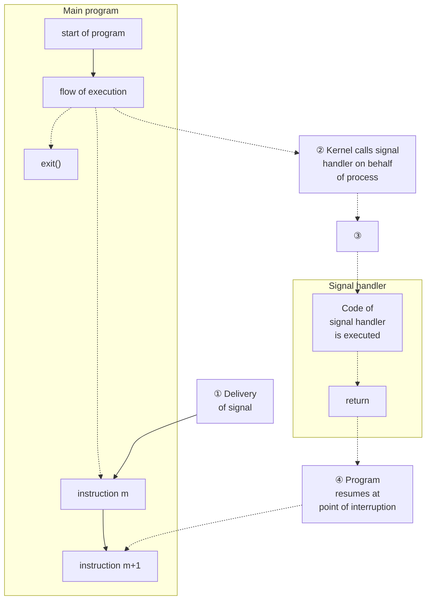
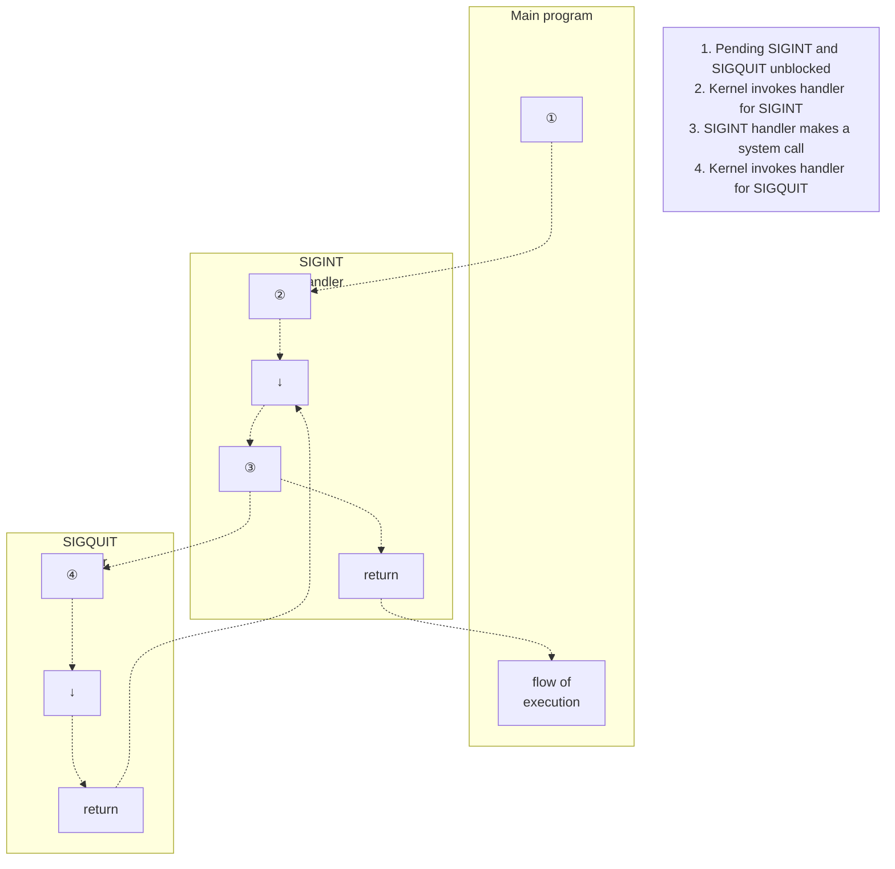

# **SIGNALS: FUNDAMENTAL CONCEPTS**

This chapter and next two chapters discuss signals. Although the fundamental concepts are simple, our discussion is quite lengthy, since there are many details to cover. This chapter covers the following topics:

-  the various different signals and their purposes;
-  the circumstances in which the kernel may generate a signal for a process, and the system calls that one process may use to send a signal to another process;
-  how a process responds to a signal by default, and the means by which a process can change its response to a signal, in particular, through the use of a signal handler, a programmer-defined function that is automatically invoked on receipt of a signal;
-  the use of a process signal mask to block signals, and the associated notion of pending signals; and
-  how a process can suspend execution and wait for the delivery of a signal.

### **20.1 Concepts and Overview**

A signal is a notification to a process that an event has occurred. Signals are sometimes described as software interrupts. Signals are analogous to hardware interrupts in that they interrupt the normal flow of execution of a program; in most cases, it is not possible to predict exactly when a signal will arrive.

One process can (if it has suitable permissions) send a signal to another process. In this use, signals can be employed as a synchronization technique, or even as a primitive form of interprocess communication (IPC). It is also possible for a process to send a signal to itself. However, the usual source of many signals sent to a process is the kernel. Among the types of events that cause the kernel to generate a signal for a process are the following:

-  A hardware exception occurred, meaning that the hardware detected a fault condition that was notified to the kernel, which in turn sent a corresponding signal to the process concerned. Examples of hardware exceptions include executing a malformed machine-language instruction, dividing by 0, or referencing a part of memory that is inaccessible.
-  The user typed one of the terminal special characters that generate signals. These characters include the interrupt character (usually Control-C) and the suspend character (usually Control-Z).
-  A software event occurred. For example, input became available on a file descriptor, the terminal window was resized, a timer went off, the process's CPU time limit was exceeded, or a child of this process terminated.

Each signal is defined as a unique (small) integer, starting sequentially from 1. These integers are defined in <signal.h> with symbolic names of the form SIGxxxx. Since the actual numbers used for each signal vary across implementations, it is these symbolic names that are always used in programs. For example, when the user types the interrupt character, SIGINT (signal number 2) is delivered to a process.

Signals fall into two broad categories. The first set constitutes the traditional or standard signals, which are used by the kernel to notify processes of events. On Linux, the standard signals are numbered from 1 to 31. We describe the standard signals in this chapter. The other set of signals consists of the realtime signals, whose differences from standard signals are described in Section 22.8.

A signal is said to be generated by some event. Once generated, a signal is later delivered to a process, which then takes some action in response to the signal. Between the time it is generated and the time it is delivered, a signal is said to be pending.

Normally, a pending signal is delivered to a process as soon as it is next scheduled to run, or immediately if the process is already running (e.g., if the process sent a signal to itself). Sometimes, however, we need to ensure that a segment of code is not interrupted by the delivery of a signal. To do this, we can add a signal to the process's signal mask—a set of signals whose delivery is currently blocked. If a signal is generated while it is blocked, it remains pending until it is later unblocked (removed from the signal mask). Various system calls allow a process to add and remove signals from its signal mask.

Upon delivery of a signal, a process carries out one of the following default actions, depending on the signal:

-  The signal is ignored; that is, it is discarded by the kernel and has no effect on the process. (The process never even knows that it occurred.)
-  The process is terminated (killed). This is sometimes referred to as abnormal process termination, as opposed to the normal process termination that occurs when a process terminates using exit().
-  A core dump file is generated, and the process is terminated. A core dump file contains an image of the virtual memory of the process, which can be loaded into a debugger in order to inspect the state of the process at the time that it terminated.
-  The process is stopped—execution of the process is suspended.
-  Execution of the process is resumed after previously being stopped.

Instead of accepting the default for a particular signal, a program can change the action that occurs when the signal is delivered. This is known as setting the disposition of the signal. A program can set one of the following dispositions for a signal:

-  The default action should occur. This is useful to undo an earlier change of the disposition of the signal to something other than its default.
-  The signal is ignored. This is useful for a signal whose default action would be to terminate the process.
-  A signal handler is executed.

A signal handler is a function, written by the programmer, that performs appropriate tasks in response to the delivery of a signal. For example, the shell has a handler for the SIGINT signal (generated by the interrupt character, Control-C) that causes it to stop what it is currently doing and return control to the main input loop, so that the user is once more presented with the shell prompt. Notifying the kernel that a handler function should be invoked is usually referred to as installing or establishing a signal handler. When a signal handler is invoked in response to the delivery of a signal, we say that the signal has been handled or, synonymously, caught.

Note that it isn't possible to set the disposition of a signal to terminate or dump core (unless one of these is the default disposition of the signal). The nearest we can get to this is to install a handler for the signal that then calls either exit() or abort(). The abort() function (Section 21.2.2) generates a SIGABRT signal for the process, which causes it to dump core and terminate.

> The Linux-specific /proc/PID/status file contains various bit-mask fields that can be inspected to determine a process's treatment of signals. The bit masks are displayed as hexadecimal numbers, with the least significant bit representing signal 1, the next bit to the left representing signal 2, and so on. These fields are SigPnd (per-thread pending signals), ShdPnd (process-wide pending signals; since Linux 2.6), SigBlk (blocked signals), SigIgn (ignored signals), and SigCgt (caught signals). (The difference between the SigPnd and ShdPnd fields will become clear when we describe the handling of signals in multithreaded processes in Section 33.2.) The same information can also be obtained using various options to the ps(1) command.

Signals appeared in very early UNIX implementations, but have gone through some significant changes since their inception. In early implementations, signals could be lost (i.e., not delivered to the target process) in certain circumstances. Furthermore, although facilities were provided to block delivery of signals while critical code was executed, in some circumstances, blocking was not reliable. These problems were remedied in 4.2BSD, which provided so-called reliable signals. (One further BSD innovation was the addition of extra signals to support shell job control, which we describe in Section 34.7.)

System V also added reliable semantics to signals, but employed a model incompatible with BSD. These incompatibilities were resolved only with the arrival of the POSIX.1-1990 standard, which adopted a specification for reliable signals largely based on the BSD model.

We consider the details of reliable and unreliable signals in Section 22.7, and briefly describe the older BSD and System V signal APIs in Section 22.13.

# **20.2 Signal Types and Default Actions**

Earlier, we mentioned that the standard signals are numbered from 1 to 31 on Linux. However, the Linux signal(7) manual page lists more than 31 signal names. The excess names can be accounted for in a variety of ways. Some of the names are simply synonyms for other names, and are defined for source compatibility with other UNIX implementations. Other names are defined but unused. The following list describes the various signals:

### SIGABRT

A process is sent this signal when it calls the abort() function (Section 21.2.2). By default, this signal terminates the process with a core dump. This achieves the intended purpose of the abort() call: to produce a core dump for debugging.

### SIGALRM

The kernel generates this signal upon the expiration of a real-time timer set by a call to alarm() or setitimer(). A real-time timer is one that counts according to wall clock time (i.e., the human notion of elapsed time). For further details, see Section 23.1.

### SIGBUS

This signal ("bus error") is generated to indicate certain kinds of memoryaccess errors. One such error can occur when using memory mappings created with mmap(), if we attempt to access an address that lies beyond the end of the underlying memory-mapped file, as described in Section 49.4.3.

### SIGCHLD

This signal is sent (by the kernel) to a parent process when one of its children terminates (either by calling exit() or as a result of being killed by a signal). It may also be sent to a process when one of its children is stopped or resumed by a signal. We consider SIGCHLD in detail in Section 26.3.

SIGCLD

This is a synonym for SIGCHLD.

SIGCONT

When sent to a stopped process, this signal causes the process to resume (i.e., to be rescheduled to run at some later time). When received by a process that is not currently stopped, this signal is ignored by default. A process may catch this signal, so that it carries out some action when it resumes. This signal is covered in more detail in Sections 22.2 and 34.7.

SIGEMT

In UNIX systems generally, this signal is used to indicate an implementationdependent hardware error. On Linux, this signal is used only in the Sun SPARC implementation. The suffix EMT derives from emulator trap, an assembler mnemonic on the Digital PDP-11.

SIGFPE

This signal is generated for certain types of arithmetic errors, such as divide-by-zero. The suffix FPE is an abbreviation for floating-point exception, although this signal can also be generated for integer arithmetic errors. The precise details of when this signal is generated depend on the hardware architecture and the settings of CPU control registers. For example, on x86-32, integer divide-by-zero always yields a SIGFPE, but the handling of floating-point divide-by-zero depends on whether the FE\_DIVBYZERO exception has been enabled. If this exception is enabled (using feenableexcept()), then a floating-point divide-by-zero generates SIGFPE; otherwise, it yields the IEEE-standard result for the operands (a floating-point representation of infinity). See the fenv(3) manual page and <fenv.h> for further information.

SIGHUP

When a terminal disconnect (hangup) occurs, this signal is sent to the controlling process of the terminal. We describe the concept of a controlling process and the various circumstances in which SIGHUP is sent in Section 34.6. A second use of SIGHUP is with daemons (e.g., init, httpd, and inetd). Many daemons are designed to respond to the receipt of SIGHUP by reinitializing themselves and rereading their configuration files. The system administrator triggers these actions by manually sending SIGHUP to the daemon, either by using an explicit kill command or by executing a program or script that does the same.

SIGILL

This signal is sent to a process if it tries to execute an illegal (i.e., incorrectly formed) machine-language instruction.

SIGINFO

On Linux, this signal name is a synonym for SIGPWR. On BSD systems, the SIGINFO signal, generated by typing Control-T, is used to obtain status information about the foreground process group.

SIGINT

When the user types the terminal interrupt character (usually Control-C), the terminal driver sends this signal to the foreground process group. The default action for this signal is to terminate the process.

SIGIO

Using the fcntl() system call, it is possible to arrange for this signal to be generated when an I/O event (e.g., input becoming available) occurs on certain types of open file descriptors, such as those for terminals and sockets. This feature is described further in Section 63.3.

SIGIOT

On Linux, this is a synonym for SIGABRT. On some other UNIX implementations, this signal indicates an implementation-defined hardware fault.

SIGKILL

This is the sure kill signal. It can't be blocked, ignored, or caught by a handler, and thus always terminates a process.

SIGLOST

This signal name exists on Linux, but is unused. On some other UNIX implementations, the NFS client sends this signal to local processes holding locks if the NSF client fails to regain locks held by the those processes following the recovery of a remote NFS server that crashed. (This feature is not standardized in NFS specifications.)

SIGPIPE

This signal is generated when a process tries to write to a pipe, a FIFO, or a socket for which there is no corresponding reader process. This normally occurs because the reading process has closed its file descriptor for the IPC channel. See Section 44.2 for further details.

SIGPOLL

This signal, which is derived from System V, is a synonym for SIGIO on Linux.

SIGPROF

The kernel generates this signal upon the expiration of a profiling timer set by a call to setitimer() (Section 23.1). A profiling timer is one that counts the CPU time used by a process. Unlike a virtual timer (see SIGVTALRM below), a profiling timer counts CPU time used in both user mode and kernel mode.

SIGPWR

This is the power failure signal. On systems that have an uninterruptible power supply (UPS), it is possible to set up a daemon process that monitors the backup battery level in the event of a power failure. If the battery power is about to run out (after an extended power outage), then the monitoring process sends SIGPWR to the init process, which interprets this signal as a request to shut down the system in a quick and orderly fashion.

### SIGQUIT

When the user types the quit character (usually Control-\) on the keyboard, this signal is sent to the foreground process group. By default, this signal terminates a process and causes it to produce a core dump, which can then be used for debugging. Using SIGQUIT in this manner is useful with a program that is stuck in an infinite loop or is otherwise not responding. By typing Control-\ and then loading the resulting core dump with the gdb debugger and using the backtrace command to obtain a stack trace, we can find out which part of the program code was executing. ([Matloff, 2008] describes the use of gdb.)

### SIGSEGV

This very popular signal is generated when a program makes an invalid memory reference. A memory reference may be invalid because the referenced page doesn't exist (e.g., it lies in an unmapped area somewhere between the heap and the stack), the process tried to update a location in read-only memory (e.g., the program text segment or a region of mapped memory marked read-only), or the process tried to access a part of kernel memory while running in user mode (Section 2.1). In C, these events often result from dereferencing a pointer containing a bad address (e.g., an uninitialized pointer) or passing an invalid argument in a function call. The name of this signal derives from the term segmentation violation.

### SIGSTKFLT

Documented in signal(7) as "stack fault on coprocessor," this signal is defined, but is unused on Linux.

### SIGSTOP

This is the sure stop signal. It can't be blocked, ignored, or caught by a handler; thus, it always stops a process.

### SIGSYS

This signal is generated if a process makes a "bad" system call. This means that the process executed an instruction that was interpreted as a system call trap, but the associated system call number was not valid (refer to Section 3.1).

### SIGTERM

This is the standard signal used for terminating a process and is the default signal sent by the kill and killall commands. Users sometimes explicitly send the SIGKILL signal to a process using kill –KILL or kill –9. However, this is generally a mistake. A well-designed application will have a handler for SIGTERM that causes the application to exit gracefully, cleaning up temporary files and releasing other resources beforehand. Killing a process with SIGKILL bypasses the SIGTERM handler. Thus, we should always first attempt to terminate a process using SIGTERM, and reserve SIGKILL as a last resort for killing runaway processes that don't respond to SIGTERM.

### SIGTRAP

This signal is used to implement debugger breakpoints and system call tracing, as performed by strace(1) (Appendix A). See the ptrace(2) manual page for further information.

### SIGTSTP

This is the job-control stop signal, sent to stop the foreground process group when the user types the suspend character (usually Control-Z) on the keyboard. Chapter 34 describes process groups (jobs) and job control in detail, as well as details of when and how a program may need to handle this signal. The name of this signal derives from "terminal stop."

### SIGTTIN

When running under a job-control shell, the terminal driver sends this signal to a background process group when it attempts to read() from the terminal. This signal stops a process by default.

### SIGTTOU

This signal serves an analogous purpose to SIGTTIN, but for terminal output by background jobs. When running under a job-control shell, if the TOSTOP (terminal output stop) option has been enabled for the terminal (perhaps via the command stty tostop), the terminal driver sends SIGTTOU to a background process group when it attempts to write() to the terminal (see Section 34.7.1). This signal stops a process by default.

### SIGUNUSED

As the name implies, this signal is unused. On Linux 2.4 and later, this signal name is synonymous with SIGSYS on many architectures. In other words, this signal number is no longer unused on those architectures, although the signal name remains for backward compatibility.

### SIGURG

This signal is sent to a process to indicate the presence of out-of-band (also known as urgent) data on a socket (Section 61.13.1).

### SIGUSR1

This signal and SIGUSR2 are available for programmer-defined purposes. The kernel never generates these signals for a process. Processes may use these signals to notify one another of events or to synchronize with each other. In early UNIX implementations, these were the only two signals that could be freely used in applications. (In fact, processes can send one another any signal, but this has the potential for confusion if the kernel also generates one of the signals for a process.) Modern UNIX implementations provide a large set of realtime signals that are also available for programmer-defined purposes (Section 22.8).

### SIGUSR2

See the description of SIGUSR1.

### SIGVTALRM

The kernel generates this signal upon expiration of a virtual timer set by a call to setitimer() (Section 23.1). A virtual timer is one that counts the usermode CPU time used by a process.

### SIGWINCH

In a windowing environment, this signal is sent to the foreground process group when the terminal window size changes (as a consequence either of the user manually resizing it, or of a program resizing it via a call to ioctl(), as described in Section 62.9). By installing a handler for this signal, programs such as vi and less can know to redraw their output after a change in window size.

### SIGXCPU

This signal is sent to a process when it exceeds its CPU time resource limit (RLIMIT\_CPU, described in Section 36.3).

### SIGXFSZ

This signal is sent to a process if it attempts (using write() or truncate()) to increase the size of a file beyond the process's file size resource limit (RLIMIT\_FSIZE, described in Section 36.3).

Table 20-1 summarizes a range of information about signals on Linux. Note the following points about this table:

-  The signal number column shows the number assigned to this signal on various hardware architectures. Except where otherwise indicated, signals have the same number on all architectures. Architectural differences in signal numbers are indicated in parentheses, and occur on the Sun SPARC and SPARC64 (S), HP/Compaq/Digital Alpha (A), MIPS (M), and HP PA-RISC (P) architectures. In this column, undef indicates that a symbol is undefined on the indicated architectures.
-  The SUSv3 column indicates whether the signal is standardized in SUSv3.
-  The Default column indicates the default action of the signal: term means that the signal terminates the process, core means that the process produces a core dump file and terminates, ignore means that the signal is ignored, stop means that the signal stops the process, and cont means that the signal resumes a stopped process.

Certain of the signals listed previously are not shown in Table 20-1: SIGCLD (synonym for SIGCHLD), SIGINFO (unused), SIGIOT (synonym for SIGABRT), SIGLOST (unused), and SIGUNUSED (synonym for SIGSYS on many architectures).

**Table 20-1:** Linux signals

| Name      | Signal number          | Description                      | SUSv3 | Default |
|-----------|------------------------|----------------------------------|-------|---------|
| SIGABRT   | 6                      | Abort process                    | •     | core    |
| SIGALRM   | 14                     | Real-time timer expired<br>•     |       | term    |
| SIGBUS    | 7 (SAMP=10)            | Memory access error<br>•         |       | core    |
| SIGCHLD   | 17 (SA=20, MP=18)      | •<br>Child terminated or stopped |       | ignore  |
| SIGCONT   | 18 (SA=19, M=25, P=26) | Continue if stopped<br>•         |       | cont    |
| SIGEMT    | undef (SAMP=7)         | Hardware fault                   |       | term    |
| SIGFPE    | 8                      | •<br>Arithmetic exception        |       | core    |
| SIGHUP    | 1                      | Hangup<br>•                      |       | term    |
| SIGILL    | 4                      | Illegal instruction<br>•         |       | core    |
| SIGINT    | 2                      | •<br>Terminal interrupt          |       | term    |
| SIGIO /   | 29 (SA=23, MP=22)      | I/O possible                     | •     | term    |
| SIGPOLL   |                        |                                  |       |         |
| SIGKILL   | 9                      | Sure kill                        | •     | term    |
| SIGPIPE   | 13                     | Broken pipe                      | •     | term    |
| SIGPROF   | 27 (M=29, P=21)        | Profiling timer expired          | •     | term    |
| SIGPWR    | 30 (SA=29, MP=19)      | Power about to fail              |       | term    |
| SIGQUIT   | 3                      | Terminal quit                    | •     | core    |
| SIGSEGV   | 11                     | Invalid memory reference         | •     | core    |
| SIGSTKFLT | 16 (SAM=undef, P=36)   | Stack fault on coprocessor       |       | term    |
| SIGSTOP   | 19 (SA=17, M=23, P=24) | Sure stop<br>•                   |       | stop    |
| SIGSYS    | 31 (SAMP=12)           | Invalid system call              | •     | core    |
| SIGTERM   | 15                     | Terminate process                | •     | term    |
| SIGTRAP   | 5                      | Trace/breakpoint trap            | •     | core    |
| SIGTSTP   | 20 (SA=18, M=24, P=25) | Terminal stop                    | •     | stop    |
| SIGTTIN   | 21 (M=26, P=27)        | Terminal read from BG            | •     | stop    |
| SIGTTOU   | 22 (M=27, P=28)        | Terminal write from BG           | •     | stop    |
| SIGURG    | 23 (SA=16, M=21, P=29) | Urgent data on socket            | •     | ignore  |
| SIGUSR1   | 10 (SA=30, MP=16)      | User-defined signal 1            | •     | term    |
| SIGUSR2   | 12 (SA=31, MP=17)      | User-defined signal 2            | •     | term    |
| SIGVTALRM | 26 (M=28, P=20)        | Virtual timer expired            | •     | term    |
| SIGWINCH  | 28 (M=20, P=23)        | Terminal window size change      |       | ignore  |
| SIGXCPU   | 24 (M=30, P=33)        | CPU time limit exceeded          | •     | core    |
| SIGXFSZ   | 25 (M=31, P=34)        | File size limit exceeded         | •     | core    |

Note the following points regarding the default behavior shown for certain signals in Table 20-1:

-  On Linux 2.2, the default action for the signals SIGXCPU, SIGXFSZ, SIGSYS, and SIGBUS is to terminate the process without producing a core dump. From kernel 2.4 onward, Linux conforms to the requirements of SUSv3, with these signals causing termination with a core dump. On several other UNIX implementations, SIGXCPU and SIGXFSZ are treated in the same way as on Linux 2.2.
-  SIGPWR is typically ignored by default on those other UNIX implementations where it appears.

-  SIGIO is ignored by default on several UNIX implementations (particularly BSD derivatives).
-  Although not specified by any standards, SIGEMT appears on most UNIX implementations. However, this signal typically results in termination with a core dump on other implementations.
-  In SUSv1, the default action for SIGURG was specified as process termination, and this is the default in some older UNIX implementations. SUSv2 adopted the current specification (ignore).

# <span id="page-10-0"></span>**20.3 Changing Signal Dispositions: signal()**

UNIX systems provide two ways of changing the disposition of a signal: signal() and sigaction(). The signal() system call, which is described in this section, was the original API for setting the disposition of a signal, and it provides a simpler interface than sigaction(). On the other hand, sigaction() provides functionality that is not available with signal(). Furthermore, there are variations in the behavior of signal() across UNIX implementations (Section 22.7), which mean that it should never be used for establishing signal handlers in portable programs. Because of these portability issues, sigaction() is the (strongly) preferred API for establishing a signal handler. After we explain the use of sigaction() in Section [20.13,](#page-29-0) we'll always employ that call when establishing signal handlers in our example programs.

> Although documented in section 2 of the Linux manual pages, signal() is actually implemented in glibc as a library function layered on top of the sigaction() system call.

```
#include <signal.h>
void ( *signal(int sig, void (*handler)(int)) ) (int);
              Returns previous signal disposition on success, or SIG_ERR on error
```

The function prototype for signal() requires some decoding. The first argument, sig, identifies the signal whose disposition we wish to change. The second argument, handler, is the address of the function that should be called when this signal is delivered. This function returns nothing (void) and takes one integer argument. Thus, a signal handler has the following general form:

```
void
handler(int sig)
{
 /* Code for the handler */
}
```

We describe the purpose of the sig argument to the handler function in Section [20.4](#page-11-0). The return value of signal() is the previous disposition of the signal. Like the handler argument, this is a pointer to a function returning nothing and taking one integer argument. In other words, we could write code such as the following to temporarily establish a handler for a signal, and then reset the disposition of the signal to whatever it was previously:

```
void (*oldHandler)(int);
oldHandler = signal(SIGINT, newHandler);
if (oldHandler == SIG_ERR)
 errExit("signal");
/* Do something else here. During this time, if SIGINT is
 delivered, newHandler will be used to handle the signal. */
if (signal(SIGINT, oldHandler) == SIG_ERR)
 errExit("signal");
```

It is not possible to use signal() to retrieve the current disposition of a signal without at the same time changing that disposition. To do that, we must use sigaction().

We can make the prototype for signal() much more comprehensible by using the following type definition for a pointer to a signal handler function:

```
typedef void (*sighandler_t)(int);
```

This enables us to rewrite the prototype for signal() as follows:

```
sighandler_t signal(int sig, sighandler_t handler);
```

If the \_GNU\_SOURCE feature test macro is defined, then glibc exposes the nonstandard sighandler\_t data type in the <signal.h> header file.

Instead of specifying the address of a function as the handler argument of signal(), we can specify one of the following values:

SIG\_DFL

Reset the disposition of the signal to its default (Table 20-1). This is useful for undoing the effect of an earlier call to signal() that changed the disposition for the signal.

SIG\_IGN

Ignore the signal. If the signal is generated for this process, the kernel silently discards it. The process never even knows that the signal occurred.

A successful call to signal() returns the previous disposition of the signal, which may be the address of a previously installed handler function, or one of the constants SIG\_DFL or SIG\_IGN. On error, signal() returns the value SIG\_ERR.

# <span id="page-11-0"></span>**20.4 Introduction to Signal Handlers**

A signal handler (also called a signal catcher) is a function that is called when a specified signal is delivered to a process. We describe the fundamentals of signal handlers in this section, and then go into the details in Chapter 21.

Invocation of a signal handler may interrupt the main program flow at any time; the kernel calls the handler on the process's behalf, and when the handler returns, execution of the program resumes at the point where the handler interrupted it. This sequence is illustrated in [Figure 20-1.](#page-12-0)



<span id="page-12-0"></span>**Figure 20-1:** Signal delivery and handler execution

Although signal handlers can do virtually anything, they should, in general, be designed to be as simple as possible. We expand on this point in Section 21.1.

<span id="page-12-1"></span>**Listing 20-1:** Installing a handler for SIGINT

```
––––––––––––––––––––––––––––––––––––––––––––––––––––––––––– signals/ouch.c
#include <signal.h>
#include "tlpi_hdr.h"
static void
sigHandler(int sig)
{
 printf("Ouch!\n"); /* UNSAFE (see Section 21.1.2) */
}
int
main(int argc, char *argv[])
{
 int j;
 if (signal(SIGINT, sigHandler) == SIG_ERR)
 errExit("signal");
 for (j = 0; ; j++) {
 printf("%d\n", j);
 sleep(3); /* Loop slowly... */
 }
}
––––––––––––––––––––––––––––––––––––––––––––––––––––––––––– signals/ouch.c
```

[Listing 20-1](#page-12-1) (on page [399\)](#page-12-1) shows a simple example of a signal handler function and a main program that establishes it as the handler for the SIGINT signal. (The terminal driver generates this signal when we type the terminal interrupt character, usually Control-C.) The handler simply prints a message and returns.

The main program continuously loops. On each iteration, the program increments a counter whose value it prints, and then the program sleeps for a few seconds. (To sleep in this manner, we use the sleep() function, which suspends the execution of its caller for a specified number of seconds. We describe this function in Section 23.4.1.)

When we run the program in [Listing 20-1,](#page-12-1) we see the following:

```
$ ./ouch
0 Main program loops, displaying successive integers
Type Control-C
Ouch! Signal handler is executed, and returns
1 Control has returned to main program
2
Type Control-C again
Ouch!
3
Type Control-\ (the terminal quit character)
Quit (core dumped)
```

When the kernel invokes a signal handler, it passes the number of the signal that caused the invocation as an integer argument to the handler. (This is the sig argument in the handler of [Listing 20-1\)](#page-12-1). If a signal handler catches only one type of signal, then this argument is of little use. We can, however, establish the same handler to catch different types of signals and use this argument to determine which signal caused the handler to be invoked.

This is illustrated in [Listing 20-2,](#page-14-0) a program that establishes the same handler for SIGINT and SIGQUIT. (SIGQUIT is generated by the terminal driver when we type the terminal quit character, usually Control-\.) The code of the handler distinguishes the two signals by examining the sig argument, and takes different actions for each signal. In the main() function, we use pause() (described in Section [20.14](#page-31-0)) to block the process until a signal is caught.

The following shell session log demonstrates the use of this program:

```
$ ./intquit
Type Control-C
Caught SIGINT (1)
Type Control-C again
Caught SIGINT (2)
and again
Caught SIGINT (3)
Type Control-\
Caught SIGQUIT - that's all folks!
```

In [Listing 20-1](#page-12-1) and [Listing 20-2,](#page-14-0) we use printf() to display the message from the signal handler. For reasons that we discuss in Section 21.1.2, real-world applications should generally never call stdio functions from within a signal handler. However, in various example programs, we'll nevertheless call printf() from a signal handler as a simple means of seeing when the handler is called.

<span id="page-14-0"></span>**Listing 20-2:** Establishing the same handler for two different signals

```
––––––––––––––––––––––––––––––––––––––––––––––––––––––––– signals/intquit.c
#include <signal.h>
#include "tlpi_hdr.h"
static void
sigHandler(int sig)
{
 static int count = 0;
 /* UNSAFE: This handler uses non-async-signal-safe functions
 (printf(), exit(); see Section 21.1.2) */
 if (sig == SIGINT) {
 count++;
 printf("Caught SIGINT (%d)\n", count);
 return; /* Resume execution at point of interruption */
 }
 /* Must be SIGQUIT - print a message and terminate the process */
 printf("Caught SIGQUIT - that's all folks!\n");
 exit(EXIT_SUCCESS);
}
int
main(int argc, char *argv[])
{
 /* Establish same handler for SIGINT and SIGQUIT */
 if (signal(SIGINT, sigHandler) == SIG_ERR)
 errExit("signal");
 if (signal(SIGQUIT, sigHandler) == SIG_ERR)
 errExit("signal");
 for (;;) /* Loop forever, waiting for signals */
 pause(); /* Block until a signal is caught */
}
––––––––––––––––––––––––––––––––––––––––––––––––––––––––– signals/intquit.c
```

# **20.5 Sending Signals: kill()**

One process can send a signal to another process using the kill() system call, which is the analog of the kill shell command. (The term kill was chosen because the default action of most of the signals that were available on early UNIX implementations was to terminate the process.)

```
#include <signal.h>
int kill(pid_t pid, int sig);
                                             Returns 0 on success, or –1 on error
```

The pid argument identifies one or more processes to which the signal specified by sig is to be sent. Four different cases determine how pid is interpreted:

-  If pid is greater than 0, the signal is sent to the process with the process ID specified by pid.
-  If pid equals 0, the signal is sent to every process in the same process group as the calling process, including the calling process itself. (SUSv3 states that the signal should be sent to all processes in the same process group, excluding an "unspecified set of system processes" and adds the same qualification to each of the remaining cases.)
-  If pid is less than –1, the signal is sent to all of the processes in the process group whose ID equals the absolute value of pid. Sending a signal to all of the processes in a process group finds particular use in shell job control (Section 34.7).
-  If pid equals –1, the signal is sent to every process for which the calling process has permission to send a signal, except init (process ID 1) and the calling process. If a privileged process makes this call, then all processes on the system will be signaled, except for these last two. For obvious reasons, signals sent in this way are sometimes called broadcast signals. (SUSv3 doesn't require that the calling process be excluded from receiving the signal; Linux follows the BSD semantics in this regard.)

If no process matches the specified pid, kill() fails and sets errno to ESRCH ("No such process").

A process needs appropriate permissions to be able send a signal to another process. The permission rules are as follows:

-  A privileged (CAP\_KILL) process may send a signal to any process.
-  The init process (process ID 1), which runs with user and group of root, is a special case. It can be sent only signals for which it has a handler installed. This prevents the system administrator from accidentally killing init, which is fundamental to the operation of the system.
-  An unprivileged process can send a signal to another process if the real or effective user ID of the sending process matches the real user ID or saved setuser-ID of the receiving process, as shown in [Figure 20-2](#page-16-0). This rule allows users to send signals to set-user-ID programs that they have started, regardless of the current setting of the target process's effective user ID. Excluding the effective user ID of the target from the check serves a complementary purpose: it prevents one user from sending signals to another user's process that is running a setuser-ID program belonging to the user trying to send the signal. (SUSv3 mandates the rules shown in [Figure 20-2,](#page-16-0) but Linux followed slightly different rules in kernel versions before 2.0, as described in the kill(2) manual page.)

 The SIGCONT signal is treated specially. An unprivileged process may send this signal to any other process in the same session, regardless of user ID checks. This rule allows job-control shells to restart stopped jobs (process groups), even if the processes of the job have changed their user IDs (i.e., they are privileged processes that have used the system calls described in Section 9.7 to change their credentials).

```text
Sending process              Receiving process
┌─────────────────────┐      ┌─────────────────────┐
│   real user ID      │─────>│   real user ID      │
├─────────────────────┤  ┌──>├─────────────────────┤
│ effective user ID   │──┤   │ effective user ID   │
├─────────────────────┤  └──>├─────────────────────┤
│ saved set-user-ID   │─────>│ saved set-user-ID   │
└─────────────────────┘      └─────────────────────┘

        indicates that if IDs match,
───────> then sender has permission
        to send a signal to receiver
```

<span id="page-16-0"></span>**Figure 20-2:** Permissions required for an unprivileged process to send a signal

If a process doesn't have permissions to send a signal to the requested pid, then kill() fails, setting errno to EPERM. Where pid specifies a set of processes (i.e., pid is negative), kill() succeeds if at least one of them could be signaled.

We demonstrate the use of kill() in Listing 20-3.

# **20.6 Checking for the Existence of a Process**

The kill() system call can serve another purpose. If the sig argument is specified as 0 (the so-called null signal), then no signal is sent. Instead, kill() merely performs error checking to see if the process can be signaled. Read another way, this means we can use the null signal to test if a process with a specific process ID exists. If sending a null signal fails with the error ESRCH, then we know the process doesn't exist. If the call fails with the error EPERM (meaning the process exists, but we don't have permission to send a signal to it) or succeeds (meaning we do have permission to send a signal to the process), then we know that the process exists.

Verifying the existence of a particular process ID doesn't guarantee that a particular program is still running. Because the kernel recycles process IDs as processes are born and die, the same process ID may, over time, refer to a different process. Furthermore, a particular process ID may exist, but be a zombie (i.e., a process that has died, but whose parent has not yet performed a wait() to obtain its termination status, as described in Section 26.2).

Various other techniques can also be used to check whether a particular process is running, including the following:

-  The wait() system calls: These calls are described in Chapter 26. They can be employed only if the monitored process is a child of the caller.
-  Semaphores and exclusive file locks: If the process that is being monitored continuously holds a semaphore or a file lock, then, if we can acquire the semaphore or lock, we know the process has terminated. We describe semaphores in Chapters 47 and 53 and file locks in Chapter 55.

-  IPC channels such as pipes and FIFOs: We set up the monitored process so that it holds a file descriptor open for writing on the channel as long as it is alive. Meanwhile, the monitoring process holds open a read descriptor for the channel, and it knows that the monitored process has terminated when the write end of the channel is closed (because it sees end-of-file). The monitoring process can determine this either by reading from its file descriptor or by monitoring the descriptor using one of the techniques described in Chapter 63.
-  The /proc/PID interface: For example, if a process with the process ID 12345 exists, then the directory /proc/12345 will exist, and we can check this using a call such as stat().

All of these techniques, except the last, are unaffected by recycling of process IDs. Listing 20-3 demonstrates the use of kill(). This program takes two commandline arguments, a signal number and a process ID, and uses kill() to send the signal to the specified process. If signal 0 (the null signal) is specified, then the program reports on the existence of the target process.

# **20.7 Other Ways of Sending Signals: raise() and killpg()**

Sometimes, it is useful for a process to send a signal to itself. (We see an example of this in Section 34.7.3.) The raise() function performs this task.

```
#include <signal.h>
int raise(int sig);
                                      Returns 0 on success, or nonzero on error
```

In a single-threaded program, a call to raise() is equivalent to the following call to kill():

```
kill(getpid(), sig);
```

On a system that supports threads, raise(sig) is implemented as:

```
pthread_kill(pthread_self(), sig)
```

We describe the pthread\_kill() function in Section 33.2.3, but for now it is sufficient to say that this implementation means that the signal will be delivered to the specific thread that called raise(). By contrast, the call kill(getpid(), sig) sends a signal to the calling process, and that signal may be delivered to any thread in the process.

> The raise() function originates from C89. The C standards don't cover operating system details such as process IDs, but raise() can be specified within the C standard because it doesn't require reference to process IDs.

When a process sends itself a signal using raise() (or kill()), the signal is delivered immediately (i.e., before raise() returns to the caller).

Note that raise() returns a nonzero value (not necessarily –1) on error. The only error that can occur with raise() is EINVAL, because sig was invalid. Therefore, where we specify one of the SIGxxxx constants, we don't check the return status of this function.

```
––––––––––––––––––––––––––––––––––––––––––––––––––––––––––signals/t_kill.c
#include <signal.h>
#include "tlpi_hdr.h"
int
main(int argc, char *argv[])
{
 int s, sig;
 if (argc != 3 || strcmp(argv[1], "--help") == 0)
 usageErr("%s sig-num pid\n", argv[0]);
 sig = getInt(argv[2], 0, "sig-num");
 s = kill(getLong(argv[1], 0, "pid"), sig);
 if (sig != 0) {
 if (s == -1)
 errExit("kill");
 } else { /* Null signal: process existence check */
 if (s == 0) {
 printf("Process exists and we can send it a signal\n");
 } else {
 if (errno == EPERM)
 printf("Process exists, but we don't have "
 "permission to send it a signal\n");
 else if (errno == ESRCH)
 printf("Process does not exist\n");
 else
 errExit("kill");
 }
 }
 exit(EXIT_SUCCESS);
}
––––––––––––––––––––––––––––––––––––––––––––––––––––––––––signals/t_kill.c
```

The killpg() function sends a signal to all of the members of a process group.

```
#include <signal.h>
int killpg(pid_t pgrp, int sig);
                                             Returns 0 on success, or –1 on error
```

A call to killpg() is equivalent to the following call to kill():

```
kill(-pgrp, sig);
```

If pgrp is specified as 0, then the signal is sent to all processes in the same process group as the caller. SUSv3 leaves this point unspecified, but most UNIX implementations interpret this case in the same way as Linux.

# **20.8 Displaying Signal Descriptions**

Each signal has an associated printable description. These descriptions are listed in the array sys\_siglist. For example, we can refer to sys\_siglist[SIGPIPE] to get the description for SIGPIPE (broken pipe). However, rather than using the sys\_siglist array directly, the strsignal() function is preferable.

```
#define _BSD_SOURCE
#include <signal.h>
extern const char *const sys_siglist[];
#define _GNU_SOURCE
#include <string.h>
char *strsignal(int sig);
                                      Returns pointer to signal description string
```

The strsignal() function performs bounds checking on the sig argument, and then returns a pointer to a printable description of the signal, or a pointer to an error string if the signal number was invalid. (On some other UNIX implementations, strsignal() returns NULL if sig is invalid.)

Aside from bounds checking, another advantage of strsignal() over the direct use of sys\_siglist is that strsignal() is locale-sensitive (Section 10.4), so that signal descriptions will be displayed in the local language.

An example of the use of strsignal() is shown in Listing 20-4.

The psignal() function displays (on standard error) the string given in its argument msg, followed by a colon, and then the signal description corresponding to sig. Like strsignal(), psignal() is locale-sensitive.

```
#include <signal.h>
void psignal(int sig, const char *msg);
```

Although psignal(), strsignal(), and sys\_siglist are not standardized as part of SUSv3, they are nevertheless available on many UNIX implementations. (SUSv4 adds specifications for psignal() and strsignal().)

# <span id="page-19-0"></span>**20.9 Signal Sets**

Many signal-related system calls need to be able to represent a group of different signals. For example, sigaction() and sigprocmask() allow a program to specify a group of signals that are to be blocked by a process, while sigpending() returns a group of signals that are currently pending for a process. (We describe these system calls shortly.)

Multiple signals are represented using a data structure called a signal set, provided by the system data type sigset\_t. SUSv3 specifies a range of functions for manipulating signal sets, and we now describe these functions.

> On Linux, as on most UNIX implementations, the sigset\_t data type is a bit mask. However, SUSv3 doesn't require this. A signal set could conceivably be represented using some other kind of structure. SUSv3 requires only that the type of sigset\_t be assignable. Thus, it must be implemented using either some scalar type (e.g., an integer) or a C structure (perhaps containing an array of integers).

The sigemptyset() function initializes a signal set to contain no members. The sigfillset() function initializes a set to contain all signals (including all realtime signals).

```
#include <signal.h>
int sigemptyset(sigset_t *set);
int sigfillset(sigset_t *set);
                                          Both return 0 on success, or –1 on error
```

One of sigemptyset() or sigaddset() must be used to initialize a signal set. This is because C doesn't initialize automatic variables, and the initialization of static variables to 0 can't portably be relied upon as indicating an empty signal set, since signal sets may be implemented using structures other than bit masks. (For the same reason, it is incorrect to use memset(3) to zero the contents of a signal set in order to mark it as empty.)

After initialization, individual signals can be added to a set using sigaddset() and removed using sigdelset().

```
#include <signal.h>
int sigaddset(sigset_t *set, int sig);
int sigdelset(sigset_t *set, int sig);
                                          Both return 0 on success, or –1 on error
```

For both sigaddset() and sigdelset(), the sig argument is a signal number. The sigismember() function is used to test for membership of a set.

```
#include <signal.h>
int sigismember(const sigset_t *set, int sig);
                                    Returns 1 if sig is a member of set, otherwise 0
```

The sigismember() function returns 1 (true) if sig is a member of set, and 0 (false) otherwise.

The GNU C library implements three nonstandard functions that perform tasks that are complementary to the standard signal set functions just described.

```
#define _GNU_SOURCE
#include <signal.h>
int sigandset(sigset_t *set, sigset_t *left, sigset_t *right);
int sigorset(sigset_t *dest, sigset_t *left, sigset_t *right);
                                          Both return 0 on success, or –1 on error
int sigisemptyset(const sigset_t *set);
                                              Returns 1 if sig is empty, otherwise 0
```

These functions perform the following tasks:

-  sigandset() places the intersection of the sets left and right in the set dest;
-  sigorset() places the union of the sets left and right in the set dest; and
-  sigisemptyset() returns true if set contains no signals.

### **Example program**

Using the functions described in this section, we can write the functions shown in [Listing 20-4](#page-21-0), which we employ in various later programs. The first of these, printSigset(), displays the signals that are members of the specified signal set. This function uses the NSIG constant, which is defined in <signal.h> to be one greater than the highest signal number. We use NSIG as the upper bound in a loop that tests all signal numbers for membership of a set.

> Although NSIG is not specified in SUSv3, it is defined on most UNIX implementations. However, it may be necessary to use implementation-specific compiler options to make it visible. For example, on Linux, we must define one of the feature test macros \_BSD\_SOURCE, \_SVID\_SOURCE, or \_GNU\_SOURCE.

The printSigMask() and printPendingSigs() functions employ printSigset() to display, respectively, the process signal mask and the set of currently pending signals. The printSigMask() and printPendingSigs() functions use the sigprocmask() and sigpending() system calls, respectively. We describe the sigprocmask() and sigpending() system calls in Sections [20.10](#page-23-0) and [20.11](#page-24-0).

<span id="page-21-0"></span>**Listing 20-4:** Functions for displaying signal sets

```
––––––––––––––––––––––––––––––––––––––––––––––––– signals/signal_functions.c
#define _GNU_SOURCE
#include <string.h>
#include <signal.h>
#include "signal_functions.h" /* Declares functions defined here */
#include "tlpi_hdr.h"
/* NOTE: All of the following functions employ fprintf(), which
 is not async-signal-safe (see Section 21.1.2). As such, these
```

```
 functions are also not async-signal-safe (i.e., beware of
 indiscriminately calling them from signal handlers). */
void /* Print list of signals within a signal set */
printSigset(FILE *of, const char *prefix, const sigset_t *sigset)
{
 int sig, cnt;
 cnt = 0;
 for (sig = 1; sig < NSIG; sig++) {
 if (sigismember(sigset, sig)) {
 cnt++;
 fprintf(of, "%s%d (%s)\n", prefix, sig, strsignal(sig));
 }
 }
 if (cnt == 0)
 fprintf(of, "%s<empty signal set>\n", prefix);
}
int /* Print mask of blocked signals for this process */
printSigMask(FILE *of, const char *msg)
{
 sigset_t currMask;
 if (msg != NULL)
 fprintf(of, "%s", msg);
 if (sigprocmask(SIG_BLOCK, NULL, &currMask) == -1)
 return -1;
 printSigset(of, "\t\t", &currMask);
 return 0;
}
int /* Print signals currently pending for this process */
printPendingSigs(FILE *of, const char *msg)
{
 sigset_t pendingSigs;
 if (msg != NULL)
 fprintf(of, "%s", msg);
 if (sigpending(&pendingSigs) == -1)
 return -1;
 printSigset(of, "\t\t", &pendingSigs);
 return 0;
}
––––––––––––––––––––––––––––––––––––––––––––––––– signals/signal_functions.c
```

# <span id="page-23-0"></span>**20.10 The Signal Mask (Blocking Signal Delivery)**

For each process, the kernel maintains a signal mask—a set of signals whose delivery to the process is currently blocked. If a signal that is blocked is sent to a process, delivery of that signal is delayed until it is unblocked by being removed from the process signal mask. (In Section 33.2.1, we'll see that the signal mask is actually a per-thread attribute, and that each thread in a multithreaded process can independently examine and modify its signal mask using the pthread\_sigmask() function.)

A signal may be added to the signal mask in the following ways:

-  When a signal handler is invoked, the signal that caused its invocation can be automatically added to the signal mask. Whether or not this occurs depends on the flags used when the handler is established using sigaction().
-  When a signal handler is established with sigaction(), it is possible to specify an additional set of signals that are to be blocked when the handler is invoked.
-  The sigprocmask() system call can be used at any time to explicitly add signals to, and remove signals from, the signal mask.

We delay discussion of the first two cases until we examine sigaction() in Section [20.13](#page-29-0), and discuss sigprocmask() now.

```
#include <signal.h>
int sigprocmask(int how, const sigset_t *set, sigset_t *oldset);
                                             Returns 0 on success, or –1 on error
```

We can use sigprocmask() to change the process signal mask, to retrieve the existing mask, or both. The how argument determines the changes that sigprocmask() makes to the signal mask:

### SIG\_BLOCK

The signals specified in the signal set pointed to by set are added to the signal mask. In other words, the signal mask is set to the union of its current value and set.

### SIG\_UNBLOCK

The signals in the signal set pointed to by set are removed from the signal mask. Unblocking a signal that is not currently blocked doesn't cause an error to be returned.

#### SIG\_SETMASK

The signal set pointed to by set is assigned to the signal mask.

In each case, if the oldset argument is not NULL, it points to a sigset\_t buffer that is used to return the previous signal mask.

If we want to retrieve the signal mask without changing it, then we can specify NULL for the set argument, in which case the how argument is ignored.

To temporarily prevent delivery of a signal, we can use the series of calls shown in [Listing 20-5](#page-24-1) to block the signal, and then unblock it by resetting the signal mask to its previous state.

<span id="page-24-1"></span>**Listing 20-5:** Temporarily blocking delivery of a signal

```
 sigset_t blockSet, prevMask;
 /* Initialize a signal set to contain SIGINT */
 sigemptyset(&blockSet);
 sigaddset(&blockSet, SIGINT);
 /* Block SIGINT, save previous signal mask */
 if (sigprocmask(SIG_BLOCK, &blockSet, &prevMask) == -1)
 errExit("sigprocmask1");
 /* ... Code that should not be interrupted by SIGINT ... */
 /* Restore previous signal mask, unblocking SIGINT */
 if (sigprocmask(SIG_SETMASK, &prevMask, NULL) == -1)
 errExit("sigprocmask2");
```

SUSv3 specifies that if any pending signals are unblocked by a call to sigprocmask(), then at least one of those signals will be delivered before the call returns. In other words, if we unblock a pending signal, it is delivered to the process immediately.

Attempts to block SIGKILL and SIGSTOP are silently ignored. If we attempt to block these signals, sigprocmask() neither honors the request nor generates an error. This means that we can use the following code to block all signals except SIGKILL and SIGSTOP:

```
sigfillset(&blockSet);
if (sigprocmask(SIG_BLOCK, &blockSet, NULL) == -1)
 errExit("sigprocmask");
```

# <span id="page-24-0"></span>**20.11 Pending Signals**

If a process receives a signal that it is currently blocking, that signal is added to the process's set of pending signals. When (and if) the signal is later unblocked, it is then delivered to the process. To determine which signals are pending for a process, we can call sigpending().

```
#include <signal.h>
int sigpending(sigset_t *set);
                                             Returns 0 on success, or –1 on error
```

The sigpending() system call returns the set of signals that are pending for the calling process in the sigset\_t structure pointed to by set. We can then examine set using the sigismember() function described in Section [20.9](#page-19-0).

If we change the disposition of a pending signal, then, when the signal is later unblocked, it is handled according to its new disposition. Although not often used, one application of this technique is to prevent the delivery of a pending signal by setting its disposition to SIG\_IGN, or to SIG\_DFL if the default action for the signal is ignore. As a result, the signal is removed from the process's set of pending signals and thus not delivered.

# **20.12 Signals Are Not Queued**

The set of pending signals is only a mask; it indicates whether or not a signal has occurred, but not how many times it has occurred. In other words, if the same signal is generated multiple times while it is blocked, then it is recorded in the set of pending signals, and later delivered, just once. (One of the differences between standard and realtime signals is that realtime signals are queued, as discussed in Section 22.8.)

[Listing 20-6](#page-25-0) and [Listing 20-7](#page-27-0) show two programs that can be used to observe that signals are not queued. The program in [Listing 20-6](#page-25-0) takes up to four command-line arguments, as follows:

### \$ **./sig\_sender** *PID num-sigs sig-num [sig-num-2]*

The first argument is the process ID of a process to which the program should send signals. The second argument specifies the number of signals to be sent to the target process. The third argument specifies the signal number that is to be sent to the target process. If a signal number is supplied as the fourth argument, then the program sends one instance of that signal after sending the signals specified by the previous arguments. In the example shell session below, we use this final argument to send a SIGINT signal to the target process; the purpose of sending this signal will become clear in a moment.

<span id="page-25-0"></span>**Listing 20-6:** Sending multiple signals

```
–––––––––––––––––––––––––––––––––––––––––––––––––––––– signals/sig_sender.c
#include <signal.h>
#include "tlpi_hdr.h"
int
main(int argc, char *argv[])
{
 int numSigs, sig, j;
 pid_t pid;
 if (argc < 4 || strcmp(argv[1], "--help") == 0)
 usageErr("%s pid num-sigs sig-num [sig-num-2]\n", argv[0]);
```

```
 pid = getLong(argv[1], 0, "PID");
 numSigs = getInt(argv[2], GN_GT_0, "num-sigs");
 sig = getInt(argv[3], 0, "sig-num");
 /* Send signals to receiver */
 printf("%s: sending signal %d to process %ld %d times\n",
 argv[0], sig, (long) pid, numSigs);
 for (j = 0; j < numSigs; j++)
 if (kill(pid, sig) == -1)
 errExit("kill");
 /* If a fourth command-line argument was specified, send that signal */
 if (argc > 4)
 if (kill(pid, getInt(argv[4], 0, "sig-num-2")) == -1)
 errExit("kill");
 printf("%s: exiting\n", argv[0]);
 exit(EXIT_SUCCESS);
}
–––––––––––––––––––––––––––––––––––––––––––––––––––––– signals/sig_sender.c
```

The program shown in [Listing 20-7](#page-27-0) is designed to catch and report statistics on signals sent by the program in [Listing 20-6](#page-25-0). This program performs the following steps:

-  The program sets up a single handler to catch all signals w. (It isn't possible to catch SIGKILL and SIGSTOP, but we ignore the error that occurs when trying to establish a handler for these signals.) For most types of signals, the handler q simply counts the signal using an array. If SIGINT is received, the handler sets a flag (gotSigint) that causes the program to exit its main loop (the while loop described below). (We explain the use of the volatile qualifier and the sig\_atomic\_t data type used to declare the gotSigint variable in Section 21.1.3.)
-  If a command-line argument was supplied to the program, then the program blocks all signals for the number of seconds specified by that argument, and then, prior to unblocking the signals, displays the set of pending signals e. This allows us to send signals to the process before it commences the following step.
-  The program executes a while loop that consumes CPU time until gotSigint is set r. (Sections [20.14](#page-31-0) and 22.9 describe the use of pause() and sigsuspend(), which are more CPU-efficient ways of waiting for the arrival of a signal.)
-  After exiting the while loop, the program displays counts of all signals received t.

We first use these two programs to illustrate that a blocked signal is delivered only once, no matter how many times it is generated. We do this by specifying a sleep interval for the receiver and sending all signals before the sleep interval completes.

```
$ ./sig_receiver 15 & Receiver blocks signals for 15 secs
[1] 5368
./sig_receiver: PID is 5368
./sig_receiver: sleeping for 15 seconds
```

```
$ ./sig_sender 5368 1000000 10 2 Send SIGUSR1 signals, plus a SIGINT
./sig_sender: sending signal 10 to process 5368 1000000 times
./sig_sender: exiting
./sig_receiver: pending signals are:
 2 (Interrupt)
 10 (User defined signal 1)
./sig_receiver: signal 10 caught 1 time
[1]+ Done ./sig_receiver 15
```

The command-line arguments to the sending program specified the SIGUSR1 and SIGINT signals, which are signals 10 and 2, respectively, on Linux/x86.

From the output above, we can see that even though one million signals were sent, only one was delivered to the receiver.

Even if a process doesn't block signals, it may receive fewer signals than are sent to it. This can happen if the signals are sent so fast that they arrive before the receiving process has a chance to be scheduled for execution by the kernel, with the result that the multiple signals are recorded just once in the process's pending signal set. If we execute the program in [Listing 20-7](#page-27-0) with no command-line arguments (so that it doesn't block signals and sleep), we see the following:

```
$ ./sig_receiver &
[1] 5393
./sig_receiver: PID is 5393
$ ./sig_sender 5393 1000000 10 2
./sig_sender: sending signal 10 to process 5393 1000000 times
./sig_sender: exiting
./sig_receiver: signal 10 caught 52 times
[1]+ Done ./sig_receiver
```

Of the million signals sent, just 52 were caught by the receiving process. (The precise number of signals caught will vary depending on the vagaries of decisions made by the kernel scheduling algorithm.) The reason for this is that each time the sending program is scheduled to run, it sends multiple signals to the receiver. However, only one of these signals is marked as pending and then delivered when the receiver has a chance to run.

<span id="page-27-0"></span>**Listing 20-7:** Catching and counting signals

```
––––––––––––––––––––––––––––––––––––––––––––––––––––– signals/sig_receiver.c
  #define _GNU_SOURCE
  #include <signal.h>
  #include "signal_functions.h" /* Declaration of printSigset() */
  #include "tlpi_hdr.h"
  static int sigCnt[NSIG]; /* Counts deliveries of each signal */
  static volatile sig_atomic_t gotSigint = 0;
   /* Set nonzero if SIGINT is delivered */
  static void
q handler(int sig)
  {
```

```
 if (sig == SIGINT)
   gotSigint = 1;
   else
   sigCnt[sig]++;
  }
  int
  main(int argc, char *argv[])
  {
   int n, numSecs;
   sigset_t pendingMask, blockingMask, emptyMask;
   printf("%s: PID is %ld\n", argv[0], (long) getpid());
w for (n = 1; n < NSIG; n++) /* Same handler for all signals */
   (void) signal(n, handler); /* Ignore errors */
   /* If a sleep time was specified, temporarily block all signals,
   sleep (while another process sends us signals), and then
   display the mask of pending signals and unblock all signals */
e if (argc > 1) {
   numSecs = getInt(argv[1], GN_GT_0, NULL);
   sigfillset(&blockingMask);
   if (sigprocmask(SIG_SETMASK, &blockingMask, NULL) == -1)
   errExit("sigprocmask");
   printf("%s: sleeping for %d seconds\n", argv[0], numSecs);
   sleep(numSecs);
   if (sigpending(&pendingMask) == -1)
   errExit("sigpending");
   printf("%s: pending signals are: \n", argv[0]);
   printSigset(stdout, "\t\t", &pendingMask);
   sigemptyset(&emptyMask); /* Unblock all signals */
   if (sigprocmask(SIG_SETMASK, &emptyMask, NULL) == -1)
   errExit("sigprocmask");
   }
r while (!gotSigint) /* Loop until SIGINT caught */
   continue;
t for (n = 1; n < NSIG; n++) /* Display number of signals received */
   if (sigCnt[n] != 0)
   printf("%s: signal %d caught %d time%s\n", argv[0], n,
   sigCnt[n], (sigCnt[n] == 1) ? "" : "s");
   exit(EXIT_SUCCESS);
  }
  –––––––––––––––––––––––––––––––––––––––––––––––––––– signals/sig_receiver.c
```

# <span id="page-29-0"></span>**20.13 Changing Signal Dispositions: sigaction()**

The sigaction() system call is an alternative to signal() for setting the disposition of a signal. Although sigaction() is somewhat more complex to use than signal(), in return it provides greater flexibility. In particular, sigaction() allows us to retrieve the disposition of a signal without changing it, and to set various attributes controlling precisely what happens when a signal handler is invoked. Additionally, as we'll elaborate in Section 22.7, sigaction() is more portable than signal() when establishing a signal handler.

```
#include <signal.h>
int sigaction(int sig, const struct sigaction *act, struct sigaction *oldact);
                                             Returns 0 on success, or –1 on error
```

The sig argument identifies the signal whose disposition we want to retrieve or change. This argument can be any signal except SIGKILL or SIGSTOP.

The act argument is a pointer to a structure specifying a new disposition for the signal. If we are interested only in finding the existing disposition of the signal, then we can specify NULL for this argument. The oldact argument is a pointer to a structure of the same type, and is used to return information about the signal's previous disposition. If we are not interested in this information, then we can specify NULL for this argument. The structures pointed to by act and oldact are of the following type:

```
struct sigaction {
 void (*sa_handler)(int); /* Address of handler */
 sigset_t sa_mask; /* Signals blocked during handler
 invocation */
 int sa_flags; /* Flags controlling handler invocation */
 void (*sa_restorer)(void); /* Not for application use */
};
```

The sigaction structure is actually somewhat more complex than shown here. We consider further details in Section 21.4.

The sa\_handler field corresponds to the handler argument given to signal(). It specifies the address of a signal handler, or one of the constants SIG\_IGN or SIG\_DFL. The sa\_mask and sa\_flags fields, which we discuss in a moment, are interpreted only if sa\_handler is the address of a signal handler—that is, a value other than SIG\_IGN or SIG\_DFL. The remaining field, sa\_restorer, is not intended for use in applications (and is not specified by SUSv3).

> The sa\_restorer field is used internally to ensure that on completion of a signal handler, a call is made to the special-purpose sigreturn() system call, which restores the process's execution context so that it can continue execution at the point where it was interrupted by the signal handler. An example of this usage can be found in the glibc source file sysdeps/unix/sysv/linux/i386/ sigaction.c.

The sa\_mask field defines a set of signals that are to be blocked during invocation of the handler defined by sa\_handler. When the signal handler is invoked, any signals in this set that are not currently part of the process signal mask are automatically added to the mask before the handler is called. These signals remain in the process signal mask until the signal handler returns, at which time they are automatically removed. The sa\_mask field allows us to specify a set of signals that aren't permitted to interrupt execution of this handler. In addition, the signal that caused the handler to be invoked is automatically added to the process signal mask. This means that a signal handler won't recursively interrupt itself if a second instance of the same signal arrives while the handler is executing. Because blocked signals are not queued, if any of these signals are repeatedly generated during the execution of the handler, they are (later) delivered only once.

The sa\_flags field is a bit mask specifying various options controlling how the signal is handled. The following bits may be ORed (|) together in this field:

### SA\_NOCLDSTOP

If sig is SIGCHLD, don't generate this signal when a child process is stopped or resumed as a consequence of receiving a signal. Refer to Section 26.3.2.

### SA\_NOCLDWAIT

(since Linux 2.6) If sig is SIGCHLD, don't transform children into zombies when they terminate. For further details, see Section 26.3.3.

### SA\_NODEFER

When this signal is caught, don't automatically add it to the process signal mask while the handler is executing. The name SA\_NOMASK is provided as a historical synonym for SA\_NODEFER, but the latter name is preferable because it is standardized in SUSv3.

### SA\_ONSTACK

Invoke the handler for this signal using an alternate stack installed by sigaltstack(). Refer to Section 21.3.

### SA\_RESETHAND

When this signal is caught, reset its disposition to the default (i.e., SIG\_DFL) before invoking the handler. (By default, a signal handler remains established until it is explicitly disestablished by a further call to sigaction().) The name SA\_ONESHOT is provided as a historical synonym for SA\_RESETHAND, but the latter name is preferable because it is standardized in SUSv3.

### SA\_RESTART

Automatically restart system calls interrupted by this signal handler. See Section 21.5.

### SA\_SIGINFO

Invoke the signal handler with additional arguments providing further information about the signal. We describe this flag in Section 21.4.

### All of the above options are specified in SUSv3.

An example of the use of sigaction() is shown in Listing 21-1.

# <span id="page-31-0"></span>**20.14 Waiting for a Signal: pause()**

Calling pause() suspends execution of the process until the call is interrupted by a signal handler (or until an unhandled signal terminates the process).

```
#include <unistd.h>
int pause(void);
                                          Always returns –1 with errno set to EINTR
```

When a signal is handled, pause() is interrupted and always returns –1 with errno set to EINTR. (We say more about the EINTR error in Section 21.5.)

An example of the use of pause() is provided in [Listing 20-2.](#page-14-0)

In Sections 22.9, 22.10, and 22.11, we look at various other ways that a program can suspend execution while waiting for a signal.

# **20.15 Summary**

A signal is a notification that some kind of event has occurred, and may be sent to a process by the kernel, by another process, or by itself. There is a range of standard signal types, each of which has a unique number and purpose.

Signal delivery is typically asynchronous, meaning that the point at which the signal interrupts execution of the process is unpredictable. In some cases (e.g., hardware-generated signals), signals are delivered synchronously, meaning that delivery occurs predictably and reproducibly at a certain point in the execution of a program.

By default, a signal either is ignored, terminates a process (with or without a core dump), stops a running process, or restarts a stopped process. The particular default action depends on the signal type. Alternatively, a program can use signal() or sigaction() to explicitly ignore a signal or to establish a programmer-defined signal handler function that is invoked when the signal is delivered. For portability reasons, establishing a signal handler is best performed using sigaction().

A process (with suitable permissions) can send a signal to another process using kill(). Sending the null signal (0) is a way of determining if a particular process ID is in use.

Each process has a signal mask, which is the set of signals whose delivery is currently blocked. Signals can be added to and removed from the signal mask using sigprocmask().

If a signal is received while it is blocked, then it remains pending until it is unblocked. Standard signals can't be queued; that is, a signal can be marked as pending (and thus later delivered) only once. A process can use the sigpending() system call to retrieve a signal set (a data structure used to represent multiple different signals) identifying the signals that it has pending.

The sigaction() system call provides more control and flexibility than signal() when setting the disposition of a signal. First, we can specify a set of additional signals to be blocked when a handler is invoked. In addition, various flags can be used to control the actions that occur when a signal handler is invoked. For example, there are flags that select the older unreliable signal semantics (not blocking the signal causing invocation of a handler, and having the disposition of the signal reset to its default before the handler is called).

Using pause(), a process can suspend execution until a signal arrives.

### **Further information**

[Bovet & Cesati, 2005] and [Maxwell, 1999] provide background on the implementation of signals in Linux. [Goodheart & Cox, 1994] details the implementation of signals on System V Release 4. The GNU C library manual (available online at http://www.gnu.org/) contains an extensive description of signals.

# **20.16 Exercises**

- **20-1.** As noted in Section [20.3,](#page-10-0) sigaction() is more portable than signal() for establishing a signal handler. Replace the use of signal() by sigaction() in the program in [Listing 20-7](#page-27-0) (sig\_receiver.c).
- **20-2.** Write a program that shows that when the disposition of a pending signal is changed to be SIG\_IGN, the program never sees (catches) the signal.
- **20-3.** Write programs that verify the effect of the SA\_RESETHAND and SA\_NODEFER flags when establishing a signal handler with sigaction().
- **20-4.** Implement siginterrupt() using sigaction().

# **SIGNALS: SIGNAL HANDLERS**

This chapter continues the description of signals begun in the previous chapter. It focuses on signal handlers, and extends the discussion started in Section 20.4. Among the topics we consider are the following:

-  how to design a signal handler, which necessitates a discussion of reentrancy and async-signal-safe functions;
-  alternatives to performing a normal return from a signal handler, in particular, the use of a nonlocal goto for this purpose;
-  handling of signals on an alternate stack;
-  the use of the sigaction() SA\_SIGINFO flag to allow a signal handler to obtain more detailed information about the signal that caused its invocation; and
-  how a blocking system call may be interrupted by a signal handler, and how the call can be restarted if desired.

## **21.1 Designing Signal Handlers**

In general, it is preferable to write simple signal handlers. One important reason for this is to reduce the risk of creating race conditions. Two common designs for signal handlers are the following:

-  The signal handler sets a global flag and exits. The main program periodically checks this flag and, if it is set, takes appropriate action. (If the main program cannot perform such periodic checks because it needs to monitor one or more file descriptors to see if I/O is possible, then the signal handler can also write a single byte to a dedicated pipe whose read end is included among the file descriptors monitored by the main program. We show an example of this technique in Section 63.5.2.)
-  The signal handler performs some type of cleanup and then either terminates the process or uses a nonlocal goto (Section [21.2.1\)](#page-8-0) to unwind the stack and return control to a predetermined location in the main program.

In the following sections, we explore these ideas, as well as other concepts that are important in the design of signal handlers.

## **21.1.1 Signals Are Not Queued (Revisited)**

In Section 20.10, we noted that delivery of a signal is blocked during the execution of its handler (unless we specify the SA\_NODEFER flag to sigaction()). If the signal is (again) generated while the handler is executing, then it is marked as pending and later delivered when the handler returns. We also already noted that signals are not queued. If the signal is generated more than once while the handler is executing, then it is still marked as pending, and it will later be delivered only once.

That signals can "disappear" in this way has implications for how we design signal handlers. To begin with, we can't reliably count the number of times a signal is generated. Furthermore, we may need to code our signal handlers to deal with the possibility that multiple events of the type corresponding to the signal have occurred. We'll see an example of this when we consider the use of the SIGCHLD signal in Section 26.3.1.

## <span id="page-1-0"></span>**21.1.2 Reentrant and Async-Signal-Safe Functions**

<span id="page-1-1"></span>Not all system calls and library functions can be safely called from a signal handler. To understand why requires an explanation of two concepts: reentrant functions and async-signal-safe functions.

#### **Reentrant and nonreentrant functions**

To explain what a reentrant function is, we need to first distinguish between singlethreaded and multithreaded programs. Classical UNIX programs have a single thread of execution: the CPU processes instructions for a single logical flow of execution through the program. In a multithreaded program, there are multiple, independent, concurrent logical flows of execution within the same process.

In Chapter 29, we'll see how to explicitly create programs that contain multiple threads of execution. However, the concept of multiple threads of execution is also relevant for programs that employ signal handlers. Because a signal handler may asynchronously interrupt the execution of a program at any point in time, the main program and the signal handler in effect form two independent (although not concurrent) threads of execution within the same process.

A function is said to be reentrant if it can safely be simultaneously executed by multiple threads of execution in the same process. In this context, "safe" means that the function achieves its expected result, regardless of the state of execution of any other thread of execution.

> The SUSv3 definition of a reentrant function is one "whose effect, when called by two or more threads, is guaranteed to be as if the threads each executed the function one after the other in an undefined order, even if the actual execution is interleaved."

A function may be nonreentrant if it updates global or static data structures. (A function that employs only local variables is guaranteed to be reentrant.) If two invocations of (i.e., two threads executing) the function simultaneously attempt to update the same global variable or data structure, then these updates are likely to interfere with each other and produce incorrect results. For example, suppose that one thread of execution is in the middle of updating a linked list data structure to add a new list item when another thread also attempts to update the same linked list. Since adding a new item to the list requires updating multiple pointers, if another thread interrupts these steps and updates the same pointers, chaos will result.

Such possibilities are in fact rife within the standard C library. For example, we already noted in Section 7.1.3 that malloc() and free() maintain a linked list of freed memory blocks available for reallocation from the heap. If a call to malloc() in the main program is interrupted by a signal handler that also calls malloc(), then this linked list can be corrupted. For this reason, the malloc() family of functions, and other library functions that use them, are nonreentrant.

Other library functions are nonreentrant because they return information using statically allocated memory. Examples of such functions (described elsewhere in this book) include crypt(), getpwnam(), gethostbyname(), and getservbyname(). If a signal handler also uses one of these functions, then it will overwrite information returned by any earlier call to the same function from within the main program (or vice versa).

Functions can also be nonreentrant if they use static data structures for their internal bookkeeping. The most obvious examples of such functions are the members of the stdio library (printf(), scanf(), and so on), which update internal data structures for buffered I/O. Thus, when using printf() from within a signal handler, we may sometimes see strange output—or even a program crash or data corruption if the handler interrupts the main program in the middle of executing a call to printf() or another stdio function.

Even if we are not using nonreentrant library functions, reentrancy issues can still be relevant. If a signal handler updates programmer-defined global data structures that are also updated within the main program, then we can say that the signal handler is nonreentrant with respect to the main program.

If a function is nonreentrant, then its manual page will normally provide an explicit or implicit indication of this fact. In particular, watch out for statements that the function uses or returns information in statically allocated variables.

#### **Example program**

[Listing 21-1](#page-3-0) demonstrates the nonreentrant nature of the crypt() function (Section 8.5). As command-line arguments, this program accepts two strings. The program performs the following steps:

- 1. Call crypt() to encrypt the string in the first command-line argument, and copy this string to a separate buffer using strdup().
- 2. Establish a handler for SIGINT (generated by typing Control-C). The handler calls crypt() to encrypt the string supplied in the second command-line argument.
- 3. Enter an infinite for loop that uses crypt() to encrypt the string in the first command-line argument and check that the returned string is the same as that saved in step 1.

In the absence of a signal, the strings will always match in step 3. However, if a SIGINT signal arrives and the execution of the signal handler interrupts the main program just after the execution of the crypt() call in the for loop, but before the check to see if the strings match, then the main program will report a mismatch. When we run the program, this is what we see:

#### \$ **./non\_reentrant abc def**

```
Repeatedly type Control-C to generate SIGINT
Mismatch on call 109871 (mismatch=1 handled=1)
Mismatch on call 128061 (mismatch=2 handled=2)
Many lines of output removed
Mismatch on call 727935 (mismatch=149 handled=156)
Mismatch on call 729547 (mismatch=150 handled=157)
Type Control-\ to generate SIGQUIT
Quit (core dumped)
```

Comparing the mismatch and handled values in the above output, we see that in the majority of cases where the signal handler is invoked, it overwrites the statically allocated buffer between the call to crypt() and the string comparison in main().

<span id="page-3-0"></span>**Listing 21-1:** Calling a nonreentrant function from both main() and a signal handler

–––––––––––––––––––––––––––––––––––––––––––––––––––– **signals/nonreentrant.c** #define \_XOPEN\_SOURCE 600 #include <unistd.h> #include <signal.h> #include <string.h> #include "tlpi\_hdr.h" static char \*str2; /\* Set from argv[2] \*/ static int handled = 0; /\* Counts number of calls to handler \*/ static void handler(int sig) { crypt(str2, "xx"); handled++; }

```
int
main(int argc, char *argv[])
{
 char *cr1;
 int callNum, mismatch;
 struct sigaction sa;
 if (argc != 3)
 usageErr("%s str1 str2\n", argv[0]);
 str2 = argv[2]; /* Make argv[2] available to handler */
 cr1 = strdup(crypt(argv[1], "xx")); /* Copy statically allocated string
 to another buffer */
 if (cr1 == NULL)
 errExit("strdup");
 sigemptyset(&sa.sa_mask);
 sa.sa_flags = 0;
 sa.sa_handler = handler;
 if (sigaction(SIGINT, &sa, NULL) == -1)
 errExit("sigaction");
 /* Repeatedly call crypt() using argv[1]. If interrupted by a
 signal handler, then the static storage returned by crypt()
 will be overwritten by the results of encrypting argv[2], and
 strcmp() will detect a mismatch with the value in 'cr1'. */
 for (callNum = 1, mismatch = 0; ; callNum++) {
 if (strcmp(crypt(argv[1], "xx"), cr1) != 0) {
 mismatch++;
 printf("Mismatch on call %d (mismatch=%d handled=%d)\n",
 callNum, mismatch, handled);
 }
 }
}
```

–––––––––––––––––––––––––––––––––––––––––––––––––––– **signals/nonreentrant.c**

#### **Standard async-signal-safe functions**

An async-signal-safe function is one that the implementation guarantees to be safe when called from a signal handler. A function is async-signal-safe either because it is reentrant or because it is not interruptible by a signal handler.

Table 21-1 lists the functions that various standards require to be async-signalsafe. In this table, the functions whose names are not followed by a v2 or v3 were specified as async-signal-safe in POSIX.1-1990. SUSv2 added the functions marked v2 to the list, and those marked v3 were added by SUSv3. Individual UNIX implementations may make other functions async-signal-safe, but all standards-conformant UNIX implementations must ensure that at least these functions are asyncsignal-safe (if they are provided by the implementation; not all of these functions are provided on Linux).

SUSv4 makes the following changes to Table 21-1:

 The following functions are removed: fpathconf(), pathconf(), and sysconf().

 The following functions are added: execl(), execv(), faccessat(), fchmodat(), fchownat(), fexecve(), fstatat(), futimens(), linkat(), mkdirat(), mkfifoat(), mknod(), mknodat(), openat(), readlinkat(), renameat(), symlinkat(), unlinkat(), utimensat(), and utimes().

**Table 21-1:** Functions required to be async-signal-safe by POSIX.1-1990, SUSv2, and SUSv3

| _Exit()<br>(v3)<br>_exit()<br>abort() (v3)<br>accept() (v3)<br>access()<br>aio_error() (v2)<br>aio_return() (v2) | getpid()<br>getppid()<br>getsockname() (v3)<br>getsockopt() (v3)<br>getuid()<br>kill()<br>link()<br>listen() (v3) | sigdelset()<br>sigemptyset()<br>sigfillset()<br>sigismember()<br>signal() (v2)<br>sigpause() (v2)<br>sigpending() |
|------------------------------------------------------------------------------------------------------------------|-------------------------------------------------------------------------------------------------------------------|-------------------------------------------------------------------------------------------------------------------|
|                                                                                                                  |                                                                                                                   |                                                                                                                   |
|                                                                                                                  |                                                                                                                   |                                                                                                                   |
|                                                                                                                  |                                                                                                                   |                                                                                                                   |
|                                                                                                                  |                                                                                                                   |                                                                                                                   |
|                                                                                                                  |                                                                                                                   |                                                                                                                   |
|                                                                                                                  |                                                                                                                   |                                                                                                                   |
|                                                                                                                  |                                                                                                                   |                                                                                                                   |
| aio_suspend() (v2)                                                                                               |                                                                                                                   | sigprocmask()                                                                                                     |
| alarm()                                                                                                          | lseek()                                                                                                           | sigqueue() (v2)                                                                                                   |
| bind()<br>(v3)                                                                                                   | lstat() (v3)                                                                                                      | sigset() (v2)                                                                                                     |
| cfgetispeed()                                                                                                    | mkdir()                                                                                                           | sigsuspend()                                                                                                      |
| cfgetospeed()                                                                                                    | mkfifo()                                                                                                          | sleep()                                                                                                           |
| cfsetispeed()                                                                                                    | open()                                                                                                            | socket() (v3)                                                                                                     |
| cfsetospeed()                                                                                                    | pathconf()                                                                                                        | sockatmark() (v3)                                                                                                 |
| chdir()                                                                                                          | pause()                                                                                                           | socketpair() (v3)                                                                                                 |
| chmod()                                                                                                          | pipe()                                                                                                            | stat()                                                                                                            |
| chown()                                                                                                          | poll() (v3)                                                                                                       | symlink() (v3)                                                                                                    |
| clock_gettime() (v2)                                                                                             | posix_trace_event() (v3)                                                                                          | sysconf()                                                                                                         |
| close()                                                                                                          | pselect() (v3)                                                                                                    | tcdrain()                                                                                                         |
| connect() (v3)                                                                                                   | raise() (v2)                                                                                                      | tcflow()                                                                                                          |
| creat()                                                                                                          | read()                                                                                                            | tcflush()                                                                                                         |
| dup()                                                                                                            | readlink() (v3)                                                                                                   | tcgetattr()                                                                                                       |
| dup2()                                                                                                           | recv() (v3)                                                                                                       | tcgetpgrp()                                                                                                       |
| execle()                                                                                                         | recvfrom() (v3)                                                                                                   | tcsendbreak()                                                                                                     |
| execve()                                                                                                         | recvmsg() (v3)                                                                                                    | tcsetattr()                                                                                                       |
| fchmod() (v3)                                                                                                    | rename()                                                                                                          | tcsetpgrp()                                                                                                       |
| fchown() (v3)                                                                                                    | rmdir()                                                                                                           | time()                                                                                                            |
| fcntl()                                                                                                          | select() (v3)                                                                                                     | timer_getoverrun() (v2)                                                                                           |
| fdatasync() (v2)                                                                                                 | sem_post() (v2)                                                                                                   | timer_gettime() (v2)                                                                                              |
| fork()                                                                                                           | send()<br>(v3)                                                                                                    | timer_settime() (v2)                                                                                              |
| fpathconf() (v2)                                                                                                 | sendmsg()<br>(v3)                                                                                                 | times()                                                                                                           |
| fstat()                                                                                                          | sendto() (v3)                                                                                                     | umask()                                                                                                           |
| fsync() (v2)                                                                                                     | setgid()                                                                                                          | uname()                                                                                                           |
| ftruncate() (v3)                                                                                                 | setpgid()                                                                                                         | unlink()                                                                                                          |
| getegid()                                                                                                        | setsid()                                                                                                          | utime()                                                                                                           |
| geteuid()                                                                                                        | setsockopt() (v3)                                                                                                 | wait()                                                                                                            |
| getgid()                                                                                                         | setuid()                                                                                                          | waitpid()                                                                                                         |
| getgroups()                                                                                                      | shutdown() (v3)                                                                                                   | write()                                                                                                           |
| getpeername() (v3)                                                                                               | sigaction()                                                                                                       |                                                                                                                   |
| getpgrp()                                                                                                        | sigaddset()                                                                                                       |                                                                                                                   |

SUSv3 notes that all functions not listed in Table 21-1 are considered to be unsafe with respect to signals, but points out that a function is unsafe only when invocation of a signal handler interrupts the execution of an unsafe function, and the handler itself also calls an unsafe function. In other words, when writing signal handlers, we have two choices:

-  Ensure that the code of the signal handler itself is reentrant and that it calls only async-signal-safe functions.
-  Block delivery of signals while executing code in the main program that calls unsafe functions or works with global data structures also updated by the signal handler.

The problem with the second approach is that, in a complex program, it can be difficult to ensure that a signal handler will never interrupt the main program while it is calling an unsafe function. For this reason, the above rules are often simplified to the statement that we must not call unsafe functions from within a signal handler.

> If we set up the same handler function to deal with several different signals or use the SA\_NODEFER flag to sigaction(), then a handler may interrupt itself. As a consequence, the handler may be nonreentrant if it updates global (or static) variables, even if they are not used by the main program.

### **Use of errno inside signal handlers**

Because they may update errno, use of the functions listed in Table 21-1 can nevertheless render a signal handler nonreentrant, since they may overwrite the errno value that was set by a function called from the main program. The workaround is to save the value of errno on entry to a signal handler that uses any of the functions in Table 21-1 and restore the errno value on exit from the handler, as in the following example:

```
void
handler(int sig)
{
 int savedErrno;
 savedErrno = errno;
 /* Now we can execute a function that might modify errno */
 errno = savedErrno;
}
```

## **Use of unsafe functions in example programs in this book**

Although printf() is not async-signal-safe, we use it in signal handlers in various example programs in this book. We do so because printf() provides an easy and concise way to demonstrate that a signal handler has been called, and to display the contents of relevant variables within the handler. For similar reasons, we occasionally use a few other unsafe functions in signal handlers, including other stdio functions and strsignal().

Real-world applications should avoid calling non-async-signal-safe functions from signal handlers. To make this clear, each signal handler in the example programs that uses one of these functions is marked with a comment indicating that the usage is unsafe:

```
printf("Some message\n"); /* UNSAFE */
```

## **21.1.3 Global Variables and the sig\_atomic\_t Data Type**

Notwithstanding reentrancy issues, it can be useful to share global variables between the main program and a signal handler. This can be safe as long as the main program correctly handles the possibility that the signal handler may change the global variable at any time. For example, one common design is to make a signal handler's sole action the setting of a global flag. This flag is periodically checked by the main program, which then takes appropriate action in response to the delivery of the signal (and clears the flag). When global variables are accessed in this way from a signal handler, we should always declare them using the volatile attribute (see Section 6.8) in order to prevent the compiler from performing optimizations that result in the variable being stored in a register.

Reading and writing global variables may involve more than one machinelanguage instruction, and a signal handler may interrupt the main program in the middle of such an instruction sequence. (We say that access to the variable is nonatomic.) For this reason, the C language standards and SUSv3 specify an integer data type, sig\_atomic\_t, for which reads and writes are guaranteed to be atomic. Thus, a global flag variable that is shared between the main program and a signal handler should be declared as follows:

```
volatile sig_atomic_t flag;
```

We show an example of the use of the sig\_atomic\_t data type in [Listing 22-5,](#page-45-0) on page [466](#page-45-0).

Note that the C increment (++) and decrement (--) operators don't fall within the guarantee provided for sig\_atomic\_t. On some hardware architectures, these operations may not be atomic (refer to Section 30.1 for more details). All that we are guaranteed to be safely allowed to do with a sig\_atomic\_t variable is set it within the signal handler, and check it in the main program (or vice versa).

C99 and SUSv3 specify that an implementation should define two constants (in <stdint.h>), SIG\_ATOMIC\_MIN and SIG\_ATOMIC\_MAX, that define the range of values that may be assigned to variables of type sig\_atomic\_t. The standards require that this range be at least –127 to 127 if sig\_atomic\_t is represented as a signed value, or 0 to 255 if it is represented as an unsigned value. On Linux, these two constants equate to the negative and positive limits for signed 32-bit integers.

## <span id="page-7-0"></span>**21.2 Other Methods of Terminating a Signal Handler**

All of the signal handlers that we have looked at so far complete by returning to the main program. However, simply returning from a signal handler sometimes isn't desirable, or in some cases, isn't even useful. (We'll see an example of where returning from a signal handler isn't useful when we discuss hardware-generated signals in Section [22.4](#page-31-0).)

There are various other ways of terminating a signal handler:

-  Use \_exit() to terminate the process. Beforehand, the handler may carry out some cleanup actions. Note that we can't use exit() to terminate a signal handler, because it is not one of safe functions listed in Table 21-1. It is unsafe because it flushes stdio buffers prior to calling \_exit(), as described in Section 25.1.
-  Use kill() or raise() to send a signal that kills the process (i.e., a signal whose default action is process termination).
-  Perform a nonlocal goto from the signal handler.
-  Use the abort() function to terminate the process with a core dump.

<span id="page-8-1"></span>The last two of these options are described in further detail in the following sections.

## <span id="page-8-0"></span>**21.2.1 Performing a Nonlocal Goto from a Signal Handler**

Section 6.8 described the use of setjmp() and longjmp() to perform a nonlocal goto from a function to one of its callers. We can also use this technique from a signal handler. This provides a way to recover after delivery of a signal caused by a hardware exception (e.g., a memory access error), and also allows us to catch a signal and return control to a particular point in a program. For example, upon receipt of a SIGINT signal (normally generated by typing Control-C), the shell performs a nonlocal goto to return control to its main input loop (and thus read a new command).

However, there is a problem with using the standard longjmp() function to exit from a signal handler. We noted earlier that, upon entry to the signal handler, the kernel automatically adds the invoking signal, as well as any signals specified in the act.sa\_mask field, to the process signal mask, and then removes these signals from the mask when the handler does a normal return.

What happens to the signal mask if we exit the signal handler using longjmp()? The answer depends on the genealogy of the particular UNIX implementation. Under System V, longjmp() doesn't restore the signal mask, so that blocked signals are not unblocked upon leaving the handler. Linux follows the System V behavior. (This is usually not what we want, since it leaves the signal that caused invocation of the handler blocked.) Under BSD-derived implementations, setjmp() saves the signal mask in its env argument, and the saved signal mask is restored by longjmp(). (BSD-derived implementations also provide two other functions, \_setjmp() and \_longjmp(), which have the System V semantics.) In other words, we can't portably use longjmp() to exit a signal handler.

> If we define the \_BSD\_SOURCE feature test macro when compiling a program, then (the glibc) setjmp() follows the BSD semantics.

Because of this difference in the two main UNIX variants, POSIX.1-1990 chose not to specify the handling of the signal mask by setjmp() and longjmp(). Instead, it defined a pair of new functions, sigsetjmp() and siglongjmp(), that provide explicit control of the signal mask when performing a nonlocal goto.

```
#include <setjmp.h>
int sigsetjmp(sigjmp_buf env, int savesigs);
                      Returns 0 on initial call, nonzero on return via siglongjmp()
void siglongjmp(sigjmp_buf env, int val);
```

The sigsetjmp() and siglongjmp() functions operate similarly to setjmp() and longjmp(). The only differences are in the type of the env argument (sigjmp\_buf instead of jmp\_buf) and the extra savesigs argument to sigsetjmp(). If savesigs is nonzero, then the process signal mask that is current at the time of the sigsetjmp() call is saved in env and restored by a later siglongjmp() call specifying the same env argument. If savesigs is 0, then the process signal mask is not saved and restored.

The longjmp() and siglongjmp() functions are not listed among the async-signalsafe functions in Table 21-1. This is because calling any non-async-signal-safe function after performing a nonlocal goto carries the same risks as calling that function from within the signal handler. Furthermore, if a signal handler interrupts the main program while it is part-way through updating a data structure, and the handler exits by performing a nonlocal goto, then the incomplete update may leave that data structure in an inconsistent state. One technique that can help to avoid problems is to use sigprocmask() to temporarily block the signal while sensitive updates are being performed.

### **Example program**

[Listing 21-2](#page-11-0) demonstrates the difference in signal mask handling for the two types of nonlocal gotos. This program establishes a handler for SIGINT. The program is designed to allow either setjmp() plus longjmp() or sigsetjmp() plus siglongjmp() to be used to exit the signal handler, depending on whether the program is compiled with the USE\_SIGSETJMP macro defined. The program displays the current settings of the signal mask both on entry to the signal handler and after the nonlocal goto has transferred control from the handler back to the main program.

When we build the program so that longjmp() is used to exit the signal handler, this is what we see when we run the program:

```
$ make -s sigmask_longjmp Default compilation causes setjmp() to be used
$ ./sigmask_longjmp
Signal mask at startup:
 <empty signal set>
Calling setjmp()
Type Control-C to generate SIGINT
Received signal 2 (Interrupt), signal mask is:
 2 (Interrupt)
After jump from handler, signal mask is:
 2 (Interrupt)
(At this point, typing Control-C again has no effect, since SIGINT is blocked)
Type Control-\ to kill the program
Quit
```

From the program output, we can see that, after a longjmp() from the signal handler, the signal mask remains set to the value to which it was set on entry to the signal handler.

> In the above shell session, we built the program using the makefile supplied with the source code distribution for this book. The –s option tells make not to echo the commands that it is executing. We use this option to avoid cluttering the session log. ([Mecklenburg, 2005] provides a description of the GNU make program.)

When we compile the same source file to build an executable that uses siglongjmp() to exit the handler, we see the following:

```
$ make -s sigmask_siglongjmp Compiles using cc –DUSE_SIGSETJMP
$ ./sigmask_siglongjmp x
Signal mask at startup:
 <empty signal set>
Calling sigsetjmp()
Type Control-C
Received signal 2 (Interrupt), signal mask is:
 2 (Interrupt)
After jump from handler, signal mask is:
 <empty signal set>
```

At this point, SIGINT is not blocked, because siglongjmp() restored the signal mask to its original state. Next, we type Control-C again, so that the handler is once more invoked:

```
Type Control-C
Received signal 2 (Interrupt), signal mask is:
 2 (Interrupt)
After jump from handler, signal mask is:
 <empty signal set>
Type Control-\ to kill the program
Quit
```

From the above output, we can see that siglongjmp() restores the signal mask to the value it had at the time of the sigsetjmp() call (i.e., an empty signal set).

[Listing 21-2](#page-11-0) also demonstrates a useful technique for use with a signal handler that performs a nonlocal goto. Because a signal can be generated at any time, it may actually occur before the target of the goto has been set up by sigsetjmp() (or setjmp()). To prevent this possibility (which would cause the handler to perform a nonlocal goto using an uninitialized env buffer), we employ a guard variable, canJump, to indicate whether the env buffer has been initialized. If canJump is false, then instead of doing a nonlocal goto, the handler simply returns. An alternative approach is to arrange the program code so that the call to sigsetjmp() (or setjmp()) occurs before the signal handler is established. However, in complex programs, it may be difficult to ensure that these two steps are performed in that order, and the use of a guard variable may be simpler.

Note that using #ifdef was the simplest way of writing the program in [Listing 21-2](#page-11-0) in a standards-conformant fashion. In particular, we could not have replaced the #ifdef with the following run-time check:

```
if (useSiglongjmp)
 s = sigsetjmp(senv, 1);
else
 s = setjmp(env);
if (s == 0)
 ...
```

This is not permitted because SUSv3 doesn't allow setjmp() and sigsetjmp() to be used within an assignment statement (see Section 6.8).

<span id="page-11-0"></span>**Listing 21-2:** Performing a nonlocal goto from a signal handler

```
–––––––––––––––––––––––––––––––––––––––––––––––––– signals/sigmask_longjmp.c
#define _GNU_SOURCE /* Get strsignal() declaration from <string.h> */
#include <string.h>
#include <setjmp.h>
#include <signal.h>
#include "signal_functions.h" /* Declaration of printSigMask() */
#include "tlpi_hdr.h"
static volatile sig_atomic_t canJump = 0;
 /* Set to 1 once "env" buffer has been
 initialized by [sig]setjmp() */
#ifdef USE_SIGSETJMP
static sigjmp_buf senv;
#else
static jmp_buf env;
#endif
static void
handler(int sig)
{
 /* UNSAFE: This handler uses non-async-signal-safe functions
 (printf(), strsignal(), printSigMask(); see Section 21.1.2) */
 printf("Received signal %d (%s), signal mask is:\n", sig,
 strsignal(sig));
 printSigMask(stdout, NULL);
 if (!canJump) {
 printf("'env' buffer not yet set, doing a simple return\n");
 return;
 }
#ifdef USE_SIGSETJMP
 siglongjmp(senv, 1);
#else
 longjmp(env, 1);
#endif
}
```

```
int
main(int argc, char *argv[])
{
 struct sigaction sa;
 printSigMask(stdout, "Signal mask at startup:\n");
 sigemptyset(&sa.sa_mask);
 sa.sa_flags = 0;
 sa.sa_handler = handler;
 if (sigaction(SIGINT, &sa, NULL) == -1)
 errExit("sigaction");
#ifdef USE_SIGSETJMP
 printf("Calling sigsetjmp()\n");
 if (sigsetjmp(senv, 1) == 0)
#else
 printf("Calling setjmp()\n");
 if (setjmp(env) == 0)
#endif
 canJump = 1; /* Executed after [sig]setjmp() */
 else /* Executed after [sig]longjmp() */
 printSigMask(stdout, "After jump from handler, signal mask is:\n" );
 for (;;) /* Wait for signals until killed */
 pause();
}
–––––––––––––––––––––––––––––––––––––––––––––––––– signals/sigmask_longjmp.c
```

## **21.2.2 Terminating a Process Abnormally: abort()**

The abort() function terminates the calling process and causes it to produce a core dump.

```
#include <stdlib.h>
void abort(void);
```

The abort() function terminates the calling process by raising a SIGABRT signal. The default action for SIGABRT is to produce a core dump file and terminate the process. The core dump file can then be used within a debugger to examine the state of the program at the time of the abort() call.

SUSv3 requires that abort() override the effect of blocking or ignoring SIGABRT. Furthermore, SUSv3 specifies that abort() must terminate the process unless the process catches the signal with a handler that doesn't return. This last statement requires a moment's thought. Of the methods of terminating a signal handler described in Section [21.2,](#page-7-0) the one that is relevant here is the use of a nonlocal goto to exit the handler. If this is done, then the effect of abort() will be nullified; otherwise, abort() always terminates the process. In most implementations, termination is guaranteed as follows: if the process still hasn't terminated after raising SIGABRT once (i.e., a handler catches the signal and returns, so that execution of abort() is resumed), abort() resets the handling of SIGABRT to SIG\_DFL and raises a second SIGABRT, which is guaranteed to kill the process.

If abort() does successfully terminate the process, then it also flushes and closes stdio streams.

An example of the use of abort() is provided in the error-handling functions of Listing 3-3, on page 54.

## **21.3 Handling a Signal on an Alternate Stack: sigaltstack()**

Normally, when a signal handler is invoked, the kernel creates a frame for it on the process stack. However, this may not be possible if a process attempts to extend the stack beyond the maximum possible size. For example, this may occur because the stack grows so large that it encounters a region of mapped memory (Section 48.5) or the upwardly growing heap, or it reaches the RLIMIT\_STACK resource limit (Section 36.3).

When a process attempts to grow its stack beyond the maximum possible size, the kernel generates a SIGSEGV signal for the process. However, since the stack space is exhausted, the kernel can't create a frame for any SIGSEGV handler that the program may have established. Consequently, the handler is not invoked, and the process is terminated (the default action for SIGSEGV).

If we instead need to ensure that the SIGSEGV signal is handled in these circumstances, we can do the following:

- 1. Allocate an area of memory, called an alternate signal stack, to be used for the stack frame of a signal handler.
- 2. Use the sigaltstack() system call to inform the kernel of the existence of the alternate signal stack.
- 3. When establishing the signal handler, specify the SA\_ONSTACK flag, to tell the kernel that the frame for this handler should be created on the alternate stack.

The sigaltstack() system call both establishes an alternate signal stack and returns information about any alternate signal stack that is already established.

```
#include <signal.h>
int sigaltstack(const stack_t *sigstack, stack_t *old_sigstack);
                                             Returns 0 on success, or –1 on error
```

The sigstack argument points to a structure specifying the location and attributes of the new alternate signal stack. The old\_sigstack argument points to a structure used to return information about the previously established alternate signal stack (if there was one). Either one of these arguments can be specified as NULL. For example, we can find out about the existing alternate signal stack, without changing it, by specifying NULL for the sigstack argument. Otherwise, each of these arguments points to a structure of the following type:

```
typedef struct {
 void *ss_sp; /* Starting address of alternate stack */
 int ss_flags; /* Flags: SS_ONSTACK, SS_DISABLE */
 size_t ss_size; /* Size of alternate stack */
} stack_t;
```

The ss\_sp and ss\_size fields specify the size and location of the alternate signal stack. When actually using the alternate signal stack, the kernel automatically takes care of aligning the value given in ss\_sp to an address boundary that is suitable for the hardware architecture.

Typically, the alternate signal stack is either statically allocated or dynamically allocated on the heap. SUSv3 specifies the constant SIGSTKSZ to be used as a typical value when sizing the alternate stack, and MINSIGSTKSZ as the minimum size required to invoke a signal handler. On Linux/x86-32, these constants are defined with the values 8192 and 2048, respectively.

The kernel doesn't resize an alternate signal stack. If the stack overflows the space we have allocated for it, then chaos results (e.g., overwriting of variables beyond the limits of the stack). This is not usually a problem—because we normally use an alternate signal stack to handle the special case of the standard stack overflowing, typically only one or a few frames are allocated on the stack. The job of the SIGSEGV handler is either to perform some cleanup and terminate the process or to unwind the standard stack using a nonlocal goto.

The ss\_flags field contains one of the following values:

#### SS\_ONSTACK

If this flag is set when retrieving information about the currently established alternate signal stack (old\_sigstack), it indicates that the process is currently executing on the alternate signal stack. Attempts to establish a new alternate signal stack while the process is already running on an alternate signal stack result in an error (EPERM) from sigaltstack().

#### SS\_DISABLE

Returned in old\_sigstack, this flag indicates that there is no currently established alternate signal stack. When specified in sigstack, this disables a currently established alternate signal stack.

[Listing 21-3](#page-15-0) demonstrates the establishment and use of an alternate signal stack. After establishing an alternate signal stack and a handler for SIGSEGV, this program calls a function that infinitely recurses, so that the stack overflows and the process is sent a SIGSEGV signal. When we run the program, this is what we see:

```
$ ulimit -s unlimited
$ ./t_sigaltstack
Top of standard stack is near 0xbffff6b8
Alternate stack is at 0x804a948-0x804cfff
Call 1 - top of stack near 0xbff0b3ac
Call 2 - top of stack near 0xbfe1714c
Many intervening lines of output removed
Call 2144 - top of stack near 0x4034120c
```

```
Call 2145 - top of stack near 0x4024cfac
Caught signal 11 (Segmentation fault)
Top of handler stack near 0x804c860
```

In this shell session, the ulimit command is used to remove any RLIMIT\_STACK resource limit that may have been set in the shell. We explain this resource limit in Section 36.3.

<span id="page-15-0"></span>**Listing 21-3:** Using sigaltstack()

```
––––––––––––––––––––––––––––––––––––––––––––––––––––signals/t_sigaltstack.c
#define _GNU_SOURCE /* Get strsignal() declaration from <string.h> */
#include <string.h>
#include <signal.h>
#include "tlpi_hdr.h"
static void
sigsegvHandler(int sig)
{
 int x;
 /* UNSAFE: This handler uses non-async-signal-safe functions
 (printf(), strsignal(), fflush(); see Section 21.1.2) */
 printf("Caught signal %d (%s)\n", sig, strsignal(sig));
 printf("Top of handler stack near %10p\n", (void *) &x);
 fflush(NULL);
 _exit(EXIT_FAILURE); /* Can't return after SIGSEGV */
}
static void /* A recursive function that overflows the stack */
overflowStack(int callNum)
{
 char a[100000]; /* Make this stack frame large */
 printf("Call %4d - top of stack near %10p\n", callNum, &a[0]);
 overflowStack(callNum+1);
}
int
main(int argc, char *argv[])
{
 stack_t sigstack;
 struct sigaction sa;
 int j;
 printf("Top of standard stack is near %10p\n", (void *) &j);
 /* Allocate alternate stack and inform kernel of its existence */
 sigstack.ss_sp = malloc(SIGSTKSZ);
 if (sigstack.ss_sp == NULL)
 errExit("malloc");
```

```
 sigstack.ss_size = SIGSTKSZ;
 sigstack.ss_flags = 0;
 if (sigaltstack(&sigstack, NULL) == -1)
 errExit("sigaltstack");
 printf("Alternate stack is at %10p-%p\n",
 sigstack.ss_sp, (char *) sbrk(0) - 1);
 sa.sa_handler = sigsegvHandler; /* Establish handler for SIGSEGV */
 sigemptyset(&sa.sa_mask);
 sa.sa_flags = SA_ONSTACK; /* Handler uses alternate stack */
 if (sigaction(SIGSEGV, &sa, NULL) == -1)
 errExit("sigaction");
 overflowStack(1);
}
––––––––––––––––––––––––––––––––––––––––––––––––––––signals/t_sigaltstack.c
```

# **21.4 The SA\_SIGINFO Flag**

<span id="page-16-0"></span>Setting the SA\_SIGINFO flag when establishing a handler with sigaction() allows the handler to obtain additional information about a signal when it is delivered. In order to obtain this information, we must declare the handler as follows:

```
void handler(int sig, siginfo_t *siginfo, void *ucontext);
```

The first argument, sig, is the signal number, as for a standard signal handler. The second argument, siginfo, is a structure used to provide the additional information about the signal. We describe this structure below. The last argument, ucontext, is also described below.

Since the above signal handler has a different prototype from a standard signal handler, C typing rules mean that we can't use the sa\_handler field of the sigaction structure to specify the address of the handler. Instead, we must use an alternative field: sa\_sigaction. In other words, the definition of the sigaction structure is somewhat more complex than was shown in Section 20.13. In full, the structure is defined as follows:

```
struct sigaction {
 union {
 void (*sa_handler)(int);
 void (*sa_sigaction)(int, siginfo_t *, void *);
 } __sigaction_handler;
 sigset_t sa_mask;
 int sa_flags;
 void (*sa_restorer)(void);
};
/* Following defines make the union fields look like simple fields
 in the parent structure */
#define sa_handler __sigaction_handler.sa_handler
#define sa_sigaction __sigaction_handler.sa_sigaction
```

The sigaction structure uses a union to combine the sa\_sigaction and sa\_handler fields. (Most other UNIX implementations similarly use a union for this purpose.) Using a union is possible because only one of these fields is required during a particular call to sigaction(). (However, this can lead to strange bugs if we naively expect to be able to set the sa\_handler and sa\_sigaction fields independently of one another, perhaps because we reuse a single sigaction structure in multiple sigaction() calls to establish handlers for different signals.)

Here is an example of the use of SA\_SIGINFO to establish a signal handler:

```
struct sigaction act;
sigemptyset(&act.sa_mask);
act.sa_sigaction = handler;
act.sa_flags = SA_SIGINFO;
if (sigaction(SIGINT, &act, NULL) == -1)
 errExit("sigaction");
```

For complete examples of the use of the SA\_SIGINFO flag, see [Listing 22-3](#page-41-0) (page [462](#page-41-0)) and Listing 23-5 (page 500).

#### **The siginfo\_t structure**

The siginfo\_t structure passed as the second argument to a signal handler that is established with SA\_SIGINFO has the following form:

```
typedef struct {
 int si_signo; /* Signal number */
 int si_code; /* Signal code */
 int si_trapno; /* Trap number for hardware-generated signal
 (unused on most architectures) */
 union sigval si_value; /* Accompanying data from sigqueue() */
 pid_t si_pid; /* Process ID of sending process */
 uid_t si_uid; /* Real user ID of sender */
 int si_errno; /* Error number (generally unused) */
 void *si_addr; /* Address that generated signal
 (hardware-generated signals only) */
 int si_overrun; /* Overrun count (Linux 2.6, POSIX timers) */
 int si_timerid; /* (Kernel-internal) Timer ID
 (Linux 2.6, POSIX timers) */
 long si_band; /* Band event (SIGPOLL/SIGIO) */
 int si_fd; /* File descriptor (SIGPOLL/SIGIO) */
 int si_status; /* Exit status or signal (SIGCHLD) */
 clock_t si_utime; /* User CPU time (SIGCHLD) */
 clock_t si_stime; /* System CPU time (SIGCHLD) */
} siginfo_t;
```

The \_POSIX\_C\_SOURCE feature test macro must be defined with a value greater than or equal to 199309 in order to make the declaration of the siginfo\_t structure visible from <signal.h>.

On Linux, as on most UNIX implementations, many of the fields in the siginfo\_t structure are combined into a union, since not all of the fields are needed for each signal. (See <bits/siginfo.h> for details.)

Upon entry to a signal handler, the fields of the siginfo\_t structure are set as follows:

si\_signo

This field is set for all signals. It contains the number of the signal causing invocation of the handler—that is, the same value as the sig argument to the handler.

si\_code

This field is set for all signals. It contains a code providing further information about the origin of the signal, as shown in Table 21-1.

si\_value

This field contains the accompanying data for a signal sent via sigqueue(). We describe sigqueue() in Section [22.8.1](#page-37-0).

si\_pid

For signals sent via kill() or sigqueue(), this field is set to the process ID of the sending process.

si\_uid

For signals sent via kill() or sigqueue(), this field is set to the real user ID of the sending process. The system provides the real user ID of the sending process because that is more informative than providing the effective user ID. Consider the permission rules for sending signals described in Section 20.5: if the effective user ID grants the sender permission to send the signal, then that user ID must either be 0 (i.e., a privileged process), or be the same as the real user ID or saved set-user-ID of the receiving process. In this case, it could be useful for the receiver to know the sender's real user ID, which may be different from the effective user ID (e.g., if the sender is a set-user-ID program).

si\_errno

If this field is set to a nonzero value, then it contains an error number (like errno) that identifies the cause of the signal. This field is generally unused on Linux.

si\_addr

This field is set only for hardware-generated SIGBUS, SIGSEGV, SIGILL, and SIGFPE signals. For the SIGBUS and SIGSEGV signals, this field contains the address that caused the invalid memory reference. For the SIGILL and SIGFPE signals, this field contains the address of the program instruction that caused the signal.

The following fields, which are nonstandard Linux extensions, are set only on the delivery of a signal generated on expiration of a POSIX timer (see Section 23.6):

si\_timerid

This field contains an ID that the kernel uses internally to identify the timer.

si\_overrun

This field is set to the overrun count for the timer.

The following two fields are set only for the delivery of a SIGIO signal (Section 63.3):

si\_band

This field contains the "band event" value associated with the I/O event. (In versions of glibc up until 2.3.2, si\_band was typed as int.)

si\_fd

This field contains the number of the file descriptor associated with the I/O event. This field is not specified in SUSv3, but it is present on many other implementations.

The following fields are set only for the delivery of a SIGCHLD signal (Section 26.3):

si\_status

This field contains either the exit status of the child (if si\_code is CLD\_EXITED) or the number of the signal sent to the child (i.e., the number of the signal that terminated or stopped the child, as described in Section 26.1.3).

si\_utime

This field contains the user CPU time used by the child process. In kernels before 2.6, and since 2.6.27, this is measured in system clock ticks (divide by sysconf(\_SC\_CLK\_TCK)). In 2.6 kernels before 2.6.27, a bug meant that this field reported times measured in (user-configurable) jiffies (see Section 10.6). This field is not specified in SUSv3, but it is present on many other implementations.

si\_stime

This field contains the system CPU time used by the child process. See the description of the si\_utime field. This field is not specified in SUSv3, but it is present on many other implementations.

The si\_code field provides further information about the origin of the signal, using the values shown in Table 21-2. Not all of the signal-specific values shown in the second column of this table occur on all UNIX implementations and hardware architectures (especially in the case of the four hardware-generated signals SIGBUS, SIGSEGV, SIGILL, and SIGFPE), although all of these constants are defined on Linux and most appear in SUSv3.

Note the following additional points about the values shown in Table 21-2:

-  The values SI\_KERNEL and SI\_SIGIO are Linux-specific. They are not specified in SUSv3 and do not appear on other UNIX implementations.
-  SI\_SIGIO is employed only in Linux 2.2. From kernel 2.4 onward, Linux instead employs the POLL\_\* constants shown in the table.

SUSv4 specifies the psiginfo() function, whose purpose is similar to psignal() (Section 20.8). The psiginfo() function takes two arguments: a pointer to a siginfo\_t structure and a message string. It prints the message string on standard error, followed by information about the signal described in the siginfo\_t structure. The psiginfo() function is provided by glibc since version 2.10. The glibc implementation prints the signal description, the origin of the signal (as indicated by the si\_code field), and, for some signals, other fields from the siginfo\_t structure. The psiginfo() function is new in SUSv4, and it is not available on all systems.

<span id="page-20-0"></span>**Table 21-2:** Values returned in the si\_code field of the siginfo\_t structure

| Signal   | si_code value | Origin of signal                                            |
|----------|---------------|-------------------------------------------------------------|
| Any      | SI_ASYNCIO    | Completion of an asynchronous I/O (AIO) operation           |
|          | SI_KERNEL     | Sent by the kernel (e.g., a signal from terminal driver)    |
|          | SI_MESGQ      | Message arrival on POSIX message queue (since Linux 2.6.6)  |
|          | SI_QUEUE      | A realtime signal from a user process via sigqueue()        |
|          | SI_SIGIO      | SIGIO signal (Linux 2.2 only)                               |
|          | SI_TIMER      | Expiration of a POSIX (realtime) timer                      |
|          | SI_TKILL      | A user process via tkill() or tgkill() (since Linux 2.4.19) |
|          | SI_USER       | A user process via kill() or raise()                        |
| SIGBUS   | BUS_ADRALN    | Invalid address alignment                                   |
|          | BUS_ADRERR    | Nonexistent physical address                                |
|          | BUS_MCEERR_AO | Hardware memory error; action optional (since Linux 2.6.32) |
|          | BUS_MCEERR_AR | Hardware memory error; action required (since Linux 2.6.32) |
|          | BUS_OBJERR    | Object-specific hardware error                              |
| SIGCHLD  | CLD_CONTINUED | Child continued by SIGCONT (since Linux 2.6.9)              |
|          | CLD_DUMPED    | Child terminated abnormally, with core dump                 |
|          | CLD_EXITED    | Child exited                                                |
|          | CLD_KILLED    | Child terminated abnormally, without core dump              |
|          | CLD_STOPPED   | Child stopped                                               |
|          | CLD_TRAPPED   | Traced child has stopped                                    |
| SIGFPE   | FPE_FLTDIV    | Floating-point divide-by-zero                               |
|          | FPE_FLTINV    | Invalid floating-point operation                            |
|          | FPE_FLTOVF    | Floating-point overflow                                     |
|          | FPE_FLTRES    | Floating-point inexact result                               |
|          | FPE_FLTUND    | Floating-point underflow                                    |
|          | FPE_INTDIV    | Integer divide-by-zero                                      |
|          | FPE_INTOVF    | Integer overflow                                            |
|          | FPE_SUB       | Subscript out of range                                      |
| SIGILL   | ILL_BADSTK    | Internal stack error                                        |
|          | ILL_COPROC    | Coprocessor error                                           |
|          | ILL_ILLADR    | Illegal addressing mode                                     |
|          | ILL_ILLOPC    | Illegal opcode                                              |
|          | ILL_ILLOPN    | Illegal operand                                             |
|          | ILL_ILLTRP    | Illegal trap                                                |
|          | ILL_PRVOPC    | Privileged opcode                                           |
|          | ILL_PRVREG    | Privileged register                                         |
| SIGPOLL/ | POLL_ERR      | I/O error                                                   |
| SIGIO    | POLL_HUP      | Device disconnected                                         |
|          | POLL_IN       | Input data available                                        |
|          | POLL_MSG      | Input message available                                     |
|          | POLL_OUT      | Output buffers available                                    |
|          | POLL_PRI      | High-priority input available                               |
| SIGSEGV  | SEGV_ACCERR   | Invalid permissions for mapped object                       |
|          |               |                                                             |

*(continued)*

**Table 21-2:** Values returned in the si\_code field of the siginfo\_t structure (continued)

| Signal  | si_code value | Origin of signal               |
|---------|---------------|--------------------------------|
| SIGTRAP | TRAP_BRANCH   | Process branch trap            |
|         | TRAP_BRKPT    | Process breakpoint             |
|         | TRAP_HWBKPT   | Hardware breakpoint/watchpoint |
|         | TRAP_TRACE    | Process trace trap             |

#### **The ucontext argument**

The final argument passed to a handler established with the SA\_SIGINFO flag, ucontext, is a pointer to a structure of type ucontext\_t (defined in <ucontext.h>). (SUSv3 uses a void pointer for this argument because it doesn't specify any of the details of the argument.) This structure provides so-called user-context information describing the process state prior to invocation of the signal handler, including the previous process signal mask and saved register values (e.g., program counter and stack pointer). This information is rarely used in signal handlers, so we don't go into further details.

> Another use of ucontext\_t structures is with the functions getcontext(), makecontext(), setcontext(), and swapcontext(), which allow a process to retrieve, create, change, and swap execution contexts, respectively. (These operations are somewhat like setjmp() and longjmp(), but more general.) These functions can be used to implement coroutines, where the thread of execution of a process alternates between two (or more) functions. SUSv3 specifies these functions, but marks them obsolete. SUSv4 removes the specifications, and suggests that applications should be rewritten to use POSIX threads instead. The glibc manual provides further information about these functions.

# **21.5 Interruption and Restarting of System Calls**

<span id="page-21-0"></span>Consider the following scenario:

- 1. We establish a handler for some signal.
- 2. We make a blocking system call, for example, a read() from a terminal device, which blocks until input is supplied.
- 3. While the system call is blocked, the signal for which we established a handler is delivered, and its signal handler is invoked.

What happens after the signal handler returns? By default, the system call fails with the error EINTR ("Interrupted function"). This can be a useful feature. In Section 23.3, we'll see how to use a timer (which results in the delivery of a SIGALRM signal) to set a timeout on a blocking system call such as read().

Often, however, we would prefer to continue the execution of an interrupted system call. To do this, we could use code such as the following to manually restart a system call in the event that it is interrupted by a signal handler:

```
while ((cnt = read(fd, buf, BUF_SIZE)) == -1 && errno == EINTR)
 continue; /* Do nothing loop body */
if (cnt == -1) /* read() failed with other than EINTR */
 errExit("read");
```

If we frequently write code such as the above, it can be useful to define a macro such as the following:

```
#define NO_EINTR(stmt) while ((stmt) == -1 && errno == EINTR);
```

Using this macro, we can rewrite the earlier read() call as follows:

```
NO_EINTR(cnt = read(fd, buf, BUF_SIZE));
if (cnt == -1) /* read() failed with other than EINTR */
 errExit("read");
```

The GNU C library provides a (nonstandard) macro with the same purpose as our NO\_EINTR() macro in <unistd.h>. The macro is called TEMP\_FAILURE\_RETRY() and is made available if the \_GNU\_SOURCE feature test macro is defined.

Even if we employ a macro like NO\_EINTR(), having signal handlers interrupt system calls can be inconvenient, since we must add code to each blocking system call (assuming that we want to restart the call in each case). Instead, we can specify the SA\_RESTART flag when establishing the signal handler with sigaction(), so that system calls are automatically restarted by the kernel on the process's behalf. This means that we don't need to handle a possible EINTR error return for these system calls.

The SA\_RESTART flag is a per-signal setting. In other words, we can allow handlers for some signals to interrupt blocking system calls, while others permit automatic restarting of system calls.

## **System calls (and library functions) for which SA\_RESTART is effective**

Unfortunately, not all blocking system calls automatically restart as a result of specifying SA\_RESTART. The reasons for this are partly historical:

-  Restarting of system calls was introduced in 4.2BSD, and covered interrupted calls to wait() and waitpid(), as well as the following I/O system calls: read(), readv(), write(), writev(), and blocking ioctl() operations. The I/O system calls are interruptible, and hence automatically restarted by SA\_RESTART only when operating on a "slow" device. Slow devices include terminals, pipes, FIFOs, and sockets. On these file types, various I/O operations may block. (By contrast, disk files don't fall into the category of slow devices, because disk I/O operations generally can be immediately satisfied via the buffer cache. If a disk I/O is required, the kernel puts the process to sleep until the I/O completes.)
-  A number of other blocking system calls are derived from System V, which did not initially provide for restarting of system calls.

On Linux, the following blocking system calls (and library functions layered on top of system calls) are automatically restarted if interrupted by a signal handler established using the SA\_RESTART flag:

-  The system calls used to wait for a child process (Section 26.1): wait(), waitpid(), wait3(), wait4(), and waitid().
-  The I/O system calls read(), readv(), write(), writev(), and ioctl() when applied to "slow" devices. In cases where data has already been partially transferred at the

time of signal delivery, the input and output system calls will be interrupted, but return a success status: an integer indicating how many bytes were successfully transferred.

-  The open() system call, in cases where it can block (e.g., when opening FIFOs, as described in Section 44.7).
-  Various system calls used with sockets: accept(), accept4(), connect(), send(), sendmsg(), sendto(), recv(), recvfrom(), and recvmsg(). (On Linux, these system calls are not automatically restarted if a timeout has been set on the socket using setsockopt(). See the signal(7) manual page for details.)
-  The system calls used for I/O on POSIX message queues: mq\_receive(), mq\_timedreceive(), mq\_send(), and mq\_timedsend().
-  The system calls and library functions used to place file locks: flock(), fcntl(), and lockf().
-  The FUTEX\_WAIT operation of the Linux-specific futex() system call.
-  The sem\_wait() and sem\_timedwait() functions used to decrement a POSIX semaphore. (On some UNIX implementations, sem\_wait() is restarted if the SA\_RESTART flag is specified.)
-  The functions used to synchronize POSIX threads: pthread\_mutex\_lock(), pthread\_mutex\_trylock(), pthread\_mutex\_timedlock(), pthread\_cond\_wait(), and pthread\_cond\_timedwait().

In kernels before 2.6.22, futex(), sem\_wait(), and sem\_timedwait() always failed with the error EINTR when interrupted, regardless of the setting of the SA\_RESTART flag.

The following blocking system calls (and library functions layered on top of system calls) are never automatically restarted (even if SA\_RESTART is specified):

-  The poll(), ppoll(), select(), and pselect() I/O multiplexing calls. (SUSv3 explicitly states that the behavior of select() and pselect() when interrupted by a signal handler is unspecified, regardless of the setting of SA\_RESTART.)
-  The Linux-specific epoll\_wait() and epoll\_pwait() system calls.
-  The Linux-specific io\_getevents() system call.
-  The blocking system calls used with System V message queues and semaphores: semop(), semtimedop(), msgrcv(), and msgsnd(). (Although System V did not originally provide automatic restarting of system calls, on some UNIX implementations, these system calls are restarted if the SA\_RESTART flag is specified.)
-  A read() from an inotify file descriptor.
-  The system calls and library functions designed to suspend execution of a program for a specified period: sleep(), nanosleep(), and clock\_nanosleep().
-  The system calls designed specifically to wait until a signal is delivered: pause(), sigsuspend(), sigtimedwait(), and sigwaitinfo().

## **Modifying the SA\_RESTART flag for a signal**

The siginterrupt() function changes the SA\_RESTART setting associated with a signal.

```
#include <signal.h>
int siginterrupt(int sig, int flag);
                                             Returns 0 on success, or –1 on error
```

If flag is true (1), then a handler for the signal sig will interrupt blocking system calls. If flag is false (0), then blocking system calls will be restarted after execution of a handler for sig.

The siginterrupt() function works by using sigaction() to fetch a copy of the signal's current disposition, tweaking the SA\_RESTART flag in the returned oldact structure, and then calling sigaction() once more to update the signal's disposition.

SUSv4 marks siginterrupt() obsolete, recommending the use of sigaction() instead for this purpose.

### **Unhandled stop signals can generate EINTR for some Linux system calls**

On Linux, certain blocking system calls can return EINTR even in the absence of a signal handler. This can occur if the system call is blocked and the process is stopped by a signal (SIGSTOP, SIGTSTP, SIGTTIN, or SIGTTOU), and then resumed by delivery of a SIGCONT signal.

The following system calls and functions exhibit this behavior: epoll\_pwait(), epoll\_wait(), read() from an inotify file descriptor, semop(), semtimedop(), sigtimedwait(), and sigwaitinfo().

In kernels before 2.6.24, poll() also exhibited this behavior, as did sem\_wait(), sem\_timedwait(), futex(FUTEX\_WAIT), in kernels before 2.6.22, msgrcv() and msgsnd() in kernels before 2.6.9, and nanosleep() in Linux 2.4 and earlier.

In Linux 2.4 and earlier, sleep() can also be interrupted in this manner, but, instead of returning an error, it returns the number of remaining unslept seconds.

The upshot of this behavior is that if there is a chance that our program may be stopped and restarted by signals, then we may need to include code to restart these system calls, even in a program that doesn't install handlers for the stop signals.

## **21.6 Summary**

In this chapter, we considered a range of factors that affect the operation and design of signal handlers.

Because signals are not queued, a signal handler must sometimes be coded to deal with the possibility that multiple events of a particular type have occurred, even though only one signal was delivered. The issue of reentrancy affects how we can update global variables and limits the set of functions that we can safely call from a signal handler.

Instead of returning, a signal handler can terminate in a variety of other ways, including calling \_exit(), terminating the process by sending a signal (kill(), raise(), or abort()), or performing a nonlocal goto. Using sigsetjmp() and siglongjmp() provides a program with explicit control of the treatment of the process signal mask when a nonlocal goto is performed.

We can use sigaltstack() to define an alternate signal stack for a process. This is an area of memory that is used instead of the standard process stack when invoking a signal handler. An alternate signal stack is useful in cases where the standard stack has been exhausted by growing too large (at which point the kernel sends a SIGSEGV signal to the process).

The sigaction() SA\_SIGINFO flag allows us to establish a signal handler that receives additional information about a signal. This information is supplied via a siginfo\_t structure whose address is passed as an argument to the signal handler.

When a signal handler interrupts a blocked system call, the system call fails with the error EINTR. We can take advantage of this behavior to, for example, set a timer on a blocking system call. Interrupted system calls can be manually restarted if desired. Alternatively, establishing the signal handler with the sigaction() SA\_RESTART flag causes many (but not all) system calls to be automatically restarted.

#### **Further information**

See the sources listed in Section 20.15.

## **21.7 Exercise**

**21-1.** Implement abort().

# **SIGNALS: ADVANCED FEATURES**

This chapter completes the discussion of signals that we began in Chapter 20, covering a number of more advanced topics, including the following:

-  core dump files;
-  special cases regarding signal delivery, disposition, and handling;
-  synchronous and asynchronous generation of signals;
-  when and in what order signals are delivered;
-  interruption of system calls by signal handlers, and how to automatically restart interrupted system calls;
-  realtime signals;
-  the use of sigsuspend() to set the process signal mask and wait for a signal to arrive;
-  the use of sigwaitinfo() (and sigtimedwait()) to synchronously wait for a signal to arrive;
-  the use of signalfd() to receive a signal via file descriptor; and
-  the older BSD and System V signal APIs.

## **22.1 Core Dump Files**

Certain signals cause a process to create a core dump and terminate (Table 20-1, page 396). A core dump is a file containing a memory image of the process at the time it terminated. (The term core derives from an old memory technology.) This memory image can be loaded into a debugger in order to examine the state of a program's code and data at the moment when the signal arrived.

One way of causing a program to produce a core dump is to type the quit character (usually Control-\), which causes the SIGQUIT signal to be generated:

```
$ ulimit -c unlimited Explained in main text
$ sleep 30
Type Control-\
Quit (core dumped)
$ ls -l core Shows core dump file for sleep(1)
-rw------- 1 mtk users 57344 Nov 30 13:39 core
```

In this example, the message Quit (core dumped) is printed by the shell, which detects that its child (the process running sleep) was killed by SIGQUIT and did a core dump.

The core dump file was created in the working directory of the process, with the name core. This is the default location and name for a core dump file; shortly, we explain how these defaults can be changed.

> Many implementations provide a tool (e.g., gcore on FreeBSD and Solaris) to obtain a core dump of a running process. Similar functionality is available on Linux by attaching to a running process using gdb and then using the gcore command.

#### **Circumstances in which core dump files are not produced**

A core dump is not produced in the following circumstances:

-  The process doesn't have permission to write the core dump file. This could happen because the process doesn't have write permission for the directory in which the core dump file is to be created, or because a file with the same name already exists and either is not writable or is not a regular file (e.g., it is a directory or a symbolic link).
-  A regular file with the same name already exists, and is writable, but there is more than one (hard) link to the file.
-  The directory in which the core dump file is to be created doesn't exist.
-  The process resource limit on the size of a core dump file is set to 0. This limit, RLIMIT\_CORE, is discussed in more detail in Section 36.3. In the example above, we used the ulimit command (limit in the C shell) to ensure that there is no limit on the size of core files.
-  The process resource limit on the size of a file that may be produced by the process is set to 0. We describe this limit, RLIMIT\_FSIZE, in Section 36.3.
-  The binary executable file that the process is executing doesn't have read permission enabled. This prevents users from using a core dump to obtain a copy of the code of a program that they would otherwise be unable to read.

-  The file system on which the current working directory resides is mounted read-only, is full, or has run out of i-nodes. Alternatively, the user has reached their quota limit on the file system.
-  Set-user-ID (set-group-ID) programs executed by a user other than the file owner (group owner) don't generate core dumps. This prevents malicious users from dumping the memory of a secure program and examining it for sensitive information such as passwords.

Using the PR\_SET\_DUMPABLE operation of the Linux-specific prctl() system call, we can set the dumpable flag for a process, so that when a set-user-ID (set-group-ID) program is run by a user other than the owner (group owner), a core dump can be produced. The PR\_SET\_DUMPABLE operation is available from Linux 2.4 onward. See the prctl(2) manual page for further details. In addition, since kernel 2.6.13, the /proc/sys/fs/suid\_dumpable file provides system-wide control over whether or not set-user-ID and set-group-ID processes produce core dumps. For details, see the proc(5) manual page.

Since kernel 2.6.23, the Linux-specific /proc/PID/coredump\_filter can be used on a per-process basis to determine which types of memory mappings are written to a core dump file. (We explain memory mappings in Chapter 49.) The value in this file is a mask of four bits corresponding to the four types of memory mappings: private anonymous mappings, private file mappings, shared anonymous mappings, and shared file mappings. The default value of the file provides traditional Linux behavior: only private anonymous and shared anonymous mappings are dumped. See the core(5) manual page for further details.

#### **Naming the core dump file: /proc/sys/kernel/core\_pattern**

Starting with Linux 2.6, the format string contained in the Linux-specific /proc/sys/ kernel/core\_pattern file controls the naming of all core dump files produced on the system. By default, this file contains the string core. A privileged user can define this file to include any of the format specifiers shown in Table 22-1. These format specifiers are replaced by the value indicated in the right column of the table. Additionally, the string may include slashes (/). In other words, we can control not just the name of the core file, but also the (absolute or relative) directory in which it is created. After all format specifiers have been replaced, the resulting pathname string is truncated to a maximum of 128 characters (64 characters before Linux 2.6.19).

Since kernel 2.6.19, Linux supports an additional syntax in the core\_pattern file. If this file contains a string starting with the pipe symbol (|), then the remaining characters in the file are interpreted as a program—with optional arguments that may include the % specifiers shown in Table 22-1—that is to be executed when a process dumps core. The core dump is written to the standard input of that program instead of to a file. See the core(5) manual page for further details.

> Some other UNIX implementations provide facilities similar to core\_pattern. For example, in BSD derivatives, the program name is appended to the filename, thus core.progname. Solaris provides a tool (coreadm) that allows the user to choose the filename and directory where core dump files are placed.

**Table 22-1:** Format specifiers for /proc/sys/kernel/core\_pattern

| Specifier | Replaced by                                                    |
|-----------|----------------------------------------------------------------|
| %c        | Core file size soft resource limit (bytes; since Linux 2.6.24) |
| %e        | Executable filename (without path prefix)                      |
| %g        | Real group ID of dumped process                                |
| %h        | Name of host system                                            |
| %p        | Process ID of dumped process                                   |
| %s        | Number of signal that terminated process                       |
| %t        | Time of dump, in seconds since the Epoch                       |
| %u        | Real user ID of dumped process                                 |
| %%        | A single % character                                           |

## <span id="page-29-0"></span>**22.2 Special Cases for Delivery, Disposition, and Handling**

For certain signals, special rules apply regarding delivery, disposition, and handling, as described in this section.

#### **SIGKILL and SIGSTOP**

It is not possible to change the default action for SIGKILL, which always terminates a process, and SIGSTOP, which always stops a process. Both signal() and sigaction() return an error on attempts to change the disposition of these signals. These two signals also can't be blocked. This is a deliberate design decision. Disallowing changes to the default actions of these signals means that they can always be used to kill or stop a runaway process.

#### **SIGCONT and stop signals**

As noted earlier, the SIGCONT signal is used to continue a process previously stopped by one of the stop signals (SIGSTOP, SIGTSTP, SIGTTIN, and SIGTTOU). Because of their unique purpose, in certain situations the kernel deals with these signals differently from other signals.

If a process is currently stopped, the arrival of a SIGCONT signal always causes the process to resume, even if the process is currently blocking or ignoring SIGCONT. This feature is necessary because it would otherwise be impossible to resume such stopped processes. (If the stopped process was blocking SIGCONT, and had established a handler for SIGCONT, then, after the process is resumed, the handler is invoked only when SIGCONT is later unblocked.)

> If any other signal is sent to a stopped process, the signal is not actually delivered to the process until it is resumed via receipt of a SIGCONT signal. The one exception is SIGKILL, which always kills a process—even one that is currently stopped.

Whenever SIGCONT is delivered to a process, any pending stop signals for the process are discarded (i.e., the process never sees them). Conversely, if any of the stop signals is delivered to a process, then any pending SIGCONT signal is automatically discarded. These steps are taken in order to prevent the action of a SIGCONT signal from being subsequently undone by a stop signal that was actually sent beforehand, and vice versa.

#### **Don't change the disposition of ignored terminal-generated signals**

If, at the time it was execed, a program finds that the disposition of a terminalgenerated signals has been set to SIG\_IGN (ignore), then generally the program should not attempt to change the disposition of the signal. This is not a rule enforced by the system, but rather a convention that should be followed when writing applications. We explain the reasons for this in Section 34.7.3. The signals for which this convention is relevant are SIGHUP, SIGINT, SIGQUIT, SIGTTIN, SIGTTOU, and SIGTSTP.

# **22.3 Interruptible and Uninterruptible Process Sleep States**

We need to add a proviso to our earlier statement that SIGKILL and SIGSTOP always act immediately on a process. At various times, the kernel may put a process to sleep, and two sleep states are distinguished:

-  TASK\_INTERRUPTIBLE: The process is waiting for some event. For example, it is waiting for terminal input, for data to be written to a currently empty pipe, or for the value of a System V semaphore to be increased. A process may spend an arbitrary length of time in this state. If a signal is generated for a process in this state, then the operation is interrupted and the process is woken up by the delivery of a signal. When listed by ps(1), processes in the TASK\_INTERRUPTIBLE state are marked by the letter S in the STAT (process state) field.
-  TASK\_UNINTERRUPTIBLE: The process is waiting on certain special classes of event, such as the completion of a disk I/O. If a signal is generated for a process in this state, then the signal is not delivered until the process emerges from this state. Processes in the TASK\_UNINTERRUPTIBLE state are listed by ps(1) with a D in the STAT field.

Because a process normally spends only very brief periods in the TASK\_UNINTERRUPTIBLE state, the fact that a signal is delivered only when the process leaves this state is invisible. However, in rare circumstances, a process may remain hung in this state, perhaps as the result of a hardware failure, an NFS problem, or a kernel bug. In such cases, SIGKILL won't terminate the hung process. If the underlying problem can't otherwise be resolved, then we must restart the system in order to eliminate the process.

The TASK\_INTERRUPTIBLE and TASK\_UNINTERRUPTIBLE states are present on most UNIX implementations. Starting with kernel 2.6.25, Linux adds a third state to address the hanging process problem just described:

 TASK\_KILLABLE: This state is like TASK\_UNINTERRUPTIBLE, but wakes the process if a fatal signal (i.e., one that would kill the process) is received. By converting relevant parts of the kernel code to use this state, various scenarios where a hung process requires a system restart can be avoided. Instead, the process can be killed by sending it a fatal signal. The first piece of kernel code to be converted to use TASK\_KILLABLE was NFS.

## <span id="page-31-1"></span>**22.4 Hardware-Generated Signals**

<span id="page-31-0"></span>SIGBUS, SIGFPE, SIGILL, and SIGSEGV can be generated as a consequence of a hardware exception or, less usually, by being sent by kill(). In the case of a hardware exception, SUSv3 specifies that the behavior of a process is undefined if it returns from a handler for the signal, or if it ignores or blocks the signal. The reasons for this are as follows:

-  Returning from the signal handler: Suppose that a machine-language instruction generates one of these signals, and a signal handler is consequently invoked. On normal return from the handler, the program attempts to resume execution at the point where it was interrupted. But this is the very instruction that generated the signal in the first place, so the signal is generated once more. The consequence is usually that the program goes into an infinite loop, repeatedly calling the signal handler.
-  Ignoring the signal: It makes little sense to ignore a hardware-generated signal, as it is unclear how a program should continue execution after, say, an arithmetic exception. When one of these signals is generated as a consequence of a hardware exception, Linux forces its delivery, even if the program has requested that the signal be ignored.
-  Blocking the signal: As with the previous case, it makes little sense to block a hardware-generated signal, as it is unclear how a program should then continue execution. On Linux 2.4 and earlier, the kernel simply ignores attempts to block a hardware-generated signal; the signal is delivered to the process anyway, and then either terminates the process or is caught by a signal handler, if one has been established. Starting with Linux 2.6, if the signal is blocked, then the process is always immediately killed by that signal, even if the process has installed a handler for the signal. (The rationale for the Linux 2.6 change in the treatment of blocked hardware-generated signals was that the Linux 2.4 behavior hid bugs and could cause deadlocks in threaded programs.)

The signals/demo\_SIGFPE.c program in the source code distribution for this book can be used to demonstrate the results of ignoring or blocking SIGFPE or catching the signal with a handler that performs a normal return.

The correct way to deal with hardware-generated signals is either to accept their default action (process termination) or to write handlers that don't perform a normal return. Other than returning normally, a handler can complete execution by calling \_exit() to terminate the process or by calling siglongjmp() (Section [21.2.1](#page-8-1)) to ensure that control passes to some point in the program other than the instruction that generated the signal.

## <span id="page-31-2"></span>**22.5 Synchronous and Asynchronous Signal Generation**

We have already seen that a process generally can't predict when it will receive a signal. We now need to qualify this observation by distinguishing between synchronous and asynchronous signal generation.

The model we have implicitly considered so far is asynchronous signal generation, in which the signal is sent either by another process or generated by the kernel for an event that occurs independently of the execution of the process (e.g., the user types the interrupt character or a child of this process terminates). For asynchronously generated signals, the earlier statement that a process can't predict when the signal will be delivered holds true.

However, in some cases, a signal is generated while the process itself is executing. We have already seen two examples of this:

-  The hardware-generated signals (SIGBUS, SIGFPE, SIGILL, SIGSEGV, and SIGEMT) described in Section [22.4](#page-31-1) are generated as a consequence of executing a specific machine-language instruction that results in a hardware exception.
-  A process can use raise(), kill(), or killpg() to send a signal to itself.

In these cases, the generation of the signal is synchronous—the signal is delivered immediately (unless it is blocked, but see Section [22.4](#page-31-1) for a discussion of what happens when blocking hardware-generated signals). In other words, the earlier statement about the unpredictability of the delivery of a signal doesn't apply. For synchronously generated signals, delivery is predictable and reproducible.

Note that synchronicity is an attribute of how a signal is generated, rather than of the signal itself. All signals may be generated synchronously (e.g., when a process sends itself a signal using kill()) or asynchronously (e.g., when the signal is sent by another process using kill()).

## **22.6 Timing and Order of Signal Delivery**

As the first topic of this section, we consider exactly when a pending signal is delivered. We then consider what happens if multiple pending blocked signals are simultaneously unblocked.

#### **When is a signal delivered?**

As noted in Section [22.5](#page-31-2), synchronously generated signals are delivered immediately. For example, a hardware exception triggers an immediate signal, and when a process sends itself a signal using raise(), the signal is delivered before the raise() call returns.

When a signal is generated asynchronously, there may be a (small) delay while the signal is pending between the time when it was generated and the time it is actually delivered, even if we have not blocked the signal. The reason for this is that the kernel delivers a pending signal to a process only at the next switch from kernel mode to user mode while executing that process. In practice, this means the signal is delivered at one of the following times:

-  when the process is rescheduled after it earlier timed out (i.e., at the start of a time slice); or
-  at completion of a system call (delivery of the signal may cause a blocking system call to complete prematurely).

#### **Order of delivery of multiple unblocked signals**

If a process has multiple pending signals that are unblocked using sigprocmask(), then all of these signals are immediately delivered to the process.

As currently implemented, the Linux kernel delivers the signals in ascending order. For example, if pending SIGINT (signal 2) and SIGQUIT (signal 3) signals were both simultaneously unblocked, then the SIGINT signal would be delivered before SIGQUIT, regardless of the order in which the two signals were generated.

We can't, however, rely on (standard) signals being delivered in any particular order, since SUSv3 says that the delivery order of multiple signals is implementationdefined. (This statement applies only to standard signals. As we'll see in Section [22.8,](#page-35-0) the standards governing realtime signals do provide guarantees about the order in which multiple unblocked realtime signals are delivered.)

When multiple unblocked signals are awaiting delivery, if a switch between kernel mode and user mode occurs during the execution of a signal handler, then the execution of that handler will be interrupted by the invocation of a second signal handler (and so on), as shown in [Figure 22-1.](#page-33-0)



<span id="page-33-0"></span>**Figure 22-1:** Delivery of multiple unblocked signals

# **22.7 Implementation and Portability of signal()**

In this section, we show how to implement signal() using sigaction(). The implementation is straightforward, but needs to account for the fact that, historically and across different UNIX implementations, signal() has had different semantics. In particular, early implementations of signals were unreliable, meaning that:

 On entry to a signal handler, the disposition of the signal was reset to its default. (This corresponds to the SA\_RESETHAND flag described in Section 20.13.) In order to have the signal handler invoked again for a subsequent delivery of the same signal, the programmer needed to make a call to signal() from within the handler to explicitly reestablish the handler. The problem in this scenario is that there is a small window of time between entering the signal handler and reestablishment of the handler, during which, if the signal arrives a second time, it would be processed according to its default disposition.

 Delivery of further occurrences of a signal was not blocked during execution of a signal handler. (This corresponds to the SA\_NODEFER flag described in Section 20.13.) This meant that if the signal was delivered again while the handler was still executing, then the handler would be recursively invoked. Given a sufficiently rapid stream of signals, the resulting recursive invocations of the handler could overflow the stack.

As well as being unreliable, early UNIX implementations did not provide automatic restarting of system calls (i.e., the behavior described for the SA\_RESTART flag in Section [21.5](#page-21-0)).

The 4.2BSD reliable signals implementation rectified these limitations, and several other UNIX implementations followed suit. However, the older semantics live on today in the System V implementation of signal(), and even contemporary standards such as SUSv3 and C99 leave these aspects of signal() deliberately unspecified.

Tying the above information together, we implement signal() as shown in [List](#page-34-0)[ing 22-1.](#page-34-0) By default, this implementation provides the modern signal semantics. If compiled with –DOLD\_SIGNAL, then it provides the earlier unreliable signal semantics and doesn't enable automatic restarting of system calls.

<span id="page-34-0"></span>**Listing 22-1:** An implementation of signal()

```
––––––––––––––––––––––––––––––––––––––––––––––––––––––––––signals/signal.c
#include <signal.h>
typedef void (*sighandler_t)(int);
sighandler_t
signal(int sig, sighandler_t handler)
{
 struct sigaction newDisp, prevDisp;
 newDisp.sa_handler = handler;
 sigemptyset(&newDisp.sa_mask);
#ifdef OLD_SIGNAL
 newDisp.sa_flags = SA_RESETHAND | SA_NODEFER;
#else
 newDisp.sa_flags = SA_RESTART;
#endif
 if (sigaction(sig, &newDisp, &prevDisp) == -1)
 return SIG_ERR;
 else
 return prevDisp.sa_handler;
}
––––––––––––––––––––––––––––––––––––––––––––––––––––––––––signals/signal.c
```

### **Some glibc details**

The glibc implementation of the signal() library function has changed over time. In newer versions of the library (glibc 2 and later), the modern semantics are provided by default. In older versions of the library, the earlier unreliable (System V-compatible) semantics are provided.

> The Linux kernel contains an implementation of signal() as a system call. This implementation provides the older, unreliable semantics. However, glibc bypasses this system call by providing a signal() library function that calls sigaction().

If we want to obtain unreliable signal semantics with modern versions of glibc, we can explicitly replace our calls to signal() with calls to the (nonstandard) sysv\_signal() function.

```
#define _GNU_SOURCE
#include <signal.h>
void ( *sysv_signal(int sig, void (*handler)(int)) ) (int);
              Returns previous signal disposition on success, or SIG_ERR on error
```

The sysv\_signal() function takes the same arguments as signal().

If the \_BSD\_SOURCE feature test macro is not defined when compiling a program, glibc implicitly redefines all calls to signal() to be calls to sysv\_signal(), meaning that signal() has unreliable semantics. By default, \_BSD\_SOURCE is defined, but it is disabled (unless also explicitly defined) if other feature test macros such as \_SVID\_SOURCE or \_XOPEN\_SOURCE are defined when compiling a program.

### **sigaction() is the preferred API for establishing a signal handler**

Because of the System V versus BSD (and old versus recent glibc) portability issues described above, it is good practice always to use sigaction(), rather than signal(), to establish signal handlers. We follow this practice throughout the remainder of this book. (An alternative is to write our own version of signal(), probably similar to [List](#page-34-0)[ing 22-1,](#page-34-0) specifying exactly the flags that we require, and employ that version with our applications.) Note, however, that it is portable (and shorter) to use signal() to set the disposition of a signal to SIG\_IGN or SIG\_DFL, and we'll often use signal() for that purpose.

## <span id="page-35-0"></span>**22.8 Realtime Signals**

Realtime signals were defined in POSIX.1b to remedy a number of limitations of standard signals. They have the following advantages over standard signals:

-  Realtime signals provide an increased range of signals that can be used for application-defined purposes. Only two standard signals are freely available for application-defined purposes: SIGUSR1 and SIGUSR2.
-  Realtime signals are queued. If multiple instances of a realtime signal are sent to a process, then the signal is delivered multiple times. By contrast, if we send further instances of a standard signal that is already pending for a process, that signal is delivered only once.

-  When sending a realtime signal, it is possible to specify data (an integer or pointer value) that accompanies the signal. The signal handler in the receiving process can retrieve this data.
-  The order of delivery of different realtime signals is guaranteed. If multiple different realtime signals are pending, then the lowest-numbered signal is delivered first. In other words, signals are prioritized, with lower-numbered signals having higher priority. When multiple signals of the same type are queued, they are delivered—along with their accompanying data—in the order in which they were sent.

SUSv3 requires that an implementation provide a minimum of \_POSIX\_RTSIG\_MAX (defined as 8) different realtime signals. The Linux kernel defines 32 different realtime signals, numbered from 32 to 63. The <signal.h> header file defines the constant RTSIG\_MAX to indicate the number of available realtime signals, and the constants SIGRTMIN and SIGRTMAX to indicate the lowest and highest available realtime signal numbers.

> On systems employing the LinuxThreads threading implementation, SIGRTMIN is defined as 35 (rather than 32) to allow for the fact that LinuxThreads makes internal use of the first three realtime signals. On systems employing the NPTL threading implementation, SIGRTMIN is defined as 34 to allow for the fact that NPTL makes internal use of the first two realtime signals.

Realtime signals are not individually identified by different constants in the manner of standard signals. However, an application should not hard-code integer values for them, since the range used for realtime signals varies across UNIX implementations. Instead, a realtime signal number can be referred to by adding a value to SIGRTMIN; for example, the expression (SIGRTMIN + 1) refers to the second realtime signal.

Be aware that SUSv3 doesn't require SIGRTMAX and SIGRTMIN to be simple integer values. They may be defined as functions (as they are on Linux). This means that we can't write code for the preprocessor such as the following:

```
#if SIGRTMIN+100 > SIGRTMAX /* WRONG! */
#error "Not enough realtime signals"
#endif
```

Instead, we must perform equivalent checks at run time.

#### **Limits on the number of queued realtime signals**

Queuing realtime signals (with associated data) requires that the kernel maintain data structures listing the signals queued to each process. Since these data structures consume kernel memory, the kernel places limits on the number of realtime signals that may be queued.

SUSv3 allows an implementation to place an upper limit on the number of realtime signals (of all types) that may be queued to a process, and requires that this limit be at least \_POSIX\_SIGQUEUE\_MAX (defined as 32). An implementation can define the constant SIGQUEUE\_MAX to indicate the number of realtime signals it allows to be queued. It can also make this information available through the following call:

```
lim = sysconf(_SC_SIGQUEUE_MAX);
```

On Linux, this call returns –1. The reason for this is that Linux employs a different model for limiting the number of realtime signals that may be queued to a process. In Linux versions up to and including 2.6.7, the kernel enforces a system-wide limit on the total number of realtime signals that may be queued to all processes. This limit can be viewed and (with privilege) changed via the Linux-specific /proc/sys/kernel/rtsig-max file. The default value in this file is 1024. The number of currently queued realtime signals can be found in the Linux-specific /proc/sys/kernel/rtsig-nr file.

Starting with Linux 2.6.8, this model was changed, and the aforementioned /proc interfaces were removed. Under the new model, the RLIMIT\_SIGPENDING soft resource limit defines a limit on the number of signals that can be queued to all processes owned by a particular real user ID. We describe this limit further in Section 36.3.

#### **Using realtime signals**

In order for a pair of processes to send and receive realtime signals, SUSv3 requires the following:

 The sending process sends the signal plus its accompanying data using the sigqueue() system call.

> A realtime signal can also be sent using kill(), killpg(), and raise(). However, SUSv3 leaves it as implementation-dependent whether realtime signals sent using these interfaces are queued. On Linux, these interfaces do queue realtime signals, but on many other UNIX implementations, they do not.

 The receiving process establishes a handler for the signal using a call to sigaction() that specifies the SA\_SIGINFO flag. This causes the signal handler to be invoked with additional arguments, one of which includes the data accompanying the realtime signal.

> On Linux, it is possible to queue realtime signals even if the receiving process doesn't specify the SA\_SIGINFO flag when establishing the signal handler (although it is not then possible to obtain the data associated with the signal in this case). However, SUSv3 doesn't require implementations to guarantee this behavior, so we can't portably rely on it.

## **22.8.1 Sending Realtime Signals**

<span id="page-37-0"></span>The sigqueue() system call sends the realtime signal specified by sig to the process specified by pid.

```
#define _POSIX_C_SOURCE 199309
#include <signal.h>
int sigqueue(pid_t pid, int sig, const union sigval value);
                                             Returns 0 on success, or –1 on error
```

The same permissions are required to send a signal using sigqueue() as are required with kill() (see Section 20.5). A null signal (i.e., signal 0) can be sent, with the same meaning as for kill(). (Unlike kill(), we can't use sigqueue() to send a signal to an entire process group by specifying a negative value in pid.)

```
–––––––––––––––––––––––––––––––––––––––––––––––––––––– signals/t_sigqueue.c
#define _POSIX_C_SOURCE 199309
#include <signal.h>
#include "tlpi_hdr.h"
int
main(int argc, char *argv[])
{
 int sig, numSigs, j, sigData;
 union sigval sv;
 if (argc < 4 || strcmp(argv[1], "--help") == 0)
 usageErr("%s pid sig-num data [num-sigs]\n", argv[0]);
 /* Display our PID and UID, so that they can be compared with the
 corresponding fields of the siginfo_t argument supplied to the
 handler in the receiving process */
 printf("%s: PID is %ld, UID is %ld\n", argv[0],
 (long) getpid(), (long) getuid());
 sig = getInt(argv[2], 0, "sig-num");
 sigData = getInt(argv[3], GN_ANY_BASE, "data");
 numSigs = (argc > 4) ? getInt(argv[4], GN_GT_0, "num-sigs") : 1;
 for (j = 0; j < numSigs; j++) {
 sv.sival_int = sigData + j;
 if (sigqueue(getLong(argv[1], 0, "pid"), sig, sv) == -1)
 errExit("sigqueue %d", j);
 }
 exit(EXIT_SUCCESS);
}
–––––––––––––––––––––––––––––––––––––––––––––––––––––– signals/t_sigqueue.c
```

The value argument specifies the data to accompany the signal. This argument has the following form:

```
union sigval {
 int sival_int; /* Integer value for accompanying data */
 void *sival_ptr; /* Pointer value for accompanying data */
};
```

The interpretation of this argument is application-dependent, as is the choice of whether to set the sival\_int or the sival\_ptr field of the union. The sival\_ptr field is seldom useful with sigqueue(), since a pointer value that is useful in one process is rarely meaningful in another process. However, this field is useful in other functions that employ sigval unions, as we'll see when we consider POSIX timers in Section 23.6 and POSIX message queue notification in Section 52.6.

> Several UNIX implementations, including Linux, define a sigval\_t data type as a synonym for union sigval. However, this type is not specified in SUSv3 and is not available on some implementations. Portable applications should avoid using it.

A call to sigqueue() may fail if the limit on the number of queued signals has been reached. In this case, errno is set to EAGAIN, indicating that we need to send the signal again (at some later time when some of the currently queued signals have been delivered).

An example of the use of sigqueue() is provided in [Listing 22-2](#page-38-0) (page [459\)](#page-38-0). This program takes up to four arguments, of which the first three are mandatory: a signal number, a target process ID, and an integer value to accompany the realtime signal. If more than one instance of the specified signal is to be sent, the optional fourth argument specifies the number of instances; in this case, the accompanying integer data value is incremented by one for each successive signal. We demonstrate the use of this program in Section [22.8.2.](#page-39-0)

## <span id="page-39-0"></span>**22.8.2 Handling Realtime Signals**

We can handle realtime signals just like standard signals, using a normal (singleargument) signal handler. Alternatively, we can handle a realtime signal using a three-argument signal handler established using the SA\_SIGINFO flag (Section [21.4](#page-16-0)). Here is an example of using SA\_SIGINFO to establish a handler for the sixth realtime signal:

```
struct sigaction act;
sigemptyset(&act.sa_mask);
act.sa_sigaction = handler;
act.sa_flags = SA_RESTART | SA_SIGINFO;
if (sigaction(SIGRTMIN + 5, &act, NULL) == -1)
 errExit("sigaction");
```

When we employ the SA\_SIGINFO flag, the second argument passed to the signal handler is a siginfo\_t structure that contains additional information about the realtime signal. We described this structure in detail in Section [21.4](#page-16-0). For a realtime signal, the following fields are set in the siginfo\_t structure:

-  The si\_signo field is the same value as is passed in the first argument of the signal handler.
-  The si\_code field indicates the source of the signal, and contains one of the values shown in [Table 21-2](#page-20-0) (page [441](#page-20-0)). For a realtime signal sent via sigqueue(), this field always has the value SI\_QUEUE.
-  The si\_value field contains the data specified in the value argument (the sigval union) by the process that sent the signal using sigqueue(). As noted already, the interpretation of this data is application-defined. (The si\_value field doesn't contain valid information if the signal was sent using kill().)
-  The si\_pid and si\_uid fields contain, respectively, the process ID and real user ID of the process sending the signal.

[Listing 22-3](#page-41-1) provides an example of handling realtime signals. This program catches signals and displays various fields from the siginfo\_t structure passed to the signal handler. The program takes two optional integer command-line arguments. If the first argument is supplied, the main program blocks all signals, and then sleeps for the number of seconds specified by this argument. During this time, we can queue multiple realtime signals to the process and observe what happens when the signals are unblocked. The second argument specifies the number of seconds that the signal handler should sleep before returning. Specifying a nonzero value (the default is 1 second) is useful for slowing down the program so that we can more easily see what is happening when multiple signals are handled.

We can use the program in [Listing 22-3,](#page-41-1) along with the program in [Listing 22-2](#page-38-0) (t\_sigqueue.c) to explore the behavior of realtime signals, as shown in the following shell session log:

```
$ ./catch_rtsigs 60 &
[1] 12842
$ ./catch_rtsigs: PID is 12842 Shell prompt mixed with program output
./catch_rtsigs: signals blocked - sleeping 60 seconds
Press Enter to see next shell prompt
$ ./t_sigqueue 12842 54 100 3 Send signal three times
./t_sigqueue: PID is 12843, UID is 1000
$ ./t_sigqueue 12842 43 200
./t_sigqueue: PID is 12844, UID is 1000
$ ./t_sigqueue 12842 40 300
./t_sigqueue: PID is 12845, UID is 1000
```

Eventually, the catch\_rtsigs program completes sleeping, and displays messages as the signal handler catches various signals. (We see a shell prompt mixed with the next line of the program's output because the catch\_rtsigs program is writing output from the background.) We first observe that realtime signals are delivered lowestnumbered signal first, and that the siginfo\_t structure passed to the handler includes the process ID and user ID of the process that sent the signal:

```
$ ./catch_rtsigs: sleep complete
caught signal 40
 si_signo=40, si_code=-1 (SI_QUEUE), si_value=300
 si_pid=12845, si_uid=1000
caught signal 43
 si_signo=43, si_code=-1 (SI_QUEUE), si_value=200
 si_pid=12844, si_uid=1000
```

The remaining output is produced by the three instances of the same realtime signal. Looking at the si\_value values, we can see that these signals were delivered in the order they were sent:

```
caught signal 54
 si_signo=54, si_code=-1 (SI_QUEUE), si_value=100
 si_pid=12843, si_uid=1000
caught signal 54
 si_signo=54, si_code=-1 (SI_QUEUE), si_value=101
 si_pid=12843, si_uid=1000
caught signal 54
 si_signo=54, si_code=-1 (SI_QUEUE), si_value=102
 si_pid=12843, si_uid=1000
```

We continue by using the shell kill command to send a signal to the catch\_rtsigs program. As before, we see that the siginfo\_t structure received by the handler includes the process ID and user ID of the sending process, but in this case, the si\_code value is SI\_USER:

```
Press Enter to see next shell prompt
$ echo $$ Display PID of shell
12780
$ kill -40 12842 Uses kill(2) to send a signal
$ caught signal 40
 si_signo=40, si_code=0 (SI_USER), si_value=0
 si_pid=12780, si_uid=1000 PID is that of the shell
Press Enter to see next shell prompt
$ kill 12842 Kill catch_rtsigs by sending SIGTERM
Caught 6 signals
Press Enter to see notification from shell about terminated background job
[1]+ Done ./catch_rtsigs 60
```

<span id="page-41-1"></span><span id="page-41-0"></span>**Listing 22-3:** Handling realtime signals

```
––––––––––––––––––––––––––––––––––––––––––––––––––––– signals/catch_rtsigs.c
#define _GNU_SOURCE
#include <string.h>
#include <signal.h>
#include "tlpi_hdr.h"
static volatile int handlerSleepTime;
static volatile int sigCnt = 0; /* Number of signals received */
static volatile int allDone = 0;
static void /* Handler for signals established using SA_SIGINFO */
siginfoHandler(int sig, siginfo_t *si, void *ucontext)
{
 /* UNSAFE: This handler uses non-async-signal-safe functions
 (printf()); see Section 21.1.2) */
 /* SIGINT or SIGTERM can be used to terminate program */
 if (sig == SIGINT || sig == SIGTERM) {
 allDone = 1;
 return;
 }
 sigCnt++;
 printf("caught signal %d\n", sig);
 printf(" si_signo=%d, si_code=%d (%s), ", si->si_signo, si->si_code,
 (si->si_code == SI_USER) ? "SI_USER" :
 (si->si_code == SI_QUEUE) ? "SI_QUEUE" : "other");
 printf("si_value=%d\n", si->si_value.sival_int);
 printf(" si_pid=%ld, si_uid=%ld\n", (long) si->si_pid, (long) si->si_uid);
 sleep(handlerSleepTime);
}
```

```
int
main(int argc, char *argv[])
{
 struct sigaction sa;
 int sig;
 sigset_t prevMask, blockMask;
 if (argc > 1 && strcmp(argv[1], "--help") == 0)
 usageErr("%s [block-time [handler-sleep-time]]\n", argv[0]);
 printf("%s: PID is %ld\n", argv[0], (long) getpid());
 handlerSleepTime = (argc > 2) ?
 getInt(argv[2], GN_NONNEG, "handler-sleep-time") : 1;
 /* Establish handler for most signals. During execution of the handler,
 mask all other signals to prevent handlers recursively interrupting
 each other (which would make the output hard to read). */
 sa.sa_sigaction = siginfoHandler;
 sa.sa_flags = SA_SIGINFO;
 sigfillset(&sa.sa_mask);
 for (sig = 1; sig < NSIG; sig++)
 if (sig != SIGTSTP && sig != SIGQUIT)
 sigaction(sig, &sa, NULL);
 /* Optionally block signals and sleep, allowing signals to be
 sent to us before they are unblocked and handled */
 if (argc > 1) {
 sigfillset(&blockMask);
 sigdelset(&blockMask, SIGINT);
 sigdelset(&blockMask, SIGTERM);
 if (sigprocmask(SIG_SETMASK, &blockMask, &prevMask) == -1)
 errExit("sigprocmask");
 printf("%s: signals blocked - sleeping %s seconds\n", argv[0], argv[1]);
 sleep(getInt(argv[1], GN_GT_0, "block-time"));
 printf("%s: sleep complete\n", argv[0]);
 if (sigprocmask(SIG_SETMASK, &prevMask, NULL) == -1)
 errExit("sigprocmask");
 }
 while (!allDone) /* Wait for incoming signals */
 pause();
}
–––––––––––––––––––––––––––––––––––––––––––––––––––– signals/catch_rtsigs.c
```

## <span id="page-43-1"></span>**22.9 Waiting for a Signal Using a Mask: sigsuspend()**

Before we explain what sigsuspend() does, we first describe a situation where we need to use it. Consider the following scenario that is sometimes encountered when programming with signals:

- 1. We temporarily block a signal so that the handler for the signal doesn't interrupt the execution of some critical section of code.
- 2. We unblock the signal, and then suspend execution until the signal is delivered.

In order to do this, we might try using code such as that shown in [Listing 22-4.](#page-43-0)

<span id="page-43-0"></span>**Listing 22-4:** Incorrectly unblocking and waiting for a signal

```
 sigset_t prevMask, intMask;
 struct sigaction sa;
 sigemptyset(&intMask);
 sigaddset(&intMask, SIGINT);
 sigemptyset(&sa.sa_mask);
 sa.sa_flags = 0;
 sa.sa_handler = handler;
 if (sigaction(SIGINT, &sa, NULL) == -1)
 errExit("sigaction");
 /* Block SIGINT prior to executing critical section. (At this
 point we assume that SIGINT is not already blocked.) */
 if (sigprocmask(SIG_BLOCK, &intMask, &prevMask) == -1)
 errExit("sigprocmask - SIG_BLOCK");
 /* Critical section: do some work here that must not be
 interrupted by the SIGINT handler */
 /* End of critical section - restore old mask to unblock SIGINT */
 if (sigprocmask(SIG_SETMASK, &prevMask, NULL) == -1)
 errExit("sigprocmask - SIG_SETMASK");
 /* BUG: what if SIGINT arrives now... */
 pause(); /* Wait for SIGINT */
```

There is a problem with the code in Listing 22-4. Suppose that the SIGINT signal is delivered after execution of the second sigprocmask(), but before the pause() call. (The signal might actually have been generated at any time during the execution of the critical section, and then be delivered only when it is unblocked.) Delivery of the SIGINT signal will cause the handler to be invoked, and after the handler returns and the main program resumes, the pause() call will block until a second instance of SIGINT is delivered. This defeats the purpose of the code, which was to unblock SIGINT and then wait for its first occurrence.

Even if the likelihood of SIGINT being generated between the start of the critical section (i.e., the first sigprocmask() call) and the pause() call is small, this nevertheless constitutes a bug in the above code. This time-dependent bug is an example of a race condition (Section 5.1). Normally, race conditions occur where two processes or threads share common resources. However, in this case, the main program is racing against its own signal handler.

To avoid this problem, we require a means of atomically unblocking a signal and suspending the process. That is the purpose of the sigsuspend() system call.

```
#include <signal.h>
int sigsuspend(const sigset_t *mask);
                                     (Normally) returns –1 with errno set to EINTR
```

The sigsuspend() system call replaces the process signal mask by the signal set pointed to by mask, and then suspends execution of the process until a signal is caught and its handler returns. Once the handler returns, sigsuspend() restores the process signal mask to the value it had prior to the call.

Calling sigsuspend() is equivalent to atomically performing these operations:

```
sigprocmask(SIG_SETMASK, &mask, &prevMask); /* Assign new mask */
pause();
sigprocmask(SIG_SETMASK, &prevMask, NULL); /* Restore old mask */
```

Although restoring the old signal mask (i.e., the last step in the above sequence) may at first appear inconvenient, it is essential to avoid race conditions in situations where we need to repeatedly wait for signals. In such situations, the signals must remain blocked except during the sigsuspend() calls. If we later need to unblock the signals that were blocked prior to the sigsuspend() call, we can employ a further call to sigprocmask().

When sigsuspend() is interrupted by delivery of a signal, it returns –1, with errno set to EINTR. If mask doesn't point to a valid address, sigsuspend() fails with the error EFAULT.

#### **Example program**

[Listing 22-5](#page-45-1) demonstrates the use of sigsuspend(). This program performs the following steps:

-  Display the initial value of the process signal mask using the printSigMask() function (Listing 20-4, on page 408) q.
-  Block SIGINT and SIGQUIT, and save the original process signal mask w.
-  Establish the same handler for both SIGINT and SIGQUIT e. This handler displays a message, and, if it was invoked via delivery of SIGQUIT, sets the global variable gotSigquit.

-  Loop until gotSigquit is set r. Each loop iteration performs the following steps:
  - Display the current value of the signal mask using our printSigMask() function.
  - Simulate a critical section by executing a CPU busy loop for a few seconds.
  - Display the mask of pending signals using our printPendingSigs() function (Listing 20-4).
  - Uses sigsuspend() to unblock SIGINT and SIGQUIT and wait for a signal (if one is not already pending).
-  Use sigprocmask() to restore the process signal mask to its original state t, and then display the signal mask using printSigMask() y.

<span id="page-45-1"></span><span id="page-45-0"></span>**Listing 22-5:** Using sigsuspend()

```
–––––––––––––––––––––––––––––––––––––––––––––––––––– signals/t_sigsuspend.c
  #define _GNU_SOURCE /* Get strsignal() declaration from <string.h> */
  #include <string.h>
  #include <signal.h>
  #include <time.h>
  #include "signal_functions.h" /* Declarations of printSigMask()
   and printPendingSigs() */
  #include "tlpi_hdr.h"
  static volatile sig_atomic_t gotSigquit = 0;
  static void
  handler(int sig)
  {
   printf("Caught signal %d (%s)\n", sig, strsignal(sig));
   /* UNSAFE (see Section 21.1.2) */
   if (sig == SIGQUIT)
   gotSigquit = 1;
  }
  int
  main(int argc, char *argv[])
  {
   int loopNum;
   time_t startTime;
   sigset_t origMask, blockMask;
   struct sigaction sa;
q printSigMask(stdout, "Initial signal mask is:\n");
   sigemptyset(&blockMask);
   sigaddset(&blockMask, SIGINT);
   sigaddset(&blockMask, SIGQUIT);
w if (sigprocmask(SIG_BLOCK, &blockMask, &origMask) == -1)
   errExit("sigprocmask - SIG_BLOCK");
   sigemptyset(&sa.sa_mask);
   sa.sa_flags = 0;
   sa.sa_handler = handler;
```

```
e if (sigaction(SIGINT, &sa, NULL) == -1)
   errExit("sigaction");
   if (sigaction(SIGQUIT, &sa, NULL) == -1)
   errExit("sigaction");
r for (loopNum = 1; !gotSigquit; loopNum++) {
   printf("=== LOOP %d\n", loopNum);
   /* Simulate a critical section by delaying a few seconds */
   printSigMask(stdout, "Starting critical section, signal mask is:\n");
   for (startTime = time(NULL); time(NULL) < startTime + 4; )
   continue; /* Run for a few seconds elapsed time */
   printPendingSigs(stdout,
   "Before sigsuspend() - pending signals:\n");
   if (sigsuspend(&origMask) == -1 && errno != EINTR)
   errExit("sigsuspend");
   }
t if (sigprocmask(SIG_SETMASK, &origMask, NULL) == -1)
   errExit("sigprocmask - SIG_SETMASK");
y printSigMask(stdout, "=== Exited loop\nRestored signal mask to:\n");
   /* Do other processing... */
   exit(EXIT_SUCCESS);
  }
  –––––––––––––––––––––––––––––––––––––––––––––––––––– signals/t_sigsuspend.c
```

The following shell session log shows an example of what we see when running the program in Listing 22-5:

```
$ ./t_sigsuspend
Initial signal mask is:
 <empty signal set>
=== LOOP 1
Starting critical section, signal mask is:
 2 (Interrupt)
 3 (Quit)
Type Control-C; SIGINT is generated, but remains pending because it is blocked
Before sigsuspend() - pending signals:
 2 (Interrupt)
Caught signal 2 (Interrupt) sigsuspend() is called, signals are unblocked
```

The last line of output appeared when the program called sigsuspend(), which caused SIGINT to be unblocked. At that point, the signal handler was called and displayed that line of output.

The main program continues its loop:

```
=== LOOP 2
Starting critical section, signal mask is:
 2 (Interrupt)
 3 (Quit)
Type Control-\ to generate SIGQUIT
Before sigsuspend() - pending signals:
 3 (Quit)
Caught signal 3 (Quit) sigsuspend() is called, signals are unblocked
=== Exited loop Signal handler set gotSigquit
Restored signal mask to:
 <empty signal set>
```

This time, we typed Control-\, which caused the signal handler to set the gotSigquit flag, which in turn caused the main program to terminate its loop.

# <span id="page-47-0"></span>**22.10 Synchronously Waiting for a Signal**

In Section [22.9](#page-43-1), we saw how to use a signal handler plus sigsuspend() to suspend execution of a process until a signal is delivered. However, the need to write a signal handler and to handle the complexities of asynchronous delivery makes this approach cumbersome for some applications. Instead, we can use the sigwaitinfo() system call to synchronously accept a signal.

```
#define _POSIX_C_SOURCE 199309
#include <signal.h>
int sigwaitinfo(const sigset_t *set, siginfo_t *info);
                  Returns number of delivered signal on success, or –1 on error
```

The sigwaitinfo() system call suspends execution of the process until one of the signals in the signal set pointed to by set is delivered. If one of the signals in set is already pending at the time of the call, sigwaitinfo() returns immediately. The delivered signal is removed from the process's list of pending signals, and the signal number is returned as the function result. If the info argument is not NULL, then it points to a siginfo\_t structure that is initialized to contain the same information provided to a signal handler taking a siginfo\_t argument (Section [21.4](#page-16-0)).

The delivery order and queuing characteristics of signals accepted by sigwaitinfo() are the same as for signals caught by a signal handler; that is, standard signals are not queued, and realtime signals are queued and delivered lowest signal number first.

As well as saving us the extra baggage of writing a signal handler, waiting for signals using sigwaitinfo() is somewhat faster than the combination of a signal handler plus sigsuspend() (see Exercise [22-3.\)](#page-57-0).

It usually makes sense to use sigwaitinfo() only in conjunction with blocking the set of signals for which we were interested in waiting. (We can fetch a pending signal with sigwaitinfo() even while that signal is blocked.) If we fail to do this and a signal arrives before the first, or between successive calls to sigwaitinfo(), then the signal will be handled according to its current disposition.

An example of the use of sigwaitinfo() is shown in [Listing 22-6.](#page-49-0) This program first blocks all signals, then delays for the number of seconds specified in its optional command-line argument. This allows signals to be sent to the program before sigwaitinfo(). The program then loops continuously using sigwaitinfo() to accept incoming signals, until SIGINT or SIGTERM is received.

The following shell session log demonstrates the use of the program in Listing 22-6. We run the program in the background, specifying that it should delay 60 seconds before calling sigwaitinfo(), and then send it two signals:

```
$ ./t_sigwaitinfo 60 &
./t_sigwaitinfo: PID is 3837
./t_sigwaitinfo: signals blocked
./t_sigwaitinfo: about to delay 60 seconds
[1] 3837
$ ./t_sigqueue 3837 43 100 Send signal 43
./t_sigqueue: PID is 3839, UID is 1000
$ ./t_sigqueue 3837 42 200 Send signal 42
./t_sigqueue: PID is 3840, UID is 1000
```

Eventually, the program completes its sleep interval, and the sigwaitinfo() loop accepts the queued signals. (We see a shell prompt mixed with the next line of the program's output because the t\_sigwaitinfo program is writing output from the background.) As with realtime signals caught with a handler, we see that signals are delivered lowest number first, and that the siginfo\_t structure passed to the signal handler allows us to obtain the process ID and user ID of the sending process:

```
$ ./t_sigwaitinfo: finished delay
got signal: 42
 si_signo=42, si_code=-1 (SI_QUEUE), si_value=200
 si_pid=3840, si_uid=1000
got signal: 43
 si_signo=43, si_code=-1 (SI_QUEUE), si_value=100
 si_pid=3839, si_uid=1000
```

We continue, using the shell kill command to send a signal to the process. This time, we see that the si\_code field is set to SI\_USER (instead of SI\_QUEUE):

```
Press Enter to see next shell prompt
$ echo $$ Display PID of shell
3744
$ kill -USR1 3837 Shell sends SIGUSR1 using kill()
$ got signal: 10 Delivery of SIGUSR1
 si_signo=10, si_code=0 (SI_USER), si_value=100
 si_pid=3744, si_uid=1000 3744 is PID of shell
Press Enter to see next shell prompt
$ kill %1 Terminate program with SIGTERM
$
Press Enter to see notification of background job termination
[1]+ Done ./t_sigwaitinfo 60
```

In the output for the accepted SIGUSR1 signal, we see that the si\_value field has the value 100. This is the value to which the field was initialized by the preceding signal that was sent using sigqueue(). We noted earlier that the si\_value field contains valid information only for signals sent using sigqueue().

<span id="page-49-0"></span>**Listing 22-6:** Synchronously waiting for a signal with sigwaitinfo()

––––––––––––––––––––––––––––––––––––––––––––––––––– **signals/t\_sigwaitinfo.c** #define \_GNU\_SOURCE #include <string.h> #include <signal.h> #include <time.h> #include "tlpi\_hdr.h" int main(int argc, char \*argv[]) { int sig; siginfo\_t si; sigset\_t allSigs; if (argc > 1 && strcmp(argv[1], "--help") == 0) usageErr("%s [delay-secs]\n", argv[0]); printf("%s: PID is %ld\n", argv[0], (long) getpid()); /\* Block all signals (except SIGKILL and SIGSTOP) \*/ sigfillset(&allSigs); if (sigprocmask(SIG\_SETMASK, &allSigs, NULL) == -1) errExit("sigprocmask"); printf("%s: signals blocked\n", argv[0]); if (argc > 1) { /\* Delay so that signals can be sent to us \*/ printf("%s: about to delay %s seconds\n", argv[0], argv[1]); sleep(getInt(argv[1], GN\_GT\_0, "delay-secs")); printf("%s: finished delay\n", argv[0]); } for (;;) { /\* Fetch signals until SIGINT (^C) or SIGTERM \*/ sig = sigwaitinfo(&allSigs, &si); if (sig == -1) errExit("sigwaitinfo"); if (sig == SIGINT || sig == SIGTERM) exit(EXIT\_SUCCESS); printf("got signal: %d (%s)\n", sig, strsignal(sig)); printf(" si\_signo=%d, si\_code=%d (%s), si\_value=%d\n", si.si\_signo, si.si\_code, (si.si\_code == SI\_USER) ? "SI\_USER" : (si.si\_code == SI\_QUEUE) ? "SI\_QUEUE" : "other",

si.si\_value.sival\_int);

```
 printf(" si_pid=%ld, si_uid=%ld\n",
 (long) si.si_pid, (long) si.si_uid);
 }
}
––––––––––––––––––––––––––––––––––––––––––––––––––– signals/t_sigwaitinfo.c
```

The sigtimedwait() system call is a variation on sigwaitinfo(). The only difference is that sigtimedwait() allows us to specify a time limit for waiting.

```
#define _POSIX_C_SOURCE 199309
#include <signal.h>
int sigtimedwait(const sigset_t *set, siginfo_t *info,
 const struct timespec *timeout);
                               Returns number of delivered signal on success,
                                             or –1 on error or timeout (EAGAIN)
```

The timeout argument specifies the maximum time that sigtimedwait() should wait for a signal. It is a pointer to a structure of the following type:

```
struct timespec {
 time_t tv_sec; /* Seconds ('time_t' is an integer type) */
 long tv_nsec; /* Nanoseconds */
};
```

The fields of the timespec structure are filled in to specify the maximum number of seconds and nanoseconds that sigtimedwait() should wait. Specifying both fields of the structure as 0 causes an immediate timeout—that is, a poll to check if any of the specified set of signals is pending. If the call times out without a signal being delivered, sigtimedwait() fails with the error EAGAIN.

If the timeout argument is specified as NULL, then sigtimedwait() is exactly equivalent to sigwaitinfo(). SUSv3 leaves the meaning of a NULL timeout unspecified, and some UNIX implementations instead interpret this as a poll request that returns immediately.

# **22.11 Fetching Signals via a File Descriptor**

Starting with kernel 2.6.22, Linux provides the (nonstandard) signalfd() system call, which creates a special file descriptor from which signals directed to the caller can be read. The signalfd mechanism provides an alternative to the use of sigwaitinfo() for synchronously accepting signals.

```
#include <sys/signalfd.h>
int signalfd(int fd, const sigset_t *mask, int flags);
                                Returns file descriptor on success, or –1 on error
```

The mask argument is a signal set that specifies the signals that we want to be able to read via the signalfd file descriptor. As with sigwaitinfo(), we should normally also block all of the signals in mask using sigprocmask(), so that the signals don't get handled according to their default dispositions before we have a chance to read them.

If fd is specified as –1, then signalfd() creates a new file descriptor that can be used to read the signals in mask; otherwise, it modifies the mask associated with fd, which must be a file descriptor created by a previous call to signalfd().

In the initial implementation, the flags argument was reserved for future use and had to be specified as 0. However, since Linux 2.6.27, two flags are supported:

#### SFD\_CLOEXEC

Set the close-on-exec flag (FD\_CLOEXEC) for the new file descriptor. This flag is useful for the same reasons as the open() O\_CLOEXEC flag described in Section 4.3.1.

#### SFD\_NONBLOCK

Set the O\_NONBLOCK flag on the underlying open file description, so that future reads will be nonblocking. This saves additional calls to fcntl() to achieve the same result.

Having created the file descriptor, we can then read signals from it using read(). The buffer given to read() must be large enough to hold at least one signalfd\_siginfo structure, defined as follows in <sys/signalfd.h>:

```
struct signalfd_siginfo {
 uint32_t ssi_signo; /* Signal number */
 int32_t ssi_errno; /* Error number (generally unused) */
 int32_t ssi_code; /* Signal code */
 uint32_t ssi_pid; /* Process ID of sending process */
 uint32_t ssi_uid; /* Real user ID of sender */
 int32_t ssi_fd; /* File descriptor (SIGPOLL/SIGIO) */
 uint32_t ssi_tid; /* Kernel timer ID (POSIX timers) */
 uint32_t ssi_band; /* Band event (SIGPOLL/SIGIO) */
 uint32_t ssi_tid; /* (Kernel-internal) timer ID (POSIX timers) */
 uint32_t ssi_overrun; /* Overrun count (POSIX timers) */
 uint32_t ssi_trapno; /* Trap number */
 int32_t ssi_status; /* Exit status or signal (SIGCHLD) */
 int32_t ssi_int; /* Integer sent by sigqueue() */
 uint64_t ssi_ptr; /* Pointer sent by sigqueue() */
 uint64_t ssi_utime; /* User CPU time (SIGCHLD) */
 uint64_t ssi_stime; /* System CPU time (SIGCHLD) */
 uint64_t ssi_addr; /* Address that generated signal
 (hardware-generated signals only) */
};
```

The fields in this structure return the same information as the similarly named fields in the traditional siginfo\_t structure (Section [21.4\)](#page-16-0).

Each call to read() returns as many signalfd\_siginfo structures as there are signals pending and will fit in the supplied buffer. If no signals are pending at the time of the call, then read() blocks until a signal arrives. We can also use the fcntl() F\_SETFL operation (Section 5.3) to set the O\_NONBLOCK flag for the file descriptor, so that reads are nonblocking and will fail with the error EAGAIN if no signals are pending.

When a signal is read from a signalfd file descriptor, it is consumed and ceases to be pending for the process.

<span id="page-52-0"></span>**Listing 22-7:** Using signalfd() to read signals

```
–––––––––––––––––––––––––––––––––––––––––––––––––– signals/signalfd_sigval.c
#include <sys/signalfd.h>
#include <signal.h>
#include "tlpi_hdr.h"
int
main(int argc, char *argv[])
{
 sigset_t mask;
 int sfd, j;
 struct signalfd_siginfo fdsi;
 ssize_t s;
 if (argc < 2 || strcmp(argv[1], "--help") == 0)
 usageErr("%s sig-num...\n", argv[0]);
 printf("%s: PID = %ld\n", argv[0], (long) getpid());
 sigemptyset(&mask);
 for (j = 1; j < argc; j++)
 sigaddset(&mask, atoi(argv[j]));
 if (sigprocmask(SIG_BLOCK, &mask, NULL) == -1)
 errExit("sigprocmask");
 sfd = signalfd(-1, &mask, 0);
 if (sfd == -1)
 errExit("signalfd");
 for (;;) {
 s = read(sfd, &fdsi, sizeof(struct signalfd_siginfo));
 if (s != sizeof(struct signalfd_siginfo))
 errExit("read");
 printf("%s: got signal %d", argv[0], fdsi.ssi_signo);
 if (fdsi.ssi_code == SI_QUEUE) {
 printf("; ssi_pid = %d; ", fdsi.ssi_pid);
 printf("ssi_int = %d", fdsi.ssi_int);
 }
 printf("\n");
 }
}
```

–––––––––––––––––––––––––––––––––––––––––––––––––– **signals/signalfd\_sigval.c**

A signalfd file descriptor can be monitored along with other descriptors using select(), poll(), and epoll (described in Chapter 63). Among other uses, this feature provides an alternative to the self-pipe trick described in Section 63.5.2. If signals are pending, then these techniques indicate the file descriptor as being readable.

When we no longer require a signalfd file descriptor, we should close it, in order to release the associated kernel resources.

[Listing 22-7](#page-52-0) (on page [473](#page-52-0)) demonstrates the use of signalfd(). This program creates a mask of the signal numbers specified in its command-line arguments, blocks those signals, and then creates a signalfd file descriptor to read those signals. It then loops, reading signals from the file descriptor and displaying some of the information from the returned signalfd\_siginfo structure. In the following shell session, we run the program in Listing 22-7 in the background and send it a realtime signal with accompanying data using the program in [Listing 22-2](#page-38-0) (t\_sigqueue.c):

```
$ ./signalfd_sigval 44 &
./signalfd_sigval: PID = 6267
[1] 6267
$ ./t_sigqueue 6267 44 123 Send signal 44 with data 123 to PID 6267
./t_sigqueue: PID is 6269, UID is 1000
./signalfd_sigval: got signal 44; ssi_pid=6269; ssi_int=123
$ kill %1 Kill program running in background
```

# **22.12 Interprocess Communication with Signals**

From one viewpoint, we can consider signals as a form of interprocess communication (IPC). However, signals suffer a number of limitations as an IPC mechanism. First, by comparison with other methods of IPC that we examine in later chapters, programming with signals is cumbersome and difficult. The reasons for this are as follows:

-  The asynchronous nature of signals means that we face various problems, including reentrancy requirements, race conditions, and the correct handling of global variables from signal handlers. (Most of these problems do not occur if we are using sigwaitinfo() or signalfd() to synchronously fetch signals.)
-  Standard signals are not queued. Even for realtime signals, there are upper limits on the number of signals that may be queued. This means that in order to avoid loss of information, the process receiving the signals must have a method of informing the sender that it is ready to receive another signal. The most obvious method of doing this is for the receiver to send a signal to the sender.

A further problem is that signals carry only a limited amount of information: the signal number, and in the case of realtime signals, a word (an integer or a pointer) of additional data. This low bandwidth makes signals slow by comparison with other methods of IPC such as pipes.

As a consequence of the above limitations, signals are rarely used for IPC.

## **22.13 Earlier Signal APIs (System V and BSD)**

Our discussion of signals has focused on the POSIX signal API. We now briefly look at the historical APIs provided by System V and BSD. Although all new applications should use the POSIX API, we may encounter these obsolete APIs when porting (usually older) applications from other UNIX implementations. Because Linux (like many other UNIX implementations) provides System V and BSD compatibility APIs, often all that is required to port programs using these older APIs is to recompile them on Linux.

#### **The System V signal API**

As noted earlier, one important difference in the System V signal API is that when a handler is established with signal(), we get the older, unreliable signal semantics. This means that the signal is not added to the process signal mask, the disposition of the signal is reset to the default when the handler is called, and system calls are not automatically restarted.

Below, we briefly describe the functions in the System V signal API. The manual pages provide full details. SUSv3 specifies all of these functions, but notes that the modern POSIX equivalents are preferred. SUSv4 marks these functions obsolete.

```
#define _XOPEN_SOURCE 500
#include <signal.h>
void (*sigset(int sig, void (*handler)(int)))(int);
                   On success: returns the previous disposition of sig, or SIG_HOLD
                             if sig was previously blocked; on error –1 is returned
```

To establish a signal handler with reliable semantics, System V provided the sigset() call (with a prototype similar to that of signal()). As with signal(), the handler argument for sigset() can be specified as SIG\_IGN, SIG\_DFL, or the address of a signal handler. Alternatively, it can be specified as SIG\_HOLD, to add the signal to the process signal mask while leaving the disposition of the signal unchanged.

If handler is specified as anything other than SIG\_HOLD, sig is removed from the process signal mask (i.e., if sig was blocked, it is unblocked).

```
#define _XOPEN_SOURCE 500
#include <signal.h>
int sighold(int sig);
int sigrelse(int sig);
int sigignore(int sig);
                                            All return 0 on success, or –1 on error
int sigpause(int sig);
                                           Always returns –1 with errno set to EINTR
```

The sighold() function adds a signal to the process signal mask. The sigrelse() function removes a signal from the signal mask. The sigignore() function sets a signal's disposition to ignore. The sigpause() function is similar to sigsuspend(), but removes just one signal from the process signal mask before suspending the process until the arrival of a signal.

#### **The BSD signal API**

The POSIX signal API drew heavily on the 4.2BSD API, so the BSD functions are mainly direct analogs of those in POSIX.

As with the functions in the System V signal API described above, we present the prototypes of the functions in the BSD signal API, and briefly explain the operation of each function. Once again, the manual pages provide full details.

```
#define _BSD_SOURCE
#include <signal.h>
int sigvec(int sig, struct sigvec *vec, struct sigvec *ovec);
                                             Returns 0 on success, or –1 on error
```

The sigvec() function is analogous to sigaction(). The vec and ovec arguments are pointers to structures of the following type:

```
struct sigvec {
 void (*sv_handler)();
 int sv_mask;
 int sv_flags;
};
```

The fields of the sigvec structure correspond closely with those of the sigaction structure. The first notable difference is that the sv\_mask field (the analog of sa\_mask) was an integer rather than a sigset\_t, which meant that, on 32-bit architectures, there was a maximum of 31 different signals. The other difference is the use of the SV\_INTERRUPT flag in the sv\_flags field (the analog of sa\_flags). Since system call restarting was the default on 4.2BSD, this flag was used to specify that slow system calls should be interrupted by signal handlers. (This contrasts with the POSIX API, where we must explicitly specify SA\_RESTART in order to enable restarting of system calls when establishing a signal handler with sigaction().)

```
#define _BSD_SOURCE
#include <signal.h>
int sigblock(int mask);
int sigsetmask(int mask);
                                                Both return previous signal mask
int sigpause(int sigmask);
                                          Always returns –1 with errno set to EINTR
int sigmask(sig);
                                         Returns signal mask value with bit sig set
```

The sigblock() function adds a set of signals to the process signal mask. It is analogous to the sigprocmask() SIG\_BLOCK operation. The sigsetmask() call specifies an absolute value for the signal mask. It is analogous to the sigprocmask() SIG\_SETMASK operation.

The sigpause() function is analogous to sigsuspend(). Note that this function is defined with different calling signatures in the System V and BSD APIs. The GNU C library provides the System V version by default, unless we specify the \_BSD\_SOURCE feature test macro when compiling a program.

The sigmask() macro turns a signal number into the corresponding 32-bit mask value. Such bit masks can then be ORed together to create a set of signals, as in the following:

```
sigblock(sigmask(SIGINT) | sigmask(SIGQUIT));
```

## **22.14 Summary**

Certain signals cause a process to create a core dump and terminate. This file contains information that can be used by a debugger to inspect the state of a process at the time that it terminated. By default, a core dump file is named core, but Linux provides the /proc/sys/kernel/core\_pattern file to control the naming of core dump files.

A signal may be generated asynchronously or synchronously. Asynchronous generation occurs when a signal is sent a process by the kernel or by another process. A process can't predict precisely when an asynchronously generated signal will be delivered. (We noted that asynchronous signals are normally delivered the next time the receiving process switches from kernel mode to user mode.) Synchronous generation occurs when the process itself executes code that directly generates the signal—for example, by executing an instruction that causes a hardware exception or by calling raise(). The delivery of a synchronously generated signal is precisely predictable (it occurs immediately).

Realtime signals are a POSIX addition to the original signal model, and differ from standard signals in that they are queued, have a specified delivery order, and can be sent with an accompanying piece of data. Realtime signals are designed to be used for application-defined purposes. A realtime signal is sent using the sigqueue() system call, and an additional argument (the siginfo\_t structure) is supplied to the signal handler so that it can obtain the data accompanying the signal, as well as the process ID and real user ID of the sending process.

The sigsuspend() system call allows a program to atomically modify the process signal mask and suspend execution until a signal arrives, The atomicity of sigsuspend() is essential to avoid race conditions when unblocking a signal and then suspending execution until that signal arrives.

We can use sigwaitinfo() and sigtimedwait() to synchronously wait for a signal. This saves us the work of designing and writing a signal handler, which may be unnecessary if our only aim is to wait for the delivery of a signal.

Like sigwaitinfo() and sigtimedwait(), the Linux-specific signalfd() system call can be used to synchronously wait for a signal. The distinctive feature of this interface is that signals can be read via a file descriptor. This file descriptor can also be monitored using select(), poll(), and epoll.

Although signals can be viewed as a method of IPC, many factors make them generally unsuitable for this purpose, including their asynchronous nature, the fact that they are not queued, and their low bandwidth. More usually, signals are used as a method of process synchronization and for a variety of other purposes (e.g., event notification, job control, and timer expiration).

Although the fundamental signal concepts are straightforward, our discussion has stretched over three chapters, since there were many details to cover. Signals play an important role in various parts of the system call API, and we'll revisit their use in several later chapters. In addition, various signal-related functions are specific to threads (e.g., pthread\_kill() and pthread\_sigmask()), and we defer discussion of these functions until Section 33.2.

#### **Further information**

See the sources listed in Section 20.15.

## **22.15 Exercises**

- **22-1.** Section [22.2](#page-29-0) noted that if a stopped process that has established a handler for and blocked SIGCONT is later resumed as a consequence of receiving a SIGCONT, then the handler is invoked only when SIGCONT is unblocked. Write a program to verify this. Recall that a process can be stopped by typing the terminal suspend character (usually Control-Z) and can be sent a SIGCONT signal using the command kill –CONT (or implicitly, using the shell fg command).
- **22-2.** If both a realtime and a standard signal are pending for a process, SUSv3 leaves it unspecified which is delivered first. Write a program that shows what Linux does in this case. (Have the program set up a handler for all signals, block signals for a period time so that you can send various signals to it, and then unblock all signals.)
- <span id="page-57-0"></span>**22-3.** Section [22.10](#page-47-0) stated that accepting signals using sigwaitinfo() is faster than the use of a signal handler plus sigsuspend(). The program signals/sig\_speed\_sigsuspend.c, supplied in the source code distribution for this book, uses sigsuspend() to alternately send signals back and forward between a parent and a child process. Time the operation of this program to exchange one million signals between the two processes. (The number of signals to exchange is provided as a command-line argument to the program.) Create a modified version of the program that instead uses sigwaitinfo(), and time that version. What is the speed difference between the two programs?
- **22-4.** Implement the System V functions sigset(), sighold(), sigrelse(), sigignore(), and sigpause() using the POSIX signal API.