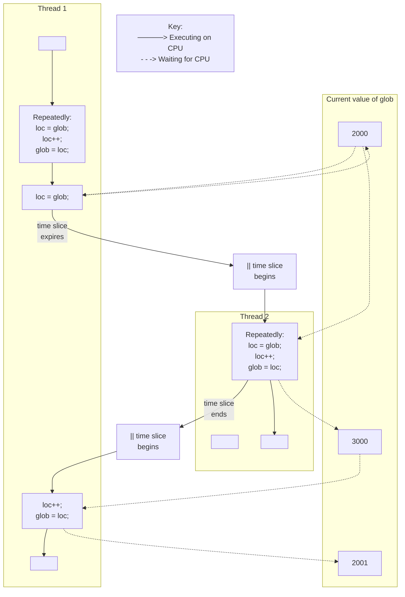
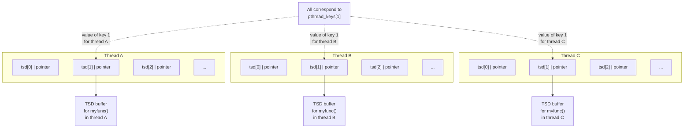

# **THREADS: INTRODUCTION**

In this and the next few chapters, we describe POSIX threads, often known as Pthreads. We won't attempt to cover the entire Pthreads API, since it is rather large. Various sources of further information about threads are listed at the end of this chapter.

These chapters mainly describe the standard behavior specified for the Pthreads API. In Section [33.5](#page-72-0), we discuss those points where the two main Linux threading implementations—LinuxThreads and Native POSIX Threads Library (NPTL)—deviate from the standard.

In this chapter, we provide an overview of the operation of threads, and then look at how threads are created and how they terminate. We conclude with a discussion of some factors that may influence the choice of a multithreaded approach versus a multiprocess approach when designing an application.

# **29.1 Overview**

Like processes, threads are a mechanism that permits an application to perform multiple tasks concurrently. A single process can contain multiple threads, as illustrated in [Figure 29-1](#page-1-0). All of these threads are independently executing the same program, and they all share the same global memory, including the initialized data, uninitialized data, and heap segments. (A traditional UNIX process is simply a special case of a multithreaded processes; it is a process that contains just one thread.)

We have simplified things somewhat in [Figure 29-1.](#page-1-0) In particular, the location of the per-thread stacks may be intermingled with shared libraries and shared memory regions, depending on the order in which threads are created, shared libraries loaded, and shared memory regions attached. Furthermore, the location of the per-thread stacks can vary depending on the Linux distribution.

The threads in a process can execute concurrently. On a multiprocessor system, multiple threads can execute parallel. If one thread is blocked on I/O, other threads are still eligible to execute. (Although it sometimes useful to create a separate thread purely for the purpose of performing I/O, it is often preferable to employ one of the alternative I/O models that we describe in Chapter 63.)

```text
Virtual memory address
    (hexadecimal)
                        ┌─────────────────────────────┐
    0xC0000000          │      argc, environ          │
                        ├─────────────────────────────┤
                        │  Stack for main thread      │
                        ├ ─ ─ ─ ─ ─ ─ ─ ─ ─ ─ ─ ─ ─ --┤
                        │            │                │
                        │            ▼                │
                        │                             │
                        │                             │
                        ├─────────────────────────────┤
                        │   Stack for thread 3        │
                        ├─────────────────────────────┤
                        │   Stack for thread 2        │
                        ├─────────────────────────────┤
                        │   Stack for thread 1        │
                        ├─────────────────────────────┤
    0x40000000          │   Shared libraries,         │
TASK_UNMAPPED_BASE      │   shared memory             │
                        │                             │
                        │                             │
                        │            ▲                │
                        ├ ─ ─ ─ ─ ─ ─ ─ ─ ─ ─ ─ ─ ─ --┤
                        │          Heap               │
                        ├─────────────────────────────┤
                        │ Uninitialized data (bss)    │
                        ├─────────────────────────────┤
                        │    Initialized data         │
        ▲               │                             │◄── thread 3 executing here
        │               ├─────────────────────────────┤
        │               │                             │◄── main thread executing here
        │               │   Text (program code)       │
increasing virtual      │                             │◄── thread 1 executing here
addresses               │                             │
        │               ├─────────────────────────────┤◄── thread 2 executing here
        │               │                             │
                        │                             │
    0x08048000          ├─────────────────────────────┤
                        │                             │
    0x00000000          └─────────────────────────────┘
```

<span id="page-1-1"></span><span id="page-1-0"></span>**Figure 29-1:** Four threads executing in a process (Linux/x86-32)

Threads offer advantages over processes in certain applications. Consider the traditional UNIX approach to achieving concurrency by creating multiple processes. An example of this is a network server design in which a parent process accepts incoming connections from clients, and then uses fork() to create a separate child process to handle communication with each client (refer to Section 60.3). Such a design makes it possible to serve multiple clients simultaneously. While this approach works well for many scenarios, it does have the following limitations in some applications:

-  It is difficult to share information between processes. Since the parent and child don't share memory (other than the read-only text segment), we must use some form of interprocess communication in order to exchange information between processes.
-  Process creation with fork() is relatively expensive. Even with the copy-on-write technique described in Section 24.2.2, the need to duplicate various process attributes such as page tables and file descriptor tables means that a fork() call is still time-consuming.

#### Threads address both of these problems:

-  Sharing information between threads is easy and fast. It is just a matter of copying data into shared (global or heap) variables. However, in order to avoid the problems that can occur when multiple threads try to update the same information, we must employ the synchronization techniques described in Chapter [30.](#page-14-0)
-  Thread creation is faster than process creation—typically, ten times faster or better. (On Linux, threads are implemented using the clone() system call, and Table 28-3, on page 610, shows the differences in speed between fork() and clone().) Thread creation is faster because many of the attributes that must be duplicated in a child created by fork() are instead shared between threads. In particular, copy-on-write duplication of pages of memory is not required, nor is duplication of page tables.

Besides global memory, threads also share a number of other attributes (i.e., these attributes are global to a process, rather than specific to a thread). These attributes include the following:

-  process ID and parent process ID;
-  process group ID and session ID;
-  controlling terminal;
-  process credentials (user and group IDs);
-  open file descriptors;
-  record locks created using fcntl();
-  signal dispositions;
-  file system–related information: umask, current working directory, and root directory;
-  interval timers (setitimer()) and POSIX timers (timer\_create());
-  System V semaphore undo (semadj) values (Section 47.8);
-  resource limits;
-  CPU time consumed (as returned by times());
-  resources consumed (as returned by getrusage()); and
-  nice value (set by setpriority() and nice()).

Among the attributes that are distinct for each thread are the following:

-  thread ID (Section [29.5\)](#page-7-0);
-  signal mask;
-  thread-specific data (Section [31.3](#page-42-0));
-  alternate signal stack (sigaltstack());
-  the errno variable;
-  floating-point environment (see fenv(3));
-  realtime scheduling policy and priority (Sections 35.2 and 35.3);
-  CPU affinity (Linux-specific, described in Section 35.4);
-  capabilities (Linux-specific, described in Chapter 39); and
-  stack (local variables and function call linkage information).

As can be seen from [Figure 29-1,](#page-1-0) all of the per-thread stacks reside within the same virtual address space. This means that, given a suitable pointer, it is possible for threads to share data on each other's stacks. This is occasionally useful, but it requires careful programming to handle the dependency that results from the fact that a local variable remains valid only for the lifetime of the stack frame in which it resides. (If a function returns, the memory region used by its stack frame may be reused by a later function call. If the thread terminates, a new thread may reuse the memory region used for the terminated thread's stack.) Failing to correctly handle this dependency can create bugs that are hard to track down.

# **29.2 Background Details of the Pthreads API**

In the late 1980s and early 1990s, several different threading APIs existed. In 1995, POSIX.1c standardized the POSIX threads API, and this standard was later incorporated into SUSv3.

Several concepts apply to the Pthreads API as a whole, and we briefly introduce these before looking in detail at the API.

## **Pthreads data types**

The Pthreads API defines a number of data types, some of which are listed in Table 29-1. We describe most of these data types in the following pages.

**Table 29-1:** Pthreads data types

| Data type           | Description                             |
|---------------------|-----------------------------------------|
| pthread_t           | Thread identifier                       |
| pthread_mutex_t     | Mutex                                   |
| pthread_mutexattr_t | Mutex attributes object                 |
| pthread_cond_t      | Condition variable                      |
| pthread_condattr_t  | Condition variable attributes object    |
| pthread_key_t       | Key for thread-specific data            |
| pthread_once_t      | One-time initialization control context |
| pthread_attr_t      | Thread attributes object                |

SUSv3 doesn't specify how these data types should be represented, and portable programs should treat them as opaque data. By this, we mean that a program should avoid any reliance on knowledge of the structure or contents of a variable of one of these types. In particular, we can't compare variables of these types using the C == operator.

### **Threads and errno**

In the traditional UNIX API, errno is a global integer variable. However, this doesn't suffice for threaded programs. If a thread made a function call that returned an error in a global errno variable, then this would confuse other threads that might also be making function calls and checking errno. In other words, race conditions would result. Therefore, in threaded programs, each thread has its own errno value. On Linux, a thread-specific errno is achieved in a similar manner to most other UNIX implementations: errno is defined as a macro that expands into a function call returning a modifiable lvalue that is distinct for each thread. (Since the lvalue is modifiable, it is still possible to write assignment statements of the form errno = value in threaded programs.)

To summarize, the errno mechanism has been adapted for threads in a manner that leaves error reporting unchanged from the traditional UNIX API.

> The original POSIX.1 standard followed K&R C usage in allowing a program to declare errno as extern int errno. SUSv3 doesn't permit this usage (the change actually occurred in 1995 in POSIX.1c). Nowadays, a program is required to declare errno by including <errno.h>, which enables the implementation of a per-thread errno.

### **Return value from Pthreads functions**

The traditional method of returning status from system calls and some library functions is to return 0 on success and –1 on error, with errno being set to indicate the error. The functions in the Pthreads API do things differently. All Pthreads functions return 0 on success or a positive value on failure. The failure value is one of the same values that can be placed in errno by traditional UNIX system calls.

Because each reference to errno in a threaded program carries the overhead of a function call, our example programs don't directly assign the return value of a Pthreads function to errno. Instead, we use an intermediate variable and employ our errExitEN() diagnostic function (Section 3.5.2), like so:

```
pthread_t *thread;
int s;
s = pthread_create(&thread, NULL, func, &arg);
if (s != 0)
 errExitEN(s, "pthread_create");
```

### **Compiling Pthreads programs**

On Linux, programs that use the Pthreads API must be compiled with the cc –pthread option. The effects of this option include the following:

-  The \_REENTRANT preprocessor macro is defined. This causes the declarations of a few reentrant functions to be exposed.
-  The program is linked with the libpthread library (the equivalent of –lpthread).

The precise options for compiling a multithreaded program vary across implementations (and compilers). Some other implementations (e.g., Tru64) also use cc –pthread; Solaris and HP-UX use cc –mt.

## **29.3 Thread Creation**

When a program is started, the resulting process consists of a single thread, called the initial or main thread. In this section, we look at how to create additional threads.

The pthread\_create() function creates a new thread.

```
#include <pthread.h>
int pthread_create(pthread_t *thread, const pthread_attr_t *attr,
 void *(*start)(void *), void *arg);
                    Returns 0 on success, or a positive error number on error
```

The new thread commences execution by calling the function identified by start with the argument arg (i.e., start(arg)). The thread that calls pthread\_create() continues execution with the next statement that follows the call. (This behavior is the same as the glibc wrapper function for the clone() system call described in Section 28.2.)

The arg argument is declared as void \*, meaning that we can pass a pointer to any type of object to the start function. Typically, arg points to a global or heap variable, but it can also be specified as NULL. If we need to pass multiple arguments to start, then arg can be specified as a pointer to a structure containing the arguments as separate fields. With judicious casting, we can even specify arg as an int.

> Strictly speaking, the C standards don't define the results of casting int to void \* and vice versa. However, most C compilers permit these operations, and they produce the desired result; that is, int j == (int) ((void \*) j).

The return value of start is likewise of type void \*, and it can be employed in the same way as the arg argument. We'll see how this value is used when we describe the pthread\_join() function below.

> Caution is required when using a cast integer as the return value of a thread's start function. The reason for this is that PTHREAD\_CANCELED, the value returned when a thread is canceled (see Chapter [32\)](#page-54-0), is usually some implementationdefined integer value cast to void \*. If a thread's start function returns the same integer value, then, to another thread that is doing a pthread\_join(), it will

wrongly appear that the thread was canceled. In an application that employs thread cancellation and chooses to return cast integer values from a thread's start functions, we must ensure that a normally terminating thread does not return an integer whose value matches PTHREAD\_CANCELED on that Pthreads implementation. A portable application would need to ensure that normally terminating threads don't return integer values that match PTHREAD\_CANCELED on any of the implementations on which the application is to run.

The thread argument points to a buffer of type pthread\_t into which the unique identifier for this thread is copied before pthread\_create() returns. This identifier can be used in later Pthreads calls to refer to the thread.

> SUSv3 explicitly notes that the implementation need not initialize the buffer pointed to by thread before the new thread starts executing; that is, the new thread may start running before pthread\_create() returns to its caller. If the new thread needs to obtain its own ID, then it must do so using pthread\_self() (described in Section [29.5\)](#page-7-0).

The attr argument is a pointer to a pthread\_attr\_t object that specifies various attributes for the new thread. We say some more about these attributes in Section [29.8.](#page-11-0) If attr is specified as NULL, then the thread is created with various default attributes, and this is what we'll do in most of the example programs in this book.

After a call to pthread\_create(), a program has no guarantees about which thread will next be scheduled to use the CPU (on a multiprocessor system, both threads may simultaneously execute on different CPUs). Programs that implicitly rely on a particular order of scheduling are open to the same sorts of race conditions that we described in Section 24.4. If we need to enforce a particular order of execution, we must use one of the synchronization techniques described in Chapter [30](#page-14-0).

# **29.4 Thread Termination**

The execution of a thread terminates in one of the following ways:

-  The thread's start function performs a return specifying a return value for the thread.
-  The thread calls pthread\_exit() (described below).
-  The thread is canceled using pthread\_cancel() (described in Section [32.1\)](#page-54-1).
-  Any of the threads calls exit(), or the main thread performs a return (in the main() function), which causes all threads in the process to terminate immediately.

The pthread\_exit() function terminates the calling thread, and specifies a return value that can be obtained in another thread by calling pthread\_join().

```
include <pthread.h>
void pthread_exit(void *retval);
```

Calling pthread\_exit() is equivalent to performing a return in the thread's start function, with the difference that pthread\_exit() can be called from any function that has been called by the thread's start function.

The retval argument specifies the return value for the thread. The value pointed to by retval should not be located on the thread's stack, since the contents of that stack become undefined on thread termination. (For example, that region of the process's virtual memory might be immediately reused by the stack for a new thread.) The same statement applies to the value given to a return statement in the thread's start function.

<span id="page-7-1"></span>If the main thread calls pthread\_exit() instead of calling exit() or performing a return, then the other threads continue to execute.

## <span id="page-7-0"></span>**29.5 Thread IDs**

Each thread within a process is uniquely identified by a thread ID. This ID is returned to the caller of pthread\_create(), and a thread can obtain its own ID using pthread\_self().

```
include <pthread.h>
pthread_t pthread_self(void);
                                      Returns the thread ID of the calling thread
```

Thread IDs are useful within applications for the following reasons:

-  Various Pthreads functions use thread IDs to identify the thread on which they are to act. Examples of such functions include pthread\_join(), pthread\_detach(), pthread\_cancel(), and pthread\_kill(), all of which we describe in this and the following chapters.
-  In some applications, it can be useful to tag dynamic data structures with the ID of a particular thread. This can serve to identify the thread that created or "owns" a data structure, or can be used by one thread to identify a specific thread that should subsequently do something with that data structure.

The pthread\_equal() function allows us check whether two thread IDs are the same.

```
include <pthread.h>
int pthread_equal(pthread_t t1, pthread_t t2);
                        Returns nonzero value if t1 and t2 are equal, otherwise 0
```

For example, to check if the ID of the calling thread matches a thread ID saved in the variable tid, we could write the following:

```
if (pthread_equal(tid, pthread_self())
 printf("tid matches self\n");
```

The pthread\_equal() function is needed because the pthread\_t data type must be treated as opaque data. On Linux, pthread\_t happens to be defined as an unsigned long, but on other implementations, it could be a pointer or a structure.

```
In NPTL, pthread_t is actually a pointer that has been cast to unsigned long.
```

SUSv3 doesn't require pthread\_t to be implemented as a scalar type; it could be a structure. Therefore, we can't portably use code such as the following to display a thread ID (though it does work on many implementations, including Linux, and is sometimes useful for debugging purposes):

```
pthread_t thr;
printf("Thread ID = %ld\n", (long) thr); /* WRONG! */
```

In the Linux threading implementations, thread IDs are unique across processes. However, this is not necessarily the case on other implementations, and SUSv3 explicitly notes that an application can't portably use a thread ID to identify a thread in another process. SUSv3 also notes that an implementation is permitted to reuse a thread ID after a terminated thread has been joined with pthread\_join() or after a detached thread has terminated. (We explain pthread\_join() in the next section, and detached threads in Section [29.7.](#page-10-0))

> POSIX thread IDs are not the same as the thread IDs returned by the Linuxspecific gettid() system call. POSIX thread IDs are assigned and maintained by the threading implementation. The thread ID returned by gettid() is a number (similar to a process ID) that is assigned by the kernel. Although each POSIX thread has a unique kernel thread ID in the Linux NPTL threading implementation, an application generally doesn't need to know about the kernel IDs (and won't be portable if it depends on knowing them).

## **29.6 Joining with a Terminated Thread**

The pthread\_join() function waits for the thread identified by thread to terminate. (If that thread has already terminated, pthread\_join() returns immediately.) This operation is termed joining.

```
include <pthread.h>
int pthread_join(pthread_t thread, void **retval);
                      Returns 0 on success, or a positive error number on error
```

If retval is a non-NULL pointer, then it receives a copy of the terminated thread's return value—that is, the value that was specified when the thread performed a return or called pthread\_exit().

Calling pthread\_join() for a thread ID that has been previously joined can lead to unpredictable behavior; for example, it might instead join with a thread created later that happened to reuse the same thread ID.

If a thread is not detached (see Section [29.7\)](#page-10-0), then we must join with it using pthread\_join(). If we fail to do this, then, when the thread terminates, it produces the thread equivalent of a zombie process (Section 26.2). Aside from wasting system resources, if enough thread zombies accumulate, we won't be able to create additional threads.

The task that pthread\_join() performs for threads is similar to that performed by waitpid() for processes. However, there are some notable differences:

-  Threads are peers. Any thread in a process can use pthread\_join() to join with any other thread in the process. For example, if thread A creates thread B, which creates thread C, then it is possible for thread A to join with thread C, or vice versa. This differs from the hierarchical relationship between processes. When a parent process creates a child using fork(), it is the only process that can wait() on that child. There is no such relationship between the thread that calls pthread\_create() and the resulting new thread.
-  There is no way of saying "join with any thread" (for processes, we can do this using the call waitpid(–1, &status, options)); nor is there a way to do a nonblocking join (analogous to the waitpid() WNOHANG flag). There are ways to achieve similar functionality using condition variables; we show an example in Section [30.2.4](#page-31-0).

The limitation that pthread\_join() can join only with a specific thread ID is intentional. The idea is that a program should join only with the threads that it "knows" about. The problem with a "join with any thread" operation stems from the fact that there is no hierarchy of threads, so such an operation could indeed join with any thread, including one that was privately created by a library function. (The condition-variable technique that we show in Section [30.2.4](#page-31-0) allows a thread to join only with any other thread that it knows about.) As a consequence, the library would no longer be able to join with that thread in order to obtain its status, and it would erroneously try to join with a thread ID that had already been joined. In other words, a "join with any thread" operation is incompatible with modular program design.

## **Example program**

The program in Listing 29-1 creates another thread and then joins with it.

**Listing 29-1:** A simple program using Pthreads

––––––––––––––––––––––––––––––––––––––––––––––––––– **threads/simple\_thread.c** #include <pthread.h> #include "tlpi\_hdr.h" static void \* threadFunc(void \*arg) { char \*s = (char \*) arg; printf("%s", s); return (void \*) strlen(s); }

```
int
main(int argc, char *argv[])
{
 pthread_t t1;
 void *res;
 int s;
 s = pthread_create(&t1, NULL, threadFunc, "Hello world\n");
 if (s != 0)
 errExitEN(s, "pthread_create");
 printf("Message from main()\n");
 s = pthread_join(t1, &res);
 if (s != 0)
 errExitEN(s, "pthread_join");
 printf("Thread returned %ld\n", (long) res);
 exit(EXIT_SUCCESS);
}
––––––––––––––––––––––––––––––––––––––––––––––––––– threads/simple_thread.c
```

When we run the program in Listing 29-1, we see the following:

```
$ ./simple_thread
Message from main()
Hello world
Thread returned 12
```

Depending on how the two threads were scheduled, the order of the first two lines of output might be reversed.

# <span id="page-10-0"></span>**29.7 Detaching a Thread**

By default, a thread is joinable, meaning that when it terminates, another thread can obtain its return status using pthread\_join(). Sometimes, we don't care about the thread's return status; we simply want the system to automatically clean up and remove the thread when it terminates. In this case, we can mark the thread as detached, by making a call to pthread\_detach() specifying the thread's identifier in thread.

```
#include <pthread.h>
int pthread_detach(pthread_t thread);
                      Returns 0 on success, or a positive error number on error
```

As an example of the use of pthread\_detach(), a thread can detach itself using the following call:

```
pthread_detach(pthread_self());
```

Once a thread has been detached, it is no longer possible to use pthread\_join() to obtain its return status, and the thread can't be made joinable again.

Detaching a thread doesn't make it immune to a call to exit() in another thread or a return in the main thread. In such an event, all threads in the process are immediately terminated, regardless of whether they are joinable or detached. To put things another way, pthread\_detach() simply controls what happens after a thread terminates, not how or when it terminates.

## <span id="page-11-0"></span>**29.8 Thread Attributes**

<span id="page-11-2"></span>We mentioned earlier that the pthread\_create() attr argument, whose type is pthread\_attr\_t, can be used to specify the attributes used in the creation of a new thread. We won't go into the details of these attributes (for those details, see the references listed at the end of this chapter) or show the prototypes of the various Pthreads functions that can be used to manipulate a pthread\_attr\_t object. We'll just mention that these attributes include information such as the location and size of the thread's stack, the thread's scheduling policy and priority (akin to the process realtime scheduling policies and priorities described in Sections 35.2 and 35.3), and whether the thread is joinable or detached.

As an example of the use of thread attributes, the code shown in [Listing 29-2](#page-11-1) creates a new thread that is made detached at the time of thread creation (rather than subsequently, using pthread\_detach()). This code first initializes a thread attributes structure with default values, sets the attribute required to create a detached thread, and then creates a new thread using the thread attributes structure. Once the thread has been created, the attributes object is no longer needed, and so is destroyed.

<span id="page-11-1"></span>**Listing 29-2:** Creating a thread with the detached attribute

```
––––––––––––––––––––––––––––––––––––––––––––– fromthreads/detached_attrib.c
 pthread_t thr;
 pthread_attr_t attr;
 int s;
 s = pthread_attr_init(&attr); /* Assigns default values */
 if (s != 0)
 errExitEN(s, "pthread_attr_init");
 s = pthread_attr_setdetachstate(&attr, PTHREAD_CREATE_DETACHED);
 if (s != 0)
 errExitEN(s, "pthread_attr_setdetachstate");
 s = pthread_create(&thr, &attr, threadFunc, (void *) 1);
 if (s != 0)
 errExitEN(s, "pthread_create");
 s = pthread_attr_destroy(&attr); /* No longer needed */
 if (s != 0)
 errExitEN(s, "pthread_attr_destroy");
––––––––––––––––––––––––––––––––––––––––––––– fromthreads/detached_attrib.c
```

## **29.9 Threads Versus Processes**

In this section, we briefly consider some of the factors that might influence our choice of whether to implement an application as a group of threads or as a group of processes. We begin by considering the advantages of a multithreaded approach:

-  Sharing data between threads is easy. By contrast, sharing data between processes requires more work (e.g., creating a shared memory segment or using a pipe).
-  Thread creation is faster than process creation; context-switch time may be lower for threads than for processes.

Using threads can have some disadvantages compared to using processes:

-  When programming with threads, we need to ensure that the functions we call are thread-safe or are called in a thread-safe manner. (We describe the concept of thread safety in Section [31.1.](#page-38-0)) Multiprocess applications don't need to be concerned with this.
-  A bug in one thread (e.g., modifying memory via an incorrect pointer) can damage all of the threads in the process, since they share the same address space and other attributes. By contrast, processes are more isolated from one another.
-  Each thread is competing for use of the finite virtual address space of the host process. In particular, each thread's stack and thread-specific data (or threadlocal storage) consumes a part of the process virtual address space, which is consequently unavailable for other threads. Although the available virtual address space is large (e.g., typically 3 GB on x86-32), this factor may be a significant limitation for processes employing large numbers of threads or threads that require large amounts of memory. By contrast, separate processes can each employ the full range of available virtual memory (subject to the limitations of RAM and swap space).

The following are some other points that may influence our choice of threads versus processes:

-  Dealing with signals in a multithreaded application requires careful design. (As a general principle, it is usually desirable to avoid the use of signals in multithreaded programs.) We say more about threads and signals in Section [33.2](#page-65-0).
-  In a multithreaded application, all threads must be running the same program (although perhaps in different functions). In a multiprocess application, different processes can run different programs.
-  Aside from data, threads also share certain other information (e.g., file descriptors, signal dispositions, current working directory, and user and group IDs). This may be an advantage or a disadvantage, depending on the application.

# **29.10 Summary**

<span id="page-12-0"></span>In a multithreaded process, multiple threads are concurrently executing the same program. All of the threads share the same global and heap variables, but each thread has a private stack for local variables. The threads in a process also share a number of other attributes, including process ID, open file descriptors, signal dispositions, current working directory, and resource limits.

The key difference between threads and processes is the easier sharing of information that threads provide, and this is the main reason that some application designs map better onto a multithread design than onto a multiprocess design. Threads can also provide better performance for some operations (e.g., thread creation is faster than process creation), but this factor is usually secondary in influencing the choice of threads versus processes.

Threads are created using pthread\_create(). Each thread can then independently terminate using pthread\_exit(). (If any thread calls exit(), then all threads immediately terminate.) Unless a thread has been marked as detached (e.g., via a call to pthread\_detach()), it must be joined by another thread using pthread\_join(), which returns the termination status of the joined thread.

### **Further information**

[Butenhof, 1996] provides an exposition of Pthreads that is both readable and thorough. [Robbins & Robbins, 2003] also provides good coverage of Pthreads. [Tanenbaum, 2007] provides a more theoretical introduction to thread concepts, covering topics such as mutexes, critical regions, conditional variables, and deadlock detection and avoidance. [Vahalia, 1996] provides background on the implementation of threads.

## **29.11 Exercises**

**29-1.** What possible outcomes might there be if a thread executes the following code:

```
pthread_join(pthread_self(), NULL);
```

Write a program to see what actually happens on Linux. If we have a variable, tid, containing a thread ID, how can a thread prevent itself from making a call, pthread\_join(tid, NULL), that is equivalent to the above statement?

**29-2.** Aside from the absence of error checking and various variable and structure declarations, what is the problem with the following program?

```
static void *
threadFunc(void *arg)
{
 struct someStruct *pbuf = (struct someStruct *) arg;
 /* Do some work with structure pointed to by 'pbuf' */
}
int
main(int argc, char *argv[])
{
 struct someStruct buf;
 pthread_create(&thr, NULL, threadFunc, (void *) &buf);
 pthread_exit(NULL);
}
```

# <span id="page-14-0"></span>**THREADS: THREAD SYNCHRONIZATION**

In this chapter, we describe two tools that threads can use to synchronize their actions: mutexes and condition variables. Mutexes allow threads to synchronize their use of a shared resource, so that, for example, one thread doesn't try to access a shared variable at the same time as another thread is modifying it. Condition variables perform a complementary task: they allow threads to inform each other that a shared variable (or other shared resource) has changed state.

## **30.1 Protecting Accesses to Shared Variables: Mutexes**

<span id="page-14-1"></span>One of the principal advantages of threads is that they can share information via global variables. However, this easy sharing comes at a cost: we must take care that multiple threads do not attempt to modify the same variable at the same time, or that one thread doesn't try to read the value of a variable while another thread is modifying it. The term critical section is used to refer to a section of code that accesses a shared resource and whose execution should be atomic; that is, its execution should not be interrupted by another thread that simultaneously accesses the same shared resource.

Listing 30-1 provides a simple example of the kind of problems that can occur when shared resources are not accessed atomically. This program creates two threads, each of which executes the same function. The function executes a loop that repeatedly increments a global variable, glob, by copying glob into the local variable loc, incrementing loc, and copying loc back to glob. (Since loc is an automatic variable allocated on the per-thread stack, each thread has its own copy of this variable.) The number of iterations of the loop is determined by the command-line argument supplied to the program, or by a default value, if no argument is supplied.

**Listing 30-1:** Incorrectly incrementing a global variable from two threads

```
––––––––––––––––––––––––––––––––––––––––––––––––––––– threads/thread_incr.c
#include <pthread.h>
#include "tlpi_hdr.h"
static int glob = 0;
static void * /* Loop 'arg' times incrementing 'glob' */
threadFunc(void *arg)
{
 int loops = *((int *) arg);
 int loc, j;
 for (j = 0; j < loops; j++) {
 loc = glob;
 loc++;
 glob = loc;
 }
 return NULL;
}
int
main(int argc, char *argv[])
{
 pthread_t t1, t2;
 int loops, s;
 loops = (argc > 1) ? getInt(argv[1], GN_GT_0, "num-loops") : 10000000;
 s = pthread_create(&t1, NULL, threadFunc, &loops);
 if (s != 0)
 errExitEN(s, "pthread_create");
 s = pthread_create(&t2, NULL, threadFunc, &loops);
 if (s != 0)
 errExitEN(s, "pthread_create");
 s = pthread_join(t1, NULL);
 if (s != 0)
 errExitEN(s, "pthread_join");
 s = pthread_join(t2, NULL);
 if (s != 0)
 errExitEN(s, "pthread_join");
 printf("glob = %d\n", glob);
 exit(EXIT_SUCCESS);
}
––––––––––––––––––––––––––––––––––––––––––––––––––––– threads/thread_incr.c
```



**Figure 30-1:** Two threads incrementing a global variable without synchronization

When we run the program in Listing 30-1 specifying that each thread should increment the variable 1000 times, all seems well:

```
$ ./thread_incr 1000
glob = 2000
```

However, what has probably happened here is that the first thread completed all of its work and terminated before the second thread even started. When we ask both threads to do a lot more work, we see a rather different result:

```
$ ./thread_incr 10000000
glob = 16517656
```

At the end of this sequence, the value of glob should have been 20 million. The problem here results from execution sequences such as the following (see also Figure 30-1, above):

- 1. Thread 1 fetches the current value of glob into its local variable loc. Let's assume that the current value of glob is 2000.
- 2. The scheduler time slice for thread 1 expires, and thread 2 commences execution.
- 3. Thread 2 performs multiple loops in which it fetches the current value of glob into its local variable loc, increments loc, and assigns the result to glob. In the first of these loops, the value fetched from glob will be 2000. Let's suppose that by the time the time slice for thread 2 has expired, glob has been increased to 3000.

4. Thread 1 receives another time slice and resumes execution where it left off. Having previously (step 1) copied the value of glob (2000) into its loc, it now increments loc and assigns the result (2001) to glob. At this point, the effect of the increment operations performed by thread 2 is lost.

If we run the program in Listing 30-1 multiple times with the same command-line argument, we see that the printed value of glob fluctuates wildly:

```
$ ./thread_incr 10000000
glob = 10880429
$ ./thread_incr 10000000
glob = 13493953
```

This nondeterministic behavior is a consequence of the vagaries of the kernel's CPU scheduling decisions. In complex programs, this nondeterministic behavior means that such errors may occur only rarely, be hard to reproduce, and therefore be difficult to find.

It might seem that we could eliminate the problem by replacing the three statements inside the for loop in the threadFunc() function in Listing 30-1 with a single statement:

```
glob++; /* or: ++glob; */
```

However, on many hardware architectures (e.g., RISC architectures), the compiler would still need to convert this single statement into machine code whose steps are equivalent to the three statements inside the loop in threadFunc(). In other words, despite its simple appearance, even a C increment operator may not be atomic, and it might demonstrate the behavior that we described above.

To avoid the problems that can occur when threads try to update a shared variable, we must use a mutex (short for mutual exclusion) to ensure that only one thread at a time can access the variable. More generally, mutexes can be used to ensure atomic access to any shared resource, but protecting shared variables is the most common use.

A mutex has two states: locked and unlocked. At any moment, at most one thread may hold the lock on a mutex. Attempting to lock a mutex that is already locked either blocks or fails with an error, depending on the method used to place the lock.

When a thread locks a mutex, it becomes the owner of that mutex. Only the mutex owner can unlock the mutex. This property improves the structure of code that uses mutexes and also allows for some optimizations in the implementation of mutexes. Because of this ownership property, the terms acquire and release are sometimes used synonymously for lock and unlock.

In general, we employ a different mutex for each shared resource (which may consist of multiple related variables), and each thread employs the following protocol for accessing a resource:

-  lock the mutex for the shared resource;
-  access the shared resource; and
-  unlock the mutex.

If multiple threads try to execute this block of code (a critical section), the fact that only one thread can hold the mutex (the others remain blocked) means that only one thread at a time can enter the block, as illustrated in [Figure 30-2.](#page-18-0)

```text
Thread A                         Thread B

lock mutex M
     │
     ▼
access shared resource         lock mutex M
     │                              │
     │                            blocks
     ▼                              │
unlock mutex M ─ ─ ─ ─ ─ ─ ─ ─ ─ ─ -┼─> unblocks, lock granted
     │                              │
     │                              ▼
                           access shared resource
                                    │
                                    ▼
                             unlock mutex M
                                    │
                                    ▼
```

<span id="page-18-0"></span>**Figure 30-2:** Using a mutex to protect a critical section

Finally, note that mutex locking is advisory, rather than mandatory. By this, we mean that a thread is free to ignore the use of a mutex and simply access the corresponding shared variable(s). In order to safely handle shared variables, all threads must cooperate in their use of a mutex, abiding by the locking rules it enforces.

## **30.1.1 Statically Allocated Mutexes**

A mutex can either be allocated as a static variable or be created dynamically at run time (for example, in a block of memory allocated via malloc()). Dynamic mutex creation is somewhat more complex, and we delay discussion of it until Section [30.1.5.](#page-22-0)

A mutex is a variable of the type pthread\_mutex\_t. Before it can be used, a mutex must always be initialized. For a statically allocated mutex, we can do this by assigning it the value PTHREAD\_MUTEX\_INITIALIZER, as in the following example:

```
pthread_mutex_t mtx = PTHREAD_MUTEX_INITIALIZER;
```

According to SUSv3, applying the operations that we describe in the remainder of this section to a copy of a mutex yields results that are undefined. Mutex operations should always be performed only on the original mutex that has been statically initialized using PTHREAD\_MUTEX\_INITIALIZER or dynamically initialized using pthread\_mutex\_init() (described in Section [30.1.5\)](#page-22-0).

## **30.1.2 Locking and Unlocking a Mutex**

After initialization, a mutex is unlocked. To lock and unlock a mutex, we use the pthread\_mutex\_lock() and pthread\_mutex\_unlock() functions.

```
#include <pthread.h>
int pthread_mutex_lock(pthread_mutex_t *mutex);
int pthread_mutex_unlock(pthread_mutex_t *mutex);
                  Both return 0 on success, or a positive error number on error
```

To lock a mutex, we specify the mutex in a call to pthread\_mutex\_lock(). If the mutex is currently unlocked, this call locks the mutex and returns immediately. If the mutex is currently locked by another thread, then pthread\_mutex\_lock() blocks until the mutex is unlocked, at which point it locks the mutex and returns.

If the calling thread itself has already locked the mutex given to pthread\_mutex\_lock(), then, for the default type of mutex, one of two implementationdefined possibilities may result: the thread deadlocks, blocked trying to lock a mutex that it already owns, or the call fails, returning the error EDEADLK. On Linux, the thread deadlocks by default. (We describe some other possible behaviors when we look at mutex types in Section [30.1.7.](#page-23-0))

The pthread\_mutex\_unlock() function unlocks a mutex previously locked by the calling thread. It is an error to unlock a mutex that is not currently locked, or to unlock a mutex that is locked by another thread.

If more than one other thread is waiting to acquire the mutex unlocked by a call to pthread\_mutex\_unlock(), it is indeterminate which thread will succeed in acquiring it.

## **Example program**

[Listing 30-2](#page-19-0) is a modified version of the program in Listing 30-1. It uses a mutex to protect access to the global variable glob. When we run this program with a similar command line to that used earlier, we see that glob is always reliably incremented:

```
$ ./thread_incr_mutex 10000000
glob = 20000000
```

<span id="page-19-0"></span>**Listing 30-2:** Using a mutex to protect access to a global variable

```
–––––––––––––––––––––––––––––––––––––––––––––––– threads/thread_incr_mutex.c
#include <pthread.h>
#include "tlpi_hdr.h"
static int glob = 0;
static pthread_mutex_t mtx = PTHREAD_MUTEX_INITIALIZER;
static void * /* Loop 'arg' times incrementing 'glob' */
threadFunc(void *arg)
{
 int loops = *((int *) arg);
 int loc, j, s;
 for (j = 0; j < loops; j++) {
 s = pthread_mutex_lock(&mtx);
 if (s != 0)
 errExitEN(s, "pthread_mutex_lock");
```

```
 loc = glob;
 loc++;
 glob = loc;
 s = pthread_mutex_unlock(&mtx);
 if (s != 0)
 errExitEN(s, "pthread_mutex_unlock");
 }
 return NULL;
}
int
main(int argc, char *argv[])
{
 pthread_t t1, t2;
 int loops, s;
 loops = (argc > 1) ? getInt(argv[1], GN_GT_0, "num-loops") : 10000000;
 s = pthread_create(&t1, NULL, threadFunc, &loops);
 if (s != 0)
 errExitEN(s, "pthread_create");
 s = pthread_create(&t2, NULL, threadFunc, &loops);
 if (s != 0)
 errExitEN(s, "pthread_create");
 s = pthread_join(t1, NULL);
 if (s != 0)
 errExitEN(s, "pthread_join");
 s = pthread_join(t2, NULL);
 if (s != 0)
 errExitEN(s, "pthread_join");
 printf("glob = %d\n", glob);
 exit(EXIT_SUCCESS);
}
```

–––––––––––––––––––––––––––––––––––––––––––––––– **threads/thread\_incr\_mutex.c**

## **pthread\_mutex\_trylock() and pthread\_mutex\_timedlock()**

The Pthreads API provides two variants of the pthread\_mutex\_lock() function: pthread\_mutex\_trylock() and pthread\_mutex\_timedlock(). (See the manual pages for prototypes of these functions.)

The pthread\_mutex\_trylock() function is the same as pthread\_mutex\_lock(), except that if the mutex is currently locked, pthread\_mutex\_trylock() fails, returning the error EBUSY.

The pthread\_mutex\_timedlock() function is the same as pthread\_mutex\_lock(), except that the caller can specify an additional argument, abstime, that places a limit on the time that the thread will sleep while waiting to acquire the mutex. If the time interval specified by its abstime argument expires without the caller becoming the owner of the mutex, pthread\_mutex\_timedlock() returns the error ETIMEDOUT.

The pthread\_mutex\_trylock() and pthread\_mutex\_timedlock() functions are much less frequently used than pthread\_mutex\_lock(). In most well-designed applications, a thread should hold a mutex for only a short time, so that other threads are not prevented from executing in parallel. This guarantees that other threads that are blocked on the mutex will soon be granted a lock on the mutex. A thread that uses pthread\_mutex\_trylock() to periodically poll the mutex to see if it can be locked risks being starved of access to the mutex while other queued threads are successively granted access to the mutex via pthread\_mutex\_lock().

## **30.1.3 Performance of Mutexes**

What is the cost of using a mutex? We have shown two different versions of a program that increments a shared variable: one without mutexes (Listing 30-1) and one with mutexes ([Listing 30-2](#page-19-0)). When we run these two programs on an x86-32 system running Linux 2.6.31 (with NPTL), we find that the version without mutexes requires a total of 0.35 seconds to execute 10 million loops in each thread (and produces the wrong result), while the version with mutexes requires 3.1 seconds.

At first, this seems expensive. But, consider the main loop executed by the version that does not employ a mutex (Listing 30-1). In that version, the threadFunc() function executes a for loop that increments a loop control variable, compares that variable against another variable, performs two assignments and another increment operation, and then branches back to the top of the loop. The version that uses a mutex ([Listing 30-2](#page-19-0)) performs the same steps, and locks and unlocks the mutex each time around the loop. In other words, the cost of locking and unlocking a mutex is somewhat less than ten times the cost of the operations that we listed for the first program. This is relatively cheap. Furthermore, in the typical case, a thread would spend much more time doing other work, and perform relatively fewer mutex lock and unlock operations, so that the performance impact of using a mutex is not significant in most applications.

To put this further in perspective, running some simple test programs on the same system showed that 20 million loops locking and unlocking a file region using fcntl() (Section 55.3) require 44 seconds, and 20 million loops incrementing and decrementing a System V semaphore (Chapter 47) require 28 seconds. The problem with file locks and semaphores is that they always require a system call for the lock and unlock operations, and each system call has a small, but appreciable, cost (Section 3.1). By contrast, mutexes are implemented using atomic machine-language operations (performed on memory locations visible to all threads) and require system calls only in case of lock contention.

> On Linux, mutexes are implemented using futexes (an acronym derived from fast user space mutexes), and lock contentions are dealt with using the futex() system call. We don't describe futexes in this book (they are not intended for direct use in user-space applications), but details can be found in [Drepper, 2004 (a)], which also describes how mutexes are implemented using futexes. [Franke et al., 2002] is a (now outdated) paper written by the developers of futexes, which describes the early futex implementation and looks at the performance gains derived from futexes.

## **30.1.4 Mutex Deadlocks**

Sometimes, a thread needs to simultaneously access two or more different shared resources, each of which is governed by a separate mutex. When more than one thread is locking the same set of mutexes, deadlock situations can arise. [Figure 30-3](#page-22-1) shows an example of a deadlock in which each thread successfully locks one mutex, and then tries to lock the mutex that the other thread has already locked. Both threads will remain blocked indefinitely.

| Thread A                       | Thread B                       |
|--------------------------------|--------------------------------|
| 1. pthread_mutex_lock(mutex1); | 1. pthread_mutex_lock(mutex2); |
| 2. pthread_mutex_lock(mutex2); | 2. pthread_mutex_lock(mutex1); |
| blocks                         | blocks                         |

<span id="page-22-1"></span>**Figure 30-3:** A deadlock when two threads lock two mutexes

The simplest way to avoid such deadlocks is to define a mutex hierarchy. When threads can lock the same set of mutexes, they should always lock them in the same order. For example, in the scenario in [Figure 30-3,](#page-22-1) the deadlock could be avoided if the two threads always lock the mutexes in the order mutex1 followed by mutex2. Sometimes, there is a logically obvious hierarchy of mutexes. However, even if there isn't, it may be possible to devise an arbitrary hierarchical order that all threads should follow.

An alternative strategy that is less frequently used is "try, and then back off." In this strategy, a thread locks the first mutex using pthread\_mutex\_lock(), and then locks the remaining mutexes using pthread\_mutex\_trylock(). If any of the pthread\_mutex\_trylock() calls fails (with EBUSY), then the thread releases all mutexes, and then tries again, perhaps after a delay interval. This approach is less efficient than a lock hierarchy, since multiple iterations may be required. On the other hand, it can be more flexible, since it doesn't require a rigid mutex hierarchy. An example of this strategy is shown in [Butenhof, 1996].

## <span id="page-22-0"></span>**30.1.5 Dynamically Initializing a Mutex**

The static initializer value PTHREAD\_MUTEX\_INITIALIZER can be used only for initializing a statically allocated mutex with default attributes. In all other cases, we must dynamically initialize the mutex using pthread\_mutex\_init().

```
#include <pthread.h>
int pthread_mutex_init(pthread_mutex_t *mutex, const pthread_mutexattr_t *attr);
                      Returns 0 on success, or a positive error number on error
```

The mutex argument identifies the mutex to be initialized. The attr argument is a pointer to a pthread\_mutexattr\_t object that has previously been initialized to define the attributes for the mutex. (We say some more about mutex attributes in the next section.) If attr is specified as NULL, then the mutex is assigned various default attributes.

SUSv3 specifies that initializing an already initialized mutex results in undefined behavior; we should not do this.

Among the cases where we must use pthread\_mutex\_init() rather than a static initializer are the following:

-  The mutex was dynamically allocated on the heap. For example, suppose that we create a dynamically allocated linked list of structures, and each structure in the list includes a pthread\_mutex\_t field that holds a mutex that is used to protect access to that structure.
-  The mutex is an automatic variable allocated on the stack.
-  We want to initialize a statically allocated mutex with attributes other than the defaults.

When an automatically or dynamically allocated mutex is no longer required, it should be destroyed using pthread\_mutex\_destroy(). (It is not necessary to call pthread\_mutex\_destroy() on a mutex that was statically initialized using PTHREAD\_MUTEX\_INITIALIZER.)

```
#include <pthread.h>
int pthread_mutex_destroy(pthread_mutex_t *mutex);
                      Returns 0 on success, or a positive error number on error
```

It is safe to destroy a mutex only when it is unlocked, and no thread will subsequently try to lock it. If the mutex resides in a region of dynamically allocated memory, then it should be destroyed before freeing that memory region. An automatically allocated mutex should be destroyed before its host function returns.

A mutex that has been destroyed with pthread\_mutex\_destroy() can subsequently be reinitialized by pthread\_mutex\_init().

## **30.1.6 Mutex Attributes**

As noted earlier, the pthread\_mutex\_init() attr argument can be used to specify a pthread\_mutexattr\_t object that defines the attributes of a mutex. Various Pthreads functions can be used to initialize and retrieve the attributes in a pthread\_mutexattr\_t object. We won't go into all of the details of mutex attributes or show the prototypes of the various functions that can be used to initialize the attributes in a pthread\_mutexattr\_t object. However, we'll describe one of the attributes that can be set for a mutex: its type.

## <span id="page-23-0"></span>**30.1.7 Mutex Types**

In the preceding pages, we made a number of statements about the behavior of mutexes:

-  A single thread may not lock the same mutex twice.
-  A thread may not unlock a mutex that it doesn't currently own (i.e., that it did not lock).
-  A thread may not unlock a mutex that is not currently locked.

Precisely what happens in each of these cases depends on the type of the mutex. SUSv3 defines the following mutex types:

#### PTHREAD\_MUTEX\_NORMAL

(Self-)deadlock detection is not provided for this type of mutex. If a thread tries to lock a mutex that it has already locked, then deadlock results. Unlocking a mutex that is not locked or that is locked by another thread produces undefined results. (On Linux, both of these operations succeed for this mutex type.)

#### PTHREAD\_MUTEX\_ERRORCHECK

Error checking is performed on all operations. All three of the above scenarios cause the relevant Pthreads function to return an error. This type of mutex is typically slower than a normal mutex, but can be useful as a debugging tool to discover where an application is violating the rules about how a mutex should be used.

#### PTHREAD\_MUTEX\_RECURSIVE

A recursive mutex maintains the concept of a lock count. When a thread first acquires the mutex, the lock count is set to 1. Each subsequent lock operation by the same thread increments the lock count, and each unlock operation decrements the count. The mutex is released (i.e., made available for other threads to acquire) only when the lock count falls to 0. Unlocking an unlocked mutex fails, as does unlocking a mutex that is currently locked by another thread.

The Linux threading implementation provides nonstandard static initializers for each of the above mutex types (e.g., PTHREAD\_RECURSIVE\_MUTEX\_INITIALIZER\_NP), so that the use of pthread\_mutex\_init() is not required to initialize these mutex types for statically allocated mutexes. However, portable applications should avoid the use of these initializers.

In addition to the above mutex types, SUSv3 defines the PTHREAD\_MUTEX\_DEFAULT type, which is the default type of mutex if we use PTHREAD\_MUTEX\_INITIALIZER or specify attr as NULL in a call to pthread\_mutex\_init(). The behavior of this mutex type is deliberately undefined in all three of the scenarios described at the start of this section, which allows maximum flexibility for efficient implementation of mutexes. On Linux, a PTHREAD\_MUTEX\_DEFAULT mutex behaves like a PTHREAD\_MUTEX\_NORMAL mutex.

The code shown in [Listing 30-3](#page-24-0) demonstrates how to set the type of a mutex, in this case to create an error-checking mutex.

#### <span id="page-24-0"></span>**Listing 30-3:** Setting the mutex type

```
 pthread_mutex_t mtx;
 pthread_mutexattr_t mtxAttr;
 int s, type;
 s = pthread_mutexattr_init(&mtxAttr);
 if (s != 0)
 errExitEN(s, "pthread_mutexattr_init");
```

```
 s = pthread_mutexattr_settype(&mtxAttr, PTHREAD_MUTEX_ERRORCHECK);
 if (s != 0)
 errExitEN(s, "pthread_mutexattr_settype");
 s = pthread_mutex_init(mtx, &mtxAttr);
 if (s != 0)
 errExitEN(s, "pthread_mutex_init");
 s = pthread_mutexattr_destroy(&mtxAttr); /* No longer needed */
 if (s != 0)
 errExitEN(s, "pthread_mutexattr_destroy");
```

# **30.2 Signaling Changes of State: Condition Variables**

A mutex prevents multiple threads from accessing a shared variable at the same time. A condition variable allows one thread to inform other threads about changes in the state of a shared variable (or other shared resource) and allows the other threads to wait (block) for such notification.

A simple example that doesn't use condition variables serves to demonstrate why they are useful. Suppose that we have a number of threads that produce some "result units" that are consumed by the main thread, and that we use a mutex-protected variable, avail, to represent the number of produced units awaiting consumption:

```
static pthread_mutex_t mtx = PTHREAD_MUTEX_INITIALIZER;
static int avail = 0;
```

The code segments shown in this section can be found in the file threads/ prod\_no\_condvar.c in the source code distribution for this book.

In the producer threads, we would have code such as the following:

```
/* Code to produce a unit omitted */
s = pthread_mutex_lock(&mtx);
if (s != 0)
 errExitEN(s, "pthread_mutex_lock");
avail++; /* Let consumer know another unit is available */
s = pthread_mutex_unlock(&mtx);
if (s != 0)
 errExitEN(s, "pthread_mutex_unlock");
```

And in the main (consumer) thread, we could employ the following code:

```
for (;;) {
 s = pthread_mutex_lock(&mtx);
 if (s != 0)
 errExitEN(s, "pthread_mutex_lock");
```

```
 while (avail > 0) { /* Consume all available units */
 /* Do something with produced unit */
 avail--;
 }
 s = pthread_mutex_unlock(&mtx);
 if (s != 0)
 errExitEN(s, "pthread_mutex_unlock");
}
```

The above code works, but it wastes CPU time, because the main thread continually loops, checking the state of the variable avail. A condition variable remedies this problem. It allows a thread to sleep (wait) until another thread notifies (signals) it that it must do something (i.e., that some "condition" has arisen that the sleeper must now respond to).

A condition variable is always used in conjunction with a mutex. The mutex provides mutual exclusion for accessing the shared variable, while the condition variable is used to signal changes in the variable's state. (The use of the term signal here has nothing to do with the signals described in Chapters 20 to 22; rather, it is used in the sense of indicate.)

## **30.2.1 Statically Allocated Condition Variables**

As with mutexes, condition variables can be allocated statically or dynamically. We defer discussion of dynamically allocated condition variables until Section [30.2.5,](#page-34-0) and consider statically allocated condition variables here.

A condition variable has the type pthread\_cond\_t. As with a mutex, a condition variable must be initialized before use. For a statically allocated condition variable, this is done by assigning it the value PTHREAD\_COND\_INITIALIZER, as in the following example:

```
pthread_cond_t cond = PTHREAD_COND_INITIALIZER;
```

According to SUSv3, applying the operations that we describe in the remainder of this section to a copy of a condition variable yields results that are undefined. Operations should always be performed only on the original condition variable that has been statically initialized using PTHREAD\_COND\_INITIALIZER or dynamically initialized using pthread\_cond\_init() (described in Section [30.2.5](#page-34-0)).

## **30.2.2 Signaling and Waiting on Condition Variables**

The principal condition variable operations are signal and wait. The signal operation is a notification to one or more waiting threads that a shared variable's state has changed. The wait operation is the means of blocking until such a notification is received.

The pthread\_cond\_signal() and pthread\_cond\_broadcast() functions both signal the condition variable specified by cond. The pthread\_cond\_wait() function blocks a thread until the condition variable cond is signaled.

```
#include <pthread.h>
int pthread_cond_signal(pthread_cond_t *cond);
int pthread_cond_broadcast(pthread_cond_t *cond);
int pthread_cond_wait(pthread_cond_t *cond, pthread_mutex_t *mutex);
                    All return 0 on success, or a positive error number on error
```

The difference between pthread\_cond\_signal() and pthread\_cond\_broadcast() lies in what happens if multiple threads are blocked in pthread\_cond\_wait(). With pthread\_cond\_signal(), we are simply guaranteed that at least one of the blocked threads is woken up; with pthread\_cond\_broadcast(), all blocked threads are woken up.

Using pthread\_cond\_broadcast() always yields correct results (since all threads should be programmed to handle redundant and spurious wake-ups), but pthread\_cond\_signal() can be more efficient. However, pthread\_cond\_signal() should be used only if just one of the waiting threads needs to be woken up to handle the change in state of the shared variable, and it doesn't matter which one of the waiting threads is woken up. This scenario typically applies when all of the waiting threads are designed to perform the exactly same task. Given these assumptions, pthread\_cond\_signal() can be more efficient than pthread\_cond\_broadcast(), because it avoids the following possibility:

- 1. All waiting threads are awoken.
- 2. One thread is scheduled first. This thread checks the state of the shared variable(s) (under protection of the associated mutex) and sees that there is work to be done. The thread performs the required work, changes the state of the shared variable(s) to indicate that the work has been done, and unlocks the associated mutex.
- 3. Each of the remaining threads in turn locks the mutex and tests the state of the shared variable. However, because of the change made by the first thread, these threads see that there is no work to be done, and so unlock the mutex and go back to sleep (i.e., call pthread\_cond\_wait() once more).

By contrast, pthread\_cond\_broadcast() handles the case where the waiting threads are designed to perform different tasks (in which case they probably have different predicates associated with the condition variable).

A condition variable holds no state information. It is simply a mechanism for communicating information about the application's state. If no thread is waiting on the condition variable at the time that it is signaled, then the signal is lost. A thread that later waits on the condition variable will unblock only when the variable is signaled once more.

The pthread\_cond\_timedwait() function is the same as pthread\_cond\_wait(), except that the abstime argument specifies an upper limit on the time that the thread will sleep while waiting for the condition variable to be signaled.

```
#include <pthread.h>
int pthread_cond_timedwait(pthread_cond_t *cond, pthread_mutex_t *mutex,
 const struct timespec *abstime);
                   Returns 0 on success, or a positive error number on error
```

The abstime argument is a timespec structure (Section 23.4.2) specifying an absolute time expressed as seconds and nanoseconds since the Epoch (Section 10.1). If the time interval specified by abstime expires without the condition variable being signaled, then pthread\_cond\_timedwait() returns the error ETIMEDOUT.

### **Using a condition variable in the producer-consumer example**

Let's revise our previous example to use a condition variable. The declarations of our global variable and associated mutex and condition variable are as follows:

```
static pthread_mutex_t mtx = PTHREAD_MUTEX_INITIALIZER;
static pthread_cond_t cond = PTHREAD_COND_INITIALIZER;
static int avail = 0;
```

The code segments shown in this section can be found in the file threads/ prod\_condvar.c in the source code distribution for this book.

The code in the producer threads is the same as before, except that we add a call to pthread\_cond\_signal():

```
s = pthread_mutex_lock(&mtx);
if (s != 0)
 errExitEN(s, "pthread_mutex_lock");
avail++; /* Let consumer know another unit is available */
s = pthread_mutex_unlock(&mtx);
if (s != 0)
 errExitEN(s, "pthread_mutex_unlock");
s = pthread_cond_signal(&cond); /* Wake sleeping consumer */
if (s != 0)
 errExitEN(s, "pthread_cond_signal");
```

Before considering the code of the consumer, we need to explain pthread\_cond\_wait() in greater detail. We noted earlier that a condition variable always has an associated mutex. Both of these objects are passed as arguments to pthread\_cond\_wait(), which performs the following steps:

-  unlock the mutex specified by mutex;
-  block the calling thread until another thread signals the condition variable cond; and
-  relock mutex.

The pthread\_cond\_wait() function is designed to perform these steps because, normally, we access a shared variable in the following manner:

```
s = pthread_mutex_lock(&mtx);
if (s != 0)
 errExitEN(s, "pthread_mutex_lock");
while (/* Check that shared variable is not in state we want */)
 pthread_cond_wait(&cond, &mtx);
/* Now shared variable is in desired state; do some work */
s = pthread_mutex_unlock(&mtx);
if (s != 0)
 errExitEN(s, "pthread_mutex_unlock");
```

(We explain why the pthread\_cond\_wait() call is placed within a while loop rather than an if statement in the next section.)

In the above code, both accesses to the shared variable must be mutex-protected for the reasons that we explained earlier. In other words, there is a natural association of a mutex with a condition variable:

- 1. The thread locks the mutex in preparation for checking the state of the shared variable.
- 2. The state of the shared variable is checked.
- 3. If the shared variable is not in the desired state, then the thread must unlock the mutex (so that other threads can access the shared variable) before it goes to sleep on the condition variable.
- 4. When the thread is reawakened because the condition variable has been signaled, the mutex must once more be locked, since, typically, the thread then immediately accesses the shared variable.

The pthread\_cond\_wait() function automatically performs the mutex unlocking and locking required in the last two of these steps. In the third step, releasing the mutex and blocking on the condition variable are performed atomically. In other words, it is not possible for some other thread to acquire the mutex and signal the condition variable before the thread calling pthread\_cond\_wait() has blocked on the condition variable.

> There is a corollary to the observation that there is a natural relationship between a condition variable and a mutex: all threads that concurrently wait on a particular condition variable must specify the same mutex in their pthread\_cond\_wait() (or pthread\_cond\_timedwait()) calls. In effect, a pthread\_cond\_wait() call dynamically binds a condition variable to a unique mutex for the duration of the call. SUSv3 notes that the result of using more than one mutex for concurrent pthread\_cond\_wait() calls on the same condition variable is undefined.

Putting the above details together, we can now modify the main (consumer) thread to use pthread\_cond\_wait(), as follows:

```
for (;;) {
 s = pthread_mutex_lock(&mtx);
 if (s != 0)
 errExitEN(s, "pthread_mutex_lock");
 while (avail == 0) { /* Wait for something to consume */
 s = pthread_cond_wait(&cond, &mtx);
 if (s != 0)
 errExitEN(s, "pthread_cond_wait");
 }
 while (avail > 0) { /* Consume all available units */
 /* Do something with produced unit */
 avail--;
 }
 s = pthread_mutex_unlock(&mtx);
   if (s != 0)
 errExitEN(s, "pthread_mutex_unlock");
   /* Perhaps do other work here that doesn't require mutex lock */
}
```

We conclude with one final observation about the use of pthread\_cond\_signal() (and pthread\_cond\_broadcast()). In the producer code shown earlier, we called pthread\_mutex\_unlock(), and then called pthread\_cond\_signal(); that is, we first unlocked the mutex associated with the shared variable, and then signaled the corresponding condition variable. We could have reversed these two steps; SUSv3 permits them to be done in either order.

> [Butenhof, 1996] points out that, on some implementations, unlocking the mutex and then signaling the condition variable may yield better performance than performing these steps in the reverse sequence. If the mutex is unlocked only after the condition variable is signaled, the thread performing pthread\_cond\_wait() may wake up while the mutex is still locked, and then immediately go back to sleep again when it finds that the mutex is locked. This results in two superfluous context switches. Some implementations eliminate this problem by employing a technique called wait morphing, which moves the signaled thread from the condition variable wait queue to the mutex wait queue without performing a context switch if the mutex is locked.

## **30.2.3 Testing a Condition Variable's Predicate**

<span id="page-30-0"></span>Each condition variable has an associated predicate involving one or more shared variables. For example, in the code segment in the preceding section, the predicate associated with cond is (avail == 0). This code segment demonstrates a general design principle: a pthread\_cond\_wait() call must be governed by a while loop rather than an if statement. This is so because, on return from pthread\_cond\_wait(), there are no guarantees about the state of the predicate; therefore, we should immediately recheck the predicate and resume sleeping if it is not in the desired state.

We can't make any assumptions about the state of the predicate upon return from pthread\_cond\_wait(), for the following reasons:

-  Other threads may be woken up first. Perhaps several threads were waiting to acquire the mutex associated with the condition variable. Even if the thread that signaled the mutex set the predicate to the desired state, it is still possible that another thread might acquire the mutex first and change the state of the associated shared variable(s), and thus the state of the predicate.
-  Designing for "loose" predicates may be simpler. Sometimes, it is easier to design applications based on condition variables that indicate possibility rather than certainty. In other words, signaling a condition variable would mean "there may be something" for the signaled thread to do, rather than "there is something" to do. Using this approach, the condition variable can be signaled based on approximations of the predicate's state, and the signaled thread can ascertain if there really is something to do by rechecking the predicate.
-  Spurious wake-ups can occur. On some implementations, a thread waiting on a condition variable may be woken up even though no other thread actually signaled the condition variable. Such spurious wake-ups are a (rare) consequence of the techniques required for efficient implementation on some multiprocessor systems, and are explicitly permitted by SUSv3.

## **30.2.4 Example Program: Joining Any Terminated Thread**

<span id="page-31-0"></span>We noted earlier that pthread\_join() can be used to join with only a specific thread. It provides no mechanism for joining with any terminated thread. We now show how a condition variable can be used to circumvent this restriction.

The program in [Listing 30-4](#page-32-0) creates one thread for each of its command-line arguments. Each thread sleeps for the number of seconds specified in the corresponding command-line argument and then terminates. The sleep interval is our means of simulating the idea of a thread that does work for a period of time.

The program maintains a set of global variables recording information about all of the threads that have been created. For each thread, an element in the global thread array records the ID of the thread (the tid field) and its current state (the state field). The state field has one of the following values: TS\_ALIVE, meaning the thread is alive; TS\_TERMINATED, meaning the thread has terminated but not yet been joined; or TS\_JOINED, meaning the thread has terminated and been joined.

As each thread terminates, it assigns the value TS\_TERMINATED to the state field for its element in the thread array, increments a global counter of terminated but as yet unjoined threads (numUnjoined), and signals the condition variable threadDied.

The main thread employs a loop that continuously waits on the condition variable threadDied. Whenever threadDied is signaled and there are terminated threads that have not been joined, the main thread scans the thread array, looking for elements with state set to TS\_TERMINATED. For each thread in this state, pthread\_join() is called using the corresponding tid field from the thread array, and then the state is set to TS\_JOINED. The main loop terminates when all of the threads created by the main thread have died—that is, when the global variable numLive is 0.

The following shell session log demonstrates the use of the program in Listing 30-4:

```
$ ./thread_multijoin 1 1 2 3 3 Create 5 threads
Thread 0 terminating
Thread 1 terminating
Reaped thread 0 (numLive=4)
Reaped thread 1 (numLive=3)
Thread 2 terminating
Reaped thread 2 (numLive=2)
Thread 3 terminating
Thread 4 terminating
Reaped thread 3 (numLive=1)
Reaped thread 4 (numLive=0)
```

Finally, note that although the threads in the example program are created as joinable and are immediately reaped on termination using pthread\_join(), we don't need to use this approach in order to find out about thread termination. We could have made the threads detached, removed the use of pthread\_join(), and simply used the thread array (and associated global variables) as the means of recording the termination of each thread.

<span id="page-32-0"></span>**Listing 30-4:** A main thread that can join with any terminated thread

```
–––––––––––––––––––––––––––––––––––––––––––––––––threads/thread_multijoin.c
#include <pthread.h>
#include "tlpi_hdr.h"
static pthread_cond_t threadDied = PTHREAD_COND_INITIALIZER;
static pthread_mutex_t threadMutex = PTHREAD_MUTEX_INITIALIZER;
 /* Protects all of the following global variables */
static int totThreads = 0; /* Total number of threads created */
static int numLive = 0; /* Total number of threads still alive or
 terminated but not yet joined */
static int numUnjoined = 0; /* Number of terminated threads that
 have not yet been joined */
enum tstate { /* Thread states */
 TS_ALIVE, /* Thread is alive */
 TS_TERMINATED, /* Thread terminated, not yet joined */
 TS_JOINED /* Thread terminated, and joined */
};
static struct { /* Info about each thread */
 pthread_t tid; /* ID of this thread */
 enum tstate state; /* Thread state (TS_* constants above) */
 int sleepTime; /* Number seconds to live before terminating */
} *thread;
static void * /* Start function for thread */
threadFunc(void *arg)
{
 int idx = *((int *) arg);
 int s;
```

```
 sleep(thread[idx].sleepTime); /* Simulate doing some work */
 printf("Thread %d terminating\n", idx);
 s = pthread_mutex_lock(&threadMutex);
 if (s != 0)
 errExitEN(s, "pthread_mutex_lock");
 numUnjoined++;
 thread[idx].state = TS_TERMINATED;
 s = pthread_mutex_unlock(&threadMutex);
 if (s != 0)
 errExitEN(s, "pthread_mutex_unlock");
 s = pthread_cond_signal(&threadDied);
 if (s != 0)
 errExitEN(s, "pthread_cond_signal");
 return NULL;
}
int
main(int argc, char *argv[])
{
 int s, idx;
 if (argc < 2 || strcmp(argv[1], "--help") == 0)
 usageErr("%s nsecs...\n", argv[0]);
 thread = calloc(argc - 1, sizeof(*thread));
 if (thread == NULL)
 errExit("calloc");
 /* Create all threads */
 for (idx = 0; idx < argc - 1; idx++) {
 thread[idx].sleepTime = getInt(argv[idx + 1], GN_NONNEG, NULL);
 thread[idx].state = TS_ALIVE;
 s = pthread_create(&thread[idx].tid, NULL, threadFunc, &idx);
 if (s != 0)
 errExitEN(s, "pthread_create");
 }
 totThreads = argc - 1;
 numLive = totThreads;
 /* Join with terminated threads */
 while (numLive > 0) {
 s = pthread_mutex_lock(&threadMutex);
 if (s != 0)
 errExitEN(s, "pthread_mutex_lock");
```

```
 while (numUnjoined == 0) {
 s = pthread_cond_wait(&threadDied, &threadMutex);
 if (s != 0)
 errExitEN(s, "pthread_cond_wait");
 }
 for (idx = 0; idx < totThreads; idx++) {
 if (thread[idx].state == TS_TERMINATED){
 s = pthread_join(thread[idx].tid, NULL);
 if (s != 0)
 errExitEN(s, "pthread_join");
 thread[idx].state = TS_JOINED;
 numLive--;
 numUnjoined--;
 printf("Reaped thread %d (numLive=%d)\n", idx, numLive);
 }
 }
 s = pthread_mutex_unlock(&threadMutex);
 if (s != 0)
 errExitEN(s, "pthread_mutex_unlock");
 }
 exit(EXIT_SUCCESS);
}
–––––––––––––––––––––––––––––––––––––––––––––––––threads/thread_multijoin.c
```

## <span id="page-34-0"></span>**30.2.5 Dynamically Allocated Condition Variables**

The pthread\_cond\_init() function is used to dynamically initialize a condition variable. The circumstances in which we need to use pthread\_cond\_init() are analogous to those where pthread\_mutex\_init() is needed to dynamically initialize a mutex (Section [30.1.5\)](#page-22-0); that is, we must use pthread\_cond\_init() to initialize automatically and dynamically allocated condition variables, and to initialize a statically allocated condition variable with attributes other than the defaults.

```
#include <pthread.h>
int pthread_cond_init(pthread_cond_t *cond, const pthread_condattr_t *attr);
                      Returns 0 on success, or a positive error number on error
```

The cond argument identifies the condition variable to be initialized. As with mutexes, we can specify an attr argument that has been previously initialized to determine attributes for the condition variable. Various Pthreads functions can be used to initialize the attributes in the pthread\_condattr\_t object pointed to by attr. If attr is NULL, a default set of attributes is assigned to the condition variable.

SUSv3 specifies that initializing an already initialized condition variable results in undefined behavior; we should not do this.

When an automatically or dynamically allocated condition variable is no longer required, then it should be destroyed using pthread\_cond\_destroy(). It is not necessary to call pthread\_cond\_destroy() on a condition variable that was statically initialized using PTHREAD\_COND\_INITIALIZER.

```
#include <pthread.h>
int pthread_cond_destroy(pthread_cond_t *cond);
                      Returns 0 on success, or a positive error number on error
```

It is safe to destroy a condition variable only when no threads are waiting on it. If the condition variable resides in a region of dynamically allocated memory, then it should be destroyed before freeing that memory region. An automatically allocated condition variable should be destroyed before its host function returns.

A condition variable that has been destroyed with pthread\_cond\_destroy() can subsequently be reinitialized by pthread\_cond\_init().

## **30.3 Summary**

The greater sharing provided by threads comes at a cost. Threaded applications must employ synchronization primitives such as mutexes and condition variables in order to coordinate access to shared variables. A mutex provides exclusive access to a shared variable. A condition variable allows one or more threads to wait for notification that some other thread has changed the state of a shared variable.

#### **Further information**

Refer to the sources of further information listed in Section [29.10.](#page-12-0)

## **30.4 Exercises**

**30-1.** Modify the program in Listing 30-1 (thread\_incr.c) so that each loop in the thread's start function outputs the current value of glob and some identifier that uniquely identifies the thread. The unique identifier for the thread could be specified as an argument to the pthread\_create() call used to create the thread. For this program, that would require changing the argument of the thread's start function to be a pointer to a structure containing the unique identifier and a loop limit value. Run the program, redirecting output to a file, and then inspect the file to see what happens to glob as the kernel scheduler alternates execution between the two threads.

**30-2.** Implement a set of thread-safe functions that update and search an unbalanced binary tree. This library should include functions (with the obvious purposes) of the following form:

```
initialize(tree);
add(tree, char *key, void *value);
delete(tree, char *key)
Boolean lookup(char *key, void **value)
```

In the above prototypes, tree is a structure that points to the root of the tree (you will need to define a suitable structure for this purpose). Each element of the tree holds a key-value pair. You will also need to define the structure for each element to include a mutex that protects that element so that only one thread at a time can access it. The initialize(), add(), and lookup() functions are relatively simple to implement. The delete() operation requires a little more effort.

> Removing the need to maintain a balanced tree greatly simplifies the locking requirements of the implementation, but carries the risk that certain patterns of input would result in a tree that performs poorly. Maintaining a balanced tree necessitates moving nodes between subtrees during the add() and delete() operations, which requires much more complex locking strategies.

# **THREADS: THREAD SAFETY AND PER-THREAD STORAGE**

This chapter extends the discussion of the POSIX threads API, providing a description of thread-safe functions and one-time initialization. We also discuss how to use thread-specific data or thread-local storage to make an existing function thread-safe without changing the function's interface.

## **31.1 Thread Safety (and Reentrancy Revisited)**

<span id="page-38-0"></span>A function is said to be thread-safe if it can safely be invoked by multiple threads at the same time; put conversely, if a function is not thread-safe, then we can't call it from one thread while it is being executed in another thread. For example, the following function (similar to code that we looked at in Section [30.1](#page-14-1)) is not thread-safe:

```
static int glob = 0;
static void
incr(int loops)
{
 int loc, j;
```

```
 for (j = 0; j < loops; j++) {
 loc = glob;
 loc++;
 glob = loc;
 }
}
```

If multiple threads invoke this function concurrently, the final value in glob is unpredictable. This function illustrates the typical reason that a function is not thread-safe: it employs global or static variables that are shared by all threads.

There are various methods of rendering a function thread-safe. One way is to associate a mutex with the function (or perhaps with all of the functions in a library, if they all share the same global variables), lock that mutex when the function is called, and unlock it when the mutex returns. This approach has the virtue of simplicity. On the other hand, it means that only one thread at a time can execute the function—we say that access to the function is serialized. If the threads spend a significant amount of time executing this function, then this serialization results in a loss of concurrency, because the threads of a program can no longer execute in parallel.

A more sophisticated solution is to associate the mutex with a shared variable. We then determine which parts of the function are critical sections that access the shared variable, and acquire and release the mutex only during the execution of these critical sections. This allows multiple threads to execute the function at the same time and to operate in parallel, except when more than one thread needs to execute a critical section.

### **Non-thread-safe functions**

To facilitate the development of threaded applications, all of the functions specified in SUSv3 are required to be implemented in a thread-safe manner, except those listed in [Table 31-1](#page-40-0). (Many of these functions are not discussed in this book.) In addition to the functions listed in [Table 31-1](#page-40-0), SUSv3 specifies the following:

-  The ctermid() and tmpnam() functions need not be thread-safe if passed a NULL argument.
-  The wcrtomb() and wcsrtombs() functions need not be thread-safe if their final argument (ps) is NULL.

SUSv4 modifies the list of functions in [Table 31-1](#page-40-0) as follows:

-  The ecvt(), fcvt(), gcvt(), gethostbyname(), and gethostbyaddr() are removed, since these functions have been removed from the standard.
-  The strsignal() and system() functions are added. The system() function is nonreentrant because the manipulations that it must make to signal dispositions have a process-wide effect.

The standards do not prohibit an implementation from making the functions in [Table 31-1](#page-40-0) thread-safe. However, even if some of these functions are thread-safe on some implementations, a portable application can't rely on this to be the case on all implementations.

<span id="page-40-0"></span>**Table 31-1:** Functions that SUSv3 does not require to be thread-safe

| asctime()      | fcvt()             | getpwnam()      | nl_langinfo()      |
|----------------|--------------------|-----------------|--------------------|
| basename()     | ftw()              | getpwuid()      | ptsname()          |
| catgets()      | gcvt()             | getservbyname() | putc_unlocked()    |
| crypt()        | getc_unlocked()    | getservbyport() | putchar_unlocked() |
| ctime()        | getchar_unlocked() | getservent()    | putenv()           |
| dbm_clearerr() | getdate()          | getutxent()     | pututxline()       |
| dbm_close()    | getenv()           | getutxid()      | rand()             |
| dbm_delete()   | getgrent()         | getutxline()    | readdir()          |
| dbm_error()    | getgrgid()         | gmtime()        | setenv()           |
| dbm_fetch()    | getgrnam()         | hcreate()       | setgrent()         |
| dbm_firstkey() | gethostbyaddr()    | hdestroy()      | setkey()           |
| dbm_nextkey()  | gethostbyname()    | hsearch()       | setpwent()         |
| dbm_open()     | gethostent()       | inet_ntoa()     | setutxent()        |
| dbm_store()    | getlogin()         | l64a()          | strerror()         |
| dirname()      | getnetbyaddr()     | lgamma()        | strtok()           |
| dlerror()      | getnetbyname()     | lgammaf()       | ttyname()          |
| drand48()      | getnetent()        | lgammal()       | unsetenv()         |
| ecvt()         | getopt()           | localeconv()    | wcstombs()         |
| encrypt()      | getprotobyname()   | localtime()     | wctomb()           |
| endgrent()     | getprotobynumber() | lrand48()       |                    |
| endpwent()     | getprotoent()      | mrand48()       |                    |
| endutxent()    | getpwent()         | nftw()          |                    |

### **Reentrant and nonreentrant functions**

Although the use of critical sections to implement thread safety is a significant improvement over the use of per-function mutexes, it is still somewhat inefficient because there is a cost to locking and unlocking a mutex. A reentrant function achieves thread safety without the use of mutexes. It does this by avoiding the use of global and static variables. Any information that must be returned to the caller, or maintained between calls to the function, is stored in buffers allocated by the caller. (We first encountered reentrancy when discussing the treatment of global variables within signal handlers in Section 21.1.2.) However, not all functions can be made reentrant. The usual reasons are the following:

-  By their nature, some functions must access global data structures. The functions in the malloc library provide a good example. These functions maintain a global linked list of free blocks on the heap. The functions of the malloc library are made thread-safe through the use of mutexes.
-  Some functions (defined before the invention of threads) have an interface that by definition is nonreentrant, because they return pointers to storage statically allocated by the function, or they employ static storage to maintain information between successive calls to the same (or a related) function. Most of the functions in [Table 31-1](#page-40-0) fall into this category. For example, the asctime() function (Section 10.2.3) returns a pointer to a statically allocated buffer containing a date-time string.

For several of the functions that have nonreentrant interfaces, SUSv3 specifies reentrant equivalents with names ending with the suffix \_r. These functions require the caller to allocate a buffer whose address is then passed to the function and used to return the result. This allows the calling thread to use a local (stack) variable for the function result buffer. For this purpose, SUSv3 specifies asctime\_r(), ctime\_r(), getgrgid\_r(), getgrnam\_r(), getlogin\_r(), getpwnam\_r(), getpwuid\_r(), gmtime\_r(), localtime\_r(), rand\_r(), readdir\_r(), strerror\_r(), strtok\_r(), and ttyname\_r().

> Some implementations also provide additional reentrant equivalents of other traditional nonreentrant functions. For example, glibc provides crypt\_r(), gethostbyname\_r(), getservbyname\_r(), getutent\_r(), getutid\_r(), getutline\_r(), and ptsname\_r(). However, a portable application can't rely on these functions being present on other implementations. In some cases, SUSv3 doesn't specify these reentrant equivalents because alternatives to the traditional functions exist that are both superior and reentrant. For example, getaddrinfo() is the modern, reentrant alternative to gethostbyname() and getservbyname().

## **31.2 One-Time Initialization**

Sometimes, a threaded application needs to ensure that some initialization action occurs just once, regardless of how many threads are created. For example, a mutex may need to be initialized with special attributes using pthread\_mutex\_init(), and that initialization must occur just once. If we are creating the threads from the main program, then this is generally easy to achieve—we perform the initialization before creating any threads that depend on the initialization. However, in a library function, this is not possible, because the calling program may create the threads before the first call to the library function. Therefore, the library function needs a method of performing the initialization the first time that it is called from any thread.

A library function can perform one-time initialization using the pthread\_once() function.

```
#include <pthread.h>
int pthread_once(pthread_once_t *once_control, void (*init)(void));
                      Returns 0 on success, or a positive error number on error
```

The pthread\_once() function uses the state of the argument once\_control to ensure that the caller-defined function pointed to by init is called just once, no matter how many times or from how many different threads the pthread\_once() call is made.

The init function is called without any arguments, and thus has the following form:

```
void
init(void)
{
 /* Function body */
}
```

The once\_control argument is a pointer to a variable that must be statically initialized with the value PTHREAD\_ONCE\_INIT:

```
pthread_once_t once_var = PTHREAD_ONCE_INIT;
```

The first call to pthread\_once() that specifies a pointer to a particular pthread\_once\_t variable modifies the value of the variable pointed to by once\_control so that subsequent calls to pthread\_once() don't invoke init.

One common use of pthread\_once() is in conjunction with thread-specific data, which we describe next.

> The main reason for the existence of pthread\_once() is that in early versions of Pthreads, it was not possible to statically initialize a mutex. Instead, the use of pthread\_mutex\_init() was required ([Butenhof, 1996]). Given the later addition of statically allocated mutexes, it is possible for a library function to perform one-time initialization using a statically allocated mutex and a static Boolean variable. Nevertheless, pthread\_once() is retained as a convenience.

## **31.3 Thread-Specific Data**

<span id="page-42-0"></span>The most efficient way of making a function thread-safe is to make it reentrant. All new library functions should be implemented in this way. However, for an existing nonreentrant library function (one that was perhaps designed before the use of threads became common), this approach usually requires changing the function's interface, which means modifying all of the programs that use the function.

Thread-specific data is a technique for making an existing function thread-safe without changing its interface. A function that uses thread-specific data may be slightly less efficient than a reentrant function, but allows us to leave the programs that call the function unchanged.

Thread-specific data allows a function to maintain a separate copy of a variable for each thread that calls the function, as illustrated in [Figure 31-1](#page-42-1). Thread-specific data is persistent; each thread's variable continues to exist between the thread's invocations of the function. This allows the function to maintain per-thread information between calls to the function, and allows the function to pass distinct result buffers (if required) to each calling thread.

```text
 ┌──────────┐        ┌─────────────────┐
 │ Thread A │───────>│   TSD buffer    │
 └──────────┘        │  for myfunc()   │
                     │   in thread A   │
                     └─────────────────┘

 ┌──────────┐        ┌─────────────────┐
 │ Thread B │───────>│   TSD buffer    │
 └──────────┘        │  for myfunc()   │
                     │   in thread B   │
                     └─────────────────┘

 ┌──────────┐        ┌─────────────────┐
 │ Thread C │───────>│   TSD buffer    │
 └──────────┘        │  for myfunc()   │
                     │   in thread C   │
                     └─────────────────┘
```

<span id="page-42-1"></span>**Figure 31-1:** Thread-specific data (TSD) provides per-thread storage for a function

## **31.3.1 Thread-Specific Data from the Library Function's Perspective**

In order to understand the use of the thread-specific data API, we need to consider things from the point of view of a library function that uses thread-specific data:

-  The function must allocate a separate block of storage for each thread that calls the function. This block needs to be allocated once, the first time the thread calls the function.
-  On each subsequent call from the same thread, the function needs to be able to obtain the address of the storage block that was allocated the first time this thread called the function. The function can't maintain a pointer to the block in an automatic variable, since automatic variables disappear when the function returns; nor can it store the pointer in a static variable, since only one instance of each static variable exists in the process. The Pthreads API provides functions to handle this task.
-  Different (i.e., independent) functions may each need thread-specific data. Each function needs a method of identifying its thread-specific data (a key), as distinct from the thread-specific data used by other functions.
-  The function has no direct control over what happens when the thread terminates. When the thread terminates, it is probably executing code outside the function. Nevertheless, there must be some mechanism (a destructor) to ensure that the storage block allocated for this thread is automatically deallocated when the thread terminates. If this is not done, then a memory leak could occur as threads are continuously created, call the function, and then terminate.

## **31.3.2 Overview of the Thread-Specific Data API**

The general steps that a library function performs in order to use thread-specific data are as follows:

- 1. The function creates a key, which is the means of differentiating the thread-specific data item used by this function from the thread-specific data items used by other functions. The key is created by calling the pthread\_key\_create() function. Creating a key needs to be done only once, when the first thread calls the function. For this purpose, pthread\_once() is employed. Creating a key doesn't allocate any blocks of thread-specific data.
- 2. The call to pthread\_key\_create() serves a second purpose: it allows the caller to specify the address of the programmer-defined destructor function that is used to deallocate each of the storage blocks allocated for this key (see the next step). When a thread that has thread-specific data terminates, the Pthreads API automatically invokes the destructor, passing it a pointer to the data block for this thread.
- 3. The function allocates a thread-specific data block for each thread from which it is called. This is done using malloc() (or a similar function). This allocation is done once for each thread, the first time the thread calls the function.
- 4. In order to save a pointer to the storage allocated in the previous step, the function employs two Pthreads functions: pthread\_setspecific() and pthread\_getspecific(). A call to pthread\_setspecific() is a request to the Pthreads implementation to say

"save this pointer, recording the fact that it is associated with a particular key (the one for this function) and a particular thread (the calling thread)." Calling pthread\_getspecific() performs the complementary task, returning the pointer previously associated with a given key for the calling thread. If no pointer was previously associated with a particular key and thread, then pthread\_getspecific() returns NULL. This is how a function can determine that it is being called for the first time by this thread, and thus must allocate the storage block for the thread.

## **31.3.3 Details of the Thread-Specific Data API**

In this section, we provide details of each of the functions mentioned in the previous section, and elucidate the operation of thread-specific data by describing how it is typically implemented. The next section shows how to use thread-specific data to write a thread-safe implementation of the standard C library function strerror().

Calling pthread\_key\_create() creates a new thread-specific data key that is returned to the caller in the buffer pointed to by key.

```
#include <pthread.h>
int pthread_key_create(pthread_key_t *key, void (*destructor)(void *));
                      Returns 0 on success, or a positive error number on error
```

Because the returned key is used by all threads in the process, key should point to a global variable.

The destructor argument points to a programmer-defined function of the following form:

```
void
dest(void *value)
{
 /* Release storage pointed to by 'value' */
}
```

Upon termination of a thread that has a non-NULL value associated with key, the destructor function is automatically invoked by the Pthreads API and given that value as its argument. The passed value is normally a pointer to this thread's thread-specific data block for this key. If a destructor is not required, then destructor can be specified as NULL.

> If a thread has multiple thread-specific data blocks, then the order in which the destructors are called is unspecified. Destructor functions should be designed to operate independently of one another.

Looking at the implementation of thread-specific data helps us to understand how it is used. A typical implementation (NPTL is typical), involves the following arrays:

 a single global (i.e., process-wide) array of information about thread-specific data keys; and

 a set of per-thread arrays, each containing pointers to all of the thread-specific data blocks allocated for a particular thread (i.e., this array contains the pointers stored by calls to pthread\_setspecific()).

In this implementation, the pthread\_key\_t value returned by pthread\_key\_create() is simply an index into the global array, which we label pthread\_keys, whose form is shown in [Figure 31-2](#page-45-0). Each element of this array is a structure containing two fields. The first field indicates whether this array element is in use (i.e., has been allocated by a previous call to pthread\_key\_create()). The second field is used to store the pointer to the destructor function for the thread-specific data blocks for this key (i.e., it is a copy of the destructor argument to pthread\_key\_create()).

```text
pthread_keys[0]  ┌──────────────────┐
                 │   "in use" flag  │
                 ├──────────────────┤
                 │destructor pointer│
                 ├──────────────────┤
pthread_keys[1]  │   "in use" flag  │
                 ├──────────────────┤
                 │destructor pointer│
                 ├──────────────────┤
pthread_keys[2]  │   "in use" flag  │
                 ├──────────────────┤
                 │destructor pointer│
                 ├──────────────────┤
                 │       ...        │
                 └──────────────────┘
```

<span id="page-45-0"></span>**Figure 31-2:** Implementation of thread-specific data keys

The pthread\_setspecific() function requests the Pthreads API to save a copy of value in a data structure that associates it with the calling thread and with key, a key returned by a previous call to pthread\_key\_create(). The pthread\_getspecific() function performs the converse operation, returning the value that was previously associated with the given key for this thread.

```
#include <pthread.h>
int pthread_setspecific(pthread_key_t key, const void *value);
                       Returns 0 on success, or a positive error number on error
void *pthread_getspecific(pthread_key_t key);
          Returns pointer, or NULL if no thread-specific data isassociated with key
```

The value argument given to pthread\_setspecific() is normally a pointer to a block of memory that has previously been allocated by the caller. This pointer will be passed as the argument for the destructor function for this key when the thread terminates.

> The value argument doesn't need to be a pointer to a block of memory. It could be some scalar value that can be assigned (with a cast) to void \*. In this case, the earlier call to pthread\_key\_create() would specify destructor as NULL.

[Figure 31-3](#page-46-0) shows a typical implementation of the data structure used to store value. In this diagram, we assume that pthread\_keys[1] was allocated to a function named myfunc(). For each thread, the Pthreads API maintains an array of pointers to thread-specific data blocks. The elements of each of these thread-specific arrays have a one-to-one correspondence with the elements of the global pthread\_keys array shown in [Figure 31-2](#page-45-0). The pthread\_setspecific() function sets the element corresponding to key in the array for the calling thread.



<span id="page-46-0"></span>**Figure 31-3:** Data structure used to implement thread-specific data (TSD) pointers

When a thread is first created, all of its thread-specific data pointers are initialized to NULL. This means that when our library function is called by a thread for the first time, it must begin by using pthread\_getspecific() to check whether the thread already has an associated value for key. If it does not, then the function allocates a block of memory and saves a pointer to the block using pthread\_setspecific(). We show an example of this in the thread-safe strerror() implementation presented in the next section.

## **31.3.4 Employing the Thread-Specific Data API**

When we first described the standard strerror() function in Section 3.4, we noted that it may return a pointer to a statically allocated string as its function result. This means that strerror() may not be thread-safe. In the next few pages, we look at a nonthread-safe implementation of strerror(), and then show how thread-specific data can be used to make this function thread-safe.

On many UNIX implementations, including Linux, the strerror() function provided by the standard C library is thread-safe. However, we use the example of strerror() anyway, because SUSv3 doesn't require this function to be threadsafe, and its implementation provides a simple example of the use of threadspecific data.

[Listing 31-1](#page-47-0) shows a simple non-thread-safe implementation of strerror(). This function makes use of a pair of global variables defined by glibc: \_sys\_errlist is an array of pointers to strings corresponding to the error numbers in errno (thus, for example, \_sys\_errlist[EINVAL] points to the string Invalid operation), and \_sys\_nerr specifies the number of elements in \_sys\_errlist.

<span id="page-47-0"></span>**Listing 31-1:** An implementation of strerror() that is not thread-safe

```
–––––––––––––––––––––––––––––––––––––––––––––––––––––––– threads/strerror.c
#define _GNU_SOURCE /* Get '_sys_nerr' and '_sys_errlist'
 declarations from <stdio.h> */
#include <stdio.h>
#include <string.h> /* Get declaration of strerror() */
#define MAX_ERROR_LEN 256 /* Maximum length of string
 returned by strerror() */
static char buf[MAX_ERROR_LEN]; /* Statically allocated return buffer */
char *
strerror(int err)
{
 if (err < 0 || err >= _sys_nerr || _sys_errlist[err] == NULL) {
 snprintf(buf, MAX_ERROR_LEN, "Unknown error %d", err);
 } else {
 strncpy(buf, _sys_errlist[err], MAX_ERROR_LEN - 1);
 buf[MAX_ERROR_LEN - 1] = '\0'; /* Ensure null termination */
 }
 return buf;
}
–––––––––––––––––––––––––––––––––––––––––––––––––––––––– threads/strerror.c
```

We can use the program in [Listing 31-2](#page-48-0) to demonstrate the consequences of the fact that the strerror() implementation in [Listing 31-1](#page-47-0) is not thread-safe. This program calls strerror() from two different threads, but displays the returned value only after both threads have called strerror(). Even though each thread specifies a different value (EINVAL and EPERM) as the argument to strerror(), this is what we see when we compile and link this program with the version of strerror() shown in [Listing 31-1](#page-47-0):

```
$ ./strerror_test
```

```
Main thread has called strerror()
Other thread about to call strerror()
Other thread: str (0x804a7c0) = Operation not permitted
Main thread: str (0x804a7c0) = Operation not permitted
```

Both threads displayed the errno string corresponding to EPERM, because the call to strerror() by the second thread (in threadFunc) overwrote the buffer that was written by the call to strerror() in the main thread. Inspection of the output shows that the local variable str in the two threads points to the same memory address.

<span id="page-48-0"></span>**Listing 31-2:** Calling strerror() from two different threads

```
––––––––––––––––––––––––––––––––––––––––––––––––––– threads/strerror_test.c
#include <stdio.h>
#include <string.h> /* Get declaration of strerror() */
#include <pthread.h>
#include "tlpi_hdr.h"
static void *
threadFunc(void *arg)
{
 char *str;
 printf("Other thread about to call strerror()\n");
 str = strerror(EPERM);
 printf("Other thread: str (%p) = %s\n", str, str);
 return NULL;
}
int
main(int argc, char *argv[])
{
 pthread_t t;
 int s;
 char *str;
 str = strerror(EINVAL);
 printf("Main thread has called strerror()\n");
 s = pthread_create(&t, NULL, threadFunc, NULL);
 if (s != 0)
 errExitEN(s, "pthread_create");
 s = pthread_join(t, NULL);
 if (s != 0)
 errExitEN(s, "pthread_join");
 printf("Main thread: str (%p) = %s\n", str, str);
 exit(EXIT_SUCCESS);
}
––––––––––––––––––––––––––––––––––––––––––––––––––– threads/strerror_test.c
```

[Listing 31-3](#page-49-0) shows a reimplementation of strerror() that uses thread-specific data to ensure thread safety.

The first step performed by the revised strerror() is to call pthread\_once() r to ensure that the first invocation of this function (from any thread) calls createKey() w. The createKey() function calls pthread\_key\_create() to allocate a thread-specific data key that is stored in the global variable strerrorKey e. The call to pthread\_key\_create() also records the address of the destructor q that will be used to free the thread-specific buffers corresponding to this key.

The strerror() function then calls pthread\_getspecific() t to retrieve the address of this thread's unique buffer corresponding to strerrorKey. If pthread\_getspecific() returns NULL, then this thread is calling strerror() for the first time, and so the function allocates a new buffer using malloc() y, and saves the address of the buffer using pthread\_setspecific() u. If the pthread\_getspecific() call returns a non-NULL value, then that pointer refers to an existing buffer that was allocated when this thread previously called strerror().

The remainder of this strerror() implementation is similar to the implementation that we showed earlier, with the difference that buf is the address of a threadspecific data buffer, rather than a static variable.

<span id="page-49-0"></span>**Listing 31-3:** A thread-safe implementation of strerror() using thread-specific data

```
–––––––––––––––––––––––––––––––––––––––––––––––––––– threads/strerror_tsd.c
  #define _GNU_SOURCE /* Get '_sys_nerr' and '_sys_errlist'
   declarations from <stdio.h> */
  #include <stdio.h>
  #include <string.h> /* Get declaration of strerror() */
  #include <pthread.h>
  #include "tlpi_hdr.h"
  static pthread_once_t once = PTHREAD_ONCE_INIT;
  static pthread_key_t strerrorKey;
  #define MAX_ERROR_LEN 256 /* Maximum length of string in per-thread
   buffer returned by strerror() */
  static void /* Free thread-specific data buffer */
q destructor(void *buf)
  {
   free(buf);
  }
  static void /* One-time key creation function */
w createKey(void)
  {
   int s;
   /* Allocate a unique thread-specific data key and save the address
   of the destructor for thread-specific data buffers */
e s = pthread_key_create(&strerrorKey, destructor);
   if (s != 0)
   errExitEN(s, "pthread_key_create");
  }
```

```
char *
  strerror(int err)
  {
   int s;
   char *buf;
   /* Make first caller allocate key for thread-specific data */
r s = pthread_once(&once, createKey);
   if (s != 0)
   errExitEN(s, "pthread_once");
t buf = pthread_getspecific(strerrorKey);
   if (buf == NULL) { /* If first call from this thread, allocate
   buffer for thread, and save its location */
y buf = malloc(MAX_ERROR_LEN);
   if (buf == NULL)
   errExit("malloc");
u s = pthread_setspecific(strerrorKey, buf);
   if (s != 0)
   errExitEN(s, "pthread_setspecific");
   }
   if (err < 0 || err >= _sys_nerr || _sys_errlist[err] == NULL) {
   snprintf(buf, MAX_ERROR_LEN, "Unknown error %d", err);
   } else {
   strncpy(buf, _sys_errlist[err], MAX_ERROR_LEN - 1);
   buf[MAX_ERROR_LEN - 1] = '\0'; /* Ensure null termination */
   }
   return buf;
  }
  –––––––––––––––––––––––––––––––––––––––––––––––––––– threads/strerror_tsd.c
```

If we compile and link our test program ([Listing 31-2](#page-48-0)) with the new version of strerror() ([Listing 31-3\)](#page-49-0) to create an executable file, strerror\_test\_tsd, then we see the following results when running the program:

```
$ ./strerror_test_tsd
Main thread has called strerror()
```

```
Other thread about to call strerror()
Other thread: str (0x804b158) = Operation not permitted
Main thread: str (0x804b008) = Invalid argument
```

From this output, we see that the new version of strerror() is thread-safe. We also see that the address pointed to by the local variable str in the two threads is different.

## **31.3.5 Thread-Specific Data Implementation Limits**

As implied by our description of how thread-specific data is typically implemented, an implementation may need to impose limits on the number of thread-specific data keys that it supports. SUSv3 requires that an implementation support at least 128 (\_POSIX\_THREAD\_KEYS\_MAX) keys. An application can determine how many keys an implementation actually supports either via the definition of PTHREAD\_KEYS\_MAX (defined in <limits.h>) or by calling sysconf(\_SC\_THREAD\_KEYS\_MAX). Linux supports up to 1024 keys.

Even 128 keys should be more than sufficient for most applications. This is because each library function should employ only a small number of keys—often just one. If a function requires multiple thread-specific data values, these can usually be placed in a single structure that has just one associated thread-specific data key.

## **31.4 Thread-Local Storage**

Like thread-specific data, thread-local storage provides persistent per-thread storage. This feature is nonstandard, but it is provided in the same or a similar form on many other UNIX implementations (e.g., Solaris and FreeBSD).

The main advantage of thread-local storage is that it is much simpler to use than thread-specific data. To create a thread-local variable, we simply include the \_\_thread specifier in the declaration of a global or static variable:

```
static __thread buf[MAX_ERROR_LEN];
```

Each thread has its own copy of the variables declared with this specifier. The variables in a thread's thread-local storage persist until the thread terminates, at which time the storage is automatically deallocated.

Note the following points about the declaration and use of thread-local variables:

-  The \_\_thread keyword must immediately follow the static or extern keyword, if either of these is specified in the variable's declaration.
-  The declaration of a thread-local variable can include an initializer, in the same manner as a normal global or static variable declaration.
-  The C address (&) operator can be used to obtain the address of a thread-local variable.

Thread-local storage requires support from the kernel (provided in Linux 2.6), the Pthreads implementation (provided in NPTL), and the C compiler (provided on x86-32 with gcc 3.3 and later).

[Listing 31-4](#page-52-0) shows a thread-safe implementation of strerror() using thread-local storage. If we compile and link our test program [\(Listing 31-2](#page-48-0)) with this version of strerror() to create an executable file, strerror\_test\_tls, then we see the following results when running the program:

```
$ ./strerror_test_tls
```

```
Main thread has called strerror()
Other thread about to call strerror()
Other thread: str (0x40376ab0) = Operation not permitted
Main thread: str (0x40175080) = Invalid argument
```

<span id="page-52-0"></span>**Listing 31-4:** A thread-safe implementation of strerror() using thread-local storage

```
–––––––––––––––––––––––––––––––––––––––––––––––––––– threads/strerror_tls.c
#define _GNU_SOURCE /* Get '_sys_nerr' and '_sys_errlist'
 declarations from <stdio.h> */
#include <stdio.h>
#include <string.h> /* Get declaration of strerror() */
#include <pthread.h>
#define MAX_ERROR_LEN 256 /* Maximum length of string in per-thread
 buffer returned by strerror() */
static __thread char buf[MAX_ERROR_LEN];
 /* Thread-local return buffer */
char *
strerror(int err)
{
 if (err < 0 || err >= _sys_nerr || _sys_errlist[err] == NULL) {
 snprintf(buf, MAX_ERROR_LEN, "Unknown error %d", err);
 } else {
 strncpy(buf, _sys_errlist[err], MAX_ERROR_LEN - 1);
 buf[MAX_ERROR_LEN - 1] = '\0'; /* Ensure null termination */
 }
 return buf;
}
––––––––––––––––––––––––––––––––––––––––––––––––––––– threads/strerror_tls.c
```

## **31.5 Summary**

A function is said to be thread-safe if it can safely be invoked from multiple threads at the same time. The usual reason a function is not thread-safe is that it makes use of global or static variables. One way to render a non-thread-safe function safe in a multithreaded application is to guard all calls to the function with a mutex lock. This approach suffers the problem that it reduces concurrency, because only one thread can be in the function at any time. An approach that allows greater concurrency is to add mutex locks around just those parts of the function that manipulate shared variables (the critical sections).

Mutexes can be used to render most functions thread-safe, but they carry a performance penalty because there is a cost to locking and unlocking a mutex. By avoiding the use of global and static variables, a reentrant function achieves threadsafety without the use of mutexes.

Most of the functions specified in SUSv3 are required to be thread-safe. SUSv3 also lists a small set of functions that are not required to be thread-safe. Typically, these are functions that employ static storage to return information to the caller or to maintain information between successive calls. By definition, such functions are not reentrant, and mutexes can't be used to make them thread-safe. We considered two roughly equivalent coding techniques—thread-specific data and thread-local storage—that can be used to render an unsafe function thread-safe without needing to change its interface. Both of these techniques allow a function to allocate persistent, per-thread storage.

## **Further information**

Refer to the sources of further information listed in Section [29.10.](#page-12-0)

# **31.6 Exercises**

- **31-1.** Implement a function, one\_time\_init(control, init), that performs the equivalent of pthread\_once(). The control argument should be a pointer to a statically allocated structure containing a Boolean variable and a mutex. The Boolean variable indicates whether the function init has already been called, and the mutex controls access to that variable. To keep the implementation simple, you can ignore possibilities such as init() failing or being canceled when first called from a thread (i.e., it is not necessary to devise a scheme whereby, if such an event occurs, the next thread that calls one\_time\_init() reattempts the call to init()).
- **31-2.** Use thread-specific data to write thread-safe versions of dirname() and basename() (Section 18.14).

# <span id="page-54-0"></span>**THREADS: THREAD CANCELLATION**

Typically, multiple threads execute in parallel, with each thread performing its task until it decides to terminate by calling pthread\_exit() or returning from the thread's start function.

Sometimes, it can be useful to cancel a thread; that is, to send it a request asking it to terminate now. This could be useful, for example, if a group of threads is performing a calculation, and one thread detects an error condition that requires the other threads to terminate. Alternatively, a GUI-driven application may provide a cancel button to allow the user to terminate a task that is being performed by a thread in the background; in this case, the main thread (controlling the GUI) needs to tell the background thread to terminate.

<span id="page-54-1"></span>In this chapter, we describe the POSIX threads cancellation mechanism.

## **32.1 Canceling a Thread**

The pthread\_cancel() function sends a cancellation request to the specified thread.

#include <pthread.h>

int **pthread\_cancel**(pthread\_t thread);

Returns 0 on success, or a positive error number on error

Having made the cancellation request, pthread\_cancel() returns immediately; that is, it doesn't wait for the target thread to terminate.

Precisely what happens to the target thread, and when it happens, depends on that thread's cancellation state and type, as described in the next section.

## **32.2 Cancellation State and Type**

The pthread\_setcancelstate() and pthread\_setcanceltype() functions set flags that allow a thread to control how it responds to a cancellation request.

```
#include <pthread.h>
int pthread_setcancelstate(int state, int *oldstate);
int pthread_setcanceltype(int type, int *oldtype);
                   Both return 0 on success, or a positive error number on error
```

The pthread\_setcancelstate() function sets the calling thread's cancelability state to the value given in state. This argument has one of the following values:

#### PTHREAD\_CANCEL\_DISABLE

The thread is not cancelable. If a cancellation request is received, it remains pending until cancelability is enabled.

#### PTHREAD\_CANCEL\_ENABLE

The thread is cancelable. This is the default cancelability state in newly created threads.

The thread's previous cancelability state is returned in the location pointed to by oldstate.

> If we are not interested in the previous cancelability state, Linux allows oldstate to be specified as NULL. This is the case on many other implementations as well; however, SUSv3 doesn't specify this feature, so portable applications can't rely on it. We should always specify a non-NULL value for oldstate.

Temporarily disabling cancellation (PTHREAD\_CANCEL\_DISABLE) is useful if a thread is executing a section of code where all of the steps must be completed.

If a thread is cancelable (PTHREAD\_CANCEL\_ENABLE), then the treatment of a cancellation request is determined by the thread's cancelability type, which is specified by the type argument in a call to pthread\_setcanceltype(). This argument has one of the following values:

#### PTHREAD\_CANCEL\_ASYNCHRONOUS

The thread may be canceled at any time (perhaps, but not necessarily, immediately). Asynchronous cancelability is rarely useful, and we defer discussion of it until Section [32.6.](#page-63-0)

#### PTHREAD\_CANCEL\_DEFERRED

The cancellation remains pending until a cancellation point (see the next section) is reached. This is the default cancelability type in newly created threads. We say more about deferred cancelability in the following sections.

The thread's previous cancelability type is returned in the location pointed to by oldtype.

> As with the pthread\_setcancelstate() oldstate argument, many implementations, including Linux, allow oldtype to be specified as NULL if we are not interested in the previous cancelability type. Again, SUSv3 doesn't specify this feature, and portable applications can't rely on it We should always specify a non-NULL value for oldtype.

When a thread calls fork(), the child inherits the calling thread's cancelability type and state. When a thread calls exec(), the cancelability type and state of the main thread of the new program are reset to PTHREAD\_CANCEL\_ENABLE and PTHREAD\_CANCEL\_DEFERRED, respectively.

# **32.3 Cancellation Points**

When cancelability is enabled and deferred, a cancellation request is acted upon only when a thread next reaches a cancellation point. A cancellation point is a call to one of a set of functions defined by the implementation.

SUSv3 specifies that the functions shown in Table 32-1 must be cancellation points if they are provided by an implementation. Most of these are functions that are capable of blocking the thread for an indefinite period of time.

**Table 32-1:** Functions required to be cancellation points by SUSv3

| accept()          | nanosleep()              | sem_timedwait() |
|-------------------|--------------------------|-----------------|
| aio_suspend()     | open()                   | sem_wait()      |
| clock_nanosleep() | pause()                  | send()          |
| close()           | poll()                   | sendmsg()       |
| connect()         | pread()                  | sendto()        |
| creat()           | pselect()                | sigpause()      |
| fcntl(F_SETLKW)   | pthread_cond_timedwait() | sigsuspend()    |
| fsync()           | pthread_cond_wait()      | sigtimedwait()  |
| fdatasync()       | pthread_join()           | sigwait()       |
| getmsg()          | pthread_testcancel()     | sigwaitinfo()   |
| getpmsg()         | putmsg()                 | sleep()         |
| lockf(F_LOCK)     | putpmsg()                | system()        |
| mq_receive()      | pwrite()                 | tcdrain()       |
| mq_send()         | read()                   | usleep()        |
| mq_timedreceive() | readv()                  | wait()          |
| mq_timedsend()    | recv()                   | waitid()        |
| msgrcv()          | recvfrom()               | waitpid()       |
| msgsnd()          | recvmsg()                | write()         |
| msync()           | select()                 | writev()        |

In addition to the functions in Table 32-1, SUSv3 specifies a larger group of functions that an implementation may define as cancellation points. These include the stdio functions, the dlopen API, the syslog API, nftw(), popen(), semop(), unlink(), and various functions that retrieve information from system files such as the utmp file. A portable program must correctly handle the possibility that a thread may be canceled when calling these functions.

SUSv3 specifies that aside from the two lists of functions that must and may be cancellation points, none of the other functions in the standard may act as cancellation points (i.e., a portable program doesn't need to handle the possibility that calling these other functions could precipitate thread cancellation).

SUSv4 adds openat() to the list of functions that must be cancellation points, and removes sigpause() (it moves to the list of functions that may be cancellation points) and usleep() (which is dropped from the standard).

> An implementation is free to mark additional functions that are not specified in the standard as cancellation points. Any function that might block (perhaps because it might access a file) is a likely candidate to be a cancellation point. Within glibc, many nonstandard functions are marked as cancellation points for this reason.

Upon receiving a cancellation request, a thread whose cancelability is enabled and deferred terminates when it next reaches a cancellation point. If the thread was not detached, then some other thread in the process must join with it, in order to prevent it from becoming a zombie thread. When a canceled thread is joined, the value returned in the second argument to pthread\_join() is a special thread return value: PTHREAD\_CANCELED.

### **Example program**

[Listing 32-1](#page-57-0) shows a simple example of the use of pthread\_cancel(). The main program creates a thread that executes an infinite loop, sleeping for a second and printing the value of a loop counter. (This thread will terminate only if it is sent a cancellation request or if the process exits.) Meanwhile, the main program sleeps for 3 seconds, and then sends a cancellation request to the thread that it created. When we run this program, we see the following:

```
$ ./t_pthread_cancel
New thread started
Loop 1
Loop 2
Loop 3
Thread was canceled
```

<span id="page-57-0"></span>**Listing 32-1:** Canceling a thread with pthread\_cancel()

```
––––––––––––––––––––––––––––––––––––––––––––––––––– threads/thread_cancel.c
#include <pthread.h>
#include "tlpi_hdr.h"
static void *
threadFunc(void *arg)
{
 int j;
```

```
 printf("New thread started\n"); /* May be a cancellation point */
 for (j = 1; ; j++) {
 printf("Loop %d\n", j); /* May be a cancellation point */
 sleep(1); /* A cancellation point */
 }
 /* NOTREACHED */
 return NULL;
}
int
main(int argc, char *argv[])
{
 pthread_t thr;
 int s;
 void *res;
 s = pthread_create(&thr, NULL, threadFunc, NULL);
 if (s != 0)
 errExitEN(s, "pthread_create");
 sleep(3); /* Allow new thread to run a while */
 s = pthread_cancel(thr);
 if (s != 0)
 errExitEN(s, "pthread_cancel");
 s = pthread_join(thr, &res);
 if (s != 0)
 errExitEN(s, "pthread_join");
 if (res == PTHREAD_CANCELED)
 printf("Thread was canceled\n");
 else
 printf("Thread was not canceled (should not happen!)\n");
 exit(EXIT_SUCCESS);
}
––––––––––––––––––––––––––––––––––––––––––––––––––– threads/thread_cancel.c
```

## **32.4 Testing for Thread Cancellation**

In [Listing 32-1,](#page-57-0) the thread created by main() accepted the cancellation request because it executed a function that was a cancellation point (sleep() is a cancellation point; printf() may be one). However, suppose a thread executes a loop that contains no cancellation points (e.g., a compute-bound loop). In this case, the thread would never honor the cancellation request.

The purpose of pthread\_testcancel() is simply to be a cancellation point. If a cancellation is pending when this function is called, then the calling thread is terminated.

```
#include <pthread.h>
void pthread_testcancel(void);
```

A thread that is executing code that does not otherwise include cancellation points can periodically call pthread\_testcancel() to ensure that it responds in a timely fashion to a cancellation request sent by another thread.

## **32.5 Cleanup Handlers**

If a thread with a pending cancellation were simply terminated when it reached a cancellation point, then shared variables and Pthreads objects (e.g., mutexes) might be left in an inconsistent state, perhaps causing the remaining threads in the process to produce incorrect results, deadlock, or crash. To get around this problem, a thread can establish one or more cleanup handlers—functions that are automatically executed if the thread is canceled. A cleanup handler can perform tasks such as modifying the values of global variables and unlocking mutexes before the thread is terminated.

Each thread can have a stack of cleanup handlers. When a thread is canceled, the cleanup handlers are executed working down from the top of the stack; that is, the most recently established handler is called first, then the next most recently established, and so on. When all of the cleanup handlers have been executed, the thread terminates.

The pthread\_cleanup\_push() and pthread\_cleanup\_pop() functions respectively add and remove handlers on the calling thread's stack of cleanup handlers.

```
#include <pthread.h>
void pthread_cleanup_push(void (*routine)(void*), void *arg);
void pthread_cleanup_pop(int execute);
```

The pthread\_cleanup\_push() function adds the function whose address is specified in routine to the top of the calling thread's stack of cleanup handlers. The routine argument is a pointer to a function that has the following form:

```
void
routine(void *arg)
{
 /* Code to perform cleanup */
}
```

The arg value given to pthread\_cleanup\_push() is passed as the argument of the cleanup handler when it is invoked. This argument is typed as void \*, but, using judicious casting, other data types can be passed in this argument.

Typically, a cleanup action is needed only if a thread is canceled during the execution of a particular section of code. If the thread reaches the end of that section without being canceled, then the cleanup action is no longer required. Thus, each call to pthread\_cleanup\_push() has an accompanying call to pthread\_cleanup\_pop(). This function removes the topmost function from the stack of cleanup handlers. If the execute argument is nonzero, the handler is also executed. This is convenient if we want to perform the cleanup action even if the thread was not canceled.

Although we have described pthread\_cleanup\_push() and pthread\_cleanup\_pop() as functions, SUSv3 permits them to be implemented as macros that expand to statement sequences that include an opening ({) and closing (}) brace, respectively. Not all UNIX implementations do things this way, but Linux and many others do. This means that each use of pthread\_cleanup\_push() must be paired with exactly one corresponding pthread\_cleanup\_pop() in the same lexical block. (On implementations that do things this way, variables declared between the pthread\_cleanup\_push() and pthread\_cleanup\_pop() will be limited to that lexical scope.) For example, it is not correct to write code such as the following:

```
pthread_cleanup_push(func, arg);
...
if (cond) {
 pthread_cleanup_pop(0);
}
```

As a coding convenience, any cleanup handlers that have not been popped are also executed automatically if a thread terminates by calling pthread\_exit() (but not if it does a simple return).

#### **Example program**

The program in [Listing 32-2](#page-61-0) provides a simple example of the use of a cleanup handler. The main program creates a thread i whose first actions are to allocate a block of memory e whose location is stored in buf, and then lock the mutex mtx r. Since the thread may be canceled, it uses pthread\_cleanup\_push() t to install a cleanup handler that is called with the address stored in buf. If it is invoked, the cleanup handler deallocates the freed memory q and unlocks the mutex w.

The thread then enters a loop waiting for the condition variable cond to be signaled y. This loop will terminate in one of two ways, depending on whether the program is supplied with a command-line argument:

-  If no command-line argument is supplied, the thread is canceled by main() o. In this case, cancellation will occur at the call to pthread\_cond\_wait() y, which is one of the cancellation points shown in Table 32-1. As part of cancellation, the cleanup handler established using pthread\_cleanup\_push() is invoked automatically.
-  If a command-line argument is supplied, the condition variable is signaled a after the associated global variable, glob, is first set to a nonzero value. In this case, the thread falls through to execute pthread\_cleanup\_pop() u, which, given a nonzero argument, also causes the cleanup handler to be invoked.

The main program joins with the terminated thread s, and reports whether the thread was canceled or terminated normally.

```
–––––––––––––––––––––––––––––––––––––––––––––––––– threads/thread_cleanup.c
  #include <pthread.h>
  #include "tlpi_hdr.h"
  static pthread_cond_t cond = PTHREAD_COND_INITIALIZER;
  static pthread_mutex_t mtx = PTHREAD_MUTEX_INITIALIZER;
  static int glob = 0; /* Predicate variable */
  static void /* Free memory pointed to by 'arg' and unlock mutex */
  cleanupHandler(void *arg)
  {
   int s;
   printf("cleanup: freeing block at %p\n", arg);
q free(arg);
   printf("cleanup: unlocking mutex\n");
w s = pthread_mutex_unlock(&mtx);
   if (s != 0)
   errExitEN(s, "pthread_mutex_unlock");
  }
  static void *
  threadFunc(void *arg)
  {
   int s;
   void *buf = NULL; /* Buffer allocated by thread */
e buf = malloc(0x10000); /* Not a cancellation point */
   printf("thread: allocated memory at %p\n", buf);
r s = pthread_mutex_lock(&mtx); /* Not a cancellation point */
   if (s != 0)
   errExitEN(s, "pthread_mutex_lock");
t pthread_cleanup_push(cleanupHandler, buf);
   while (glob == 0) {
y s = pthread_cond_wait(&cond, &mtx); /* A cancellation point */
   if (s != 0)
   errExitEN(s, "pthread_cond_wait");
   }
   printf("thread: condition wait loop completed\n");
u pthread_cleanup_pop(1); /* Executes cleanup handler */
   return NULL;
  }
  int
  main(int argc, char *argv[])
  {
   pthread_t thr;
   void *res;
   int s;
```

```
i s = pthread_create(&thr, NULL, threadFunc, NULL);
   if (s != 0)
   errExitEN(s, "pthread_create");
   sleep(2); /* Give thread a chance to get started */
   if (argc == 1) { /* Cancel thread */
   printf("main: about to cancel thread\n");
o s = pthread_cancel(thr);
   if (s != 0)
   errExitEN(s, "pthread_cancel");
   } else { /* Signal condition variable */
   printf("main: about to signal condition variable\n");
   glob = 1;
a s = pthread_cond_signal(&cond);
   if (s != 0)
   errExitEN(s, "pthread_cond_signal");
   }
s s = pthread_join(thr, &res);
   if (s != 0)
   errExitEN(s, "pthread_join");
   if (res == PTHREAD_CANCELED)
   printf("main: thread was canceled\n");
   else
   printf("main: thread terminated normally\n");
   exit(EXIT_SUCCESS);
  }
  –––––––––––––––––––––––––––––––––––––––––––––––––– threads/thread_cleanup.c
```

If we invoke the program in [Listing 32-2](#page-61-0) without any command-line arguments, then main() calls pthread\_cancel(), the cleanup handler is invoked automatically, and we see the following:

#### \$ .**/thread\_cleanup**

thread: allocated memory at 0x804b050 main: about to cancel thread cleanup: freeing block at 0x804b050 cleanup: unlocking mutex main: thread was canceled

If we invoke the program with a command-line argument, then main() sets glob to 1 and signals the condition variable, the cleanup handler is invoked by pthread\_cleanup\_pop(), and we see the following:

#### \$ **./thread\_cleanup s**

thread: allocated memory at 0x804b050 main: about to signal condition variable thread: condition wait loop completed cleanup: freeing block at 0x804b050 cleanup: unlocking mutex main: thread terminated normally

## <span id="page-63-0"></span>**32.6 Asynchronous Cancelability**

When a thread is made asynchronously cancelable (cancelability type PTHREAD\_CANCEL\_ASYNCHRONOUS), it may be canceled at any time (i.e., at any machinelanguage instruction); delivery of a cancellation is not held off until the thread next reaches a cancellation point.

The problem with asynchronous cancellation is that, although cleanup handlers are still invoked, the handlers have no way of determining the state of a thread. In the program in [Listing 32-2,](#page-61-0) which employs the deferred cancelability type, the thread can be canceled only when it executes the call to pthread\_cond\_wait(), which is the only cancellation point. By this time, we know that buf has been initialized to point to a block of allocated memory and that the mutex mtx has been locked. However, with asynchronous cancelability, the thread could be canceled at any point; for example, before the malloc() call, between the malloc() call and locking the mutex, or after locking the mutex. The cleanup handler has no way of knowing where cancellation has occurred, or precisely which cleanup steps are required. Furthermore, the thread might even be canceled during the malloc() call, after which chaos is likely to result (Section 7.1.3).

As a general principle, an asynchronously cancelable thread can't allocate any resources or acquire any mutexes, semaphores, or locks. This precludes the use of a wide range of library functions, including most of the Pthreads functions. (SUSv3 makes exceptions for pthread\_cancel(), pthread\_setcancelstate(), and pthread\_setcanceltype(), which are explicitly required to be async-cancel-safe; that is, an implementation must make them safe to call from a thread that is asynchronously cancelable.) In other words, there are few circumstances where asynchronous cancellation is useful. One such circumstance is canceling a thread that is in a compute-bound loop.

## **32.7 Summary**

The pthread\_cancel() function allows one thread to send another thread a cancellation request, which is a request that the target thread should terminate.

How the target thread reacts to this request is determined by its cancelability state and type. If the cancelability state is currently set to disabled, the request will remain pending until the cancelability state is set to enabled. If cancelability is enabled, the cancelability type determines when the target thread reacts to the request. If the type is deferred, the cancellation occurs when the thread next calls one of a number of functions specified as cancellation points by SUSv3. If the type is asynchronous, cancellation may occur at any time (this is rarely useful).

A thread can establish a stack of cleanup handlers, which are programmerdefined functions that are invoked automatically to perform cleanups (e.g., restoring the states of shared variables, or unlocking mutexes) if the thread is canceled.

#### **Further information**

Refer to the sources of further information listed in Section [29.10.](#page-12-0)

# **THREADS: FURTHER DETAILS**

This chapter provides further details on various aspects of POSIX threads. We discuss the interaction of threads with aspects of the traditional UNIX API—in particular, signals and the process control primitives (fork(), exec(), and \_exit()). We also provide an overview of the two POSIX threads implementations available on Linux—LinuxThreads and NPTL—and note where each of these implementations deviates from the SUSv3 specification of Pthreads.

# **33.1 Thread Stacks**

Each thread has its own stack whose size is fixed when the thread is created. On Linux/x86-32, for all threads other than the main thread, the default size of the per-thread stack is 2 MB. (On some 64-bit architectures, the default size is higher; for example, it is 32 MB on IA-64.) The main thread has a much larger space for stack growth (refer to [Figure 29-1](#page-1-1), on page [618\)](#page-1-1).

Occasionally, it is useful to change the size of a thread's stack. The pthread\_attr\_setstacksize() function sets a thread attribute (Section [29.8\)](#page-11-2) that determines the size of the stack in threads created using the thread attributes object. The related pthread\_attr\_setstack() function can be used to control both the size and the location of the stack, but setting the location of a stack can decrease application portability. The manual pages provide details of these functions.

One reason to change the size of per-thread stacks is to allow for larger stacks for threads that allocate large automatic variables or make nested function calls of great depth (perhaps because of recursion). Alternatively, an application may want to reduce the size of per-thread stacks to allow for a greater number of threads within a process. For example, on x86-32, where the user-accessible virtual address space is 3 GB, the default stack size of 2 MB means that we can create a maximum of around 1500 threads. (The precise maximum depends on how much virtual memory is consumed by the text and data segments, shared libraries, and so on.) The minimum stack that can be employed on a particular architecture can be determined by calling sysconf(\_SC\_THREAD\_STACK\_MIN). For the NPTL implementation on Linux/x86-32, this call returns the value 16,384.

> Under the NPTL threading implementation, if the stack size resource limit (RLIMIT\_STACK) is set to anything other than unlimited, then it is used as the default stack size when creating new threads. This limit must be set before the program is executed, typically by using the ulimit –s shell built-in command (limit stacksize in the C shell) before executing the program. It is not sufficient to use setrlimit() within the main program to set the limit, because NPTL makes its determination of the default stack size during the run-time initialization that occurs before main() is invoked.

# **33.2 Threads and Signals**

<span id="page-65-0"></span>The UNIX signal model was designed with the UNIX process model in mind, and predated the arrival of Pthreads by a couple of decades. As a result, there are some significant conflicts between the signal and thread models. These conflicts arose primarily from the need to maintain the traditional signal semantics for singlethreaded processes (i.e., the signal semantics of traditional programs should not be changed by Pthreads), while at the same time developing a signal model that would be usable within a multithreaded process.

The differences between the signal and thread models mean that combining signals and threads is complex, and should be avoided whenever possible. Nevertheless, sometimes we must deal with signals in a threaded program. In this section, we discuss the interactions between threads and signals, and describe various functions that are useful in threaded programs that deal with signals.

## **33.2.1 How the UNIX Signal Model Maps to Threads**

To understand how UNIX signals map to the Pthreads model, we need to know which aspects of the signal model are process-wide (i.e., are shared by all of the threads in the process) as opposed to those aspects that are specific to individual threads within the process. The following list summarizes the key points:

-  Signal actions are process-wide. If any unhandled signal whose default action is stop or terminate is delivered to any thread in a process, then all of the threads in the process are stopped or terminated.
-  Signal dispositions are process-wide; all threads in a process share the same disposition for each signal. If one thread uses sigaction() to establish a handler for, say, SIGINT, then that handler may be invoked from any thread to which the SIGINT is delivered. Similarly, if one thread sets the disposition of a signal to ignore, then that signal is ignored by all threads.

-  A signal may be directed to either the process as a whole or to a specific thread. A signal is thread-directed if:
  - it is generated as the direct result of the execution of a specific hardware instruction within the context of the thread (i.e., the hardware exceptions described in Section 22.4: SIGBUS, SIGFPE, SIGILL, and SIGSEGV);
  - it is a SIGPIPE signal generated when the thread tried to write to a broken pipe; or
  - it is sent using pthread\_kill() or pthread\_sigqueue(), which are functions (described in [Section 33.2.3\)](#page-67-0) that allow one thread to send a signal to another thread within the same process.

All signals generated by other mechanisms are process-directed. Examples are signals sent from another process using kill() or sigqueue(); signals such as SIGINT and SIGTSTP, generated when the user types one of the terminal special characters that generate a signal; and signals generated for software events such as the resizing of a terminal window (SIGWINCH) or the expiration of a timer (e.g., SIGALRM).

-  When a signal is delivered to a multithreaded process that has established a signal handler, the kernel arbitrarily selects one thread in the process to which to deliver the signal and invokes the handler in that thread. This behavior is consistent with maintaining the traditional signal semantics. It would not make sense for a process to perform the signal handling actions multiple times in response to a single signal.
-  The signal mask is per-thread. (There is no notion of a process-wide signal mask that governs all threads in a multithreaded process.) Threads can independently block or unblock different signals using pthread\_sigmask(), a new function defined by the Pthreads API. By manipulating the per-thread signal masks, an application can control which thread(s) may handle a signal that is directed to the whole process.
-  The kernel maintains a record of the signals that are pending for the process as a whole, as well as a record of the signals that are pending for each thread. A call to sigpending() returns the union of the set of signals that are pending for the process and those that are pending for the calling thread. In a newly created thread, the per-thread set of pending signals is initially empty. A thread-directed signal can be delivered only to the target thread. If the thread is blocking the signal, it will remain pending until the thread unblocks the signal (or terminates).
-  If a signal handler interrupts a call to pthread\_mutex\_lock(), then the call is always automatically restarted. If a signal handler interrupts a call to pthread\_cond\_wait(), then the call either is restarted automatically (this is what Linux does) or returns 0, indicating a spurious wake-up (in which case a well-designed application will recheck the corresponding predicate and restart the call, as described in Section [30.2.3\)](#page-30-0). SUSv3 requires these two functions to behave as described here.
-  The alternate signal stack is per-thread (refer to the description of sigaltstack() in Section 21.3). A newly created thread doesn't inherit the alternate signal stack from its creator.

More precisely, SUSv3 specifies that there is a separate alternate signal stack for each kernel scheduling entity (KSE). On a system with a 1:1 threading implementation, as on Linux, there is one KSE per thread (see Section [33.4\)](#page-70-0).

## **33.2.2 Manipulating the Thread Signal Mask**

When a new thread is created, it inherits a copy of the signal mask of the thread that created it. A thread can use pthread\_sigmask() to change its signal mask, to retrieve the existing mask, or both.

```
#include <signal.h>
int pthread_sigmask(int how, const sigset_t *set, sigset_t *oldset);
                       Returns 0 on success, or a positive error number on error
```

Other than the fact that it operates on the thread signal mask, the use of pthread\_sigmask() is the same as the use of sigprocmask() (Section 20.10).

> SUSv3 notes that the use of sigprocmask() within a multithreaded program is unspecified. We can't portably employ sigprocmask() in a multithreaded program. In practice, sigprocmask() and pthread\_sigmask() are identical on many implementations, including Linux.

## <span id="page-67-0"></span>**33.2.3 Sending a Signal to a Thread**

The pthread\_kill() function sends the signal sig to another thread in the same process. The target thread is identified by the argument thread.

```
#include <signal.h>
int pthread_kill(pthread_t thread, int sig);
                        Returns 0 on success, or a positive error number on error
```

Because a thread ID is guaranteed to be unique only within a process (see Section [29.5](#page-7-1)), we can't use pthread\_kill() to send a signal to a thread in another process.

> The pthread\_kill() function is implemented using the Linux-specific tgkill(tgid, tid, sig) system call, which sends the signal sig to the thread identified by tid (a kernel thread ID of the type returned by gettid()) within the thread group identified by tgid. See the tgkill(2) manual page for further details.

The Linux-specific pthread\_sigqueue() function combines the functionality of pthread\_kill() and sigqueue() (Section 22.8.1): it sends a signal with accompanying data to another thread in the same process.

```
#define _GNU_SOURCE
#include <signal.h>
int pthread_sigqueue(pthread_t thread, int sig, const union sigval value);
                       Returns 0 on success, or a positive error number on error
```

As with pthread\_kill(), sig specifies the signal to be sent, and thread identifies the target thread. The value argument specifies the data to accompany the signal, and is used in the same way as the equivalent argument of sigqueue().

> The pthread\_sigqueue() function was added to glibc in version 2.11 and requires support from the kernel. This support is provided by the rt\_tgsigqueueinfo() system call, which was added in Linux 2.6.31.

## **33.2.4 Dealing with Asynchronous Signals Sanely**

In Chapters 20 to 22, we discussed various factors—such as reentrancy issues, the need to restart interrupted system calls, and avoiding race conditions—that can make it complex to deal with asynchronously generated signals via signal handlers. Furthermore, none of the functions in the Pthreads API is among the set of async-signal-safe functions that we can safely call from within a signal handler (Section 21.1.2). For these reasons, multithreaded programs that must deal with asynchronously generated signals generally should not use a signal handler as the mechanism to receive notification of signal delivery. Instead, the preferred approach is the following:

-  All threads block all of the asynchronous signals that the process might receive. The simplest way to do this is to block the signals in the main thread before any other threads are created. Each subsequently created thread will inherit a copy of the main thread's signal mask.
-  Create a single dedicated thread that accepts incoming signals using sigwaitinfo(), sigtimedwait(), or sigwait(). We described sigwaitinfo() and sigtimedwait() in Section 22.10. We describe sigwait() below.

The advantage of this approach is that asynchronously generated signals are received synchronously. As it accepts incoming signals, the dedicated thread can safely modify shared variables (under mutex control) and call non-async-signal-safe functions. It can also signal condition variables, and employ other thread and process communication and synchronization mechanisms.

The sigwait() function waits for the delivery of one of the signals in the signal set pointed to by set, accepts that signal, and returns it in sig.

```
#include <signal.h>
int sigwait(const sigset_t *set, int *sig);
                      Returns 0 on success, or a positive error number on error
```

The operation of sigwait() is the same as sigwaitinfo(), except that:

-  instead of returning a siginfo\_t structure describing the signal, sigwait() returns just the signal number; and
-  the return value is consistent with other thread-related functions (rather than the 0 or –1 returned by traditional UNIX system calls).

If multiple threads are waiting for the same signal with sigwait(), only one of the threads will actually accept the signal when it arrives. Which of the threads this will be is indeterminate.

# **33.3 Threads and Process Control**

Like the signals mechanism, exec(), fork(), and exit() predate the Pthreads API. In the following paragraphs, we note some details concerning the use of these system calls in threaded programs.

### **Threads and exec()**

When any thread calls one of the exec() functions, the calling program is completely replaced. All threads, except the one that called exec(), vanish immediately. None of the threads executes destructors for thread-specific data or calls cleanup handlers. All of the (process-private) mutexes and condition variables belonging to the process also disappear. After an exec(), the thread ID of the remaining thread is unspecified.

## **Threads and fork()**

When a multithreaded process calls fork(), only the calling thread is replicated in the child process. (The ID of the thread in the child is the same as the ID of the thread that called fork() in the parent.) All of the other threads vanish in the child; no thread-specific data destructors or cleanup handlers are executed for those threads. This can lead to various problems:

-  Although only the calling thread is replicated in the child, the states of global variables, as well as all Pthreads objects such as mutexes and condition variables, are preserved in the child. (This is so because these Pthreads objects are allocated within the parent's memory, and the child gets a duplicate of that memory.) This can lead to tricky scenarios. For example, suppose that another thread had locked a mutex at the time of the fork() and is part-way through updating a global data structure. In this case, the thread in the child would not be able to unlock the mutex (since it is not the mutex owner) and would block if it tried to acquire the mutex. Furthermore, the child's copy of the global data structure is probably in an inconsistent state, because the thread that was updating it vanished part-way through the update.
-  Since destructors for thread-specific data and cleanup handlers are not called, a fork() in a multithreaded program can cause memory leaks in the child. Furthermore, the thread-specific data items created by other threads are likely to be inaccessible to the thread in the new child, since it doesn't have pointers referring to these items.

Because of these problems, the usual recommendation is that the only use of fork() in a multithreaded process should be one that is followed by an immediate exec(). The exec() causes all of the Pthreads objects in the child process to disappear as the new program overwrites the memory of the process.

For programs that must use a fork() that is not followed by an exec(), the Pthreads API provides a mechanism for defining fork handlers. Fork handlers are established using a pthread\_atfork() call of the following form:

```
pthread_atfork(prepare_func, parent_func, child_func);
```

Each pthread\_atfork() call adds prepare\_func to a list of functions that will be automatically executed (in reverse order of registration) before the new child process is created when fork() is called. Similarly, parent\_func and child\_func are added to a list functions that will be called automatically (in order of registration), in, respectively, the parent and child process, just before fork() returns.

Fork handlers are sometimes useful for library code that makes use of threads. In the absence of fork handlers, there would be no way for the library to deal with applications that naively make use of the library and call fork(), unaware that the library has created some threads.

The child produced by fork() inherits fork handlers from the thread that called fork(). During an exec(), fork handlers are not preserved (they can't be, since the code of the handlers is overwritten during the exec()).

Further details on fork handlers, and examples of their use, can be found in [Butenhof, 1996].

> On Linux, fork handlers are not called if a program using the NPTL threading library calls vfork(). However, in a program using LinuxThreads, fork handlers are called in this case.

#### **Threads and exit()**

If any thread calls exit() or, equivalently, the main thread does a return, all threads immediately vanish; no thread-specific data destructors or cleanup handlers are executed.

## <span id="page-70-0"></span>**33.4 Thread Implementation Models**

In this section, we go into some theory, briefly considering three different models for implementing a threading API. This provides useful background for Section [33.5,](#page-72-1) where we consider the Linux threading implementations. The differences between these implementation models hinge on how threads are mapped onto kernel scheduling entities (KSEs), which are the units to which the kernel allocates the CPU and other system resources. (In traditional UNIX implementations that predate threads, the term kernel scheduling entity is synonymous with the term process.)

#### **Many-to-one (M:1) implementations (user-level threads)**

In M:1 threading implementations, all of the details of thread creation, scheduling, and synchronization (mutex locking, waiting on condition variables, and so on) are handled entirely within the process by a user-space threading library. The kernel knows nothing about the existence of multiple threads within the process.

M:1 implementations have a few advantages. The greatest advantage is that many threading operations—for example, creating and terminating a thread, context switching between threads, and mutex and condition variable operations—are fast, since a switch to kernel mode is not required. Furthermore, since kernel support for the threading library is not required, an M:1 implementation can be relatively easily ported from one system to another.

However, M:1 implementations suffer from some serious disadvantages:

-  When a thread makes a system call such as read(), control passes from the userspace threading library to the kernel. This means that if the read() call blocks, then all threads in the process are blocked.
-  The kernel can't schedule the threads of a process. Since the kernel is unaware of the existence of multiple threads within the process, it can't schedule the separate threads to different processors on multiprocessor hardware. Nor is it possible to meaningfully assign a thread in one process a higher priority than a thread in another process, since the scheduling of the threads is handled entirely within the process.

## **One-to-one (1:1) implementations (kernel-level threads)**

In a 1:1 threading implementation, each thread maps onto a separate KSE. The kernel handles each thread's scheduling separately. Thread synchronization operations are implemented using system calls into the kernel.

1:1 implementations eliminate the disadvantages suffered by M:1 implementations. A blocking system call does not cause all of the threads in a process to block, and the kernel can schedule the threads of a process onto different CPUs on multiprocessor hardware.

However, operations such as thread creation, context switching, and synchronization are slower on a 1:1 implementations, since a switch into kernel mode is required. Furthermore, the overhead required to maintain a separate KSE for each of the threads in an application that contains a large number of threads may place a significant load on the kernel scheduler, degrading overall system performance.

Despite these disadvantages, a 1:1 implementation is usually preferred over an M:1 implementation. Both of the Linux threading implementations—LinuxThreads and NPTL—employ the 1:1 model.

> During the development of NPTL, significant effort went into rewriting the kernel scheduler and devising a threading implementation that would allow the efficient execution of multithreaded processes containing many thousands of threads. Subsequent testing showed that this goal was achieved.

## **Many-to-many (M:N) implementations (two-level model)**

M:N implementations aim to combine the advantages of the 1:1 and M:1 models, while eliminating their disadvantages.

In the M:N model, each process can have multiple associated KSEs, and several threads may map to each KSE. This design permits the kernel to distribute the threads of an application across multiple CPUs, while eliminating the possible scaling problems associated with applications that employ large numbers of threads.

The most significant disadvantage of the M:N model is complexity. The task of thread scheduling is shared between the kernel and the user-space threading library, which must cooperate and communicate information with one another. Managing signals according to the requirements of SUSv3 is also complex under an M:N implementation.

> An M:N implementation was initially considered for the NPTL threading implementation, but rejected as requiring changes to the kernel that were too wide ranging and perhaps unnecessary, given the ability of the Linux scheduler to scale well, even when dealing with large numbers of KSEs.

## <span id="page-72-1"></span>**33.5 Linux Implementations of POSIX Threads**

<span id="page-72-0"></span>Linux has two main implementations of the Pthreads API:

-  LinuxThreads: This is the original Linux threading implementation, developed by Xavier Leroy.
-  NPTL (Native POSIX Threads Library): This is the modern Linux threading implementation, developed by Ulrich Drepper and Ingo Molnar as a successor to LinuxThreads. NPTL provides performance that is superior to LinuxThreads, and it adheres more closely to the SUSv3 specification for Pthreads. Support for NPTL required changes to the kernel, and these changes appeared in Linux 2.6.

For a while, it appeared that the successor to LinuxThreads would be another implementation, called Next Generation POSIX Threads (NGPT), a threading implementation developed at IBM. NGPT employed an M:N design and performed significantly better than LinuxThreads. However, the NPTL developers decided to pursue a new implementation. This approach was justified—the 1:1-design NPTL was shown to perform better than NGPT. Following the release of NPTL, development of NGPT was discontinued.

In the following sections, we consider further details of these two implementations, and note the points where they deviate from the SUSv3 requirements for Pthreads.

At this point, it is worth emphasizing that the LinuxThreads implementation is now obsolete; it is not supported in glibc 2.4 and later. All new thread library development occurs only in NPTL.

## **33.5.1 LinuxThreads**

For many years, LinuxThreads was the main threading implementation on Linux, and it was sufficient for implementing a variety of threaded applications. The essentials of the LinuxThreads implementation are as follows:

 Threads are created using a clone() call that specifies the following flags:

```
CLONE_VM | CLONE_FILES | CLONE_FS | CLONE_SIGHAND
```

This means that LinuxThreads threads share virtual memory, file descriptors, file system–related information (umask, root directory, and current working directory), and signal dispositions. However, threads don't share process IDs and parent process IDs.

-  In addition to the threads created by the application, LinuxThreads creates an additional "manager" thread that handles thread creation and termination.
-  The implementation uses signals for its internal operation. With kernels that support realtime signals (Linux 2.2 and later), the first three realtime signals are used. With older kernels, SIGUSR1 and SIGUSR2 are used. Applications can't use these signals. (The use of signals results in high latency for various thread synchronization operations.)

## **LinuxThreads deviations from specified behavior**

LinuxThreads doesn't conform to the SUSv3 specification for Pthreads on a number of points. (The LinuxThreads implementation was constrained by the kernel features available at the time that it was developed; it was as conformant as practicable within those constraints.) The following list summarizes the nonconformances:

-  Calls to getpid() return a different value in each of the threads of a process. Calls to getppid() reflect the fact that every thread other than the main thread is created by the process's manager thread (i.e., getppid() returns the process ID of the manager thread). Calls to getppid() in the other threads should return the same value as a call to getppid() in the main thread.
-  If one thread creates a child using fork(), then any other thread should be able to obtain the termination status of that child using wait() (or similar). However, this is not so; only the thread that created the child process can wait() for it.
-  If a thread calls exec(), then, as required by SUSv3, all other threads are terminated. However, if the exec() is done from any thread other than the main thread, then the resulting process will have the same process ID as the calling thread—that is, a process ID that is different from the main thread's process ID. According to SUSv3, the process ID should be the same as that of the main thread.
-  Threads don't share credentials (user and group IDs). When a multithreaded process is executing a set-user-ID program, this can lead to scenarios in which one thread can't send a signal to another thread using pthread\_kill(), because the credentials of the two threads have been changed in such a way that the sending thread no longer has permission to signal the target thread (refer to Figure 20-2, on page 403). Furthermore, since the LinuxThreads implementation uses signals internally, various Pthreads operations can fail or hang if a thread changes its credentials.
-  Various aspects of the SUSv3 specification for the interaction between threads and signals are not honored:
  - A signal that is sent to a process using kill() or sigqueue() should be delivered to, and handled by, an arbitrary thread in the target process that is not blocking the signal. However, since LinuxThreads threads have different process IDs, a signal can be targeted only at a specific thread. If that thread is blocking the signal, it remains pending, even if there are other threads that are not blocking the signal.

- LinuxThreads doesn't support the notion of signals that are pending for a process as whole; only per-thread pending signals are supported.
- If a signal is directed at a process group that contains a multithreaded application, then the signal will be handled by all threads in the application (i.e., all threads that have established a signal handler), rather than by a single (arbitrary) thread. Such a signal may, for example, be generated by typing one of the terminal characters that generates a job-control signal for the foreground process group.
- The alternate signal stack settings (established by sigaltstack()) are perthread. However, because a new thread wrongly inherits its alternate signal stack settings from the caller of pthread\_create(), the two threads share an alternate signal stack. SUSv3 requires that a new thread should start with no alternate signal stack defined. The consequence of this LinuxThreads nonconformance is that if two threads happen to simultaneously handle different signals on their shared alternate signal stacks at the same time, chaos is likely to result (e.g., a program crash). This problem may be very hard to reproduce and debug, since its occurrence depends on the probably rare event that the two signals are handled at the same time.

In a program using LinuxThreads, a new thread could make a call to sigaltstack() to ensure that it uses a different alternate signal stack from the thread that created it (or no stack at all). However, portable programs (and library functions that create threads) won't know to do this, since it is not a requirement on other implementations. Furthermore, even if we employ this technique, there is still a possible race condition: the new thread could receive and handle a signal on the alternate stack before it has a chance to call sigaltstack().

-  Threads don't share a common session ID and process group ID. The setsid() and setpgid() system calls can't be used to change the session or process group membership of a multithreaded process.
-  Record locks established using fcntl() are not shared. Overlapping lock requests of the same type are not merged.
-  Threads don't share resource limits. SUSv3 specifies that resource limits are process-wide attributes.
-  The CPU time returned by times() and the resource usage information returned by getrusage() are per-thread. These system calls should return process-wide totals.
-  Some versions of ps(1) show all of the threads in a process (including the manager thread) as separate items with distinct process IDs.
-  Threads don't share nice value set by setpriority().
-  Interval timers created using setitimer() are not shared between the threads.
-  Threads don't share System V semaphore undo (semadj) values.

### **Other problems with LinuxThreads**

In addition to the above deviations from SUSv3, the LinuxThreads implementation has the following problems:

-  If the manager thread is killed, then the remaining threads must be manually cleaned up.
-  A core dump of a multithreaded program may not include all of the threads of the process (or even the one that triggered the core dump).
-  The nonstandard ioctl() TIOCNOTTY operation can remove the process's association with a controlling terminal only when called from the main thread.

## **33.5.2 NPTL**

NPTL was designed to address most of the shortcomings of LinuxThreads. In particular:

-  NPTL provides much closer conformance to the SUSv3 specification for Pthreads.
-  Applications that employ large numbers of threads scale much better under NPTL than under LinuxThreads.

NPTL allows an application to create large numbers of threads. The NPTL implementers were able to run test programs that created 100,000 threads. With LinuxThreads, the practical limit on the number of threads is a few thousand. (Admittedly, very few applications need such large numbers of threads.)

Work on implementing NPTL began in 2002 and progressed over the next year or so. In parallel, various changes were made within the Linux kernel to accommodate the requirements of NPTL. The changes that appeared in the Linux 2.6 kernel to support NPTL included the following:

-  refinements to the implementation of thread groups (Section 28.2.1);
-  the addition of futexes as a synchronization mechanism (futexes are a generic mechanism that was designed not just for NPTL);
-  the addition of new system calls (get\_thread\_area() and set\_thread\_area()) to support thread-local storage;
-  support for threaded core dumps and debugging of multithreaded processes;
-  modifications to support management of signals in a manner consistent with the Pthreads model;
-  the addition of a new exit\_group() system call to terminate all of the threads in a process (starting with glibc 2.3, \_exit()—and thus also the exit() library function is aliased as a wrapper that invokes exit\_group(), while a call to pthread\_exit() invokes the true \_exit() system call in the kernel, which terminates just the calling thread);
-  a rewrite of the kernel scheduler to allow efficient scheduling of very large numbers (i.e., thousands) of KSEs;

-  improved performance for the kernel's process termination code; and
-  extensions to the clone() system call (Section 28.2).

The essentials of the NPTL implementation are as follows:

 Threads are created using a clone() call that specifies the following flags:

```
CLONE_VM | CLONE_FILES | CLONE_FS | CLONE_SIGHAND |
CLONE_THREAD | CLONE_SETTLS | CLONE_PARENT_SETTID |
CLONE_CHILD_CLEARTID | CLONE_SYSVSEM
```

NPTL threads share all of the information that LinuxThreads threads share, and more. The CLONE\_THREAD flag means that a thread is placed in the same thread group as its creator and shares the same process ID and parent process ID. The CLONE\_SYSVSEM flag means that a thread shares System V semaphore undo values with its creator.

> When we use ps(1) to list a multithreaded process running under NPTL, we see just a single line of output. To see information about the threads within a process, we can use the ps –L option.

 The implementation makes internal use of the first two realtime signals. Applications can't use these signals.

> One of these signals is used to implement thread cancellation. The other signal is used as part of a technique that ensures that all of the threads in a process have the same user and group IDs. This technique is required because, at the kernel level, threads have distinct user and group credentials. Therefore, the NPTL implementation does some work in the wrapper function for each system call that changes user and group IDs (setuid(), setresuid(), and so on, and their group analogs) that causes the IDs to be changed in all of the threads of the process.

 Unlike LinuxThreads, NPTL doesn't use manager threads.

#### **NPTL standards conformance**

These changes mean that NPTL achieves much closer SUSv3 conformance than LinuxThreads. At the time of writing, the following nonconformance remains:

 Threads don't share a nice value.

There are some additional NPTL nonconformances in earlier 2.6.x kernels:

-  In kernels before 2.6.16, the alternate signal stack was per-thread, but a new thread wrongly inherited alternate signal stack settings (established by sigaltstack()) from the caller of pthread\_create(), with the consequence that the two threads shared an alternate signal stack.
-  In kernels before 2.6.16, only a thread group leader (i.e., the main thread) could start a new session by calling setsid().
-  In kernels before 2.6.16, only a thread group leader could use setpgid() to make the host process a process group leader.

-  In kernels prior to 2.6.12, interval timers created using setitimer() were not shared between the threads of a process.
-  In kernels prior to 2.6.10, resource limit settings were not shared between the threads of a process.
-  In kernels prior to 2.6.9, the CPU time returned by times() and the resource usage information returned by getrusage() were per-thread.

NPTL was designed to be ABI-compatible with LinuxThreads. This means that programs that were linked against a GNU C library providing LinuxThreads don't need to be relinked in order to use NPTL. However, some behaviors may change when the program is run with NPTL, primarily because NPTL adheres more closely to the SUSv3 specification for Pthreads.

## **33.5.3 Which Threading Implementation?**

Some Linux distributions ship with a GNU C library that provides both LinuxThreads and NPTL, with the default being determined by the dynamic linker according to the underlying kernel on which the system is running. (These distributions are by now historical because, since version 2.4, glibc no longer provides LinuxThreads.) Therefore, we may sometimes need to answer the following questions:

-  Which threading implementation is available in a particular Linux distribution?
-  On a Linux distribution that provides both LinuxThreads and NPTL, which implementation is used by default, and how can we explicitly select the implementation that is used by a program?

## **Discovering the threading implementation**

We can use a few techniques to discover the threading implementation that is available on a particular system, or to discover the default implementation that will be employed when a program is run on a system that provides both threading implementations.

On a system providing glibc version 2.3.2 or later, we can use the following command to discover which threading implementation the system provides, or, if it provides both implementation, then which one is used by default:

#### \$ **getconf GNU\_LIBPTHREAD\_VERSION**

On a system where NPTL is the only or the default implementation, this will display a string such as the following:

NPTL 2.3.4

Since glibc 2.3.2, a program can obtain similar information by using confstr(3) to retrieve the value of the glibc-specific \_CS\_GNU\_LIBPTHREAD\_VERSION configuration variable.

On systems with older GNU C libraries, we must do a little more work. First, the following command can be used to show the pathname of the GNU C library that is used when we run a program (here, we use the example of the standard ls program, which resides at /bin/ls):

```
$ ldd /bin/ls | grep libc.so
 libc.so.6 => /lib/tls/libc.so.6 (0x40050000)
```

We say a little more about the ldd (list dynamic dependencies) program in Section 41.5.

The pathname of the GNU C library is shown after the =>. If we execute this pathname as a command, then glibc displays a range of information about itself. We can grep though this information to select the line that displays the threading implementation:

```
$ /lib/tls/libc.so.6 | egrep -i 'threads|nptl'
 Native POSIX Threads Library by Ulrich Drepper et al
```

We include nptl in the egrep regular expression because some glibc releases containing NPTL instead display a string like this:

```
 NPTL 0.61 by Ulrich Drepper
```

Since the glibc pathname may vary from one Linux distribution to another, we can employ shell command substitution to produce a command line that will display the threading implementation in use on any Linux system, as follows:

```
$ $(ldd /bin/ls | grep libc.so | awk '{print $3}') | egrep -i 'threads|nptl'
 Native POSIX Threads Library by Ulrich Drepper et al
```

#### **Selecting the threading implementation used by a program**

On a Linux system that provides both NPTL and LinuxThreads, it is sometimes useful to be able to explicitly control which threading implementation is used. The most common example of this requirement is when we have an older program that depends on some (probably nonstandard) behavior of LinuxThreads, so that we want to force the program to run with that threading implementation, instead of the default NPTL.

For this purpose, we can employ a special environment variable understood by the dynamic linker: LD\_ASSUME\_KERNEL. As its name suggests, this environment variable tells the dynamic linker to operate as though it is running on top of a particular Linux kernel version. By specifying a kernel version that doesn't provide support for NPTL (e.g., 2.2.5), we can ensure that LinuxThreads is used. Thus, we could run a multithreaded program with LinuxThreads using the following command:

```
$ LD_ASSUME_KERNEL=2.2.5 ./prog
```

When we combine this environment variable setting with the command that we described earlier to show the threading implementation that is used, we see something like the following:

```
$ export LD_ASSUME_KERNEL=2.2.5
$ $(ldd /bin/ls | grep libc.so | awk '{print $3}') | egrep -i 'threads|nptl'
 linuxthreads-0.10 by Xavier Leroy
```

The range of kernel version numbers that can be specified in LD\_ASSUME\_KERNEL is subject to some limits. In several common distributions that supply both NPTL and LinuxThreads, specifying the version number as 2.2.5 is sufficient to ensure the use of LinuxThreads. For a fuller description of the use of this environment variable, see http://people.redhat.com/drepper/assumekernel.html.

## **33.6 Advanced Features of the Pthreads API**

Some advanced features of the Pthreads API include the following:

-  Realtime scheduling: We can set realtime scheduling policies and priorities for threads. This is similar to the process realtime scheduling system calls described in Section 35.3.
-  Process shared mutexes and condition variables: SUSv3 specifies an option to allow mutexes and condition variables to be shared between processes (rather than just among the threads of a single process). In this case, the condition variable or mutex must be located in a region of memory shared between the processes. NPTL supports this feature.
-  Advanced thread-synchronization primitives: These facilities include barriers, readwrite locks, and spin locks.

Further details on all of these features can be found in [Butenhof, 1996].

## **33.7 Summary**

Threads don't mix well with signals; multithreaded application designs should avoid the use of signals whenever possible. If a multithreaded application must deal with asynchronous signals, usually the cleanest way to do so is to block signals in all threads, and have a single dedicated thread that accepts incoming signals using sigwait() (or similar). This thread can then safely perform tasks such as modifying shared variables (under mutex control) and calling non-async-signal-safe functions.

Two threading implementations are commonly available on Linux: LinuxThreads and NPTL. LinuxThreads has been available on Linux for many years, but there are a number of points where it doesn't conform to the requirements of SUSv3 and it is now obsolete. The more recent NPTL implementation provides closer SUSv3 conformance and superior performance, and is the implementation provided in modern Linux distributions.

#### **Further information**

Refer to the sources of further information listed in Section [29.10.](#page-12-0)

The author of LinuxThreads documented the implementation in a web page that can be found at http://pauillac.inria.fr/~xleroy/linuxthreads/. The NPTL implementation is described by its implementers in a (now somewhat out-of-date) paper that is available online at http://people.redhat.com/drepper/nptl-design.pdf.

## **33.8 Exercises**

- **33-1.** Write a program to demonstrate that different threads in the same process can have different sets of pending signals, as returned by sigpending(). You can do this by using pthread\_kill() to send different signals to two different threads that have blocked these signals, and then have each of the threads call sigpending() and display information about pending signals. (You may find the functions in Listing 20-4 useful.)
- **33-2.** Suppose that a thread creates a child using fork(). When the child terminates, is it guaranteed that the resulting SIGCHLD signal will be delivered to the thread that called fork() (as opposed to some other thread in the process)?