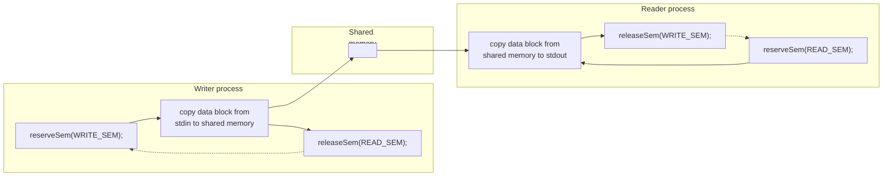
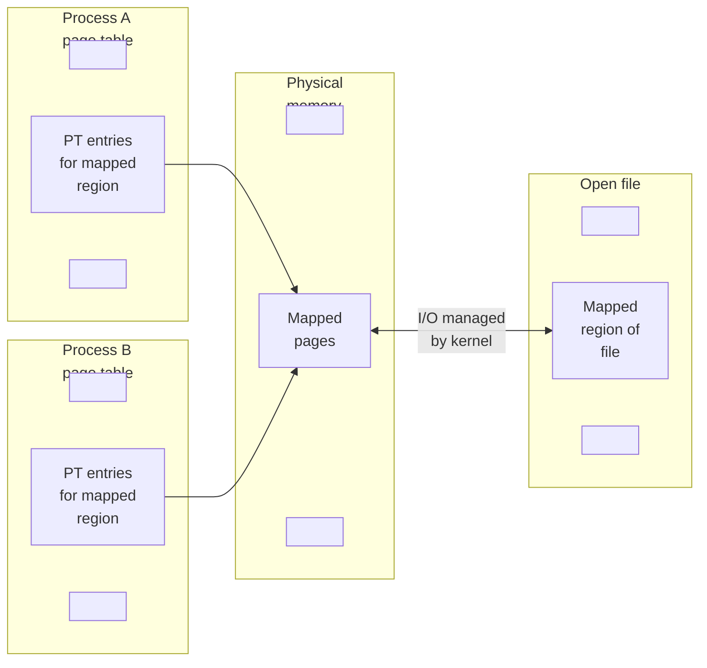
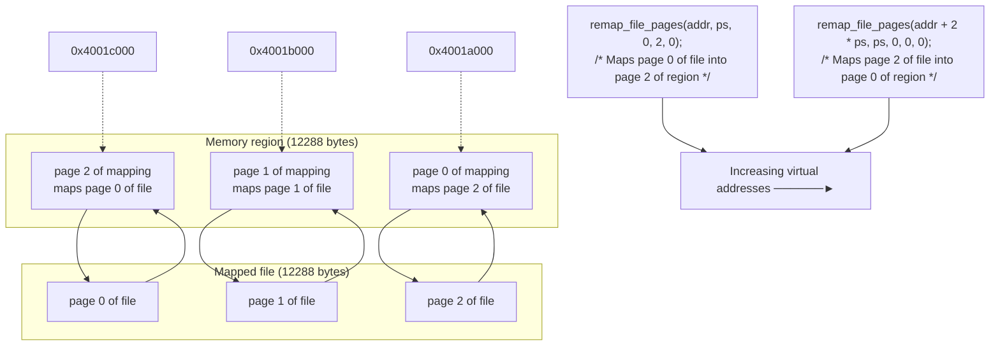

# <span id="page-120-0"></span>**SYSTEM V SHARED MEMORY**

This chapter describes System V shared memory. Shared memory allows two or more processes to share the same region (usually referred to as a segment) of physical memory. Since a shared memory segment becomes part of a process's user-space memory, no kernel intervention is required for IPC. All that is required is that one process copies data into the shared memory; that data is immediately available to all other processes sharing the same segment. This provides fast IPC by comparison with techniques such as pipes or message queues, where the sending process copies data from a buffer in user space into kernel memory and the receiving process copies in the reverse direction. (Each process also incurs the overhead of a system call to perform the copy operation.)

On the other hand, the fact that IPC using shared memory is not mediated by the kernel means that, typically, some method of synchronization is required so that processes don't simultaneously access the shared memory (e.g., two processes performing simultaneous updates, or one process fetching data from the shared memory while another process is in the middle of updating it). System V semaphores are a natural method for such synchronization. Other methods, such as POSIX semaphores (Chapter 53) and file locks (Chapter 55), are also possible.

> In mmap() terminology, a memory region is mapped at an address, while in System V terminology, a shared memory segment is attached at an address. These terms are equivalent; the terminology differences are a consequence of the separate origins of these two APIs.

## **48.1 Overview**

In order to use a shared memory segment, we typically perform the following steps:

-  Call shmget() to create a new shared memory segment or obtain the identifier of an existing segment (i.e., one created by another process). This call returns a shared memory identifier for use in later calls.
-  Use shmat() to attach the shared memory segment; that is, make the segment part of the virtual memory of the calling process.
-  At this point, the shared memory segment can be treated just like any other memory available to the program. In order to refer to the shared memory, the program uses the addr value returned by the shmat() call, which is a pointer to the start of the shared memory segment in the process's virtual address space.
-  Call shmdt() to detach the shared memory segment. After this call, the process can no longer refer to the shared memory. This step is optional, and happens automatically on process termination.
-  Call shmctl() to delete the shared memory segment. The segment will be destroyed only after all currently attached processes have detached it. Only one process needs to perform this step.

## <span id="page-121-0"></span>**48.2 Creating or Opening a Shared Memory Segment**

<span id="page-121-1"></span>The shmget() system call creates a new shared memory segment or obtains the identifier of an existing segment. The contents of a newly created shared memory segment are initialized to 0.

```
#include <sys/types.h> /* For portability */
#include <sys/shm.h>
int shmget(key_t key, size_t size, int shmflg);
          Returns shared memory segment identifier on success, or –1 on error
```

The key argument is a key generated using one of the methods described in Section [45.2](#page-48-1) (i.e., usually the value IPC\_PRIVATE or a key returned by ftok()).

When we use shmget() to create a new shared memory segment, size specifies a positive integer that indicates the desired size of the segment, in bytes. The kernel allocates shared memory in multiples of the system page size, so size is effectively rounded up to the next multiple of the system page size. If we are using shmget() to obtain the identifier of an existing segment, then size has no effect on the segment, but it must be less than or equal to the size of the segment.

The shmflg argument performs the same task as for the other IPC get calls, specifying the permissions (Table 15-4, on page 295) to be placed on a new shared memory segment or checked against an existing segment. In addition, zero or more of the following flags can be ORed (|) in shmflg to control the operation of shmget():

IPC\_CREAT

If no segment with the specified key exists, create a new segment.

IPC\_EXCL

If IPC\_CREAT was also specified, and a segment with the specified key already exists, fail with the error EEXIST.

The above flags are described in more detail in Section [45.1](#page-45-0). In addition, Linux permits the following nonstandard flags:

```
SHM_HUGETLB (since Linux 2.6)
```

A privileged (CAP\_IPC\_LOCK) process can use this flag to create a shared memory segment that uses huge pages. Huge pages are a feature provided by many modern hardware architectures to manage memory using very large page sizes. (For example, x86-32 allows 4-MB pages as an alternative to 4-kB pages.) On systems that have large amounts of memory, and where applications require large blocks of memory, using huge pages reduces the number of entries required in the hardware memory management unit's translation look-aside buffer (TLB). This is beneficial because entries in the TLB are usually a scarce resource. See the kernel source file Documentation/ vm/hugetlbpage.txt for further information.

```
SHM_NORESERVE (since Linux 2.6.15)
```

This flag serves the same purpose for shmget() as the MAP\_NORESERVE flag serves for mmap(). See Section [49.9](#page-161-0).

<span id="page-122-0"></span>On success, shmget() returns the identifier for the new or existing shared memory segment.

# **48.3 Using Shared Memory**

The shmat() system call attaches the shared memory segment identified by shmid to the calling process's virtual address space.

```
#include <sys/types.h> /* For portability */
#include <sys/shm.h>
void *shmat(int shmid, const void *shmaddr, int shmflg);
               Returns address at which shared memory is attached on success,
                                                        or (void *) –1 on error
```

The shmaddr argument and the setting of the SHM\_RND bit in the shmflg bit-mask argument control how the segment is attached:

-  If shmaddr is NULL, then the segment is attached at a suitable address selected by the kernel. This is the preferred method of attaching a segment.
-  If shmaddr is not NULL, and SHM\_RND is not set, then the segment is attached at the address specified by shmaddr, which must be a multiple of the system page size (or the error EINVAL results).
-  If shmaddr is not NULL, and SHM\_RND is set, then the segment is mapped at the address provided in shmaddr, rounded down to the nearest multiple of the constant SHMLBA (shared memory low boundary address). This constant is equal to some

multiple of the system page size. Attaching a segment at an address that is a multiple of SHMLBA is necessary on some architectures in order to improve CPU cache performance and to prevent the possibility that different attaches of the same segment have inconsistent views within the CPU cache.

> On the x86 architectures, SHMLBA is the same as the system page size, reflecting the fact that such caching inconsistencies can't arise on those architectures.

Specifying a non-NULL value for shmaddr (i.e., either the second or third option listed above) is not recommended, for the following reasons:

-  It reduces the portability of an application. An address valid on one UNIX implementation may be invalid on another.
-  An attempt to attach a shared memory segment at a particular address will fail if that address is already in use. This could happen if, for example, the application (perhaps inside a library function) had already attached another segment or created a memory mapping at that address.

As its function result, shmat() returns the address at which the shared memory segment is attached. This value can be treated like a normal C pointer; the segment looks just like any other part of the process's virtual memory. Typically, we assign the return value from shmat() to a pointer to some programmer-defined structure, in order to impose that structure on the segment (see, for example, [Listing 48-2](#page-126-0)).

To attach a shared memory segment for read-only access, we specify the flag SHM\_RDONLY in shmflg. Attempts to update the contents of a read-only segment result in a segmentation fault (the SIGSEGV signal). If SHM\_RDONLY is not specified, the memory can be both read and modified.

To attach a shared memory segment, a process requires read and write permissions on the segment, unless SHM\_RDONLY is specified, in which case only read permission is required.

> It is possible to attach the same shared memory segment multiple times within a process, and even to make one attach read-only while another is read-write. The contents of the memory at each attachment point are the same, since the different entries of the process virtual memory page tables are referring to the same physical pages of memory.

One final value that may be specified in shmflg is SHM\_REMAP. In this case, shmaddr must be non-NULL. This flag requests that the shmat() call replace any existing shared memory attachment or memory mapping in the range starting at shmaddr and continuing for the length of the shared memory segment. Normally, if we try to attach a shared memory segment at an address range that is already in use, the error EINVAL results. SHM\_REMAP is a nonstandard Linux extension.

[Table 48-1](#page-124-1) summarizes the constants that can be ORed in the shmflg argument of shmat().

When a process no longer needs to access a shared memory segment, it can call shmdt() to detach the segment from its virtual address space. The shmaddr argument identifies the segment to be detached. It should be a value returned by a previous call to shmat().

```
#include <sys/types.h> /* For portability */
#include <sys/shm.h>
int shmdt(const void *shmaddr);
                                           Returns 0 on success, or –1 on error
```

Detaching a shared memory segment is not the same as deleting it. Deletion is performed using the shmctl() IPC\_RMID operation, as described in Section [48.7](#page-134-1).

A child created by fork() inherits its parent's attached shared memory segments. Thus, shared memory provides an easy method of IPC between parent and child.

During an exec(), all attached shared memory segments are detached. Shared memory segments are also automatically detached on process termination.

<span id="page-124-1"></span>

| Table 48-1: shmflg bit-mask values for shmat() |  |  |
|------------------------------------------------|--|--|
|------------------------------------------------|--|--|

| Value      | Description                                    |
|------------|------------------------------------------------|
| SHM_RDONLY | Attach segment read-only                       |
| SHM_REMAP  | Replace any existing mapping at shmaddr        |
| SHM_RND    | Round shmaddr down to multiple of SHMLBA bytes |

# **48.4 Example: Transferring Data via Shared Memory**

<span id="page-124-0"></span>We now look at an example application that uses System V shared memory and semaphores. The application consists of two programs: the writer and the reader. The writer reads blocks of data from standard input and copies ("writes") them into a shared memory segment. The reader copies ("reads") blocks of data from the shared memory segment to standard output. In effect, the programs treat the shared memory somewhat like a pipe.

The two programs employ a pair of System V semaphores in a binary semaphore protocol (the initSemAvailable(), initSemInUse(), reserveSem(), and releaseSem() functions defined in Section [47.9](#page-111-0)) to ensure that:

-  only one process accesses the shared memory segment at a time; and
-  the processes alternate in accessing the segment (i.e., the writer writes some data, then the reader reads the data, then the writer writes again, and so on).

[Figure 48-1](#page-125-1) provides an overview of the use of these two semaphores. Note that the writer initializes the two semaphores so that it is the first of the two programs to be able to access the shared memory segment; that is, the writer's semaphore is initially available, and the reader's semaphore is initially in use.

The source code for the application consists of three files. The first of these, [Listing 48-1,](#page-125-0) is a header file shared by the reader and writer programs. This header defines the shmseg structure that we use to declare pointers to the shared memory segment. Doing this allows us to impose a structure on the bytes of the shared memory segment.



<span id="page-125-1"></span>**Figure 48-1:** Using semaphores to ensure exclusive, alternating access to shared memory

<span id="page-125-0"></span>**Listing 48-1:** Header file for svshm\_xfr\_writer.c and svshm\_xfr\_reader.c

```
–––––––––––––––––––––––––––––––––––––––––––––––––––––––– svshm/svshm_xfr.h
#include <sys/types.h>
#include <sys/stat.h>
#include <sys/sem.h>
#include <sys/shm.h>
#include "binary_sems.h" /* Declares our binary semaphore functions */
#include "tlpi_hdr.h"
#define SHM_KEY 0x1234 /* Key for shared memory segment */
#define SEM_KEY 0x5678 /* Key for semaphore set */
#define OBJ_PERMS (S_IRUSR | S_IWUSR | S_IRGRP | S_IWGRP)
 /* Permissions for our IPC objects */
#define WRITE_SEM 0 /* Writer has access to shared memory */
#define READ_SEM 1 /* Reader has access to shared memory */
#ifndef BUF_SIZE /* Allow "cc -D" to override definition */
#define BUF_SIZE 1024 /* Size of transfer buffer */
#endif
struct shmseg { /* Defines structure of shared memory segment */
 int cnt; /* Number of bytes used in 'buf' */
 char buf[BUF_SIZE]; /* Data being transferred */
};
–––––––––––––––––––––––––––––––––––––––––––––––––––––––– svshm/svshm_xfr.h
```

[Listing 48-2](#page-126-0) is the writer program. This program performs the following steps:

 Create a set containing the two semaphores that are used by the writer and reader program to ensure that they alternate in accessing the shared memory segment q. The semaphores are initialized so that the writer has first access to the shared memory segment. Since the writer creates the semaphore set, it must be started before the reader.

-  Create the shared memory segment and attach it to the writer's virtual address space at an address chosen by the system w.
-  Enter a loop that transfers data from standard input to the shared memory segment e. The following steps are performed in each loop iteration:
  - Reserve (decrement) the writer semaphore r.
  - Read data from standard input into the shared memory segment t.
  - Release (increment) the reader semaphore y.
-  The loop terminates when no further data is available from standard input u. On the last pass through the loop, the writer indicates to the reader that there is no more data by passing a block of data of length 0 (shmp–>cnt is 0).
-  Upon exiting the loop, the writer once more reserves its semaphore, so that it knows that the reader has completed the final access to the shared memory i. The writer then removes the shared memory segment and semaphore set o.

[Listing 48-3](#page-128-0) is the reader program. It transfers blocks of data from the shared memory segment to standard output. The reader performs the following steps:

-  Obtain the IDs of the semaphore set and shared memory segment that were created by the writer program q.
-  Attach the shared memory segment for read-only access w.
-  Enter a loop that transfers data from the shared memory segment e. The following steps are performed in each loop iteration:
  - Reserve (decrement) the reader semaphore r.
  - Check whether shmp–>cnt is 0; if so, exit this loop t.
  - Write the block of data in the shared memory segment to standard output y.
  - Release (increment) the writer semaphore u.
-  After exiting the loop, detach the shared memory segment i and releases the writer semaphore o, so that the writer program can remove the IPC objects.

<span id="page-126-1"></span><span id="page-126-0"></span>**Listing 48-2:** Transfer blocks of data from stdin to a System V shared memory segment

```
–––––––––––––––––––––––––––––––––––––––––––––––––– svshm/svshm_xfr_writer.c
  #include "semun.h" /* Definition of semun union */
  #include "svshm_xfr.h"
  int
  main(int argc, char *argv[])
  {
   int semid, shmid, bytes, xfrs;
   struct shmseg *shmp;
   union semun dummy;
q semid = semget(SEM_KEY, 2, IPC_CREAT | OBJ_PERMS);
   if (semid == -1)
   errExit("semget");
```

```
 if (initSemAvailable(semid, WRITE_SEM) == -1)
   errExit("initSemAvailable");
   if (initSemInUse(semid, READ_SEM) == -1)
   errExit("initSemInUse");
w shmid = shmget(SHM_KEY, sizeof(struct shmseg), IPC_CREAT | OBJ_PERMS);
   if (shmid == -1)
   errExit("shmget");
   shmp = shmat(shmid, NULL, 0);
   if (shmp == (void *) -1)
   errExit("shmat");
   /* Transfer blocks of data from stdin to shared memory */
e for (xfrs = 0, bytes = 0; ; xfrs++, bytes += shmp->cnt) {
r if (reserveSem(semid, WRITE_SEM) == -1) /* Wait for our turn */
   errExit("reserveSem");
t shmp->cnt = read(STDIN_FILENO, shmp->buf, BUF_SIZE);
   if (shmp->cnt == -1)
   errExit("read");
y if (releaseSem(semid, READ_SEM) == -1) /* Give reader a turn */
   errExit("releaseSem");
   /* Have we reached EOF? We test this after giving the reader
   a turn so that it can see the 0 value in shmp->cnt. */
u if (shmp->cnt == 0)
   break;
   }
   /* Wait until reader has let us have one more turn. We then know
   reader has finished, and so we can delete the IPC objects. */
i if (reserveSem(semid, WRITE_SEM) == -1)
   errExit("reserveSem");
o if (semctl(semid, 0, IPC_RMID, dummy) == -1)
   errExit("semctl");
   if (shmdt(shmp) == -1)
   errExit("shmdt");
   if (shmctl(shmid, IPC_RMID, 0) == -1)
   errExit("shmctl");
   fprintf(stderr, "Sent %d bytes (%d xfrs)\n", bytes, xfrs);
   exit(EXIT_SUCCESS);
  }
  –––––––––––––––––––––––––––––––––––––––––––––––––– svshm/svshm_xfr_writer.c
```

<span id="page-128-1"></span><span id="page-128-0"></span>**Listing 48-3:** Transfer blocks of data from a System V shared memory segment to stdout

```
–––––––––––––––––––––––––––––––––––––––––––––––––– svshm/svshm_xfr_reader.c
  #include "svshm_xfr.h"
  int
  main(int argc, char *argv[])
  {
   int semid, shmid, xfrs, bytes;
   struct shmseg *shmp;
   /* Get IDs for semaphore set and shared memory created by writer */
q semid = semget(SEM_KEY, 0, 0);
   if (semid == -1)
   errExit("semget");
   shmid = shmget(SHM_KEY, 0, 0);
   if (shmid == -1)
   errExit("shmget");
w shmp = shmat(shmid, NULL, SHM_RDONLY);
   if (shmp == (void *) -1)
   errExit("shmat");
   /* Transfer blocks of data from shared memory to stdout */
e for (xfrs = 0, bytes = 0; ; xfrs++) {
r if (reserveSem(semid, READ_SEM) == -1) /* Wait for our turn */
   errExit("reserveSem");
t if (shmp->cnt == 0) /* Writer encountered EOF */
   break;
   bytes += shmp->cnt;
y if (write(STDOUT_FILENO, shmp->buf, shmp->cnt) != shmp->cnt)
   fatal("partial/failed write");
u if (releaseSem(semid, WRITE_SEM) == -1) /* Give writer a turn */
   errExit("releaseSem");
   }
i if (shmdt(shmp) == -1)
   errExit("shmdt");
   /* Give writer one more turn, so it can clean up */
o if (releaseSem(semid, WRITE_SEM) == -1)
   errExit("releaseSem");
   fprintf(stderr, "Received %d bytes (%d xfrs)\n", bytes, xfrs);
   exit(EXIT_SUCCESS);
  }
  –––––––––––––––––––––––––––––––––––––––––––––––––– svshm/svshm_xfr_reader.c
```

The following shell session demonstrates the use of the programs in [Listing 48-2](#page-126-0) and [Listing 46-9](#page-83-1). We invoke the writer, using the file /etc/services as input, and then invoke the reader, directing its output to another file:

```
$ wc -c /etc/services Display size of test file
764360 /etc/services
$ ./svshm_xfr_writer < /etc/services &
[1] 9403
$ ./svshm_xfr_reader > out.txt
Received 764360 bytes (747 xfrs) Message from reader
Sent 764360 bytes (747 xfrs) Message from writer
[1]+ Done ./svshm_xfr_writer < /etc/services
$ diff /etc/services out.txt
$
```

<span id="page-129-0"></span>The diff command produced no output, indicating that the output file produced by the reader has the same content as the input file used by the writer.

# **48.5 Location of Shared Memory in Virtual Memory**

In Section 6.3, we considered the layout of the various parts of a process in virtual memory. It is useful to revisit this topic in the context of attaching System V shared memory segments. If we follow the recommended approach of allowing the kernel to choose where to attach a shared memory segment, then (on the x86-32 architecture) the memory layout appears as shown in [Figure 48-2](#page-130-0), with the segment being attached in the unallocated space between the upwardly growing heap and the downwardly growing stack. To allow space for heap and stack growth, shared memory segments are attached starting at the virtual address 0x40000000. Mapped mappings (Chapter [49](#page-140-0)) and shared libraries (Chapters 41 and 42) are also placed in this area. (There is some variation in the default location at which shared memory mappings and memory segments are placed, depending on the kernel versions and the setting of the process's RLIMIT\_STACK resource limit.)

> The address 0x40000000 is defined as the kernel constant TASK\_UNMAPPED\_BASE. It is possible to change this address by defining this constant with a different value and rebuilding the kernel.

> A shared memory segment (or memory mapping) can be placed at an address below TASK\_UNMAPPED\_BASE, if we employ the unrecommended approach of explicitly specifying an address when calling shmat() (or mmap()).

Using the Linux-specific /proc/PID/maps file, we can see the location of the shared memory segments and shared libraries mapped by a program, as we demonstrate in the shell session below.

> Starting with kernel 2.6.14, Linux also provides the /proc/PID/smaps file, which exposes more information about the memory consumption of each of a process's mappings. For further details, see the proc(5) manual page.

#### Virtual memory address (hexadecimal)

```text
Virtual memory address
    (hexadecimal)
                        ┌─────────────────────────────┐
    0xC0000000          │      argc, environ          │
                        ├─────────────────────────────┤
                        │          Stack              │
                        ├ ─ ─ ─ ─ ─ ─ ─ ─ ─ ─ ─ ─ ─ --┤◄── Top of
                        │            │                │    stack
                        │            ▼                │
                        │                             │
                        ├ ─ ─ ─ ─ ─ ─ ─ ─ ─ ─ ─ ─ ─ --┤
                        │                             │
                        │   Shared memory, memory     │
                        │   mappings, and shared      │
                        │   libraries placed here     │
                        │                             │
    0x40000000          ├─────────────────────────────┤
TASK_UNMAPPED_BASE      │                             │
                        │ Reserved for heap expansion │
        ▲               │                             │
        │               │            ▲                │
        │               ├ ─ ─ ─ ─ ─ ─│─ ─ ─ ─ ─ ─ ─ --┤◄── Program
        │               │                             │    break
Increasing virtual      │          Heap               │
addresses               ├─────────────────────────────┤
        │               │ Uninitialized data (bss)    │
        │               ├─────────────────────────────┤
        │               │    Initialized data         │
                        ├─────────────────────────────┤
    0x08048000          │   Text (program code)       │
                        ├─────────────────────────────┤
    0x00000000          │                             │
                        └─────────────────────────────┘
```

<span id="page-130-0"></span>**Figure 48-2:** Locations of shared memory, memory mappings, and shared libraries (x86-32)

In the shell session below, we employ three programs that are not shown in this chapter, but are provided in the svshm subdirectory in the source code distribution for this book. These programs perform the following tasks:

-  The svshm\_create.c program creates a shared memory segment. This program takes the same command-line options as the corresponding programs that we provide for message queues [\(Listing 46-1](#page-61-1), on page [938\)](#page-61-1) and semaphores, but includes an additional argument that specifies the size of the segment.
-  The svshm\_attach.c program attaches the shared memory segments identified by its command-line arguments. Each of these arguments is a colon-separated pair of numbers consisting of a shared memory identifier and an attach address. Specifying 0 for the attach address means that the system should choose the address. The program displays the address at which the memory is actually attached. For informational purposes, the program also displays the value of the SHMLBA constant and the process ID of the process running the program.
-  The svshm\_rm.c program deletes the shared memory segments identified by its command-line arguments.

We begin the shell session by creating two shared memory segments (100 kB and 3200 kB in size):

```
$ ./svshm_create -p 102400
9633796
$ ./svshm_create -p 3276800
9666565
$ ./svshm_create -p 102400
1015817
$ ./svshm_create -p 3276800
1048586
```

We then start a program that attaches these two segments at addresses chosen by the kernel:

```
$ ./svshm_attach 9633796:0 9666565:0
SHMLBA = 4096 (0x1000), PID = 9903
1: 9633796:0 ==> 0xb7f0d000
2: 9666565:0 ==> 0xb7bed000
Sleeping 5 seconds
```

The output above shows the addresses at which the segments were attached. Before the program completes sleeping, we suspend it, and then examine the contents of the corresponding /proc/PID/maps file:

```
Type Control-Z to suspend program
[1]+ Stopped ./svshm_attach 9633796:0 9666565:0
$ cat /proc/9903/maps
```

The output produced by the cat command is shown in [Listing 48-4.](#page-131-0)

<span id="page-131-0"></span>**Listing 48-4:** Example of contents of /proc/PID/maps

```
$ cat /proc/9903/maps
q 08048000-0804a000 r-xp 00000000 08:05 5526989 /home/mtk/svshm_attach
  0804a000-0804b000 r--p 00001000 08:05 5526989 /home/mtk/svshm_attach
  0804b000-0804c000 rw-p 00002000 08:05 5526989 /home/mtk/svshm_attach
w b7bed000-b7f0d000 rw-s 00000000 00:09 9666565 /SYSV00000000 (deleted)
  b7f0d000-b7f26000 rw-s 00000000 00:09 9633796 /SYSV00000000 (deleted)
  b7f26000-b7f27000 rw-p b7f26000 00:00 0
e b7f27000-b8064000 r-xp 00000000 08:06 122031 /lib/libc-2.8.so
  b8064000-b8066000 r--p 0013d000 08:06 122031 /lib/libc-2.8.so
  b8066000-b8067000 rw-p 0013f000 08:06 122031 /lib/libc-2.8.so
  b8067000-b806b000 rw-p b8067000 00:00 0
  b8082000-b8083000 rw-p b8082000 00:00 0
r b8083000-b809e000 r-xp 00000000 08:06 122125 /lib/ld-2.8.so
  b809e000-b809f000 r--p 0001a000 08:06 122125 /lib/ld-2.8.so
  b809f000-b80a0000 rw-p 0001b000 08:06 122125 /lib/ld-2.8.so
t bfd8a000-bfda0000 rw-p bffea000 00:00 0 [stack]
y ffffe000-fffff000 r-xp 00000000 00:00 0 [vdso]
```

In the output from /proc/PID/maps shown in [Listing 48-4,](#page-131-0) we can see the following:

-  Three lines for the main program, shm\_attach. These correspond to the text and data segments of the program q. The second of these lines is for a readonly page holding the string constants used by the program.
-  Two lines for the attached System V shared memory segments w.
-  Lines corresponding to the segments for two shared libraries. One of these is the standard C library (libc-version.so) e. The other is the dynamic linker (ld-version.so), which we describe in Section 41.4.3 r.
-  A line labeled [stack]. This corresponds to the process stack t.
-  A line containing the tag [vdso] y. This is an entry for the linux-gate virtual dynamic shared object (DSO). This entry appears only in kernels since 2.6.12. See http://www.trilithium.com/johan/2005/08/linux-gate/ for further information about this entry.

The following columns are shown in each line of /proc/PID/maps, in order from left to right:

- 1. A pair of hyphen-separated numbers indicating the virtual address range (in hexadecimal) at which the memory segment is mapped. The second of these numbers is the address of the next byte after the end of the segment.
- 2. Protection and flags for this memory segment. The first three letters indicate the protection of the segment: read (r), write (w), and execute (x). A hyphen (-) in place of any of these letters indicates that the corresponding protection is disabled. The final letter indicates the mapping flag for the memory segment; it is either private (p) or shared (s). For an explanation of these flags, see the description of the MAP\_PRIVATE and MAP\_SHARED flags in Section [49.2](#page-143-0). (A System V shared memory segment is always marked shared.)
- 3. The hexadecimal offset (in bytes) of the segment within the corresponding mapped file. The meanings of this and the following two columns will become clearer when we describe the mmap() system call in Chapter [49](#page-140-0). For a System V shared memory segment, the offset is always 0.
- 4. The device number (major and minor IDs) of the device on which the corresponding mapped file is located.
- 5. The i-node number of the mapped file, or, for System V shared memory segments, the identifier for the segment.
- 6. The filename or other identifying tag associated with this memory segment. For a System V shared memory segment, this consists of the string SYSV concatenated with the shmget() key of the segment (expressed in hexadecimal). In this example, SYSV is followed by zeros because we created the segments using the key IPC\_PRIVATE (which has the value 0). The string (deleted) that appears after the SYSV field for a System V shared memory segment is an artifact of the implementation of shared memory segments. Such segments are created as mapped files in an invisible tmpfs file system (Section 14.10), and then later unlinked. Shared anonymous memory mappings are implemented in the same manner. (We describe mapped files and shared anonymous memory mappings in Chapter [49.](#page-140-0))

## **48.6 Storing Pointers in Shared Memory**

<span id="page-133-1"></span>Each process may employ different shared libraries and memory mappings, and may attach different sets of shared memory segments. Therefore, if we follow the recommended practice of letting the kernel choose where to attach a shared memory segment, the segment may be attached at a different address in each process. For this reason, when storing references inside a shared memory segment that point to other addresses within the segment, we should use (relative) offsets, rather than (absolute) pointers.

For example, suppose we have a shared memory segment whose starting address is pointed to by baseaddr (i.e., baseaddr is the value returned by shmat()). Furthermore, at the location pointed to by p, we want to store a pointer to the same location as is pointed to by target, as shown in [Figure 48-3.](#page-133-0) This sort of operation would be typical if we were building a linked list or a binary tree within the segment. The usual C idiom for setting \*p would be the following:

```text
*p = target;          /* Place pointer in *p (WRONG!) */

Shared memory segment
              ┌─────────┐
              │         │
target ──────>│         │◄─┐
              │         │  │
              │         │  │
              │         │  │
p ───────────>│         │──┘
              │         │
              │         │
baseaddr ────>└─────────┘
```

**Figure 48-3:** Using pointers in a shared memory segment

The problem with this code is that the location pointed to by target may reside at a different virtual address when the shared memory segment is attached in another process, which means that the value stored at \*p is meaningless in that process. The correct approach is to store an offset at \*p, as in the following:

```
*p = (target - baseaddr); /* Place offset in *p */
```

When dereferencing such pointers, we reverse the above step:

```
target = baseaddr + *p; /* Interpret offset */
```

Here, we assume that in each process, baseaddr points to the start of the shared memory segment (i.e., it is the value returned by shmat() in each process). Given this assumption, an offset value is correctly interpreted, no matter where the shared memory segment is attached in a process's virtual address space.

Alternatively, if we are linking together a set of fixed-size structures, we can cast the shared memory segment (or a part thereof) as an array, and then use index numbers as the "pointers" referring from one structure to another.

<span id="page-133-0"></span>baseaddr

# <span id="page-134-1"></span>**48.7 Shared Memory Control Operations**

<span id="page-134-0"></span>The shmctl() system call performs a range of control operations on the shared memory segment identified by shmid.

```
#include <sys/types.h> /* For portability */
#include <sys/shm.h>
int shmctl(int shmid, int cmd, struct shmid_ds *buf);
                                           Returns 0 on success, or –1 on error
```

The cmd argument specifies the control operation to be performed. The buf argument is required by the IPC\_STAT and IPC\_SET operations (described below), and should be specified as NULL for the remaining operations.

In the remainder of this section, we describe the various operations that can be specified for cmd.

## **Generic control operations**

The following operations are the same as for other types of System V IPC objects. Further details about these operations, including the privileges and permissions required by the calling process, are described in Section [45.3.](#page-50-0)

IPC\_RMID

Mark the shared memory segment and its associated shmid\_ds data structure for deletion. If no processes currently have the segment attached, deletion is immediate; otherwise, the segment is removed after all processes have detached from it (i.e., when the value of the shm\_nattch field in the shmid\_ds data structure falls to 0). In some applications, we can make sure that a shared memory segment is tidily cleared away on application termination by marking it for deletion immediately after all processes have attached it to their virtual address space with shmat(). This is analogous to unlinking a file once we've opened it.

On Linux, if a shared segment has been marked for deletion using IPC\_RMID, but has not yet been removed because some process still has it attached, then it is possible for another process to attach that segment. However, this behavior is not portable: most UNIX implementations prevent new attaches to a segment marked for deletion. (SUSv3 is silent on what behavior should occur in this scenario.) A few Linux applications have come to depend on this behavior, which is why Linux has not been changed to match other UNIX implementations.

IPC\_STAT

Place a copy of the shmid\_ds data structure associated with this shared memory segment in the buffer pointed to by buf. (We describe this data structure in Section [48.8.](#page-135-0))

IPC\_SET

Update selected fields of the shmid\_ds data structure associated with this shared memory segment using values in the buffer pointed to by buf.

## **Locking and unlocking shared memory**

A shared memory segment can be locked into RAM, so that it is never swapped out. This provides a performance benefit, since, once each page of the segment is memory-resident, an application is guaranteed never to be delayed by a page fault when it accesses the page. There are two shmctl() locking operations:

-  The SHM\_LOCK operation locks a shared memory segment into memory.
-  The SHM\_UNLOCK operation unlocks the shared memory segment, allowing it to be swapped out.

These operations are not specified by SUSv3, and they are not provided on all UNIX implementations.

In versions of Linux before 2.6.10, only privileged (CAP\_IPC\_LOCK) processes can lock a shared memory segment into memory. Since Linux 2.6.10, an unprivileged process can lock and unlock a shared memory segment if its effective user ID matches either the owner or the creator user ID of the segment and (in the case of SHM\_LOCK) the process has a sufficiently high RLIMIT\_MEMLOCK resource limit. See Section 50.2 for details.

Locking a shared memory segment does not guarantee that all of the pages of the segment are memory-resident at the completion of the shmctl() call. Rather, nonresident pages are individually locked in only as they are faulted into memory by subsequent references by processes that have attached the shared memory segment. Once faulted in, the pages stay resident until subsequently unlocked, even if all processes detach the segment. (In other words, the SHM\_LOCK operation sets a property of the shared memory segment, rather than a property of the calling process.)

> By faulted into memory, we mean that when the process references the nonresident page, a page fault occurs. At this point, if the page is in the swap area, then it is reloaded into memory. If the page is being referenced for the first time, no corresponding page exists in the swap file. Therefore, the kernel allocates a new page of physical memory and adjusts the process's page tables and the bookkeeping data structures for the shared memory segment.

An alternative method of locking memory, with slightly different semantics, is the use of mlock(), which we describe in Section 50.2.

# <span id="page-135-0"></span>**48.8 Shared Memory Associated Data Structure**

Each shared memory segment has an associated shmid\_ds data structure of the following form:

```
struct shmid_ds {
 struct ipc_perm shm_perm; /* Ownership and permissions */
 size_t shm_segsz; /* Size of segment in bytes */
 time_t shm_atime; /* Time of last shmat() */
 time_t shm_dtime; /* Time of last shmdt() */
 time_t shm_ctime; /* Time of last change */
 pid_t shm_cpid; /* PID of creator */
 pid_t shm_lpid; /* PID of last shmat() / shmdt() */
 shmatt_t shm_nattch; /* Number of currently attached processes */
};
```

SUSv3 requires all of the fields shown here. Some other UNIX implementations include additional nonstandard fields in the shmid\_ds structure.

The fields of the shmid\_ds structure are implicitly updated by various shared memory system calls, and certain subfields of the shm\_perm field can be explicitly updated using the shmctl() IPC\_SET operation. The details are as follows:

#### shm\_perm

When the shared memory segment is created, the fields of this substructure are initialized as described in Section [45.3](#page-50-0). The uid, gid, and (the lower 9 bits of the) mode subfields can be updated via IPC\_SET. As well as the usual permission bits, the shm\_perm.mode field holds two read-only bit-mask flags. The first of these, SHM\_DEST (destroy), indicates whether the segment is marked for deletion (via the shmctl() IPC\_RMID operation) when all processes have detached it from their address space. The other flag, SHM\_LOCKED, indicates whether the segment is locked into physical memory (via the shmctl() SHM\_LOCK operation). Neither of these flags is standardized in SUSv3, and equivalents appear on only a few other UNIX implementations, in some cases with different names.

#### shm\_segsz

On creation of the shared memory segment, this field is set to the requested size of the segment in bytes (i.e., to the value of the size argument specified in the call to shmget()). As noted in Section [48.2,](#page-121-0) shared memory is allocated in units of pages, so the actual size of the segment may be larger than this value.

#### shm\_atime

This field is set to 0 when the shared memory segment is created, and set to the current time whenever a process attaches the segment (shmat()). This field and the other timestamp fields in the shmid\_ds structure are typed as time\_t, and store time in seconds since the Epoch.

#### shm\_dtime

This field is set to 0 when the shared memory segment is created, and set to the current time whenever a process detaches the segment (shmdt()).

#### shm\_ctime

This field is set to the current time when the segment is created, and on each successful IPC\_SET operation.

#### shm\_cpid

This field is set to the process ID of the process that created the segment using shmget().

#### shm\_lpid

This field is set to 0 when the shared memory segment is created, and then set to the process ID of the calling process on each successful shmat() or shmdt().

shm\_nattch

This field counts the number of processes that currently have the segment attached. It is initialized to 0 when the segment is created, and then incremented by each successful shmat() and decremented by each successful shmdt(). The shmatt\_t data type used to define this field is an unsigned integer type that SUSv3 requires to be at least the size of unsigned short. (On Linux, this type is defined as unsigned long.)

# **48.9 Shared Memory Limits**

Most UNIX implementations impose various limits on System V shared memory. Below is a list of the Linux shared memory limits. The system call affected by the limit and the error that results if the limit is reached are noted in parentheses.

SHMMNI

This is a system-wide limit on the number of shared memory identifiers (in other words, shared memory segments) that can be created. (shmget(), ENOSPC)

SHMMIN

This is the minimum size (in bytes) of a shared memory segment. This limit is defined with the value 1 (this can't be changed). However, the effective limit is the system page size. (shmget(), EINVAL)

SHMMAX

This is the maximum size (in bytes) of a shared memory segment. The practical upper limit for SHMMAX depends on available RAM and swap space. (shmget(), EINVAL)

SHMALL

This is a system-wide limit on the total number of pages of shared memory. Most other UNIX implementations don't provide this limit. The practical upper limit for SHMALL depends on available RAM and swap space. (shmget(), ENOSPC)

Some other UNIX implementations also impose the following limit (which is not implemented on Linux):

SHMSEG

This is a per-process limit on the number of attached shared memory segments.

At system startup, the shared memory limits are set to default values. (These defaults may vary across kernel versions, and some distributors' kernels set different defaults from those provided by vanilla kernels.) On Linux, some of the limits can be viewed or changed via files in the /proc file system. [Table 48-2](#page-138-0) lists the /proc file corresponding to each limit. As an example, here are the default limits that we see for Linux 2.6.31 on one x86-32 system:

\$ **cd /proc/sys/kernel** \$ **cat shmmni** 4096

```
$ cat shmmax
33554432
$ cat shmall
2097152
```

The Linux-specific shmctl() IPC\_INFO operation retrieves a structure of type shminfo, which contains the values of the various shared memory limits:

```
struct shminfo buf;
shmctl(0, IPC_INFO, (struct shmid_ds *) &buf);
```

A related Linux-specific operation, SHM\_INFO, retrieves a structure of type shm\_info that contains information about actual resources used for shared memory objects. An example of the use of SHM\_INFO is provided in the file svshm/svshm\_info.c in the source code distribution for this book.

Details about IPC\_INFO, SHM\_INFO, and the shminfo and shm\_info structures can be found in the shmctl(2) manual page.

| Limit  | Ceiling value (x86-32)      | Corresponding file<br>in /proc/sys/kernel |
|--------|-----------------------------|-------------------------------------------|
| SHMMNI | 32768 (IPCMNI)              | shmmni                                    |
| SHMMAX | Depends on available memory | shmmax                                    |
| SHMALL | Depends on available memory | shmall                                    |

<span id="page-138-0"></span>**Table 48-2:** System V shared memory limits

# **48.10 Summary**

Shared memory allows two or more processes to share the same pages of memory. No kernel intervention is required to exchange data via shared memory. Once a process has copied data into a shared memory segment, that data is immediately visible to other processes. Shared memory provides fast IPC, although this speed advantage is somewhat offset by the fact that normally we must use some type of synchronization technique, such as a System V semaphore, to synchronize access to the shared memory.

The recommended approach when attaching a shared memory segment is to allow the kernel to choose the address at which the segment is attached in the process's virtual address space. This means that the segment may reside at different virtual addresses in different processes. For this reason, any references to addresses within the segment should be maintained as relative offsets, rather than as absolute pointers.

### **Further information**

The Linux memory-management scheme and some details of the implementation of shared memory are described in [Bovet & Cesati, 2005].

## **48.11 Exercises**

- **48-1.** Replace the use of binary semaphores in [Listing 48-2](#page-126-0) (svshm\_xfr\_writer.c) and [Listing 48-3](#page-128-0) (svshm\_xfr\_reader.c) with the use of event flags [\(Exercise 47-5\)](#page-118-0).
- **48-2.** Explain why the program in [Listing 48-3](#page-128-0) incorrectly reports the number of bytes transferred if the for loop is modified as follows:

```
for (xfrs = 0, bytes = 0; shmp->cnt != 0; xfrs++, bytes += shmp->cnt) {
 reserveSem(semid, READ_SEM); /* Wait for our turn */
 if (write(STDOUT_FILENO, shmp->buf, shmp->cnt) != shmp->cnt)
 fatal("write");
 releaseSem(semid, WRITE_SEM); /* Give writer a turn */
}
```

- **48-3.** Try compiling the programs in [Listing 48-2](#page-126-0) (svshm\_xfr\_writer.c) and [Listing 48-3](#page-128-0) (svshm\_xfr\_reader.c) with a range of different sizes (defined by the constant BUF\_SIZE) for the buffer used to exchange data between the two programs. Time the execution of svshm\_xfr\_reader.c for each buffer size.
- **48-4.** Write a program that displays the contents of the shmid\_ds data structure (Section [48.8](#page-135-0)) associated with a shared memory segment. The identifier of the segment should be specified as a command-line argument. (See the program in [Listing 47-3,](#page-96-1) on page [973,](#page-96-1) which performs the analogous task for System V semaphores.)
- **48-5.** Write a directory service that uses a shared memory segment to publish name-value pairs. You will need to provide an API that allows callers to create a new name, modify an existing name, delete an existing name, and retrieve the value associated with a name. Use semaphores to ensure that a process performing an update to the shared memory segment has exclusive access to the segment.
- **48-6.** Write a program (analogous to program in [Listing 46-6,](#page-76-1) on page [953\)](#page-76-1) that uses the shmctl() SHM\_INFO and SHM\_STAT operations to obtain and display a list of all shared memory segments on the system.

# <span id="page-140-0"></span>**MEMORY MAPPINGS**

This chapter discusses the use of the mmap() system call to create memory mappings. Memory mappings can be used for IPC, as well as a range of other purposes. We begin with an overview of some fundamental concepts before considering mmap() in depth.

# **49.1 Overview**

The mmap() system call creates a new memory mapping in the calling process's virtual address space. A mapping can be of two types:

-  File mapping: A file mapping maps a region of a file directly into the calling process's virtual memory. Once a file is mapped, its contents can be accessed by operations on the bytes in the corresponding memory region. The pages of the mapping are (automatically) loaded from the file as required. This type of mapping is also known as a file-based mapping or memory-mapped file.
-  Anonymous mapping: An anonymous mapping doesn't have a corresponding file. Instead, the pages of the mapping are initialized to 0.

Another way of thinking of an anonymous mapping (and one is that is close to the truth) is that it is a mapping of a virtual file whose contents are always initialized with zeros.

The memory in one process's mapping may be shared with mappings in other processes (i.e., the page-table entries of each process point to the same pages of RAM). This can occur in two ways:

-  When two processes map the same region of a file, they share the same pages of physical memory.
-  A child process created by fork() inherits copies of its parent's mappings, and these mappings refer to the same pages of physical memory as the corresponding mappings in the parent.

When two or more processes share the same pages, each process can potentially see the changes to the page contents made by other processes, depending on whether the mapping is private or shared:

-  Private mapping (MAP\_PRIVATE): Modifications to the contents of the mapping are not visible to other processes and, for a file mapping, are not carried through to the underlying file. Although the pages of a private mapping are initially shared in the circumstances described above, changes to the contents of the mapping are nevertheless private to each process. The kernel accomplishes this using the copy-on-write technique (Section 24.2.2). This means that whenever a process attempts to modify the contents of a page, the kernel first creates a new, separate copy of that page for the process (and adjusts the process's page tables). For this reason, a MAP\_PRIVATE mapping is sometimes referred to as a private, copy-on-write mapping.
-  Shared mapping (MAP\_SHARED): Modifications to the contents of the mapping are visible to other processes that share the same mapping and, for a file mapping, are carried through to the underlying file.

The two mapping attributes described above (file versus anonymous and private versus shared) can be combined in four different ways, as summarized in [Table 49-1](#page-141-0).

<span id="page-141-0"></span>**Table 49-1:** Purposes of various types of memory mappings

| Visibility of | Mapping type                                                 |                                           |
|---------------|--------------------------------------------------------------|-------------------------------------------|
| modifications | File                                                         | Anonymous                                 |
| Private       | Initializing memory from contents of file                    | Memory allocation                         |
| Shared        | Memory-mapped I/O; sharing memory<br>between processes (IPC) | Sharing memory between<br>processes (IPC) |

The four different types of memory mappings are created and used as follows:

 Private file mapping: The contents of the mapping are initialized from a file region. Multiple processes mapping the same file initially share the same physical pages of memory, but the copy-on-write technique is employed, so that changes to the mapping by one process are invisible to other processes. The

- main use of this type of mapping is to initialize a region of memory from the contents of a file. Some common examples are initializing a process's text and initialized data segments from the corresponding parts of a binary executable file or a shared library file.
-  Private anonymous mapping: Each call to mmap() to create a private anonymous mapping yields a new mapping that is distinct from (i.e., does not share physical pages with) other anonymous mappings created by the same (or a different) process. Although a child process inherits its parent's mappings, copy-on-write semantics ensure that, after the fork(), the parent and child don't see changes made to the mapping by the other process. The primary purpose of private anonymous mappings is to allocate new (zero-filled) memory for a process (e.g., malloc() employs mmap() for this purpose when allocating large blocks of memory).
-  Shared file mapping: All processes mapping the same region of a file share the same physical pages of memory, which are initialized from a file region. Modifications to the contents of the mapping are carried through to the file. This type of mapping serves two purposes. First, it permits memory-mapped I/O. By this, we mean that a file is loaded into a region of the process's virtual memory, and modifications to that memory are automatically written to the file. Thus, memory-mapped I/O provides an alternative to using read() and write() for performing file I/O. A second purpose of this type of mapping is to allow unrelated processes to share a region of memory in order to perform (fast) IPC in a manner similar to System V shared memory segments (Chapter [48](#page-120-0)).
-  Shared anonymous mapping: As with a private anonymous mapping, each call to mmap() to create a shared anonymous mapping creates a new, distinct mapping that doesn't share pages with any other mapping. The difference is that the pages of the mapping are not copied-on-write. This means that when a child inherits the mapping after a fork(), the parent and child share the same pages of RAM, and changes made to the contents of the mapping by one process are visible to the other process. Shared anonymous mappings allow IPC in a manner similar to System V shared memory segments, but only between related processes.

We consider each of these types of mapping in more detail in the remainder of this chapter.

Mappings are lost when a process performs an exec(), but are inherited by the child of a fork(). The mapping type (MAP\_PRIVATE or MAP\_SHARED) is also inherited.

Information about all of a process's mappings is visible in the Linux-specific /proc/ PID/maps file, which we described in Section [48.5.](#page-129-0)

> One further use of mmap() is with POSIX shared memory objects, which allow a region of memory to be shared between unrelated processes without having to create an associated disk file (as is required for a shared file mapping). We describe POSIX shared memory objects in Chapter 54.

# <span id="page-143-2"></span>**49.2 Creating a Mapping: mmap()**

<span id="page-143-0"></span>The mmap() system call creates a new mapping in the calling process's virtual address space.

```
#include <sys/mman.h>
void *mmap(void *addr, size_t length, int prot, int flags, int fd, off_t offset);
          Returns starting address of mapping on success, or MAP_FAILED on error
```

The addr argument indicates the virtual address at which the mapping is to be located. If we specify addr as NULL, the kernel chooses a suitable address for the mapping. This is the preferred way of creating a mapping. Alternatively, we can specify a non-NULL value in addr, which the kernel takes as a hint about the address at which the mapping should be placed. In practice, the kernel will at the very least round the address to a nearby page boundary. In either case, the kernel will choose an address that doesn't conflict with any existing mapping. (If the value MAP\_FIXED is included in flags, then addr must be page-aligned. We describe this flag in Section [49.10.](#page-163-0))

On success, mmap() returns the starting address of the new mapping. On error, mmap() returns MAP\_FAILED.

> On Linux (and on most other UNIX implementations), the MAP\_FAILED constant equates to ((void \*) –1). However, SUSv3 specifies this constant because the C standards can't guarantee that ((void \*) –1) is distinct from a successful mmap() return value.

The length argument specifies the size of the mapping in bytes. Although length doesn't need to be a multiple of the system page size (as returned by sysconf(\_SC\_PAGESIZE)), the kernel creates mappings in units of this size, so that length is, in effect, rounded up to the next multiple of the page size.

The prot argument is a bit mask specifying the protection to be placed on the mapping. It can be either PROT\_NONE or a combination (ORing) of any of the other three flags listed in [Table 49-2](#page-143-1).

<span id="page-143-1"></span>

| Table 49-2: Memory protection values |  |  |
|--------------------------------------|--|--|
|--------------------------------------|--|--|

| Value      | Description                                |
|------------|--------------------------------------------|
| PROT_NONE  | The region may not be accessed             |
| PROT_READ  | The contents of the region can be read     |
| PROT_WRITE | The contents of the region can be modified |
| PROT_EXEC  | The contents of the region can be executed |

The flags argument is a bit mask of options controlling various aspects of the mapping operation. Exactly one of the following values must be included in this mask:

#### MAP\_PRIVATE

Create a private mapping. Modifications to the contents of the region are not visible to other processes employing the same mapping, and, in the case of a file mapping, are not carried through to the underlying file.

#### MAP\_SHARED

Create a shared mapping. Modifications to the contents of the region are visible to other processes mapping the same region with the MAP\_SHARED attribute and, in the case of a file mapping, are carried through to the underlying file. Updates to the file are not guaranteed to be immediate; see the discussion of the msync() system call in Section [49.5](#page-154-0).

Aside from MAP\_PRIVATE and MAP\_SHARED, other flag values can optionally be ORed in flags. We discuss these flags in Sections [49.6](#page-156-0) and [49.10](#page-163-0).

The remaining arguments, fd and offset, are used with file mappings (they are ignored for anonymous mappings). The fd argument is a file descriptor identifying the file to be mapped. The offset argument specifies the starting point of the mapping in the file, and must be a multiple of the system page size. To map the entire file, we would specify offset as 0 and length as the size of the file. We say more about file mappings in Section [49.5](#page-154-0).

## **Memory protection in more detail**

As noted above, the mmap() prot argument specifies the protection on a new memory mapping. It can contain the value PROT\_NONE, or a mask of one of more of the flags PROT\_READ, PROT\_WRITE, and PROT\_EXEC. If a process attempts to access a memory region in a way that violates the protection on the region, then the kernel delivers the SIGSEGV signal to a process.

> Although SUSv3 specifies that SIGSEGV should be used to signal memory protection violations, on some implementations, SIGBUS is used instead.

One use of pages of memory marked PROT\_NONE is as guard pages at the start or end of a region of memory that a process has allocated. If the process accidentally steps into one of the pages marked PROT\_NONE, the kernel informs it of that fact by generating a SIGSEGV signal.

Memory protections reside in process-private virtual memory tables. Thus, different processes may map the same memory region with different protections.

Memory protection can be changed using the mprotect() system call (Section 50.1).

On some UNIX implementations, the actual protections placed on the pages of a mapping may not be exactly those specified in prot. In particular, limitations of the protection granularity of the underlying hardware (e.g., older x86-32 architectures) mean that, on many UNIX implementations, PROT\_READ implies PROT\_EXEC and vice versa, and on some implementations, specifying PROT\_WRITE implies PROT\_READ. However, applications should not rely on such behavior; prot should always specify exactly the memory protections that are required.

Modern x86-32 architectures provide hardware support for marking pages tables as NX (no execute), and, since kernel 2.6.8, Linux makes use of this feature to properly separate PROT\_READ and PROT\_EXEC permissions on Linux/x86-32.

## **Alignment restrictions specified in standards for offset and addr**

SUSv3 specifies that the offset argument of mmap() must be page-aligned, and that the addr argument must also be page-aligned if MAP\_FIXED is specified. Linux conforms to these requirements. However, it was later noted that the SUSv3 requirements differed from earlier standards, which imposed looser requirements on these arguments. The consequence of the SUSv3 wording was to (unnecessarily) render some formerly standards-conformant implementations nonconforming. SUSv4 returns to the looser requirement:

-  An implementation may require that offset be a multiple of the system page size.
-  If MAP\_FIXED is specified, then an implementation may require that addr be page-aligned.
-  If MAP\_FIXED is specified, and addr is nonzero, then addr and offset shall have the same remainder modulo the system page size.

A similar situation arose for the addr argument of mprotect(), msync(), and munmap(). SUSv3 specified that this argument must be page-aligned. SUSv4 says that an implementation may require this argument to be page-aligned.

## **Example program**

[Listing 49-1](#page-167-0) demonstrates the use of mmap() to create a private file mapping. This program is a simple version of cat(1). It maps the (entire) file named in its commandline argument, and then writes the contents of the mapping to standard output.

**Listing 49-1:** Using mmap() to create a private file mapping

```
–––––––––––––––––––––––––––––––––––––––––––––––––––––––––––– mmap/mmcat.c
#include <sys/mman.h>
#include <sys/stat.h>
#include <fcntl.h>
#include "tlpi_hdr.h"
int
main(int argc, char *argv[])
{
 char *addr;
 int fd;
 struct stat sb;
 if (argc != 2 || strcmp(argv[1], "--help") == 0)
 usageErr("%s file\n", argv[0]);
 fd = open(argv[1], O_RDONLY);
 if (fd == -1)
 errExit("open");
```

```
 /* Obtain the size of the file and use it to specify the size of
 the mapping and the size of the buffer to be written */
 if (fstat(fd, &sb) == -1)
 errExit("fstat");
 addr = mmap(NULL, sb.st_size, PROT_READ, MAP_PRIVATE, fd, 0);
 if (addr == MAP_FAILED)
 errExit("mmap");
 if (write(STDOUT_FILENO, addr, sb.st_size) != sb.st_size)
 fatal("partial/failed write");
 exit(EXIT_SUCCESS);
}
–––––––––––––––––––––––––––––––––––––––––––––––––––––––––––– mmap/mmcat.c
```

# **49.3 Unmapping a Mapped Region: munmap()**

The munmap() system call performs the converse of mmap(), removing a mapping from the calling process's virtual address space.

```
#include <sys/mman.h>
int munmap(void *addr, size_t length);
                                             Returns 0 on success, or –1 on error
```

The addr argument is the starting address of the address range to be unmapped. It must be aligned to a page boundary. (SUSv3 specified that addr must be page-aligned. SUSv4 says that an implementation may require this argument to be page-aligned.)

The length argument is a nonnegative integer specifying the size (in bytes) of the region to be unmapped. The address range up to the next multiple of the system page size will be unmapped.

Commonly, we unmap an entire mapping. Thus, we specify addr as the address returned by a previous call to mmap(), and specify the same length value as was used in the mmap() call. Here's an example:

```
addr = mmap(NULL, length, PROT_READ | PROT_WRITE, MAP_PRIVATE, fd, 0);
if (addr == MAP_FAILED)
 errExit("mmap");
/* Code for working with mapped region */
if (munmap(addr, length) == -1)
 errExit("munmap");
```

Alternatively, we can unmap part of a mapping, in which case the mapping either shrinks or is cut in two, depending on where the unmapping occurs. It is also possible to specify an address range spanning several mappings, in which case all of the mappings are unmapped.

If there are no mappings in the address range specified by addr and length, then munmap() has no effect, and returns 0 (for success).

During unmapping, the kernel removes any memory locks that the process holds for the specified address range. (Memory locks are established using mlock() or mlockall(), as described in Section 50.2.)

All of a process's mappings are automatically unmapped when it terminates or performs an exec().

To ensure that the contents of a shared file mapping are written to the underlying file, a call to msync() (Section [49.5](#page-154-0)) should be made before unmapping a mapping with munmap().

# **49.4 File Mappings**

To create a file mapping, we perform the following steps:

- 1. Obtain a descriptor for the file, typically via a call to open().
- 2. Pass that file descriptor as the fd argument in a call to mmap().

As a result of these steps, mmap() maps the contents of the open file into the address space of the calling process. Once mmap() has been called, we can close the file descriptor without affecting the mapping. However, in some cases it may be useful to keep this file descriptor open—see, for example, [Listing 49-1](#page-167-0) and also Chapter 54.

> As well as normal disk files, it is possible to use mmap() to map the contents of various real and virtual devices, such as hard disks, optical disks, and /dev/mem.

The file referred to by the descriptor fd must have been opened with permissions appropriate for the values specified in prot and flags. In particular, the file must always be opened for reading, and, if PROT\_WRITE and MAP\_SHARED are specified in flags, then the file must be opened for both reading and writing.

The offset argument specifies the starting byte of the region to be mapped from the file, and must be a multiple of the system page size. Specifying offset as 0 causes the file to be mapped from the beginning. The length argument specifies the number of bytes to be mapped. Together, the offset and length arguments determine which region of the file is to be mapped into memory, as shown in Figure 49-1.

> On Linux, the pages of a file mapping are mapped in on the first access. This means that if changes are made to a file region after the mmap() call, but before the corresponding part (i.e., page) of the mapping is accessed, then the changes may be visible to the process, if the page has not otherwise already been loaded into memory. This behavior is implementation-dependent; portable applications should avoid relying on a particular kernel behavior in this scenario.

## **49.4.1 Private File Mappings**

The two most common uses of private file mappings are the following:

 To allow multiple processes executing the same program or using the same shared library to share the same (read-only) text segment, which is mapped from the corresponding part of the underlying executable or library file.

Although the executable text segment is normally protected to allow only read and execute access (PROT\_READ | PROT\_EXEC), it is mapped using MAP\_PRIVATE rather than MAP\_SHARED, because a debugger or a self-modifying program can modify the program text (after first changing the protection on the memory), and such changes should not be carried through to the underlying file or affect other processes.

 To map the initialized data segment of an executable or shared library. Such mappings are made private so that modifications to the contents of the mapped data segment are not carried through to the underlying file.

Both of these uses of mmap() are normally invisible to a program, because these mappings are created by the program loader and dynamic linker. Examples of both kinds of mappings can be seen in the /proc/PID/maps output shown in Section [48.5.](#page-129-0)

One other, less frequent, use of a private file mapping is to simplify the fileinput logic of a program. This is similar to the use of shared file mappings for memory-mapped I/O (described in the next section), but allows only for file input.

```text
Process virtual
                    memory
                  ┌─────────┐
        ▲         │         │
        │         ├─────────┤─ ─ ─ ─ ─ ─ ─ ─ ─ ─ ─ ─ ─ ─ -┐
    increasing    │         │                             
   memory address │ mapped  │                             │
        │         │ region  │                             
        │         │         │                             │
   address ──────>├─────────┤─ ─ ─ ─ ─ ─ -┐               
   returned       │         │             │               │
   by mmap()      │         │             │               
                  └─────────┘             │               │
                                          │               
                             ◄── offset ──┘ ◄── length ───┤│
                                          │               
                          ┌───────────────┴───────────────┘
                          │         │  mapped   │         │
                          │         │  region   │         │
                          └─────────┴───────────┘─────────┘
                              Open file (fd)
```

**Figure 49-1:** Overview of memory-mapped file

## **49.4.2 Shared File Mappings**

When multiple processes create shared mappings of the same file region, they all share the same physical pages of memory. In addition, modifications to the contents of the mapping are carried through to the file. In effect, the file is being treated as the paging store for this region of memory, as shown in [Figure 49-2](#page-149-1). (We simplify things in this diagram by omitting to show that the mapped pages are typically not contiguous in physical memory.)

Shared file mappings serve two purposes: memory-mapped I/O and IPC. We consider each of these uses below.



<span id="page-149-1"></span><span id="page-149-0"></span>**Figure 49-2:** Two processes with a shared mapping of the same region of a file

## **Memory-mapped I/O**

Since the contents of the shared file mapping are initialized from the file, and any modifications to the contents of the mapping are automatically carried through to the file, we can perform file I/O simply by accessing bytes of memory, relying on the kernel to ensure that the changes to memory are propagated to the mapped file. (Typically, a program would define a structured data type that corresponds to the contents of the disk file, and then use that data type to cast the contents of the mapping.) This technique is referred to as memory-mapped I/O, and is an alternative to using read() and write() to access the contents of a file.

Memory-mapped I/O has two potential advantages:

-  By replacing read() and write() system calls with memory accesses, it can simplify the logic of some applications.
-  It can, in some circumstances, provide better performance than file I/O carried out using the conventional I/O system calls.

The reasons that memory-mapped I/O can provide performance benefits are as follows:

 A normal read() or write() involves two transfers: one between the file and the kernel buffer cache, and the other between the buffer cache and a user-space buffer. Using mmap() eliminates the second of these transfers. For input, the data is available to the user process as soon as the kernel has mapped the

- corresponding file blocks into memory. For output, the user process merely needs to modify the contents of the memory, and can then rely on the kernel memory manager to automatically update the underlying file.
-  In addition to saving a transfer between kernel space and user space, mmap() can also improve performance by lowering memory requirements. When using read() or write(), the data is maintained in two buffers: one in user space and the other in kernel space. When using mmap(), a single buffer is shared between the kernel space and user space. Furthermore, if multiple processes are performing I/O on the same file, then, using mmap(), they can all share the same kernel buffer, resulting in an additional memory saving.

Performance benefits from memory-mapped I/O are most likely to be realized when performing repeated random accesses in a large file. If we are performing sequential access of a file, then mmap() will probably provide little or no gain over read() and write(), assuming that we perform I/O using buffer sizes big enough to avoid making a large number of I/O system calls. The reason that there is little performance benefit is that, regardless of which technique we use, the entire contents of the file will be transferred between disk and memory exactly once, and the efficiency gains of eliminating a data transfer between user space and kernel space and reducing memory usage are typically negligible compared to the time required for disk I/O.

> Memory-mapped I/O can also have disadvantages. For small I/Os, the cost of memory-mapped I/O (i.e., mapping, page faulting, unmapping, and updating the hardware memory management unit's translation look-aside buffer) can actually be higher than for a simple read() or write(). In addition, it can sometimes be difficult for the kernel to efficiently handle write-back for writable mappings (the use of msync() or sync\_file\_range() can help improve efficiency in this case).

## **IPC using a shared file mapping**

Since all processes with a shared mapping of the same file region share the same physical pages of memory, the second use of a shared file mapping is as a method of (fast) IPC. The feature that distinguishes this type of shared memory region from a System V shared memory object (Chapter [48\)](#page-120-0) is that modifications to the contents of the region are carried through to the underlying mapped file. This feature is useful in an application that requires the shared memory contents to persist across application or system restarts.

## **Example program**

[Listing 49-2](#page-167-1) provides a simple example of the use of mmap() to create a shared file mapping. This program begins by mapping the file named in its first command-line argument. It then prints the value of the string lying at the start of the mapped region. Finally, if a second command-line argument is supplied, that string is copied into the shared memory region.

The following shell session log demonstrates the use of this program. We begin by creating a 1024-byte file that is populated with zeros:

```
$ dd if=/dev/zero of=s.txt bs=1 count=1024
1024+0 records in
1024+0 records out
```

We then use our program to map the file and copy a string into the mapped region:

```
$ ./t_mmap s.txt hello
Current string=
Copied "hello" to shared memory
```

The program displayed nothing for the current string because the initial value of the mapped files began with a null byte (i.e., zero-length string).

Next, we use our program to again map the file and copy a new string into the mapped region:

```
$ ./t_mmap s.txt goodbye
Current string=hello
Copied "goodbye" to shared memory
```

Finally, we dump the contents of the file, 8 characters per line, to verify its contents:

```
$ od -c -w8 s.txt
0000000 g o o d b y e nul
0000010 nul nul nul nul nul nul nul nul
*
0002000
```

Our trivial program doesn't use any mechanism to synchronize access by multiple processes to the mapped file. However, real-world applications typically need to synchronize access to shared mappings. This can be done using a variety of techniques, including semaphores (Chapters [47](#page-88-0) and 53) and file locking (Chapter 55).

We explain the msync() system call used in [Listing 49-2](#page-167-1) in Section [49.5.](#page-154-0)

**Listing 49-2:** Using mmap() to create a shared file mapping

```
––––––––––––––––––––––––––––––––––––––––––––––––––––––––––– mmap/t_mmap.c
#include <sys/mman.h>
#include <fcntl.h>
#include "tlpi_hdr.h"
#define MEM_SIZE 10
int
main(int argc, char *argv[])
{
 char *addr;
 int fd;
 if (argc < 2 || strcmp(argv[1], "--help") == 0)
 usageErr("%s file [new-value]\n", argv[0]);
 fd = open(argv[1], O_RDWR);
 if (fd == -1)
 errExit("open");
```

```
 addr = mmap(NULL, MEM_SIZE, PROT_READ | PROT_WRITE, MAP_SHARED, fd, 0);
 if (addr == MAP_FAILED)
 errExit("mmap");
 if (close(fd) == -1) /* No longer need 'fd' */
 errExit("close");
 printf("Current string=%.*s\n", MEM_SIZE, addr);
 /* Secure practice: output at most MEM_SIZE bytes */
 if (argc > 2) { /* Update contents of region */
 if (strlen(argv[2]) >= MEM_SIZE)
 cmdLineErr("'new-value' too large\n");
 memset(addr, 0, MEM_SIZE); /* Zero out region */
 strncpy(addr, argv[2], MEM_SIZE - 1);
 if (msync(addr, MEM_SIZE, MS_SYNC) == -1)
 errExit("msync");
 printf("Copied \"%s\" to shared memory\n", argv[2]);
 }
 exit(EXIT_SUCCESS);
}
––––––––––––––––––––––––––––––––––––––––––––––––––––––––––– mmap/t_mmap.c
```

## <span id="page-152-0"></span>**49.4.3 Boundary Cases**

In many cases, the size of a mapping is a multiple of the system page size, and the mapping falls entirely within the bounds of the mapped file. However, this is not necessarily so, and we now look at what happens when these conditions don't hold.

Figure 49-3 portrays the case where the mapping falls entirely within the bounds of the mapped file, but the size of the region is not a multiple of the system page size (which we assume is 4096 bytes for the purposes of this discussion).

```text
   mmap(0, 6000, prot, MAP_SHARED, fd, 0);

byte offset:  0                           5999 6000    8191 8192
           ┌─────────────────────────────────┬────────────┐
Memory     │  requested size of mapping      │ remainder  │
region     │                                 │  of page   │
           └─────────────────────────────────┴────────────┘
           ◄─────────────────────────────────►◄────────────────────►
           │  accessible, mapped to file     │   references
           │                                 │   yield SIGSEGV
           │                                 │
           ┌─────────────────────────────────┬────────┐
Mapped file│   actual mapped region of file  │unmapped│
(9500 bytes)│                                 │        │
           └─────────────────────────────────┴────────┘
file offset: 0                           8191 8192    9499
```

**Figure 49-3:** Memory mapping whose length is not a multiple of the system page size

Since the size of the mapping is not a multiple of the system page size, it is rounded up to the next multiple of the system page size. Because the file is larger than this rounded-up size, the corresponding bytes of the file are mapped as shown in Figure 49-3.

Attempts to access bytes beyond the end of the mapping result in the generation of a SIGSEGV signal (assuming that there is no other mapping at that location). The default action for this signal is to terminate the process with a core dump.

When the mapping extends beyond the end of the underlying file (see [Fig](#page-153-0)[ure 49-4\)](#page-153-0), the situation is more complex. As before, because the size of the mapping is not a multiple of the system page size, it is rounded up. However, in this case, while the bytes in the rounded-up region (i.e., bytes 2200 to 4095 in the diagram) are accessible, they are not mapped to the underlying file (since no corresponding bytes exist in the file). Instead, they are initialized to 0 (SUSv3 requires this). These bytes will nevertheless be shared with other processes mapping the file, if they specify a sufficiently large length argument. Changes to these bytes are not written to the file.

If the mapping includes pages beyond the rounded-up region (i.e., bytes 4096 and beyond in [Figure 49-4\)](#page-153-0), then attempts to access addresses in these pages result in the generation of a SIGBUS signal, which warns the process that there is no region of the file corresponding to these addresses. As before, attempts to access addresses beyond the end of the mapping result in the generation of a SIGSEGV signal.

From the above description, it may appear pointless to create a mapping whose size exceeds that of the underlying file. However, by extending the size of the file (e.g., using ftruncate() or write()), we can render previously inaccessible parts of such a mapping usable.

```text
mmap(0, 8192, prot, MAP_SHARED, fd, 0);

byte offset:  0      2199 2200    4095 4096              8191 8192
           ┌─────────┬────────────┬─────────────────────────┐
Memory     │         │ remainder  │                         │
region     │         │of page (0s)│                         │
           └─────────┴────────────┴─────────────────────────┘
           ◄─────────►◄───────────►◄────────────────────────►◄──────►
           │accessible│ accessible,│    references           references
           │ mapped   │ not mapped │    yield SIGBUS         yield SIGSEGV
           │ to file  │  to file   │
           │          │            │
           ┌──────────┐
Mapped file│          │
(2200 bytes)│          │
           └──────────┘
file offset: 0      2199
```

<span id="page-153-0"></span>**Figure 49-4:** Memory mapping extending beyond end of mapped file

## **49.4.4 Memory Protection and File Access Mode Interactions**

One point that we have not so far explained in detail is the interaction between the memory protection specified in the mmap() prot argument and the mode in which the mapped file is opened. As a general principle, we can say that the PROT\_READ and PROT\_EXEC protections require that the mapped file is opened O\_RDONLY or O\_RDWR, and that the PROT\_WRITE protection requires that the mapped file is opened O\_WRONLY or O\_RDWR.

However, the situation is complicated by the limited granularity of memory protections provided by some hardware architectures (Section [49.2](#page-143-2)). For such architectures, we make the following observations:

-  All combinations of memory protection are compatible with opening the file with the O\_RDWR flag.
-  No combination of memory protections—not even just PROT\_WRITE—is compatible with a file opened O\_WRONLY (the error EACCES results). This is consistent with the fact that some hardware architectures don't allow us write-only access to a page. As noted in Section [49.2,](#page-143-2) PROT\_WRITE implies PROT\_READ on those architectures, which means that if the page can be written, then it can also be read. A read operation is incompatible with O\_WRONLY, which must not reveal the original contents of the file.
-  The results when a file is opened with the O\_RDONLY flag depend on whether we specify MAP\_PRIVATE or MAP\_SHARED when calling mmap(). For a MAP\_PRIVATE mapping, we can specify any combination of memory protection in mmap()—because modifications to the contents of a MAP\_PRIVATE page are never written to the file, the inability to write to the file is not a problem. For a MAP\_SHARED mapping, the only memory protections that are compatible with O\_RDONLY are PROT\_READ and (PROT\_READ | PROT\_EXEC). This is logical, since a PROT\_WRITE, MAP\_SHARED mapping allows updates to the mapped file.

# <span id="page-154-0"></span>**49.5 Synchronizing a Mapped Region: msync()**

The kernel automatically carries modifications of the contents of a MAP\_SHARED mapping through to the underlying file, but, by default, provides no guarantees about when such synchronization will occur. (SUSv3 doesn't require an implementation to provide such guarantees.)

The msync() system call gives an application explicit control over when a shared mapping is synchronized with the mapped file. Synchronizing a mapping with the underlying file is useful in various scenarios. For example, to ensure data integrity, a database application may call msync() to force data to be written to the disk. Calling msync() also allows an application to ensure that updates to a writable mapping are visible to some other process that performs a read() on the file.

```
#include <sys/mman.h>
int msync(void *addr, size_t length, int flags);
                                             Returns 0 on success, or –1 on error
```

The addr and length arguments to msync() specify the starting address and size of the memory region to be synchronized. The address specified in addr must be pagealigned, and len is rounded up to the next multiple of the system page size. (SUSv3 specified that addr must be page-aligned. SUSv4 says that an implementation may require this argument to be page-aligned.)

Possible values for the flags argument include one of the following:

MS\_SYNC

Perform a synchronous file write. The call blocks until all modified pages of the memory region have been written to the disk.

MS\_ASYNC

Perform an asynchronous file write. The modified pages of the memory region are written to the disk at some later point and are immediately made visible to other processes performing a read() on the corresponding file region.

Another way of distinguishing these two values is to say that after an MS\_SYNC operation, the memory region is synchronized with the disk, while after an MS\_ASYNC operation, the memory region is merely synchronized with the kernel buffer cache.

> If we take no further action after an MS\_ASYNC operation, then the modified pages in the memory region will eventually be flushed as part of the automatic buffer flushing performed by the pdflush kernel thread (kupdated in Linux 2.4 and earlier). On Linux, there are two (nonstandard) methods of initiating the output sooner. We can follow the call to msync() with a call to fsync() (or fdatasync()) on the file descriptor corresponding to the mapping. This call will block until the buffer cache is synchronized with the disk. Alternatively, we can initiate asynchronous write out of the pages using the posix\_fadvise() POSIX\_FADV\_DONTNEED operation. (The Linux-specific details in these two cases are not specified by SUSv3.)

One other value can additionally be specified for flags:

#### MS\_INVALIDATE

Invalidate cached copies of mapped data. After any modified pages in the memory region have been synchronized with the file, all pages of the memory region that are inconsistent with the underlying file data are marked as invalid. When next referenced, the contents of the pages will be copied from the corresponding locations in the file. As a consequence, any updates that have been made to the file by another process are made visible in the memory region.

Like many other modern UNIX implementations, Linux provides a so-called unified virtual memory system. This means that, where possible, memory mappings and blocks of the buffer cache share the same pages of physical memory. Thus, the views of a file obtained via a mapping and via I/O system calls (read(), write(), and so on) are always consistent, and the only use of msync() is to force the contents of a mapped region to be flushed to disk.

However, a unified virtual memory system is not required by SUSv3 and is not employed on all UNIX implementations. On such systems, a call to msync() is required to make changes to the contents of a mapping visible to other processes that read() the file, and the MS\_INVALIDATE flag is required to perform the converse action of making writes to the file by another process visible in the mapped region. Multiprocess applications that employ both mmap() and I/O system calls to operate on the same file should be designed to make appropriate use of msync() if they are to be portable to systems that don't have a unified virtual memory system.

# <span id="page-156-0"></span>**49.6 Additional mmap() Flags**

In addition to MAP\_PRIVATE and MAP\_SHARED, Linux allows a number of other values to be included (ORed) in the mmap() flags argument. [Table 49-3](#page-156-1) summarizes these values. Other than MAP\_PRIVATE and MAP\_SHARED, only the MAP\_FIXED flag is specified in SUSv3.

<span id="page-156-1"></span>**Table 49-3:** Bit-mask values for the mmap() flags argument

| Value             | Description                                                 | SUSv3 |
|-------------------|-------------------------------------------------------------|-------|
| MAP_ANONYMOUS     | Create an anonymous mapping                                 |       |
| MAP_FIXED         | Interpret addr argument exactly (Section 49.10)             | •     |
| MAP_LOCKED        | Lock mapped pages into memory (since Linux 2.6)             |       |
| MAP_HUGETLB       | Create a mapping that uses huge pages (since Linux 2.6.32)  |       |
| MAP_NORESERVE     | Control reservation of swap space (Section 49.9)            |       |
| MAP_PRIVATE       | Modifications to mapped data are private                    | •     |
| MAP_POPULATE      | Populate the pages of a mapping (since Linux 2.6)           |       |
| MAP_SHARED        | Modifications to mapped data are visible to other processes | •     |
|                   | and propagated to underlying file (converse of MAP_PRIVATE) |       |
| MAP_UNINITIALIZED | Don't clear an anonymous mapping (since Linux 2.6.33)       |       |

The following list provides further details on the flags values listed in [Table 49-3](#page-156-1) (other than MAP\_PRIVATE and MAP\_SHARED, which have already been discussed):

#### MAP\_ANONYMOUS

Create an anonymous mapping—that is, a mapping that is not backed by a file. We describe this flag further in Section [49.7.](#page-157-0)

#### MAP\_FIXED

We describe this flag in Section [49.10](#page-163-0).

#### MAP\_HUGETLB (since Linux 2.6.32)

This flag serves the same purpose for mmap() as the SHM\_HUGETLB flag serves for System V shared memory segments. See Section [48.2](#page-121-1).

#### MAP\_LOCKED (since Linux 2.6)

Preload and lock the mapped pages into memory in the manner of mlock(). We describe the privileges required to use this flag and the limits governing its operation in Section 50.2.

#### MAP\_NORESERVE

This flag is used to control whether reservation of swap space for the mapping is performed in advance. See Section [49.9](#page-161-1) for details.

#### MAP\_POPULATE (since Linux 2.6)

Populate the pages of a mapping. For a file mapping, this will perform read-ahead on the file. This means that later accesses of the contents of the mapping won't be blocked by page faults (assuming that memory pressure has not in the meantime caused the pages to be swapped out).

MAP\_UNINITIALIZED (since Linux 2.6.33)

Specifying this flag prevents the pages of an anonymous mapping from being zeroed. It provides a performance benefit, but carries a security risk, because the allocated pages may contain sensitive information left by a previous process. This flag is thus only intended for use on embedded systems, where performance may be critical, and the entire system is under the control of the embedded application(s). This flag is only honored if the kernel was configured with the CONFIG\_MMAP\_ALLOW\_UNINITIALIZED option.

## <span id="page-157-0"></span>**49.7 Anonymous Mappings**

An anonymous mapping is one that doesn't have a corresponding file. In this section, we show how to create anonymous mappings, and look at the purposes served by private and shared anonymous mappings.

## **MAP\_ANONYMOUS and /dev/zero**

On Linux, there are two different, equivalent methods of creating an anonymous mapping with mmap():

 Specify MAP\_ANONYMOUS in flags and specify fd as –1. (On Linux, the value of fd is ignored when MAP\_ANONYMOUS is specified. However, some UNIX implementations require fd to be –1 when employing MAP\_ANONYMOUS, and portable applications should ensure that they do this.)

> We must define either the \_BSD\_SOURCE or the \_SVID\_SOURCE feature test macros to get the definition of MAP\_ANONYMOUS from <sys/mman.h>. Linux provides the constant MAP\_ANON as a synonym for MAP\_ANONYMOUS for compatibility with some other UNIX implementations using this alternative name.

 Open the /dev/zero device file and pass the resulting file descriptor to mmap().

/dev/zero is a virtual device that always returns zeros when we read from it. Writes to this device are always discarded. A common use of /dev/zero is to populate a file with zeros (e.g., using the dd(1) command).

With both the MAP\_ANONYMOUS and the /dev/zero techniques, the bytes of the resulting mapping are initialized to 0. For both techniques, the offset argument is ignored (since there is no underlying file in which to specify an offset). We show examples of each technique shortly.

> The MAP\_ANONYMOUS and /dev/zero techniques are not specified in SUSv3, although most UNIX implementations support one or both of them. The reason for the existence of two different techniques with the same semantics is that one (MAP\_ANONYMOUS) derives from BSD, while the other (/dev/zero) derives from System V.

## **MAP\_PRIVATE anonymous mappings**

MAP\_PRIVATE anonymous mappings are used to allocate blocks of process-private memory initialized to 0. We can use the /dev/zero technique to create a MAP\_PRIVATE anonymous mapping as follows:

```
fd = open("/dev/zero", O_RDWR);
if (fd == -1)
 errExit("open");
addr = mmap(NULL, length, PROT_READ | PROT_WRITE, MAP_PRIVATE, fd, 0);
if (addr == MAP_FAILED)
 errExit("mmap");
```

The glibc implementation of malloc() uses MAP\_PRIVATE anonymous mappings to allocate blocks of memory larger than MMAP\_THRESHOLD bytes. This makes it possible to efficiently deallocate such blocks (via munmap()) if they are later given to free(). (It also reduces the possibility of memory fragmentation when repeatedly allocating and deallocating large blocks of memory.) MMAP\_THRESHOLD is 128 kB by default, but this parameter is adjustable via the mallopt() library function.

### **MAP\_SHARED anonymous mappings**

A MAP\_SHARED anonymous mapping allows related processes (e.g., parent and child) to share a region of memory without needing a corresponding mapped file.

MAP\_SHARED anonymous mappings are available only with Linux 2.4 and later.

We can use the MAP\_ANONYMOUS technique to create a MAP\_SHARED anonymous mapping as follows:

```
addr = mmap(NULL, length, PROT_READ | PROT_WRITE,
 MAP_SHARED | MAP_ANONYMOUS, -1, 0);
if (addr == MAP_FAILED)
 errExit("mmap");
```

If the above code is followed by a call to fork(), then, because the child produced by fork() inherits the mapping, both processes share the memory region.

## **Example program**

The program in [Listing 49-3](#page-167-2) demonstrates the use of either MAP\_ANONYMOUS or /dev/zero to share a mapped region between parent and child processes. The choice of technique is determined by whether USE\_MAP\_ANON is defined when compiling the program. The parent initializes an integer in the shared region to 1 prior to calling fork(). The child then increments the shared integer and exits, while the parent waits for the child to exit and then prints the value of the integer. When we run this program, we see the following:

```
$ ./anon_mmap
Child started, value = 1
In parent, value = 2
```

**Listing 49-3:** Sharing an anonymous mapping between parent and child processes

```
––––––––––––––––––––––––––––––––––––––––––––––––––––––––– mmap/anon_mmap.c
#ifdef USE_MAP_ANON
#define _BSD_SOURCE /* Get MAP_ANONYMOUS definition */
#endif
#include <sys/wait.h>
#include <sys/mman.h>
#include <fcntl.h>
#include "tlpi_hdr.h"
int
main(int argc, char *argv[])
{
 int *addr; /* Pointer to shared memory region */
#ifdef USE_MAP_ANON /* Use MAP_ANONYMOUS */
 addr = mmap(NULL, sizeof(int), PROT_READ | PROT_WRITE,
 MAP_SHARED | MAP_ANONYMOUS, -1, 0);
 if (addr == MAP_FAILED)
 errExit("mmap");
#else /* Map /dev/zero */
 int fd;
 fd = open("/dev/zero", O_RDWR);
 if (fd == -1)
 errExit("open");
 addr = mmap(NULL, sizeof(int), PROT_READ | PROT_WRITE, MAP_SHARED, fd, 0);
 if (addr == MAP_FAILED)
 errExit("mmap");
 if (close(fd) == -1) /* No longer needed */
 errExit("close");
#endif
 *addr = 1; /* Initialize integer in mapped region */
 switch (fork()) { /* Parent and child share mapping */
 case -1:
 errExit("fork");
 case 0: /* Child: increment shared integer and exit */
 printf("Child started, value = %d\n", *addr);
 (*addr)++;
 if (munmap(addr, sizeof(int)) == -1)
 errExit("munmap");
 exit(EXIT_SUCCESS);
 default: /* Parent: wait for child to terminate */
 if (wait(NULL) == -1)
 errExit("wait");
 printf("In parent, value = %d\n", *addr);
```

```
 if (munmap(addr, sizeof(int)) == -1)
 errExit("munmap");
 exit(EXIT_SUCCESS);
 }
}
––––––––––––––––––––––––––––––––––––––––––––––––––––––––– mmap/anon_mmap.c
```

# **49.8 Remapping a Mapped Region: mremap()**

On most UNIX implementations, once a mapping has been created, its location and size can't be changed. However, Linux provides the (nonportable) mremap() system call, which permits such changes.

```
#define _GNU_SOURCE
#include <sys/mman.h>
void *mremap(void *old_address, size_t old_size, size_t new_size, int flags, ...);
                        Returns starting address of remapped region on success,
                                                            or MAP_FAILED on error
```

The old\_address and old\_size arguments specify the location and size of an existing mapping that we wish to expand or shrink. The address specified in old\_address must be page-aligned, and is normally a value returned by a previous call to mmap(). The desired new size of the mapping is specified in new\_size. The values specified in old\_size and new\_size are both rounded up to the next multiple of the system page size.

While carrying out the remapping, the kernel may relocate the mapping within the process's virtual address space. Whether or not this is permitted is controlled by the flags argument, which is a bit mask that may either be 0 or include the following values:

#### MREMAP\_MAYMOVE

If this flag is specified, then, as space requirements dictate, the kernel may relocate the mapping within the process's virtual address space. If this flag is not specified, and there is insufficient space to expand the mapping at the current location, then the error ENOMEM results.

```
MREMAP_FIXED (since Linux 2.4)
```

This flag can be used only in conjunction with MREMAP\_MAYMOVE. It serves a purpose for mremap() that is analogous to that served by MAP\_FIXED for mmap() (Section [49.10\)](#page-163-0). If this flag is specified, then mremap() takes an additional argument, void \*new\_address, that specifies a page-aligned address to which the mapping should be moved. Any previous mapping in the address range specified by new\_address and new\_size is unmapped.

On success, mremap() returns the starting address of the mapping. Since (if the MREMAP\_MAYMOVE flag is specified) this address may be different from the previous starting address, pointers into the region may cease to be valid. Therefore, applications that use mremap() should use only offsets (not absolute pointers) when referring to addresses in the mapped region (see Section [48.6\)](#page-133-1).

On Linux, the realloc() function uses mremap() to efficiently reallocate large blocks of memory that malloc() previously allocated using mmap() MAP\_ANONYMOUS. (We mentioned this feature of the glibc malloc() implementation in Section [49.7](#page-157-0).) Using mremap() for this task makes it possible to avoid copying of bytes during the reallocation.

# <span id="page-161-1"></span>**49.9 MAP\_NORESERVE and Swap Space Overcommitting**

<span id="page-161-0"></span>Some applications create large (usually private anonymous) mappings, but use only a small part of the mapped region. For example, certain types of scientific applications allocate a very large array, but operate on only a few widely separated elements of the array (a so-called sparse array).

If the kernel always allocated (or reserved) enough swap space for the whole of such mappings, then a lot of swap space would potentially be wasted. Instead, the kernel can reserve swap space for the pages of a mapping only as they are actually required (i.e., when the application accesses a page). This approach is called lazy swap reservation, and has the advantage that the total virtual memory used by applications can exceed the total size of RAM plus swap space.

To put things another way, lazy swap reservation allows swap space to be overcommitted. This works fine, as long as all processes don't attempt to access the entire range of their mappings. However, if all applications do attempt to access the full range of their mappings, RAM and swap space will be exhausted. In this situation, the kernel reduces memory pressure by killing one or more of the processes on the system. Ideally, the kernel attempts to select the process causing the memory problems (see the discussion of the OOM killer below), but this isn't guaranteed. For this reason, we may choose to prevent lazy swap reservation, instead forcing the system to allocate all of the necessary swap space when the mapping is created.

How the kernel handles reservation of swap space is controlled by the use of the MAP\_NORESERVE flag when calling mmap(), and via /proc interfaces that affect the system-wide operation of swap space overcommitting. These factors are summarized in [Table 49-4.](#page-161-2)

| overcommit_memory   | MAP_NORESERVE specified in mmap() call? |                   |  |
|---------------------|-----------------------------------------|-------------------|--|
| value               | No                                      | Yes               |  |
| 0                   | Deny obvious overcommits                | Allow overcommits |  |
| 1                   | Allow overcommits                       | Allow overcommits |  |
| 2 (since Linux 2.6) | Strict overcommitting                   |                   |  |

<span id="page-161-2"></span>**Table 49-4:** Handling of swap space reservation during mmap()

The Linux-specific /proc/sys/vm/overcommit\_memory file contains an integer value that controls the kernel's handling of swap space overcommits. Linux versions before 2.6 differentiated only two values in this file: 0, meaning deny obvious overcommits (subject to the use of the MAP\_NORESERVE flag), and greater than 0, meaning that overcommits should be permitted in all cases.

Denying obvious overcommits means that new mappings whose size doesn't exceed the amount of currently available free memory are permitted. Existing allocations may be overcommitted (since they may not be using all of the pages that they mapped).

Since Linux 2.6, a value of 1 has the same meaning as a positive value in earlier kernels, but the value 2 (or greater) causes strict overcommitting to be employed. In this case, the kernel performs strict accounting on all mmap() allocations and limits the system-wide total of all such allocations to be less than or equal to:

```
[swap size] + [RAM size] * overcommit_ratio / 100
```

The overcommit\_ratio value is an integer—expressing a percentage—contained in the Linux-specific /proc/sys/vm/overcommit\_ratio file. The default value contained in this file is 50, meaning that the kernel can overallocate up to 50% of the size of the system's RAM, and this will be successful, as long as not all processes try to use their full allocation.

Note that overcommit monitoring comes into play only for the following types of mappings:

-  private writable mappings (both file and anonymous mappings), for which the swap "cost" of the mapping is equal to the size of the mapping for each process that employs the mapping; and
-  shared anonymous mappings, for which the swap "cost" of the mapping is the size of the mapping (since all processes share that mapping).

Reserving swap space for a read-only private mapping is unnecessary: since the contents of the mapping can't be modified, there is no need to employ swap space. Swap space is also not required for shared file mappings, because the mapped file itself acts as the swap space for the mapping.

When a child process inherits a mapping across a fork(), it inherits the MAP\_NORESERVE setting for the mapping. The MAP\_NORESERVE flag is not specified in SUSv3, but it is supported on a few other UNIX implementations.

> In this section, we have discussed how a call to mmap() may fail to increase the address space of a process because of the system limitations on RAM and swap space. A call to mmap() can also fail because it encounters the per-process RLIMIT\_AS resource limit (described in Section 36.3), which places an upper limit on the size of the address space of the calling process.

## **The OOM killer**

Above, we noted that when we employ lazy swap reservation, memory may become exhausted if applications attempt to employ the entire range of their mappings. In this case, the kernel relieves memory exhaustion by killing processes.

The kernel code dedicated to selecting a process to kill when memory is exhausted is commonly known as the out-of-memory (OOM) killer. The OOM killer tries to choose the best process to kill in order to relieve the memory exhaustion, where "best" is determined by a range of factors. For example, the more memory a process is consuming, the more likely it will be a candidate for the OOM killer. Other factors that increase a process's likelihood of selection are forking to create many child processes and having a low nice value (i.e., one that is greater than 0). The kernel disfavors killing the following:

-  processes that are privileged, since they are probably performing important tasks;
-  processes that are performing raw device access, since killing them may leave the device in an unusable state; and
-  processes that have been running for a long time or have consumed a lot of CPU, since killing them would result in a lot of lost "work."

To kill the selected process, the OOM killer delivers a SIGKILL signal.

The Linux-specific /proc/PID/oom\_score file, available since kernel 2.6.11, shows the weighting that the kernel gives to a process if it is necessary to invoke the OOM killer. The greater the value in this file, the more likely the process is to be selected, if necessary, by the OOM killer. The Linux-specific /proc/PID/oom\_adj file, also available since kernel 2.6.11, can be used to influence the oom\_score of a process. This file can be set to any value in the range –16 to +15, where negative values decrease the oom\_score and positive values increase it. The special value –17 removes the process altogether as a candidate for selection by the OOM killer. For further details, see the proc(5) manual page.

# <span id="page-163-0"></span>**49.10 The MAP\_FIXED Flag**

Specifying MAP\_FIXED in the mmap() flags argument forces the kernel to interpret the address in addr exactly, rather than take it as a hint. If we specify MAP\_FIXED, addr must be page-aligned.

Generally, a portable application should omit the use of MAP\_FIXED, and specify addr as NULL, which allows the system to choose the address at which to place the mapping. The reasons for this are the same as those that we outlined in Section [48.3](#page-122-0) when explaining why it usually preferable to specify shmaddr as NULL when attaching a System V shared memory segment using shmat().

There is, however, one situation where a portable application might use MAP\_FIXED. If MAP\_FIXED is specified when calling mmap(), and the memory region beginning at addr and running for length bytes overlaps the pages of any previous mapping, then the overlapped pages are replaced by the new mapping. We can use this feature to portably map multiple parts of a file (or files) into a contiguous region of memory, as follows:

- 1. Use mmap() to create an anonymous mapping (Section [49.7\)](#page-157-0). In the mmap() call, we specify addr as NULL and don't specify the MAP\_FIXED flag. This allows the kernel to choose an address for the mapping.
- 2. Use a series of mmap() calls specifying MAP\_FIXED to map (i.e., overlay) file regions into different parts of the mapping created in the preceding step.

Although we could skip the first step, and use a series of mmap() MAP\_FIXED operations to create a set of contiguous mappings at an address range selected by the application, this approach is less portable than performing both steps. As noted above, a portable application should avoid trying to create a new mapping at a fixed address. The first step avoids the portability problem, because we let the kernel select a contiguous address range, and then create new mappings within that address range.

From Linux 2.6 onward, the remap\_file\_pages() system call, which we describe in the next section, can also be used to achieve the same effect. However, the use of MAP\_FIXED is more portable than remap\_file\_pages(), which is Linux-specific.

# **49.11 Nonlinear Mappings: remap\_file\_pages()**

File mappings created with mmap() are linear: there is a sequential, one-to-one correspondence between the pages of the mapped file and the pages of the memory region. For most applications, a linear mapping suffices. However, some applications need to create large numbers of nonlinear mappings—mappings where the pages of the file appear in a different order within contiguous memory. We show an example of a nonlinear mapping in [Figure 49-5](#page-165-0).

We described one way of creating nonlinear mappings in the previous section: using multiple calls to mmap() with the MAP\_FIXED flag. However, this approach doesn't scale well. The problem is that each of these mmap() calls creates a separate kernel virtual memory area (VMA) data structure. Each VMA takes time to set up and consumes some nonswappable kernel memory. Furthermore, the presence of a large number of VMAs can degrade the performance of the virtual memory manager; in particular, the time taken to process each page fault can significantly increase when there are tens of thousands of VMAs. (This was a problem for some large database management systems that maintain multiple different views in a database file.)

Each line in the /proc/PID/maps file (Section [48.5](#page-129-0)) represents one VMA.

From kernel 2.6 onward, Linux provides the remap\_file\_pages() system call to create nonlinear mappings without creating multiple VMAs. We do this as follows:

- 1. Create a mapping with mmap().
- 2. Use one or more calls to remap\_file\_pages() to rearrange the correspondence between the pages of memory and the pages of the file. (All that remap\_file\_pages() is doing is manipulating process page tables.)

It is possible to use remap\_file\_pages() to map the same page of a file into multiple locations within the mapped region.

```
#define _GNU_SOURCE
#include <sys/mman.h>
int remap_file_pages(void *addr, size_t size, int prot, size_t pgoff, int flags);
                                             Returns 0 on success, or –1 on error
```

The pgoff and size arguments identify a file region whose position in memory is to be changed. The pgoff argument specifies the start of the file region in units of the system page size (as returned by sysconf(\_SC\_PAGESIZE)). The size argument specifies the length of the file region, in bytes. The addr argument serves two purposes:

-  It identifies the existing mapping whose pages we want to rearrange. In other words, addr must be an address that falls somewhere within a region that was previously mapped with mmap().
-  It specifies the memory address at which the file pages identified by pgoff and size are to be located.

Both addr and size should be specified as multiples of the system page size. If they are not, they are rounded down to the nearest multiple of the page size.

Suppose that we use the following call to mmap() to map three pages of the open file referred to by the descriptor fd, and that the call assigns the returned address 0x4001a000 to addr:

```
ps = sysconf(_SC_PAGESIZE); /* Obtain system page size */
addr = mmap(0, 3 * ps, PROT_READ | PROT_WRITE, MAP_SHARED, fd, 0);
```

The following calls would then create the nonlinear mapping shown in [Figure 49-5:](#page-165-0)

```
remap_file_pages(addr, ps, 0, 2, 0);
 /* Maps page 0 of file into page 2 of region */
remap_file_pages(addr + 2 * ps, ps, 0, 0, 0);
 /* Maps page 2 of file into page 0 of region */
```


<span id="page-165-0"></span>**Figure 49-5:** A nonlinear file mapping

There are two other arguments to remap\_file\_pages() that we haven't yet described:

 The prot argument is ignored, and must be specified as 0. In the future, it may be possible to use this argument to change the protection of the memory region affected by remap\_file\_pages(). In the current implementation, the protection remains the same as that on the entire VMA.

> Virtual machines and garbage collectors are other applications that employ multiple VMAs. Some of these applications need to be able to write-protect

individual pages. It was intended that remap\_file\_pages() would allow permissions on individual pages within a VMA to be changed, but this facility has not so far been implemented.

 The flags argument is currently unused.

As currently implemented, remap\_file\_pages() can be applied only to shared (MAP\_SHARED) mappings.

The remap\_file\_pages() system call is Linux-specific; it is not specified in SUSv3 and is not available on other UNIX implementations.

## **49.12 Summary**

The mmap() system call creates a new memory mapping in the calling process's virtual address space. The munmap() system call performs the converse operation, removing a mapping from a process's address space.

A mapping may be of two types: file-based or anonymous. A file mapping maps the contents of a file region into the process's virtual address space. An anonymous mapping (created by using the MAP\_ANONYMOUS flag or by mapping /dev/zero) doesn't have a corresponding file region; the bytes of the mapping are initialized to 0.

Mappings can be either private (MAP\_PRIVATE) or shared (MAP\_SHARED). This distinction determines the visibility of changes made to the shared memory, and, in the case of file mappings, determines whether the kernel propagates changes to the contents of the mapping to the underlying file. When a process maps a file with the MAP\_PRIVATE flag, any changes it makes to the contents of the mapping are not visible to other processes and are not carried through to the mapped file. A MAP\_SHARED file mapping is the converse—changes to the mapping are visible to other processes and are carried through to the mapped file.

Although the kernel automatically propagates changes to the contents of a MAP\_SHARED mapping to the underlying file, it doesn't provide any guarantees about when this is done. An application can use the msync() system call to explicitly control when the contents of a mapping are synchronized with the mapped file.

Memory mappings serve a variety of uses, including:

-  allocating process-private memory (private anonymous mappings);
-  initializing the contents of the text and initialized data segments of a process (private file mappings);
-  sharing memory between processes related via fork() (shared anonymous mappings); and
-  performing memory-mapped I/O, optionally combined with memory sharing between unrelated processes (shared file mappings).

Two signals may come into play when accessing the contents of a mapping. SIGSEGV is generated if we attempt access in a manner that violates the protections on the mapping (or if we access any currently unmapped address). SIGBUS is generated for file-based mappings if we access a part of the mapping for which no corresponding region exists in the file (i.e., the mapping is larger than the underlying file).

Swap space overcommitting allows the system to allocate more memory to processes than is actually available in RAM and swap space. Overcommitting is possible because, typically, each process does not make full use of its allocation. Overcommitting can be controlled on a per-mmap() basis using the MAP\_NORESERVE flag, and on a system-wide basis using /proc files.

The mremap() system call allows an existing mapping to be resized. The remap\_file\_pages() system call allows the creation of nonlinear file mappings.

## **Further information**

Information about the implementation of mmap() on Linux can be found in [Bovet & Cesati, 2005]. Information about the implementation of mmap() on other UNIX systems can be found in [McKusick et al., 1996] (BSD), [Goodheart & Cox, 1994] (System V Release 4), and [Vahalia, 1996] (System V Release 4).

## **49.13 Exercises**

- <span id="page-167-0"></span>**49-1.** Write a program, analogous to cp(1), that uses mmap() and memcpy() calls (instead of read() or write()) to copy a source file to a destination file. (Use fstat() to obtain the size of the input file, which can then be used to size the required memory mappings, and use ftruncate() to set the size of the output file.)
- <span id="page-167-1"></span>**49-2.** Rewrite the programs in [Listing 48-2](#page-126-1) (svshm\_xfr\_writer.c, page [1003](#page-126-1)) and [Listing 48-3](#page-128-1) (svshm\_xfr\_reader.c, page [1005](#page-128-1)) to use a shared memory mapping instead of System V shared memory.
- <span id="page-167-2"></span>**49-3.** Write programs to verify that the SIGBUS and SIGSEGV signals are delivered in the circumstances described in Section [49.4.3.](#page-152-0)
- **49-4.** Write a program that uses the MAP\_FIXED technique described in Section [49.10](#page-163-0) to create a nonlinear mapping similar to that shown in [Figure 49-5](#page-165-0).

# **POSIX SHARED MEMORY**

In previous chapters, we looked at two techniques that allow unrelated processes to share memory regions in order to perform IPC: System V shared memory (Chapter 48) and shared file mappings (Section 49.4.2). Both of these techniques have potential drawbacks:

-  The System V shared memory model, which uses keys and identifiers, is not consistent with the standard UNIX I/O model, which uses filenames and descriptors. This difference means that we require an entirely new set of system calls and commands for working with System V shared memory segments.
-  Using a shared file mapping for IPC requires the creation of a disk file, even if we are not interested in having a persistent backing store for the shared region. Aside from the inconvenience of needing to create the file, this technique incurs some file I/O overhead.

Because of these drawbacks, POSIX.1b defined a new shared memory API: POSIX shared memory, which is the subject of this chapter.

> POSIX talks about shared memory objects, while System V talks about shared memory segments. These differences in terminology are historical—both terms are used for referring to regions of memory shared between processes.

## **54.1 Overview**

POSIX shared memory allows to us to share a mapped region between unrelated processes without needing to create a corresponding mapped file. POSIX shared memory is supported on Linux since kernel 2.4.

SUSv3 doesn't specify any of the details of how POSIX shared memory is to be implemented. In particular, there is no requirement for the use of a (real or virtual) file system to identify shared memory objects, although many UNIX implementations do employ a file system for this purpose. Some UNIX implementations create the names for shared memory objects as files in a special location in the standard file system. Linux uses a dedicated tmpfs file system (Section 14.10) mounted under the directory /dev/shm. This file system has kernel persistence—the shared memory objects that it contains will persist even if no process currently has them open, but they will be lost if the system is shut down.

> The total amount of memory in all POSIX shared memory regions on the system is limited by the size of the underlying tmpfs file system. This file system is typically mounted at boot time with some default size (e.g., 256 MB). If necessary, the superuser can change the size of the file system by remounting it using the command mount –o remount,size=<num-bytes>.

To use a POSIX shared memory object, we perform two steps:

- 1. Use the shm\_open() function to open an object with a specified name. (We described the rules governing the naming of POSIX shared memory objects in Section [51.1.](#page-1-0)) The shm\_open() function is analogous to the open() system call. It either creates a new shared memory object or opens an existing object. As its function result, shm\_open() returns a file descriptor referring to the object.
- 2. Pass the file descriptor obtained in the previous step in a call to mmap() that specifies MAP\_SHARED in the flags argument. This maps the shared memory object into the process's virtual address space. As with other uses of mmap(), once we have mapped the object, we can close the file descriptor without affecting the mapping. However, we may need to keep the file descriptor open for subsequent use in calls to fstat() and ftruncate() (see Section [54.2](#page-52-0)).

The relationship between shm\_open() and mmap() for POSIX shared memory is analogous to that between shmget() and shmat() for System V shared memory. The origin of the two-step process (shm\_open() plus mmap()) for using POSIX shared memory objects instead of the use of a single function that performs both tasks is historical. When the POSIX committee added this feature, the mmap() call already existed ([Stevens, 1999]). In effect, all that we are doing is replacing calls to open() with calls to shm\_open(), with the difference that using shm\_open() doesn't require the creation of a file in a disk-based file system.

Since a shared memory object is referred to using a file descriptor, we can usefully employ various file descriptor system calls already defined in the UNIX system (e.g., ftruncate()), rather than needing new special-purpose system calls (as is required for System V shared memory).

## <span id="page-52-0"></span>**54.2 Creating Shared Memory Objects**

The shm\_open() function creates and opens a new shared memory object or opens an existing object. The arguments to shm\_open() are analogous to those for open().

```
#include <fcntl.h> /* Defines O_* constants */
#include <sys/stat.h> /* Defines mode constants */
#include <sys/mman.h>
int shm_open(const char *name, int oflag, mode_t mode);
                             Returns file descriptor on success, or –1 on error
```

The name argument identifies the shared memory object to be created or opened. The oflag argument is a mask of bits that modify the behavior of the call. The values that can be included in this mask are summarized in [Table 54-1.](#page-52-1)

<span id="page-52-1"></span>

| Table 54-1: Bit values for the shm_open() |  |  |  |  | oflag argument |
|-------------------------------------------|--|--|--|--|----------------|
|-------------------------------------------|--|--|--|--|----------------|

| Flag     | Description                               |
|----------|-------------------------------------------|
| O_CREAT  | Create object if it doesn't already exist |
| O_EXCL   | With O_CREAT, create object exclusively   |
| O_RDONLY | Open for read-only access                 |
| O_RDWR   | Open for read-write access                |
| O_TRUNC  | Truncate object to zero length            |

One of the purposes of the oflag argument is to determine whether we are opening an existing shared memory object or creating and opening a new object. If oflag doesn't include O\_CREAT, we are opening an existing object. If O\_CREAT is specified, then the object is created if it doesn't already exist. Specifying O\_EXCL in conjunction with O\_CREAT is a request to ensure that the caller is the creator of the object; if the object already exists, an error results (EEXIST).

The oflag argument also indicates the kind of access that the calling process will make to the shared memory object, by specifying exactly one of the values O\_RDONLY or O\_RDWR.

The remaining flag value, O\_TRUNC, causes a successful open of an existing shared memory object to truncate the object to a length of zero.

> On Linux, truncation occurs even on a read-only open. However, SUSv3 says that results of using O\_TRUNC with a read-only open is undefined, so we can't portably rely on a specific behavior in this case.

When a new shared memory object is created, its ownership and group ownership are taken from the effective user and group IDs of the process calling shm\_open(), and the object permissions are set according to the value supplied in the mode bitmask argument. The bit values for mode are the same as for files (Table 15-4, on page 295). As with the open() system call, the permissions mask in mode is masked against the process umask (Section 15.4.6). Unlike open(), the mode argument is always required for a call to shm\_open(); if we are not creating a new object, this argument should be specified as 0.

The close-on-exec flag (FD\_CLOEXEC, Section 27.4) is set on the file descriptor returned by shm\_open(), so that the file descriptor is automatically closed if the process performs an exec(). (This is consistent with the fact that mappings are unmapped when an exec() is performed.)

When a new shared memory object is created, it initially has zero length. This means that, after creating a new shared memory object, we normally call ftruncate() (Section 5.8) to set the size of the object before calling mmap(). Following the mmap() call, we may also use ftruncate() to expand or shrink the shared memory object as desired, bearing in mind the points discussed in Section 49.4.3.

When a shared memory object is extended, the newly added bytes are automatically initialized to 0.

At any point, we can apply fstat() (Section 15.1) to the file descriptor returned by shm\_open() in order to obtain a stat structure whose fields contain information about the shared memory object, including its size (st\_size), permissions (st\_mode), owner (st\_uid), and group (st\_gid). (These are the only fields that SUSv3 requires fstat() to set in the stat structure, although Linux also returns meaningful information in the time fields, as well as various other less useful information in the remaining fields.)

The permissions and ownership of a shared memory object can be changed using fchmod() and fchown(), respectively.

### **Example program**

[Listing 54-1](#page-53-0) provides a simple example of the use of shm\_open(), ftruncate(), and mmap(). This program creates a shared memory object whose size is specified by a command-line argument, and maps the object into the process's virtual address space. (The mapping step is redundant, since we don't actually do anything with the shared memory, but it serves to demonstrate the use of mmap().) The program permits the use of command-line options to select flags (O\_CREAT and O\_EXCL) for the shm\_open() call.

In the following example, we use this program to create a 10,000-byte shared memory object, and then use ls to show this object in /dev/shm:

```
$ ./pshm_create -c /demo_shm 10000
$ ls -l /dev/shm
total 0
-rw------- 1 mtk users 10000 Jun 20 11:31 demo_shm
```

<span id="page-53-0"></span>**Listing 54-1:** Creating a POSIX shared memory object

```
––––––––––––––––––––––––––––––––––––––––––––––––––––––– pshm/pshm_create.c
#include <sys/stat.h>
#include <fcntl.h>
#include <sys/mman.h>
#include "tlpi_hdr.h"
```

```
static void
usageError(const char *progName)
{
 fprintf(stderr, "Usage: %s [-cx] name size [octal-perms]\n", progName);
 fprintf(stderr, " -c Create shared memory (O_CREAT)\n");
 fprintf(stderr, " -x Create exclusively (O_EXCL)\n");
 exit(EXIT_FAILURE);
}
int
main(int argc, char *argv[])
{
 int flags, opt, fd;
 mode_t perms;
 size_t size;
 void *addr;
 flags = O_RDWR;
 while ((opt = getopt(argc, argv, "cx")) != -1) {
 switch (opt) {
 case 'c': flags |= O_CREAT; break;
 case 'x': flags |= O_EXCL; break;
 default: usageError(argv[0]);
 }
 }
 if (optind + 1 >= argc)
 usageError(argv[0]);
 size = getLong(argv[optind + 1], GN_ANY_BASE, "size");
 perms = (argc <= optind + 2) ? (S_IRUSR | S_IWUSR) :
 getLong(argv[optind + 2], GN_BASE_8, "octal-perms");
 /* Create shared memory object and set its size */
 fd = shm_open(argv[optind], flags, perms);
 if (fd == -1)
 errExit("shm_open");
 if (ftruncate(fd, size) == -1)
 errExit("ftruncate");
 /* Map shared memory object */
 addr = mmap(NULL, size, PROT_READ | PROT_WRITE, MAP_SHARED, fd, 0);
 if (addr == MAP_FAILED)
 errExit("mmap");
 exit(EXIT_SUCCESS);
}
––––––––––––––––––––––––––––––––––––––––––––––––––––––– pshm/pshm_create.c
```

## **54.3 Using Shared Memory Objects**

[Listing 54-2](#page-55-0) and [Listing 54-3](#page-56-0) demonstrate the use of a shared memory object to transfer data from one process to another. The program in [Listing 54-2](#page-55-0) copies the string contained in its second command-line argument into the existing shared memory object named in its first command-line argument. Before mapping the object and performing the copy, the program uses ftruncate() to resize the shared memory object to be the same length as the string that is to be copied.

<span id="page-55-0"></span>**Listing 54-2:** Copying data into a POSIX shared memory object

```
–––––––––––––––––––––––––––––––––––––––––––––––––––––––– pshm/pshm_write.c
#include <fcntl.h>
#include <sys/mman.h>
#include "tlpi_hdr.h"
int
main(int argc, char *argv[])
{
 int fd;
 size_t len; /* Size of shared memory object */
 char *addr;
 if (argc != 3 || strcmp(argv[1], "--help") == 0)
 usageErr("%s shm-name string\n", argv[0]);
 fd = shm_open(argv[1], O_RDWR, 0); /* Open existing object */
 if (fd == -1)
 errExit("shm_open");
 len = strlen(argv[2]);
 if (ftruncate(fd, len) == -1) /* Resize object to hold string */
 errExit("ftruncate");
 printf("Resized to %ld bytes\n", (long) len);
 addr = mmap(NULL, len, PROT_READ | PROT_WRITE, MAP_SHARED, fd, 0);
 if (addr == MAP_FAILED)
 errExit("mmap");
 if (close(fd) == -1)
 errExit("close"); /* 'fd' is no longer needed */
 printf("copying %ld bytes\n", (long) len);
 memcpy(addr, argv[2], len); /* Copy string to shared memory */
   exit(EXIT_SUCCESS);
}
–––––––––––––––––––––––––––––––––––––––––––––––––––––––– pshm/pshm_write.c
```

The program in [Listing 54-3](#page-56-0) displays the string in the existing shared memory object named in its command-line argument on standard output. After calling shm\_open(), the program uses fstat() to determine the size of the shared memory and uses that size in the call to mmap() that maps the object and in the write() call that prints the string.

```
––––––––––––––––––––––––––––––––––––––––––––––––––––––––– pshm/pshm_read.c
#include <fcntl.h>
#include <sys/mman.h>
#include <sys/stat.h>
#include "tlpi_hdr.h"
int
main(int argc, char *argv[])
{
 int fd;
 char *addr;
 struct stat sb;
 if (argc != 2 || strcmp(argv[1], "--help") == 0)
 usageErr("%s shm-name\n", argv[0]);
 fd = shm_open(argv[1], O_RDONLY, 0); /* Open existing object */
 if (fd == -1)
 errExit("shm_open");
 /* Use shared memory object size as length argument for mmap()
 and as number of bytes to write() */
 if (fstat(fd, &sb) == -1)
 errExit("fstat");
 addr = mmap(NULL, sb.st_size, PROT_READ, MAP_SHARED, fd, 0);
 if (addr == MAP_FAILED)
 errExit("mmap");
 if (close(fd) == -1); /* 'fd' is no longer needed */
 errExit("close");
 write(STDOUT_FILENO, addr, sb.st_size);
 printf("\n");
   exit(EXIT_SUCCESS);
}
––––––––––––––––––––––––––––––––––––––––––––––––––––––––– pshm/pshm_read.c
```

The following shell session demonstrates the use of the programs in [Listing 54-2](#page-55-0) and [Listing 54-3.](#page-56-0) We first create a zero-length shared memory object using the program in [Listing 54-1](#page-53-0).

```
$ ./pshm_create -c /demo_shm 0
$ ls -l /dev/shm Check the size of object
total 4
-rw------- 1 mtk users 0 Jun 21 13:33 demo_shm
```

We then use the program in [Listing 54-2](#page-55-0) to copy a string into the shared memory object:

```
$ ./pshm_write /demo_shm 'hello'
$ ls -l /dev/shm Check that object has changed in size
total 4
-rw------- 1 mtk users 5 Jun 21 13:33 demo_shm
```

From the output, we can see that the program resized the shared memory object so that it is large enough to hold the specified string.

Finally, we use the program in [Listing 54-3](#page-56-0) to display the string in the shared memory object:

```
$ ./pshm_read /demo_shm
hello
```

Applications must typically use some synchronization technique to allow processes to coordinate their access to shared memory. In the example shell session shown here, the coordination was provided by the user running the programs one after the other. Typically, applications would instead use a synchronization primitive (e.g., semaphores) to coordinate access to a shared memory object.

## **54.4 Removing Shared Memory Objects**

SUSv3 requires that POSIX shared memory objects have at least kernel persistence; that is, they continue to exist until they are explicitly removed or the system is rebooted. When a shared memory object is no longer required, it should be removed using shm\_unlink().

```
#include <sys/mman.h>
int shm_unlink(const char *name);
                                            Returns 0 on success, or –1 on error
```

The shm\_unlink() function removes the shared memory object specified by name. Removing a shared memory object doesn't affect existing mappings of the object (which will remain in effect until the corresponding processes call munmap() or terminate), but prevents further shm\_open() calls from opening the object. Once all processes have unmapped the object, the object is removed, and its contents are lost.

The program in [Listing 54-4](#page-57-0) uses shm\_unlink() to remove the shared memory object specified in the program's command-line argument.

<span id="page-57-0"></span>**Listing 54-4:** Using shm\_unlink() to unlink a POSIX shared memory object

```
––––––––––––––––––––––––––––––––––––––––––––––––––––––– pshm/pshm_unlink.c
#include <fcntl.h>
#include <sys/mman.h>
#include "tlpi_hdr.h"
int
main(int argc, char *argv[])
{
 if (argc != 2 || strcmp(argv[1], "--help") == 0)
 usageErr("%s shm-name\n", argv[0]);
   if (shm_unlink(argv[1]) == -1)
 errExit("shm_unlink");
   exit(EXIT_SUCCESS);
}
––––––––––––––––––––––––––––––––––––––––––––––––––––––– pshm/pshm_unlink.c
```

## **54.5 Comparisons Between Shared Memory APIs**

By now, we have considered a number of different techniques for sharing memory regions between unrelated processes:

-  System V shared memory (Chapter 48);
-  shared file mappings (Section 49.4.2); and
-  POSIX shared memory objects (the subject of this chapter).

Many of the points that we make in this section are also relevant for shared anonymous mappings (Section 49.7), which are used for sharing memory between processes that are related via fork().

A number of points apply to all of these techniques:

-  They provide fast IPC, and applications typically must use a semaphore (or other synchronization primitive) to synchronize access to the shared region.
-  Once the shared memory region has been mapped into the process's virtual address space, it looks just like any other part of the process's memory space.
-  The system places the shared memory regions within the process virtual address space in a similar manner. We outlined this placement while describing System V shared memory in Section 48.5. The Linux-specific /proc/PID/maps file lists information about all types of shared memory regions.
-  Assuming that we don't attempt to map a shared memory region at a fixed address, we should ensure that all references to locations in the region are calculated as offsets (rather than pointers), since the region may be located at different virtual addresses within different processes (Section 48.6).
-  The functions described in Chapter 50 that operate on regions of virtual memory can be applied to shared memory regions created using any of these techniques.

There are also a few notable differences between the techniques for shared memory:

-  The fact that the contents of a shared file mapping are synchronized with the underlying mapped file means that the data stored in a shared memory region can persist across system restarts.
-  System V and POSIX shared memory use different mechanisms to identify and refer to a shared memory object. System V uses its own scheme of keys and identifiers, which doesn't fit with the standard UNIX I/O model and requires separate system calls (e.g., shmctl()) and commands (ipcs and ipcrm). By contrast, POSIX shared memory employs names and file descriptors, and consequently shared memory objects can be examined and manipulated using a variety of existing UNIX system calls (e.g., fstat() and fchmod()).
-  The size of a System V shared memory segment is fixed at the time of creation (via shmget()). By contrast, for a mapping backed by a file or by a POSIX shared memory object, we can use ftruncate() to adjust the size of the underlying object, and then re-create the mapping using munmap() and mmap() (or the Linux-specific mremap()).

 Historically, System V shared memory was more widely available than mmap() and POSIX shared memory, although most UNIX implementations now provide all of these techniques.

With the exception of the final point regarding portability, the differences listed above are advantages in favor of shared file mappings and POSIX shared memory objects. Thus, in new applications, one of these interfaces may be preferable to System V shared memory. Which one we choose depends on whether or not we require a persistent backing store. Shared file mappings provide such a store; POSIX shared memory objects allow us to avoid the overhead of using a disk file when a backing store is not required.

## **54.6 Summary**

A POSIX shared memory object is used to share a region of memory between unrelated processes without creating an underlying disk file. To do this, we replace the call to open() that normally precedes mmap() with a call to shm\_open(). The shm\_open() call creates a file in a memory-based file system, and we can employ traditional file descriptor system calls to perform various operations on this virtual file. In particular, ftruncate() must be used to set the size of the shared memory object, since initially it has a length of zero.

We have now described three techniques for sharing memory regions between unrelated processes: System V shared memory, shared file mappings, and POSIX shared memory objects. There are several similarities between the three techniques. There are also some important differences, and, except for the issue of portability, these differences favor shared file mappings and POSIX shared memory objects.

## **54.7 Exercise**

**54-1.** Rewrite the programs in Listing 48-2 (svshm\_xfr\_writer.c) and Listing 48-3 (svshm\_xfr\_reader.c) to use POSIX shared memory objects instead of System V shared memory.